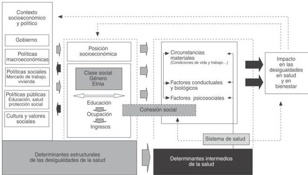

# El imaginario de la horizontalidad como instrumento de subordinación: la Política de Salud pueblos indígenas en el multiculturalismo neoliberal chileno¹

The imaginary of horizontality as an instrument of subordination: the indigenous’ peoples health policy in Chile’s neoliberal multiculturalism

**Carlos Piñones Rivera**

Universidad Arturo Prat. Iquique, Chile
E-mail: carlospinonesrivera@gmail.com

**Miguel Mansilla Agüero**

Universidad Arturo Prat. Iquique Chile
E-mail: mansilla.miguel@gmail.com

**Rodrigo Arancibia Campos**

Cooperativa Apacheta. Iquique, Chile
E-mail: arancibiacampos@gmail.com

## Resumen

El artículo desarrolla un análisis documental de la Política de Salud Pueblos Indígenas chilena desde la Antropología Médica Crítica. Entendiendo las políticas públicas como producciones ideológicas, la contextualiza en la apuesta gubernamental del “Multiculturalismo neoliberal”, analizando el sentido que en ese marco tienen los ejes de *interculturalidad, equidad y participación*, mostrando el carácter socioculturalista y voluntarista de los diagnósticos y abordajes que la constituyen. Desde un análisis de relaciones de hegemonía/subalternidad, muestra como la ahistoricidad que la caracteriza permite la producción de un *imaginario de la horizontalidad* en contextos de asimetría de poder, cumpliendo la función ideológica de sostener a la salud intercultural como respuesta ante el problema de la inequidad en salud, opacando la participación que esta política tiene en el proceso de producción de la misma inequidad. Se concluye interrogando la pertinencia de una política construida desde otros supuestos ideológicos.

**Palabras clave:** Salud de Poblaciones Indígenas; Políticas Públicas de Salud; Determinantes Sociales de la Salud; Diversidad Cultural; Chile.

## Correspondencia

Carlos Piñones Rivera
Av. Arturo Prat 2120. Iquique, Chile. 110000

¹ Este artículo es un resultado parcial de la Tesis doctoral *La Mala Hora* financiada por el sistema Becas-Chile del Programa de Formación de Capital Humano Avanzado de la Comisión Nacional de Investigación Científica y Tecnológica (CONICYT), Chile.

DOI 10.1590/S0104-12902017169802

Saúde Soc. São Paulo, v.26, n.3, p.751-763, 2017 751
## Abstract

This paper develops an analysis of documentary sources of chilean's Public Health Policy of Indigenous Peoples from a critical medical anthropology standpoint. Understanding public policy as ideological productions, it analyses the axis of interculturality, equity and participation in the context of Chile's governmental "Neoliberal multiculturalism", showing the socioculturalism and voluntarism that guide their diagnoses and actions. From an analysis of hegemony/subalternity relationships, it shows how de-historization allows the production of horizontality imaginary in contexts of power asymmetry, fulfilling the ideological function to support intercultural health as an answer to the problem of health inequity, darkening the participation that this policy has in the process of the same inequity's production. In the end, we conclude by asking the significance of a policy constructed from other ideological assumptions.

**Keywords:** Health of Indigenous Peoples; Public Health Policy; Social Determinants of Health; Cultural Diversity; Chile.

## Introducción

Existe copiosa evidencia de que uno de los grupos principalmente afectados por la inequidad en salud en todos los conjuntos sociales son los Pueblos Originarios, evidenciándose en las brechas que se descubren en los perfiles epidemiológicos (Gracey; King, 2009; Chile, 2007). En virtud de esto, la comunidad internacional realiza iniciativas fuertemente impulsadas por la Resolución V de la OMS, denominada "Salud de los Pueblos Indígenas" (Organización Panamericana de la Salud, 1993). Desde el año 1996 se crea en Chile el Programa Especial de Salud Pueblos Indígenas (PESPI), con el objetivo de disminuir las brechas en salud, y el 2003 ve la luz la Política de Salud Pueblos Indígenas¹. A pesar de que han transcurrido más de 20 años de la creación del PESPI, existen muy pocos análisis de la lógica y supuestos técnicos e ideológicos de estas políticas (Boccara, 2007; Cuyul Soto, 2013).

El presente artículo, que resulta del análisis documental para la tesis doctoral "La Mala Hora" (Piñones Rivera, 2015), realiza un análisis de los supuestos ideológicos de la Política y del PESPI desde el punto de vista de la Antropología Médica Crítica (AMC), buscando mostrar cómo éstos introducen sesgos que participan en la producción de algunas de las principales dificultades presentes en el proceso de disminución de las brechas de salud de los Pueblos Originarios en Chile.

## Materiales y métodos

El artículo se basa en un análisis documental crítico de la Política (2003). Utiliza como material complementario documentos oficiales que forman parte de la implementación del PESPI a nivel nacional y regional y que fueron recopilados como parte del trabajo etnográfico realizado entre los años 2011 y 2012 (Piñones Rivera, 2015): Resoluciones exentas (Chile, 2013), Protocolos y sistematizaciones de experiencias (Franchi et al., 2011; Chile, 2006a), Normas administrativas de interculturalidad (Chile,

¹ En adelante "la Política".

752 Saúde Soc. São Paulo, v.26, n.3, p.751-763, 2017

DOI 10.1590/S0104-12902017169802
2006c), Informes epidemiológicos y sobre situación de salud (Chile, 2009, 2010a), Orientaciones para la planificación en red (Chile, 2010b).

El análisis busca comprender la lógica argumentativa que estructura la Política y el PESPI: cuál es el diagnóstico que hace del proceso salud/enfermedad/atención, cuáles los objetivos que se plantean y cuáles las directrices ideológicas de su diseño. Realizado desde la perspectiva teórica de la AMC, entendemos las políticas públicas como producciones ideológicas, por lo que contextualizamos la Política en la apuesta gubernamental chilena del “multiculturalismo neoliberal”, e interrogamos el tratamiento dado al problema de la producción de relaciones de hegemonía/subalternidad.

## El multiculturalismo neoliberal como contexto gubernamental

Para comprender la Política es preciso situarla en su marco económico-político concreto. Desde los gobiernos de la Concertación (1990) hasta hoy, la relación del Estado chileno con los Pueblos Originarios se ha formulado a través de políticas de reconocimiento enmarcadas en el multiculturalismo neoliberal (Boccara, 2007; Boccara; Bolados, 2008; Díaz-Polanco, 2007; Hale, 2002; Ramírez Hita, 2011). Como racionalidad gubernamental, el multiculturalismo neoliberal se distingue de sus predecesoras en que no rechaza la diferencia cultural, sino que la reconoce y valora, pero siempre en los márgenes de una lógica de la administración de la diferencia o de dominación de la diversidad (Díaz-Polanco, 2007). Esto pues es un “peculiar enfoque teórico-político, que contiene una concepción acerca de qué es la diversidad y cómo ésta debe insertarse en el sistema de dominación; y que consecuentemente, recomienda un conjunto de prácticas o ‘políticas públicas’ que deben adoptarse respecto de las diferencias (‘políticas de identidad’)” (Díaz-Polanco, 2007, p. 172-173).

Las políticas que emanan de dicho multiculturalismo pueden ser caracterizadas por medio de tres rasgos principales: se presentan como políticas de reconocimiento; invisibilizan el problema de la producción neoliberal de la desigualdad; e incentivan la participación de la sociedad civil.

1) Las políticas de reconocimiento multicultural neoliberal consisten en un reconocimiento restrictivo que, a la vez que confiere una legitimidad institucional, adecúa las demandas y expresiones de los Pueblos Originarios a aquellas que son acordes con el individualismo liberal (Hale, 2002). En la práctica, esto implica una restricción de los derechos colectivos a los derechos individuales (Stavenhagen, 1992). De esta manera el multiculturalismo neoliberal no sólo reconoce, sino que re-constituye a su imagen las reivindicaciones, creando una escisión entre aquellas legitimadas (lo que se ha denominado el “indio permitido”), y otras penalizadas (Hale, 2002).
2) El uso que el multiculturalismo neoliberal hace de la diferencia, acotándola como cuestión cultural, evita el problema de la desigualdad como jerarquización y estratificación de las diferencias. Como señala Díaz Polanco, la acentuación del reconocimiento evita cualquier consideración del problema de la desigualdad en tanto producto directo del sistema neoliberal, excluyendo del campo de discusión el problema de la redistribución, cuya sola inclusión denuncia la desigualdad y apela a relaciones igualitarias (Díaz-Polanco, 2007). El multiculturalismo se muestra como nueva forma de socioculturalismo, pues al centrarse en lo simbólico hace la ficción de que lo social y lo económico político no tuvieran incidencia (Onoge, citado en Singer, 1990, p. 179).
3) Su tercera característica es el incentivo a la participación. No obstante, ésta está condicionada pues genera la impresión de que a través de ella se están definiendo las políticas públicas, cuando en realidad les hace parte de una agenda previamente definida. Esta participación “domesticada” tiene la función de restringir la movilización social, canalizando la energía perturbadora que le es propia y de responsabilizar a los sujetos de su inserción en el mercado, consiguiendo que se autogobiernen: se trata de “dominar a través de la participación” (Boccara; Bolados, 2008; Hale, 2002).

DOI 10.1590/S0104-12902017169802

Saúde Soc. São Paulo, v.26, n.3, p.751-763, 2017 753
El multiculturalismo neoliberal, así caracterizado, constituye el marco económico-político en el cual ha sido formulada la Política. Se elaboró con el propósito de “contribuir al mejoramiento de la situación de salud de los Pueblos Originarios, a través del desarrollo progresivo de un modelo de salud con enfoque intercultural que involucre su activa participación en la construcción, ejecución, control y evaluación del proceso” (Chile, 2006b, p. 23). Para dar cumplimiento al mismo, se definieron los ejes de *Equidad, Interculturalidad y Participación*, cuyo desarrollo es planteado como transversal en los distintos ámbitos de gestión en salud pública (Chile, 2006b).

El principal instrumento de materialización de la política lo constituye el Programa Especial de Salud Pueblos Indígenas (PESPI). A nivel regional y local es la instancia gubernamental técnica de la cual dependen directamente las denominadas “experiencias” de salud intercultural, que se despliegan a lo largo del territorio chileno, siendo por tanto el marco gubernamental concreto desde el cual son orientadas técnicamente y financiadas.

## Un programa socioculturalista para la inequidad en salud: el PESPI

### El diagnóstico socioculturalista

El problema que el PESPI trata de abordar es el de la *inequidad* en Salud de los Pueblos Originarios. El diagnóstico que lo funda muestra perfiles epidemiológicos en significativa desventaja en comparación con los no-indígenas. Esta realidad unida a la persistencia de identidades, así como de prácticas y conocimientos tradicionales específicos en salud, permiten concluir la necesidad de un abordaje específico en salud para los Pueblos Originarios².

El PESPI busca contribuir con la disminución de esta brecha, considerando la especificidad cultural de

los Pueblos Originarios. En virtud de esta orientación general, una serie de conceptos, como los de *salud intercultural, pertinencia cultural, reconocimiento de sistemas culturales en salud o complementariedad de sistemas médicos*, son utilizados imprimiendo una orientación específica al abordaje de los problemas de salud de los Pueblos Originarios.

Como adelantábamos, la orientación específica que asume el PESPI, lejos de ser neutral, es subsidiaria del multiculturalismo neoliberal. Los principales elementos ideológicos que definen su formulación conceptual son coherentes con él, y, por tanto, establecen las racionalidades diagnósticas así como las lógicas de intervención que lo estructuran, según mostraremos a continuación.

1) El piso ideológico desde el cual se piensa el problema de la inequidad en salud de los Pueblos Originarios es el *individualismo biomédico*, es decir, la ideología médica consistente con el liberalismo de mercado, que concibe a los sujetos como consumidores, que realizan elecciones racionales libres, negando o relegando a un segundo plano cualquier tipo de constricción social, y que entiende la salud/enfermedad como proceso eminentemente individual, biológico, que descansa en la susceptibilidad y la genética como predisposición, haciendo abstracción del contexto y por lo tanto de la producción sociocultural y económico-política de la enfermedad, pues comprende la colectividad como suma de individuos cuya historia colectiva deviene irrelevante para el proceso salud/enfermedad/atención (Fee; Krieger, 1993). La abstracción que el individualismo biomédico hace del contexto le exige buscar un suplemento que le permita abordar la diferencia cultural característica de los Pueblos Originarios frente al saber biomédico. Dicho

2 “Según datos provenientes de los perfiles epidemiológicos realizados, los problemas de salud de los pueblos indígenas muestran una fuerte tendencia de desigualdad en la situación de salud de estos pueblos respecto de los no indígenas, a lo anterior se suma el hecho de que los pueblos indígenas continúan con sus propios patrones culturales, aún después de 500 años de dominación colonial, sin haber perdido por ello su identidad y el sistema de conocimientos y prácticas, en el ámbito de la salud. En definitiva la brecha epidemiológica que deja en evidencia la ejecución de estos estudios nos lleva a plantear la necesidad de trabajar estos insumos e incorporarlos en las líneas de trabajo de los equipos de salud, situación que aportará a hacer más pertinente la atención de salud brindada a la población a nivel de la Red Asistencial” (Chile, 2013, p. 4).

754 Saúde Soc. São Paulo, v.26, n.3, p.751-763, 2017

DOI 10.1590/S0104-12902017169802
suplemento lo constituye una aproximación de tipo socioculturalista, que reduce y relega a un segundo plano los múltiples procesos sociales, culturales y económico-políticos a través de una concepción restrictiva de lo “cultural”, que pasa a ser así el principio rector de los análisis y propuestas programáticas. Dicha concepción restrictiva de lo cultural permite abordar la inequidad dentro de una lógica neoliberal porque la reduce a diferencia cultural.

2) Un segundo elemento lo constituye la identificación que realiza el PESPI entre el problema de la inequidad en salud y el de la inequidad en atención. Así excluye toda una serie de procesos previos, simultáneos o posteriores a la atención, que podrían estar incidiendo en la producción de la inequidad en salud de los Pueblos Originarios: por ejemplo, la inscripción de derechos consuntivos para las aguas subterráneas con fines de uso minero en zonas de dominio superficial agrícola

(Gentes, 2002) o la negligencia frente a los altos niveles de arsénico en el agua de consumo (Marshall et al., 2007), entre muchos otros. La lógica reduccionista queda clara en los siguientes párrafos: “La equidad apunta a la construcción, a partir de acciones concretas, de un sistema de salud que disminuya efectivamente las brechas de equidad en la situación de salud entre sectores sociales, áreas geográficas y comunas. Ello significa generar acciones en el ámbito de mejoría del acceso, de la calidad, cobertura y efectividad de la atención de salud de los pueblos indígenas” (Chile, 2013, p. 6, cursivas nuestras). Como se observa, no se refiere ningún otro tipo de acciones a nivel socioeconómico, político, ambiental etc. El problema de la equidad es planteado, de manera restrictiva, como el problema de la implementación de acciones en la atención de salud, que constituye sólo una mínima fracción de los procesos considerados, incluso por las concepciones hegemónicas (Cfr. Figura 1).

Figura 1 – Determinantes sociales de la salud según la comisión de determinantes sociales de la OMS

Fuente: Solar e Irwin citado en Borrel y Artazcoz (Borrell; Artazcoz, 2008, p. 466).

DOI 10.1590/S0104-12902017169802

Saúde Soc. São Paulo, v.26, n.3, p.751-763, 2017 755
3) Más aún, el problema ya restringido de la atención de salud es nuevamente acotado como un problema de *acceso* a la atención, soslayando la discusión respecto de la idoneidad de la estructura misma de la atención de salud como medio para garantizar el derecho a la salud, en un sistema regido por una lógica neoliberal (Homedes; Ugalde, 2001, 2002, 2010).

En el caso específico de los Pueblos Originarios, el socioculturalismo viene a apoyar la conceptualización de las brechas de *acceso* como resultado de *barreras culturales*. El supuesto aquí es que ya sea bajo la forma de la discriminación, la falta de sensibilidad, las deficiencias en las capacidades comprensivas del personal, la ausencia de señalética en lenguas originarias, el desconocimiento de los conceptos de salud-enfermedad de la medicina tradicional, entre otros, las *barreras culturales* tendrían un peso especial tratándose de ellos:

Los pueblos originarios describen un trato discriminatorio cuando acuden a hospitales o centros de salud, esta discriminación es doble, pues a la condición indígena se suma la situación de empobrecimiento que han sufrido las comunidades. Respecto de los integrantes de los equipos de salud deben tener conocimiento y valoración de la cultura, lenguaje y medicina indígena. (Chile, 2006b, p. 17)

Por supuesto, no negamos que los elementos así conceptualizados puedan tener valor significativo, pero de esto no se sigue que la iniciativa gubernamental se tenga que reducir a este limitado aspecto del amplio problema de la producción de inequidad en salud de los Pueblos Originarios. Lo que observamos concretamente es que, de manera consecuente con el supuesto socioculturalista aquí analizado, *todas* las iniciativas del PESPI están orientadas a reducir la inequidad en salud por medio de acciones focalizadas hacia la disminución de dichas barreras culturales, haciendo gala nuevamente de un sentido restrictivo de lo cultural.

## Un abordaje voluntarista

En el diseño de la política, el socioculturalismo que analizamos viene consagrado a través de uno de sus ejes rectores y transversales: el de la interculturalidad. La *interculturalidad socioculturalista* se plasma principalmente a través de tres sentidos diversos:

1) Pertinencia cultural: se refiere a cierta adecuación de las acciones de atención a la *especificidad cultural* de los pacientes y comunidades. En el ámbito de la salud, asume frecuentemente la forma de acciones de capacitación tendientes a sensibilizar al personal de salud frente a la diferencia cultural de los atendidos (por ejemplo, respecto de la cosmovisión, la lengua o formas de vida diversas).

La interculturalidad en salud conlleva los siguientes elementos: - Integralidad en el concepto de salud-enfermedad. [...] - Visión holística. - Oferta de servicio regular, equitativa y con pertinencia cultural. - Personal de salud calificado y sensible a las necesidades de salud de la población. La capacitación aborda sistemáticamente la diversidad y problemática local en materia de salud. - Colaboración entre sistemas médicos oficial e indígena. (Chile, 2013, p. 21)

Más escasamente, el concepto de pertinencia también alude a la adecuación de la atención a los perfiles epidemiológicos específicos: “La incorporación de esta variable en los planes de salud comunal es una herramienta que permitirá la adecuación y pertinencia de las estrategias y actividades a nivel local a las necesidades de los pueblos indígenas” (Chile, 2013, p. 32).

2) Reconocimiento: es la admisión que la política hace de la diversidad en materia de conocimientos y prácticas de salud. En general es utilizado para referirse a los “sistemas culturales de salud” o a los

756 Saúde Soc. São Paulo, v.26, n.3, p.751-763, 2017

DOI 10.1590/S0104-12902017169802
“agentes de medicina indígena”. Debido a los tratados internacionales se expande hacia una declaración de voluntad de protección y fortalecimiento de los mismos:

El Estado de Chile, de conformidad con las normas legales vigentes y tratados internacionales promulgados como ley de la República, se encuentra en el deber de respetar, reconocer y proteger los sistemas de salud de los pueblos indígenas. [...] Apoyar procesos orientados al reconocimiento, salvaguarda, fortalecimiento y complementariedad de los sistemas culturales de salud de los pueblos indígenas (Chile, 2013, p. 4).

3) Complementariedad: supone la exigencia de trabajar con los “agentes de medicina indígena” para los fines de la atención de salud. Implica además del reconocimiento una voluntad de trabajo colaborativo. Así, en el apartado donde se definen los elementos de la interculturalidad en salud se señalan: “Sistema de salud incluyente, abierto, que reconoce, respeta y aplica concepciones y prácticas de salud de otras culturas [...] - Colaboración entre sistemas médicos oficial e indígena” (Chile, 2006b, p. 21). Considerando la relevancia que este punto tiene para nuestro argumento global, tendremos ocasión de desarrollarlo en el siguiente acápite. Dado que el diagnóstico y el diseño de la política y del PESPI son conceptualizados desde esta matriz ideológica socioculturalista, las respuestas a la inequidad redundan en un cierto voluntarismo que queda expresado como sigue:

La interculturalidad apunta a un cambio de actitud y a un cambio cultural en el sistema de salud, que permite abordar la salud desde una perspectiva amplia y establecer otras redes de trabajo para proveer servicios acordes a las necesidades de los Pueblos Originarios, respetando la diversidad cultural (Chile, 2006b, p. 20, cursivas nuestras).

Ahora bien: ¿Respecto de qué elementos se plantean los cambios? ¿Cuáles son sus alcances propuestos? ¿Quiénes son conminados a producirlos? La interculturalidad apunta a un cambio de actitud y a un cambio cultural, lo que ya establece restricciones bastante amplias para el campo de la salud de los Pueblos Originarios pues desenfoca los cambios burocráticos, estructurales, económico-políticos. Parafraseando la cita anterior, los cambios actitudinales y culturales en mente no se refieren al individualismo biomédico y su socioculturalismo suplementario que, según venimos analizando, constituyen importantes fundamentos ideológicos de su aproximación.

En vez de esto, los cambios son referidos al personal de salud, que es exhortado a analizar críticamente sus conocimientos y prácticas en tanto vehiculizadores de barreras culturales al interior de un sistema de salud que se orienta por una política que no realiza dicho análisis crítico respecto de los elementos estructurales e ideológicos que lo conforman.

Es el recurso humano con sus conocimientos, habilidades y destrezas el que permitirá avanzar en la implementación del nuevo modelo de atención; para ello se requiere que el personal de salud tenga la oportunidad de capacitarse, como asimismo, que las nuevas generaciones de egresados de las universidades e institutos de formación técnica hayan sido preparadas para asumir sus nuevos roles. Junto a las dificultades de acceso a salud de algunas comunidades por razones geográficas, existe desconocimiento del personal de salud en relación a la cultura de las comunidades indígenas, y práctica de la medicina tradicional indígena, lo que hace aumentar los problemas de acceso y calidad de la atención. Frente a las barreras culturales en el acceso, se debe contar con un recurso humano calificado, sensible y respetuoso a la diversidad cultural y de las necesidades de los usuarios. La capacitación de todo el personal de salud debe considerar tanto a aquellos que se desempeñan en comunas con alta concentración de población indígena como a los funcionarios del nivel central, para lo cual será necesario desarrollar procesos de educación permanente, donde debe abordarse sistemáticamente la cultura y problemática local en materia de salud, logrando así una

DOI 10.1590/S0104-12902017169802

Saúde Soc. São Paulo, v.26, n.3, p.751-763, 2017 757
provisión de servicios con pertinencia cultural. (Chile, 2006b, p. 36)

Articulando el análisis del socioculturalismo y el voluntarismo característicos de la Política y del PESPI, lo que aparece es que el sistema de salud sólo está dispuesto a hacer las modificaciones que calcen dentro de un concepto de pertinencia restringido a lo cultural, y guiadas por el supuesto voluntarista del perfeccionamiento del “capital humano” para la superación de las barreras culturales en atención, antes que por una apuesta de modificación de la estructura ideológica y burocrática, que prácticamente permanece indemne.

En tanto el voluntarismo del PESPI supone que los problemas de la interculturalidad son salvables primordialmente a través de la capacitación y sensibilización del personal institucional, oculta que uno de los principales obstáculos en los procesos de articulación es la misma estructura burocrática del Estado en tanto supone una asimetría de poder y una resistencia a dicha transformación (Cuyul Soto, 2013; Knipper, 2006; Menéndez, 2006; Piñones Rivera, 2015; Ramírez Hita, 2011).

### La horizontalidad en un contexto de asimetrías de poder

Si la pertinencia y el reconocimiento invocados por el socioculturalismo resultan en un voluntarismo, el análisis de la complementariedad nos llevará a descubrir otros rasgos estructurales del diseño de la política: su negación de la asimetría de poder y su ahistoricidad.

Es importante analizar cómo se conceptualizan la colaboración y/o complementariedad pues más allá de la voluntad de trabajo conjunto entre los agentes de salud (ej. el ginecólogo y la usuyiri),³ lo que hay que interrogar son las condiciones políticas e institucionales que estructuran las relaciones entre los saberes médicos de los Pueblos Originarios y el saber biomédico, como parte de la relación más amplia que existe entre el Estado y los Pueblos Originarios.

¿Cómo se conceptualizan la complementariedad y colaboración? La mayoría de las veces que se

utilizan estos términos se refieren específicamente a las relaciones entre los “sistemas médicos” oficial e indígena. Así se recorta un espacio de relación entre los saberes médicos en el que se construye un imaginario ideológico normativo, un deber ser para la interculturalidad en que las relaciones deben estar guiadas por el respeto, el reconocimiento, la colaboración y la complementariedad, llegando incluso a hablarse en la Política de horizontalidad como una de las principales características de la interculturalidad:

La interculturalidad será entendida como un proceso social interactivo, de *reconocimiento, respeto, horizontalidad y colaboración* entre dos o más culturas, en un espacio determinado. Interculturalidad significa entonces la promoción de relaciones de confianza, reconocimiento mutuo, comunicación efectiva, cooperación y convivencia; y derecho a la diferencia (Chile, 2006b, p. 21, cursivas nuestras).

Este imaginario de la horizontalidad, no obstante, es tensamente producido pues se construye en un terreno de asimetría de poder:

El enfoque intercultural en salud releva el reconocimiento y respeto de las singulares y diversas características de cada pueblo originario y pretende crear un ambiente *donde estas diferencias puedan coexistir* y aportar a la mayoría de la salud de todos, *aun cuando se da en un escenario no resuelto de asimetrías de poder, en lo que se refiere a la hegemonía del sistema médico oficial* (Chile, 2006b, p. 21, cursivas nuestras).

La inclusión del problema de las “asimetrías de poder” constituye aquí una excepción, pues no se aborda ni con insistencia ni menos de manera sistemática, asumiendo implícitamente que no es un elemento relevante de la producción de inequidad en salud. En efecto, en el texto del PESPI es totalmente excluida la asimetría de poder, no apareciendo ni una vez mencionada (Chile, 2013).

³ Ay. Partera.

758 Saúde Soc. São Paulo, v.26, n.3, p.751-763, 2017

DOI 10.1590/S0104-12902017169802
Lejos de realizar una propuesta que incluya un análisis de la incidencia de dicha asimetría de poder, lo que la Política confiere es un imaginario de horizontalidad, en que prima un voluntarismo del “afán de diálogo y cooperación”, de la “buena voluntad” o de la buena fe, como si la historia de dicha relación recién partiera, o como si la voluntad de diálogo fuera suficiente para contrarrestar el poder de un aparato estatal cuyas estrategias han tendido más bien a una restricción de los derechos indígenas en su adecuación al molde neoliberal (Boccara; Bolados, 2008; Organización de las Naciones Unidas, 2009; Toledo Llancaqueo, 2007).

Al respecto, nos parece esclarecedor desgajar el discurso de la complementariedad en dos niveles: el de las relaciones entre los saberes médicos y el de las relaciones entre el Estado y los Pueblos Originarios. Así resulta interesante observar que, mientras la conceptualización de las relaciones se restringe al espacio de articulación entre saberes médicos, es posible sostener cierto imaginario de la horizontalidad, que se hace poco viable cuando lo que se aborda es directamente la relación entre el Estado y los Pueblos Originarios. Nos parece que esta es una de las razones centrales por las cuales prácticamente no se aborda las relaciones de asimetría de poder entre los Pueblos Originarios y el Estado, en una política destinada a los primeros.

En efecto, son pocas las ocasiones en que la colaboración y complementariedad dejan de referirse a los “sistemas médicos” para aludir a procesos “entre las culturas”.

Cuando esto ocurre, la colaboración y complementariedad supuestas no pueden sino parecer eufemismos, a la luz de la historia de las políticas del Estado chileno en su relación con los Pueblos Originarios (Bengoa, 2004; Boccara; Seguel-Boccara, 1999).

La producción de este análisis comparativo sobre la sostenibilidad de un imaginario de la horizontalidad, según si se trata de la conceptualización de los saberes médicos o de la relación entre el Estado y los Pueblos Originarios, nos descubre que la tensión presente en la política resulta, al menos parcialmente, de una *negación de la asimetría de poder* en las relaciones entre el Estado y los Pueblos Originarios, y por extensión, entre los saberes médicos indígenas

y biomédico. Por este medio se produce una discontinuidad discursiva entre ambos niveles, inexistente en la práctica, en tanto la relación entre el Estado y el saber biomédico desequilibra la supuesta horizontalidad entre los saberes médicos.

Esta negación de la asimetría de poder tiene efectos directos en el espacio de la interculturalidad, ya que por esta vía el Estado desconoce su parcialidad a favor de la biomedicina (asumida como racionalidad burocrática gubernamental específica respecto del Proceso Salud/Enfermedad/Atención) (Broom; Doron; Tovey, 2009; Freidson, 1978), mientras que el saber biomédico desconoce su funcionalidad hacia el Estado respecto a sus intereses de despolitización del proceso salud/enfermedad/atención, de negación de la determinación socio-cultural y económico-política del padecimiento social, así como de la dimensión de historicidad que lo conforma (Menéndez, 2006).

Varios autores han planteado que, lejos de dicha horizontalidad, la salud intercultural se constituye como un espacio de producción y reproducción de relaciones de hegemonía/subalternidad por medio de procesos de subalternización que obedecen a dimensiones ideológicas, burocráticas, económicas, políticas, de control social entre otras (Boccara, 2007; Boccara; Bolados, 2008; Cuyul Soto, 2009; Knipper, 2006; Menéndez, 2006; Piñones Rivera, 2015).

¿Cómo se produce dicha opacidad que invisibiliza las asimetrías de poder y permite producir un imaginario de la horizontalidad? Uno de los soportes para este acto de soslayo es la ahistoricidad omnipresente en la Política y el PESPI. Desde esta ahistoricidad se pueden elaborar ideas claves como la siguiente: “La perspectiva intercultural en salud pone el énfasis en el *proceso de encuentro* de las diversas culturas que conviven en un territorio, para coordinar acciones y esfuerzos en la solución de problemas comunes” (Chile, 2006b, p. 21, cursivas nuestras).

Si, al contrario, se considera la historia de las relaciones del Estado chileno con los Pueblos Originarios, uno tendría que plantear que ese eufemísticamente llamado “proceso de encuentro” no se da sólo hoy en el seno de una política de salud como encuentro prescriptivamente horizontal de distintas culturas médicas, sino que se inscribe

DOI 10.1590/S0104-12902017169802

Saúde Soc. São Paulo, v.26, n.3, p.751-763, 2017 759
en una larga historia de relaciones de hegemonía/subalternidad (Bengoa, 2004; Boccara; Seguel-Boccara, 1999), de las cuales el multiculturalismo neoliberal se distingue en tanto valora la diferencia cultural, pero siempre bajo el mismo objetivo genérico de control de las demandas de los Pueblos Originarios (Boccara; Bolados, 2008; Boccara; Seguel-Boccara, 1999).

Dado que este segundo nivel de análisis es sistemáticamente excluido del diagnóstico, diseño e implementación, lo que se produce es una negación formal de que la interculturalidad sea un espacio de producción de inequidad. De esta manera, el desconocimiento de las relaciones de hegemonía/subalternidad entre el Estado y los Pueblos Originarios produce la ilusión política de que el primero puede relacionarse con los pueblos desde una horizontalidad: así como el saber biomédico podría entrar en un diálogo horizontal con los saberes médicos de los Pueblos Originarios, el Estado podría resignar su poder para dialogar horizontalmente con ellos.

Esto nos parece que constituye el efecto ideológico central del proceso: la producción de un terreno ideológico en el cual la interculturalidad es sostenida con carácter de evidencia como respuesta al problema de la inequidad, opacando la participación que esta política tiene en el mismo proceso de producción de inequidad, cuya continuidad relativa se descubre desde una historización de las relaciones entre el Estado de Chile y los Pueblos Originarios confinados en el territorio en que hoy ejerce su soberanía.

## Conclusión

El multiculturalismo neoliberal del Estado chileno se expresa en el socioculturalismo de la Política y el PESPI, consistente en reducir el problema de la equidad en salud de los Pueblos Originarios al de las *barreras culturales* que restringen el acceso a la atención en la salud pública chilena. Dicho programa y la política en que se basa están atravesados por una tensión entre la asunción/desconocimiento de las relaciones de hegemonía/subalternidad entre el Estado y los Pueblos Originarios. A través de una aproximación ahistoricista, la Política y el PESPI han establecido un imaginario de horizontalidad

entre los saberes médicos, que cumple una función política de desconocimiento del rol mismo del Estado en la conformación de la asimetría y subordinación de los saberes médicos de los Pueblos Originarios, que a su vez forma parte de la subordinación más amplia que el Estado establece respecto de los Pueblos Originarios en el seno del modelo económico neoliberal chileno.

El que un programa que se propone enfrentar la inequidad del proceso salud/enfermedad/atención no incluya en su análisis la historia de las relaciones entre el Estado y los Pueblos Originarios, así como el rol que la producción de relaciones de hegemonía/subalternidad cumple en la producción/reproducción de la inequidad en la salud de los Pueblos Originarios, es sintomático del tipo de enfoque utilizados por la Política y el PESPI. Pues es claro que sólo desde ciertas perspectivas específicas es posible producir dicho escotoma, mostrando la importancia que la teoría tiene en la consideración del proceso salud/enfermedad/atención (Krieger, 2011).

Aquí se descubren operando el ahistoricismo, esencialismo y determinismo biológico propios del modelo médico hegemónico (Menéndez, 2008), que, excluyendo la dimensión económico-política del proceso salud/enfermedad/atención, marginan de la reflexión el rol que el mismo socioculturalismo de la Política juega en la conformación del proceso salud/enfermedad/atención como proceso histórico, opacando su contribución a la producción y reproducción de la inequidad en salud que afecta a los Pueblos Originarios.

Al contrario, otras aproximaciones como la Salud Colectiva (Osmo; Schraiber, 2015), AMC (Singer, 1990; Menéndez, 2006), Epidemiología Sociocultural (Menéndez, 2008), Epidemiología Eco-Social (Krieger, 2011), Epidemiología Crítica (Breilh, 2003), entre otras, conciben el proceso salud/enfermedad/atención como proceso socialmente estratificado que participa en la producción y reproducción biosocial en su integralidad, no sólo bio-psico-social, sino también cultural (ideológica) y económico-política (Breilh, 2003; Krieger, 2011; Menéndez, 2008; Piñones Rivera, 2015). Desde estas miradas se incluye, por supuesto, la importancia de las “barreras culturales”, pero se entiende que estas no son suficientes para abordar

760 Saúde Soc. São Paulo, v.26, n.3, p.751-763, 2017

DOI 10.1590/S0104-12902017169802
el problema de las brechas de inequidad en salud para los pueblos indígenas.

Una aproximación basada en estas perspectivas incluiría, entre otros elementos relevantes a escala nacional y local, la segmentación neoliberal de la calidad de atención en salud según nivel de ingreso (Cid, 2008); el daño producido a las comunidades a través del código de aguas, por la cesión de los derechos de agua a megaproyectos con autorización de explotación completa de las fuentes de agua sin definición de caudales ecológicos (Gentes, 2002); las normativas sobre pesticidas que autorizan en Chile el uso de tóxicos prohibidos en la mayoría de los países del norte global (Muñoz Quezada, 2011); la negligencia en el tratamiento del problema del arsénico en el agua y su incidencia en las altas tasas de cáncer (Marshall et al., 2007); entre otros problemas que desbordan claramente lo que cabe dentro de la noción de barreras culturales y que brillan por su ausencia en la materialización de la Política.

Al abordar las brechas de salud entre los Pueblos Originarios, nos parece teórica y éticamente pertinente incluir todas estas dimensiones, o al menos considerarlas dentro del análisis para la definición de la estrategia más efectiva y justa, siendo cuestionable que una aproximación socioculturalista prolifere soslayando las condiciones socioeconómicas y políticas que inciden en el proceso salud/enfermedad/atención. Si de pertinencia se trata, consideramos que es importante que el abordaje de la inequidad en salud de los pueblos indígenas sea pertinente no sólo en términos culturales, sino también socioeconómicos, políticos, ecológicos, históricos etc.

Reduciendo la desigualdad a la diferencia, la complejidad biosocial a un concepto restringido de cultura, la integralidad del proceso salud/enfermedad/atención al problema de la atención de salud, el PESPI oblitera problemas centrales existentes hoy en día para los pueblos indígenas de Chile, que de maneras complejas están arraigados en la actual configuración económico-política neoliberal chilena.

El *leit motiv* de la complementariedad como horizonte de la participación opaca el reconocimiento de la producción de la inequidad al interior de las mismas relaciones de “interculturalidad” en salud.

Si bien esto plantea el problema empírico de cómo las acciones gubernamentales en el ámbito de la salud intercultural resultan en la producción de una condición subalterna para los saberes médicos, lo que aquí analizamos es la contribución que las exclusiones teórico-ideológicas, presentes en el diseño de la Política de Salud y Pueblos Indígenas y del PESPI, realizan a dicho proceso relacional, en su abordaje del problema de la inequidad en salud.

Algunas preguntas que nos surgen entonces en el marco de la interculturalidad en salud son: ¿Qué habría que modificar en la estructura burocrática del Estado y en la ideología biomédica de manera que la complementariedad no resultara en subalternización? ¿Por qué medios institucionales habría que contribuir al cambio en la asimetría de poder? Pues nos parece que difícilmente se modificará el carácter subordinante del proceso articulador si no se reflexiona en qué medida la ideología implícita en la burocracia de salud contribuye al establecimiento de los procesos de hegemonía/subalternidad. En el estado actual de cosas, nuestro análisis nos hace temer que el actual *reconocimiento* no está conduciendo a la salvaguarda y que la *complementariedad* tampoco está conduciendo a un *fortalecimiento* de los saberes médicos de los Pueblos Originarios, como lo ha pretendido la política sectorial.

## Referências

BENGOA, J. (Org.). *La memoria olvidada: historia de los pueblos indígenas de Chile*. Santiago: Cuadernos Bicentenario, 2004. (Serie Cuadernos bicentenario, 3).

BOCCARA, G. B. Etnogubernamentalidad: la formación del campo de la salud intercultural en Chile. *Chungará (Arica)*, Arica, v. 39, n. 2, p. 185-207, 2007.

BOCCARA, G. B.; BOLADOS, P. ¿Dominar a través de la participación? el neoindigenismo en el Chile de la posdictadura. *Memoria Americana*, Buenos Aires, v. 16, n. 2, p. 167-196, 2008.

BOCCARA, G. B.; SEGUEL-BOCCARA, I. Políticas indígenas en Chile (siglos XIX y XX): de la asimilación al pluralismo (el caso mapuche). *Revista de Indias*, Madrid, v. 59, n. 217, p. 741-774, 1999.

DOI 10.1590/S0104-12902017169802

Saúde Soc. São Paulo, v.26, n.3, p.751-763, 2017 761
BORRELL, C.; ARTAZCOZ, L. Las políticas para disminuir las desigualdades en salud. *Gaceta Sanitaria*, Barcelona, v. 22, n. 5, p. 465-474, 2008.

BREILH, J. *Epidemiología crítica: ciencia emancipadora e interculturalidad*. Buenos Aires: Lugar Editorial, 2003.

BROOM, A.; DORON, A.; TOVEY, P. The inequalities of medical pluralism: hierarchies of health, the politics of tradition and the economies of care in Indian oncology. *Social Science & Medicine*, Amsterdam, v. 69, n. 5, p. 698-706, 2009.

CHILE. Ministerio de Planificación. *Sistematización parto humanizado en población aymara: sistematización de un modelo de parto humanizado introducido en la maternidad del Hospital de Iquique*. Santiago: Mideplan, 2006a.

CHILE. Ministerio de Salud. *Resolución Exenta nº 91, de 10 de febrero de 2006*. Contribuye al mejoramiento de la situación de salud de los pueblos originarios, a través del desarrollo progresivo de un modelo de salud con enfoque intercultural que involucre su activa participación en la construcción, ejecución, control y evaluación del proceso. Santiago: Minsal, 2006b.

CHILE. Ministerio de Salud. *Resolución Exenta nº 261, de 28 de abril de 2006*. Aprueba norma general administrativa nº 16, sobre interculturalidad en los servicios de salud. Santiago: Minsal, 2006c.

CHILE. Ministerio de Salud. *Perfil epidemiológico básico de la población aymara de la provincia de Iquique*. Santiago: Minsal, 2007.

CHILE. Ministerio de Salud. *Diagnóstico de salud según enfoque de determinantes sociales región de Tarapacá*. Iquique: Minsal, 2009.

CHILE. *Diagnóstico de salud y calidad de vida: reporte PMG – gestión territorial*. Taparacá: Gobierno Regional de Tarapacá, 2010a.

CHILE. Ministerio de Salud. *Orientaciones para la planificación y programación en red año 2010*. Santiago: Minsal, 2010b.

CHILE. Ministerio de Salud. *Resolución Exenta nº 20, de 17 de enero de 2013*. Aprueba Programa Especial de Salud y Pueblos Indígenas “PESPI” 2013. Santiago: Minsal, 2013.

CID, C. Causas estructurales de los problemas de inequidad en el acceso a la salud en Chile. *Revista Chilena de Salud Pública*, Santiago, v. 12, n. 2, p. 103-109, 2008.

DÍAZ-POLANCO, H. *Elogio de la diversidad: globalización, multiculturalismo y etnofagia*. Ciudad de México, DF: Siglo XXI, 2007.

FEE, E.; KRIEGER, N. Public health then and now understanding aids: historical interpretations and the limits of biomedical individualism. *American Journal of Public Health*, Washington, DC, v. 83, n. 10, p. 1477-1486, 1993.

FREIDSON, E. *La profesión médica: un estudio de sociología del conocimiento aplicado*. Barcelona: Península, 1978.

GENTES, I. Estudio de la legislación oficial chilena y del derecho indígena a los recursos hídricos. In: WATER LAW AND INDIGENOUS RIGHTS, 2., 2002, Santiago. *WALIR studies*. Santiago: WALIR, 2002. p. 1-31.

GRACEY, M.; KING, M. Indigenous health part 1: determinants and disease patterns. *The Lancet*, London, v. 374, n. 9683, p. 65-75, 2009.

HALE, C. R. Does multiculturalism menace? governance, cultural rights and the politics of identity in Guatemala. *Journal of Latin American Studies*, Cambridge, v. 34, n. 3, p. 485-524, 2002.

HOMEDES, N.; UGALDE, A. Las reformas de salud en América Latina ¿éxito o fracaso? *Situa*, Cusco, v. 9, n. 18, p. 1-9, 2001.

HOMEDES, N.; UGALDE, A. Privatización de los servicios de salud: las experiencias de Chile y Costa Rica. *Gaceta Sanitaria*, Barcelona, v. 16, n. 1, p. 54-62, 2002.

HOMEDES, N.; UGALDE, A. Neoliberalismo y salud: el engaño del Banco Mundial y FMI. *Viento Sur*, Madrid, n. 109, p. 83-88, abr. 2010.

IQUIQUE. Subdirección de Gestión Asistencial. Servicio de Salud Iquique. *Protocolo de asistencia de parto integral con enfoque intercultural 2011-2013 (borrador)*. Iquique, 2011.

KNIPPER, M. El reto de la “medicina intercultural” y la historia de la “medicina

762 Saúde Soc. São Paulo, v.26, n.3, p.751-763, 2017

DOI 10.1590/S0104-12902017169802
tradicional” indígena contemporánea. In: FERNÁNDEZ JUÁREZ, G. (Org.) *Salud e interculturalidad en América Latina: antropología de la salud y crítica intercultural*. Quito: Abya-Yala, 2006. p. 413-432.

KRIEGER, N. *Epidemiology and the people’s health: theory and context*. New York: Oxford University Press, 2011.

MARSHALL, G. et al. Fifty-year study of lung and bladder cancer mortality in Chile related to arsenic in drinking water. *Journal of the National Cancer Institute*, Oxford, v. 99, n. 12, p. 920-928, 2007.

MENÉNDEZ, E. L. Interculturalidad, “diferencias” y antropología “at home”: algunas cuestiones metodológicas. In: FERNÁNDEZ JUÁREZ, G. *Salud e interculturalidad en América latina: antropología de la salud y crítica intercultural*. Quito: Abya-Yala, 2006. p. 51-66.

MENÉNDEZ, E. L. Epidemiología sociocultural: propuestas y posibilidades. *Región y Sociedad*, Hermosillo, v. 20, n. 2, p. 5-50, 2008. Edição especial.

MUÑOZ QUEZADA, M. T. Aspectos bioéticos en el control y aplicación de plaguicidas en Chile. *Acta Bioethica*, Santiago, v. 17, n. 1, p. 95-104, 2011.

ORGANIZACIÓN DE LAS NACIONES UNIDAS. Consejo de Derechos Humanos. *Promoción y protección de todos los derechos humanos, civiles, políticos, económicos, sociales y culturales, incluido el derecho al desarrollo:*

informe del Relator Especial sobre la situación de los derechos humanos y las libertades fundamentales de los indígenas, James Anaya. New York: ONU, 2009.

ORGANIZACIÓN PANAMERICANA DE LA SALUD. *Resolución V, de 28 de septiembre de 1993*. Salud de los pueblos indígenas. Washington, DC: OPS, 1993.

OSMO, A.; SCHRAIBER, L. B. O campo da saúde coletiva no Brasil: definições e debates em sua constituição. *Saúde e Sociedade*, São Paulo, v. 24, p. 205-218, jun. 2015. Suplemento 1.

PIÑONES RIVERA, C. *La mala hora: articulaciones en el pluralismo médico de agricultores precordilleranos aymaras chilenos*. 2015. Tese (Doutorado em Antropologia) - Universitat Rovira i Virgili, Tarragona, 2015.

RAMÍREZ HITA, S. *Salud intercultural: crítica y problematización a partir del contexto boliviano*. La Paz: ISEAT, 2011.

SINGER, M. Reinventing medical anthropology: toward a critical realignment. *Social Science & Medicine*, Amsterdam, v. 30, n. 2, p. 179-187, 1990.

STAVENHAGEN, R. Los derechos de los indígenas: algunos problemas conceptuales. *Nueva Antropología*, Ciudad de México, DF, v. 13, n. 43, p. 83-99, 1992.

TOLEDO LLANCAQUEO, V. Prima ratio: movilización mapuche y política penal: los marcos de la política indígena en Chile 1990-2007. *OSAL*, Buenos Aires, v. 8, n. 22, p. 253-275, 2007.

### Contribución de los autores

Piñones ha sido responsable del estudio y principal responsable de la redacción del artículo. Mansilla contribuyó con la redacción del artículo. Arancibia contribuyó con la asesoría sobre los aspectos técnicos jurídicos de la política analizada.

Recibido: 26/09/2016

Aceptado: 31/07/2017

DOI 10.1590/S0104-12902017169802

Saúde Soc. São Paulo, v.26, n.3, p.751-763, 2017 763