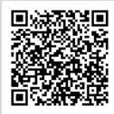

140 años Biblioteca del Congreso Nacional de Chile / BCN Ley Chile

# Decreto 21

APRUEBA REGLAMENTO SOBRE EL DERECHO DE LAS PERSONAS PERTENECIENTES A LOS PUEBLOS INDÍGENAS A RECIBIR UNA ATENCIÓN DE SALUD CON PERTINENCIA CULTURAL

MINISTERIO DE SALUD; SUBSECRETARÍA DE SALUD PÚBLICA

Fecha Publicación: 29-DIC-2023 | Fecha Promulgación: 03-JUL-2023

Tipo Versión: Única De : 30-DIC-2023

Url Corta: https://bcn.cl/3h9ca

APRUEBA REGLAMENTO SOBRE EL DERECHO DE LAS PERSONAS PERTENECIENTES A LOS PUEBLOS INDÍGENAS A RECIBIR UNA ATENCIÓN DE SALUD CON PERTINENCIA CULTURAL

Núm. 21.- Santiago, 3 de julio de 2023.

Visto:

Lo establecido en el decreto supremo N° 100, de 2005, del Ministerio Secretaría General de la Presidencia, que fija el texto refundido, coordinado y sistematizado de la Constitución Política de la República; en el decreto con fuerza de ley N° 1 del año 2005, que fija el texto refundido, coordinado y sistematizado del decreto ley N° 2.763 del año 1979 y de las leyes N°s. 18.933 y 18.469; en el decreto supremo N° 136 del año 2004, del Ministerio de Salud que aprueba el Reglamento Orgánico del Ministerio de Salud; el artículo 7 de la ley N° 20.584 que regula los derechos y deberes que tienen las personas en relación con acciones vinculadas a su atención de salud; la ley N° 19.253 que establece normas sobre protección, fomento y desarrollo de los indígenas, y crea la Corporación Nacional de Desarrollo Indígena, en particular lo dispuesto en sus artículos 1 y 34; el Convenio N° 169 sobre Pueblos Indígenas y Tribales en Países Independientes de la Organización Internacional del Trabajo, promulgado por decreto supremo N° 236 del año 2008, del Ministerio de Relaciones Exteriores; la Convención sobre los Derechos del Niño, promulgada por el decreto supremo N° 830 del año 1990, del Ministerio de Relaciones Exteriores; el Pacto Internacional de Derechos Económicos, Sociales y Culturales, promulgado por el decreto supremo N° 326 del año 1989, del Ministerio de Relaciones Exteriores; el decreto supremo N° 66 del año 2013, del Ministerio de Desarrollo Social, que aprueba reglamento que regula el procedimiento de consulta indígena; la resolución exenta N° 261 de fecha 28 de abril del año 2006, del Ministerio de Salud, que aprueba la Norma General Administrativa N° 16 sobre Interculturalidad en los Servicios de Salud; la resolución exenta N° 91 de fecha 10 de febrero del año 2006, del Ministerio de Salud, que aprueba la Política de Salud y Pueblos Indígenas; resolución exenta N° 1.190 de 2000, del Ministerio de Salud, que aprueba Programa Especial de Salud de Pueblos Indígenas; la resolución exenta N° 160 del año 2021, del Ministerio de Salud, que aprueba el Programa Especial de Salud de los Pueblos Indígenas y la resolución N° 7, del año 2019, de la Contraloría General de la República; y,

Considerando:

1. Que, desde el año 1996 el Ministerio de Salud ha mantenido una línea técnica de salud y pueblos indígenas cuya finalidad ha sido contribuir a mejorar la situación de salud de éstos, a través de la incorporación del enfoque intercultural en el desarrollo e implementación de políticas, programas, normas y de un modelo de atención de salud con pertinencia cultural, de acuerdo con la realidad y el territorio en que residen.

Biblioteca del Congreso Nacional de Chile - www.leychile.cl - documento generado el 18-Abr-2024 página 1 de 15
140 años Biblioteca del Congreso Nacional de Chile / BCN

Ley Chile

Decreto 21, SALUD (2023)

2. Que, desde el año 2000 existe el Programa Especial de Salud y Pueblos Indígenas del Ministerio de Salud, aprobado mediante resolución exenta N° 1.190 del año 2000, modificada por las resoluciones exentas N° 11 del año 2011, N° 20 del año 2013, N° 21 del año 2017, N° 31 del año 2018, N° 160 del año 2021, todas del Ministerio de Salud, cuyo objetivo es contribuir a la disminución de brechas de inequidad en la situación de salud de los pueblos indígenas, a través de la construcción participativa de planes de salud que reconozcan la diversidad, promuevan la complementariedad entre sistemas médicos y provean servicios de salud adecuados que respondan a necesidades, derechos y perfiles epidemiológicos específicos.

3. Que, el artículo 6 N° 1 letra a) y N° 2 del Convenio N° 169 Sobre Pueblos Indígenas y Tribales en Países Independientes de la Organización Internacional del Trabajo, consagra el deber general de los gobiernos de consultar a los pueblos indígenas interesados, en particular a través de sus instituciones representativas y mediante procedimientos apropiados, de buena fe, cada vez que se prevean medidas legislativas o administrativas susceptibles de afectarles directamente.

4. Que, el decreto supremo N° 66, de 2013, del entonces Ministerio de Desarrollo Social, que aprueba el Reglamento que regula el Procedimiento de Consulta Indígena en virtud del artículo 6 N° 1 letra A) y N° 2 del Convenio N° 169 de la OIT y deroga normativa que indica, en su artículo 7° inciso tercero dispone que son medidas administrativas susceptibles de afectar directamente a los pueblos indígenas, aquellos actos formales dictados por los órganos que formen parte de la Administración del Estado y que contienen una declaración de voluntad, cuya propia naturaleza no reglada permita a dichos órganos el ejercicio de un margen de discrecionalidad que los habilite para llegar a acuerdos u obtener el consentimiento de los pueblos indígenas en su adopción, y cuando tales medidas sean causa directa de un impacto significativo y específico sobre los pueblos indígenas en su calidad de tales, afectando el ejercicio de sus tradiciones y costumbres ancestrales, prácticas religiosas, culturales o espirituales, o la relación con sus tierras indígenas.

5. Que, para lograr el goce del nivel máximo de salud física, mental y espiritual de los pueblos indígenas, el artículo 25 de dicho Convenio mandata a los gobiernos a disponer de servicios de salud adecuados o medios para prever, coordinar, organizar y prestar dichos servicios bajo su responsabilidad y control; así como también para la formación y contratación de personal sanitario de la comunidad local. Asimismo, se deberá tener en cuenta las condiciones económicas, geográficas, sociales y culturales, junto con los métodos de prevención, prácticas curativas y medicamentos tradicionales, priorizando un enfoque comunitario y la coordinación intersectorial.

6. Que, la Declaración de las Naciones Unidas sobre los Derechos de los Pueblos Indígenas establece en su artículo 18 que éstos tienen derecho a participar en la adopción de decisiones en las cuestiones que afecten a sus derechos por conducto de representantes elegidos por ellos, de conformidad con sus propios procedimientos.

7. Por su parte, el artículo 24 de la misma declaración establece que éstos tienen derecho a sus propias medicinas tradicionales y a mantener sus prácticas de salud. Asimismo, tienen derecho a acceder, sin discriminación alguna, a todos los servicios sociales y de salud.

8. Que, los Estados Partes de la Convención sobre los Derechos del Niño, a través de la Observación General N° 11 del Comité de los Derechos del Niño, en sus párrafos 25 y 51, han sido instados a considerar la aplicación de medidas especiales para que los niños indígenas puedan acceder a servicios culturalmente apropiados en el ámbito de la salud; señalando además que para lo anterior, los Estados deben "tener especial cuidado de que los servicios de salud tengan en cuenta el contexto cultural y de que la información correspondiente esté disponible en los idiomas indígenas".

9. Que, el derecho humano a la salud contenido en el artículo 12 del Pacto Internacional de Derechos Económicos, Sociales y Culturales incluye los aspectos señalados en la Observación General N° 14 del Comité de Derechos Económicos, Sociales y Culturales. En particular y, tratándose de los pueblos indígenas se

Biblioteca del Congreso Nacional de Chile - www.leychile.cl - documento generado el 18-Abr-2024 página 2 de 15
140 años Biblioteca del Congreso Nacional de Chile / BCN

Ley Chile

Decreto 21, SALUD (2023)

reconoce que estos tienen derecho a medidas específicas que les permitan mejorar su acceso a los servicios de salud y a las atenciones de la salud. Los Servicios de Salud deben ser apropiados desde el punto de vista cultural, es decir, tener en cuenta los cuidados preventivos, las prácticas curativas y las medicinas tradicionales, entre otros elementos. Los establecimientos, bienes y servicios de salud no solo deben ser accesibles a todos, sin discriminación alguna dentro de la jurisdicción del Estado parte, sino que también deben ser culturalmente apropiados.

10. Que, el Estado reconoce como descendientes de las agrupaciones humanas que existen en el territorio nacional desde tiempos precolombinos, que conservan manifestaciones étnicas y culturales propias siendo para ellos la tierra el fundamento principal de su existencia y cultura, a los pueblos indígenas enumerados en el artículo 1° de la ley N° 19.253. Asimismo, el artículo 34 de la ley indicada, en lo pertinente, señala que los servicios de la Administración del Estado y las organizaciones de carácter territorial, cuando traten materias que tengan injerencia o relación con cuestiones indígenas, deberán escuchar y considerar la opinión de las organizaciones indígenas; agrega que en las regiones y comunas de alta densidad de población indígena, éstos a través de sus organizaciones y cuando así lo permita la legislación vigente, deberán estar representados en las instancias de participación que se reconoce a los grupos intermedios, lo que se ha producido a través de los mecanismos de participación instaurados por el Ministerio de Salud.

11. Que, el Ministerio de Salud cuenta con una Política de Salud y Pueblos Indígenas desde el año 2006, aprobada mediante resolución exenta N° 91 del Ministerio de Salud, instrumento que establece un marco de principios que reconocen la diversidad cultural, el derecho a la participación y los derechos políticos de los pueblos indígenas de nuestro país. Dicho documento es una orientación que define un marco conceptual y se pronuncia sobre los objetivos y estrategias generales que el Ministerio de Salud deberá implementar en el país.

12. Que, a su vez, la Norma General Administrativa N° 16 sobre interculturalidad en los Servicios de Salud ha desarrollado directrices que orientan la implementación de la pertinencia cultural, interculturalidad y complementariedad en los servicios dependientes de los Servicios de Salud.

13. Que, el artículo 7° de la ley N° 20.584 establece el derecho de las personas pertenecientes a los pueblos indígenas a recibir una atención de salud con pertinencia cultural y la obligación de los prestadores institucionales públicos a asegurar dicho derecho en los territorios de alta concentración de población indígena, lo cual se expresa en la aplicación de un modelo de salud intercultural validado ante las comunidades indígenas.

14. Que el proceso participativo llevado a cabo en forma previa a la formulación y dictación de este reglamento, se desarrolló observando las exigencias que imponen las disposiciones citadas en los considerandos del presente reglamento, particularmente la interacción con organizaciones, comunidades y asociaciones.

15. Que existe la necesidad de regular el derecho de las personas pertenecientes a pueblos indígenas a recibir una atención de salud con pertinencia cultural, considerando lo establecido en el artículo 7° de la ley N° 20.584 y, además, los principios que emanan del derecho internacional de derechos humanos en materia de pueblos indígenas.

Teniendo presente:

Las facultades que me confiere el artículo 32 N° 6 y 35 de la Constitución Política del Estado, dicto el siguiente:

Decreto:

Apruébase el siguiente reglamento sobre el derecho de las personas pertenecientes a los pueblos indígenas a recibir una atención de salud con pertinencia cultural

Biblioteca del Congreso Nacional de Chile - www.leychile.cl - documento generado el 18-Abr-2024 página 3 de 15
140 años Biblioteca del Congreso Nacional de Chile / BCN

Ley Chile

Decreto 21, SALUD (2023)

## TÍTULO I DISPOSICIONES GENERALES

### PÁRRAFO 1°

Ámbito de aplicación del reglamento, principios y normas generales

Artículo 1.- Las disposiciones del presente reglamento regulan lo dispuesto en el artículo 7° de la ley N° 20.584, y fijan procedimientos generales y directrices que deberán ejecutar los prestadores institucionales públicos, en la aplicación de un modelo de salud intercultural validado ante las comunidades indígenas, resguardando el pleno y efectivo derecho de los pueblos indígenas a través de sus propias instituciones representativas, en el marco del Convenio N° 169, para participar en la adecuación de dicho modelo en los establecimientos de salud del país, con el fin de hacer efectivo el derecho de todas las personas pertenecientes a estos pueblos a recibir una atención de salud con pertinencia cultural reconociendo su lógica y cosmovisión.

En ningún caso este reglamento regula los sistemas de salud propios de los pueblos indígenas. Por el contrario, reconoce, protege y respeta los sistemas de sanación de los pueblos indígenas junto con las prácticas religiosas, culturales y espirituales de dichos pueblos, con pleno respeto a la Constitución Política de la República y a las normas dictadas conforme a ella

Artículo 2.- Conforme lo dispuesto en el artículo 7° de la ley N° 20.584 este reglamento tendrá aplicación en los territorios de alta concentración de población indígena.

El Ministerio de Salud, a través de su Subsecretaría de Salud Pública y las Secretarías Regionales Ministeriales de Salud difundirán la presente normativa a toda la red asistencial pública e instará su aplicación a los prestadores institucionales privados, promoviendo el respeto de los derechos de los pueblos indígenas. En tanto, a la Subsecretaría de Redes Asistenciales le corresponderá promover en coordinación con los Servicios de Salud, que el prestador institucional público implemente la presente normativa.

Artículo 3.- Las personas pertenecientes a familias, comunidades, asociaciones y organizaciones de pueblos indígenas tienen derecho a una atención de salud con pertinencia cultural y sin discriminación arbitraria, atendida por personal capacitado en interculturalidad y cosmovisión de estos pueblos. Dicha atención de salud deberá ser otorgada bajo un marco de respeto a sus derechos humanos y reconocimiento de la diversidad de sus prácticas culturales, ya sea en la vida, la enfermedad o la muerte.

Cuando el modelo de salud intercultural así lo defina, este derecho a la atención de salud con pertinencia cultural podrá ser complementado con la ejecución de prácticas, métodos de sanación y curación propia, hierbas medicinales según sea el caso, intervenciones que deben ser otorgadas solo por sanadores indígenas o personas validadas para ello por sus respectivos pueblos.

El prestador institucional público promoverá el desarrollo de condiciones para que la atención de salud otorgada por sanadores indígenas se lleve a cabo fomentando la equidad, la coordinación, la comunicación y la articulación entre ambos sistemas de salud, de acuerdo con lo que establezca cada modelo de salud intercultural.

Artículo 4.- Le corresponderá a la dirección técnica del prestador institucional público velar por la aplicación efectiva de este reglamento

Biblioteca del Congreso Nacional de Chile - www.leychile.cl - documento generado el 18-Abr-2024 página 4 de 15
140 años Biblioteca del Congreso Nacional de Chile / BCN

Ley Chile

Decreto 21, SALUD (2023)

respetando y asegurando los derechos contenidos en él, de acuerdo con las características y la cosmovisión de cada pueblo.

El director del prestador institucional público velará por que se asegure y proteja, en la atención de salud, los derechos humanos tanto individuales como colectivos de los pueblos indígenas, así como el derecho a la atención de salud con pertinencia cultural.

Artículo 5.- En caso de que el prestador institucional público requiera comprar servicios al sistema de salud privado para una persona perteneciente a pueblos indígenas, cautelará que los términos de referencia establezcan condiciones institucionales para que se aseguren acciones de salud intercultural que sean compatibles con su proceso médico, cuando sea solicitado por la misma persona, su representante legal, o en su defecto, la persona más vinculada a él por razón familiar o de hecho.

#### PÁRRAFO 2°

##### Definiciones y alcances

Artículo 6.- Para los efectos del presente reglamento se entenderá por:

a) Pueblos indígenas: Aquellos que el Estado reconoce como descendientes de las agrupaciones humanas que existen en el territorio nacional desde tiempos precolombinos, que conservan manifestaciones étnicas y culturales propias siendo para ellos la tierra el fundamento principal de su existencia y cultura, y que se encuentran enumerados en el artículo 1° de la ley N° 19.253. Lo anterior, sin perjuicio de lo señalado en el artículo 1 del Convenio N° 169 sobre Pueblos Indígenas y Tribales en Países Independientes de la Organización Internacional del Trabajo.

b) Territorio con alta concentración de población indígena: Lugar con ocupación permanente o temporal, de acuerdo con las prácticas culturales de movilidad propias, donde residen familias o agrupaciones propias de los pueblos indígenas, organizadas como comunidades, asociaciones u organizaciones indígenas situadas en la misma área de cobertura en la que se encuentra la población usuaria de los establecimientos de salud dependientes de los Servicios de Salud, independiente de su densidad numérica.

c) Sistemas de sanación de los pueblos indígenas: Conjunto de conocimientos, técnicas y prácticas originarias de los pueblos indígenas que sustentan sus cosmovisiones propias para entender: la vida y la muerte; la salud y la enfermedad; la espiritualidad, ciencia y conocimientos médicos; así como, innovaciones derivadas de dichos conocimientos. Son también parte del sistema de sanación de los pueblos indígenas: los sanadores indígenas, sus métodos de prevención, promoción, protección, recuperación y rehabilitación de la salud; sus prácticas curativas, lugares sagrados, medio ambiente, territorios, aguas y sus recursos naturales; así como, las prácticas de vida que aportan a alcanzar el equilibrio y el buen vivir de los diversos pueblos indígenas.

Estos sistemas de sanación hacen uso de recursos, métodos, conocimientos y saberes ancestrales, de prevención, promoción, protección, recuperación y rehabilitación de la salud en beneficio de las personas, familias, comunidades, asociaciones y organizaciones indígenas. Para ello, cuentan con estructuras de organización y funcionamiento territorial en el que los sanadores indígenas cumplen un rol fundamental para mantener el bienestar y la salud social, física, mental y espiritual.

Dichos sistemas de sanación entienden por enfermedad propia la ruptura de la armonía y del equilibrio en las relaciones familiares, individuales y comunitarias por una transgresión espiritual al medio ambiente, a la cultura o al territorio, lo que provoca padecimiento físico, psicológico, mental y/o espiritual a la persona, familia y/o comunidad.

Biblioteca del Congreso Nacional de Chile - www.leychile.cl - documento generado el 18-Abr-2024 página 5 de 15
140 años Biblioteca del Congreso Nacional de Chile / BCN

Ley Chile

Decreto 21, SALUD (2023)

d) Asistencia espiritual o religiosa indígena: Acompañamiento y cuidados culturales que los sanadores indígenas, familiares o miembros de comunidades brindan a aquellas personas, familias y comunidades pertenecientes a sus pueblos en la atención de salud, ya sea que se encuentren internados en los servicios de hospitalización o en el proceso de recuperación, sanación y buen morir. Dicho acompañamiento se realiza cuando la persona enferma o quien esté a su cargo así lo requiera, utilizando para ello elementos terapéuticos, simbólicos y ceremoniales propios de cada pueblo, y conforme a los lineamientos técnicos que al respecto dicte el Ministerio de Salud teniendo presente lo dispuesto en el decreto supremo N° 94 del año 2007 del Ministerio de Salud, que Aprueba Reglamento sobre Asistencia Religiosa en Recintos Hospitalarios.

e) Modelo de salud intercultural: Forma en que se diseña, organiza, implementa, evalúa y actualiza la gestión y atención de salud realizada por los equipos de salud de un establecimiento, de manera conjunta y coordinada con los pueblos indígenas, respetando la pertinencia cultural en la atención de salud.

Un modelo de salud intercultural contempla mecanismos que reconocen, protegen y fortalecen los sistemas de sanación de pueblos indígenas de manera que conserven íntegros los principios elementales de su concepción holística, comunitaria o espiritual. Por ello, se da especial relevancia a la gestión territorial, realizando su trabajo al interior del establecimiento y articulándose con la comunidad.

Este modelo de salud intercultural involucra la atención, gestión y recursos necesarios para su efectiva implementación; así como mecanismos sistemáticos e institucionalizados de participación basada en acuerdos con los pueblos indígenas para garantizar la integridad cultural en su diseño, ejecución, evaluación y actualización.

Por su parte, contempla adecuaciones técnicas y organizacionales de modo que los prestadores institucionales públicos brinden la atención de salud con pertinencia cultural a las personas pertenecientes a pueblos indígenas en forma coherente con sus contextos culturales, epidemiológicos, geográficos, demográficos y sociales en que habitan, teniendo en cuenta la diversidad existente entre aquellos.

f) Atención de salud con pertinencia cultural: Relación respetuosa y horizontal entre los equipos de salud y las personas, familias y comunidades pertenecientes a pueblos indígenas en el proceso de atención de salud con comprensión de la cosmovisión de los pueblos indígenas, el reconocimiento de su cultura, filosofía de vida, conceptos de salud-enfermedad y sistemas de sanación propios.

Para efectos de llevar a cabo esta atención de salud con pertinencia cultural, los prestadores, con la participación de los pueblos indígenas a través de sus representantes, elaborarán procedimientos, protocolos, instrumentos, herramientas y estrategias institucionales con objeto de dar respuesta a sus necesidades de salud de acuerdo con sus contextos urbanos, rurales o insulares, a sus características etarias y a su situación epidemiológica.

g) Prestador institucional público de salud: Todo establecimiento público que forme parte de la Red Asistencial de cada Servicio de Salud, conforme a lo dispuesto en el artículo 17 del DFL N° 1, de 2005, del Ministerio de Salud, y las Corporaciones Municipales.

h) Facilitador o facilitadora intercultural: Persona indígena con vínculo contractual con el prestador institucional público de salud que se desempeña como nexo entre el establecimiento de salud y las personas, familias, comunidades, asociaciones y organizaciones de los pueblos indígenas, coordinando, intermediando, facilitando y gestionando con los sistemas de sanación propios de los pueblos indígenas, desde el sistema de salud público.

Su desempeño se basa en la generación y fortalecimiento de relaciones de confianza con la comunidad puesto que conoce la cultura propia de su pueblo, mantiene vínculos con su comunidad, asociación y organizaciones de los pueblos indígenas y posee dominio suficiente de su lengua originaria de acuerdo a la realidad territorial de cada pueblo.

i) Factores de riesgo específicos: Aquellas condiciones que generan problemas de salud, discapacidades, enfermedades o muerte y que pueden ser conductuales,

Biblioteca del Congreso Nacional de Chile - www.leychile.cl - documento generado el 18-Abr-2024 página 6 de 15
140 años Biblioteca del Congreso Nacional de Chile / BCN Ley Chile

Decreto 21, SALUD (2023)

biomédicos, ambientales, genéticos, demográficos, geográficos, laborales o de carácter identitario, así como también a consecuencia del reducido número o distribución etaria de las personas que componen la población, como el envejecimiento de la población y bajas tasas de natalidad.

# TÍTULO II
MODELO DE SALUD INTERCULTURAL

# PÁRRAFO 1°

Desarrollo e implementación del modelo de salud intercultural

Artículo 7.- Los prestadores institucionales públicos en los territorios con alta concentración de población indígena deberán diseñar y desarrollar su correspondiente modelo o modelos de atención de salud con pertinencia cultural, ya sea organizados de manera independiente o por intermedio de sus Servicios de Salud o Corporaciones de Salud Municipal, según sea el nivel de atención. Además, deberán realizar las adecuaciones necesarias para su implementación, incluida la capacitación a los funcionarios y el fortalecimiento de sus instancias de participación, promoviendo y fomentando las medidas que permitan implementar los deberes y derechos establecidos en este reglamento, a fin de lograr una adecuada atención con pertinencia cultural para las personas pertenecientes a pueblos indígenas.

Los modelos de salud intercultural deberán contener, a lo menos, los siguientes componentes:

- a) Participación indígena en los modelos de salud intercultural.
- b) Reconocimiento, protección y fortalecimiento de los conocimientos y prácticas de los sistemas de sanación de los pueblos indígenas.
- c) Facilitadores y facilitadoras interculturales.
- d) Infraestructura y adecuaciones espaciales de los establecimientos de salud.
- e) Asistencia espiritual o religiosa indígena.
- f) Adecuaciones técnicas y organizacionales.

Mediante resolución, el Ministerio de Salud aprobará los lineamientos técnicos que deberán emplearse en la formulación, implementación y evaluación de los modelos de salud intercultural.

# PÁRRAFO 2°

Participación indígena en los modelos de salud intercultural

Artículo 8.- La participación de los pueblos indígenas, a través de sus instituciones representativas, se incorpora en el quehacer de los prestadores institucionales públicos, para que los primeros puedan incidir en la toma de decisiones respecto del modelo de salud intercultural. Para hacer efectiva esta participación los prestadores institucionales públicos deberán:

- a) Contar con instancias y mecanismos de participación específicas en materia de salud y pueblos indígenas del área del establecimiento de salud correspondiente, de acuerdo a los lineamientos técnicos que el Ministerio de Salud dicte en esta materia. Dichas instancias serán permanentes, sustentadas sobre la base del diálogo, buena fe, equidad, búsqueda de consensos, respeto a la decisión o validación comunitaria. Estas instancias serán el espacio para abordar los temas relativos a la salud de los pueblos indígenas, con su participación respecto de sus acuerdos y constituidas por representantes de dichos pueblos.
- b) Incorporar a los pueblos indígenas en los Comités de Ética Asistencial

Biblioteca del Congreso Nacional de Chile - www.leychile.cl - documento generado el 18-Abr-2024 página 7 de 15
140 años Biblioteca del Congreso Nacional de Chile / BCN

Ley Chile

Decreto 21, SALUD (2023)

cuando se analicen situaciones que, directa o indirectamente, los afecten en sus derechos, conocimientos y prácticas de sanación. Para estos efectos, se deberá considerar la participación, asesoría o consulta en calidad de expertos de facilitadores/as interculturales; autoridades tradicionales representativas de dichos pueblos que sean elegidos autónomamente; o sanadores indígenas. En caso de ser necesario cada Comité de Ética Asistencial deberá adecuar su reglamento interno para responder a lo establecido en este articulado.

c) Facilitar la participación de los pueblos indígenas en los mecanismos de participación establecidos en el Título IV: "De la participación ciudadana en la gestión pública" de la ley N° 18.575, Orgánica Constitucional de Bases Generales de la Administración del Estado y en la normativa que el Ministerio de Salud dicte en materia de participación ciudadana. Estas instancias de participación en ningún caso pueden reemplazar la consulta previa que establece el Convenio N° 169, Sobre Pueblos Indígenas y Tribales en Países Independientes de la Organización Internacional del Trabajo.

Se mantendrán todas aquellas instancias de participación indígena que actualmente se encuentran vigentes en el sector salud, sin perjuicio de su actualización en caso de ser necesaria.

#### PÁRRAFO 3°

Reconocimiento, protección y fortalecimiento de los conocimientos y prácticas de los sistemas de sanación de pueblos indígenas

Artículo 9.- Los prestadores institucionales públicos establecerán, con la participación plena de los pueblos indígenas a través de sus instituciones representativas, la forma de hacer efectivo el reconocimiento integral de sus sistemas de sanación, concepciones de salud ancestral, sanadores indígenas y métodos de sanación validados por la propia comunidad en el modelo de salud intercultural, promoviendo la articulación y complementación de estos sistemas con los programas de salud del establecimiento. En atención a lo anterior, los prestadores institucionales públicos deberán:

a) Diseñar e incorporar en sus programas de capacitación y formación contenidos que permitan a los equipos de salud conocer, respetar y acoger los principios orientadores y las prácticas de los sistemas de sanación de pueblos indígenas y sus derechos. Los contenidos y metodologías de enseñanza deben ser definidos colectivamente en las instancias de participación correspondientes.

b) Establecer mecanismos permanentes y culturalmente pertinentes de colaboración y complementariedad con los sistemas de sanación de los pueblos indígenas, a través de protocolos locales que, entre varios, consideren: las particularidades del modelo de salud intercultural de cada establecimiento; la articulación con sus sanadores indígenas que sean validados por la propia comunidad; y, la implementación de sistemas de articulación de referencia y contrarreferencia entre ambos sistemas de sanación. Tales mecanismos deberán respetar la integralidad cultural y territorial de estos sistemas.

c) Asegurar que los sanadores puedan acceder a otorgar atención a pacientes hospitalizados cuando sea solicitado por una persona indígena, por sus familiares o por el facilitador o facilitadora intercultural, considerando los lineamientos técnicos que el Ministerio de Salud dicte a este respecto, en un marco de diálogo y respeto en la atención de salud brindada, considerando ésta como una intervención complementaria.

d) Establecer en conjunto con las instancias de participación indígena, mecanismos institucionales de carácter permanente de colaboración con los pueblos indígenas, a través de sus instituciones representativas, para el fortalecimiento de sus sistemas de sanación.

e) Respetar a los sanadores y sanadoras de los pueblos indígenas validados por

Biblioteca del Congreso Nacional de Chile - www.leychile.cl - documento generado el 18-Abr-2024 página 8 de 15
140 años Biblioteca del Congreso Nacional de Chile / BCN

Ley Chile

Decreto 21, SALUD (2023)

su propia comunidad, así como sus roles y actividades que estos puedan desarrollar en el establecimiento de salud, si fuera el caso.

f) Considerar dentro de los procedimientos clínicos, la pertenencia de la persona a un pueblo indígena y sus propias concepciones de salud.

g) Considerar las características culturales y concepciones de salud propias, cuando se requiera el consentimiento informado de las personas pertenecientes a pueblos indígenas, de conformidad al decreto supremo N° 31 del Ministerio de Salud, que Aprueba el Reglamento sobre Entrega de Información y Expresión de Consentimiento Informado en las Atenciones de Salud.

h) Celebrar convenios o establecer otros mecanismos de coordinación, entre los establecimientos de su jurisdicción, ya sea de manera independiente o por intermedio de sus correspondientes Servicios de Salud o Corporaciones de Salud Municipal, según sea el caso, con otro u otros servicios para facilitar el acceso o atención de las personas indígenas a sus propios sistemas de sanación cuando las necesidades y demandas de atención de salud indígena no estén disponibles en el área del establecimiento de un determinado Servicio de Salud.

Artículo 10.- Los prestadores institucionales públicos que suscriban convenios de relación asistencial-docente con instituciones de educación superior, tanto públicas como privadas, deberán cautelar que estos convenios incorporen capacitaciones con enfoque intercultural con el objetivo que sus alumnos manejen los conceptos básicos y el reconocimiento de los sistemas de sanación de los pueblos indígenas.

Los prestadores institucionales públicos que ejercieren como establecimientos asistenciales docentes, velarán por que el personal docente, alumnos y alumnas en práctica, internos e internas becados y becadas y demás personal, respeten los derechos establecidos en este reglamento en todos los procedimientos, exámenes y en cualquier acción de salud que realicen.

#### PÁRRAFO 4°

##### Los facilitadores y facilitadoras interculturales

Artículo 11.- En el marco del modelo de salud intercultural, los prestadores institucionales públicos deberán contar con facilitadores o facilitadoras interculturales de acuerdo a requerimientos técnicos, administrativos, a necesidades sociosanitarias, a una situación epidemiológica desfavorecida y a características socioculturales de la población que requiere de atención de salud con pertinencia cultural. Para lo anterior, deberán cumplir con las siguientes obligaciones:

a) Garantizar que en las instancias de definición del perfil, selección y evaluación institucional de los facilitadores o facilitadoras interculturales participen representantes de las comunidades, asociaciones y organizaciones indígenas del área del establecimiento de salud.

b) Generar las condiciones para la incorporación efectiva de los facilitadores o facilitadoras interculturales en los equipos de salud del establecimiento.

c) Otorgar capacitación a los facilitadores o facilitadoras interculturales para el cumplimiento pleno de sus funciones, considerando las materias propuestas en las instancias de participación indígena para su formación, desarrollo e inducción.

d) Disponer de los medios necesarios para que los facilitadores o facilitadoras interculturales cuenten con un espacio de trabajo adecuado, pertinente y visible para su atención, garantizando las condiciones de privacidad pertinentes.

e) Permitir la participación de los facilitadores o facilitadoras interculturales en las actividades ceremoniales organizadas por su comunidad de origen, asociaciones u organización de su territorio, siempre que esta participación no limite sus labores dentro del establecimiento.

f) Informar a la comunidad, asociaciones y organizaciones indígenas de las

Biblioteca del Congreso Nacional de Chile - www.leychile.cl - documento generado el 18-Abr-2024

página 9 de 15
140 años Biblioteca del Congreso Nacional de Chile / BCN

Ley Chile

Decreto 21, SALUD (2023)

funciones de los facilitadores o facilitadoras interculturales, así como de su jornada laboral.

g) Otorgar las condiciones y recursos para el pleno ejercicio y cumplimiento de las funciones de los facilitadores o facilitadoras interculturales, en el marco del modelo de salud intercultural.

Artículo 12.- Las funciones del facilitador o facilitadora intercultural, según el nivel de complejidad del establecimiento y las características del modelo de salud intercultural, son:

a) Orientar y acompañar a las personas, familias, comunidades, asociaciones y organizaciones de los pueblos indígenas cuando éstos requieran atención de salud en la red asistencial, tanto en aspectos administrativos como en la interacción con el equipo de salud.

b) Actuar como nexo entre las personas, familias, comunidades, asociaciones y organizaciones de los pueblos indígenas y el equipo de salud y los sanadores y sanadoras de estos pueblos.

c) Asesorar a la persona enferma y al equipo de salud del establecimiento para que se consideren aspectos culturales en el proceso de diagnóstico, tratamiento y recuperación.

d) Coordinar acciones con los diferentes servicios clínicos y administrativos del establecimiento de salud respecto de la atención de salud ambulatoria u hospitalización, así como colaborar en la derivación dentro de la red de salud en todos sus niveles.

e) Asesorar a los equipos de salud en la transversalización del enfoque intercultural en la ejecución de los programas de salud y orientar en la formulación de programas de capacitación de acuerdo con las necesidades y requerimientos detectados en la red asistencial.

f) Apoyar en la gestión y planificación del proceso de referencia y contrarreferencia al sistema de sanación de los pueblos indígenas y efectuar el acompañamiento a quienes acceden a dicho sistema de salud, de acuerdo con el protocolo del establecimiento de salud.

g) Colaborar en la inclusión e implementación de acciones de prevención y promoción de la salud en el marco de una atención con pertinencia cultural.

h) Colaborar en la inclusión de acciones de prevención y promoción de la salud en el desarrollo del modelo de salud intercultural y apoyar la ejecución de acciones de sensibilización en pertinencia cultural y pueblos indígenas, dirigidas a los profesionales de la salud, a las personas, familias, comunidades, asociaciones, organizaciones indígenas y público en general.

i) Asesorar en el diseño e implementación de las adecuaciones técnicas y organizacionales que sean necesarias para fortalecer el modelo de salud intercultural dentro del establecimiento en el que se desempeñe.

j) Apoyar al equipo de salud en la aplicación pertinente de normas y programas de salud en el establecimiento de acuerdo con el contexto, realidad cultural y territorial de las personas, familias, comunidades, asociaciones y organizaciones indígenas.

k) Colaborar en el desarrollo de estrategias para abordar los factores de riesgo específicos de personas y comunidades indígenas que requieren de mayor protección ya sea en contextos urbanos, rurales o insulares.

l) Participar facultativamente en ceremonias ancestrales; realizar acompañamiento en los duelos a las personas, familias, comunidades, asociaciones y organizaciones que lo requieran; participar de cuidados ambientales y toda actividad que aporte a la prevención, promoción y sanación comunitaria de acuerdo con las necesidades y prioridades establecidas en el modelo de salud intercultural.

m) Participar en las rondas médicas y en actividades que deban realizarse en los territorios de las personas o familias, cuando el modelo de salud intercultural así lo establezca.

n) Poner en conocimiento de la autoridad, junto con los equipos de salud,

Biblioteca del Congreso Nacional de Chile - www.leychile.cl - documento generado el 18-Abr-2024 página 10 de 15
140 años Biblioteca del Congreso Nacional de Chile / BCN

Ley Chile

Decreto 21, SALUD (2023)

situaciones que transgreden los derechos de los pueblos indígenas a partir de los instrumentos de información pertinente y eficaz proveídos por el prestador institucional.

o) Otras funciones que le sean asignadas en virtud del modelo de salud intercultural, conforme a la normativa vigente.

#### PÁRRAFO 5°

Infraestructura y adecuaciones espaciales de los establecimientos de salud

Artículo 13.- Para cumplir con espacios con pertinencia cultural de acuerdo con las particularidades del modelo de salud intercultural y de sus contextos territoriales, los prestadores institucionales públicos deberán asegurar estándares de pertinencia cultural tanto en el diseño de los proyectos-arquitectónicos como en las adaptaciones necesarias a implementar en los establecimientos existentes.

Los prestadores institucionales públicos de salud deberán incorporar simbología y señalética en español y en la o las lenguas de los pueblos indígenas definidas en el modelo de salud intercultural del establecimiento de salud que se trate.

#### PÁRRAFO 6°

Asistencia espiritual o religiosa

Artículo 14.- Los prestadores institucionales públicos deben velar para que en sus instalaciones se aseguren las condiciones adecuadas de respeto, espacio, privacidad y tranquilidad, de acuerdo a las condiciones del paciente, con el fin de que las personas pertenecientes a pueblos indígenas puedan solicitar y recibir acompañamiento espiritual o religioso, tanto de sus sanadores indígenas como de los integrantes de su grupo familiar o comunitario. Con dicho objeto:

a) El prestador institucional público resguardará el uso de elementos terapéuticos, simbólicos y ceremoniales propios de la cosmovisión de los pueblos indígenas en los procesos de acompañamiento espiritual, psicológico, de contención y reforzamiento durante la recuperación y sanación de las personas pertenecientes a dichos pueblos.

b) Cada establecimiento de salud incorporará en su reglamentación interna procedimientos para que las personas pertenecientes a los pueblos indígenas reciban asistencia espiritual o religiosa propia de su cultura, de acuerdo a lo establecido en el presente reglamento y al respectivo modelo de salud intercultural.

c) Los hospitales que cuenten con Unidad de Acompañamiento Espiritual deberán hacer efectiva la garantía de asistencia religiosa o espiritual establecida en el artículo 7° de la ley N° 20.584 a través de dichas unidades, en coherencia con lo establecido en el decreto supremo N° 94 del año 2007, del Ministerio de Salud que Aprueba el Reglamento sobre Asistencia Religiosa en recintos Hospitalarios y en el Párrafo 3° del decreto supremo N° 38 del año 2012, del Ministerio de Salud que Aprueba Reglamento sobre Derechos y Deberes de las personas en relación a las actividades vinculadas con su atención de salud o normativa que la reemplace, considerando especialmente el respeto a la privacidad y creencias de los demás pacientes.

#### PÁRRAFO 7°

Adecuaciones técnicas y organizacionales

Artículo 15.- Los prestadores institucionales públicos realizarán las

Biblioteca del Congreso Nacional de Chile - www.leychile.cl - documento generado el 18-Abr-2024 página 11 de 15
140 años Biblioteca del Congreso Nacional de Chile / BCN

Ley Chile

Decreto 21, SALUD (2023)

adecuaciones técnicas y organizacionales necesarias al modelo de gestión y atención del establecimiento para asegurar el derecho de las personas indígenas a una atención de salud con pertinencia cultural. Estas adecuaciones deberán ser definidas en el modelo de salud intercultural, con las instancias de participación representativa indígena y considerarán a lo menos los elementos siguientes:

a) La pertinencia cultural en los programas de salud, de acuerdo a la situación de salud en todas las etapas del ciclo vital. El prestador deberá adecuar los programas diseñados, implementados y monitoreados en conjunto con las instancias de participación de los pueblos indígenas y los facilitadores o facilitadoras interculturales.

b) La conformación de equipos de salud interculturales constituidos por personal del área clínica, social, administrativa y por los facilitadores o facilitadoras interculturales.

c) El diseño, adecuación e implementación de protocolos de atención clínica; protocolo de referencia y contrarreferencia, incluyendo los flujogramas de derivación entre el prestador y los sistemas de sanación de los pueblos indígenas, además de estrategias de seguimiento de estas de acuerdo a lo establecido por las instancias de participación que validan el modelo de salud intercultural.

d) La adecuada implementación y ejecución de programas de formación o fortalecimiento de las competencias de los equipos de salud, tanto de profesionales, técnicos, administrativos y auxiliares en salud intercultural, incorporados en los Programas Anuales de Capacitación (PAC) de los Establecimientos de Salud, de acuerdo a los lineamientos técnicos del Ministerio de Salud, sin perjuicio de otros mecanismos de formación y capacitación en la materia.

e) Formular la pregunta de pertenencia a pueblos indígenas en los sistemas de información de salud y realizar un adecuado registro de esta variable, de acuerdo con normativa vigente en esta materia.

f) La incorporación en los diagnósticos comunitarios y epidemiológicos de la situación de salud de la población indígena, orientando las acciones de salud dirigidas a esta población.

g) La adecuación de los horarios de atención ambulatoria considerando la dispersión geográfica del territorio que abarca el modelo. Estas adecuaciones deberán constar por escrito, en español y en una o más lenguas indígenas del territorio de referencia; además de ser ubicadas espacialmente en lugares visibles en el establecimiento.

h) Monitorear el cumplimiento del derecho de las personas indígenas a acceder a una atención de salud con pertinencia cultural, al menos considerando los componentes indicados en el artículo 7 de este reglamento, así como también, los que se relacionan con el proceso de consentimiento informado.

i) Los mecanismos para garantizar el acceso al modelo de salud intercultural dentro de su área de jurisdicción, atendiendo la dispersión geográfica de la población rural indígena.

#### PÁRRAFO 8°

Acciones para pueblos y comunidades con factores de riesgo específicos

Artículo 16.- Los prestadores institucionales públicos de salud desarrollarán acciones con pertinencia cultural, en el marco de sus estrategias sanitarias, para garantizar y facilitar el acceso a atención de salud de las personas, familias, poblaciones y comunidades de pueblos indígenas que presenten factores de riesgo específicos en contextos urbanos, rurales o insulares y que requieran de una especial atención de estos prestadores.

Estas estrategias deberán considerar:

I. Acciones preventivas:

a) Recabar información epidemiológica con pertinencia cultural de las

Biblioteca del Congreso Nacional de Chile - www.leychile.cl - documento generado el 18-Abr-2024 página 12 de 15
140 años Biblioteca del Congreso Nacional de Chile / BCN

Ley Chile

Decreto 21, SALUD (2023)

personas, familias, poblaciones, comunidades, asociaciones y organizaciones con factores de riesgo específico.

b) Establecer protocolos de actuación inmediata incluyendo medios logísticos para evitar la propagación de enfermedades infecciosas en las personas, familias, poblaciones y comunidades, especialmente en casos de epidemias y pandemias.

c) De acuerdo a la situación epidemiológica territorial, sobre la base de las regulaciones sanitarias aplicables y con pertinencia cultural y local, coordinar y, en su caso, efectuar acciones de inmunoprevención u otros mecanismos para la protección de las personas, familias, poblaciones o comunidades de los pueblos y demás habitantes del territorio que se trate, especialmente contra la influenza estacional, Hepatitis B, Sarampión y otras.

Las acciones de inmunoprevención se realizarán con pertinencia cultural, al amparo de los lineamientos y directrices del Programa Nacional de Inmunizaciones del Ministerio de Salud y bajo su supervisión, cautelando el cumplimiento de normas de seguridad, efectividad e inocuidad.

d) Asegurar que las personas, familias, poblaciones y comunidades de los pueblos indígenas cuenten con un abastecimiento de medicamentos; tengan acceso oportuno a las vacunas del Programa Nacional de Inmunizaciones; y se disponga de procedimientos y de un sistema comunal para comunicar y atender cualquier emergencia o contingencia a los respectivos prestadores institucionales públicos.

e) Capacitar al personal del prestador institucional público acerca de las características epidemiológicas y socioculturales de la comunidad que presenta factores de riesgo específicos.

f) Identificar líderes locales o de comunidades indígenas, con enfoque de gestión del riesgo, que servirán de apoyo en casos de emergencia y desastre, los que deberán ser capacitados en aspectos claves de la gestión integral del riesgo de desastres con enfoque inclusivo; lo que se realizará con apoyo o por intermedio del Servicio de Salud y de la Secretaría Regional Ministerial de Salud, respectivos.

g) Generar, por parte de las Secretarías Regionales Ministeriales de Salud, en coordinación con el intra e intersector un catastro de personas integrantes de los respectivos pueblos o comunidades indígenas que presentan factores de riesgo específico (condiciones crónicas de salud, discapacidad, dificultad de acceso, edades extremas, entre otros) para su pronta atención en caso de emergencias o contingencia en salud.

h) Abordar intersectorialmente considerando la legislación vigente, los factores de riesgo de la salud de las personas, familias, poblaciones y comunidades indígenas que afectan su salud física, psíquica y espiritual, ya sea que éstas deriven del aislamiento territorial, factores sociales o actividades económicas extractivas propias de éstos, tales como la minería, forestales, pesquera, energética, el monocultivo y actividades acuícolas, entre otras

## II. Mitigación de los riesgos específicos:

En caso de producirse una contingencia o emergencia en una población o comunidad con factores de riesgo específicos, el prestador institucional público velará por enfrentar la morbilidad que se produzca y continuará su intervención para mitigar el impacto de esa contingencia y emergencia. En particular, establecerá un plan de vigilancia epidemiológica que tendrá vigencia durante todo el período en que existan signos de persistencia de la respectiva enfermedad, asegurándose que en el desarrollo de ese plan se mantenga el enfoque intercultural para lograr la aceptación de los servicios del prestador institucional público.

### PÁRRAFO 9°

Reglamento interno del modelo de salud intercultural

Artículo 17.- Los prestadores institucionales públicos deberán elaborar un reglamento interno de funcionamiento del modelo de salud intercultural, de

Biblioteca del Congreso Nacional de Chile - www.leychile.cl - documento generado el 18-Abr-2024 página 13 de 15
140 años Biblioteca del Congreso Nacional de Chile / BCN

Ley Chile

Decreto 21, SALUD (2023)

conformidad a los lineamientos técnicos que apruebe el Ministerio de Salud en la materia. Este reglamento interno, incluirá, a lo menos, las materias siguientes:

- a) Acciones de los sistemas de sanación de los pueblos indígenas disponibles en el establecimiento y las condiciones para acceder a ellas.
- b) Instancia permanente de participación indígena en el modelo de salud intercultural en los estándares, selección de los integrantes, atribuciones y mecanismos de funcionamiento.
- c) Mecanismos de participación de las instituciones representativas de los pueblos indígenas en la selección y evaluación del equipo de salud intercultural, incluido el facilitador o facilitadora intercultural.
- d) Protocolos de referencia y contrarreferencia entre el equipo de salud del establecimiento y los sistemas de sanación de los pueblos indígenas respetando las formas de validación comunitaria de los especialistas de esos sistemas de sanación, junto con los procedimientos que deben adoptarse y la documentación necesaria para hacer operativa esa referencia y contrarreferencia.
- e) Protocolos para la adecuación cultural de la atención a personas indígenas en los programas de salud.
- f) Implementación de orientaciones técnicas para el registro de la variable pertenencia a los pueblos indígenas en los sistemas de información de salud.
- g) Mecanismos y procedimientos para garantizar el acceso de las personas indígenas a asistencia espiritual con pertinencia cultural.
- h) Horarios de funcionamiento del establecimiento, así como la forma, lenguaje, señalética y simbología en que este horario se comunica a los usuarios indígenas.
- i) Mecanismo institucionalizado de monitoreo del cumplimiento del derecho de las personas indígenas a acceder a atención de salud con pertinencia cultural.
- j) Mecanismos pertinentes de reclamo, cuando se requiera y que sean específicos para las personas pertenecientes a pueblos indígenas de acuerdo con la normativa vigente.
- k) Mecanismos específicos adoptados para llevar a cabo el proceso de consentimiento informado con pertinencia cultural de acuerdo con la normativa vigente.
- l) La participación en las sesiones del Comité de Ética Asistencial de que dispone el establecimiento o aquel al cual se encuentra adscrito, en los términos del artículo 8 de este reglamento.
- m) Acciones de los sistemas de sanación de los pueblos indígenas articulados con el establecimiento y las condiciones para acceder a ellas.

### TÍTULO III
DISPOSICIONES FINALES

Artículo 18.- Sin perjuicio de lo señalado en el literal j) del artículo 17 precedente, las reclamaciones por el incumplimiento de los derechos y deberes regulados en el presente reglamento serán efectuadas en conformidad con las disposiciones del título IV de la ley N° 20.584 y el decreto supremo N° 35 del año 2012, del Ministerio de Salud que aprueba el Reglamento sobre el Procedimiento de Reclamo de dicha ley, o la normativa que la reemplace.

Artículo 19.- Las disposiciones del presente reglamento no limitarán ni excluirán otros derechos que son inherentes a las personas, familias, comunidades, asociaciones y organizaciones pertenecientes a pueblos indígenas.

Artículo 20.- El presente reglamento entrará en vigencia al día siguiente de su publicación en el Diario Oficial, sin perjuicio del siguiente cronograma para la exigencia de las disposiciones que en cada caso y plazo se indican a contar de su publicación en el Diario Oficial.

Biblioteca del Congreso Nacional de Chile - www.leychile.cl - documento generado el 18-Abr-2024 página 14 de 15
140 años

Biblioteca del Congreso Nacional de Chile / BCN

Ley Chile

Decreto 21, SALUD (2023)

- 6 meses para la entrada en vigencia de disposiciones contenidas en el Párrafo 2° y 6° del Título II.
- 12 meses para la entrada en vigencia de disposiciones contenidas en los Párrafos 1°, 3°, 8° del Título II del presente reglamento.
- 18 meses para la entrada en vigencia de las disposiciones contenidas en el Párrafo 7° y 9° del Título II del presente reglamento.
- 24 meses para la entrada en vigencia de las disposiciones del Párrafo 4° y 5° del Título II.

Anótese, tómese razón y publíquese.- GABRIEL BORIC FONT, Presidente de la República.- Ximena Aguilera Sanhueza, Ministra de Salud.

Transcribo para su conocimiento decreto afecto N° 21, 3 de julio 2023.- Por orden de la Subsecretaría de Salud Pública.- Saluda atentamente a Ud., Yasmina Viera Bernal, Jefa de la División Jurídica, Ministerio de Salud.

Biblioteca del Congreso Nacional de Chile - www.leychile.cl - documento generado el 18-Abr-2024 página 15 de 15