# GUÍA DE EXPERIENCIAS SIGNIFICATIVAS Y RECOMENDACIONES PARA LOS EQUIPOS DE SALUD:
PERTINENCIA CULTURAL EN EL TRABAJO CON PUEBLOS INDÍGENAS EN EL ÁMBITO DE LA SALUD SEXUAL Y SALUD REPRODUCTIVA

2021

División de Atención Primaria
División de Gestión de la Red Asistencial
División de Prevención y Control de Enfermedades
División de Políticas Públicas Saludables y Promoción

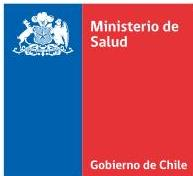
Registro de Propiedad Intelectual: Inscripción Nº A-1943
ISBN: 978-956-348-186-0

## AGRADECIMIENTOS

Agradecemos, especialmente, a los representantes de pueblos indígenas, agentes del sistema médico indígena y equipos de salud locales por su participación y aportes en la construcción de esta Guía, quienes desde sus experiencias y conocimientos posibilitan a diario establecer diálogos interculturales en el campo de la salud en general y particularmente en el ámbito de la salud sexual y salud reproductiva.

Guía de experiencias: Pertinencia cultural en el trabajo con pueblos indígenas en el ámbito de la salud sexual y salud reproductiva

# CONTENIDO

|  PRESENTACIÓN | 6  |
| --- | --- |
|  PROPÓSITO DE LA GUÍA | 6  |
|  CÓMO SURGE ESTA GUÍA | 7  |
|  A QUIÉNES ESTÁ DIRIGIDA ESTA GUÍA | 8  |
|  CÓMO ESTÁ ORGANIZADA LA GUÍA | 9  |
|  BREVE RESEÑA DE LAS EXPERIENCIAS SIGNIFICATIVAS DE ESTA GUÍA | 10  |
|  CAPÍTULO 1. DESCRIPCIÓN DE LAS EXPERIENCIAS SIGNIFICATIVAS | 11  |
|  1.1 Video clip “Siempre Condón”. Prevención del VIH en población aymara. SEREMI de Salud de Tarapacá | 11  |
|  1.2. Protocolo entrega de placenta para mujeres de familias mapuche que tienen su parto en el Hospital las Higueras –Talcahuano, Región del Biobío | 17  |
|  1.3. Protocolo entrega de la placenta. Hospital de Victoria de la Región de la Araucanía | 22  |
|  1.4. Utasanjam usuña: parto como en casa. Servicio de Salud Arica, Región de Arica y Parinacota | 27  |
|  1.5. Apoyo a la mujer embarazada con enfoque intercultural. CESFAM San Pedro de Atacama | 32  |
|  1.6. Experiencia de articulación entre sanadores y profesional matrón. CESFAM Nº1, Servicio de Salud Metropolitano Central, Región Metropolitana | 36  |
|  1.7. Acompañamiento a la mujer en el territorio, en su rol de creadora y dadora de vida. CESFAM Tirúa. | 41  |
|  1.8. Cuidados de la salud mapuche en el nacimiento. Servicio de Salud Valdivia. | 47  |
|  CAPÍTULO 2. RECOMENDACIONES | 55  |
|  2.1. RECOMENDACIONES PARA LA PERTINENCIA CULTURAL EN LA GESTIÓN DE LAS SEREMI, SERVICIOS Y ESTABLECIMIENTOS DE SALUD | 56  |
|  2.1.1. Focalización de grupos prioritarios | 56  |
|  2.1.2. Identificación de una necesidad en salud | 57  |

4
2.1.3. Trabajo en equipo 58
2.1.4. Planificaciones 59
2.1.5. Compartir experiencias que han avanzado en la transversalización del enfoque intercultural 59
2.1.6. Instancias de participación indígena en salud, incidiendo en la identificación de problemas de salud 60
2.1.7. Diálogo intercultural en salud para articular acciones con pueblos indígenas 61
2.1.8. Sensibilización de los equipos de salud y sensibilización de los equipos directivos 62
2.1.9. Actualización en adecuaciones normativas 64
2.1.10. Adecuación espacial e infraestructura 65
2.2. RECOMENDACIONES PARA LA ATENCIÓN CLÍNICA DE SALUD CON PERTINENCIA CULTURAL EN EL ÁMBITO DE LA SALUD SEXUAL Y SALUD REPRODUCTIVA CON PUEBLOS INDÍGENAS 66
2.2.1. Pregunta por pertenencia a pueblos indígenas 66
2.2.2. Las concepciones de salud, enfermedad 67
2.2.3. Relación entre sistemas de salud 67
2.2.4. Motivos de consulta 68
2.2.5. El idioma 68
2.2.6. La dispersión geográfica 69
2.2.7. Concepciones sobre tratamiento farmacológico 69
2.2.8. Examen físico 70
2.2.9. Infecciones de transmisión sexual 71
2.2.10. Movilidad geográfica 71
GRUPO DE TRABAJO MINISTERIAL 72
RESPONSABLES DE LAS EXPERIENCIAS 73
EQUIPO EDITOR 75

Guía de experiencias: Pertinencia cultural en el trabajo con pueblos indígenas en el ámbito de la salud sexual y salud reproductiva

5
Guía de experiencias: Pertinencia cultural en el trabajo con pueblos indígenas en el ámbito de la salud sexual y salud reproductiva

## PRESENTACIÓN

Esta guía se enmarca en el trabajo desarrollado por la línea técnica de salud y pueblos indígenas del Ministerio de Salud. La Guía busca contribuir a mejorar la situación de salud de los pueblos indígenas a través de la transversalización del enfoque intercultural en las políticas, planes y programas de salud.

La transversalización del enfoque intercultural se comprende como una metodología que parte por identificar principios, condiciones, estrategias, acciones y procedimientos para la generación de servicios con pertinencia cultural que garanticen el ejercicio de los derechos de la población culturalmente diversa del país y contribuyan a eliminar las inequidades en salud que afectan a los pueblos indígenas. Esta metodología de trabajo exige un proceso de reflexión y análisis que debe darse de manera colectiva involucrando los conocimientos, ideas, concepciones y prácticas que se dan en la relación entre la cultura institucional del sector salud y la de los pueblos indígenas.

Esta metodología se operacionaliza a través de la pertinencia cultural definida como un conjunto de acciones integradas y continuas, orientadas a promover cambios, en los niveles normativos, programáticos, de recursos humanos y de inversión e infraestructura, que respondan a la realidad social y política, así como al perfil epidemiólogo, sociocultural y territorial de los pueblos indígenas.

## PROPÓSITO DE LA GUÍA

Esta guía se propone mejorar la calidad de la atención de salud que reciben las personas que pertenecen a pueblos indígenas en los establecimientos de salud de la red de salud pública. Para lo anterior, se presentan 8 experiencias significativas desarrolladas por los equipos de salud a nivel local, en conjunto con organizaciones, facilitadores interculturales y sanadores que pertenecen a pueblos indígenas que han logrado consolidar la pertinencia cultural en el quehacer cotidiano en el ámbito de la salud sexual y salud reproductiva.

Así mismo, la Guía tiene como objetivo proporcionar algunas recomendaciones para la gestión y atención clínica de los equipos de salud vinculados a salud sexual y salud reproductiva, que los oriente en el desarrollo de acciones de prevención, promoción y atención de salud de calidad en el trabajo con pueblos indígenas.

6
Por otra parte, a partir de la presentación de las 8 experiencias significativas se espera que quienes tengan la posibilidad y oportunidad de revisar cada una de estas experiencias puedan considerarlas y desprender de ellas ciertas lecciones, ideas, contenidos, propuestas que motiven y hagan sentido para su réplica en sus contextos de trabajo.

## CÓMO SURGE ESTA GUÍA

El Ministerio de Salud, durante el año 2017, a través de los Programas y líneas técnicas de Salud y Pueblos Indígenas y de Salud Sexual y Salud Reproductiva de ambas Subsecretarías, se propuso sistematizar y visibilizar las experiencias significativas con pueblos indígenas en relación a la salud sexual y salud reproductiva desarrolladas en el sistema de salud.

La metodología utilizada para este trabajo consideró la constante participación y aportes de los referentes en estas materias tanto de SEREMI como de Servicios de Salud, quienes estuvieron a cargo de recopilar las experiencias y presentarlas de manera sistematizada en una plataforma en línea con un formato tipo, destacando los elementos centrales de cada una de las experiencias, entre ellos, descripción de contexto, problematización, cómo surge, quiénes y cómo participan, tiempo de ejecución, recursos humanos y financieros involucrados, dificultades y desafíos.

En este proceso se recibieron un total de 29 experiencias representativas de 7 regiones a nivel nacional, 11 ejecutadas en hospitales, 14 en CESFAM y 4 desde las SEREMI de Salud. Estas experiencias fueron revisadas por el equipo ministerial y se seleccionaron 8 de ellas en base a criterios de articulación entre programas, priorización en problemas de salud sexual y reproductiva, participación de pueblos indígenas, y foco en la prevención y promoción. Estas experiencias fueron presentadas durante el año 2017 en dos jornadas macrozonales donde se reunieron equipos locales, incluyendo facilitadores interculturales, agentes de salud indígenas y representantes de pueblos indígenas. La primera jornada se realizó en la ciudad de Santiago y convocó a las regiones de Arica- Parinacota, Tarapacá, Antofagasta, Atacama y la Región Metropolitana. La segunda jornada macrozonal se llevó a cabo en la ciudad de Temuco y reunió a las regiones del Bío Bío, Araucanía y los Ríos.

Guía de experiencias: Pertinencia cultural en el trabajo con pueblos indígenas en el ámbito de la salud sexual y salud reproductiva

7
Guía de experiencias: Pertinencia cultural en el trabajo con pueblos indígenas en el ámbito de la salud sexual y salud reproductiva

Durante el año 2018 el grupo de trabajo$^{1}$ conformado para abordar la línea técnica de salud sexual y reproductiva con pueblos indígenas en el Ministerio mantuvo comunicación con los equipos responsables de cada una de las experiencias que aquí se presentan, con la finalidad de revisar los contenidos de sus documentos y transformarlos en un documento de formato tipo para esta publicación. Así mismo, durante el año 2018, este grupo de trabajo se dedicó a elaborar las recomendaciones para los equipos de salud en las áreas de gestión y atención clínica. Para ello, fue necesario hacer una búsqueda bibliográfica asociada a la temática, sistematizar contenidos y levantar una propuesta de recomendaciones que fue discutida en sesiones de trabajo sistemáticas por parte del equipo y que dieron como resultado el capítulo final de esta Guía.

## A QUIÉNES ESTÁ DIRIGIDA ESTA GUÍA

La Guía de experiencias significativas en salud sexual y salud reproductiva está pensada como un material de apoyo y orientación para el trabajo que se desarrolla desde las SEREMI y Direcciones de Servicios de Salud con los pueblos indígenas. Busca constituirse en una herramienta práctica del quehacer en salud intercultural con pueblos indígenas para permear la gestión desde y hacia los equipos de salud que se desempeñan en la red asistencial.

Por otra parte, la Guía está destinada a los equipos de salud que se desempeñan en los establecimientos de salud de la red asistencial en todos sus niveles de atención. Busca constituirse en un material de consulta de los equipos para entregar una atención de salud de calidad y culturalmente pertinente.

Esta Guía está también destinada a los propios pueblos indígenas que se interesan y preocupan cotidianamente por el cuidado de su salud y la de sus comunidades buscando, a partir de lo ya realizado y de lo ya aprendido, nuevas estrategias interculturales para el trabajo conjunto con los equipos de salud.

$^{1}$ Programa Especial de Salud y Pueblos Indígenas y del Programa de Salud de la Mujeres de la División de Atención Primaria, la Unidad de La Mujer, Salud Sexual y Salud Reproductiva-VIH/ITS de la División de Gestión de la Red Asistencial, el Programa Nacional de Salud de la Mujer de la División de Prevención y Control de Enfermedades y el Departamento de Salud y Pueblos Indígenas e Interculturalidad de la División de Políticas Públicas Saludables y Promoción

8
## CÓMO ESTÁ ORGANIZADA LA GUÍA

Este material está organizado en dos capítulos. En el primero se presentan y describen las 8 experiencias significativas en salud sexual y reproductiva con pueblos indígenas. En ellas se abordan diversas temáticas, destacando la implementación de protocolos para la entrega de la placenta a mujeres indígenas y sus familias; el desarrollo de campaña comunicacional para la prevención de enfermedades de trasmisión sexual como el VIH; oferta de atención hospitalaria que considera pautas culturales de cuidados de la salud en la etapa del nacimiento; atención de salud complementaria entre agentes de salud indígena y equipos de salud y acompañamiento de parteras indígenas en el proceso de gestación y parto.

En el segundo capítulo se presentan recomendaciones obtenidas de las experiencias presentadas. Esto tiene por objetivo orientar el trabajo de los equipos en el ámbito de la gestión y de la atención en salud con pertinencia cultural.

Guía de experiencias: Pertinencia cultural en el trabajo con pueblos indígenas en el ámbito de la salud sexual y salud reproductiva

9
Guía de experiencias: Pertinencia cultural en el trabajo con pueblos indígenas en el ámbito de la salud sexual y salud reproductiva

## BREVE RESEÑA DE LAS EXPERIENCIAS SIGNIFICATIVAS DE ESTA GUÍA

|  Institución | Nombre de la experiencia | Descripción general  |
| --- | --- | --- |
|  **1. SEREMI de Salud Región de Tarapacá** | Video clip “Siempre Condón”. Prevención del VIH en población aymara. | Video Clip para prevenir el contagio por VIH/SIDA dirigido a personas aymara, elaborado con el Consejo de Salud y Pueblos Originarios.  |
|  **2. Hospital las Higueras Servicio de Salud Talcahuano** | Protocolo entrega de placenta para mujeres de familias mapuche que tienen su parto en el Hospital las Higueras. | Proceso de elaboración de protocolo para entrega de la placenta a mujeres indígenas. Trabajo articulado con organizaciones indígenas, asesores culturales y unidad de maternidad del Hospital  |
|  **3. Hospital de Victoria Región de la Araucanía** | Protocolo entrega de la placenta. | Construcción de protocolo para la entrega de la placenta. Unidad de maternidad y facilitadores interculturales.  |
|  **4. Servicio de Salud Arica** | Utasanjam Usuña: parto como en casa. | Modelo de atención de la gestación, parto y lactancia desde la perspectiva del pueblo aymara.  |
|  **5. CESFAM San Pedro de Atacama** | Apoyo a la mujer embarazada con enfoque intercultural. | Talleres educativos y ejercicios para las gestantes. Participación del equipo de salud y asociación de cultores indígenas Lickan antay.  |
|  **6. CESFAM N°1. Región Metropolitana** | Experiencia de articulación entre sanadores y profesional matrón. | Programa piloto de articulación entre sanadores indígenas, facilitadora intercultural y un profesional matrón. Atención de un Yatiri y una Qulliri residente de la región altiplánica quienes desarrollan terapias para tratar problemas de prolapso programadas dos veces al año.  |
|  **7. CESFAM Tirúa** | Acompañamiento a la mujer en el territorio, en su rol de creadora y dadora de vida. | Trabajo conjunto entre el equipo de salud del CESFAM y la puñenelchefe en el proceso de gestación, parto, puerperio y cuidados del recién nacido.  |
|  **8. Hospital de Valdivia** | Cuidados de la salud mapuche en el nacimiento. | Oferta de atención de salud con pertinencia cultural a usuarios mapuche y no mapuche que se hospitalizan en los Servicios de Ginecología y Obstetricia: Reorientación de las camas con cabeceras ubicadas hacia la salida del sol o hacia el sur; permitir la medicación mapuche a gestante en pre parto; aseo parcial en la unidad de puerperio; corte de cordón umbilical, entre otras.  |

10
# CAPÍTULO 1. DESCRIPCIÓN DE LAS EXPERIENCIAS SIGNIFICATIVAS

## 1.1 VIDEO CLIP “SIEMPRE CONDÖN”. PREVENCIÓN DEL VIH EN POBLACIÓN AYMARA. SEREMI DE SALUD DE TARAPACÁ

### Responsables²

**Alejandra Flores.** Coordinadora Regional de Salud y Pueblos Indígenas, SEREMI de Salud Tarapacá.

**Consejo de Salud y Pueblos Originarios**, SEREMI de Salud Tarapacá.

### Contexto y antecedentes

La región de Tarapacá se caracteriza por una importante presencia de pueblos indígenas. Según el CENSO abreviado de 2017, el 24,9% de la población declara pertenecer a pueblos originarios, lo que equivale a 80.065 personas. La mayor parte de la población es aymara. Algunos factores determinantes de la salud que interactúan en la región y que causan ciertas diferencias para poder llegar a otorgar una atención de salud oportuna son la dispersión geográfica, los cambios bruscos de temperatura, la migración tanto interna como externa, y la movilidad rural-urbana debido a la búsqueda de mejores condiciones de vida, acceso a la educación y trabajo.

Por otra parte, la SEREMI de Salud Tarapacá cuenta con un Consejo de Salud y Pueblos Originarios, reconocido por Res. Ex. N° 146 05/03/2014, compuesto por dirigentes indígenas que trabajan en temas de salud y sanadores indígenas, quienes participan de todas las actividades que se realizan en la Unidad de Salud y Pueblos Indígenas, desde planificación, ejecución y evaluación.

Un elemento fundamental para comprometer la participación de los dirigentes indígenas en la experiencia del videoclip fueron las altas tasas de VIH y SIDA existentes en la región de Tarapacá, segunda a nivel nacional después de la región de Arica y Parinacota. Para el caso de VIH/ SIDA en la región de Tarapacá, se considera las notificaciones del año 2015, observándose una tasa de 19,6 por 100.000 habs. (Diagnósticos Regionales en Salud con enfoques en Determinantes sociales ficha regional: Tarapacá http://epi.minsal.cl/datos-drs/1_tarapaca.pdf).

² Agradecemos a la funcionaria Patricia Sarabia por su colaboración y aportes a la experiencia significativa de la SEREMI de Salud de Tarapacá, quien se acogió a retiro a inicios de 2019.

Guía de experiencias: Pertinencia cultural en el trabajo con pueblos indígenas en el ámbito de la salud sexual y salud reproductiva

11
Guía de experiencias: Pertinencia cultural en el trabajo con pueblos indígenas en el ámbito de la salud sexual y salud reproductiva

En lo que respecta a población indígena, los antecedentes con los que se cuenta indican que desde el año 2008 al 2015 se presentaron un total de 18 casos de VIH/SIDA en población aymara. Aunque las cifras oficiales son bajas, no reflejan la realidad, ya que mayoritariamente las personas indígenas no registran su pertenencia étnica en los formularios de salud, aun así, en el año 2015 se detectaron 5 casos en población indígena, 4 de ellos en etapa SIDA y 1 de VIH.

En la investigación titulada “En los dominios de la salud y la cultura. Estudio de caracterización de los factores de riesgo y vulnerabilidad frente al VIH/SIDA en pueblos originarios³”, uno de los pocos existentes en el país, se asocia la presencia de casos de VIH en población indígena, entre otros, a la movilidad desde las zonas rurales a las urbanas, a la mayor disposición de ofertas sexuales en la ciudad y a la falta de información y uso de métodos de protección, adquiriendo la enfermedad y desconociendo la posibilidad de contagio. El estudio también evidenció ciertas percepciones respecto de la enfermedad, por ejemplo, que el VIH/SIDA es una enfermedad que afecta a los no indígenas. Se le relaciona con lo “ajeno”, “lo externo”, lo “importado”, y su origen se asocia con la homosexualidad, la promiscuidad y el comercio sexual.

Las personas indígenas, entre ellas los aymara, ven el tema como lejano, y no vislumbran problema alguno que pueda afectar su salud, por lo mismo, no lo consideran un tema de salud prioritario.

Otro componente que dio sustento al surgimiento de esta experiencia fue el seminario internacional realizado en la ciudad de Arica que reunió a Chile, Perú y Bolivia **Trazando juntos un camino para el Suma Qamaña de los pueblos indígenas**, el que permitió a las personas indígenas que aún eran reticentes a reconocer el VIH/SIDA como un tema que sí podía afectar a los pueblos indígenas, se sensibilizaran respecto de esta realidad por medio del conocimiento de cifras, estudios y datos entregados en dicho Seminario, que les permitieron comprender que el SIDA era una enfermedad que sí los afectaba y que era relevante preocuparse de este tema.

³ En los dominios de la salud y la cultura. Estudio de caracterización de los factores de riesgo y vulnerabilidad frente al VIH/SIDA en Pueblos Originarios. Sadler, Michelle - Obach, Alexandra (Coordinadoras). Editorial: Comisión Nacional del Sida, Ministerio de Salud, Santiago de Chile, 2006.

12
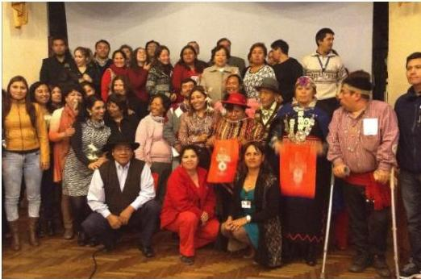

Dirigentes Chacha Warmi Haroldo Cáceres y Aurora Cayo del Consejo de Salud y Pueblos Originarios participando del **Seminario trinacional Chile–Perú–Bolivia**. **Trazando juntos un camino para el Suma Qamaña de los pueblos indígenas.** Construcción de una estrategia intercultural para enfrentar la situación del VIH y la TBC. Arica, Chile, 2015.

## Descripción

Dirigentes Chacha Warmi Haroldo Cáceres y Aurora Cayo del Consejo de Salud y Pueblos Originarios participando del Seminario trinacional Chile–Perú–Bolivia. Trazando juntos un camino para el Suma Qamaña de los pueblos indígenas. Construcción de una estrategia intercultural para enfrentar la situación del VIH y la TBC. Arica, Chile, 2015.

La Experiencia del video Clip surge a partir de la campaña del MINSAL del año 2015 para prevenir el contagio por VIH/SIDA llamada “Vivamos como vivamos, #SiempreCondón”. Desde el Programa de Salud Sexual y Salud Reproductiva se propone a Salud y Pueblos Indígenas realizar uno de los videos preventivos dirigido a pueblos originarios, se acuerda y propone la idea a los dirigentes del Consejo de Salud y Pueblos Originarios, quienes apoyan y participan de la iniciativa.

La experiencia consistió en planificar la elaboración de un Video Clip titulado #SiempreCondón, utilizando algunos mensajes en lengua aymara. El video contó con la participación activa de diri-

Guía de experiencias: Pertinencia cultural en el trabajo con pueblos indígenas en el ámbito de la salud sexual y salud reproductiva

13
Guía de experiencias: Pertinencia cultural en el trabajo con pueblos indígenas en el ámbito de la salud sexual y salud reproductiva

gentes indígenas durante todo el proceso, desde la construcción del guión hasta transformarse en protagonistas del video. La reflexión de los dirigentes apuntaba a que sí ellos eran los protagonistas del video clip, éste tendría mayor impacto, diferenciándose de estrategias anteriores de campañas similares donde los protagonistas eran personas no indígenas, lo cual generaría mayor acercamiento de la temática a la población aymara.

Para construir el video se desarrollaron diversas reuniones de trabajo, se proporcionó información personalizada a los dirigentes del Consejo de Salud y Pueblos Originarios que faltaba sensibilizar para comprometer su participación en el videoclip, actividades en las que fue clave el apoyo desde la Unidad de Salud y Pueblos Indígenas de la SEREMI de Salud de Tarapacá.

El texto fue conciso y directo, subtitulado en español cuando se hablaba en aymara. Fue intercalada cada frase por los dirigentes Chacha-Warmi (hombre-mujer) del Consejo y las dos últimas frases emitidas por todos los participantes. Se consensuó un lenguaje sencillo y comprensible para la mayoría.

*Jilallanaja kullallanaja (hermanos y hermanas) el VIH y SIDA no distingue fronteras ni culturas.*

*Por eso debemos cuidarnos, por el bien de nuestra familia y nuestra comunidad.*

*Es una enfermedad silenciosa que solo se muestra después de muchos años.*

*Hazte el examen preventivo. Es gratis. En cualquier centro de salud.*

**VIH/SIDA tajpachañi atipañani** (el VIH/SIDA se puede prevenir).

**Vivamos como vivamos, #SIEMPRECONDÓN**

Si bien la participación en el video es específica e involucró solo a 5 dirigentes indígenas, en su gestación hubo equipos externos como la productora a cargo, la referente de VIH/SIDA, de comunicaciones y de pueblos indígenas y los dirigentes del Consejo de Salud y Pueblos Originarios que fueron actores destacados para conseguir el objetivo.

14
## VIDEO CLIP PUEBLOS ORIGINARIOS “USA CONDÓN”, CON DIRIGENTES DEL CONSEJO DE SALUD Y PUEBLOS ORIGINARIOS, 2015

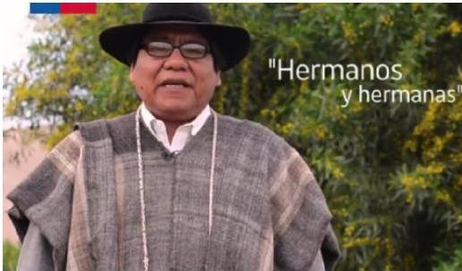

Haroldo Cáceres

El videoclip se ha utilizado difundiéndolo en múltiples actividades cuyos destinatarios son pueblos indígenas, como la Comisión de Trabajo de VIH/SIDA y Pueblos indígenas, coordinada desde la SEREMI de Salud e integrada por los referentes de VIH de los 7 municipios de la Región y/o encargados de Oficinas de Pueblos Originarios, CONADI, Servicio País y Programa de Salud y Pueblos Indígenas del Servicio de Salud Iquique. También se ha difundido en las páginas web institucionales, redes sociales y en establecimientos de salud de la Región. El contenido ha despertado curiosidad por verlo, y en la medida que se ha ido socializando, lo solicitan desde diversas organizaciones para su difusión. También se utilizó como insumo de trabajo en los 8 grupos focales de salud sexual y reproductiva dirigido a pueblos originarios, donde han sugerido elaborar más materiales de ese tipo.

Guía de experiencias: Pertinencia cultural en el trabajo con pueblos indígenas en el ámbito de la salud sexual y salud reproductiva

15
Guía de experiencias: Pertinencia cultural en el trabajo con pueblos indígenas en el ámbito de la salud sexual y salud reproductiva

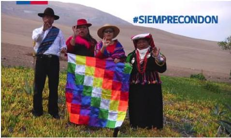

Rigoberto Barreda, Susan Salazar, Ruth Godoy y Aurora Cayo

El videoclip ha sido motivador para generar discusión sobre el tema, ya que los protagonistas del mismo han sido inquiridos sobre la situación del VIH y SIDA y pueblos indígenas, lo que les ha permitido ser difusores de la realidad regional. Los dirigentes reconocen en la actualidad, dificultades para llegar a sus pares, ya que continúa siendo un tema tabú, por lo mismo, refuerzan la necesidad de un trabajo comunitario y mayor apoyo de los programas de salud en dicha materia. La idea es lograr una estrategia con mayor pertinencia cultural para dar continuidad a la prevención y trabajar en la formación de monitores que acerquen las formas de educar en salud sexual y prevención del VIH.

Las proyecciones de la experiencia son replicar material audiovisual o gráfico similar para continuar con actividades de prevención por contagio de VIH y para incentivar a la toma del examen de detección del VIH. Por otra parte, continuar con su difusión en redes sociales. Al año 2017 el video presenta más de 8 mil alcances en Facebook.

## Conclusión

La Región mantiene la preocupación por las altas tasas de VIH y SIDA que continúan en aumento. Por tanto, se continuará con el trabajo de prevención y actividades de la Comisión Intersectorial de VIH/SIDA y Pueblos Indígenas, de manera de potenciar la coordinación entre sus instituciones junto a la dirigencia indígena. Es importante también reforzar la necesidad de realizar la pregunta por pertenencia a pueblos indígenas y efectuar el registro de esta variable de manera de poder contar con información más acotada sobre los casos de VIH y SIDA en pueblos originarios de Tarapacá, que permitirán mejorar las intervenciones preventivas.

16
## 1.2. PROTOCOLO ENTREGA DE PLACENTA PARA MUJERES DE FAMILIAS MAPUCHE QUE TIENEN SU PARTO EN EL HOSPITAL LAS HIGUERAS -TALCAHUANO

### Responsables

**Carolina Alarcón.** Jefa Departamento Participación Social, satisfacción usuaria y comunicaciones

**Pavel Guiñez Nahuelñir.** Asesor intercultural Servicio de Salud Talcahuano

**Neftalí Painequeo.** Facilitador Intercultural Hospital las Higueras Talcahuano

**Roxana Milos.** Matrona Encargada del Programa Salud de las Mujeres en Servicio de Salud Talcahuano.

**Doris Henríquez.** Matrona encargada gestión del cuidado. Hospital Las Higueras. Talcahuano.

**Susana Ríos.** Matrona Supervisora Área Urgencia. Hospital Las Higueras. Unidad de Partos

**Claudia Echeverría.** Enfermera, Asesora Calidad. Servicio de Salud Talcahuano

### Contexto y antecedentes

De acuerdo a información que proporciona el CENSO abreviado de 2017, en la región de Bío Bío el 9,5% de las personas declaran pertenecer a un pueblo indígena, lo que equivale a 167.291 personas, siendo los mapuche el pueblo mayoritario presente en la región.

Por otra parte, la jurisdicción del Servicio de Salud Talcahuano cuenta con alrededor de 20.000 personas de ascendencia de pueblos originarios. La jurisdicción está compuesta por 4 comunas, 3 hospitales y 11 CESFAM.

Las comunas son comunas puerto, con un fuerte carácter industrial y polo de circulación de materias primas. Dos de ellas cuentan con puertos y tres con el desarrollo de actividad de pesca artesanal con todo lo que implica, por tanto es un polo de atracción en la búsqueda de alternativas laborales.

### Descripción

El Servicio de Salud Talcahuano cuenta con una línea de trabajo tendiente a desarrollar un modelo de atención con pertinencia cultural asociado al programa PESPI (Programa Especial en Salud y Pueblos Indígenas), cuya fortaleza radica en el fuerte vínculo con organizaciones Mapuche urbanas que abordan temas de salud intercultural en una mesa de participación indígena permanente que agrupa a 4 organizaciones de las 4 comunas que componen la jurisdicción.

Guía de experiencias: Pertinencia cultural en el trabajo con pueblos indígenas en el ámbito de la salud sexual y salud reproductiva

17
Guía de experiencias: Pertinencia cultural en el trabajo con pueblos indígenas en el ámbito de la salud sexual y salud reproductiva

Es en el contexto de esta mesa de trabajo que surge la reflexión sobre la importancia de la entrega de la placenta para el mundo mapuche y la necesidad de contar con un protocolo para dicha entrega y en consecuencia, ejercer dicho derecho colectivo en un contexto que dificultaba dicha posibilidad (placenta, según el Reglamento sobre manejo de residuos de establecimientos de atención de salud, REAS, constituía un desecho orgánico especial que corría dos suertes, ser estudiado o incinerado).

Así mismo, en este espacio se plantea –a inicios de 2015– que una manera de avanzar en esta materia es a través del intercambio con otros territorios donde existan experiencias que se hayan planteado el desafío de un protocolo, conocer cómo lo han trabajado y qué problemas han debido enfrentar. La mesa de salud intercultural gestiona como primer paso, una pasantía al Hospital Kalvullanka en la comuna de Cañete con un comité de trabajo para preparar el protocolo. La importancia de esta pasantía radica en que permitió generar los puentes para constituir y comprometer el equipo que finalmente terminaría haciendo operativo el protocolo de entrega de la placenta para el Hospital Las Higueras.

Si bien la pasantía impulsó la construcción del protocolo, el equipo de trabajo generado por la Mesa de Salud Intercultural Kume Mongen, tuvo como premisa el carácter territorial de las prácticas en salud de la población mapuche, por lo que resultaba improcedente copiar modelos ya existentes debido a que no se ajustarían a la realidad urbana de la bahía de Concepción y por otro lado, la idea de reflexionar sobre los límites de abordar el conocimiento indígena en las prácticas biomédicas, resguardando que el modelo biomédico no absorba las prácticas y conocimientos indígenas.

Para la construcción del protocolo de entrega de placenta para madres de familias mapuche se generó una estrategia que se enfocó en 3 actores principales:

1. Funcionarios de unidad de parto. Quienes estuvieron a cargo de detectar temores y anticipar resistencias de los equipos, detectar aliados para instalar el trabajo en terreno y difundir y sensibilizar respecto del impacto que tiene esta política en la vida de las madres y familias que solicitan su placenta. Para abordar estos temas se trabajó mediante la técnica de focus group.
2. Estudiantes en práctica de apoyo al Servicio de Salud Talcahuano. Cuyo trabajo se orientó a investigar prácticas ancestrales asociadas a la entrega de placenta en el territorio, a desarrollar alianzas con agentes estratégicos para asegurar una implementación adecuada de la experiencia. Los estudiantes analizaron las expectativas, propusieron ajustes a los protocolos

18
y recogieron las orientaciones para la ceremonia de entierro de la placenta. Por último, los estudiantes reflexionaron y definieron los límites y contenidos de aquello que no debiera ir en el protocolo puesto que pertenece al sistema de salud mapuche y por tanto no regulable por las reglas occidentales. Este trabajo se desarrolló mediante entrevistas a líderes ancestrales de la mesa de salud indígena y de otros territorios de la región.

3. Dirigentes ancestrales y funcionales. Con ellos se trabajó en la sistematización de las prácticas de salud indígena vinculadas al proceso de parto y a la ceremonia de entrega de la placenta posibles de incorporar al protocolo y cuales mantener en resguardo, reconstrucción de prácticas ancestrales presentes en el territorio con el fin de complementar gestiones de aprobación de resolución sanitaria en SEREMI de Salud y visado de protocolo presentado a SEREMI.

Para la entrada en vigor del protocolo, se realizó una ronda de capacitaciones a los equipos salientes de turno de la Unidad de Partos, lo que involucró a todos los estamentos y duró 4 días en horario saliente de turno, también se presentó el protocolo en equipos del Sistema Integral de Protección a la Infancia Chile Crece Contigo, y Programa de la Mujer por establecimiento y comuna. En general las actividades contaron con un recuento de cómo operaría el protocolo, las obligaciones de las partes y cómo responder ante eventuales conflictos surgidos en el contexto de que hasta ese momento, (año 2015) aún no se encontraba plenamente aprobada la instrucción ministerial de autorización para la entrega a todo evento.

Todo lo anterior sucedía mientras la propuesta de protocolo, presentada a la SEREMI de Salud había sido rechazada por el área de “Profesiones Médicas” sugiriendo modificaciones que resultaron del todo inaplicables para la realidad de un protocolo de las características que tiene el nuestro. El argumento era que el protocolo requería incluir exámenes adicionales a los que se solicitan a todas las mujeres embarazadas, entre ellos, el examen de Chagas y hepatitis B, ambos con un tiempo de respuesta de una semana a un mes debido a su carácter de externalizados. Estas indicaciones colisionaron directamente con uno de los requisitos planteados por las organizaciones, el cual era que la entrega no sobrepasase las 24 horas y que tampoco la placenta fuese congelada ya que eso impide la correcta realización de este proceso protector de la salud.

Aun con esta respuesta, el equipo continuó trabajando para mejorar las condiciones para la implementación del protocolo, constituyendo un comité revisor que incorporó al Subdirector Médico,

Guía de experiencias: Pertinencia cultural en el trabajo con pueblos indígenas en el ámbito de la salud sexual y salud reproductiva

19
Guía de experiencias: Pertinencia cultural en el trabajo con pueblos indígenas en el ámbito de la salud sexual y salud reproductiva

Departamento de Calidad y otros, ajustando el proceso a las observaciones planteadas y estableciendo un debate profundo respecto a la pertinencia de las incorporaciones sugeridas por la SEREMI. Mientras tanto se profundizó el trabajo con las organizaciones indígenas, se continuaron desarrollando las acciones de socialización y sensibilización a los equipos de salud, en especial a aquellos vinculados al Programa Chile Crece Contigo y el Programa de la Mujer.

Finalmente, se difundió el protocolo a nivel de la Dirección del Servicio de Salud, lo que conllevó a que en julio de 2016 se les otorgara la autorización sanitaria y un día después de esta autorización se realizó la primera entrega de la placenta en el Hospital las Higueras.

Dicho proceso de sensibilización incluyó además una presentación de las características generales del usuario proveniente de pueblos originarios, sus cualidades y cómo responder frente a contingencias y solicitudes emergentes, señalando además que este protocolo posee 3 vías de ingreso de usuarias:

a. Usuaria normal que cuenta con controles periódicos de embarazo en algún establecimiento de la red.
b. Usuaria que proviene de comunas ajenas a la jurisdicción e ingresa con síntomas de parto.
c. Usuaria que ingresa por urgencia con síntomas de parto.

Todas las alternativas implican la realización de una entrevista con el Facilitador intercultural, quien visaba la procedencia de la solicitud para que respondiera a usuaria de origen mapuche en entrevista realizada, además con presencia de matronas. Así, de una expectativa de tener 5 a 6 solicitudes en un año, pasamos a tener más de 10 en el mismo periodo, lo que sin duda nos planteó la urgencia de seguir avanzando en prácticas con pertinencia cultural.

Un hecho que llama la atención por sus buenos resultados, es que junto con las solicitudes formales de entrega de placenta y la resolución de dudas vinculadas a las prácticas propias del modelo de salud mapuche, la presencia de matronas en la reunión fue generando en los hechos una apertura cada vez mayor a sostener partos con pertinencia cultural, lo que claramente demostró un empoderamiento de las usuarias solicitantes a medida que se fueron realizando las entregas, lo que además resalta con la mantención de redes comunitarias que valoran estas prácticas.

En los hechos, y gracias a la voluntad y convencimiento del estamento de Matronas, se fue construyendo un plan de parto intercultural con las usuarias y los funcionarios presentes en dichas entre-

20
vistas, el que fue construyéndose caso a caso con las gestantes provenientes de familias mapuche, sumando a la entrega de placenta y su cuidado, la posibilidad de contar con lana roja esterilizada para la muñeca y cordón umbilical del recién nacido, la provisión de Lawen de parte de autoridades tradicionales para la gestante, el acompañamiento por autoridad tradicional, familiares significativos, uso de atuendo, acompañamiento de música y luz tenue, adaptabilidad de la posición de parto según comodidad de la madre, asesoría para el entierro de placenta, participación de familiar significativo en el corte de cordón y provisión de agua pura al bebé a lo que se incluye la impresión de placenta para quienes lo deseen.

Uno de los problemas que hemos debido subsanar, radica principalmente en la connotación que tiene para algunas de las familias mapuche que hemos atendido, la provisión de anestesia. Al parecer esto no resulta bien visto por algunos sectores de la sociedad mapuche, lo que a veces se ha contrarrestado de parte de la usuaria con un relato que cifra en el establecimiento una supuesta “obligatoriedad” en la provisión, generando un relato que tendió a perjudicar en algunas circunstancias, lo que se abordó de inmediato, enfatizando el carácter de disponibilidad permanente, pero el uso opcional a voluntad de la madre en casos que no requieren intervención quirúrgica.

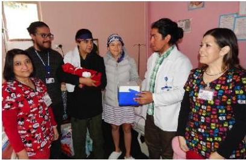

Nueva entrega de placenta a familia de ascendencia Mapuche en Las Higueras

13 Julio 2017 • Noticias Regionales

## Conclusiones

Con todo, la experiencia de trabajar participativamente en la elaboración de un protocolo para la entrega de la placenta y mantener dicha perspectiva participativa ha permitido que el equipo del Servicio de Salud y del Hospital las Higueras se plantee seguir avanzando y pensar en ampliar la perspectiva, proponiendo el desarrollo de un plan de parto con pertinencia cultural protocolizado. Se ha señalado también la necesidad de profundizar las capacitaciones y trabajar de manera permanente en mejorar la calidad de la atención a las familias de usuarias mapuche.

Guía de experiencias: Pertinencia cultural en el trabajo con pueblos indígenas en el ámbito de la salud sexual y salud reproductiva

21
Guía de experiencias: Pertinencia cultural en el trabajo con pueblos indígenas en el ámbito de la salud sexual y salud reproductiva

### 1.3. PROTOCOLO ENTREGA DE LA PLACENTA. HOSPITAL DE VICTORIA DE LA REGIÓN DE LA ARAUCANÍA

#### Responsables4⁴

**Cristian Meliñan.** Facilitador Intercultural.

**Ramón Quintrel Linco.** Facilitador Intercultural.

**Estefanía Bastías.** Psicóloga, Programa Chile Crece Contigo.

**Catherine Poblete.** Matrona.

**Ingrid de la Peña.** Educadora de Párvulos.

**Ingrý Sánchez Kunz.** Trabajador Social.

#### Contexto y antecedentes

La región de la Araucanía posee un alto porcentaje de población indígena. Según el CENSO abreviado 2017 el 34,3% de la población declara pertenecer a un pueblo indígena, lo que corresponde a

321.328 personas, de estos, 314.174 declaran pertenecer al pueblo mapuche. Este contexto exige propiciar políticas que sean inclusivas, pertinentes culturalmente, así como generar políticas y acciones que no transgredan las prácticas y conocimientos del pueblo mapuche presente en la región.

El Servicio de Salud Araucanía Norte de la provincia de Malleco está organizado en una red que cuenta con dos hospitales: el Hospital de Angol y el Hospital Victoria, ambos atienden a su sub red. El hospital de Victoria atiende a la población de las comunas de Traiguén, Curacautín, Lumaco, Ercilla y Lonquimay. La población indígena de la comuna de Victoria de acuerdo al CENSO 2017 es de 9.301 personas.

Es importante destacar que cuando se habla de la comuna de Victoria hay que pensarla y entenderla como un territorio ancestral de acuerdo a como se muestra en la siguiente gráfica.

⁴ Agradecemos a la funcionaria María Victoria Riffo por su colaboración y aportes a la experiencia significativa desarrollada en el Hospital de Victoria, quien se acogió a retiro durante el año del 2019.

22
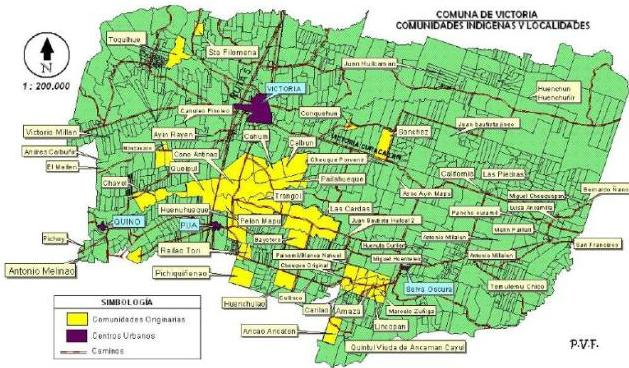

Fuente: PLADECO 2015-2019, adecuado por Equipo de Salud Intercultural. Hospital de Victoria

La incorporación de la interculturalidad en salud, constituye un hito fundamental para la operacionalización de la Política de Salud y Pueblos Indígenas y de la Norma Administrativa N° 16, sobre interculturalidad en los Servicios de Salud. Esta normativa, en su artículo 16, establece que es deber del Ministerio de Salud formular políticas que permitan incorporar un enfoque intercultural a su quehacer.

El año 2008, el Estado de Chile ratificó el convenio 169 de la OIT sobre pueblos indígenas y tribales, entrando en vigencia un año más tarde. Este tratado define estándares mínimos de cumplimiento de los Estados para garantizar el derecho de los pueblos indígenas en áreas como educación, salud y trabajo, entre otros. El convenio señala que es deber de los gobiernos “adoptar medidas acorde a las tradiciones y culturas de los pueblos interesados, a fin de darles a conocer sus derechos y obligaciones, especialmente en lo que atañe al trabajo, a las posibilidades económicas, a las cuestiones de educación y salud” (artículo 30).

El año 2012 se aprueba la Ley 20.584, que regula los deberes y derechos que tienen las personas en relación a su atención de salud. Dicha ley establece en su artículo 7 que “en aquellos territorios con

Guía de experiencias: Pertinencia cultural en el trabajo con pueblos indígenas en el ámbito de la salud sexual y salud reproductiva

23
Guía de experiencias: Pertinencia cultural en el trabajo con pueblos indígenas en el ámbito de la salud sexual y salud reproductiva

alta concentración de población indígena, los prestadores institucionales públicos deberán asegurar el derecho de las personas pertenecientes a los pueblos originarios a recibir una atención de salud con pertinencia cultural, lo cual se expresará en la aplicación de un modelo de salud intercultural validado ante las comunidades indígenas, el cual deberá contener, a lo menos, el reconocimiento, protección y fortalecimiento de los conocimientos y las prácticas de los sistemas de sanación de los pueblos originarios; la existencia de facilitadores interculturales y señalización en idioma español y del pueblo originario que corresponda al territorio y el derecho a recibir asistencia religiosa propia de su cultura”.

Estos instrumentos normativos constituyen el marco jurídico, desde donde el Ministerio de Salud reconoce que la entrega de placenta es un derecho de los pueblos indígenas.

## Descripción

La experiencia del equipo de Salud del Hospital de Victoria, surge a partir de una solicitud ciudadana de entrega de la placenta que planteó el derecho de los pueblos indígenas a mantener sus prácticas culturales. En ese momento, no existía una normativa sectorial vigente que lo permitiera, no había protocolos internos, en definitiva la institución no estaba preparada frente a este requerimiento.

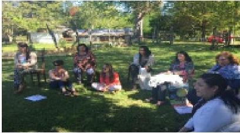

Se respondió a la solicitud ciudadana desde la voluntad de las personas, sin embargo, esta situación llevó a los funcionarios involucrados en el tema a reflexionar sobre esta materia. Para ello, se conformó un equipo de trabajo compuesto por profesionales del Servicio de Salud, Encargada del Programa de Salud Mapuche, Encargada Regional de Interculturalidad de la Seremi de Salud, Profesionales de Chile Crece Contigo

Contigo y Facilitadores Interculturales. Se hicieron reuniones de sensibilización, involucrando a todo el equipo del Servicio de Gineco-Obstetricia: médicos, matronas, técnicos paramédicos y auxiliares; se invitó a participar a matrona del Hospital Regional de Temuco, para que compartiera su experiencia de trabajo, luego se planteó el tema al médico jefe de servicio y se buscaron los respaldos normativos y jurídicos.

24
Se formaron alianzas con los hospitales de Temuco y Osorno para conocer experiencias similares y dar respuestas oportunas y pertinentes a estas solicitudes. Los respaldos normativos que se utilizaron fueron la Política de Salud y Pueblos Indígenas (2006), donde se señala que es deber del Ministerio de Salud formular políticas que permitan incorporar un enfoque intercultural a su quehacer, y el artículo 7 de la Ley 20.584 (ambos antes descritos).

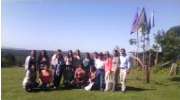

Se realizó una pasantía en el Hospital de Osorno, por parte del equipo, donde se conoció una realidad más avanzada de la atención de la gestante y parturienta con pertinencia cultural.

Se buscaron los saberes con lamgen (hermanos/hermanas) del territorio para que la entrega de placenta fuese dentro de un contexto territorial y de pertinencia cultural.

Con todos estos antecedentes, el equipo elaboró un Protocolo para la entrega de la placenta al pueblo mapuche, el cual fue presentado oficialmente en una reunión donde participó la red de salud Araucanía Norte, lo que permitió realizar observaciones que sirvieron para mejorar el documento.

Los objetivos del protocolo son los siguientes:

- Facilitar a la familia y entorno más cercano del recién nacido/a que reafirme los lazos de protección y acompañamiento del niño o niña en su formación como persona a través del tratamiento ceremonial de la placenta.
- Establecer un proceso seguro de entrega de placenta, considerando el manejo adecuado de residuos biológicos en el Hospital de Victoria.
- Promover el reconocimiento, respeto y valoración de los conocimientos y prácticas de los pueblos indígenas en todos los integrantes del equipo de salud.

El proceso contempla varias etapas, desde la atención primaria, donde la gestante tendrá acceso a la información sobre la entrega de placenta a través de su matrona, los asesores interculturales y a través de los talleres del Sistema de Atención Integral a la Infancia Chile Crece Contigo. Al momento del parto, el personal que ya está preparado realizará la entrega posterior al nacimiento, cada familia podrá traer el contenedor o metawe (vasija de uso ceremonial y cotidiano) que prefiera para su traslado.

Guía de experiencias: Pertinencia cultural en el trabajo con pueblos indígenas en el ámbito de la salud sexual y salud reproductiva

25
Guía de experiencias: Pertinencia cultural en el trabajo con pueblos indígenas en el ámbito de la salud sexual y salud reproductiva

## Conclusiones

De acuerdo a lo que plantea el equipo responsable, el proceso ha sido positivo, pues señalan que con la entrega de placenta se recuperan conocimientos ancestrales y se aporta al desarrollo y bienestar de los niños.

Se ha evidenciado también, que mediante la regulación de este proceso y procedimiento, las mujeres de las comunidades, y en particular, aquellas que cursan gestación y su núcleo familiar, han recuperado de a poco prácticas ancestrales de su territorio que por miedo y/o desconocimiento se habían ido perdiendo.

Con este trabajo realizado en equipo, el establecimiento ha tenido un gran logro... “ya no existen barreras, no hay cuestionamientos, no se pregunta para qué la quieren y qué van a hacer con la placenta”; con el protocolo se ha logrado eliminar la burocracia y las trabas institucionales que al inicio existieron.

El equipo se ha planteado nuevos desafíos, dentro de los que destacan dar continuidad a la sensibilización sobre la importancia de la entrega de placenta y el desarrollo de los niños y niñas desde la cosmovisión indígena, así como ampliar la entrega de la placenta a otras comunas del Servicio de Salud con el respaldo de la Norma Técnica Ministerial aprobada en junio de 2017 y a futuro poder medir el impacto de estas acciones.

26
## 1.4. UTASANJAM USUÑA: PARTO COMO EN CASA. SERVICIO DE SALUD ARICA, REGIÓN DE ARICA Y PARINACOTA

### Responsables

**María José Urrutia.** Encargada del Programa Especial de Salud y Pueblos Indígenas. Servicio de Salud de Arica.

**Sra. Julia Huanca Condori.** Partera. Servicio de Salud Arica

### Contexto y antecedentes

La región de Arica y Parinacota cuenta con cuatro comunas: Arica, Putre, Camarones y General Lagos. La población indígena de la región según el CENSO 2017 asciende a 78.833 personas, lo que corresponde al 35,7% de la población total. El pueblo mayoritario es el aymara con 59.432 personas que declaran pertenecer a este pueblo. La población aymara se concentra, principalmente, en la comuna de Arica.

Para la cosmovisión andina el equilibrio se encuentra en la dualidad, todas las cosas y seres se relacionan entre unas y otras. El concepto de Suma Qamaña, implica el buen vivir en las comunidades, se consigue mediante el equilibrio entre el entorno y la comunidad. Este concepto de equilibrio también se encuentra en el proceso de gestación y formación de la nueva familia andina. El equilibrio entre la madre, la wawa (recién nacido/a) y la familia es fundamental en el proceso de gestación.

En la cosmovisión andina, el embarazo es considerado en un primer momento de cuidado para la salud de la madre, por la pérdida de este equilibrio, representado por el aumento de la temperatura corporal. Por otra parte, el nacimiento es un acontecimiento comunitario, donde se le da la bienvenida a un nuevo miembro de la comunidad.

Así también, durante este período es importante resguardar el equilibrio, entre el trabajo y el descanso, entre el frío y el calor. La alimentación equilibrada, constituye un aspecto fundamental en la gestación y posterior lactancia.

Este programa de acompañamiento de la gestación, parto y lactancia ofrece atención complementaria, bajo el alero del modelo del Sistema de Protección Integral a la Infancia Chile Crece Contigo, para las mujeres indígenas aymara de la región de Arica y Parinacota.

Guía de experiencias: Pertinencia cultural en el trabajo con pueblos indígenas en el ámbito de la salud sexual y salud reproductiva

27
Guía de experiencias: Pertinencia cultural en el trabajo con pueblos indígenas en el ámbito de la salud sexual y salud reproductiva

## Descripción

Esta experiencia nace de las necesidades de las propias mujeres indígenas que deseaban poder contar con acciones y estrategias que reconocieran y respetasen sus tradiciones culturales en el proceso de gestación y parto.

Sus inicios se remontan al año 2008, periodo en el que se realizaron varias jornadas de trabajo técnico-participativo entre profesionales de la Maternidad, Atención Primaria de Salud, el Programa Especial de Salud y Pueblos Indígenas (PESPI), y mujeres indígenas que inicialmente, desconfiaban mucho de los procedimientos clínicos al interior del hospital, ya que se alejaban completamente del sentido y práctica ancestral del parto y la lactancia indígena. El objetivo de estas jornadas fue diseñar en conjunto un modelo de atención del parto y gestación con enfoque intercultural que le hiciera sentido a la población andina.

Es así que como resultado de este trabajo conjunto nace el Programa Utasanjam Usuña (Parto como en tu casa), que es un modelo de acompañamiento en la gestación, parto y lactancia con enfoque aymara en su acceso, proceso y desarrollo.

Este modelo de atención, involucra actores en todos los niveles asistenciales. Desde la atención primaria, las mujeres gestantes reciben la información del programa en su segundo control, en qué consiste y cómo opera. Si ellas ingresan al Utasanjam Usuña la matrona las pondrá en contacto con la Sra. Julia Huanca Condori, Usuyiri (partera) del Servicio de Salud de Arica, y a partir de este primer contacto, la usuyiri la acompañará en cada uno de sus controles futuros. Al igual que el modelo del Sistema Chile Crece Contigo, la usuyiri realizará las visitas domiciliarias correspondientes, para acompañar a las gestantes en las dudas que puedan presentar, como también en la relación de confianza y respeto.

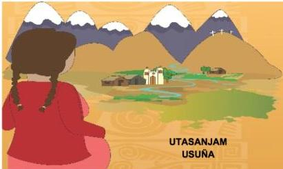

Adhesivo del carnet de control maternal que distingue el ingreso al programa

28
Además, como trabajo complementario, se elaboró la Guía de Gestación y Parto WASA SANA THA-KIPA. Esta guía de acompañamiento se trabaja desde el modelo del Programa Chile Crece Contigo, con énfasis en temáticas propias de la cultura aymara, la que ha contribuido además a recuperar prácticas culturales olvidadas en la modernidad de la ciudad.

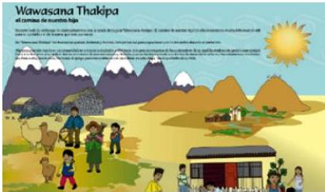

Guía de Gestación y Parto Wasasana Thakipa

En el momento que se presenta el parto, la mujer gestante ingresa a maternidad por el Servicio de Urgencia. Previamente ha tomado contacto con la usuyiri, partera, quien se encontrará con ella en el Hospital Regional de Arica.

Ambas ingresan a la sala de Utasanjam Usuña, habilitada para este tipo de parto, tal como se describe en las siguientes fotografías.

El parto es acompañado tanto por la partera como por el equipo profesional de la maternidad del Hospital Regional Dr. Juan Noé Crevani, se acompaña con masajes y consumo de mates calientes, manteniendo la temperatura estable en la habitación, para

evitar el frío, que provoca dolor y demora en el trabajo de parto.

Guía de experiencias: Pertinencia cultural en el trabajo con pueblos indígenas en el ámbito de la salud sexual y salud reproductiva

29
Guía de experiencias: Pertinencia cultural en el trabajo con pueblos indígenas en el ámbito de la salud sexual y salud reproductiva

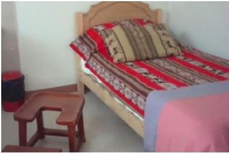

Parte importante de este programa es la casa de Acogida UTAMA (Tu casa), esta casa es de acogida para mujeres gestantes de las localidades rurales de la región de Arica y Parinacota, cuyo objetivo es evitar las complicaciones de un parto en trayecto o domiciliario en las localidades rurales. Las mujeres ingresan alrededor de la semana 36 de gestación y permanecen en la casa hasta el momento en que el recién nacido es dado de alta a los controles en el Policlínico de Pediatría del Hospital Regional.

Durante el año 2012 el Servicio de Salud Arica, encomendó un estudio de Satisfacción Usuaria de las mujeres gestantes que ingresaron al programa. Estas fueron las conclusiones del estudio:

En relación a la elección del parto natural como alternativa de la nueva maternidad; la mayoría de las mujeres que decidieron por el parto aymara lo hicieron por la pertinencia cultural o preservar las tradiciones andinas, además la decisión fue tomada porque era la única alternativa en la red asistencial de contar con un parto 100% natural, no invasivo. El sentimiento que mantiene esta decisión son los procedimientos poco invasivos que el parto Utasanjam Usuña promueve. La atención con hierbas y masajes, el no uso de rasurado, ni enema, ni tacto vaginal constantemente, son procedimientos que a consideración de las mujeres de la nueva maternidad favorecen su proceso reproductivo, mientras que técnicas invasivas innecesarias o de rutina, resultan denigrantes y poco amigables para el proceso de parto.

Dada la realidad migratoria de la ciudad que la situación fronteriza le confiere, nos encontramos con un gran número de mujeres migrantes del Valle de Azapa, principalmente peruanas y bolivianas quienes ingresaron como usuarias del programa, dado principalmente, por su pertenencia al pueblo aymara.

Esta relación de variables entre pertinencia, pertenencia y migración, habla de un fenómeno, más complejo aun, el rescate de prácticas culturales muy arraigadas en la vida de la comunidad, pero que debieron ser rescatadas en contextos urbanos. La práctica cultural del parto andino es significativamente mayor en países del trapecio andino como Perú y Bolivia, en relación al pueblo aymara chileno.

30
En relación al carácter de acompañamiento; este resulta ser una variable muy importante a la hora de elegir el parto Utasanjam Usuña; el vivir la experiencia del parto para las mujeres primerizas estando acompañadas por algún miembro de su familia, es fundamental. Situación que comprueba desde otro punto de vista, la importancia que tiene la humanización del parto y la nueva maternidad.

La sala de parto del programa Utasanjam Usuña del Hospital Regional de Arica Dr. Juan Noé Crevani, carece de calidez e intimidad para las mujeres usuarias del programa, los colores son fríos, la temperatura no es la adecuada, además por ser un parto novedoso para el personal de salud, las mujeres refirieron en varias ocasiones durante esta entrevista, que la sala estaba llena, por personal que nunca había presenciado un parto aymara. Situación que incomodó a varias, ya que no sintieron la intimidad necesaria para vivir este proceso.

Se hace sumamente necesaria la sensibilización del personal del Hospital, desde el personal a cargo de la primera acogida o ingreso, como también del personal que trabaja en la maternidad. Las mujeres sintieron que el personal no maneja, ni entiende el propósito del parto aymara. Tienen la sensación de que existe total indiferencia por este tipo de parto, en el centro hospitalario.

El parto natural no reviste ninguna situación de peligro ni para la madre, ni para la wawa. La opción por el parto natural tiene una mejoría más rápida que procedimientos quirúrgicos como la cesárea.

## Conclusiones

A modo de conclusión, es importante señalar que esta experiencia ha tenido buena recepción por parte de las comunidades en general, si bien son pocos los embarazos por año en las localidades rurales, esta experiencia es significativamente distinta para las mujeres, ya que en la ruralidad el apego por las prácticas culturales se mantiene más fuerte que en la urbanidad.

Es también relevante el ingreso de mujeres no indígenas al programa, ya que no es excluyente, al ser la única alternativa en la red asistencial de tener un parto 100% natural, brindando calidez, manteniendo los estándares de calidad que da el contar con los resguardos sanitarios necesarios.

Guía de experiencias: Pertinencia cultural en el trabajo con pueblos indígenas en el ámbito de la salud sexual y salud reproductiva

31
Guía de experiencias: Pertinencia cultural en el trabajo con pueblos indígenas en el ámbito de la salud sexual y salud reproductiva

## 1.5. APOYO A LA MUJER EMBARAZADA CON ENFOQUE INTERCULTURAL.CESFAM SAN PEDRO DE ATACAMA

### Responsables

Yovana González G. Matrona-Directora CESFAM San Pedro de Atacama

Equipo de Salud CESFAM San Pedro de Atacama

### Contexto y antecedentes

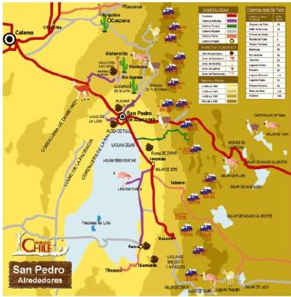

En la Provincia de El Loa, Región de Antofagasta a 2.436 metros sobre el nivel del mar se ubica la Comuna de San Pedro de Atacama. Cuenta con una superficie de 23.439 km² y una población indígena, según CENSO 2017, de 5.523, de los cuales 4.068 declararon pertenecer al pueblo Lickan antay.

Según sus antiguos pobladores, San Pedro debe su nombre a su santo Patrono traído por los españoles, y Atacama a “Accatcha” lo que significaría cabecera del país en su lengua kunza, que con el transcurso del tiempo se constituye en la modificación a San Pedro de Atacama.

La comuna cuenta con 4 postas, 1 Centro de Salud Familiar, 2 servicios de urgencia

rural y dos estaciones médico rurales. Es una comuna con gran dispersión geográfica cuyo centro de referencia es el Hospital de Calama.

Cercano al CESFAM se encuentra la Asociación de Cultores Indígenas Lickan antay, que dispone de una sala de atención curativa llamada Sala Lickana localizada en la plaza de San Pedro de Atacama. Ahí se ubican partera, componedores y sanadores, cuyo espacio de trabajo desde un inicio se concibió de manera independiente, cercano al CESFAM, permitiendo la interacción entre ambos sistemas.

32
En la actualidad el CESFAM de San Pedro de Atacama y la Sala Lickana mantienen un trabajo integrado en diferentes temas como, por ejemplo, en área de salud perinatal y osteomuscular. Las derivaciones se realizan a través del facilitador intercultural, Leonardo Soza. En el caso de embarazadas y/o usuarios que presenten molestias musculares, se envían a ingreso y/o control de acuerdo a la patología que presenten, de igual forma la sala Lickana realiza derivaciones al CESFAM, con la finalidad de complementar la atención del usuario, pensando siempre en el bienestar general de éste.

La complementariedad de los profesionales del Centro de Salud y la Sala Lickana se puede reflejar en acciones como el trabajo en forma conjunta de la matrona con la partera, en la realización de talleres e indicaciones para el proceso de embarazo enfocado primordialmente en la primigesta, e incorpora también a las madres. La nutricionista incorpora en su minuta de alimentación los productos locales, leche de cabra, carne de llamo, etc., es decir, se fomenta el consumo de lo que ellos poseen.

Además se está trabajando en un proyecto para la implementación de una futura farmacia, basada primordialmente en la medicina tradicional respetando la interculturalidad de los usuarios, ya que esta se basa en sus tradiciones y saberes.

## Descripción

El CESFAM San Pedro de Atacama inició su experiencia convocando a las parteras de la zona para acompañar a las mujeres durante el proceso de embarazo, parto y puerperio, con principal atención en el cuidado de la mujer ante los cambios fisiológicos experimentados a lo largo de todo el proceso de gestación, con especial énfasis a mujeres primigestas pues son las que más requieren acompañamiento.

Uno de los temas referidos al cuidado de la mujer indígena tiene que ver con los resguardos con el baño post parto y en este punto, se establece la necesidad de incorporar la visión de la partera y que es posible complementarse con el mundo lickan antay-aymara, evitando tensiones y acercando perspectivas en cuanto al cuidado. Ejemplo de aquello, las mujeres de pueblos indígenas consideran a la zona llamada “matriz” como la de mayor cuidado, básicamente cuidarse del frío (comprensión binaria del cuidado frío-caliente del cuerpo). Otra de las prácticas de prevención y prácticas curativas es el uso de meconio (deposiciones del recién nacido) que se usa como un corrector de manchas según la cultura lickan antay-aymara. La placenta es otro elemento que requiere ser tra-

Guía de experiencias: Pertinencia cultural en el trabajo con pueblos indígenas en el ámbito de la salud sexual y salud reproductiva

33
Guía de experiencias: Pertinencia cultural en el trabajo con pueblos indígenas en el ámbito de la salud sexual y salud reproductiva

tado conforme a la cosmovisión lickan antay-aymara, si no es enterrada se convierte en un duende, así al menos se describe en la cultura de San Pedro de Atacama. La inclusión de estas prácticas ha permitido al equipo de salud de San Pedro de Atacama conocer la manera en que la cultura de un pueblo puede favorecer el cuidado de la salud y hacer más pertinente la atención por parte de los equipos de salud.

La experiencia nace en el período 2015-2016, y se pretende mantener por la necesidad de las mismas gestantes de poder acceder a la evaluación y atención de la partera reconocida por la comunidad, Sra. Eduarda Colque, quien realiza un trabajo en conjunto con los profesionales del CESFAM en los talleres de preparación y autocuidado del embarazo.

Las actividades principales que se desarrollan son talleres educativos en conjunto con parteras y ejercicios para las gestantes a cargo del equipo de salud compuesto por matrón/a, kinesióloga, nutricionista, directivos, facilitador intercultural y Asociación de Cultores de la Sala Lickana. Lo anterior se complementa con talleres de alimentación saludable, incorporando alimentos típicos de la zona. Así mismo, el facilitador intercultural cumple un rol fundamental en coordinar la atención de salud complementaria entre las gestantes, equipo de salud y la partera.

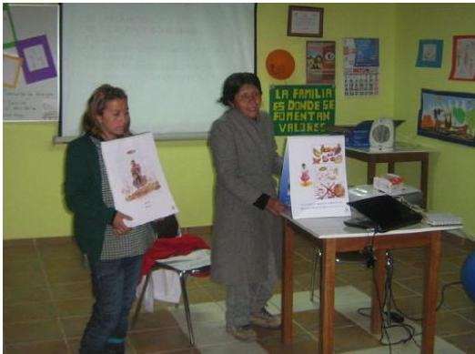

34
## Conclusiones

Las actividades han sido evaluadas en los Consejos de Desarrollo Local, en el que manifiestan la necesidad de contar con las atenciones de los sanadores. En relación al equipo de salud, en las reuniones de equipo, refieren que la experiencia sin duda es buena, sin embargo se hace mención a la continuidad y comunicación fluida con los encargados de la Sala Lickana.

Los resultados, han sido bastantes positivos tanto en la población perteneciente al pueblo atacameño, como a la no indígena. Se destaca la necesidad de mantener la fluidez de las atenciones en la sala Lickana por lo que es fundamental, retomar y mejorar la comunicación con la Asociación de Cultores, y así poder programar las actividades de manera anual.

Guía de experiencias: Pertinencia cultural en el trabajo con pueblos indígenas en el ámbito de la salud sexual y salud reproductiva

35
Guía de experiencias: Pertinencia cultural en el trabajo con pueblos indígenas en el ámbito de la salud sexual y salud reproductiva

## 1.6. EXPERIENCIA DE ARTICULACIÓN ENTRE SANADORES Y PROFESIONAL MATRÓN. CESFAM N° 1, SERVICIO DE SALUD METROPOLITANO CENTRAL, REGIÓN METROPOLITANA

### Responsables

**Lidia Flores.** Facilitadora Intercultural Aymara CESFAM N°1, Servicio de Salud Metropolitano Central.

**Pamela Nain.** Trabajadora social CESFAM N°1, Servicio de Salud Metropolitano Central.

**Waldo Barahona.** Matrón CESFAM N°1, Servicio de Salud Metropolitano Central.

### Contexto y antecedentes

El CESFAM N° 1 se encuentra ubicado en la comuna de Santiago, fue creado en 1937. Esta comuna limita por el norte con las comunas de Renca, Independencia y Recoleta, por el poniente con Quinta Normal y Estación Central, por el Sur con las comunas de Pedro Aguirre Cerda, San Miguel y San Joaquín y por el oriente con Ñuñoa y Providencia.

El número de habitantes de la Comuna de Santiago, según datos del CENSO 2017 es de 404.495 personas. De éstas, 32.817 declaró pertenecer a un pueblo indígena. Un total de 23.947 declaran pertenecer al pueblo mapuche y 1.939 al pueblo aymara.

La comuna se caracteriza por estar conformada por barrios mixtos, esto es, barrios compuestos por personas que efectivamente viven en la comuna y otros sectores donde se concentra población por motivos laborales. Así se identifican distintos barrios: comerciales, financieros, patrimoniales, políticos, por lo tanto, la diversidad de la comuna es amplia. Esto tiene un correlato en el perfil de los usuarios que se atienden en el CESFAM, con personas de diferentes estratos socioeconómicos.

La atención de salud de la Comuna de Santiago tiene una dependencia mixta, una parte de los Centros de Salud tienen dependencia Municipal y otros de dependencia del Servicio de Salud. En el caso del CESFAM N° 1, depende del Servicio de Salud Metropolitano Central y abarca aproximadamente al 50% de la comuna. La población inscrita validada al 2016 es de 45.558 personas, 25.911 mujeres y 19.647 hombres. El CESFAM no cuenta con datos sobre su población indígena inscrita.

36
## Descripción

Se trata de un programa piloto que surge el año 2015. Consiste en una experiencia de articulación entre los sanadores indígenas y un profesional matrón. Se articula con una organización indígena denominada Kurmi que funciona al interior del CESFAM desde el año 2008. Ellos han estado haciendo un trabajo de fortalecimiento de la cosmovisión indígena con el propósito de recuperar la medicina ancestral mediante el conocimiento, uso de la herbolaria y de las prácticas curativas.

La iniciativa tiene una fuerte base organizacional Aymara y son ellos los que realizan las gestiones para contar con atención de un Yatiri y una Qulliri (médicio/a aymará) residente de la región altiplánica quienes desarrollan terapias programadas dos veces al año, coordinada a través del CESFAM N° 1 en Santiago y dirigida a personas indígenas y no indígenas. La iniciativa iniciativa se financia mediante la postulación a proyectos para solventar la venida de los sanadores a Santiago y de esta manera lograr que los usuarios del CESFAM puedan acceder a atenciones de medicina indígena.

La facilitadora del CESFAM realiza un trabajo constante durante el año entregando hierbas y consejerías, de este modo consigue un vínculo cercano con las personas, las inscribe y de esta manera se produce el acceso de los usuarios a la medicina indígena de Yatiri y Qulliri para que puedan ser atendidos.

El trabajo de la facilitadora intercultural considera también la realización de talleres y reuniones con usuarios/as del CESFAM. Se reúnen en una sala donde trabajan con telar, los agentes de medicina indígena realizan masajes, se programan visitas a domicilio y trabajo con las madres y embarazadas para fomentar ciertas prácticas ancestrales de cuidado de niños/as. En conjunto se aprende a preparar algunos tónicos, cremas, etc. También funciona el jardín/huerto que se sustenta con los recursos de proyectos, pero también con las colaboraciones que hacen las propias usuarias llevando una planta, aportando con envases, etc.

El programa piloto ha incorporado además, talleres de alimentación tradicional buscando que ésta se incorpore a la vida cotidiana de las personas.

El trabajo desarrollado por esta experiencia aborda diferentes tipos de problemáticas enfocadas en tratar la depresión, enfermedades cardiovasculares, problemas traumáticos. La idea es evidenciar cómo la medicina indígena contribuye a la medicina occidental para el bienestar y mejoramiento de la calidad de vida de las personas. Ha sido interesante ver como el programa ha tenido aceptación,

Guía de experiencias: Pertinencia cultural en el trabajo con pueblos indígenas en el ámbito de la salud sexual y salud reproductiva

37
Guía de experiencias: Pertinencia cultural en el trabajo con pueblos indígenas en el ámbito de la salud sexual y salud reproductiva

tanto en usuarios indígenas y no indígenas y entre los propios funcionarios del CESFAM que pasan a ser también usuarios de esta experiencia.

Todo este trabajo generó la inquietud en el equipo de pueblos originarios del CESFAM de compartir estas acciones con los funcionarios que forman parte del sistema de salud público, y en particular las atenciones de medicina indígena.

Este trabajo de intercambio y de complementariedad ha estado focalizado principalmente en atenciones gineco-obstétricas, como atención a mujeres embarazadas (ej.: “bebes” que están en mala posición) y mujeres con prolapso. Esto ha implicado tener que efectuar un proceso de sensibilización a los funcionarios, en especial aquellos vinculados al Programa de la Mujer, donde se dio a conocer la oferta del programa, abriendo la opción de realizar derivaciones a los agentes de la medicina indígena, bajo ciertos criterios que son negociados entre el equipo de salud y pueblos indígenas y los profesionales del CESFAM.

La experiencia se vio fortalecida debido al vínculo de trabajo entre el profesional matrón y la facilitadora intercultural, quienes comenzaron a intercambiar conocimientos sobre técnicas de cuidado del embarazo, uso de plantas medicinales posibles de usar con las embarazadas. En este proceso se visibiliza con mayor nitidez la posibilidad de complementar los conocimientos que ambas medicinas aportan y se propuso focalizar en mujeres con prolapso y en mujeres embarazadas con depresión leve, que no requieran uso de fármacos. Pero en el caso de depresión no hubo derivación por parte del sistema biomédico, razón por la que el trabajo se centra en ciertos cuidados del embarazo y el prolapso.

La incorporación de la Qulliri (año 2015) marcó un hito en la manera de abordar el cuidado en el embarazo en el establecimiento. Esto ha generado una mayor apertura por parte de los profesionales del área, por ejemplo, en la práctica del manteo, una técnica no invasiva que consiste en acomodar al feto cuando está en mala posición (no cefálica) y que afecta la posibilidad de un parto normal.

Al inicio hubo resistencia a incorporar esta técnica por parte de los profesionales del CESFAM, sin embargo, con el tiempo y la práctica se evidenció como el manteo es efectivo para acomodar al bebe y de esta forma evitar la realización de una cesárea por esa causa. Es importante destacar que todas las pacientes están diagnosticadas con posición transversal o podálica con ecografía, la que se repite luego de aplicar la técnica del manteo.

38
En estas atenciones el matrón/matrona acompaña y evita intervenir, reconociendo códigos diferentes y la pericia de los/as agentes de medicina indígena para identificar las causas, diagnósticos y cuidados de las embarazadas.

En el caso de prolapso, una vez hecho el diagnóstico, la sanadora indígena realiza las maniobras y el matrón (a) observa y acompaña. Lo interesante de esta experiencia es que en la práctica de atención que ambos realizan hay un verdadero intercambio de conocimientos y técnicas, ambos aprenden y comparten.

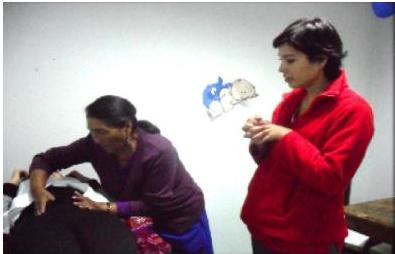

El matrón (a) hace un seguimiento posterior a las mujeres atendidas por la Qulliri, Sra. Aurelia, constatando que los tratamientos tienen un impacto positivo en la salud de las mujeres, “efectivamente los prolapsos mejoran, hay pacientes que evitaron cirugías”.

## Conclusiones

No se puede dejar de mencionar que este proceso ha puesto en tensión a dos modelos de salud en torno a pacientes con prolapso. Tanto la Qulliri como Yatiri manifiestan su reparo sobre la efectividad de su terapia dado que requiere seguir un proceso de reposo y en el establecimiento no están las condiciones para asegurar la efectividad de dicho tratamiento. En este sentido, la atención en domicilio podría ser una alternativa de solución para garantizar el reposo absoluto posterior a la atención de la sanadora.

De acuerdo a evaluaciones realizadas por el equipo de salud responsable de la experiencia, es necesario reforzar estrategias que permitan dar continuidad al proceso. Entre estas se destacan la capacitación y sensibilización a directivos del CESFAM a fin de reforzar las atenciones de ambos sanadores en dicho establecimiento, el fortalecimiento de la atención intercultural, favorecer el trabajo de

Guía de experiencias: Pertinencia cultural en el trabajo con pueblos indígenas en el ámbito de la salud sexual y salud reproductiva

39
Guía de experiencias: Pertinencia cultural en el trabajo con pueblos indígenas en el ámbito de la salud sexual y salud reproductiva

la facilitadora intercultural quien colabora directamente en registro de paciente y preparación de hierbas medicinales. Se requiere también mantener las reuniones del equipo intercultural - interdisciplinario de modo de gestionar el proceso de atención acorde al perfil de la usuaria y definición del modelo de atención. Y por último es importante que se mantenga el apoyo de la asesora técnica encargada de coordinar las derivaciones en el establecimiento.

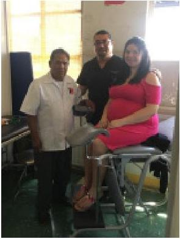

La proyección de este trabajo es avanzar en el registro de estas actividades, de tal manera que la experiencia se consolide e instaure como parte del modelo de atención del CESFAM.

En diciembre de 2017 se realizaron nuevas atenciones de embarazadas, donde profesional matron atiende en su mismo box de atención a pacientes en conjunto con Quilliry.

40
## 1.7. ACOMPAÑAMIENTO A LA MUJER EN EL TERRITORIO, EN SU ROL DE CREADORA Y DADORA DE VIDA. CESFAM TIRÚA.

### Responsables

**Angélica Campos G.** Matrona Ingrid Perló B. Matrona Eduvina Painequeo S. Matrona Ramona Rumi-not. Partera Flora Leviqueo. Partera

### Contexto y antecedentes

Tirúa es una comuna que pertenece a la Provincia de Arauco, región del Bío Bío, limita por el sur con la región de la Araucanía. Cuenta con una población, según CENSO 2017, de 10.417 habitantes, de los cuales 7.330 declara pertenecer a un pueblo indígena y de estos, 7.272 se reconoce como mapuche. Las principales actividades económicas son la agricultura de subsistencia, la pesca artesanal, área forestal y servicios.

De acuerdo a un diagnóstico de salud participativo realizado el año 2012, los principales problemas de salud que la población identifica son obesidad infantil, enfermedades osteomusculares en adultos mayores, sedentarismo, alcoholismo y embarazo adolescente.

El CESFAM trabaja con Mesas Territoriales, Comités de Salud y Consejos de Desarrollo. La comuna cuenta con cinco postas y un CESCOF a través de los cuales se entrega atención de salud a la comunidad. El Hospital base donde se deriva a las personas usuarias es el Hospital de Cañete, distante a 70km de Tirúa. Sin embargo, en ocasiones debido a condiciones climáticas adversas, se requiere realizar la derivación a la comuna de Carahue, perteneciente a la IX región.

En la comuna se entrelazan diferentes modelos de salud. El modelo biomédico occidental el que coexiste con el sistema de salud mapuche. La consolidación del trabajo se basa en el reconocimiento, valoración, convivencia y alianzas. EL CESFAM ha buscado trabajar de manera complementaria con lawentuchefe (persona con conocimiento de medicina indígena), puñenelchefe (partera) y ngutamchefe (componedor de huesos). Es importante destacar que el año 2014 los ngutamchefe fueron reconocidos como tesoros humanos vivos por parte de la UNESCO y del Consejo Nacional de la Cultura y las Artes.

Guía de experiencias: Pertinencia cultural en el trabajo con pueblos indígenas en el ámbito de la salud sexual y salud reproductiva

41
Guía de experiencias: Pertinencia cultural en el trabajo con pueblos indígenas en el ámbito de la salud sexual y salud reproductiva

## Descripción

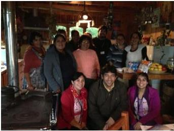

La experiencia se gestó en un largo proceso. En el año 1996 se realizó un Encuentro Nacional sobre Interculturalidad en la comuna de Puerto Saavedra en la IX región. Posteriormente se inició un proceso de sensibilización a los funcionarios de salud que se mantiene como una estrategia hasta hoy. Tirúa se caracteriza por ser una comuna con rotación de personal, especialmente, médicos que desconocen la realidad sociocultural de la comuna, por lo tanto, las acciones de sensibilización e inducción deben ser constantes.

En el año 2006, se gestionaron recursos y se realizó un estudio epidemiológico que recopiló información desde la perspectiva de los agentes de salud indígena. No fue una tarea fácil debido a la negación y persecución histórica que ellos sufrieron; en este sentido hubo que generar confianzas. Es importante reforzar la idea de que el estudio epidemiológico sirvió de base para impulsar el trabajo intercultural, además de identificar agentes de salud que se transformaron en aliados del CESFAM, una vez que se generaron las confianzas necesarias para fortalecer el trabajo.

La llegada e instalación del Programa Chile Crece Contigo a la comuna el año 2007, permitió reforzar las confianzas con las comunidades indígenas y construir una relación de trabajo basada en el respeto. Otro elemento que contribuyó a impulsar esta experiencia fue la continuidad de algunos profesionales de salud del equipo, lo que posibilitó también la construcción de lazos, compromisos y la generación de alianzas con el Programa de la Mujer.

Hubo que demostrar con hechos a las puñenelchefe el respeto y que el CESFAM y los/as profesionales de la salud no se apropiarían de sus conocimientos. Para ello se realizaron trawun (reuniones), conversaciones, invitarlos al CESFAM y los profesionales del CESFAM salir a terreno y estar en la comunidad.

La experiencia partió con acciones de acompañamiento a la gestante y preparación del parto, considerando el enfoque de pertinencia cultural que fue incorporado por la matrona a partir de su trabajo articulado con la partera. Las actividades se centraron en la ejecución de talleres a gestantes,

42
atención en box en compañía de la partera a solicitud expresa de las gestantes, visitas al Hospital base de Cañete y talleres de alimentación con enfoque intercultural, haciendo uso de productos propios de la zona.

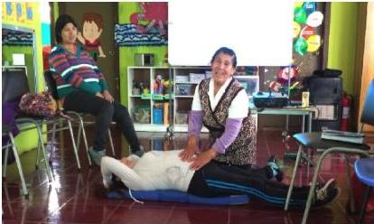

Taller de gestantes a cargo de la partera Sra. Ramona Ruminot

Las visitas al Hospital Base de Cañete consisten en acompañar y mostrar en terreno a las gestantes las distintas alternativas de posición de parto, familiarizarse con el entorno y con el personal. Por otra parte, los talleres con las puñenelchefe contemplan sesiones de carácter expositivo pero muchas veces también evaluación a las gestantes que voluntariamente así lo manifiestan. Las distintas actividades que dan cuerpo a esta experiencia han contado siempre con el apoyo y orientación de los facilitadores interculturales.

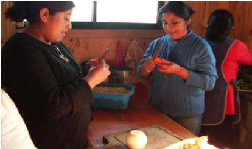

Talleres de alimentación con productos locales. Año 2009

Guía de experiencias: Pertinencia cultural en el trabajo con pueblos indígenas en el ámbito de la salud sexual y salud reproductiva

43
Guía de experiencias: Pertinencia cultural en el trabajo con pueblos indígenas en el ámbito de la salud sexual y salud reproductiva

Las visitas domiciliarias forman parte también de las actividades priorizadas por el CESFAM donde se busca salir del box de atención para un acercamiento más genuino desde los equipos a los espacios de vida de las familias, privilegiando la construcción de climas de confianza. De acuerdo a lo que mencionan los equipos, no es lo mismo atender en el box que trasladarse junto con la partera a la casa de la gestante para su evaluación.

Las parteras juegan un rol fundamental en esta experiencia. Son ellas quienes refuerzan conocimientos ancestrales tradicionales sobre el cuidado durante el embarazo, sobre el cultivo, consumo y preparación de productos locales para una alimentación sana y equilibrada fomentando el uso de alimentos tradicionales en sus hogares. En este sentido, los talleres de alimentación y preparación de comidas mapuche se han transformado en parte de la oferta que esta experiencia pone a disposición de las familias y mujeres mapuche en proceso de gestación. Es bueno destacar que en el último año también se ha logrado incorporar la preparación de “mi primera papilla” con enfoque intercultural destinada a nodrizas con sus bebés pequeños, que también busca rescatar el uso de los productos propios del territorio.

La experiencia aborda también un área de trabajo con niños y niñas que consiste en el rescate e implementación de juegos y trabajos de manualidades indígenas que fomenta el rescate y uso de la lengua mapuche.

Otra cuestión que destaca y ha contribuido en el desarrollo y consolidación de esta experiencia es el trabajo en equipo, especialmente en el ámbito intercultural, favoreciendo el respeto con nuestra comunidad y entre los equipos internos. Cada vez que se proponen nuevas ideas en el trabajo con gestantes, estas son presentadas y trabajadas en la mesa con el equipo intercultural y programa de la mujer, fortaleciendo y favoreciendo el trabajo integrado, y garantizando su éxito en la implementación. Se pueden mencionar como acciones en esta línea los trawun previos a la implementación y difusión de información para entrega de placenta.

El CESFAM ha avanzado en adecuaciones de documentos técnicos como, por ejemplo, la elaboración de una Guía anticipatoria con enfoque intercultural para lactancia materna, la que se complementa con otros recursos audiovisuales como videos, afiches y dípticos.

En el año 2016, como parte de esta experiencia se realizó un trawun con la finalidad de discutir con la comunidad y con diferentes agentes de salud indígenas del territorio nuevas áreas y problemas de salud a explorar. Considerando la realidad de la comuna donde existen demoras en la agenda de

44
horas de especialidades, surgió la idea de focalizar el trabajo con mujeres que presentan problemas para quedar embarazadas.

El conocimiento de parteras y lawentuchefe puede contribuir y/o ser de ayuda en este ámbito, entonces lo que se realiza es la derivación de las mujeres, desde las matronas a las puñenelchefe. Es importante destacar que en ningún caso se trata de pedir las recetas a los agentes de la medicina indígena para que luego sean utilizadas por los funcionarios del sistema biomédico. La experiencia siempre ha promovido el respecto y resguardado de los conocimientos propios de los pueblos indígenas.

Para apoyar el trabajo de los lawentuchefe la experiencia aporta y facilita el traslado de ellos para que puedan proveerse de lawen en los lugares donde está disponible. Producto de la fuerte presencia de forestales en la comuna se ha perdido el lawen (remedios) y cada vez más se reducen los espacios donde acceder a este. En este contexto lo que el CESFAM hace es facilitar el traslado de estos especialistas para que puedan recolectar la base de sus preparados.

Algunos de los logros que se destacan en esta experiencia están relacionados a la visibilización de los agentes tradicionales de salud, reconociendo y valorando su conocimiento y los aportes que estos y sus prácticas hacen a la recuperación y cuidados de la salud de la mujer. También se ha conseguido elaborar material de difusión y la generación de alianzas con otros programas de salud y con la comunidad.

Como toda experiencia, ésta también ha tenido dificultades en su implementación y continuidad. Una de ellas tiene que ver con la rotación de parte del personal de salud del CESFAM lo que ha implicado que muchas veces la continuidad de algunas acciones ha estado en riesgo. Por ejemplo, los talleres de alimentación partieron el año 2009, sin embargo se descontinuaron hasta el año 2013 donde nuevas monitoras asumieron esta tarea. También ha repercutido de manera negativa en el trabajo, el desconocimiento de los equipos de la realidad territorial y poco interés por interactuar en estos espacios. La falta de movilización para realizar visitas a terreno sistemáticamente. Por último, la falta de sistematización y registro de las acciones realizadas. El registro es precario, si bien existe registro fotográfico, la sistematización de este es deficiente y sólo en el último tiempo se ha avanzado en la creación de un formulario para las visitas de las parteras y matronas a las gestantes.

Guía de experiencias: Pertinencia cultural en el trabajo con pueblos indígenas en el ámbito de la salud sexual y salud reproductiva

45
Guía de experiencias: Pertinencia cultural en el trabajo con pueblos indígenas en el ámbito de la salud sexual y salud reproductiva

## Conclusiones

A modo de conclusión y síntesis se puede señalar que la experiencia ha conseguido mantenerse debido a que las acciones que se han implementado tienen su base en la realización de diagnósticos locales de salud y estudios epidemiológicos, cuestión que ha permitido dar respuesta a las necesidades de salud de los pueblos indígenas.

Por otro lado, la mayoría de las propuestas y acciones que se desarrollan son trabajadas en conjunto con los representantes indígenas de las mesas de salud intercultural, facilitadores/as interculturales, agentes del modelo de salud indígena y equipos de salud de los establecimientos y Servicio de Salud. Estas instancias de colaboración, han permitido instalar acciones adecuadas culturalmente en los establecimientos de salud.

Por último, es importante considerar que el trabajo permanente con los agentes de salud indígena ha posibilitado la generación de alianzas y de relaciones de respeto y confianza lo que ha repercutido en la obtención de logros para la comuna y el CESFAM, dentro de los que destacan la visibilización y valoración de los agentes de salud.

46
## 1.8. CUIDADOS DE LA SALUD MAPUCHE EN EL NACIMIENTO. SERVICIO DE SALUD VALDIVIA.

### Responsables

**Ruth Moraga.** Asesora Cultural CESFAM Máfil

**Viviana Huaiquilaf.** Referente Técnico Programa de Salud y Pueblos Indígenas del Servicio de Salud de Valdivia

### Contexto y antecedentes

Según el Censo 2017 la población de la Región de los Ríos alcanza a 384.837 habitantes y una densidad de 20,88 habitantes por kilómetro cuadrado. Respecto de la población indígena regional el CENSO 2017 indicó que del total de su población, 96.311 pertenece a pueblos originarios, lo que equivale al 25,6%. La población mapuche es la mayoritaria en la región alcanzando a 93.251 personas.

La experiencia sobre los cuidados de la salud mapuche en el nacimiento en la región de los Ríos se sustenta en los resultados de un estudio donde fueron recogidos saberes y conocimientos desde los distintos territorios, sobre el nacimiento mapuche en el territorio de Panguipulli y en la sistematización sobre cuidados de la Salud Mapuche, en la gestación, parto, recién nacido, puerperio e infancia. Cuidados que para el Pueblo Mapuche implica reglas culturales que deben mantenerse, inclusive, en el contacto con el sistema de salud occidental, lo cual implica factores protectores para la salud en todo el ciclo vital de la persona que nace. Para ello, se requiere que sean respetados y favorecidos en un contexto de derechos que tiene el pueblo mapuche a la atención de salud con pertinencia cultural, en los centros de salud de la red del Servicio de Salud Valdivia.

### Descripción

El propósito de esta experiencia consiste en ofrecer a usuarios mapuche y no mapuche que se hospitalizan en los Servicios de Ginecología y Obstetricia del Hospital Base de Valdivia, algunas adecuaciones básicas de atención de salud con pertinencia cultural, basadas en el respeto al derecho de las mujeres y familias a hacer uso de pautas culturales de cuidados de salud en la etapa del nacimiento.

Para definir la oferta de salud con pertinencia cultural el equipo desarrolló reuniones con autoridades indígenas del territorio, con asesores culturales y con la mesa de salud intercultural, quienes

Guía de experiencias: Pertinencia cultural en el trabajo con pueblos indígenas en el ámbito de la salud sexual y salud reproductiva

47
Guía de experiencias: Pertinencia cultural en el trabajo con pueblos indígenas en el ámbito de la salud sexual y salud reproductiva

fueron actores clave para orientar respecto de cómo avanzar en estos temas. Así mismo, en estos espacios se produjo una reflexión interesante sobre aquellos conocimientos y prácticas culturales mapuche posibles de incorporar al quehacer del establecimiento de salud, entendiendo que la pertinencia cultural no significa trasladar las prácticas y conocimientos tradicionales sobre cuidados del recién nacido en su conjunto al interior del establecimiento. Esto podría significar incluso transgredir el propio sistema y modelo médico mapuche. En ese sentido, el equipo tomó ciertos resguardos estableciendo la diferenciación entre ambos sistemas.

El equipo en su conjunto definió que la oferta de salud con pertinencia cultural sobre los cuidados del recién nacido, consideraría en un primer momento las siguientes prestaciones:

### 1. Ubicación de los usuarios hospitalizados con cabeceras hacia el este o el sur.

- Identificar las camas con posición de las cabeceras hacia la salida del sol o ubicación al sur.
- Reorientación de las camas con cabeceras ubicadas hacia la salida del sol o hacia el sur, de las salas de hospitalización, en los Servicios de Ginecología y Obstetricia, Puerperio y Medicina.

### 2. Cuidados de la mujer en el proceso de parto.

- Permitir la medicación mapuche a gestantes en pre parto, que lo requieran.
- Colocar el logo autoadhesivo en la agenda de la mujer en la esquina superior derecha, que señala “hará uso de prestaciones de cuidados de la salud mapuche”
- Durante la hospitalización en la unidad de partos se facilita la utilización de medicina mapuche.
- Esta prestación se registra en el lugar destinado para medidas no farmacológicas de alivio del dolor que cada establecimiento posea para este fin.
- Accede a largo del cordón umbilical (8 cm niñas, 9 cm niños) en unidad de partos: Registro de prestación en ficha de atención del recién nacido en sección de datos del parto donde se registra información del cordón umbilical.
- Puede dar de beber gotas de agua medicinal al recién nacido/a, durante la hospitalización en la unidad de puerperio: El registro de la prestación se realiza en la ficha del recién nacido sección registro de exámenes.
- Se facilita el aseo parcial en la unidad de puerperio: El registro de esta prestación se realiza en la hoja de matronería.

48
- Se facilita la elección de la cama con orientación este o sur: La usuaria utiliza la cama identificada con logo. (este logo se colocará en todas las camas de hospitalización que cumplan con el requisito de orientación hacia este o sur).

En esta experiencia intercultural el rol de los establecimientos de salud tanto de atención primaria y hospitales ha sido importante en cuanto a la difusión para facilitar el acceso a las distintas prestaciones dispuestas por el programa. Así mismo, se ha reforzado la experiencia elaborando un set de insumos que apoyan la gestión para las prestaciones de cuidados de salud mapuche. Entre ellos destacan los logos autoadhesivos para agenda de la mujer en la atención primaria de salud, volantes de entrega de información sobre estas prestaciones a las usuarias que pertenecen a pueblos indígenas, afiches y pendones, autoadhesivo de identificación de camas, timbre de registro de las prestaciones y un Manual de cuidados de la salud mapuche dirigido a funcionarios de APS y hospitales.

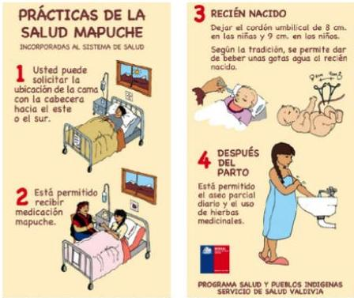

Volante de difusión

Guía de experiencias: Pertinencia cultural en el trabajo con pueblos indígenas en el ámbito de la salud sexual y salud reproductiva

49
Guía de experiencias: Pertinencia cultural en el trabajo con pueblos indígenas en el ámbito de la salud sexual y salud reproductiva

## Conclusiones

Las prestaciones del programa que ofrece esta experiencia se han podido evaluar por medio de la aplicación de un instrumento que verifica el cumplimiento de las prestaciones estableciendo criterios, indicadores y periodicidad de su cumplimiento. (Ver en anexo 1)

Los desafíos que el equipo visualiza para fortalecer la experiencia son: la capacitación permanente a los equipos de salud de Atención Primaria y Hospitales de la Red, monitorear la experiencia y reforzar los registros, para mantener exactitud de los casos que han solicitado la oferta. Es un desafío también la construcción de confianza, reforzar el enfoque de los derechos humanos en salud de los pueblos indígenas. Relevar el rol de asesor cultural en el proceso de difusión de la oferta de cuidados de la salud mapuche en el nacimiento, en los establecimientos de Atención Primaria de Salud. Avanzar con nuevos cuidados a implementar como es la incorporación de la pertinencia cultural en el protocolo de la entrega de la placenta. Mantener asesorías permanentes y evaluación de la experiencia de manera periódica, mantener el compromiso en el trabajo transversal con los Programas de salud sexual y reproductiva, Apoyo al desarrollo biopsicosocial Chile Crece Contigo, Infancia, salud mental, entre otros.

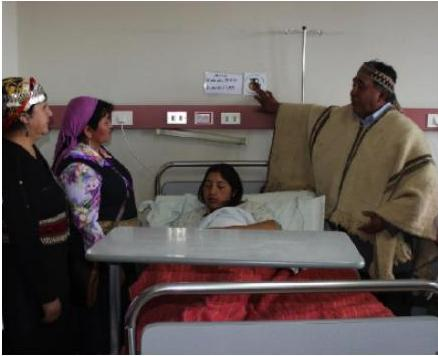

2013: Inicio oficial de la instalación de oferta de cuidados de la salud mapuche en el Hospital Base de Valdivia. Con representantes de la mesa regional de salud intercultural.

50
# **ANEXO 1. LISTA DE VERIFICACIÓN CUIDADOS A SALUD MAPUCHE OTORGADOS A USUARIOS DE LA RED ASISTENCIAL DE SALUD  
SERVICIO DE SALUD VALDIVIA- REGIÓN DE LOS RÍOS**

# **DATOS ESTABLECIMIENTO DE SALUD:**

Establecimiento: ________________________________________________________________________

Fecha parto: _________________________________________________________

# **DATOS USUARIA/O:**

Nombre: _____________________________________________________________________________

Rut: _________________________________ Centro Salud control: _________________________________

|  LUGAR PRESTACIÓN | PRESTACIÓN | SÍ | NO | Respuesta NO, explicitar por qué  |
| --- | --- | --- | --- | --- |
|  **APS** | Recibe información en APS sobre oferta hospitalaria de cuidados de salud mapuche y se entrega volante informativo. |  |  |   |
|   |  Agenda de la mujer cuenta con logo pertenencia a pueblos originarios. |  |  |   |
|  **PARTOS** | Durante hospitalización en la unidad de partos se facilita la utilización de medicina mapuche. |  |  |   |
|   |  Accede a largo del cordón umbilical (8 cm niñas, 9 cm niños) en unidad de partos. |  |  |   |
|  **PUERPERIO** | Puede dar de beber gotas de agua medicinal al recién nacido/a, durante hospitalización. |  |  |   |
|   |  Se facilita el aseo parcial en Unidad de puerperio. |  |  |   |
|   |  Se facilita elección de cama con orientación este o sur. |  |  |   |

*Observación: El presente documento debe ser llenado en Unidad de Puerperio.

Nombre: _________________________________________________________________________ Cargo: _________________________________________________________________________

Firma: _________________________________________________________________________ Fecha: _________________________________________________________________________

Guía de experiencias: Pertinencia cultural en el trabajo con pueblos indígenas en el ámbito de la salud sexual y salud reproductiva

51
Guía de experiencias: Pertinencia cultural en el trabajo con pueblos indígenas en el ámbito de la salud sexual y salud reproductiva

## ANEXO 2. RECOMENDACIONES APLICACIÓN LISTA DE VERIFICACIÓN

**1. Lista de verificación:** Aplicar a usuarias durante hospitalización en Unidad de Puerperio. Esta actividad puede ser realizada por funcionarias/os CHCC, matrona de turno, técnico enfermería de turno.

### PRESTACIONES:

1. 1. Recibe información en APS sobre oferta hospitalaria de cuidados de salud mapuche y se entrega volante informativo.
2. 2. Colocar logo autoadhesivo en agenda de la mujer en esquina superior derecha, que señala hará uso de prestaciones de cuidados de la salud mapuche.
3. 3. Durante hospitalización en la unidad de partos se facilita la utilización de medicina mapuche: Registro de esta prestación en lugar destinando para medidas no farmacológicas de alivio del dolor que cada establecimiento posea para este fin.
4. 4. Accede a largo del cordón umbilical (8 cm niñas, 9 cm niños) en unidad de partos: Registro de prestación en ficha de atención del recién nacido en sección de datos del parto donde se registra información del cordón umbilical.
5. 5. Puede dar de beber gotas de agua medicinal al recién nacido/a, durante hospitalización en unidad de puerperio: Registro de prestación en ficha de recién nacido sección registro de exámenes.
6. 6. Se facilita el aseo parcial en unidad de puerperio: Registro de prestación en hoja de matronería.
7. 7. Se facilita elección de cama con orientación este o sur: Usuaria utiliza cama identificada con logo. (este logo se colocará en todas las camas de hospitalización que cumplan con el requisito de orientación hacia este o sur).

**2. Timbre:** Cada hospital contará con un timbre para enviar registro hacia APS de las prestaciones otorgadas. Registro en hoja de “observaciones” de atención del parto en carnet de salud maternal al momento de aplicar el check list.

52
### ANEXO 3. TIMBRE

#### Servicio de Salud Valdivia
Programa Salud y Pueblos Indígenas

Hospital: _________________________

Fecha: _________________________

Cama orientación Este o Sur SÍ ___ NO ___ Causa _________________________

Uso medicina mapuche SÍ ___ NO ___ Causa _________________________

C. umbilical más largo SÍ ___ NO ___ Causa _________________________

Agüita medicinal RN SÍ ___ NO ___ Causa _________________________

Aseo parcial Puerperio SÍ ___ NO ___ Causa _________________________

Guía de experiencias: Pertinencia cultural en el trabajo con pueblos indígenas en el ámbito de la salud sexual y salud reproductiva

53
Guía de experiencias: Pertinencia cultural en el trabajo con pueblos indígenas en el ámbito de la salud sexual y salud reproductiva

## ANEXO 4. FLUJOGRAMA DE ACCIÓN

# CUIDADOS DE LA SALUD MAPUCHE OTORGADOS A USUARIOS DE LA RED ASISTENCIAL DE SALUD SERVICIO DE SALUD VALDIVIA – REGIÓN DE LOS RÍOS

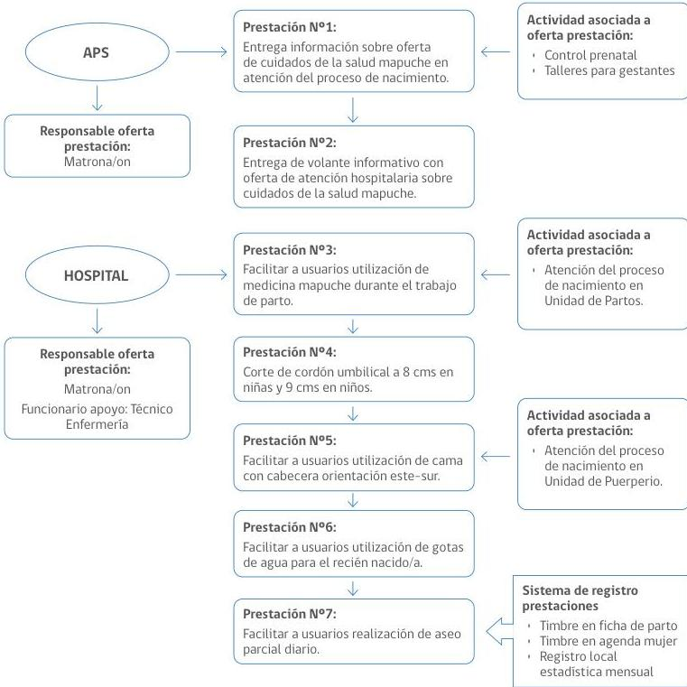

54
## CAPÍTULO 2. RECOMENDACIONES

Las recomendaciones que exponemos a continuación surgen de las 8 experiencias significativas en salud sexual y reproductiva con pueblos indígenas presentadas en esta Guía, que corresponden a 7 regiones del país, desarrolladas tanto por SEREMI, Servicios y establecimientos de salud, que fueron seleccionadas para participar en las Jornadas macrozonales el año 2017 organizadas por el Ministerio de Salud.

Esta línea de trabajo es coincidente con la misión definida por el Ministerio de Salud que propone construir un modelo de salud sobre la base de una atención primaria fortalecida e integrada, que pone a la persona en el centro, con énfasis en el cuidado de poblaciones durante todo el ciclo de vida, y que además estimule la promoción y prevención en salud. Así también, el foco en la salud sexual y reproductiva de los pueblos indígenas se enmarca en los objetivos estratégicos del Ministerio de Salud que plantean formular políticas que permitan incorporar el enfoque intercultural en los programas de salud y reducir las inequidades de los grupos en situación de riesgo, mediante la efectiva ejecución de acciones y programas focalizados, para mejorar la calidad de vida de estos grupos.

La atención de salud sexual y salud reproductiva a personas que pertenecen a pueblos indígenas en el sistema de salud debe considerar el enfoque de determinantes sociales y las brechas existentes en cuanto a las condiciones de salud de esta población en relación a los no indígenas. Esta brecha, según evidencian distintos estudios, se produce debido a dificultades de acceso, a barreras culturales, a discriminación, prejuicios y sesgos culturales instalados en el quehacer habitual de los equipos de salud y por desconocimiento de las concepciones y prácticas de salud propias de los pueblos indígenas.

Cada experiencia posee sus propias particularidades de acuerdo a su contexto territorial, sin embargo, aquí destacamos aquellos elementos comunes que posibilitaron su continuidad en el tiempo, resultados concretos y significativos posibles de ser replicados.

Lo que se busca con estas recomendaciones es incorporar la interculturalidad en la gestión de las SEREMI y Servicios de Salud, así como también, en la atención clínica y en el quehacer de los equipos en los establecimientos de salud, evidenciando estrategias, procedimientos y acciones concretas que pueden impactar en una atención de salud de calidad, generando impactos positivos en la situación de salud de los pueblos indígenas.

Guía de experiencias: Pertinencia cultural en el trabajo con pueblos indígenas en el ámbito de la salud sexual y salud reproductiva

55
Guía de experiencias: Pertinencia cultural en el trabajo con pueblos indígenas en el ámbito de la salud sexual y salud reproductiva

Las recomendaciones están organizadas de acuerdo a dos grandes ámbitos: por un lado, la gestión intercultural y por otro lado, la atención directa que los equipos de salud sexual y salud reproductiva realizan a personas pertenecientes a pueblos indígenas.

## 2.1. RECOMENDACIONES PARA LA PERTINENCIA CULTURAL EN LA GESTIÓN DE LAS SEREMI, SERVICIOS Y ESTABLECIMIENTOS DE SALUD

### 2.1.1. Focalización de grupos prioritarios

Se debe pensar en el sistema de salud como un determinante social de la salud. El sistema de salud tiene la responsabilidad de entregar a todas las personas los servicios de salud de calidad que necesitan, independientemente de la capacidad de pago, estatus social u otras características o condiciones sociales. Cuando se garantiza el acceso equitativo a los servicios de salud y la promoción de la acción en diferentes sectores para mejorar la salud y el bienestar, el sistema de salud puede afectar directamente las diferencias en exposición y vulnerabilidad que resultan en mala salud. (Módulo 1 p. 26)⁵.

La focalización implica concentrar los recursos disponibles en una población potencial claramente identificada, a la que se quiere llegar con determinado programa o proyecto. Implica seleccionar determinados sectores sociales para ser receptores de determinadas acciones o recursos. La focalización no es antagónica a la universalización de servicios. La relación entre políticas universales y políticas focalizadas es de complementariedad.

Para focalizar en grupos específicos se recomienda a los equipos de gestión en salud que consideren las siguientes recomendaciones:

- Recopile antecedentes e información sobre situación de salud de los pueblos indígenas; revisando informes y bases de datos secundarias tales como los diagnósticos regionales basados en determinantes sociales elaborados por las Secretarías Regionales Ministeriales (http://epi.minsal.cl/datos-drs/#/), diagnósticos comunales, datos de CASEN, Encuesta Nacional de Salud, entre otros.
- Revise los indicadores de salud correspondientes a pueblos indígenas por grupos específicos, por ejemplo, niños/niñas, adolescentes, mujeres, embarazadas, etc. y priorice un grupo en particular.

⁵ Curso Taller Integración de la determinación social de la salud en la formulación y quehacer habitual de los programas: Analizando las causas de la inequidades en salud y la relevancia de la intersectorialidad para su abordaje

56
- Analice y releve las necesidades de salud sexual y salud reproductiva de la población indígena, de acuerdo al grupo específico priorizado.
- Proponga estrategias pertinentes para abordarlas, en función a su nivel de resolutividad y el nivel de vulnerabilidad que posee el determinante pesquisado, vale decir, en función de la capacidad que tiene de ser modificado. Por ejemplo, estrategias comunicacionales para la prevención del VIH con mensajes transmitidos por la propia población indígena, usando cuando sea necesario, la lengua indígena.

### 2.1.2. Identificación de una necesidad en salud

En general las experiencias presentadas hacen mención a la necesidad de identificar y abordar problemas de salud concretos en el ámbito de la salud sexual y salud reproductiva que afectan a personas que pertenecen a pueblos indígenas. El planteamiento de un problema puede construirse a partir de:

- Las instancias de participación en salud intercultural, a partir del relato de la experiencia vivida en la atención de salud.
- Presentación de reclamos por usuario/as o comunidad/organizaciones indígenas.
- Demanda y/o solicitud de atención de salud con pertinencia cultural en el marco normativo y enfoque de derechos.
- En la atención de rondas médicas.
- Información proporcionada por estudios epidemiológicos sobre la situación de salud de los pueblos indígenas.
- Orientaciones de un programa específico, por ejemplo, el Programa de Salud de la Mujer.

Elegir desarrollar una línea de acción intercultural, es un proceso dinámico por los argumentos y factores que van surgiendo en la medida en que se va avanzando, de manera que la propuesta o proyecto que se formula debe tener la claridad del problema a resolver.

Guía de experiencias: Pertinencia cultural en el trabajo con pueblos indígenas en el ámbito de la salud sexual y salud reproductiva

57
Guía de experiencias: Pertinencia cultural en el trabajo con pueblos indígenas en el ámbito de la salud sexual y salud reproductiva

### 2.1.3. Trabajo en equipo

Las prácticas significativas presentadas, evidencian que desarrollar acciones interculturales y/o con pertinencia cultural en los establecimientos de salud a través de un programa específico, requieren conjugar distintos aspectos tanto a nivel técnico, organizacional, comunitario y territorial. Estos aspectos permiten generar instancias de reflexión, análisis y toma de decisiones oportuna y adecuada sobre la necesidad de salud de los pueblos indígenas.

Una de las estrategias que más se releva en las experiencias de trabajo en salud sexual y salud reproductiva con pueblos indígenas es el trabajo en equipo. Para la conformación de los equipos de trabajo se recomienda:

- El equipo se conforma por profesionales y técnicos del área de salud como encargadas/os de Programa de la Mujer y de Pueblos Indígenas de SEREMIS, Servicio de Salud y de la Red en función de su nivel de responsabilidad.
- Propicie el trabajo interdisciplinario dando cabida a las perspectivas de profesionales del área de la salud, gestión administrativa y ciencias sociales.
- En situaciones que lo requieran solicite asesoría, acompañamiento y coordinación con facilitadores/as interculturales, sanadores/as, agentes y/o especialistas y representantes indígenas.

Para el desarrollo del trabajo en equipo tenga en cuenta las siguientes consideraciones:

- Valore y reconozca los liderazgos, responsabilidades, habilidades, conocimientos y experiencias de cada uno de los/as integrantes del equipo de salud.
- Propicie una actitud de escucha cuando se relatan experiencias personales y/o cuando se presenta las demandas o el problema que se quiere resolver.
- No imponga los conocimientos en forma jerárquica, considere todas las ideas y discuta con el objetivo de generar propuestas que considere la realidad sociocultural.
- Planifique en equipo, a partir de las necesidades identificadas y priorizadas.

58
### 2.1.4. Planificaciones

A nivel institucional existen diversas herramientas a partir de las cuales los equipos planifican y definen metas. No es poco frecuente que las planificaciones funcionen como campos divididos sin que se genere diálogo entre programas. Esto puede producir duplicidad de acciones, duplicidad de recursos financieros y duplicidad de recursos humanos, tratándose de la misma población objetivo.

Otra de las situaciones que se repite cuando se planifica, es que desde la institucionalidad en salud se asume que todas las iniciativas que involucran a personas que pertenecen a pueblos indígenas son de responsabilidad exclusiva de los/as referentes de las líneas técnicas de salud intercultural en las SEREMI o del Programa Especial de Salud y Pueblos Indígenas. Para superar la situación anterior se recomienda:

- Evite duplicar acciones. Recuerde que muchos de los programa de salud atienden a la misma población objetivo.
- Al momento de planificar, genere instancias de trabajo colaborativo entre el programa de salud y pueblos indígenas y el programa de la mujer con el fin de responder a un objetivo en común.
- Formalice este trabajo en común a través de las plataformas de planificación que ofrece el sistema (Estrategia Nacional de Salud, SIMPO Planificación en RED de APS, entre otras)
- Incorpore los contenidos recibidos en capacitaciones sobre interculturalidad en salud en acciones concretas de su planificación.

### 2.1.5. Compartir experiencias que han avanzado en la transversalización del enfoque intercultural

A nivel nacional, en los espacios de desarrollo local, se han implementado distintas iniciativas, proyectos y experiencias que han buscado construir interculturalidad en el marco de relación de salud con los pueblos indígenas. Algunas de ellas han logrado tener continuidad en el tiempo, alcanzando ciertos resultados y consolidarse como experiencias exitosas de las cuales es posible aprender. Desde hace un tiempo también los equipos de salud han detectado la relevancia que tiene conocer de la experiencia del otro como un instrumento valioso de reflexión y aprendizaje para la acción. Para ello se recomienda que el equipo de salud:

Guía de experiencias: Pertinencia cultural en el trabajo con pueblos indígenas en el ámbito de la salud sexual y salud reproductiva

59
Guía de experiencias: Pertinencia cultural en el trabajo con pueblos indígenas en el ámbito de la salud sexual y salud reproductiva

- Identifique a través del contacto con los referentes de SEREMI y Servicios de Salud vinculados al programa de salud y pueblos indígenas y del programa de salud de la mujer experiencias relacionadas a problemáticas de salud similares a las que afectan a su población objetivo que puedan ser interesantes de revisar.
- Reflexione sobre la viabilidad de replicar la experiencia conocida, considerando el perfil socio-cultural y epidemiológico de la población priorizada.
- Evite copiar lo que se realiza en un determinado territorio e implementarlo de la misma forma sin considerar las particularidades de vuestro territorio.
- Pregúntese sobre qué estrategias podrían ser pertinentes y podrían resolver problemas de salud identificados.

Conocer *in situ* y desde los protagonistas, aquellos que lideran y ejecutan las acciones, se constituye en un motor para el surgimiento y consolidación de nuevas experiencias que puedan aportar al mejoramiento de problemáticas que es necesario modificar y/o mejorar.

### 2.1.6. Instancias de participación indígena en salud, incidiendo en la identificación de problemas de salud

La participación indígena en salud, es uno de los ejes estratégicos de la Política de Salud y Pueblos Indígenas y del Programa Especial de Salud y Pueblos Indígenas. A partir de este eje, las SEREMI y los Servicios de Salud han fomentado la participación indígena en materia de salud a través de la conformación de instancias de participación local, provincial y/o regional.

Lo que las experiencias significativas nos muestran es que estas instancias constituyeron espacios para el análisis, debate y reflexión sobre las problemáticas de salud que afectan a los pueblos. Así mismo, estas instancias permitieron revisar y discutir la implementación del enfoque de interculturalidad en los establecimientos de salud, analizando los límites, posibilidades e implicancias que estos tienen para los sistemas de salud propios. Para el trabajo participativo en salud con los pueblos indígenas tenga las siguientes consideraciones:

- Contáctese con la instancia de participación indígena en salud de su establecimiento. En caso de no existir, propicie su conformación.
- Defina y aborde las problemáticas de salud de manera conjunta.

60
- Considere las ideas y propuestas que surjan desde estas instancias para definir estrategias que permitan resolver los problemas de salud.
- Precise los roles y responsabilidades de cada una de las partes.
- Sea sistemático en el cumplimiento de las tareas y los acuerdos que se generen en esta instancia.
- Elabore un plan de acción de manera consensuada, con plazos y resultados claramente definidos.
- Evalúe los avances y cumplimiento de los objetivos del plan de acción.

Las instancias de participación indígena en salud deberán permitir a los equipos analizar los elementos culturales indígenas que se podrían incorporar en las propuestas de acción interculturales. En este ámbito, los/as representantes y agentes de salud indígenas cobran un rol fundamental para resguardar y colocar los límites de los conocimientos que se podrían incorporar, por ejemplo, el conocimiento de las parteras, de tal forma de no transgredir los patrones culturales. “Tener cuidado de no traspasar mecánicamente el saber indígena, específicamente, de las püñeñelchefe”.

### 2.1.7. Diálogo intercultural en salud para articular acciones con pueblos indígenas

Las experiencias de trabajo en salud sexual y salud reproductiva con pueblos indígenas, que se presentan en este documento, dan cuenta de cómo los equipos de salud orientaron sus trabajos de manera colaborativa, inclusiva y sistemática con las instancias de participación de salud indígenas y/u organizaciones indígenas o también con mujeres indígenas del territorio para abordar este tema de manera adecuada culturalmente.

El diálogo intercultural es el proceso comunicacional y de intercambio de conocimientos, perspectivas, opiniones, experiencias y procedimientos entre personas y grupos de culturas diferentes para facilitar la comprensión de las diversas prácticas y visiones de mundo, reforzar la cooperación y la participación, permitir a las personas desarrollarse y transformarse, además de promover y practicar la convivencia y el respeto por los demás. El diálogo intercultural contribuye a la inclusión social, cultural, económica y política, así como a la cohesión de sociedades culturalmente diversas⁶.

⁶ Definición adaptada de Documento Técnico Diálogos Interculturales en Salud. Ministerio de Salud, Instituto nacional de Salud, Perú, 2016.

Guía de experiencias: Pertinencia cultural en el trabajo con pueblos indígenas en el ámbito de la salud sexual y salud reproductiva

61
Guía de experiencias: Pertinencia cultural en el trabajo con pueblos indígenas en el ámbito de la salud sexual y salud reproductiva

Esta estrategia se ha caracterizado por buscar la articulación de conocimientos y prácticas entre los y las funcionarios/as de salud y personas indígenas con el fin de co-construir la forma concreta de trabajo en el ámbito de salud sexual y salud reproductiva.

Para avanzar en el desarrollo de un diálogo intercultural en salud con pueblos indígenas:

- Tenga una actitud de escucha atenta para aprender de las personas y de sus culturas.
- Desarrolle la amplitud de pensamiento y de buena disposición para no imponer nuestro sistema de ideas y conocimientos sobre los otros.
- Tenga en consideración el proceso histórico de la relación entre el sistema de salud occidental y los sistemas médicos indígenas.
- Despójese de prejuicios y sesgos culturales sobre otras formas de entendimiento de la vida y del mundo.
- Respete a las personas que puedan proceder de un entorno cultural diferente.
- Establezca diálogos de saberes y prácticas entre los sistemas médicos con el fin de orientar a una acción en salud con pertinencia cultural.
- Identifique y analice los elementos culturales indígenas que se podrían incorporar en las propuestas de acciones interculturales.
- Genere espacio para observar, escuchar, y reaprender para luego generar y ejecutar una nueva práctica en salud con pertinencia cultural.

### 2.1.8. Sensibilización de los equipos de salud y sensibilización de los equipos directivos

Una de las estrategias básicas que fortalece la ejecución y proyección de las acciones de salud con enfoque intercultural con pueblos indígenas, la constituye la sensibilización y la capacitación a los/as funcionarios/as, equipos de salud y directivos. La ejecución de esta estrategia tiene relación con comprender los aspectos sociosanitarios, así como la realidad sociocultural de su población.

De este modo, el proceso de sensibilización intercultural se convierte en sí mismo en una experiencia significativa para el equipo de salud puesto que permite al profesional repensar su propio quehacer cotidiano, como también, encontrar estrategias adecuadas para desarrollar acciones de salud con pertenencia cultural. Muchos autores plantean que, la perspectiva intercultural permite transformar y/o modificar ideas, percepciones, estereotipos, conceptos y actitudes de las personas

62
y los grupos colectivos$^{7}$. Por ende, la sensibilización en salud intercultural, debe ser entendida como un proceso que permite generar conciencia crítica, favorece el aprendizaje relacional y la convivencia intercultural.

Los procesos de formación y sensibilización no se deben plantear como una acción aislada, sino que se deben articular con el trabajo sanitario, el contexto sociocultural, sociodemográfico y epidemiológico de su población. Estos procesos de formación deben ser permanentes y continuos debido a la alta rotación de los trabajadores y trabajadoras de la salud.

Algunas consideraciones para el proceso de sensibilización intercultural en el sector salud son:

- Revise los lineamientos ministeriales de capacitación (PAC) y oriente sus planes en base a ellos.
- Dentro del plan de capacitación de su establecimiento, incorporar contenidos sobre interculturalidad y salud de los pueblos indígenas.
- Defina de manera clara y precisa los objetivos institucionales y de aprendizaje y los contenidos del plan de capacitación.
- Es clave que la convocatoria a la capacitación incluya a todos y todas los trabajadores y trabajadoras de la salud: jefaturas, directivos/as, equipos de salud, administrativos/as, auxiliares de servicio.
- Complemente los contenidos y actividades de sensibilización con material audiovisual, folletos, carteles, spots, sin olvidar que por sí solos estos materiales no pueden alcanzar el objetivo de cambio que ha de estar implícito en todas las iniciativas de sensibilización.
- Analice e identifique posibles acciones que pudieran derivar en prácticas discriminatorias, así como también destaque las acciones constitutivas de buenas prácticas para analizarlas en jornadas de sensibilización.
- Complemente los procesos de sensibilización con acciones que consideren el intercambio de saberes con comunidades y/o agentes de medicina indígena.

$^{7}$ Competencias Interculturales. Marco conceptual y operativo. UNESCO y Universidad Nacional de Colombia. 2013

Guía de experiencias: Pertinencia cultural en el trabajo con pueblos indígenas en el ámbito de la salud sexual y salud reproductiva

63
Guía de experiencias: Pertinencia cultural en el trabajo con pueblos indígenas en el ámbito de la salud sexual y salud reproductiva

### 2.1.9. Actualización en adecuaciones normativas

El año 2008, el Estado de Chile ratificó el Convenio 169 de la OIT sobre pueblos indígenas y tribales. Dicho instrumento internacional garantiza el derecho de los pueblos indígenas a mantener y fortalecer sus culturas, formas de vida e instituciones propias y el derecho a participar de manera efectiva en las decisiones que les afectan. Al ratificar este convenio el Estado se compromete a adecuar la legislación nacional y a desarrollar acciones pertinentes de acuerdo a las disposiciones contenidas en el Convenio.

Alineado con este contexto el MINSAL ha incorporado el enfoque intercultural en diversas políticas y normativas sectoriales como la Ley de Autoridad Sanitaria N° 19.397, el Reglamento Orgánico de Minsal (2005), el Reglamento Orgánico de Servicios de Salud, Art 8 Letra e (2005), la Norma General Administrativa N° 16, (2006), La Ley 20.584, art. 7 (2012), la Política Nacional de Alimentación y Nutrición (2017) y la Política Nacional de Salud Sexual y Salud Reproductiva (2018). Así también se modificó el Reglamento de Manejo de Residuos de establecimientos de Atención de Salud, posibilitando, desde el 2017, la entrega de la placenta para fines culturales y espirituales a solicitud de las mujeres en la red de salud pública y privada y se formuló la Norma Técnica que establece las directrices para dicha entrega. En esta misma línea se actualizó la Norma 820 sobre estándares de salud, que incorpora dentro de los datos básicos de identificación de la persona, la pertenencia a pueblos indígenas como una variable y pregunta obligatoria en todos los formularios de salud.

Como lo evidencian las experiencias aquí presentadas, estas normativas, constituyen el sustento formal y jurídico para desarrollar nuestro quehacer en salud con los pueblos indígenas, considerando su realidad epidemiológica, territorial y sociocultural. Estas normativas son las que nos permiten dialogar y hacer alianzas con los profesionales a cargo de los distintos programas de salud para que la institucionalidad adopte medidas que permitan asentar el enfoque de derechos humanos e intercultural en los programas, prestaciones, atenciones; incorporando cambios en su organización institucional, a fin de atender y dar respuestas adecuadas culturalmente a la realidad de los pueblos indígenas, reconocidos por la Ley Indígena 19.253.

De acuerdo a esta base normativa se recomienda:

- Conozca y familiarícese con estas normativas.
- Haga uso de ellas para fundamentar el quehacer de salud con pueblos indígenas.

64
- Difunda, socialice y comparta estas normativas tanto con sus compañeros/as y equipos de trabajo, así como también con personas indígenas y no indígenas, para promover los derechos de estos pueblos.
- Al momento de elaborar reglamentos internos, protocolos, guías, recuerde que se trata de normativas que rigen, aplican y regulan al sistema de salud chileno y no a los sistemas de salud propios de los pueblos indígenas.

### 2.1.10. Adecuación espacial e infraestructura

En ciertos casos, como lo evidencian las experiencias interculturales significativas de esta Guía, la disposición y adecuación de los espacios han sido factores que han contribuido a potenciar y fortalecer el trabajo en salud con los pueblos indígenas y a hacer visibles estas experiencias. Muchas veces pequeñas adecuaciones, basadas en la cosmovisión de los pueblos indígenas acerca de la organización y sentido del espacio, contribuyen a generar climas de confianza, sensación de bienestar, en definitiva, espacios armónicos y coherentes para quienes harán uso de ellos de tal manera de hacer sentir a las mujeres y sus familias como si estuvieran en sus hogares, tal como lo evidencia el Programa Utasanjam Usuña – Parto como en casa.

Para otorgar pertinencia cultural a los espacios e infraestrutura en salud:

Identifique y sea sensible respecto de elementos del ambiente que pueden ayudar a tener una estadía y contacto con el sistema que favorezca los cuidados de la salud sexual y reproductiva de mujeres y hombres indígenas.

- Considere la disposición y dirección del mobiliario.
- Propicie la existencia de una luminosidad y temperaturas adecuadas a las circunstancias, ya sea en una consulta gineco-obstétrica, durante una consejería, en el pre-parto, parto y post-parto, durante el período de hospitalización, por mencionar algunas de las situaciones más comunes.
- Verifique cuán favorable o desfavorable puede ser para el bienestar de las personas consultantes por temas de su salud sexual y reproductiva la sobreintervención de personal médico y de salud en los controles y atenciones o la falta de privacidad en los espacios de atención.

Todas estas son recomendaciones a tener presente desde el quehacer de los equipos de gestión en salud, consideraciones que pueden influir positivamente en el desarrollo y continuidad de las experiencias significativas en esta área.

Guía de experiencias: Pertinencia cultural en el trabajo con pueblos indígenas en el ámbito de la salud sexual y salud reproductiva

65
Guía de experiencias: Pertinencia cultural en el trabajo con pueblos indígenas en el ámbito de la salud sexual y salud reproductiva

## 2.2. RECOMENDACIONES PARA LA ATENCIÓN CLÍNICA DE SALUD CON PERTINENCIA CULTURAL EN EL ÁMBITO DE LA SALUD SEXUAL Y SALUD REPRODUCTIVA CON PUEBLOS INDÍGENAS

Se ha detectado que existen algunas dificultades de comunicación y, en algunos casos, prácticas discriminatorias, cuando las personas pertenecientes a pueblos indígenas se contactan con el sistema de salud, en particular, en la relación entre el/la profesional de la salud, la familia y la persona indígena consultante, por lo que se hace necesario proporcionar propuestas orientadas a superar y resolver esas dificultades, mejorando el trato y la calidad de la atención que reciben las personas que pertenecen a pueblos indígenas.

Para ello esta Guía propone trabajar desde la pertinencia cultural, entendida como adecuaciones que se traducen en un conjunto de acciones integradas y continuas, orientadas a promover cambios en la programación, prevención, promoción y atención de salud, considerando la realidad social y política, así como el perfil epidemiólogo, sociocultural y territorial de los pueblos indígenas, al momento de focalizar en los procesos de salud-enfermedad-atención.

### 2.2.1. Pregunta por pertenencia a pueblos indígenas

Lo primero que el personal de salud debe considerar al momento de la solicitud de atención en los establecimientos de salud, es formular la pregunta por pertenencia a pueblos indígenas, como parte de los datos de identificación básicos de la persona, esperar la respuesta y registrar de acuerdo a lo establecido en la actualización de la Norma 820⁸ y en las Orientaciones Técnicas pertinencia cultural en los sistemas de información⁹. Según esta normativa, la pregunta debe ser formulada en los siguientes términos: ¿Se considera perteneciente a algún pueblo indígena u originario? Este dato es fundamental para conocer la población indígena inscrita en su establecimiento y por otra parte, para conocer la historia de la persona que consulta, orientar y planificar la atención con pertinencia cultural. Por otra parte, le permitirá disponer de datos para conocer la situación de salud de la población indígena de su territorio, elaborar perfiles epidemiológicos y orientar las acciones programáticas en base a la evidencia e información actualizada.

⁸ http://www.deis.cl/wp-content/uploads/2017/02/Decreto-Exento-643-Sustituye-Norma-T%C3%A9cnica-sobre-Est%C3%A1ndares-de-Informaci%C3%B3n-de-Salud-Actualizada-a-Dic-2016.pdf

⁹ https://repositoriodeis.minsal.cl/Publicaciones/2018/Noticias/2018.08.28_OT%20PERTINENCIA%20CULTURAL_web.pdf

66
**2.2.2. Las concepciones de salud, enfermedad**, sexualidad, cuerpo y reproducción son construidas de manera distinta a las de la población en general y muchas veces a la del personal de salud en particular. Esto puede generar situaciones de incomprensión, de discriminación, de rechazo, y de desconfianza. Por ejemplo, algunas mujeres indígenas prefieren que la atención ginecológica sea realizada por personal femenino. Esto en ningún caso quiere decir que no puedan ser atendidas por un matron. Lo importante es generar un ambiente de acogida y formular las preguntas adecuadas. En la primera consulta es fundamental que el/la profesional pregunte si la persona se siente cómoda en la atención, de tal manera de que puedan expresar en sus propios términos sus dolencias y padecimientos. Por parte del equipo y profesionales de la salud, se requiere desarrollar una actitud de escucha atenta y respetuosa que incorpore y referencie estas percepciones en el diagnóstico y tratamiento.

Las mujeres indígenas conceptualizan e interpretan sus problemáticas en el ámbito de la salud sexual y salud reproductiva de acuerdo a su etapa en el ciclo vital, a las molestias y modo en que se manifiestan las dolencias, y a las experiencias previas, positivas o negativas, en relación al sistema biomédico y al sistema médico indígena. Esto orienta la definición del itinerario terapéutico a seguir y puede traducirse en acudir a tratamientos de salud en el ámbito de la familia, de especialistas de la medicina indígena, del sistema biomédico, muchas veces complementando estos distintos tipos de tratamientos.

Cuando situaciones de este tipo ocurran, respete y no invalide las indicaciones proporcionadas por los agentes de la medicina indígena, reconozca el conocimiento y las estrategias de autocuidado de la salud propias de las personas. En sus indicaciones como profesional de la salud destaque la importancia y utilidad para la salud de la persona del tratamiento biomédico, insista en la cantidad y duración del mismo y los beneficios de la complementariedad de ambos sistemas médicos. Por ejemplo, está documentado desde el modelo científico que existen ciertas plantas medicinales que generan interacciones farmacológicas con los anticonceptivos hormonales. En estos casos, exponga esta situación y busque de manera conjunta las adecuaciones que sean necesarias.

### **2.2.3. Relación entre sistemas de salud**

Uno de los modos en que se expresa y materializa el enfoque intercultural en salud es través de la relación entre los sistemas de salud. Esto no debiera constituir una relación obligada, ni forzada que pudiera derivar en una relación de integración del sistema de salud indígena a la estructura y

Guía de experiencias: Pertinencia cultural en el trabajo con pueblos indígenas en el ámbito de la salud sexual y salud reproductiva

67
Guía de experiencias: Pertinencia cultural en el trabajo con pueblos indígenas en el ámbito de la salud sexual y salud reproductiva

lógica de funcionamiento del sistema de salud occidental. Sino más bien, una relación de diálogo y consenso entre ambas perspectivas.

Desde el enfoque intercultural y de derechos humanos la complementariedad implica un acercamiento, diálogo, negociación y aprendizajes entre ambos sistemas de salud para resolver problemas de salud que afectan a la población indígena. Dicho de otro modo, la complementariedad comprende el respeto y la aceptación de un conjunto de conocimientos indígenas en salud, el ejercicio pleno de sus prácticas de sanación en sus territorios o en relación con el sistema de salud público, la prescripción de tratamientos y medicamentos. En este sentido, la complementariedad se sustenta en prácticas concretas de colaboración e intercambios entre los agentes de salud indígena y los equipos de salud, sin poner en duda la experticia de cada uno de ellos y de esta manera asegurar la continuidad en el cuidado de la salud.

#### 2.2.4. Motivos de consulta

Las mujeres indígenas valoran y confían en las prestaciones de salud sexual y reproductiva que otorga el sistema de salud público. Cuando saben que están embarazadas acuden al centro de salud para recibir las prestaciones propias del sistema. Lo que a veces cuestionan es la sobre intervención de determinadas prestaciones y la alta rotación del personal de salud que impide establecer una relación de confianza. En el caso de mujeres jóvenes primíparas es común que se hagan acompañar por sus madres. Esto puede resultar de gran ayuda para los equipos de salud, dado el conocimiento y experiencias que las mujeres mayores pueden tener respecto del embarazo, la maternidad y el cuidado del recién nacido. Como integrante del equipo de salud considere esta diada, valore estos conocimientos en tanto recursos terapéuticos válidos para el cuidado y prevención de la salud.

**2.2.5. El idioma**, también puede generar barreras en la comunicación. Aun cuando hoy día gran parte de la población indígena es bilingüe, muchas veces las personas no atribuyen el mismo sentido y significado a determinados conceptos, lenguajes, presentando dificultades para expresar sus dolencias. Por otra parte, es común que las personas desconozcan o no estén familiarizadas con el lenguaje técnico habitualmente usado por el personal de salud. Por eso es común que las personas adultas se hagan acompañar por un familiar más joven que pueda actuar como apoyo y mediador en estas situaciones, pudiendo ser una valiosa ayuda. Como integrante del equipo de salud, cuando entregue indicaciones, asegúrese de que se han comprendido los mensajes, preocúpese de utilizar un lenguaje descriptivo, claro y cercano al universo simbólico y conceptual de la persona indígena que consulta.

68
Por otra parte, hoy día muchos establecimientos de salud cuentan con facilitadores/as interculturales, que trabajan en estos espacios, muchos de ellos son hablantes de la lengua originaria y conocedores de los protocolos del sistema de salud indígena y no indígena. Cuando se presenten barreras de comunicación y situaciones de incomprensión considere y apóyese en los/as facilitadores/as interculturales durante todo el proceso de atención, tratamiento y acompañamiento. Esto facilitará la relación entre el equipo de salud y la persona consultante lo que fortalecerá la continuidad de los cuidados.

Cabe señalar, que se han presentado situaciones en que personas y familias indígenas han manifestado su negación, rechazo y/o resistencia frente a algún tipo tratamiento específico como, por ejemplo, en caso de vacunación. Frente a este tipo de situaciones, evite los prejuicios, agote todas las instancias de diálogo y ajústese a las normativas nacionales e internacionales de derechos humanos de los pueblos indígenas para dar respuestas a estas problemáticas. Propicie las negociaciones de significados, busque antecedentes sobre casos similares anteriores, presente todas las evidencias respecto de este tratamiento en específico, buscando los acuerdos con el grupo familiar y comunitario más próximo.

**2.2.6. La dispersión geográfica**, especialmente en las zonas rurales, debiera ser también un elemento a tener presente. Muchas veces las personas pueden presentar dificultades para llegar a los horarios de consulta debido a jornada laboral extensa, distancias y escasez de transporte público, pudiendo perder la hora de consulta programada. Se recomienda al equipo de salud estar atento a estos casos, conocer la localidad de origen y condiciones sociales de las personas consultantes. Considerar en la gestión y programación de horas de atención a aquellas personas que residen en las localidades más distantes, la disponibilidad horaria, especialmente, cuando se trate de progra-

programar horas de especialistas en el nivel secundario. No olvidar que esto implica para los usuarios mayor tiempo para el traslado, recursos para pasajes y altas expectativas en relación a la oportunidad de atención por especialista.

### **2.2.7. Concepciones sobre tratamiento farmacológico**

Entre los pueblos indígenas está presente la idea de que el consumo de medicamentos tiene efectos secundarios negativos en el organismo de la persona. En general, y especialmente los comprimidos, son considerados elementos fuertes y de difícil absorción. Así mismo, es común, que las personas indígenas puedan abandonar los tratamientos cuando perciben los primeros síntomas de alivio o

Guía de experiencias: Pertinencia cultural en el trabajo con pueblos indígenas en el ámbito de la salud sexual y salud reproductiva

69
Guía de experiencias: Pertinencia cultural en el trabajo con pueblos indígenas en el ámbito de la salud sexual y salud reproductiva

sensación de mejoría. En este sentido, cuando se requiere tratamiento antibiótico, es importante asegurarse que las personas han comprendido la pauta y la necesidad de completar el tratamiento aunque los síntomas hayan desaparecido.

Otro elemento de carácter general a considerar en relación a los medicamentos tiene que ver con el horario indicado para tomar el medicamento. Una experiencia que ha dado buenos resultados indica el uso de simbologías (salida del sol, medio día, y cuando se esconde el sol) para marcar los horarios, buscando no generar confusión y olvido de tomar los medicamentos.

El tamaño y color de los comprimidos también juegan un rol importante al poder ser interpretados, conceptualizados y usados de acuerdo a la magnitud de la dolencia. Por ejemplo, un comprimido de mayor tamaño puede ser interpretado como más fuerte, más difícil de absorber y con mayor efecto. Una situación similar puede ocurrir en relación a los colores de los comprimidos. Por lo general el color rojo se entiende como un medicamento más fuerte y de efecto más rápido. Por eso es importante, asegurarse que la indicación entregada a la persona consultante sea por escrito y si es necesario con ayuda de imágenes y colores, de tal forma que sea clara y precisa, en relación directa con los síntomas, con el diagnóstico y con las características del fármaco.

Por otra parte, los pueblos indígenas tienen conocimientos y prácticas en el tratamiento de ciertas dolencias en base al uso y consumo de plantas medicinales. Si esta situación se presenta en su espacio de consulta, respete y considere información sobre las interacciones farmacológicas, procurando que ambos tratamientos se complementen y uno no interfiera de manera negativa en el otro.

### 2.2.8. Examen físico

Este procedimiento compromete una acción sensible para la usuaria, por lo anterior informe y explique de manera clara en qué consiste este procedimiento y busque la aprobación de la usuaria para realizarlo. Reciba y atienda a las usuarias con respeto y amabilidad, evitando utilizar un tono de voz alto o realizar comentarios que puedan resultar ofensivos por su vestimenta o prácticas durante el embarazo o la atención del parto. En este mismo sentido, es importante que la sala de atención mantenga una temperatura cálida adecuada, debido a que desde la concepción indígena los cambios bruscos de temperatura de frío a calor o viceversa pueden generar un trastorno delicado en la salud de la persona.

70
En muchos lugares del país, las personas indígenas y en especial las mujeres, mantienen el uso de la vestimenta tradicional, caracterizada por ser abrigadora, de fabricación artesanal, no industrializada y por capas. Esta situación puede requerir mayor tiempo en la atención al momento del examen físico.

### 2.2.9. Infecciones de transmisión sexual

En las comunidades indígenas, en general, existe desinformación, confusión y dudas sobre las formas en que estas enfermedades se transmiten, cómo reconocerlas, cuáles son sus tratamientos, etc. En los sectores urbanos existe mayor manejo de información sobre este tipo de enfermedades, sin embargo, existe temor y vergüenza a consultar. Como profesional de la salud, actúe de manera natural y sin prejuicios ni presuposiciones, procure la privacidad del consultante, realice las preguntas clave, entregue la información necesaria y de manera adecuada y respete la decisión de la persona. Genere instancias de conocimiento respecto de concepciones indígenas acerca de este tipo de infecciones.

### 2.2.10. Movilidad geográfica

Es frecuente la movilidad geográfica de las personas indígenas por motivo laborales y desplazamiento de su región de origen. Esto puede ocasionar que la persona puede estar registrada en dos establecimientos de salud, lo que podría ocasionar duplicidad de diagnóstico y problemas en la continuidad de los tratamientos y cuidados. Por eso es importante que el personal de la salud indague en la historia clínica personal y familiar del consultante. Procure facilitar la atención en estos casos, evitando las trabas administrativas. Posteriormente explique al usuario el funcionamiento del sistema de salud para estos casos.

Guía de experiencias: Pertinencia cultural en el trabajo con pueblos indígenas en el ámbito de la salud sexual y salud reproductiva

71
Guía de experiencias: Pertinencia cultural en el trabajo con pueblos indígenas en el ámbito de la salud sexual y salud reproductiva

## GRUPO DE TRABAJO MINISTERIAL¹⁰

JUAN HERRERA BURROT

Profesional Departamento Modelo de Atención Primaria
División de Atención Primaria
Subsecretaría de Redes Asistenciales
Ministerio de Salud

CLODOVET MILLALEN SANDOVAL

Encargada Programa de Salud y Pueblos Indígenas
Departamento Modelo de Atención Primaria
División de Atención Primaria
Subsecretaría de Redes Asistenciales
Ministerio de Salud

SOLANGE BURGOS ESTRADA

Profesional Unidad de Salud Sexual y Salud Reproductiva-VIH/ITS. Departamento de Gestión de Procesos Clínicos Integrados
División de Gestión de la Red Asistencial
Subsecretaría de Redes Asistenciales
Ministerio de Salud

DANIELA VARGAS GUZMÁN

Profesional Unidad de Salud de La Mujer y Salud Sexual y Reproductiva-VIH/ITS
Departamento de Procesos Clínicos Integrados
División de Gestión de la Red Asistencial
Subsecretaría de Redes Asistenciales
Ministerio de Salud

RODRIGO NEIRA CONTRERAS

Profesional Programa Nacional de Salud de la Mujer. Departamento Ciclo Vital
División de Prevención y Control de Enfermedades
Subsecretaría de Salud Pública
Ministerio de Salud

BÁRBARA BUSTOS BARRERA

Profesional Departamento de Salud y Pueblos Indígenas e Interculturalidad
División de Políticas públicas Saludables
Subsecretaría de Salud Pública
Ministerio de Salud

GRACIELA CABRAL QUIDEL

Profesional Departamento de Salud y Pueblos Indígenas e Interculturalidad
División de Políticas públicas Saludables
Subsecretaría de Salud Pública
Ministerio de Salud

¹⁰ Agradecemos la colaboración y aportes al grupo de trabajo que realizaron los profesionales Eduardo Soto, Marta Prieto y Yamileth Granizo mientras se desempeñaron como funcionarios/as del Ministerio de Salud. Así mismo, agradecemos las contribuciones de los profesionales Bárbara Leyton profesional de la División de Gestión y Control de Enfermedades, DIPRECE y Danilo Ríos, profesional de la División de Atención Primaria, quienes se dispusieron a realizar la lectura final de esta guía.

72
## RESPONSABLES DE LAS EXPERIENCIAS$^{11}$

|  **SEREMI DE SALUD DE TARAPACÁ** | **ALEJANDRA FLORES** Coordinadora Regional de Salud y Pueblos Indígenas SEREMI de Salud Tarapacá.  |
| --- | --- |
|   |  **CONSEJO DE SALUD Y PUEBLOS ORIGINARIOS** SEREMI de Salud Tarapacá.  |
|  **SERVICIO DE SALUD TALCAHUANO** | **CAROLINA ALARCÓN** Jefa Dpto. Participación Social, satisfacción usuaria y comunicaciones Servicio de Salud Talcahuano  |
|   |  **PAVEL GUIÑEZ NAHUELÑIR** Asesor intercultural Servicio de Salud Talcahuano  |
|   |  **NEFTALI PAINEQUEO** Facilitador Intercultural Hospital las Higueras Talcahuano Servicio de Salud Talcahuano  |
|   |  **ROXANA MILOS** Matrona Encargada del Programa Salud de las Mujeres Servicio de Salud Talcahuano.  |
|   |  **DORIS HENRÍQUEZ** Matrona encargada gestión del cuidado Hospital Las Higueras. Servicio de Salud Talcahuano.  |
|   |  **SUSANA RÍOS** Matrona Supervisora ÁREA Urgencia Hospital Las Higueras. Unidad de Partos Servicio de Salud Talcahuano.  |
|   |  **CLAUDIA ECHEVERRÍA** Enfermera, Asesora Calidad Servicio de Salud Talcahuano  |

$^{11}$ Agradecemos la colaboración y aportes a la experiencia significativa de la SEREMI de Salud de Tarapacá y del Hospital de Victoria de las funcionarias Patricia Sarabia y María Victoria Riffo.

Guía de experiencias: Pertinencia cultural en el trabajo con pueblos indígenas en el ámbito de la salud sexual y salud reproductiva

73
Guía de experiencias: Pertinencia cultural en el trabajo con pueblos indígenas en el ámbito de la salud sexual y salud reproductiva

|  **HOSPITAL VICTORIA** | **CRISTIAN MELIÑAN** Facilitador Intercultural Hospital Victoria  |
| --- | --- |
|   |  **RAMÓN QUINTREL LINCO** Facilitador Intercultural Hospital Victoria  |
|   |  **ESTEFANIA BASTÍAS** Psicóloga, Programa Chile Crece Contigo Hospital Victoria  |
|   |  **CATHERINE POBLETE** Matrona Hospital Victoria  |
|   |  **INGRID DE LA PEÑA** Educadora de Párvulos Hospital Victoria  |
|   |  **INGRY SANCHEZ KUNZ** Trabajadora Social Hospital Victoria  |
|  **SERVICIO DE SALUD ARICA** | **MARÍA JOSÉ URRUTIA** Encargada de Programa Especial de Salud y Pueblos Indígenas Sección de Modelo de Atención de Salud Subdepartamento Dirección de Atención Primaria Subdirección de Gestión Asistencial Servicio de Salud Arica  |
|   |  **SRA. JULIA HUANCA CONDORI** Usuyiri (partera) Aymara Servicio de Salud Arica  |
|  **CESFAM SAN PEDRO DE ATACAMA** | **YOVANA GONZALEZ G** Matrona Directora CESFAM San Pedro de Atacama  |
|   |  **EQUIPO DE SALUD CESFAM SAN PEDRO DE ATACAMA**  |
|  **CESFAM Nº 1 RAMON CORBALÁN MELGAREJO** | **LIDIA FLORES** Facilitadora Intercultural Aymara CESFAM Nº1 Servicio de Salud Metropolitano Central.  |
|   |  **PAMELA NAIN** Trabajadora Social CESFAM Nº1 Servicio de Salud Metropolitano Central.  |
|   |  **WALDO BARAHONA** Matrón CESFAM Nº1 Servicio de Salud Metropolitano Central.  |

74
|  **CESFAM TIRÚA** | **ANGÉLICA CAMPOS G** Matrona CESFAM Tirúa  |
| --- | --- |
|   |  **INGRID PERLÔ B** Matrona CESFAM Tirúa  |
|   |  **EDUVINA PAINEQUEO S.** Matrona CESFAM Tirúa  |
|   |  **RAMONA RUMINOT** Partera CESFAM Tirúa  |
|   |  **FLORA LEVIQUEO** Partera CESFAM Tirúa  |
|  **SERVICIO DE SALUD VALDIVIA** | **RUTH MORAGA** Asesora Cultural CESFAM Máfil Servicio de Salud Valdivia  |
|   |  **VIVIANA HUAIQUILAF** Referente Técnico Programa de Salud y Pueblos Indígenas Servicio de Salud de Valdivia  |

## EQUIPO EDITOR

|  **División de Políticas Públicas Saludables y Promoción. Subsecretaría de Salud Pública** | Departamento de Salud y Pueblos Indígenas e Interculturalidad  |
| --- | --- |

Guía de experiencias: Pertinencia cultural en el trabajo con pueblos indígenas en el ámbito de la salud sexual y salud reproductiva

75

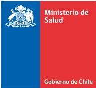