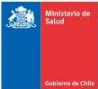

Ministerio de Salud

Gobierno de Chile

# Norma General Técnica para la entrega de placenta

2017
Ministerio de Salud. Norma General Técnica N°189 para la entrega de la placenta Santiago, MINSAL 2017

Todos los derechos reservados. Este material puede ser reproducido total y parcialmente para fines de difusión y capacitación. Prohibida su venta.

1° edición y publicación 2017

Decreto Exento N° 208 del 05 de junio del 2017 del Ministerio de Salud
Norma General Técnica para la entrega de placenta - 2017
4

Norma General Técnica para la entrega de placenta - 2017

## 1. INTRODUCCIÓN

El incorporar un enfoque de derechos humanos en salud, implica brindar prestaciones con pertinencia cultural, reconociendo que la pertenencia a diversas culturas, sus hábitos y costumbres, son un aspecto fundamental en el proceso salud-enfermedad. Una puesta en práctica, del mencionado enfoque, dice relación con atender aspectos emocionales, afectivos, espirituales y culturales, así como también otras visiones de la medicina.

La entrega de la placenta bajo condiciones normativas semejantes y que deban ser observadas en todos los establecimientos de salud dónde sea requerida, permite incorporar una práctica que sigue las recomendaciones de la Organización Mundial de la Salud (OMS, 1985) en materia de salud reproductiva de las mujeres. Corresponde al Ministerio de Salud, en base a las demandas de las personas y la evidencia científica, entregar los lineamientos técnicos para asegurar que la entrega de la placenta pueda ser realizada de manera sanitariamente segura, tanto para quienes la reciban como para quienes la entreguen.

La solicitud de entrega de placenta, es una demanda de larga data y en la búsqueda de respuesta el Ministerio de Salud de Chile conformó un grupo de trabajo con referentes de distintos programas. Una primera tarea de este grupo fue trabajar en la modificación realizada al Decreto N° 6 del año 2009 del Ministerio de Salud, que aprueba el Reglamento sobre Manejo de Residuos de Establecimientos de Atención de Salud (REAS). Dicha modificación fue aprobada por Decreto Supremo N° 43 de 2016 del Ministerio de Salud. En una segunda etapa, y tal como lo establece la modificación reglamentaria; se trabajó en la elaboración de la presente Norma General Técnica para la entrega de placenta. Destacamos que para la preparación de este documento se ha considerado la experiencia de los equipos de salud de los establecimientos de salud a lo largo del país.

Esperamos que este documento apoye a los equipos de salud y contribuya en la atención integral, personalizada y respetuosa de los derechos y diversidad cultural de la población de nuestro país y que a su vez asegure una correcta manipulación de la placenta. Corresponderá a cada establecimiento de salud de atención cerrada, tanto público como privado, establecer un protocolo de entrega de placenta en base a la presente Norma General Técnica.
5^{}[] Norma General Técnica para la entrega de placenta - 2017

## 2. ANTECEDENTES

### Salud reproductiva y derechos humanos

Las actuales conceptualizaciones de la Salud Sexual y la Salud Reproductiva van más allá de la sexualidad y la reproducción, pues incorporan un marco ético de derechos humanos.

La salud reproductiva es un estado general de bienestar físico, mental y social, y no de mera ausencia de enfermedades o dolencias, en todos los aspectos relacionados con el sistema reproductivo, sus funciones y procesos. En consecuencia, la salud reproductiva entraña la capacidad de disfrutar de una vida sexual satisfactoria, sin riesgos, de procrear, y la libertad para decidir hacerlo o no, cuándo y con qué frecuencia (OMS, 2003).

Este abordaje se centra en las personas y sus derechos, reconociéndolas como sujetos activos que participan junto a las(os)profesionales de salud en la búsqueda de una mejor calidad de vida para sí mismas. Estos derechos no sólo involucran el acceso a una atención oportuna y adecuada, sino que además se relacionan con una mejora continua de los determinantes sociales de la salud. Por su parte, los derechos reproductivos, se refieren al derecho de todas las personas y las parejas a decidir libre y responsablemente el número y espaciamiento de hijos y a disponer de información, educación y los medios para ello; sin ser sometidos a discriminación, coerción o violencia (Minsal, 2008).

### Fundamentos socioculturales

La literatura registra una diversidad de prácticas culturales en torno al uso y disposición de la placenta realizado por personas pertenecientes a diversas culturas y sociedades. En general, la evidencia releva la conexión existente entre un tratamiento adecuado y respetuoso de la placenta y el cuidado y mantención de una buena salud tanto de la mujer, el recién nacido y su entorno familiar y comunitario (Davison, 1983; Alarcon, 2008).

Para comprender el sentido que el uso de la placenta adquiere para las personas en determinados tiempos y contextos, es importante aproximarnos a una definición de lo que entenderemos por práctica cultural.

Desde el ámbito de la salud, una práctica cultural se define como una acción que es constante, de carácter colectivo, que permite a las personas organizar la vida cotidiana y sus experiencias en el mundo para actuar e interactuar en él. Una práctica cultural posibilita que los sujetos puedan establecer relaciones esperables y comprendidas por el colectivo, así como, estar preparados para comprender e interpretar las prácticas de las personas que comparten una misma matriz sociocultural. Dicho en otros términos se trata de “acciones que se realizan en el contexto de visiones de mundo compartidas” (Perirano, 2001; p. 9).

Una práctica cultural se define también por su carácter dinámico, es decir, que puede ser transformada en el tiempo.

Las prácticas culturales se caracterizan, además por ser heterogéneas, es decir, dentro de un mismo grupo puede existir matices y diferencias en la expresión de una misma práctica cultural debido a que los personas son actores conscientes con experiencias particulares que nunca son iguales a las de los demás.

Uno de los aspectos que diferencia y define la práctica cultural del uso y disposición de la placenta es su carácter ceremonial y/o ritual; se entiende ésta como un tipo de evento especial, de carácter
6

Norma General Técnica para la entrega de placenta – 2017

formalizado y cíclico, es decir, que presenta una cierta estabilidad y/o regularidad en el tiempo. La ceremonia que se realiza con la placenta está asociada al curso de vida y al desarrollo integral de la persona. Como tal, posee un orden que la estructura y un propósito específico que la orienta, un sentido de acontecimiento cuyo propósito se circunscribe al ámbito familiar y una percepción general de que es diferente. Es importante destacar que las prácticas culturales rituales y/o ceremoniales, amplían, acentúan y ponen de manifiesto lo que es común en una sociedad (Peirano, 2001).

La placenta, desde un punto de vista fisiológico, es un órgano intermediario durante la gestación entre la madre y el feto, que se adhiere a la superficie interior del útero y del que nace el cordón umbilical; permite la absorción de nutrientes, la eliminación de residuos y el intercambio de gases a través de suministro de sangre.

La placenta en la cosmovisión indígena es símbolo de vida, representa la relación entre la madre y el/la recién nacido/a. Su tratamiento ceremonial se resguarda para un ámbito más íntimo, que posibilita a la familia y entorno más cercano del recién nacido/a fortalecer y reafirmar los lazos de protección y acompañamiento del niño/a en su formación como persona. En ese sentido, el manejo de la placenta determina el destino del niño/a, de ahí el especial cuidado que la familia otorga a la placenta, ya que el destino de ésta tiene gran importancia y repercusión en la vida de la familia y comunidad. En este sentido, la placenta se relaciona con los antepasados y las prácticas ceremoniales realizadas por los pueblos indígenas, quienes buscan fortalecer la historia y continuidad de pertenencia de una familia a un determinado territorio.

En la actualidad en Chile, el manejo y disposición de la placenta es una práctica cultural presente en personas pertenecientes o no pertenecientes a pueblos indígenas. Ante estas experiencias, es necesario contar con una normativa técnica ministerial que garantice la entrega de la placenta a todas las mujeres con prácticas culturales significativas para sí mismas; en un marco de regulación sanitaria segura, tanto para quienes la reciban como para quienes la entreguen.

### 3. PROPÓSITO

Esta Norma General Técnica pretende garantizar el derecho de las mujeres a disponer de su placenta, respetando sus prácticas culturales y entregar un marco con las garantías sanitarias para reguardar la salud de la población.

### 4. MARCO REGULATORIO

- Código Sanitario, aprobado por Decreto con Fuerza de Ley N°725, de 1967, del Ministerio de Salud.
- Decreto con Fuerza de Ley N°1, de 2005, del Ministerio de Salud, que fija el texto refundido, coordinado y sistematizado del Decreto Ley N°2.763, de 1979, y de las leyes N°18.933 y N°18.469.
- Ley N° 20.584 de 2012, del Ministerio de Salud, que regula los derechos y deberes que tienen las personas en relación con acciones vinculadas a su atención de salud y sus reglamentos
- Decreto Supremo N° 6 de 2009, del Ministerio de Salud, que aprobó el Reglamento sobre Manejo de residuos de establecimientos de atención de Salud.
- Decreto Supremo N° 43, del 2016, del Ministerio de Salud, que Modifica Decreto Supremo N°
7

Norma General Técnica para la entrega de placenta - 2017

6, de 2009, del Ministerio de Salud, que Aprueba Reglamento sobre Manejo de Residuos de Establecimientos de Atención de Salud (REAS). La modificación aprobada, incorpora el artículo 6 bis que, que señala: “la placenta se entregará a requerimiento de la mujer, en la medida que sea destinada a prácticas culturales que la mujer considere relevantes. Dicha solicitud deberá realizarse con la anticipación tal que permita llevar a cabo la evaluación médica respectiva. No se entregará la placenta en caso de diagnóstico de determinadas enfermedades y/o infecciones transmisibles. Asimismo, deberá ser entregada debidamente envasada, de acuerdo a las especificaciones técnicas correspondientes. Las placentas cuya entrega no sea requerida de conformidad con lo dispuesto en el inciso anterior, sea que tengan o no agentes patógenos, serán consideradas de acuerdo a la categoría señalada en el artículo 6 N° 2.”.

## 5. OBJETIVOS

General:

- Establecer un marco regulatorio que respete y permita la entrega de la placenta y cordón a todas las mujeres que así lo requieran, de manera sanitariamente segura, tanto en el sistema público como privado del país; de acuerdo al Decreto Supremo N°43, del 2016 del Ministerio de Salud.

Específicos:

- Contribuir en el desarrollo de modelos de atención de salud con pertinencia cultural para la mujer, su hija/hijo y la familia.
- Establecer un proceso seguro de entrega de la placenta, considerando el manejo adecuado de residuos biológicos en el sistema público y privado de salud.
- Fortalecer las capacidades del equipo de salud para el abordaje intercultural en la salud reproductiva.

## 6. REQUISITOS

- La solicitud de la entrega de la placenta debe ser voluntaria y realizada a requerimiento de la mujer embarazada. Esta solicitud debe quedar registrada en la “solicitud de entrega de placenta” la que será incorporada a la ficha clínica (ver anexo 1). Además, debe quedar registrada en el carnet de control prenatal, en el caso que sea solicitada durante el embarazo o en la ficha clínica en el caso del ingreso a la atención integral del parto.
- La solicitud de la entrega de la placenta deberá realizarse con la anticipación tal que permita llevar a cabo la evaluación respectiva, durante el control prenatal o bien en el ingreso a la atención integral del parto. Lo anterior, en atención a las causales de exclusión, establecidas en la presente norma técnica.
- La mujer embarazada deberá firmar la solicitud de entrega de la placenta (ver anexo 1), en la que se compromete a destinar el uso de su placenta sólo para las prácticas culturales que considere relevantes. De acuerdo a lo anterior, dentro de las prácticas culturales no se considera su comercialización.
- No contar con las causales de exclusión, previstas en el punto N° 8 de la presente norma técnica.
8

Norma General Técnica para la entrega de placenta - 2017

## 7. RESPONSABLES

Los Prestadores de Salud Públicos, a través de los Directores de los Servicio de Salud del país, deberán implementar la presente norma técnica en todos los establecimientos de la red asistencial del territorio de su competencia.

Los Prestadores de Salud Privados, a través de sus Directivos, deberá implementar la presente norma técnica en sus equipos de salud.

Lo anterior, en armonía con las disposiciones de la Ley N° 20.584, que regula los derechos y deberes que tienen las personas en relación a acciones vinculadas a su atención de salud, sus reglamentos y toda otra norma que resulte aplicable.

## 8. CAUSALES DE EXCLUSIÓN

- La placenta no podrá ser entregada a aquellas mujeres que presenten diagnóstico de las siguientes enfermedades y/o infecciones transmisibles: VIH, VHB y VHC. En el caso de la infección por virus de hepatitis B o C, se considera al diagnóstico clínico previo de la mujer y por lo tanto, no es exigible la toma del examen durante el control prenatal o preparto, sólo y exclusivamente para la entrega de la placenta.
- La placenta no podrá ser entregada a aquellas mujeres en que posterior al alumbramiento y debido a las características de la placenta, sea indicado un estudio microbiológico o histopatológico de ésta y/o sus anexos ovulares (Ejemplo: diagnóstico de corioamnionitis, microinfartos, entre otros).

## 9. PROCESO OPERATIVO

Control prenatal:

- La solicitud de la entrega de la placenta debe ser voluntaria y realizada por la mujer embarazada a el/la profesional que realiza el control prenatal. Al momento de la solicitud, se orientará a la mujer, y su acompañante significativo sobre los requisitos/exclusiones para la entrega de la placenta y los cuidados en el manejo seguro de la misma.
- El/la profesional que realiza el control prenatal realizará consejería, que permita orientar a la mujer, y su acompañante significativo sobre los requisitos/exclusiones para la entrega de la placenta, como también de los cuidados en el manejo seguro de la misma.
- La mujer debe firmar la solicitud de entrega de placenta (ver anexo 1), en el que acepta los requisitos y causales de exclusión y se compromete a dar uso exclusivo de la placenta y cordón para cumplir con sus ritos o ceremonias, junto con hacer uso de ésta en forma segura para su entorno.

Atención integral del parto:

- La solicitud de la entrega de la placenta debe ser voluntaria y realizada por la mujer embarazada. Al momento de la solicitud, se orientará a la mujer, y su acompañante significativo sobre los requisitos/exclusiones para la entrega de la placenta y los cuidados en el manejo seguro de la misma.
9

Norma General Técnica para la entrega de placenta - 2017

- Al ingreso de la sala de atención integral del parto, el/la profesional (médico, médico gineco obstetra, matrona/ón) responsable de la atención de la gestante, debe revisar los resultados de los exámenes de rutina del embarazo, los que deben ser negativos o no reactivos para continuar con el proceso de la entrega de la placenta.
- La mujer debe firmar la solicitud de entrega de placenta (ver anexo 1), en el que acepta los requisitos y causales de exclusión y se compromete a dar uso exclusivo de la placenta y cordón para cumplir con sus ritos o ceremonias, junto con hacer uso de ésta en forma segura para su entorno.
- El/la profesional (médico, médico gineco obstetra, matrona/ón) responsable de la atención del parto es el/la garante de resguardar que la placenta sea correctamente envasada e identificada, además de registrar su entrega en la ficha clínica existente en la institución y el sistema de registro de entrega.
- En el caso que la placenta no haya sido solicitada por la mujer o que no se cumplan los requisitos de entrega, ésta debe manejarse como residuo patológico, según lo establece el artículo 6 N°2 del Decreto N°6, de 2009 del Ministerio de Salud, que aprobó el reglamento sobre manejo de residuos establecimientos de atención de salud (REAS).

## 10. ENTREGA DE LA PLACENTA

- La placenta debe ser entregada en doble bolsa de plástico gruesa, opaca, impermeable y de medidas adecuadas para ésta.
- Deben estar claramente identificados al menos los datos verificadores siguientes: Nombre completo de la mujer, RUN o número de documento de identidad, fecha del parto y establecimiento de salud respectivo.
- Durante el periodo comprendido entre el alumbramiento y la entrega a la mujer, la placenta debe mantenerse refrigerada (refrigerador clínico).
- Como regla general el retiro de la placenta desde el establecimiento, será al alta de la mujer o a las 72 horas post atención del parto (normal o quirúrgico); sin perjuicio de la evaluación de cada caso en particular.

## 11. SISTEMA DE REGISTRO

Los establecimientos de salud deben mantener registro de las placentas entregadas con los datos siguientes: nombre de la mujer, RUN o número de documento de identidad, según corresponda, fecha de parto, fecha de entrega; nombre, firma y RUN de quien retira y parentesco (libro de registro de entrega de placenta).

El Ministerio de Salud, a través del Departamento de estadística e información de salud (DEIS) ha incluido en los Registros Estadísticos Mensuales (REM) el registro de entrega de placenta en el REM 24 en la Sección A.

Resumen de los registros:

- Solicitud de la placenta (Anexo 1)
- Registro en ficha clínica
- Libro de registro de entrega de placenta
- Registro estadístico mensual. REM 24 Sección A.
10

Norma General Técnica para la entrega de placenta - 2017

## 12. EQUIPO DE TRABAJO

|  Gonzalo Aguilar Madaune | Departamento Salud Ambiental DIPOL Subsecretaría de Salud Pública Ministerio de Salud  |
| --- | --- |
|  Carolina Asela Araya | Departamento Ciclo Vital DIPRECE Subsecretaría de Salud Pública Ministerio de Salud  |
|  Gloria Berrios Campbell | Departamento Programa Nacional de Prevención y Control del VIH/SIDA e ITS DIPRECE Subsecretaría de Salud Pública Ministerio de Salud  |
|  Solange Burgos Estrada | Depto. Procesos Cínicos Integrados DIGERA Subsecretaría de Redes Asistenciales Ministerio de Salud  |
|  Barbara Bustos Barrera | Oficina de Salud y Pueblos Indígenas DIPOL Subsecretaría de Salud Pública Ministerio de Salud  |
|  Yamileth Granizo Román | Departamento Ciclo Vital DIPRECE Subsecretaría de Salud Pública Ministerio de Salud  |
|  Fernando Otaíza O'Ryan | Control de infecciones Departamento de Calidad y Seguridad de la Atención Subsecretaría de Redes Asistenciales Ministerio de Salud –Chile  |
|  Carolina Parra Torres | División Jurídica Ministerio de Salud  |
|  Andrea Peña Otárola | Departamento de Enfermedades Transmisibles DIPRECE Subsecretaría de Salud Pública Ministerio de Salud  |
|  Margarita Sáez Salgado | Oficina de Salud y Pueblos Indígenas DIPOL Subsecretaría de Salud Pública Ministerio de Salud  |
|  Paulina Troncoso Espinoza | Programa Salud de la Mujer Departamento Ciclo Vital DIPRECE Subsecretaría de Salud Pública Ministerio de Salud  |
|  Daniela Vargas Guzmán | Departamento Ciclo Vital DIPRECE Subsecretaría de Salud Pública Ministerio de Salud  |
11

Norma General Técnica para la entrega de placenta - 2017

### 13. GLOSARIO

|  DIPOL | División de Políticas Públicas saludables y Promoción  |
| --- | --- |
|  DIPRECE | División de Prevención y Control de enfermedades  |
|  VIH | Virus de la Inmunodeficiencia adquirida  |
|  VHB | Virus de Hepatitis B  |
|  VHC | Virus de Hepatitis C  |
12

Norma General Técnica para la entrega de placenta - 2017

## 14. ANEXOS

**ANEXO 1:** Formato referencial de solicitud entrega de la placenta. Cara 1

### SOLICITUD DE ENTREGA DE PLACENTA

RUT _______________, solicito voluntariamente que posterior a mi parto, se haga entrega de la placenta y cordón a mí, mi cónyuge/pareja, padre del niño o un familiar cercano.

Entiendo los requisitos y exclusiones para acceder a la entrega de la placenta, además me comprometo al uso exclusivo de ésta para cumplir con prácticas culturales que para mí son significativas y me comprometo a tener los resguardos de un manejo seguro para mí, mi familia y la población general.

Firma

Fecha/ lugar/establecimiento:
13

Norma General Técnica para la entrega de placenta - 2017

Formato referencial de solicitud entrega de la placenta. Cara 2

# REQUISITOS PARA LA ENTREGA DE LA PLACENTA

- Solicitud voluntaria de la mujer
- Solicitud con anticipación tal que permita evaluación médica de causales de exclusión
- Firma de solicitud de entrega de placenta
- No contar con causales de exclusión para la entrega de placenta

# CAUSALES DE EXCLUSIÓN PARA LA ENTREGA DE LA PLACENTA

- Diagnóstico de enfermedades y/o infecciones: VIH, VHB, VHC.
- Indicación de estudio microbiológico o histopatológico (ejem: corioanmionitis, microinfartos, entre otros).

# MANEJO DE LA PLACENTA

- Retirar en el plazo establecido
- Mantener la placenta en su envoltorio original hasta el momento de la práctica cultural
- Evitar extravíos
- No eliminar en basura común, ni por alcantarillado
- No almacenar en refrigerador con alimentos
14

Norma General Técnica para la entrega de placenta - 2017

## 15. BIBLIOGRAFÍA

- Alarcón, Ana María y Nahuelcheo, Yolanda. Creencias sobre el embarazo, parto y puerperio en la mujer mapuche: conversaciones privadas. En Chungará Revista de Antropología Chilena. Volumen 40, nº 2, 2008. pp. 193 - 202.
- Davison, Judith. La sombra de la vida. La placenta en el mundo andino. En Bull Inst. Fr. Et. And. 1983, XII, nº 3-4, p. 69-81
- Mansilla, Cristián; Navarro-Rosenblatt, Deborah; Herrera, Cristian. ¿Cuáles son los riesgos de entregar la placenta post-parto a madres pertenecientes a pueblos originarios? Abril 2016. EVIPNet Chile; Ministerio de Salud, Gobierno de Chile
- Ministerio de Salud. Manual de atención personalizada en el proceso reproductivo. Departamento Ciclo Vital División Prevención y Control de Enfermedades Subsecretaría de Salud Pública. 2008
- PEIRANO, Mariza. O dito e o feito: ensaios da Antropologia dos rituais. Rio de Janeiro: Relume Dumará, 2002.
- PROTEGE - Chile Crece Contigo - UNICEF. Pe nei te poreko haŋa o te ŋã poki 'i Rapa Nui. Así nacen los bebes Rapa Nui. 2009
- Quidel, José y Pichinao Jimena. Haciendo crecer personas pequeñas en el pueblo mapuche. 2002. Versión inédita del texto final.
- Sadler, Michelle, Obach Alexandra, Alarcón, Ana María, Vidal, Aldo, Astudillo, Paula Videla, Paula. Pautas de crianza mapuche. Significaciones, actitudes y prácticas de familias mapuche en relación a la crianza y cuidado infantil de los niños y niñas desde la gestación hasta los cinco años. 2006
- Servicio de Salud Iquique. Sistematización parto humanizado en población aymara. Sistematización de un modelo de parto humanizado introducido en la maternidad del Hospital de Iquique. Hospital de Iquique, 2006
- Servicio de Salud Bío Bío. Chumgnechi inche domuche mapuche pewenche poyewal nieupoli tañi pupüñeñ. Guía de autocuidado de la mujer mapuche-pewenche en su proceso reproductivo. 2009.
- Torres Paulina. Te kuhane o Te Kaina. El paisaje y la persona Rapa Nui. Tesis presentada para optar al grado de Licenciado en Antropología. Universidad Academia de Humanismo Cristiano. 2010
- Unidad de Salud Colectiva. Servicio de Salud Chiloé. Síndromes culturales en archipiélago de Chiloé. Sobreparto, mal, susto y corriente de aire. Proyecto FONIS/CONICYT SA07120072. 2010.