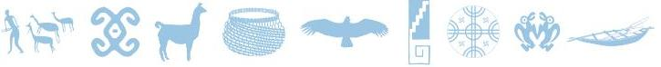
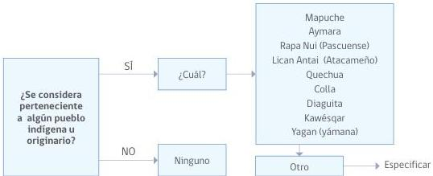
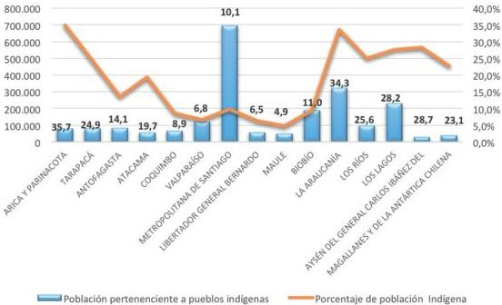
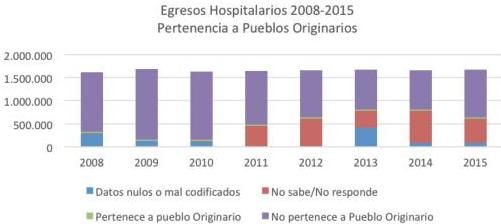
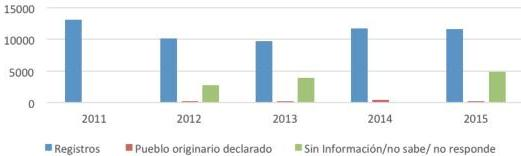

Ministerio de
Salud

Gobierno de Chile

# ORIENTACIONES TÉCNICAS
PERTINENCIA CULTURAL EN LOS SISTEMAS DE
INFORMACIÓN EN SALUD

Variable de Pertenencia a Pueblos Indígenas en los Registros y
Formularios Estadísticos del Sector Salud
Sobre la organización de este documento

Respecto a la organización del documento, contiene en la primera parte una introducción, donde se presenta el contexto de las Orientaciones Técnicas, sus objetivos y a quienes están dirigidas, en segundo lugar se describe como fue el proceso de actualización de la pregunta por pertenencia a pueblos indígenas en la Norma 820 (2016). En tercer lugar se entregan recomendaciones prácticas para formular adecuadamente la pregunta; En cuarto lugar se presenta información sobre el auto-reconocimiento como base para realizar la pregunta por pertenencia a pueblos indígenas, junto con la normativa que sustenta el derecho a la información de los pueblos indígenas. En quinto lugar se aborda quiénes y cuántos son los pueblos indígenas en Chile y se entregan datos sociodemográficos y estadísticos; Por último se presentan antecedentes sobre la variable pueblos indígenas en los censos y encuestas nacionales e incorporación de la pregunta en sistemas de información de salud. El documento finaliza con un apartado de sugerencias orientadas a los equipos de salud.

SUBSECRETARÍA DE SALUD PÚBLICA

SUBSECRETARÍA DE REDES ASISTENCIAES

DIVISIÓN DE POLÍTICAS PÚBLICAS SALUDABLES Y PROMOCIÓN

DIVISIÓN DE PLANIFICACIÓN SANITARIA

DIVISIÓN DE ATENCIÓN PRIMARIA

Agosto 2018

ISBN Obra Independiente: 978-956-348-169-3

## ÍNDICE

I. Introducción 4
II. Actualización de la pregunta por pertenencia a pueblos indígenas en la norma nº820 sobre estándares de información en salud 6
III. Recomendaciones para fortalecer la producción de información estadística sobre pueblos indígenas 9
IV. El autoreconocimiento como base para la pregunta por pertenencia a pueblos indígenas y el derecho a la información 13
V. Quiénes y cuántos son los pueblos indígenas en chile. Datos sociodemográficos y estadísticos 17
VI. Antecedentes sobre variable pueblos indígenas en los censos y encuestas nacionales e incorporación de la pregunta en sistemas de información de salud 20
VII. Sugerencias a los equipos de salud 26
VIII. Bibliografía 29

4

Orientaciones Técnicas: Pertinencia Cultural en los Sistemas de Información en Salud

## I. INTRODUCCIÓN

El Ministerio de Salud, hoy cuenta con la actualización de la Norma N° 820, “Sobre Estándares de Información en Salud” aprobada por decreto exento N° 643 del 2016. Las acciones desarrolladas por el Grupo de trabajo Pueblos Indígenas, compuesto por integrantes de las líneas técnicas de Salud y Pueblos Indígenas, División de Atención Primaria, Subsecretaría de Redes Asistenciales y, en conjunto con integrantes del Departamento de Estadísticas e Información en Salud de la División de Planificación Sanitaria, y el Departamento de Salud y Pueblos Indígenas e Interculturalidad, de la División de Políticas Públicas Saludables de la Subsecretaría de Salud Pública, derivaron en la actualización de la pregunta por pueblos indígenas, la que se ajustó a la utilizada por el Instituto Nacional de Estadísticas en los CENSOS 2012 y 2017, respectivamente.

Contar con la pregunta normalizada da cuenta que en el sector están operando dos situaciones relevantes, primero asumir la responsabilidad institucional y la obligación del Sector Salud de incorporar la pregunta por pertenencia a pueblos indígenas en todos los registros de salud, electrónicos o de papel y por otro lado, la “estandarización” de la variable, proceso que implica contar con una pregunta homogénea y única, situación que permitirá la producción de información confiable y comparable.

La producción de información diferenciada por pueblos indígenas constituye una obligación del Sector Salud y también es un objetivo determinante en el quehacer de salud pública. La información constituye el sustrato mínimo para orientar la labor, considerando que los pueblos indígenas presentan marcadas brechas de morbimortalidad en comparación con la población no indígena. En este sentido es necesario destacar que:

- La información es determinante para definir el rumbo que deben tener las acciones en el ámbito de salud con pueblos indígenas. La producción y disposición de datos desagregados por pertenencia a pueblos indígenas contribuye a la elaboración de diagnósticos, estudios, programas y políticas, que deben ser coherentes con la disminución de las brechas y tendencias identificadas en el área de morbimortalidad que presentan los pueblos indígenas respecto de la población no indígena.
- Los datos constituyen información clave para reducir desigualdades, inequidades y brechas en los problemas de salud que viven los pueblos indígenas respecto de los no indígenas.
- El Estado, en este caso el Sector Salud, tiene la obligación de producir información, porque se trata de un derecho de primera generación, reconocido en la Declaración Universal de Derechos Humanos (Naciones Unidas, 1948, artículo 19); en la Carta de la Organización de Estados Americanos (OEA, 1948, artículo IV); en el Pacto Internacional de Derechos Civiles y Políticos (Naciones Unidas, 1966, artículo 19) y en la Convención Americana sobre Derechos Humanos (Pacto de San José de Costa Rica, 1969, artículo 13). Por lo tanto, es deber de los Estados garantizarlo, con independencia de su consagración en las normas internas. (CELADE, CEPAL, 2011). El manejo y disposición de información permitirá que los equipos de salud desplieguen acciones concretas con pertinencia cultural en concordancia con lo establecido en el Artículo 7, sobre Atención de Salud con pertinencia cultural de Ley 20.584 (2012).
5

Orientaciones Técnicas: Pertinencia Cultural en los Sistemas de Información en Salud

### a. OBJETIVO DE LAS ORIENTACIONES TÉCNICAS

Estas Orientaciones Técnicas representan un esfuerzo del Ministerio de Salud para avanzar en sistemas de información inclusivos y respetuosos de las diversidades, garantizando que las personas se sientan consideradas en sus identidades particulares. Sus objetivos son:

1. Proporcionar a los funcionarios y trabajadores de la salud que se desempeñan en los establecimientos y organismos de salud del territorio nacional, indicaciones generales y herramientas operacionales específicas para la realización adecuada de la pregunta y un registro pertinente de la variable que recoge la pertenencia a pueblos indígenas de acuerdo al contenido de la actualización de la Norma Técnica N° 820 sobre Estándares de Información de Salud, aprobada en Decreto Exento n° 643 de diciembre de 2016¹.
2. Entregar información pormenorizada sobre pueblos indígenas, respecto a quienes son, en que regiones se localizan, que situación socioeconómica los caracteriza, entre otros datos, que ayudaran a los funcionarios de salud a comprender la necesidad urgente de contar con información diferenciada.

En este marco, las Orientaciones Técnicas buscan también fortalecer los sistemas estadísticos de salud para la producción de información confiable, pertinente, comparable e integrada, con especial énfasis en aquellos datos referidos a la pertenencia a pueblos indígenas que permitan el diseño de políticas públicas coherentes con las condiciones sociosanitarias y socioculturales de esta población, todo ello considerando los datos del último CENSO 2017, que dan cuenta de aumento significativo de personas que se reconocen pertenecientes a pueblos indígenas, triplicando (de 4,6% a 12,8%) las cifras en relación al CENSO del 2002.

### b. ¿A QUIÉNES ESTÁN DIRIGIDAS ESTAS ORIENTACIONES TÉCNICAS?

- Profesionales y técnicos responsables de las Oficinas de producción de estadísticas de salud en toda la Red
- Directivos de la Red Sanitaria de Salud
- Funcionarios que se desempeñan en SOME, OIRS y Admisión
- Facilitadores Interculturales
- Técnicos Paramédicos de Postas Rurales
- Equipos clínicos de todos los establecimientos de salud de las Redes Asistenciales
- Referentes técnicos de programas de salud de SEREMI y Servicios de Salud
- Encargados de todos los programas de salud que se desempeñan en los establecimientos

6

Orientaciones Técnicas: Pertinencia Cultural en los Sistemas de Información en Salud

## II. ACTUALIZACIÓN DE LA PREGUNTA POR PERTENENCIA A PUEBLOS INDÍGENAS EN LA NORMA Nº 820 SOBRE ESTÁNDARES DE INFORMACIÓN EN SALUD²

La Norma Técnica 820 de Estándares de Información constituye el marco regulatorio para la información de salud. Establece las características obligatorias que deben cumplir los datos independientemente de las etapas del proceso (generación, envío, recepción, almacenamiento y procesamiento). La Norma Técnica 820 rige a todos los formularios de salud ya sean electrónicos o de papel.

A continuación se presentan extractos de la Norma 820 “Sobre Estándares de Información en Salud” (2016). El modelo de elaboración de la norma contó con tres etapas consecutivas e interdependientes: a) Definiciones de datos y vocabulario, b) Conjunto mínimo básico de datos y c) Documentos clínicos electrónicos o en papel, los que en su conjunto conforman los estándares de información para el sector.

La variable Pueblos Indígenas se incluyó como parte del Conjunto Mínimo Básico de Datos, *estándares de datos de la persona* y en lo específico “datos relativos a características personales”. Siguiendo las recomendaciones internacionales (OIT, OMS, OPS) la pregunta recoge y apunta a la auto identificación, y tanto su formulación como su registro son de carácter obligatorio.

La actualización de las categorías se efectuó por un equipo interdisciplinario del MINSAL coordinado por profesionales del DEIS y la participación del grupo de profesionales de salud y pueblos indígenas de las Divisiones de Atención Primaria y Políticas Públicas Saludables y Promoción de las Subsecretaría de Redes Asistenciales y Salud Pública, respectivamente. El material de apoyo bibliográfico utilizado fue la Ley Indígena 19.253 (1993), la Política de Salud y Pueblos Indígenas (2006) y el Convenio 169 OIT (2008).

### > Definición

Los pueblos indígenas en Chile, son los descendientes de las agrupaciones humanas que existen en el territorio nacional desde tiempos precolombinos³, que conservan manifestaciones étnicas y culturales propias o parte de ellas, siendo para ellos la tierra el fundamento principal de su existencia y cultura.

### > Alcance

Se reconoce como principales pueblos indígenas en Chile a: Mapuche, Aymara, Rapa Nui, Lican Antay, Quechua, Colla, Diaguita, Kawésqar y Yagán⁴.

La captura de la información de la variable pueblos indígenas, se realiza a través de una pregunta abierta estandarizada. Cuidando su integridad y desarrollo, esta pregunta fue consensuada con los pueblos en un proceso de consulta en el contexto de la preparación del CENSO 2012⁵.
7

Orientaciones Técnicas: Pertinencia Cultural en los Sistemas de Información en Salud

# > Estructura

¿Se considera perteneciente a algún pueblo indígena u originario?

a) Sí ¿A cuál? b) No

Frente a la respuesta presentar las siguientes categorías.

|  CÓDIGO | GLOSA  |
| --- | --- |
|  01 | MAPUCHE  |
|  02 | AYMARA  |
|  03 | RAPA NUI (PASCUENSE)  |
|  04 | LICAN ANTAI (ATACAMEÑO)  |
|  05 | QUECHUA  |
|  06 | COLLA  |
|  07 | DIAGUITA  |
|  08 | KAWÉSQAR  |
|  09 | YAGÁN (YÁMANA)  |
|  10 | OTRO (ESPECIFICAR)  |
|  96 | NINGUNO  |

Si contesta otro, dejar un espacio en texto libre para completar.

La inclusión del campo “otro” permite recoger datos respecto a pueblos aún no reconocidos por la Ley Indígena, tales como los descendientes de los Changos; rescatar la auto denominación territorial de pueblos ya reconocidos (como williche, lafquenche, pewenche u otros) e identificar otros pueblos indígenas correspondientes a los países de origen de la población migrante que recibe atención de salud en nuestro país.

La organización de la materia pueblos indígenas en la Norma N° 820, se estructura de la siguiente forma:

- CÓDIGO: Tipo de dato “texto”, 2 caracteres de largo.
- GLOSA: Tipo de dato “texto”, 150 caracteres de largo.

# > Fuente

- Ley Indígena 19.253 (1993)
- Política de Salud y Pueblos Indígenas (2006), Convenio 169 OIT (2008)
- Grupo de profesionales de Salud y Pueblos Indígenas DIVAP-DIPOL-DIPLAS -MINSAL.

8

Orientaciones Técnicas: Pertinencia Cultural en los Sistemas de Información en Salud

# ESQUEMA DE RESPUESTA DE PREGUNTA PERTENENCIA A PUEBLOS INDÍGENAS

9

Orientaciones Técnicas: Pertinencia Cultural en los Sistemas de Información en Salud

### III. RECOMENDACIONES PARA FORTALECER LA PRODUCCIÓN DE INFORMACIÓN ESTADÍSTICA SOBRE PUEBLOS INDÍGENAS

# > LA PREGUNTA

- La pregunta por pertenencia a pueblos indígenas u originarios corresponde **al conjunto mínimo básico de datos de identificación de la persona**, corresponden a datos relativos a características personales. Es una pregunta clave y relevante como edad, sexo o nacionalidad.

¿Se considera perteneciente a algún pueblo indígena u originario?

a) Sí ¿A cuál?

b) No

- Es una pregunta de carácter universal, lo que significa que **debe ser realizada a todas las personas**, en los establecimientos del territorio nacional.
- La pregunta debe estar presente en todos los formularios⁶ **y debe ser formulada en los términos en que aparece, sin interpretaciones ni modificaciones**. Es importante tener el cuidado de mantener un estándar en la forma en cómo se realiza la pregunta, procurando que su formulación respete la estructura de la pregunta estandarizada en la Norma 820 (2016).
- Es necesario destacar que en el caso de personas migrantes pertenecientes a pueblos indígenas, no existentes en Chile, se debe completar en alternativa **otros**, especificando a cual pueblo pertenece.

10

Orientaciones Técnicas: Pertinencia Cultural en los Sistemas de Información en Salud

# > CÓMO SE REALIZA LA PREGUNTA

- Al formular la pregunta por pertenencia a pueblos indígenas:
  - Si la persona responde afirmativamente y de manera espontánea identifica el pueblo de pertenencia, registrar el pueblo indígena indicado por la persona.
  - Si, luego de formulada la pregunta la persona duda, nombrar las categorías (pág.7) o lista de pueblos disponibles en la pregunta y registrar el pueblo indígena indicado por la persona.
- Realizar la pregunta con **respeto, empatía y cordialidad**, evitando prejuicios.
- Al formular la pregunta, es necesario considerar **los códigos culturales de comunicación de cada pueblo en cada territorio**.
- **Informar al usuario** que los formularios incorporan la pregunta por **“Pueblos Indígenas”**.
- **Evitar supuestos o ideas preconcebidas**. No partir pensando que la persona se incomodará o complicará con la pregunta, el auto-reconocimiento o autoidentificación es un derecho adquirido de los pueblos indígenas.

# Habilidades que conforman las capacidades interculturales

|  Estar atento | Ser flexible | Desarrollar la tolerancia | Empatía  |
| --- | --- | --- | --- |
|  - Ser consciente de la propia comunicación y del proceso de interacción con otros. - Valorar más el proceso que los resultados, pero a la vez ser capaz de tener una visión de resultado deseado. | - Ser abierto a nueva información. - Ser consciente de que existe más de una perspectiva válida. - Capacidad de adaptarse y acomodarse al comportamiento de otros grupos. | - Capacidad de mantenerse tranquilo al estar en una situación que pueda ser compleja. | - Capacidad para participar en las experiencias de otras personas involucrándose intelectual y emocionalmente. - Capacidad de ponerse en el lugar del otro implica escuchar atentamente lo que los otros nos quieren decir.  |

Adaptado de Gudykunst¹ et al (1991)
11

Orientaciones Técnicas: Pertinencia Cultural en los Sistemas de Información en Salud

# > POR QUÉ REALIZAR LA PREGUNTA

- Es un **deber del Estado**, generar información para conocer la situación de salud de toda la población y también de los pueblos indígenas.
- Es un **Derecho de los pueblos indígenas** que el sector salud produzca y provea la información necesaria para conocer la situación de salud y, por lo tanto, los principales problemas de salud que los afectan.
- La adecuada formulación de la pregunta por pertenencia a pueblos permitirá, disponer de información y **estimar población indígena en cada establecimiento de salud**.
- La pregunta y el **reconocimiento están asociados a derechos individuales y colectivos y no a beneficios económicos**.
- Permitirá al sector disponer de datos para posteriormente **elaborar los perfiles epidemiológicos y de esta forma diseñar políticas y programas** en base a información actualizada.
- Para **contar con información** y que esta sea usada en informes estadísticos y reportes que permitan mirar la tendencia y comparabilidad de los datos respecto a pueblos indígenas.

# > CUÁNDO HACER LA PREGUNTA

- **En cualquier momento en que la persona se contacta con el Sistema**, siguiendo el flujo de la atención de la persona. Si no se registró en el momento inicial debiera ser registrado en la instancia siguiente.
- En el momento del **ingreso, hospitalización, alta o egreso** del hospital y en las **atenciones clínicas, en las visitas domiciliarias y en otros procedimientos clínicos**.
- **Siempre se debe hacer la pregunta a todas las personas, independiente de sus apellidos, fisonomía, lengua, vestimenta, procedencia y edad**. Si la pregunta por pertenencia a pueblos indígenas fue contestada por un miembro de la familia, (padres, abuelos-as, tíos-as, acompañantes) se sugiere ratificarla directamente cuando sea posible.
- El aumento de la demanda asistencial, en ningún caso debe implicar que se deje de hacer la pregunta.

# > DÓNDE REALIZAR LA PREGUNTA

- **En cualquier lugar donde la persona tome contacto con el sistema** de salud. En Hospitales de Alta Mediana y Baja complejidad, en SOME/ Admisión, box de atención, CECOSF, CESFAM, CECOSAM, COSAM, Postas, Consultorios rurales y urbanos y otros.
- La formulación de la pregunta **no requiere de un espacio “privado” o “aparte”** o que sea especialmente acondicionado. Lo clave es ser empatico al momento de formular la pregunta.

# > QUIÉN DEBE REALIZAR LA PREGUNTA

- La pregunta debe ser formulada **por todos los y las funcionario/as del sistema de salud que tengan tareas asignadas respecto a registro de datos**.
- **Todos los profesionales, técnicos y administrativos**, en el momento del llenado de la ficha, encuesta, formulario del sistema de registro informático o administrativo.

12

Orientaciones Técnicas: Pertinencia Cultural en los Sistemas de Información en Salud

# » Tener en consideración que:

- Situaciones históricas de discriminación y racismo han impactado la identidad y con esto el auto reconocimiento y auto identificación de los pueblos indígenas. Por eso es que, en algunas ocasiones, cuando se formula la pregunta las personas responden no pertenecer a un pueblo indígena, aun cuando tengan apellidos indígenas. Se ha observado que en aquellos establecimientos y Servicios de Salud dónde se ha trabajado el tema de la importancia de contar con información desagregada por pueblos indígenas y de la autoidentificación, las personas pertenecientes a pueblos indígenas se reconocen más. Esto no debe conducir a dejar de hacer la pregunta y asumir la respuesta en base a la apariencia.
- La identidad de las personas pertenecientes a pueblos indígenas no depende de criterios externos, si no que que elementos subjetivos asociados a la conciencia y a procesos socioculturales e históricos.

13

Orientaciones Técnicas: Pertenencia Cultural en los Sistemas de Información en Salud

## IV. EL AUTORECONOCIMIENTO COMO BASE PARA LA PREGUNTA POR PERTENENCIA A PUEBLOS INDÍGENAS Y EL DERECHO A LA INFORMACIÓN

Pueblos indígenas y tribales$^{a}$ es una denominación común para más de 370 millones de personas que se encuentran en más de 70 países del mundo. Estos pueblos constituyen aproximadamente el 5% de la población mundial.

No hay una definición universal de pueblos indígenas y tribales, pero el Convenio N° 169 de la OIT 2008, ofrece una serie de criterios subjetivos y objetivos, que se utilizan conjuntamente para identificar quiénes son estos pueblos en un país determinado.

**TABLA N°1: CRITERIOS SUBJETIVOS Y OBJETIVOS PARA IDENTIFICACIÓN DE PUEBLOS INDÍGENAS**

|   | Criterios subjetivos | Criterios objetivos  |
| --- | --- | --- |
|  **Pueblos indígenas** | Conciencia de su identidad indígena | - Descender de poblaciones que habitan en el país o en una región geográfica del país desde la época de la colonización o del establecimiento de las actuales fronteras estatales. - Cualquiera que sea su situación jurídica, que conservan todas sus instituciones sociales, económicas, culturales y políticas o parte de ellas.  |

Fuente. Manual para mandantes tripartitos de la OIT. Comprender el Convenio sobre pueblos indígenas y tribales. 1989 (núm. 169). Organización Internacional del Trabajo, 2013

Existe coincidencia en lo planteado por los pueblos indígenas y lo que establecen los instrumentos legales nacionales y convenciones internacionales en cuanto a otorgar énfasis a la auto identificación como criterio que define la pertenencia a un pueblo indígena. Esto implica abandonar el tratamiento de los pueblos indígenas como víctimas merecedoras de una protección benefactora e intentar en cambio su posicionamiento como sujetos de derecho.

La autodefinición, supone por un lado, un ejercicio individual del sujeto en cuanto se identifica como perteneciente a un pueblo indígena. Ser indígena implica sentirse parte integrante de la herencia cultural que le han legado sus ancestros, reconocerse a sí mismo como miembro del grupo cultural indígena y reclamarse como miembro del grupo. Por otro lado la autodefinición aparece como un derecho colectivo en función del cual el propio pueblo indígena se identifica así mismo como grupo, y por ende, a cada uno de sus miembros. Esta dimensión está ligada al derecho de autodeterminación de los pueblos. Así se afirma que lo que define a un pueblo indígena y determina su visión holística del mundo es la identidad que él tiene de sí mismo en cuanto comunidad que forma parte de la naturaleza, de lo creado. En consecuencia solo los propios indígenas pueden determinar quienes comparten sus valores cosmogónicos. (Arteaga, 2007).

$^{a}$La pertenencia a un pueblo indígena se define desde las categorías de adscripción e identificación con el mismo. Pertenece a un pueblo indígena quien se siente parte de él y al mismo tiempo, es identificado como tal por otros, y es desde allí que el criterio de etnicidad se libera definitivamente
14

Orientaciones Técnicas: Pertinencia Cultural en los Sistemas de Información en Salud

de su definición directa desde categorías como las biológicas y geográficas, para pasar a ser un problema en la esfera de la conciencia social.” (Duran, 1995) Con esta definición se supera el enfoque positivista que consive a la identidad indígena definida por elementos objetivos externos al sujeto.

Para el caso particular del registro sobre pertenencia a pueblos indígenas es importante considerar que la auto identificación constituye un derecho de quien responde y se identifica como perteneciente a un pueblo indígena. Por otra parte, del autoreconocimiento, se desprende la tarea de los funcionarios de salud de formular la pregunta en los términos adecuados.

La existencia de un conjunto de tratados, convenios internacionales, políticas y normativas nacionales y sectoriales, constituyen hoy día un avance para el reconocimiento de los derechos de los pueblos indígenas como una exigencia de los Estados.

> “La salud es un derecho humano fundamental reconocido en múltiples instrumentos internacionales, cuyo ejercicio está directamente vinculado con la implementación de otros derechos —a la vivienda, el agua potable, el saneamiento, la educación, la información, el empleo, entre otros—; por lo mismo, su materialización trasciende el ámbito estrictamente sanitario. Dado que todos estos derechos revisten connotaciones especiales para los pueblos indígenas y afrodescendientes, involucrando tanto dimensiones individuales como colectivas, se asume que su derecho a la salud no solo está estrechamente vinculado, sino que depende del ejercicio de sus derechos colectivos”.

En este sentido, la producción de información desagregada por pueblos indígenas, es cada vez más un desafío para el Ministerio de Salud dada también la relevancia y el acento que los propios pueblos indígenas han colocado en cuanto a la importancia de saber y conocer con exactitud sus perfiles epidemiológicos de acuerdo a las realidades territoriales particulares, así como también conocer las diferencias en relación a la población no indígena existente en el país.

Como lo plantean organismos especializados en la materia como CEPAL (2013) “El rezago es mayor en los sistemas de información de salud (SIS), por lo que no se cuenta con datos epidemiológicos básicos para políticas científicamente fundadas y culturalmente adecuadas en este ámbito.” “El proceso es todavía incipiente en las estadísticas vitales, aunque se verifican avances en algunos países de la región, principalmente en los registros de nacimientos.”

A continuación, en la Tabla N°2, se presentan las normativas y convenciones internacionales respecto al derecho a la información de los pueblos indígenas y al deber de los Estados a generar los mecanismos adecuados para producir dicha información.
15

Orientaciones Técnicas: Pertinencia Cultural en los Sistemas de Información en Salud

**TABLA N°2: NORMATIVA INTERNACIONAL Y DERECHO A LA INFORMACIÓN DE LOS PUEBLOS INDÍGENAS**

|  Instrumento Internacional | Consagración del derecho a la información y otros conexos  |
| --- | --- |
|  Declaración Americana sobre los Derechos de los Pueblos Indígenas.OEA (2016). | Establece la auto identificación como criterio fundamental para determinar la pertenencia a un pueblo indígena. (art. 1. Punto 2)  |
|  Declaración de las Naciones Unidas sobre los Derechos de los Pueblos Indígenas (2007). | El derecho a la información está individualizado expresamente en el artículo 15, que establece que tienen derecho a que su diversidad se refleje en la educación e información pública. (Del Popolo, Et. Al. 2011)  |
|  Declaración y Programa de Acción de la Conferencia Mundial contra el Racismo, la Discriminación Racial, la Xenofobia y las Formas Conexas de Intolerancia, Durban (2001). | Derecho a la información en relación a los medios de comunicación y las tecnologías de la información y la comunicación. Obligación de los Estados de recopilar y difundir información estadística sobre grupos víctimas de discriminación.  |
|  Convenio 169 sobre pueblos indígenas y tribales en países independientes, OIT (1989). | Derecho a la participación. Derecho a la consulta libre e informada. Derecho a participar en la elaboración de la información (pues todo estudio debe realizarse en consulta con los pueblos indígenas).  |
|  Convención Internacional sobre la Eliminación de todas las Formas de Discriminación Racial, Naciones Unidas (1965). | Derecho a participar en el gobierno (que presupone el derecho a la información.)  |

Fuente: El Derecho a la Información de los Pueblos Indígenas y Afrodescendientes, Obligaciones Urgentes en América Latina. En *Contar con todos caja de herramientas para la inclusión de los pueblos indígenas y afrodescendientes en los Censos de Población y Vivienda*, CEPAL-UNFPA-UNICEF. 2001

16

Orientaciones Técnicas: Pertinencia Cultural en los Sistemas de Información en Salud

TABLA N°3: NORMATIVA NACIONAL Y SECTORIAL

|  Normativa | Año | Derecho que consagra  |
| --- | --- | --- |
|  Ley 20.584 Sobre Derechos y Deberes que tienen las personas en relación con acciones vinculadas a su atención en salud | 2012 | Artículo 7, sobre el derecho de las personas pertenecientes a los pueblos originarios a recibir una atención de salud con pertinencia cultural, se subentiende que la “atención con pertenencia cultural” implica la necesaria organización de los sistemas de información en salud, la obligación del sistema de salud de capturar la información con procedimientos pertinentes y disponer esta información para el propio sector y para los pueblos indígenas.  |
|  Ley 20.285, Sobre acceso a la Información Pública | 2008 | Establece que todos tienen el derecho de acceder a la información en manos de las entidades públicas, y el principio de no discriminación en el tratamiento de cualquier persona que la solicite.  |
|  Política de Salud y Pueblos Indígenas | 2006 | En este documento en su página 32 y 33, en el punto 6. Referido a lineamientos técnicos: *Aspectos Programáticos y de Gestión*, señala que la identidad indígena no ha sido incorporada en las estadísticas del sector. Se plantea que constituye un desafío avanzar en la consideración de la variable, dentro de las orientaciones programáticas, en aquellos Servicios de Salud, comunas y establecimientos con alta concentración de población indígena. No obstante, el planteamiento hoy ha avanzado a la obligatoriedad y universalidad de la incorporación de la variable en los Sistemas de Información en Salud, y por lo tanto, la realización de la pregunta en todos los formularios que corresponda en todo el Sistema de Salud.  |
|  Norma General Administrativa N°16 sobre “Interculturalidad en los Servicios de Salud” | 2006 | Desarrolla directrices que constituyen orientaciones relativas a la implementación de la pertinencia cultural, interculturalidad y complementariedad en salud que serán competencia de los Servicios de Salud y las SEREMI de Salud.  |
|  El artículo 19 de la Constitución de la República de Chile. | 1980 | Garantiza la libertad de expresión y de informar sin censura previa de cualquier manera y por cualquier medio. Aunque no individualiza el derecho de acceder a la información, sí establece el de petición a las autoridades sobre cualquier asunto de interés público.  |

Fuente. Elaboración propia$^{10}$
17

Orientaciones Técnicas: Pertinencia Cultural en los Sistemas de Información en Salud

## V. QUIÉNES Y CUÁNTOS SON LOS PUEBLOS INDÍGENAS EN CHILE. DATOS SOCIODEMOGRÁFICOS Y ESTADÍSTICOS

En Chile la Ley indígena 19.253 (1993), reconoce a los siguientes pueblos indígenas: Mapuche, Aimara, Rapa Nui, Atacameños, Quechuas, Collas, Kawashkar, Yagán y pueblo Diaguita$^{11}$ (este último reconocido el año 2006). Según datos del INE del CENSO abreviado 2017, el 12,8% de la población nacional se declara perteneciente a uno de los 9 pueblos, lo que se traduce en que un total de 2.185.792 de personas son indígenas. El mayor peso demográfico lo tiene el pueblo mapuche con un 79,8%, Aymara 7,2% y Diaguita 4,1%. A continuación se presenta una tabla con información pormenorizada.

**TABLA Nº4. PORCENTAJE POBLACIÓN INDÍGENA POR PUEBLOS INDÍGENA**

|  Pueblo | Población  |   |
| --- | --- | --- |
|   |  N | %  |
|  Total pueblo | 2.185.792 | 100,0  |
|  Mapuche | 1.745.147 | 79,8  |
|  Aymara | 156.754 | 7,2  |
|  Diaguita | 88.474 | 4,1  |
|  Quechua | 33.868 | 1,6  |
|  Lican Antai | 30.369 | 1,4  |
|  Colla | 20.744 | 0,9  |
|  Rapa Nui | 9.399 | 0,4  |
|  Kawésqar | 3.448 | 0,1  |
|  Yagán o Yámana | 1.600 | 0,1  |
|  Otro | 28.115 | 1,3  |
|  Ignorado | 67.874 | 3,1  |

Fuente: INE 2017

Respecto de las regiones el panorama general indica que hay 9 regiones que están por sobre el 13% de población indígena, en relación a población total. Es necesario destacar que las siete regiones con mayor proporción de población indígena respecto al total de la población son Arica y Parinacota (35,7%), La Araucanía (34,35), Aysen (28,7%), Los Lagos (28,2%), Los Ríos (25,6%), Tarapaca (24,9%) y Magallanes con un (23,1%). Estos datos son significativos, para las regiones que deben iniciar y reforzar su trabajo en la línea de registros con pertinencia cultural.
18

Orientaciones Técnicas: Pertinencia Cultural en los Sistemas de Información en Salud

### GRÁFICO N°1

A continuación se entregan datos de nº de población pertenecientes a pueblos indígenas por región.

#### Número y porcentaje de población perteneciente a Pueblos Indígenas, por región

Elaboración propia. Fuente: CENSO 2017

#### > Pueblos Indígenas y Encuesta CASEN 2015

Se presentan datos de caracterización socioeconómica, extraídos de la encuesta CASEN, dado que la información de CENSO 2017, aún no está disponible.

La Encuesta de Caracterización Socioeconómica Nacional, CASEN, es realizada por el Ministerio de Desarrollo Social con el objetivo de disponer de información que permita, conocer periódicamente la situación de los hogares y de la población, especialmente de aquella en situación de pobreza y de aquellos grupos definidos como prioritarios por la política social, con relación a aspectos demográficos, de educación, salud, vivienda, trabajo e ingresos. Es realizada desde el año 1990 con una periodicidad; bianual o trianual. Hasta ahora se han realizado 14 encuestas.

#### > Ingresos económicos CASEN 2015

Los resultados de las encuestas CASEN realizadas entre el año 2006 y 2015 ponen en evidencia una reducción de la pobreza en el país. Al realizar una comparación entre la población indígena y la no indígena podemos observar grandes diferencias entre ambas:

- CASEN 2006: Un 44% de la población indígena se encuentra en situación de pobreza, versus un 28% de la población no indígena (diferencia de un 12%).
19

Orientaciones Técnicas: Pertinencia Cultural en los Sistemas de Información en Salud

- CASEN 2015: Disminuyó considerablemente la cantidad de personas en situación de pobreza, pero aun así se mantiene un 7,3% de diferencia entre los no indígenas e indígenas (11,0% y 18,3% respectivamente)

Otra de las variables que mide la encuesta CASEN es la Pobreza Multidimensional, y en esta podemos observar una significativa diferencia entre la población indígena y la no indígena. El impacto de ésta en la población indígena llega a un 30,8% mientras que en los no indígenas alcanza solo un 19,9%, lo que nos indica que un tercio de la población indígena no alcanza las condiciones adecuadas en su hogar para vivir y presentan mayores carencias que el resto de la población del país.

#### > Afiliación al Sistema Previsional de Salud CASEN 2015

El Sistema de Salud chileno es mixto, integrado por instituciones de organismos públicos y privados. Lo interesante de las afiliaciones son las significativas diferencias de afiliación entre los Sistemas de Salud Público y Privados, donde se aprecia que un 87% de los indígenas se encuentra adscrito al Sistema Público de Salud (FONASA), siendo superior al porcentaje que tienen los no indígena que alcanza al 76,3%. Respecto a los indígenas afiliados al sistema privado de salud-ISAPRE, estos alcanzan apenas el 7%, y mientras que los no indígena duplican la afiliación en este sistema y llegan al 15,9%.

20

Orientaciones Técnicas: Pertinencia Cultural en los Sistemas de Información en Salud

## VI. ANTECEDENTES SOBRE VARIABLE PUEBLOS INDÍGENAS EN LOS CENSOS Y ENCUESTAS NACIONALES E INCORPORACIÓN DE LA PREGUNTA EN SISTEMAS DE INFORMACIÓN DE SALUD

Es en el año 1992, se incluye la pregunta y consulta a todos los habitantes del país por la “pertenencia” a las principales “culturas indígenas” del país. En este sentido el CENSO de población consideró la siguiente pregunta: Si es Ud. chileno, ¿se considera perteneciente a alguna de las siguientes culturas? 1. Mapuche; 2. Aymara; 3. Rapanui; 4. Ninguna de las anteriores.

Durante el año 1992, se discutió el proyecto de Ley e Institucionalidad Indígena, la que fue promulgada en el año 1993. Esto último conllevó a que durante el año 1996, en la encuesta Casen, se diseñe una nueva pregunta por pertenencia indígena: ¿Pertenece Ud. a alguno de ellos?, refiriéndose a los 8 pueblos indígenas reconocidos en la Ley$^{12}$, 1. Sí, Aymara; 2. Sí, Rapa Nui; 3. Sí, Quechua; 4. Sí, Mapuche; 5. Sí, Atacameño; 6. Sí, Coya; 7. Sí, Kawaskar; 8. Sí, Yagán; 0. No pertenece a ninguno de ellos. Esta pregunta apuntaba a la recolección de datos a través del criterio de la auto identificación.

La pregunta ha debido adaptarse permanente a los nuevos requerimientos, demandas y obligaciones legislativas. La última modificación fue realizada en el CENSO abreviado 2017, donde la pregunta por pertenencia indígena es destacada por el reconocimiento y auto identificación de las personas y destaca por el carácter declarativo de la respuesta.

La Tabla N°5 muestra un resumen de cómo ha cambiado la pregunta asociada a Pueblos Indígenas, en los distintos CENSOS Nacionales, desde 1992.

**TABLA N°5: VARIABLE PUEBLOS INDÍGENAS EN LOS CENSOS NACIONALES**

|  Censo | Pregunta | Universo considerado | Reconoce  |
| --- | --- | --- | --- |
|  1992 | Pregunta 16: Si es usted chileno, ¿Se considera perteneciente a alguna de las siguientes culturas? • Mapuche • Aymara • Rapanui • Ninguna de las anteriores | Chilenos, de 14 años o más | 3 culturas  |
|  2002^{13} | Pregunta 21: ¿Pertenece usted a alguno de los siguientes pueblos originarios o indígenas? • Alacalufe (Kawaskar) • Atacameño • Aymara • Colla • Mapuche • Quechua • Rapanui • Yámana (Yagán) • Ninguno de los anteriores | A todas las personas encuestadas | 8 pueblos  |
21

Orientaciones Técnicas: Pertinencia Cultural en los Sistemas de Información en Salud

|  **2012 y censo abreviado 2017** | Pregunta 24: ¿Se considera perteneciente a algún pueblo indígena (originario)? : SI, NO | A todas las personas encuestadas | 9 pueblos  |
| --- | --- | --- | --- |
|   |  Pregunta 25: ¿A cuál ? : • Mapuche • Aymara • Rapa Nui • Lican Antai • Quechua • Colla • Diaguita • Kawésqar • Yagán o Yámana • Otro (Especifique) | A todas las personas que respondieron SI en la pregunta anterior |   |

Fuente: Elaboración propia en base a Información INE (2003).

### > Variable pertenencia a pueblos indígenas en los sistemas de información en salud

El Ministerio de Salud desde el año 1996 genera un trabajo en la línea de salud y Pueblos Indígenas en la División de Atención Primaria en Salud (DIVAP), la que, en el año 2000 transforma esta iniciativa en Programa. Durante el año 1997, reconociendo la necesidad de generar información epidemiológica, se efectúa el primer estudio sobre la “Situación de Salud de los Pueblos Indígenas de Chile”, OPS y Ministerio de Salud, cuyo consultor fue Víctor Toledo.

Durante el periodo 2002-2003, y ante la inexistencia de datos e información provista por el Sistema de Salud que permitieran la elaboración de perfiles epidemiológicos sobre la situación de salud de los Pueblos Indígenas, se da curso al desarrollo “Serie de Análisis de la Situación de Salud de los Pueblos indígenas de Chile”, proyecto que consistió en la elaboración de perfiles epidemiológicos básicos que tenían como fin conocer de forma más sistemática la situación de salud de la población indígena de Chile, y que logra desarrollar 13 perfiles epidemiológicos básicos en distintas regiones del país$^{14}$.

Entre los años 2007 y 2008 se trabaja con DEIS para incorporar la pregunta por Pueblos Indígenas en la Norma Técnica N° 127 sobre “Informe Estadístico de Egreso Hospitalario (IEEH) para la producción de información estadística sobre causas de egreso hospitalario y variables asociadas” del año 2008. El formulario incorpora en su reverso una reseña sobre su aplicación, pero esta acción no consideró un proceso de capacitación sistemático y pertinente que abordara este tema, dada la relevancia y magnitud de este quehacer.

Gradualmente se incorpora la variable a otros formularios tales como el Formulario de Enfermedades de Notificación Obligatoria (ENO), Sistema Nacional de Información Perinatal SNIP, Sistema Nacional de Información de Salud Ocupacional (SINAISO) y Resúmenes Estadísticos Mensuales (REM). Entre los años 2009-2010, se genera una iniciativa para comenzar la implementación de un proceso de acompañamiento en los Servicios de Salud en materias de Registro de Egreso Hospitalario y otros registros.

22

Orientaciones Técnicas: Pertinencia Cultural en los Sistemas de Información en Salud

En el año 2010, se encarga un estudio a OPS, titulado “Evaluación de la implementación de la identificación étnica en el Informe Estadístico de Egreso Hospitalario (IEEH)”, (DEIS/OPS). Este estudio preliminar evidenció un importante subregistro y errores sistemáticos en el registro de la variable. En ese momento se develó la importancia de hacer procesos de acompañamiento técnicos basados en la formación del personal de salud encargados de completar registro y efectuar las preguntas a los usuarios. La iniciativa se focalizó en los Servicios de Salud Metropolitano Central y Servicio de Salud Araucanía Sur como experiencias piloto. En el año 2011 se efectúa un trabajo similar en el Servicio de Salud Chiloé, de la región de Los Lagos, no obstante, esta estrategia no se constituye en directriz o línea formal, lo que limitó su continuidad.

En 2015, la oficina de Pueblos Indígenas de la División de Políticas Públicas Saludables y Promoción (DIPOL), solicitó la realización de un diagnóstico respecto del registro de la variable **Pertenencia a Pueblos Indígenas** en los distintos sistemas de información a cargo del Departamento de Estadística e Información en Salud, (DEIS). Para este análisis, se revisó el estado de la variable en las bases de datos de Egresos Hospitalarios, Enfermedades de Notificación Obligatoria ENO, Sistema Nacional de Información en Salud Ocupacional SINAISO, Estadísticas Vitales (Nacimiento y Defunciones) y Resúmenes Estadísticos Mensuales, REM.

De acuerdo a esta revisión, se advirtió que en general, hay un subregistro de la variable pertenencia a Pueblo Originario, errores en la codificación de los datos y un altísimo registro de las alternativas No sabe /No responde. Paralelamente a este análisis, se inicia el trabajo del equipo interdisciplinario de profesionales de salud y pueblos indígenas de DIVAP-DIPOL y profesionales del DEIS.

#### a) Sistema Egresos Hospitalarios

El Sistema de Egresos Hospitalarios, recoge datos desde el Informe Estadístico de Egreso Hospitalario (IEEH) (Decreto N° 1671/2010), cuyo reporte es obligatorio para todos los establecimientos de salud del sector público y privado del territorio nacional. En este formulario la variable pertenencia a Pueblos Indígenas se incluye en el año 2008, siendo posible desde ese año identificarla en la base de datos. En el Gráfico N° 2 se visualiza el resumen de los Registros encontrados en el Sistema de Egresos Hospitalarios.

**GRÁFICO N°2: PUEBLOS ORIGINARIOS EN BASES DE EGRESOS HOSPITALARIOS**

Fuente: Elaboración propia en base a egresos hospitalarios. DEIS. MINSAL. (Elaboración propia)
23

Orientaciones Técnicas: Pertenencia Cultural en los Sistemas de Información en Salud

Los datos respecto a la pertenencia Pueblos Indígenas registrados desde el año 2008 se han mantenido constantes en el tiempo, alcanzando cerca del 1,8% de todos los registros de egresos hospitalarios. Existe también, un alto porcentaje de datos nulos de registro y de respuestas No sabe / No Responde a partir del año 2011.

Respecto a las frecuencias de los diferentes Pueblos Indígenas en el Sistema de Egresos Hospitalarios, el pueblo mapuche es el declarado con una mayor frecuencia, llegando al 90% de los registros consistentemente durante los años registrados

#### **b) Sistema de Enfermedades de Notificación Obligatoria**

Este tipo de estadísticas se basan en el reporte obligatorio, tanto del sector público como del privado, de ciertas enfermedades, brotes de enfermedades infecciosas y los fallecimientos de causa no explicada donde se sospeche causa infecciosa, en personas previamente sanas. La variable pertenencia a Pueblos Originarios se incluye en el Boletín Notificación Enfermedades de Declaración Obligatoria, ENO, desde el año 2009.

En términos generales se aprecia que existe escaso registro de esta variable, menor a 1 punto porcentual, consistentemente durante los años revisados y que no incrementa a pesar del aumento en el total de notificaciones.

#### **c) Sistema Nacional de Información en Salud Ocupacional**

Los accidentes de trabajo con resultado de muerte y accidentes graves que reciben atención médica en los establecimientos pertenecientes a al SNSS, son registrados en el Sistema Nacional de Información en Salud Ocupacional (SINAISO), de acuerdo a la Norma Técnica N°142 de 2012.

El sistema SINAISO, contribuye a mejorar la gestión de los casos de accidentes y enfermedades del trabajo atendido en la Red de Salud Pública, mejora la coordinación entre las instancias involucradas en el proceso (Comisión de Medicina Preventiva e Invalidez, Salud Ocupacional, Instituto de Seguridad Laboral, Estadística), además, permite pesquisar casos a través de las atenciones de urgencia proporcionadas en la red asistencial, contribuye al control de subsidios cruzados, permite generar información y estadísticas de salud de los/las trabajadores/as y determinar su perfil epidemiológico.

El registro en este sistema comenzó en el año 2011 y desde sus inicios se contempló la variable pertenencia a Pueblos Originarios, la que se selecciona desde una lista desplegable, sin embargo, el registro era opcional. Con la implementación de la Norma N° 820 actualizada, a partir de enero de 2018, el registro será obligatorio.

Al realizar una exploración de los datos, se aprecia que existe un bajo registro de la variable, así como inconsistencias en los registro iniciales, por lo cual no es posible cuantificar de manera certera el total de accidentes de trabajo donde el involucrado declare pertenecer a un Pueblo Originario (Gráfico N°3).

24

Orientaciones Técnicas: Pertinencia Cultural en los Sistemas de Información en Salud

### GRÁFICO N°3: REGISTRO DE PUEBLOS ORIGINARIOS EN SINAISO

Fuente: Base de Datos SINAISO. DEIS, MINSAL. (Elaboración propia)

#### d) Estadísticas Vitales

La información respecto a Nacimientos y Defunciones ocurridas en Chile se trabaja a través del Convenio Nacional de Estadísticas Vitales en el que participan el Servicio de Registro Civil e Identificación, DEIS del Ministerio de Salud y el Instituto Nacional de Estadísticas (INE).

La información respecto a los nacimientos que ocurren en el país se registra a través del Certificado de Atención de Parto, formulario, que en su formato en papel, no incorpora entre sus variables la pertenencia a Pueblos Indígenas.

Sin embargo, a partir del año 2012, con miras a la modernización y automatización de las estadísticas vitales se desarrolla el Sistema Nacional de Información Perinatal (SNIP), que captura la variable pertenencia a Pueblos Indígenas y que apunta a recoger otras variables contenidas en un nuevo certificado de atención de parto con nacido vivo (CAPNV) en formato electrónico.

Dado que el SNIP es un sistema en implementación, solo recoge el 80% de los partos a través de las maternidades, no siendo aún la fuente oficial total de los recién nacidos vivos. Cabe destacar, que durante el 2018 se espera que continúe masificándose en todo el país.

Por otra parte, respecto a las defunciones, la información se registra a partir del Certificado Médico de Defunción, en donde la variable pertenencia a Pueblos indígenas no se consigna, motivo por el cual no se encuentra disponible en la base de datos que se trabaja mediante el Convenio Nacional de Estadísticas Vitales. No obstante, la incorporación de ésta y otras variables se contempla para la actualización de este documento.

#### e) Resúmenes Estadísticos Mensuales

Los Resúmenes Estadísticos Mensuales, REM, corresponden a un sistema de información estadística que permite conocer las atenciones y actividades de salud otorgadas a la población en los establecimientos de la Red Asistencial, de manera agrupada. La información, proviene de la Serie A, que principalmente mide producción de los establecimientos, y de la Serie P, la cual corresponde a un censo poblacional que se efectúa dos veces en el año (meses de junio y diciembre) en los establecimientos pertenecientes a SNSS.
25

Orientaciones Técnicas: Pertenencia Cultural en los Sistemas de Información en Salud

La incorporación de la variable pertenencia a Pueblos indígenas a los REM se realizó en el año 2012 en el REM Serie P en las secciones destinadas al método de regulación de fertilidad, el estado nutricional de niños y adultos mayores, el Programa de Salud Cardiovascular y las Metas de Compensación Salud Cardiovascular, por condición de funcionalidad y Programa de Salud Mental en APS y especialidades.

Durante el año 2015, también se incorporó la variable “Entrega de placenta a petición de pueblo originario”$^{15}$. En el 2017 se modificó esta variable, a solicitud del Equipo de Salud de la Mujer, quedando como “Entrega de placenta a petición de la mujer”. También, a partir del año 2017, la variable pertenencia a Pueblos Indígenas se incorpora a la totalidad de los registros relacionados a consultas y otras prestaciones, permitiendo la desagregación por región y Servicio de Salud, y además se incorporan reglas de consistencia y validación, que permiten tener datos de mejor calidad.

En síntesis, a partir de lo anteriormente informado es posible advertir que, en general, aparece un subregistro de la variable pertenencia a Pueblo Indígena en todas las bases de datos actualmente disponibles. Entre las razones para este fenómeno, se puede considerar que la variable se encuentra oficialmente presente desde hace pocos años, presentando en los sistemas revisados, problemas en la calidad de los datos debido a dificultades en codificación o la poca disposición para el llenado de un campo no obligatorio dentro de los registros.

Otra de las razones por las que el registro se dificulta tiene relación con la calidad de autorreporte de la variable y los sesgos personales/culturales de los que consignan la variable. No obstante, a pesar de estas dificultades, se aprecia que la inclusión de ésta en los estándares de información de acuerdo a la Norma 820 del año 2011, la actualizada el 2016 y la pronta a disponibilizarse durante el 2018, la incorporación en los registros REM a partir del 2012 y la ampliación a otros registros REM en 2017, la inclusión de la variable en el nuevo certificado de atención de parto y la masificación del SNIP, permitirá que se consignen datos más confiables y de mejor calidad en el futuro próximo en todos los sistemas de información disponibles.

26

Orientaciones Técnicas: Pertenencia Cultural en los Sistemas de Información en Salud

## VII. SUGERENCIAS A LOS EQUIPOS DE SALUD

**La pregunta por pertenencia a pueblos indígenas es una pregunta estandarizada, universal y tiene su base en la Norma N° 820 sobre Estándares de Información en Salud.**

La obligatoriedad de la formulación de esta pregunta tendrá impacto directo en la mejora de la calidad del registro, por consiguiente el fin último es propiciar el uso de la información por parte de los Servicios de Salud y SEREMI, tales como análisis de la información y uso de esta para elaborar la planificación local.

El último CENSO abreviado de población y vivienda, del Instituto Nacional de Estadísticas, del año 2017 arrojó información sustantiva respecto a la cantidad de personas que pertenecen y declaran ser parte de uno de los 9 pueblos indígenas reconocidos por Ley 19.253, este instrumento determinó que el 12,8 % de la población es indígena, esto corresponde a 2.185.792 personas. Considerando estos antecedentes, en términos de población indígena, Chile está por sobre países como Argentina, Brasil, Ecuador, Paraguay, Uruguay, Venezuela y otros, adquiriendo un nuevo lugar en el panorama Latinoamericano, en cuanto a composición poblacional, diversidad cultural y, por lo tanto, los múltiples desafíos que se desprenden de esta realidad. Para el sector salud, impone retos en la adecuación de políticas, programas y sistemas de información, puesto que a través de estos datos se debe dar cuenta de la diversidad cultural indígena y su configuración, ya que esta constituye una característica determinante en la población de todo el país, y se expresa en distinciones culturales, sociales, económicas que a su vez repercuten en las dimensiones de salud.

En este sentido, la sensibilización a los funcionarios de salud respecto a las implicancias de la diversidad cultural es fundamental, así como que estos interioricen la importancia de su función y el impacto que tiene su labor en la producción de información respecto a pueblos indígenas.

La adquisición de habilidades y conocimientos técnicos necesarios para mantener la precisión del dato en su fuente primaria se consigue a través de capacitación, la que se debe orientar a todos los actores, no sólo con fines de gestión, sino por la responsabilidad de generar los insumos necesarios en el proceso de producción de información desagregada por pueblos indígenas. Lo que se busca es producir datos confiables y de buena calidad, posibilitando de esta manera la estandarización de procedimientos para la generación de estadísticas precisas y confiables que aporten a la elaboración y evaluación de políticas públicas, lo que requiere de un compromiso institucional que se instale como una cultura estadística colectiva.

Es fundamental que cada establecimiento de salud pueda realizar diagnósticos respecto a la calidad de los registros que se están obteniendo y la elaboración de planes de mejora de los procesos asociados a la captura de los datos.
27

Orientaciones Técnicas: Pertinencia Cultural en los Sistemas de Información en Salud

Se pueden conformar estructuras organizativas y técnicas dentro la institución, tales como: comisiones, mesas de trabajo y grupos de trabajo, que faciliten el monitoreo del registro. Durante el 2017- 2018, fue incluido en los lineamientos estratégicos de la Estrategia Nacional de Salud, en el resultado esperado **“Incorporar en el modelo de atención de salud el enfoque intercultural bajo el estándar del art. 7 de la ley 20.584”**, lo que implica impulsar la conformación de comisiones o grupos de trabajo entre SEREMI y Servicios de Salud, Estadísticas y Salud Intercultural, para abordar el registro adecuado de la variable pueblos indígenas, en el contexto de la Norma RS 643 (Ex -820) 2016. Para lo anterior a nivel local se podrán construir criterios propios que controlen la calidad del registro de los datos.

Estas estructuras deberán estar constituidas por referentes de salud y pueblos indígenas, estadísticos y encargados de epidemiología, profesional de comunicaciones, y otros funcionarios que se estimen pertinentes en el nivel local y se deberá cautelar su continuidad en el tiempo, debido a la envergadura de esta tarea. De igual manera, estas estructuras organizativas deberán reunirse periódicamente y podrán elaborar protocolos, instructivos y oficios para reforzar el uso y aplicación de estas Orientaciones Técnicas y otras herramientas que se estimen necesarias.

Se deberá dar prioridad a estrategias de difusión dirigidas a los usuarios indígenas y no indígenas con el fin de familiarizarlos con la pregunta a través de distintas acciones tales como, mensajes en tv, audios o cápsulas audiovisuales, trípticos y papelería para ser distribuidos en todos los dispositivos de salud de las Redes Asistenciales.

La implementación de esta Orientación requerirá como una de las primeras tareas la construcción de líneas de base respecto del estado de los registros asociados a la variable pueblos indígenas, posteriormente se deberán generar diagnósticos locales derivados de los registros estadísticos de salud por Pueblos Indígenas para analizar los factores protectores y las probables causas del daño en salud asociadas a las condiciones de vida, desde el enfoque de las determinantes sociales de la salud en el territorio.

El Ministerio de Salud, colaborará en la instalación de procesos de monitoreo y vigilancia respecto a la calidad de los registros de la variable de pueblos indígenas de manera de identificar posibles debilidades para corregirlas tempranamente. En el nivel central se generarán indicadores y metas sanitarias con el fin de reducir inequidades en salud que afectan a la población indígena.

28

Orientaciones Técnicas: Pertinencia Cultural en los Sistemas de Información en Salud

¹ La pregunta por pertenencia a pueblos indígenas se encuentra consignada en la página 60 de la Norma Técnica Nº 820, Estándares de Información de Salud.

² Todo el contenido de este acápite fue extraído de la Norma Nº 820 (2016). http://www.deis.cl/wp-content/uploads/2017/02/Decreto-Exento-643-Sustituye-Norma-T%C3%A9cnica-sobre-Est%C3%A1ndares-de-Informaci%C3%B3n-de-Salud-Actualizada-a-Dic-2016.pdf

³ Monte Verde, ubicado en la Región de los Lagos, es el principal sitio arqueológico del poblamiento temprano de América con dataciones de 33.000 y 14.600 años de antigüedad. Existes rastros ancestrales del Pleistoceno tardío que evidencian la presencia humana en este sitio antes de la última glaciación (8.000 y 10.000 años), derribando la “Teoría del Poblamiento Americano” que fechaba la llegada del hombre a este continente hace 12.500 años.

⁴ Nombres de los pueblos según auto denominación.

⁵ Durante el período de construcción del cuestionario censal 2012 se presentó un cuestionamiento muy fuerte respecto a la forma en que el INE había construido las preguntas de 1992 y en especial del 2002, llamando a ese hecho el “genocidio estadístico” ya que se pasaba desde una pregunta que identificaba pertenencia cultural (1992) a una pregunta que se realizaba solo a chilenos y consultaba por adscripción a un pueblo (2002).

En ese contexto la realización de una consulta indígena permitía levantar las demandas de las distintas comunidades indígenas de Chile, además de explicar la incorporación de criterios técnicos internacionales para la construcción de estas preguntas como la auto identificación de la población, y el concepto de etnia. Respecto al Procedimiento de Consulta realizado por INE se realizó una propuesta de cuestionario ya revisada con ministerios y otros organismos del Estado. Se presentó a una propuesta única a las comunidades y se recibieron sus comentarios en un formulario. En cuanto al idioma, también se recibieron observaciones en donde, entre otras cosas, se podía decir con cual se estaba de acuerdo.

Los formularios con comentarios fueron recepcionados por la Unidad de Cédula Censal y fueron analizados desde una perspectiva cualitativa. Esto significa que no se privilegió una mayoría numérica, sino que se establecieron los principales argumentos reconstruyendo que parte del discurso de las comunidades era de consenso y en cuales existían diferencias. En función de ese análisis y las recomendaciones internacionales de la ONU se resolvió de parte del INE la formulación final de las preguntas.

⁶ La norma Técnica Nº 820 debe exige que la pregunta se haga extensiva a todos los formularios de salud, situación que debería cumplirse a fines del 2017. Algunos de estos formularios son: ENO, Egreso Hospitalario, SINAISO, SNIP, REM, entre otros.

⁷ Gudykunst, W. B., Ting-Toomey, S., y Wiseman, R. L. (1991). “Taming the beast: designing a course in intercultural communication”. Communication Education, 40, 272-285, citado por Susan Sanhueza Henriquez, Fraño Paukner Nogués, Víctor San Martín y Miguel Friz Carrillo (2012) “Dimensiones de la competencia comunicativa intercultural y sus implicancias para la práctica educativa” En: Folios. No. 36. Segundo semestre de 2012. pp. 131-151. P. 140.

⁸ Los pueblos tribales tienen un estatus especial reconocido en el derecho internacional, así como problemas particulares que se suman a aquellos que enfrentan quienes integran la categoría más amplia de pueblos indígenas. (www.survival.es). Se diferencian de estos últimos porque no necesariamente tienen un vínculo de preexistencia en sus territorios en relación a la población que reside en ellos. Por otra parte, según el Convenio de la OIT N.º 169, los pueblos indígenas son descendientes de poblaciones que habitaban en un país o una región geográfica durante la conquista o la colonización o el establecimiento de las actuales fronteras estatales y conservan sus propias instituciones sociales, económicas, culturales y las instituciones políticas.

⁹ CEPAL “Lineamientos para incluir la identificación de pueblos indígenas y afrodescendientes en los registros de salud”, 2013

¹⁰ El cuadro se efectuó en base a los siguientes documentos: Constitución Política de la República de Chile; Ley Sobre Acceso a la Información Pública Nº 20.284, 2008; Ley sobre Derechos y Deberes que tienen las Personas en Relación con Acciones Vinculadas a su Atención en Salud, 2012; Política de Salud y Pueblos Indígenas, 2006; Norma General Administrativa Nº 16, sobre Interculturalidad en los Servicios de Salud.

¹¹ En todo el texto se privilegia terminología usada en la Norma 820 (2016), debido a que es una forma acordada en la consulta indígena de salud 2014-2017. No obstante se respeta la terminología que provienen de instrumentos como, Ley Indígena 19.253(1993), CENSO y CASEN.

¹² En este año no estaba incluido el pueblo Diaguita, recién se reconoce en el año 2006.

¹³ CENSO 2002, INE Resultados Volumen 1 Población País- Región (2003)

¹⁴ Los perfiles epidemiológicos básicos están disponibles en www.dipol.minsal.cl en Departamento de salud y pueblos indígenas e interculturalidad - descargas.

¹⁵ Recientemente se publicó la “Norma General Técnica para la entrega de placenta 2017”
29

Orientaciones Técnicas: Pertinencia Cultural en los Sistemas de Información en Salud

## VIII.BIBLIOGRAFÍA

- Arteaga Jara Andres, “Los Derechos de los Pueblos Indígenas y su Reconocimiento Internacional. La Declaración de las Naciones Unidas” Memoria de Prueba para optar al Grado de Licenciado en Ciencias Jurídicas y Sociales”, Concepción 2007.
- Instituto Nacional de Estadística; Censo 2002, 2012.
- Instituto Nacional de Estadística; Casen 2006–2013.
- CENSO 2002, Resultados Volumen I de Población. País -Región (2003) Editor: Héctor Morales Henriquez.
- Ley Indígena, Nº 19.253 Establece normas sobre protección, fomento y desarrollo de los indígenas, y crea la corporación nacional de desarrollo indígena.
- Ley Nº 24.584 Regula los derechos y deberes que tienen las personas en relación con acciones vinculadas a su atención en salud.
- Manual para mandantes tripartitos de la OIT. Comprender el Convenio sobre pueblos indígenas y tribales. 1989 (núm. 169). Organización Internacional del Trabajo, 2013.
- Gundermann K., Hans; Vergara Del S., Jorge Iván y Foerster G., Rolf. Contar a los indígenas en Chile: Autoadscripción étnica en la experiencia censal de 1992 y 2002. Estud. Atacam. [Online]. 2005, n.30, pp.91–113. ISSN 0718–1043. http://www.scielo.cl/pdf/eatacam/n30/art06.pdf
- Fabiana Del Popolo, Flavia Marco, Gladys Massé, Cecilia Rodríguez Gauna, Susana Schkolnik y Fernanda StangEl “Derecho a la Información de los Pueblos Indígenas y Afrodescendientes, Obligaciones Urgentes en América Latina”- Contar con todos caja de herramientas para la inclusión de los pueblos indígenas y afrodescendientes en los Censos de Población y Vivienda, CEPAL–UNFPA–UNICEF), 2011.
- Durán T. 1995. Como la Antropología Piensa la Identidad. En Pentukun Nº3 Instituto de Estudios Indígenas, Universidad de La Frontera, Temuco, Chile, pp. 83–96.
- Oyarce A. 2005. Una investigación operacional sobre criterios de adscripción étnica/cultural desde/ sobre 8 pueblos indígenas de Chile: Contribución a los instrumentos de recolección de datos. En Seminario Internacional de Pueblos Indígenas y Afrodescendientes de América Latina y el Caribe: Relevancia y pertinencia de la información sociodemográfica para políticas y programas. CEPAL.

30

Orientaciones Técnicas: Pertinencia Cultural en los Sistemas de Información en Salud

## EQUIPO EDITOR

|  Elisa Aguayo Torres | Departamento de Información y Estadística en Salud, DIPLAS, Subsecretaría de Salud Pública  |
| --- | --- |
|  Estefanía Jara López | Departamento de Información y Estadística en Salud, DIPLAS, Subsecretaría de Salud Pública  |
|  Viviana Reyes Ortiz | Departamento de Información y Estadística en Salud, DIPLAS, Subsecretaría de Salud Pública  |
|  Clodoveth Millalen Sandoval | Departamento de Modelo de Atención Primaria, DIVAP, Subsecretaría de redes Asistenciales  |
|  Luis Panguinao Pinchuleo | Departamento de Modelo de Atención Primaria, DIVAP, Subsecretaría de Redes Asistenciales  |
|  Barbara Bustos Barrera | Departamento de Salud y Pueblos Indígenas e Interculturalidad, DIPOL, Subsecretaría de Salud Pública  |
|  Jeanette Henriquez Barahona | Departamento de Salud y Pueblos Indígenas e Interculturalidad DIPOL, Subsecretaría de Salud Pública  |

## COLABORADORES

|  Carolina Araya Pérez | SS Coquimbo  |
| --- | --- |
|  Mitzi Albornoz Sapiain | SEREMI Antofagasta  |
|  Margarita Caceres Ticona | SS Iquique  |
|  Silvia Yavi Palacios | SS Arica  |
|  Jeanette Alcon Bernal | SS Arica  |
|  Nelson Medina Belmar | SS Bio Bio  |
|  Yazmin Quilaqueo Vera | SS Metropolitano Oriente  |
|  Violena Millahual Antinao | SS Metropolitano Noroeste  |
|  Manuel de Orue Ríos | SEREMI de Salud L.B. O'Higgins  |
|  Luis Valenzuela | SS Metropolitano Sur  |
|  Olga Fernandez Sanchez | SS Valparaíso San Antonio  |
|  Daniel Marín Contreras | SEREMI Salud Atacama  |
|  María Mercedes Gutierrez | SEREMI Salud Metropolitana  |
|  Roberto Rivero Calderón | SS Atacama  |
|  Andrea Barahona Araneda | SEREMI Salud Bio Bio  |
|  Débora Figueroa Soto | SS Ñuble  |
|  Andrea Reyes Gutierrez | SS Ñuble  |
|  Andrés Veloso Sandoval | SS Bio Bio  |
|  Paola Alfaro Robles | SS Coquimbo  |
|  Daniela Cardenas Fernández | SEREMI Atacama  |
|  Irene Vásquez Guacte | SS Iquique  |
31

Orientaciones Técnicas: Pertinencia Cultural en los Sistemas de Información en Salud

|  Valentina Hermosilla Méndez | SEREMI Bío Bío  |
| --- | --- |
|  Paula Sivori Juica | Salud Arica  |
|  Bárbara Letelier Soto | SS Metropolitano Oriente  |
|  Marta Zolezsi | SS Metropolitano Oriente  |
|  Alejandro Ramírez Jaramillo | SS Arauco  |
|  Paola Escobar Gonzalez | SS Metropolitano Occidente  |
|  Andrés Antillanca Antillanca | SS O'Higgins  |
|  Carlos Miranda Arancibia | SEREMI Valparaíso  |
|  José Cisternas Fernandez | SS Valparaíso San Antonio  |
|  Ramón Miranda Correa | SS O'Higgins  |
|  Tabita Manríquez Chamorro | SEREMI Maule  |
|  Erika Espinoza Aguilera | SS Metropolitano Central  |
|  Jimena Pichinao Huenchuleo | SS Metropolitano Occidente  |
|  Pamela Canabes Herrera | SS Aconcagua  |
|  Leandro Valenzuela Atenas | SEREMI Arica  |
|  Pablo Sandoval Gonzalez | SS Arauco  |
|  Claudia Avilés Gonzalez | SEREMI Salud Coquimbo  |
|  Hugo Lazo Pastore | SS Metropolitano Sur  |
|  Claudia Pañinao Painepi | SS Metropolitano Sur Oriente  |
|  Rosa Gajardo Abarza | SS Maule  |
|  Mirian Donoso Pinochet | SEREMI Valparaíso  |
|  David Astorga Valdes | SS Metropolitano Central  |
|  Pablo Videla Martinez | SS Metropolitano Central  |
|  Paola Llanquileo Loncopan | SS Metropolitano Central HCSA  |
|  Alejandra Flores Carlos | SEREMI Tarapacá  |
|  Graciela Cabral Quidel | DIPOL Minsal  |
|  Guillemo Pinto Méndez | SS Aconcagua  |
|  Hellen Cisternas Bórquez | SS Valparaíso San Antonio  |
|  Francisca Collipal Huanqui | SEREMI Salud R.M.  |
|  María Magdalena Alegría | SEREMI Salud R.M.  |
|  Luis Navarro Maldonado | SEREMI Salud R.M.  |
|  Purísima Ampuero Guelet | SS Chiloé  |
|  Raúl Henriquez Ojeda | SS Chiloé  |
|  Fabiola Fernandez Gaete | SEREMI Los Lagos - Provincial Chiloé  |
|  María Ramírez Solís | SEREMI Los Lagos - Provincial Chiloé  |
|  Argelia Burgos Barrera | SEREMI Los Lagos  |
|  Monica Araya Gómez | SS Del Reloncavi  |

32

Orientaciones Técnicas: Pertinencia Cultural en los Sistemas de Información en Salud

|  Camila Elena Guarda Hermosilla | Asesora Intercultural Río Bueno  |
| --- | --- |
|  Isabel Albadena Meza Quichal | Lawentuchefe Río Bueno  |
|  Purísima Ampuero Guelet | SS Chiloé  |
|  Viviana Huaiquilaf Rodríguez | SS Valdivia  |
|  Oscar Quintul Pérez | SS Del Reloncavi HPM  |
|  María Haro Coñecar | SEREMI Aysén  |
|  Ximena Paredes Alvarado | SEREMI Magallanes  |
|  Yesenia Paredes Vásquez | SS Valdivia  |
|  Ruth Cantero Morrian | SS Osorno  |
|  Cristina Tenorio Gallardo | SS Del Reloncavi  |
|  Victoria Figueroa Oliva | SS Del Reloncavi  |
|  Marcia Nahuelquin Delgado | SS Aysén  |
|  Marcelo Bravo Morales | SS Araucanía Norte  |
|  Doris Huentenao Paillaleo | SS Aysén  |
|  Manuel Alvarez Lucero | SS Aysén  |
|  Yolanda Nahuelcheo Saldaña | SEREMI Salud  |
|  Lilian Blatter Silva | SEREMI Salud  |
|  Ivonne Jelves Mella | SEREMI Salud Los Ríos  |
|  M. Ingrid Lavín Brüning | SEREMI Salud Los Ríos  |
|  Sandra Soto Provoste | SS Araucanía Sur  |
|  Iris Gonzalez Cano | SS Osorno  |
|  Angélica Brandell Thompson | SS Araucanía Norte  |
|  Evans Curin Huenchuhir | SS Araucanía Norte  |
|  Eugenia Letuebe Valladares | Seremi Salud  |
|  Marcela Pizarro Inostroza | SS Araucanía Sur  |
|  Nelson Alexis Días Reyes | Seremi Los Lagos  |
Ministerio de Salud
Gobierno de Chile