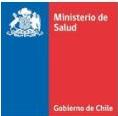
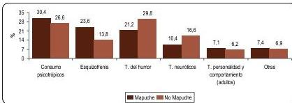
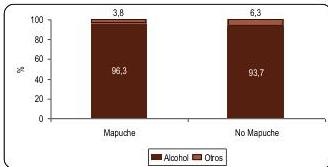
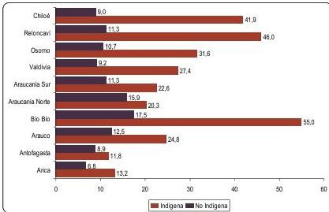

# **ORIENTACIONES TÉCNICAS PARA LA ATENCIÓN DE SALUD MENTAL CON PUEBLOS INDÍGENAS: *HACIA UN ENFOQUE INTERCULTURAL***

# **SUBSECRETARIA DE SALUD PÚBLICA/SUBSECRETARIA DE REDES ASISTENCIALES**

División de Prevención y Control de Enfermedades

División de Políticas Públicas Saludables y Promoción

División de Gestión de la Red Asistencial

División de Atención Primaria

Julio 2016

1
# INDICE

I. Introducción 5
I.2. Objetivo del documento 5
I.3. Tipo de población a la que se refieren estas Orientaciones Técnicas 6
I.4. Destinatarios a los que están dirigidas estas Orientaciones 6
I.5. Contexto 6
II.1. Antecedentes de la población indígena en Chile 7
II.2. Información epidemiológica para el trabajo de salud y pueblos Indígenas 9
II.3. Política y legislación que respalda el trabajo en salud y pueblos indígenas. 14
III. Conceptos, modelos y enfoques claves para el trabajo en salud mental y pueblos indígenas 15
III.1. Salud mental 15
III.2. Modelo integral de salud familiar comunitario 15
III.3. Modelo comunitario de atención en salud mental 16
III.4. Modelos explicativos 17
III.5. Salud mental desde un enfoque intercultural 19
III.6. Enfoque de determinantes sociales de la Salud 21
III.7. Enfoque de derechos humanos 22
IV. Estrategias para el trabajo en Salud Mental con Enfoque Intercultural 23
IV.1. Competencias interculturales en el equipo de salud; cultura propia y conocerse a sí mismo 23
IV.2. Identidad Cultural 26
IV.3. La importancia del facilitador intercultural y la lengua originaria para el equipo de salud 23
IV.4. Familia y comunidad indígena 28
IV.5. Sugerencias para el abordaje de la atención de salud mental con enfoque intercultural 30
Estrategias de trabajo comunitario 30
Proceso de vinculación y diagnóstico 31
Técnicas de intervención terapéutica 32
Aproximaciones o estudios sobre y con las comunidades locales 35
V Glosario 37
VI Anexos 42
Políticas y Normativa Jurídica para el Trabajo en Salud y Pueblos Indígenas 42
Perspectiva Intercultural con la Comunidad Mapuche, Región XIV de Los Ríos 45

2
## **Equipo Redactor**

Alvaro Campos Muñoz

Bárbara Bustos Barrera

Felipe Salinas Gallegos

Irma Rojas Moreno

Jeanette Henríquez Barahona

Margarita Saez Salgado

Sandra Cheuquepan Quezada

Depto. Modelo de Atención Primaria, DIVAP, Subsecretaría de Redes Asistenciales

Depto. de Salud y Pueblos Indígenas e Interculturalidad, DIPOL, Subsecretaría de Salud Pública
Unidad de Salud Mental, Depto. de GES y Redes Integradas, DIGERA, Subsecretaría de Redes Asistenciales

Depto. de Salud Mental, DIPRECE, Subsecretaría de Salud Pública

Depto. de Salud y Pueblos Indígenas e Interculturalidad, DIPOL, Subsecretaría de Salud Pública

Depto. de Salud y Pueblos Indígenas e Interculturalidad, DIPOL, Subsecretaría de Salud Pública

Depto. Modelo de Atención Primaria, DIVAP, Subsecretaría de Redes Asistenciales

## **Colaboradores**

Alejandra Flores Carlos

Alejandro Ramírez Jaramillo

Alex Cáceres Ticona

Alex Escalona Pavés

Alvaro Basualto Bustamante

Andrea Jara Rojas

Andrea Salgado Poblete

Andrés Antillanca Antillanca

Angélica Brandell Thompson

Bárbara Montecino Quenalla

Beatriz Villane Yañez

Beatriz Painequeo Tragnolao

Boris Beyzaga Ramos

Carla Blanco Mansilla

Carolina Ortiz Cartes

Claudio Barraza Carvajal

Danka Troncoso Salazar

Denisse Villegas Gaete

Diana Benavides Barahona

Eduardo Thomas Ponce

Elena Ulloa Rodríguez

Ester López Fuentes

Fabiola Colina Gómez

Fabiola Figueroa Guzman

Francisco Muñoz Martínez

Francisca Collipal Huanqui

Hellen Cisternas Borquez

Iven Morales Escobar

SEREMI de Salud Tarapacá

Servicio de Salud Arauco

COSAM Enrique Paris, Servicio de Salud Iquique

Servicio de Salud Araucanía Sur

Servicio de Salud Bío Bío

SEREMI de Salud Arica-Parinacota

SEREMI de Salud Bío Bío

Servicio de Salud Libertador Bernardo O'Higgins

Servicio de Salud Araucanía Norte

Servicio de Salud Iquique

Servicio de Salud Metropolitano Central

Servicio de Salud Metropolitano Oriente

CESFAM Cirujano Guzman

Servicio de Salud Arauco

SEREMI de Salud Araucanía

Servicio de Salud Iquique

Servicio de Salud Iquique

Servicio de Salud Metropolitano Occidente

CESFAM Cirujano Aguirre

Servicio de Salud Metropolitano Oriente

Servicio de Salud Bío Bío

Servicio de Salud Arica

CESFAM Cirujano Videla

Servicio de Salud Araucanía Norte

Servicio de Salud Osorno

SEREMI Salud Región Metropolitana

Servicio de Salud Valparaiso

Servicio de Salud Antofagasta

3
Ivonne Jelves Mella
Jimena Pichinao Huenchuleo
Juan Astudillo Arias
Juan Francia
Juan Pablo Tagle
Karin Ávila Benavides
Loreto Guzman Berkhoff
Luz María Ortiz Pizarro
Marcela Villagrán Rivera
Marco Rojas Zuleta
María José Urrutia Iglesias
Marisol Prado Villegas
Marlene Soto Alvarado
Marjorie Braniff Perez
Mixsann Torres Cárdenas
Mónica Araya Gómez
Pablo Lira Quezada
Pablo Ferreira Valenzuela
Paola Vázquez Aguilera
Patricia Vigueras Cherres
Paula Sivori Juica
Raúl Hernández Ojeda
Rodrigo Ruz López
Rosa Quispe Huanca
Sergio Alvarado Vigar
Soledad Troncoso Lloncon
Sylvia Soto Alvarado
Viviana Huaiquilaf Rodriguez
Ximena Oettinger Palma
Yasmin Quilaqueo Vera
Yerko Mattews Gonzalez
Yesica Sandoval Cárcamo
Yolanda Nahuelcheo Saldaña
Valentina Rojas Fredes
Violeta Cuminao Neculqueo

SEREMI de Salud Los Ríos
Servicio de Salud Metropolitano Occidente
SEREMI de Salud Antofagasta
SEREMI de Salud Tarapacá
Servicio de Salud Metropolitano Oriente
Servicio de Salud Metropolitano Oriente
SEREMI DE Salud Los Ríos
Servicio de Salud Antofagasta
Servicio de Salud Osorno
SEREMI de Salud Antofagasta
Servicio de Salud Arica
Servicio de Salud Occidente
Servicio de Salud Reloncaví
Servicio de Salud Metropolitano Occidente
Servicio de Salud Chiloé
Servicio de Salud Reloncaví
CESFAM Sur Iquique
Servicio de Salud Metropolitano Norte
Servicio de Salud Reloncaví
Universidad Arturo Prat Sede Iquique
SEREMI de Salud Arica-Parinacota
Servicio de Salud Chiloé
COSAM Dr. Jorge Seguel Cáceres
Servicio de Salud Iquique
Servicio de Salud Arica
Servicio de Salud Osorno
SEREMI de Salud Los Lagos
Servicio de Salud Valdivia
SEREMI de Salud Los Lagos
Servicio de Salud Metropolitano Sur Oriente
COSAM Salvador Allende Iquique
Servicio de Salud Valdivia
SEREMI de Salud Araucanía
Servicio de Salud Metropolitano Norte
Servicio de Salud Metropolitano Central

4
# I. Introducción

En el año 2010, desde el Ministerio de Salud se conformó una alianza de trabajo entre las unidades técnicas de salud mental y pueblos indígenas de la Subsecretaría de Salud Pública, quiénes en coordinación con los equipos regionales de salud mental y pueblos indígenas de SEREMIS y Servicios de Salud, iniciaron una serie de encuentros cuyos resultados arrojaron que una de las principales necesidades en materia de salud mental y pueblos indígenas era contar con un instrumento o documento orientador que entregara información útil a los equipos de salud mental para dar una atención de salud con pertenencia cultural. Ese es el contexto que explica el origen de estas *Orientaciones Técnicas*, que finalmente surgen con el propósito de que los equipos que trabajan en salud mental en las Redes Asistenciales, cuenten con herramientas con información conceptual y práctica que contribuya a hacer pertinente la atención de salud en aquellos territorios en dónde residen personas pertenecientes a los pueblos indígenas.

La particularidad de este documento es que ha respondido a un desafío inédito en el Ministerio de Salud, ya que su elaboración concitó la convergencia de múltiples actores, quienes en un proceso participativo de trabajo a nivel nacional, aportaron desde diferentes frentes y desde diversas experiencias al enriquecimiento del documento, a través de exposición de comentarios técnicos, revisiones y observaciones efectuadas en respectivos procesos metodológicos.

El documento como tal se organiza en cuatro partes, en la presentación se entrega información para contextualizar las orientaciones técnicas, en la segunda parte se incluyen antecedentes para el trabajo con pueblos indígenas: datos demográficos, información estadística producida desde el modelo de la epidemiología convencional, antecedentes jurídicos internacionales y nacionales que respaldan el trabajo de salud y pueblos indígenas. En la tercera parte se entrega información conceptual respecto a salud mental y los distintos enfoques propuestos y necesarios para orientar el quehacer de los equipos de salud mental y en la sección final se entregan estrategias para el trabajo de salud mental con personas pertenecientes a los pueblos indígenas de Chile.

## I.2.Objetivo del documento

Entregar elementos conceptuales y prácticos respecto al enfoque intercultural, con el propósito de que los equipos de salud que se desempeñan en la atención primaria, secundaria y terciaria, proporcionen a las personas pertenecientes a pueblos indígenas una atención en salud con pertinencia cultural$^{1}$.

$^{1}$La pertinencia cultural se traduce en acciones afirmativas tales como respeto, reconocimiento a las prácticas culturales propias de los pueblos indígenas, es la atención o prestación de salud toma en cuenta las características socio-culturales particulares de los grupos de población de las localidades en donde se brinda atención.

5
### **I.3. Tipo de población a la que se refieren estas Orientaciones Técnicas**

La población a la que apuntan estas Orientaciones Técnicas es toda aquella población perteneciente a uno de los 9 pueblos indígenas reconocidos por la Ley 19.253 (1993) que recurra a los establecimientos de salud dependientes de la Red Asistencial Pública por algún tipo de atención en el ámbito de salud mental.

### **I.4. Destinatarios a los que están dirigidas estas Orientaciones Técnicas.**

Estas Orientaciones Técnicas están destinadas a los equipos de salud que entregan atención de salud mental en los distintos niveles de atención de la Red Pública de Salud, es decir, en atención primaria (CESFAM, Consultorios Urbanos y Rurales, CECOSF, Postas de Salud Rural, SAPU, Red de Urgencia), atención secundaria o de especialidad ambulatoria (Centros de salud mental comunitaria, Consultorios Adosados de Especialidades, Centros de Diagnóstico y Tratamiento (CDT), Centros de Referencia en Salud), y atención terciaria (Servicios o Unidades de hospitalización psiquiátrica en hospitales generales y hospitales psiquiátricos)

### **I.5. Contexto**

El *“1er Seminario de Salud Mental, Interculturalidad y Pueblos indígenas”*, se realizó en *Ralco* se realizó el 2010 y fue organizado por el Servicio de Salud Bío Bío. Este encuentro, marca un hito en los futuros pasos de trabajo que se empiezan a desarrollar en los siguientes años, donde se comienza a construir un lenguaje común de reflexión y propuestas entre diferentes representantes de los pueblos indígenas, tales como autoridades tradicionales, representantes de comunidades indígenas del mundo mapuche-pewenche, facilitadores interculturales, equipos técnicos de salud de los niveles local, regional y central.

Cumpliendo con el acuerdo de dar continuidad al trabajo, el año 2011 se desarrolla la “II Jornada Nacional de Salud Mental y Pueblos Indígenas” en Puerto Octay, en esa oportunidad se amplió la participación a más comunidades indígenas de la zona centro- sur del país y el anfitrión fue el Servicio de Salud Osorno. La particularidad de este encuentro de trabajo fue que se asentó en la necesidad de persistir en el desarrollo de un trabajo más sistemático en salud mental y pueblos indígenas, profundizando en las prácticas locales y como los equipos de salud entienden el quehacer en salud mental con pueblos indígenas.

Bajo este marco, el 2012 se organiza en la Región de Tarapacá el “III Seminario de Salud Mental y Pueblos Indígenas”, con la participación de representantes de salud tradicional del pueblo Aymara, primer taller macrozonal norte organizado desde el nivel central, con el objetivo de compartir y debatir sobre las conceptualizaciones en salud-enfermedad-atención y diálogo entre los sistemas médicos institucional y tradicionales$^{2}$.

$^{2}$Los tres primeros seminarios fueron sistematizados dando origen a documentos de trabajo los cuales se incorporan en la bibliografía.

6
El 2013 el Ministerio de Salud inicia un trabajo nacional con el propósito de compartir los avances en experiencias y elementos de análisis que permitiesen fundamentar el enfoque intercultural en la atención de salud mental e iniciar la construcción de orientaciones técnicas. Se realizan dos talleres macro zonales, uno en el norte (Iquique), otro en el sur (Valdivia) jornadas que permitieron contar con insumos para ir construyendo progresivamente este documento de forma participativa.

El año 2014 se formuló un primer documento de trabajo que se presentó en talleres macro zonal sur y norte realizados en la Región de Los Lagos y de Tarapacá respectivamente, donde participaron equipos de salud mental y pueblos indígenas de los Servicios de Salud y SEREMI, facilitadores interculturales, representantes de organizaciones indígenas y representantes de universidades locales. En julio del 2015 se realizó el tercer taller macro zonal central, completando así la visión de país³.

Considerando los insumos obtenidos en estos 4 años de trabajo a nivel nacional, es que en el texto se decantan en un ejercicio de reflexión, la sistematización de una serie de elementos de orden conceptual y práctico que deben ser tomados en consideración por los equipos de salud mental al momento de llevar a cabo el quehacer clínico, en los campos terapéuticos, preventivos y de promoción. En todos estos encuentros se ha destacado la necesidad de profundizar en los aspectos conceptuales y metodológicos para dar una mejor atención de salud y se ha constatado la necesidad de contar con un marco orientador que sirva como material de consulta a los profesionales que trabajan en salud mental.

## II.1.-Antecedentes de la población indígena en Chile

La gran mayoría de los países latinoamericanos presenta una gran diversidad étnica y cultural, la que se reproduce tanto en espacios urbanos como rurales, según la última ronda de Censos en América Latina la población indígena alcanza los 36.6⁴ millones de personas, lo que representa el 7% de la población total. México, Guatemala, Perú y Bolivia concentran las poblaciones más numerosas en términos absolutos y porcentuales, dado que ostentan más del 80 por ciento del total (30 millones).

³En 2014 macrozonal sur los días 29 y 30 de Septiembre con las regiones de Araucanía, Bío Bío, Los Ríos y Los Lagos. Macrozona Norte los días 4 y 5 de Noviembre con las regiones de Arica-Parinacota, Tarapacá y Antofagasta. Macrozona centro 2 de Julio 2015 con regiones Metropolitana, O'Higgins y Valparaíso.

⁴Banco Mundial. "Los Pueblos Indígenas en América Latina". Balance político, económico y social al término del Segundo Decenio Internacional de los Pueblos Indígenas en el Mundo, 2014.

7
En Chile, de acuerdo a datos censales disponibles en el año 2002, 692.192 personas, se reconoce como perteneciente a pueblos indígenas, lo que equivale a un 4.6% de la población total nacional, el Censo del 2012 arrojó que el 12% de la población es indígena, pero no está validado. Para los efectos de estas orientaciones consideraremos la información provista por la encuesta CASEN (2013), señala que en Chile 1.565.915, habitantes pertenecen a alguno de los 9 pueblos indígenas, es decir un 9,1% de la población es indígena. Ello considerando que actualmente, los pueblos reconocidos en la Ley Indígena N° 19.253 (1993) son los Aymara, Mapuche, LikanAntay, Quechuas, Rapa Nui, Colla, Diaguitas$^{5}$ y las comunidades Kawéshqar$^{6}$ y Yámana o Yagán de los canales australes.

La diversidad poblacional constituye un indicador relevante, y explica la existencia de iniciativas, que en el caso del sector salud, se reflejan en la existencia de Programas y líneas técnicas orientadas a trabajar en torno a la materia de salud de los pueblos indígenas, que deben acoger las particularidades que implican la diversidad sociocultural de los distintos pueblos indígenas que viven en el país y junto con ello también involucra la necesidad de hacer transversal la pertinencia cultural en los programas de salud y en definitiva en las atenciones que se prestan en los establecimientos de salud a las personas que son parte de pueblos indígenas.

De acuerdo al CENSO de 2002, la población indígena se encuentra localizada en mayor parte en zonas urbanas llegando al 64,8 %, en tanto CASEN 2013 señala que el 74% de la población indígena vive en zonas urbanas, situación que obedece a múltiples razones, entre las que encontramos la necesidad de las personas de buscar fuentes laborales en los centros urbanos y también la falta de tierras en las comunidades de origen, situación que obliga a buscar nuevas oportunidades en las ciudades, por lo general estos desplazamientos implican un efecto en la salud de las personas, ya que al alejarse de sus comunidades de origen se desvinculan de los factores protectores que implica la vida en comunidad y por lo tanto quedan más expuestos a las afecciones del modo de vida urbano.

La población indígena que habita en zonas rurales alcanza un 26.6 % en relación a este dato cabe destacar que por las particularidades de las zonas geográficas donde están situadas las comunidades indígenas (cordillera, pre-cordillera, secano costero y zonas insulares) son específicamente las personas pertenecientes a los pueblos indígenas quienes tienen un acceso más deficiente a los servicios de salud y por consiguiente a la oferta de salud del sistema público.

A grandes rasgos, la concentración absoluta y relativa de la población indígena del país puede resumirse en dos patrones geográficos: i) *la localización en áreas muy pobladas, que pueden tener o no relación con los núcleos ancestrales de poblamiento*, y ii) *la permanencia en los núcleos ancestrales de poblamiento o en áreas próximas a estos*. En el primer caso, se trata de un tipo de residencia sin continuidad con el pasado precolombino, debida a los procesos de exterminio o desplazamiento —o ambos— que siguieron a la conquista y colonización de las

$^{5}$ Los Diaguitas no fueron reconocidos por la Ley 19.253, ellos fueron reconocidos por la Ley 20.117 del 8 de septiembre de 2006.

$^{6}$ Alacalufe -Yámana o Yagán.

8
áreas geográficas involucradas. En el segundo caso, se hace referencia al poblamiento realizado en territorios ancestralmente habitados, o áreas próximas a ellos$^{7}$.

La situación de estrés social fruto de la violencia estructural a la que están sometidas las comunidades indígenas ha sido documentada en diversos estudios, ejemplo de ello en Chile son el caso del desplazamiento forzado que han vivido los pewenche de la Provincia del Bío Bío y el caso de la población aymara del Servicio de Salud Arica$^{8}$, quienes muestran una brecha observable en las tasas de suicidio entre población indígena y no-indígena. Idéntica situación se presenta en la población mapuche-williche, particularmente en este territorio se evidencia lo relacionado con depresión y suicidio situación que se ha expuesto en la mayoría de los estudios de la Serie Análisis de la Situación de Salud de los Pueblos Indígenas de Chile, del Ministerio de Salud, donde se asume que estos problemas irán paulatinamente en aumento, de mantenerse las tendencias al quiebre cultural y la acelerada modernización$^{9}$.

## II.2. Información epidemiológica para el trabajo de salud y pueblos indígenas

Como ya sabemos la evidencia epidemiológica por consiguiente los datos del perfil epidemiológico que presentan los pueblos indígenas constituye información clave para orientar el quehacer y trabajo de los equipos de salud, en el caso específico de los temas de salud mental y pueblos indígenas aporta *contenido significativo* para la definición de las formas que podrían constituir un abordaje pertinente a estos padecimientos; y por otra parte, nos entrega orientaciones generales respecto a cuales son los principales problemas de salud que tienen las personas indígenas. En este sentido es que en este apartado se entrega información construida desde este marco cognoscitivo.

En este documento se apelará a información epidemiológica convencional, aportada por el DEIS, a través de una metodología especialmente construida dada la inexistencia de datos desagregados por identidad indígena, los datos que se presentan se produjeron triangulando tres criterios: apellidos indígenas, apellidos hispanos vinculados a territorios tradicionales indígenas y acreditación de la calidad de indígena en la Corporación Nacional de Desarrollo Indígena (CONADI). Dicha información es parte de un conjunto de publicaciones del Ministerio de Salud, denominado *Serie Análisis de la Situación de Salud de los Pueblos Indígenas de Chile*, cuyo propósito es levantar información epidemiológica sobre pueblos indígenas, actualmente se cuenta con 11 perfiles epidemiológicos, los cuales están disponibles y se pueden extraer de www.dipol.cl.

$^{7}$Ribotta, Bruno. *Diagnóstico Sociodemográfico de los Pueblos Indígenas de Chile*. CEPAL, 2010 www.cepal.org/publicaciones/xml/9/.../2012-618_Atlas_Chile_WEB.pdf

$^{8}$Ministerio de salud. Serie análisis de la situación de salud de los pueblos indígenas de Chile N° 1. *Perfil epidemiológico básico de la población aymara del Servicio de Salud Arica* (pp. 71), 2006.

$^{9}$Ministerio de Salud. Serie análisis de la situación de salud de los pueblos indígenas de Chile, N° 9. *Perfil epidemiológico básico de la población mapuche residente en el área de cobertura del Servicio de Salud Osorno*, 2012.

9
A continuación se presentan algunos antecedentes epidemiológicos extraídos de dichos estudios, en los que refiere a egresos hospitalarios vinculados a la salud mental de las personas, cabe destacar que los egresos hospitalarios aunque representan una mínima parte de las personas indígenas afectadas por padecimientos de salud mental que tienen acceso a los servicios de salud, en este sentido revisten un sesgo, no obstante, nos entregan información importante respecto a la morbilidad que están sufriendo las personas.

**Gráfico N° 1$^{10}$** Área mapuche (5 Servicios de Salud). Diagnósticos específicos egresos hospitalarios por enfermedades mentales y del comportamiento, según pueblo de pertenencia (2004-2006)

Fuente: Pedrero Malva, (2014) a partir de registros DEIS MINSAL

Nota: SS Arauco, Bío-Bío, Araucanía Norte, Valdivia, Osorno.

En el gráfico N° 1, en lo que refiere a morbilidad, se observa una panorámica general respecto a los egresos hospitalarios por enfermedades mentales y del comportamiento, en los Servicios de Salud pertenecientes a la zona sur del país, que en términos de población perteneciente a pueblos indígenas comprende a los mapuche-pewenche, mapuche-lafquenche y williche; se observa que el consumo de psicotrópicos y la esquizofrenia, son los padecimientos que ocupan los primeros lugares con una mayor preponderancia en la población indígena, respecto de la población no indígena. Cabe destacar que estas constituyen categorías occidentales de enfermedad, no obstante desde el punto de vista indígena, especialmente la categorización de “Esquizofrenia” debiese ofrecer una atención especial debido a que, dependiendo del pueblo de pertenencia, en muchas ocasiones corresponde a un padecimiento que puede tener otro origen, situación que debe ser abordada, considerando, por ejemplo la historia o biografía personal y familiar, el contexto histórico y sociocultural de la persona, etc.

$^{10}$ Los gráficos presentados en este apartado corresponden a un documento elaborado por Malva Pedrero (2014), en base a información DEIS-MINSAL en el marco de la “Reunión grupo de expertos para elaboración de Orientaciones técnicas para la atención de salud mental con enfoque intercultural”.

10
Gráfico Nº 2
Área mapuche (5 Servicios de Salud). Diagnósticos específicos egresos hospitalarios por consumo de psicotrópicos, según pueblo de pertenencia (2004-2006)

Fuente: Pedrero Malva (2014) a partir de registros DEIS MINSAL
Nota: SS Arauco, Bío-Bío, Araucanía Norte, Valdivia, Osorno

De la misma fuente, en el gráfico Nº 2, referente a egresos hospitalarios por consumo de psicotrópicos, se observa que la predominancia de los egresos hospitalarios es por consumo de alcohol, en términos generales se puede apreciar que existe un patrón similar entre población indígena y no indígena, levemente superior para la población indígena, dato que nos entrega información relevante respecto de la población específicamente mapuche.

En este sentido es necesario precisar que el abordaje conceptual del consumo de alcohol en pueblos indígenas, está cruzado por dos elementos que se deben enunciar. En primer lugar al estereotipo de que los indígenas tienen una predisposición especial hacia el consumo de alcohol, lo que constituye una presunción racista, cuyo estereotipo se mantiene presente en las representaciones sociales hasta los días actuales. La construcción del prejuicio contra los pueblos indígenas se basa en las estructuras de poder y dominación predominantes en los diferentes períodos históricos. En ese sentido, la marginación y estigmatización del indígena son procesos históricamente construidos por las clases dominantes, representando a sus intereses de explotación y enriquecimiento¹¹.”

En segundo lugar, algunos estudios antropológicos han señalado que el consumo de alcohol en comunidades indígenas tiene una connotación asociada a la integración social y cultural, situación que implica que el consumo de alcohol no sea visto como un “problema de salud mental”¹², (Menéndez, 1990) sino más bien como parte de las prácticas y las dinámicas culturales propias de estos pueblos. Ambos elementos contribuyen a invisibilizar los problemas asociados al consumo problemático de alcohol y las consecuentes enfermedades de salud mental vinculadas a su consumo.

Se ha constatado que además de la carga de morbilidad relacionada con el alcohol, hay marcadas consecuencias sociales que surgen de su uso, es decir problemas en las relaciones

¹¹Euzelene Rodrigues Aguiar. El consumo de alcohol en las comunidades indígenas de Brasil en: XV Encuentro de Latinoamericanistas Españoles, Nov 2012, Madrid, Spain. Trama editorial; CEEIB, pp.584-593. <halshs-00874632></halshs-00874632>

¹² Menéndez, Eduardo. Morir de alcohol. Saber y hegemonía médica. Alianza Editorial Mexicana, 1990.

11
familiares y personales, violencia, problemas laborales y económicos, maltrato y abandono de menores.$^{13}$ Si bien en algunas economías de mercado consolidadas los costos de los problemas sociales relacionados con el alcohol son mucho mayores que los costos de los problemas de salud, no tenemos conocimiento de esta relación en los países en vías de desarrollo$^{14}$.

En relación a lo anterior en los estudios se ha logrado recabar que “los trastornos que más afectan a la población indígena están relacionados con depresión, suicidio y alcoholismo, lo que se explicaría porque los pueblos indígenas están expuestos a condicionantes, sociales, políticas, económicas y culturales particulares, diferentes a las de la población en general, que los hacen estar más propensos al padecimiento de cierto tipo de enfermedades clasificadas desde el sistema biomédico como “salud mental”$^{15}$. Esto se debe comprender en el marco de las determinantes sociales estructurales e históricas que afectan a la población indígena, en el entendido de que las personas pertenecientes a pueblos indígenas han estado históricamente expuestas a situaciones de discriminación sistemática, desarraigo familiar y territorial y falta de oportunidades laborales, entre otras (ibíd).

El suicidio está ocurriendo, especialmente entre los más jóvenes, no obstante, se está incrementando en relación a los otros grupos etarios. Las causas están asociadas a “la violencia estructural que se explican por la destrucción del modo de vida tradicional de las comunidades, por enfermedades, genocidio, usurpación de territorios y represión de su lenguaje y cultura”$^{16}$.

A nivel internacional numerosos textos dan cuenta de la presencia de altos índices de suicidios, alcoholismo y violencias en la situación de salud de los pueblos indígenas, donde factores predominantes como despojo, destrucción de modos de vida tradicionales, el rápido cambio cultural, separación de las familias y las comunidades, la discriminación, la exclusión cultural, la pobreza, la falta de oportunidades educativas, y la mala salud han sido legados de la colonización$^{17}$.

$^{13}$ Klingemann y Gmel G. Eds. Mapping the Social Consequences of Alcohol Consumption. Dordrecht, Netherlands: Kluwer Academic Publisher, 2001.

$^{14}$ “OPS . Alcohol, Género, Cultura y Daño en las Américas. Reporte final del Estudio Multicéntrico, 2007.

$^{15}$ Ministerio de Salud, II Jornada Salud Mental y Pueblos Indígenas, Puerto Octay, 25 y 26 de agosto, 2011.

$^{16}$ Kirmayer Laurence, Mac Donald Mary Ellen y Gregory M. Brass *The Mental Health of Indigenous Peoples*. Culture and Mental Health Research Unit. Report Nº 10. Mc Gill University, 2000.

$^{17}$ McKendrick, Jane H. “Models for collaborative research & Mental Health Services. Working in Partnership: Innovative Collaborative Research between Aboriginal Communities and an Academic” Unit. En: Culture & Mental Health Research Unit Report Nº10, 2000.

12
**Gráfico Nº 3**
Servicios de Salud Seleccionados: Tasa ajustada de suicidio por pueblo de pertenencia (2004-2006)

Fuente: Pedrero Malva, 2013 (a); 2014; MINSAL 2009, 2010, 2011; MINSAL, 2012; MINSAL, 2009 (a) y (b); MINSAL, 2012 y 2013 (b)

En el gráfico nº 3 se puede observar tasa ajustada de suicidio en 10 Servicios de Salud en los años 2004-2006, dónde la provincia Bío Bío tiene una tasa del 55,0 en contraste con la población no indígena que presenta una tasa del 17,5 a continuación encontramos a Reloncaví con una tasa del 46,0 en población indígena y un 10,7 en población no indígena, en tercer lugar Chiloé con una tasa del 41,9 mientras que la población no indígena presenta una tasa de 9,0 estos antecedentes demuestran que la población indígena está mayormente afectada por la mortalidad por suicidio, en comparación con la población no indígena.

Entre las posibles determinantes implicadas en los casos de suicidio se destacan la usurpación de la tierra, la migración forzada, la vida en la ciudad que implican desarraigo familiar y comunitario con el consiguiente cambio de patrones de vida, habitualmente son los jóvenes y adolescentes quienes tienen que enfrentarse a esta situación, todos estos elementos afectan y vulneran las condiciones de salud mental de la población, por lo anterior los equipos de salud mental y pueblos indígenas, de los Servicios y SEREMI de salud deben tener en consideración estos antecedentes a la hora de generar estrategias locales para considerar la población joven, en las acciones de promoción y prevención de la salud lideradas por los equipos de salud.

13
### II.3. Política y Legislación que respalda el trabajo en salud y pueblos indígenas.

El sector salud cuenta con una serie de instrumentos jurídicos y normas que respaldan el quehacer en salud intercultural, nos referimos a:

- ✓ **Ley 20.584 (2012).** *Regula los derechos y deberes que tienen las personas en relación con acciones vinculadas a su atención en salud* y su artículo 7º establece el derecho de los pueblos indígenas en Chile a recibir una atención de salud con pertinencia cultural y la obligación de los prestadores institucionales públicos en los territorios de alta concentración de población indígena a asegurar dicho derecho, lo cual se expresará en la aplicación de un modelo de salud intercultural validado comunitariamente. Los elementos mínimos del modelo de salud intercultural son; el reconocimiento, protección y fortalecimiento de los conocimientos y las prácticas de los sistemas de sanación de los pueblos originarios; la existencia de facilitadores interculturales y señalización en idioma español y del pueblo originario que corresponda al territorio, y el derecho a recibir asistencia religiosa propia de su cultura.
- ✓ **Política de Salud y Pueblos Indígenas (2006)** fue elaborada en conjunto con representantes de los pueblos indígenas, en este instrumento se establece un marco de principios donde se reconoce la diversidad cultural, el derecho a la participación, y los derechos políticos de los pueblos indígenas. Este documento constituye una orientación que define un marco conceptual y se pronuncia sobre los objetivos y estrategias generales que salud deberá implementar en el país.
- ✓ **Norma Administrativa Nº 16 sobre interculturalidad en los Servicios de Salud (2006)**, desarrolla directrices que constituyen orientaciones relativas a la implementación de la pertinencia cultural, interculturalidad y complementariedad en los Servicios de Salud.

El Estado de Chile ha suscrito un conjunto de tratados y convenios internacionales que norman esta relación:

- ✓ **Convenio 169 OIT** reconoce los derechos colectivos de los Pueblos Indígenas, propios de cada uno de los individuos que los componen y de los pueblos que los detentan. Mandata a los Estados que para lograr el goce del nivel máximo de salud física y mental de los pueblos indígenas, estos deben disponer de servicios de salud adecuados o proporcionarles los medios para organizar y prestar dichos servicios bajo su responsabilidad y control. Así como tener en cuenta sus propios métodos, prácticas y medicamentos, sus condiciones geográficas, económicas, sociales, culturales, enfoque comunitario y coordinación intersectorial.

14
### III. CONCEPTOS, MODELOS Y ENFOQUES CLAVES PARA EL TRABAJO EN SALUD MENTAL Y PUEBLOS INDIGENAS

#### III.1. Salud Mental

La Organización Mundial de Salud define la salud mental como el estado completo de bienestar físico mental y social, y no solamente la ausencia de afecciones o enfermedades (...) Se define como un estado de bienestar en el cual el individuo es consciente de sus propias capacidades, puede afrontar las tensiones normales de la vida, puede trabajar de forma productiva y fructífera y es capaz de hacer una contribución a su comunidad. (OMS$^{18}$, 2016)

De esta forma la salud mental no se refiere solamente a la ausencia de problemas o trastornos mentales, sino más bien al ejercicio de las potencialidades para la vida personal y la interacción social. La salud mental se relaciona con los distintos grados de posibilidad que tienen las personas para participar e influir sobre su ambiente, ya sea para modificarlo, contribuir, establecer relaciones y proyectar su vida y la de su comunidad. Esta concepción trae implicancias importantes, tanto para el abordaje de la enfermedad mental como del bienestar mental y permite explicar por qué algunas personas que no presentan una enfermedad mental, tiene un bajo nivel de salud mental (si es que no tienen oportunidades de realización, relaciones sociales nutritivas ni competencias personales para lidiar con los problemas cotidianos) y, a la inversa, por qué es posible que personas con una enfermedad mental, incluso severa, puedan gozar de un nivel alto de salud mental (si, además de recibir un tratamiento adecuado, cuentan con acceso a vivienda, trabajo y educación dignos, formas de protección social adecuadas, y un clima social y cultural de aceptación y respeto por las diferencias).

#### III.2. Modelo Integral de Salud Familiar Comunitario

La reforma del sector salud en 2005, tiene como base la implementación progresiva del Modelo de Atención Integral de Salud Familiar Comunitario, entendido como “el conjunto de acciones que promueven y facilitan la atención eficiente, eficaz y oportuna, que se dirige más que al paciente o la enfermedad como hechos aislados, a las personas consideradas en su integralidad física y mental, como seres sociales pertenecientes a distintas familias y comunidades, que están en permanente proceso de integración y adaptación a su medio ambiente físico, social y cultural$^{19}$” y que en su diseño, está orientado a mejorar la condición de salud de la población y disminuir las disparidades observadas.

Desde el Ministerio de Salud se ha identificado la necesidad de precisar la definición del Modelo de Atención Integral de Salud, atendiendo a la importancia del nuevo énfasis del sector de poner en el centro a las personas y recoger la operacionalización del modelo biopsicosocial. Es así que el Modelo de Atención Integral de Salud, se ha conceptualizado de la siguiente forma:

$^{18}$ En: <http://www.who.int/features/qa/62/es/>

$^{19}$ Ministerio de Salud. Subsecretaría de Redes Asistenciales, División de Gestión de la Red Asistencial. *Modelo de Atención Integral en Salud*. Serie de cuadernos Modelo de Atención Nº 1, 2005.

15
*“Un Modelo de relación de los miembros de los equipos de salud del sistema sanitario con las personas, sus familias y la comunidad de un territorio, en el que se pone a las personas en el centro de la toma de decisión, se les reconoce como integrantes de un sistema sociocultural diverso y complejo, donde sus miembros son activos en el cuidado de su salud y el sistema de salud se organiza en función de las necesidades de los usuarios, orientándose a buscar el mejor estado de bienestar posible, a través de una atención de salud integral, oportuna, de alta calidad y resolutiva, en toda la red de prestadores, la que además es social y culturalmente aceptada por la población, ya que considera las preferencias de las personas, la participación social en todo su quehacer - incluido el intersector - y la existencia de sistemas de salud indígena. En este modelo, la salud se entiende como un bien social y la red de salud como la acción articulada de la red de prestadores, la comunidad organizada y las organizaciones intersectoriales”*$^{20}$.

De esta forma, el modelo centra la mirada en la vinculación-relación necesaria que deben tener los equipos de salud con las personas, considerando a estas como parte de un sistema social, compuesto por la familia, la comunidad, un territorio, un sistema sociocultural, reconociendo a las personas como sujetos activos donde la estrategia que los moviliza es la participación. Sus principios irrenunciables son: el eje puesto en las personas, la integralidad de la atención y la continuidad de cuidados. Al mismo tiempo el modelo reconoce la existencia de sistemas de salud indígena.

### III.3. Modelo Comunitario de Atención en Salud Mental

El Modelo Comunitario de Atención en Salud Mental recoge los conocimientos asociados a los avances experimentados en tecnologías, estrategias psicosociales y enfoque de derechos humanos, todo lo cual ha contribuido significativamente a superar la lógica de la reclusión manicomial, el aislamiento y desarraigo social. Este modelo propone una reorganización de servicios de salud mental integrados al sistema general de salud, organizados en niveles de intervención, con recursos especializados, diversificados, desconcentrados y territorializados, que otorguen atención integral, con énfasis en los servicios ambulatorios más que cerrados, reconociendo y utilizando las complejas conexiones con el resto de estructuras no sanitarias que son absolutamente imprescindibles para la atención integral y dar respuestas satisfactorias a las necesidades específicas y especiales de las personas que padecen trastornos mentales.

El Modelo Integral de Salud Familiar Comunitario y el Modelo Comunitario de Atención en Salud Mental coexisten y se relacionan dinámicamente en el contexto de la salud mental. En la convergencia, ambos modelos reconocen a las personas como parte de un grupo familiar y de una comunidad, donde existen determinantes que condicionan su salud y su calidad de vida; son parte de un sistema de salud integrado que aborda los problemas de salud bajo principios

$^{20}$Ministerio de Salud, *Orientación para la Implementación del Modelo de Atención Integral de Salud Familiar y Comunitaria*, Subsecretaría de Redes Asistenciales, División de Atención Primaria, 2012.

16
compartidos de integralidad, territorialización, ejercicio de los derechos humanos y continuidad de los cuidados.

Desde el enfoque centrado en la persona con trastorno mental, el Modelo Comunitario de Salud Mental se hace cargo de cómo el grupo familiar y el entorno comunitario contribuyen a la recuperación de la persona, favoreciendo la inclusión social y proveyendo condiciones que contribuyan al pleno ejercicio de sus derechos y mejora en su calidad de vida$^{21}$.

### III.4. Modelos Explicativos

Diversas formas tienen los paradigmas que sustentan los modelos explicativos de la enfermedad, trastorno o padecimiento mental, estos tienen sus fundamentos epistemológicos en corrientes de pensamiento que en la actualidad se interpelan y/o se transversalizan, pasando desde el modelo biomédico, al modelo culturalista y a la epidemiología crítica.

La perspectiva interpretativa o culturalista releva la importancia del proceso de salud/enfermedad/atención, con sus representaciones, que son propias también del profesional que trata y que se engloba en el concepto de sistemas culturales que interactúan. Esto cobra relevancia a la hora de reconocer que la cultura no está situada únicamente en ese “otro”. La cultura influye en la experiencia, la expresión, el curso, la evolución y el pronóstico de los trastornos mentales, así como en las terapias.

Si bien este análisis es necesario ya que pone el foco de atención en procesos de interacción de diversas culturas, esto no ocurre en el vacío, la cultura debe ser situada en un contexto histórico, económico y político$^{22}$.

Por tanto, los llamados enfoques críticos buscan recuperar en el análisis de la salud también en sus dimensiones política y económica que moldean las relaciones humanas, configuran el comportamiento social y condicionan la experiencia colectiva (Singer, 1989). La medicina es vista así, no solo como un conjunto de procedimientos y tratamientos, sino también como una combinación particular de relaciones sociales y una ideología que las legitima, dando un lugar central a las dimensiones político-económicas tanto de la enfermedad como de la curación, reconociendo también las relaciones sociales desiguales entre quienes interactúan en el proceso de atención.

Otro elemento a revisar es la separación de la mente y el cuerpo propia del modelo occidental de salud. Lock y Sheper-Hughes (1996) abogan por la desconstrucción de la forma en que se

$^{21}$ Ministerio de Salud, *Modelo de Gestión de Red de Salud Mental en el Contexto General de la Red de Salud*, Unidad de Salud Mental, División de Gestión de la Red Asistencial; Subsecretaría de Redes Asistenciales (2016) *Documento en construcción*

$^{22}$ Singer, Merril. “The coming of age of critical medical anthropology”. Social Science and Medicine. 1989.

17
conceptualizan la mente y el cuerpo a fin de comprender mejor como se planea y realiza la atención, considerando el concepto de cuerpo en culturas diversas$^{23}$.

En este marco, la salud mental en contextos multiculturales y multiétnicos, parte de una premisa básica que reconoce que los padecimientos y la curación son fundamentales en la experiencia humana y que se los comprende mejor holísticamente considerando que cada cultura tiene su propia interpretación sobre el concepto de cuerpo, salud, enfermedad y modos de sanar, fenómeno que se enlaza con procesos históricos, políticos y económicos.

Por tanto, el patrimonio cultural en salud de los pueblos indígenas parte por reconocer una identidad colectiva, con rasgos y expresiones particulares en torno a la salud$^{24}$. La medicina indígena tiene su base epistemológica en su propia cosmogonía y cosmología. Este particular marco epistemológico no permite que desde la teoría del conocimiento de la medicina occidental se le pueda cuestionar, o de hacerlo, se podría incurrir fácilmente en reduccionismos y esquematizaciones propias del positivismo de la ciencia occidental$^{25}$.

Intentos de estudiar la prevalencia de enfermedades mentales en regiones y contextos diversos ha dado lugar a distintas premisas. La más debatida entre ellas ha sido una que Kleinman ha señalado como la falacia de la categoría$^{26}$. La falacia consiste en pretender estudiar la distribución transcultural de una enfermedad mental empleando *a priori* una serie de ítems nosológicos que corresponden a atributos definidos por la psiquiatría “occidental”. De este modo lo observado se limitará exclusivamente a lo que coincida con el patrón buscado y la diversidad de la cual se pretendía dar cuenta permanecerá omitida ya que se carece de otras herramientas que permitan dar cuenta de otras manifestaciones clínicas y culturales$^{27}$, así como de entender las categorías dependientes de los contextos histórico-culturales en donde han sido creadas.

El modelo dialógico que propone Martínez Hernáez$^{28}$ propone tomar como base la multidimensionalidad, la bidireccionalidad y las relaciones simétricas frente a los enfoques jerárquicos e impositivos del modelo monológico. Un planteamiento multidimensional supone algo más que una simple ampliación del repertorio de factores que intervienen en los procesos de salud y enfermedad. La bidireccionalidad o el intercambio de saberes, representaciones e

$^{23}$ Lock, M., N. Scheper-Hughes. “A critical-interpretive approach in medical anthropology: Rituals and routines of discipline and dissent”. En T. M. Johnson y C. F. Sargent (dir.). Medical anthropology. A handbook of theory and method. Greenwood Press. Nueva York. 1990.

$^{24}$ Gavilán V, Madariaga C, Morales N, Parra M, Arratia A, Andrade R et al. *Suma K’umara - Qolliri, Yatiri, Waytiri, Uñt’iri-Walichiri P / Buena Salud: Médicos y Sanadores. Conocimientos y prácticas en salud: Patrimonio cultural de los pueblos originarios tarapaqueños*. Iquique: Oñate Impresores 2009.

$^{25}$ Citado por Vallejo, Alvaro. “Medicina Indígena y Salud Mental”. Acta colombiana de Psicología 9(2): 39-46, Pontificia Universidad Javeriana – Cali, 2006.

$^{26}$ Kleinman, A. “Depression, somatization and the new cross-cultural psychiatry”. Soc. Sci. Med. 11(1) 3-10. 1977.

$^{27}$ Morales, Nicolás “Proceso salud/enfermedad mental/atención” en Campos-Navarro Roberto (coord.), *Antropología médica e interculturalidad. Orígenes, desarrollo y aplicabilidad*, Facultad de Medicina / Programa de Estudios de la Diversidad Cultural y la Interculturalidad, UNAM, México, pp. 439-455, 2016.

$^{28}$ Martínez Hernáez, Angel. *Antropología Médica. Teorías sobre la cultura, el poder y la enfermedad*. Anthropos Editorial, España, 2008.

18
informaciones, valores es un principio inherente a los modelos participativos y en el entendido que el modelo es una invitación profunda a la apertura al diálogo como un legítimo otro. Mucho falta por hacer en materia de investigación. Desde los aprendizajes resalta el cuidado en los modos de interpretar-clasificar una enfermedad entendiendo el sentido holístico que tienen los conceptos de salud/enfermedad de los pueblos indígenas, lo que indica la importancia del desarrollo de una perspectiva intercultural en su contexto. Asimismo, los aspectos culturales de los sistemas de salud tienen importantes consecuencias pragmáticas para la aceptabilidad, la efectividad y el mejoramiento de la atención a la salud, sobre todo en sociedades multiculturales$^{29}$.

### III.5. Salud Mental desde un Enfoque Intercultural

Incorporar el enfoque intercultural en la atención implica que el equipo de salud debe poder leer los problemas de las personas en el marco de sus valores, formas de vida y condiciones sociales, tomando en cuenta los lenguajes de malestar y los recursos locales y la historia de discriminación vinculada a las poblaciones indígenas$^{30}$.

Ello significa un cuestionamiento del modelo convencional desde el cual se ejerce la medicina occidental, caracterizada por una tendencia al etnocentrismo, donde se juzga a las personas de otras culturas desde el punto de vista de nuestros propios códigos culturales, paradigmas y marcos epistemológicos. Aplicar este enfoque implica trascender este paradigma y reconocer que existen otros paradigmas y otros sistemas de salud con sus respectivas formas de entender y resolver los problemas de salud.

Para lograr este objetivo los equipos de salud deben tener claro que los pueblos indígenas cuentan con marcos de conocimiento, con sistemas de salud propios. Así, una forma de relación de los equipos son las acciones de complementariedad entre sistemas, para lo cual hay respaldos tales como: la ley 20.584 y su artículo 7 (2012), la ley de Autoridad sanitaria (2005), el Reglamento Orgánico sobre el Ministerio de Salud y el Reglamento sobre los Servicios de Salud (ambos del 2005), instrumentos que contemplan en sus contenidos la responsabilidad del sector de incorporar un enfoque de salud intercultural en Programas y acciones de salud, lo anterior bajo el contexto de que la población es diversa socioculturalmente hablando y ello implica que estas formas de conocimiento deben ser consideradas para resolver los problemas de salud.

Conjuntamente, el Ministerio de Salud ha definido como enfoque intercultural: *“un cambio de actitud y un cambio cultural en el sistema de salud, que permite abordar la salud desde una perspectiva amplia y establecer otras redes de trabajo para proveer servicios acordes a las necesidades de los pueblos originarios, respetando la diversidad cultural”*$^{31}$.

$^{29}$ Algunas Nociones sobre la Antropología de la Salud. En: http://socioculturales2016/blogspot.cl/search.

$^{30}$ Kleinman, Arthur. *Patients and healers in the context of culture. An exploration of the borderland between anthropology, medicine, and psychiatry*, Berkeley, Los Angeles, and London, University of California Press, 1980.

$^{31}$ Ministerio de Salud. *Política de Salud y Pueblos Indígenas*, 2006.

19
El respeto y la consideración de la cosmovisión de los pueblos, sus sistemas de salud, sus conceptos de salud y enfermedad deben incorporarse en el diseño de las políticas públicas. La incorporación de un enfoque intercultural en salud, solo tiene significación, en la medida que los equipos de salud reconocen la existencia y visibilizan en el modelo de atención los aportes de las culturas que co-existen en un territorio determinado (Ibid).

La incorporación de un enfoque intercultural en la atención de salud que brindan los equipos implica que estos deben reconocer la existencia y visibilizar en el modelo de atención, los aportes de las culturas de los pueblos que conviven en un territorio determinado y ver estos aportes como elementos que pueden ayudar a resolver los problemas que tienen las personas y que efectivamente constituye un recurso determinante en el diagnóstico de presencia o ausencia de trastorno mental³² (Minsal, 2015).

En el mundo indígena -la salud mental como tal- no existe, ni en sus sistemas médicos ni en la concepción indígena salud, tampoco existe una división mente/cuerpo, esto obedece a que los pueblos indígenas poseen una cosmovisión distinta a la occidental, un marco epistemológico diferente, en dónde el buen vivir/buena vida, es un estado integral, que comprende a la persona como parte de una familia, comunidad en interacción con el mundo que lo rodea.

La incorporación del enfoque intercultural en el Modelo de Atención Integral de Salud, debe conllevar necesariamente un proceso de negociación y mediación permanente con las autoridades tradicionales de un territorio, que permita establecer las bases de los cambios que se desean implementar en las acciones de salud. Esto significa un reconocimiento abierto a la necesidad de construir espacios de participación y trabajo intersectorial con las comunidades indígenas, siendo recomendable en algunos casos, la instalación de Mesas Comunales de Salud Intercultural para abordar reflexivamente las discusiones y propuestas de trabajo³³.

El enfoque intercultural en la atención de salud mental exige reconocer las diferentes dimensiones de las dolencias de los pacientes y ser capaces de ver en ellas sus aspectos complementarios:

- La dimensión subjetiva, la realidad psicológica del “malestar” del paciente.
- La dimensión orgánica o realidad biomédica, es decir, el “trastorno”, considerando las marcadas diferencias de conceptualización y clasificación de los trastornos mentales entre los sistemas indígenas y occidentales.
- La dimensión de “padecimiento”, dentro de un proceso sociocultural, dentro de una determinada realidad cultural.

³² Ministerio de Salud, Salud Mental en la Atención Primaria de Salud Orientaciones dirigida a los equipos de salud. s/a.

³³ Ministerio de Salud- OPS, Orientaciones para la Implementación del Modelo de Atención Integral de Salud Familiar y Comunitario, Dirigido a equipos de salud. Subsecretaría de Redes Asistenciales, DIVAP. 2014.

20
En la situación clínica, el enfoque intercultural permite identificar las tres dimensiones de la enfermedad: el dolor (orgánico, biomédico), el sufrimiento (apreciación subjetiva) y la enfermedad que da cuenta del entorno cultural.

### III.6.Enfoque de Determinantes Sociales de la Salud

“Los determinantes sociales de la salud son las circunstancias en que las personas nacen, crecen, viven, trabajan y envejecen, incluido el sistema de salud. Esas circunstancias son el resultado de la distribución del dinero, el poder y los recursos a nivel mundial, nacional y local, que depende a su vez de las políticas adoptadas. Los determinantes sociales de la salud explican la mayor parte de las inequidades sanitarias, esto es, de las diferencias injustas y evitables observadas (...) respecto a la situación sanitaria$^{34}$(OMS, 2016).

Las circunstancias sociales y económicas deficientes afectan la salud durante el curso de vida. En este sentido las personas que están en los estratos sociales más bajos, por lo general, tienen el doble riesgo de sufrir enfermedades graves y no acceder a respuestas oportunas y de calidad, que quienes están en los estratos sociales más altos, esto se traduce en situaciones de inequidad y desigualdades que deben ser reconocidas y abordadas con estrategias diferenciadas y focalizadas. (Minsal, 2015).

Los mecanismos básicos de la producción social de la enfermedad son: a) el contexto social, económico y cultural que crea la estratificación y le asigna al individuo, a los colectivos y a los pueblos, diferentes posiciones sociales y b) la estratificación social, principalmente aquella basada en la posición socioeconómica, la etnia y el género. Estos ejes de violencia estructural sitúan a los colectivos y personas a una exposición diferencial de recursos, poder y reconocimiento, originando diferenciales en salud$^{35}$. En definitiva las determinantes sociales se entienden como las formas de organización social que a su vez generan procesos de marginación y exclusión, que en el caso de pueblos indígenas se materializa en el daño a la salud de las personas, por ejemplo en mayores tasas de mortalidad infantil, menor expectativa de vida, mayor tasa de mortalidad por suicidio entre otros.

Así mismo este enfoque es fundamental para la generación de políticas de salud pública, puesto que permite distinguir los determinantes próximos (modificables) sobre los que habría que intervenir para mejorar las condiciones de salud de los pueblos indígenas. Su idea central es que la situación de salud de las poblaciones está determinada por las condiciones sociales y económicas en que vive la gente: la pobreza, la injusticia social, el déficit de educación, falta de seguridad alimentaria, la marginación social y la discriminación, la protección insuficiente de la infancia temprana, las pocas oportunidades para los jóvenes, la vivienda insalubre, el deterioro urbano, los déficit de acceso a agua potable, la violencia generalizada, las brechas en el acceso y

$^{34}$http://www.who.int/social_determinants/es/

$^{35}$ Oyarce Ana María y Pedrero Malva: *Desigualdades Territoriales y Exclusión Social del Pueblo Mapuche en Chile. Situación en la Comuna de Ercilla desde un Enfoque de Derechos*. CEPAL, 2012.

21
cobertura de los sistemas de seguridad social; y que los servicios de salud y su organización son sólo uno de los factores que influyen sobre tal situación. Por lo mismo, para la definición de políticas públicas en salud resulta ineludible conocer cómo se comportan tales determinantes de la salud-enfermedad. Más aún, desde una mirada de salud colectiva es también prioritario conocer las prácticas de las poblaciones en torno a ellos y el conjunto de significados inherentes a ellas. Nada más relevante, cuando lo que se quiere enfrentar es el conocimiento de la salud de pueblos diferenciados culturalmente y con tradiciones médicas propias$^{36}$.

En particular, algunas temáticas como alcoholismo, depresión, suicidio, estrés que aparecen en pueblos indígenas, se han asociado con situaciones históricas y violencia estructural que han vivido y siguen viviendo los pueblos indígenas en el mundo$^{37}$ (Pedrero 2010) de allí la importancia de abrir el diálogo en estas materias para mejorar las formas de intervención considerando la diversidad cultural tanto de usuarios como de los equipos de salud. Y también incorporar en este proceso a otros actores de otros sectores del Estado para generar aportes técnicos más integrales en el abordaje de los problemas de salud mental.

Por tanto, el abordaje en salud mental desde un enfoque intercultural hace necesario reconocer no solo las culturas de los territorios donde trabajan los equipos de salud sino además como los determinantes sociales de la salud se presentan en estos territorios, condición necesaria para una atención y real comprensión de su forma de entender y de relacionarse con las personas, con la comunidad, con el universo que los rodea y de los que forman parte.

### III.7. Enfoque de Derechos Humanos

El enfoque de derechos humanos es un marco conceptual basado en el respeto a la dignidad humana y en las normas internacionales de derechos humanos, cuya finalidad es su promoción y protección.

Este enfoque identifica y promueve el rol de los ciudadanos y ciudadanas quienes pasan de ser objeto de dadivas o beneficencia a ser titulares de derechos. Los Estados tienen la obligación de cumplir con estos derechos al ser incorporados en su legislación; respetándolos, esto es absteniéndose de intervenir en el disfrute del derecho; protegiéndolos, o sea adoptando medidas para impedir que terceros (actores que no sean el Estado) interfieran en el disfrute del derecho; y cumpliendo con el derecho, es decir adoptando medidas positivas para darle plena efectividad.

Al introducir este enfoque se procura cambiar la lógica de los procesos de elaboración de políticas, para que el punto de partida no sea la existencia de personas con necesidades que deben ser asistidas, sino sujetos con derecho a demandar determinadas prestaciones y conductas a los Estados. Uno de los principales objetivos de este enfoque es coadyuvar en la

$^{36}$Escuela de Salud Pública. “Programa de Salud Global”. Facultad de Medicina. Universidad de Chile

$^{37}$ Pedrero Malva-marina. *La salud Mental de las jóvenes indígenas, un desafío pendiente*. Extracto de Salud de la Población Joven Indígena de América Latina. Un Panorama General, 2010.

22
elaboración de políticas y normas que generen avances en la realización progresiva de los derechos humanos y del desarrollo. “Los derechos demandan obligaciones y las obligaciones requieren mecanismos para hacerlas exigibles y darles cumplimiento$^{38}$”.

El enfoque basado en los derechos humanos analiza las desigualdades a fin de corregir las prácticas discriminatorias y el injusto reparto del poder que obstaculizan el progreso en materia de desarrollo. Por ello es que “las políticas e instituciones que tienen por finalidad impulsar estrategias en esa dirección se deben basar explícitamente en las normas y principios establecidos en el derecho internacional sobre derechos humanos.$^{39}$”

Situarse en este enfoque, implica por una parte retrotraerse de una lógica asistencialista y avanzar hacia la construcción de una lógica constructivista, en la que se considera a las personas pertenecientes a pueblos indígenas como 1) sujetos de derechos individuales y colectivos y 2) como poseedores de una herencia sociocultural que debe ser comprendida como una oportunidad y como parte de un aporte a los procesos de elaboración y ejecución de políticas, programas y acciones por parte del Estado y en este caso del sector salud.

#### IV. ESTRATEGIAS PARA EL TRABAJO EN SALUD MENTAL CON ENFOQUE INTERCULTURAL

##### IV.1. Competencias interculturales en el equipo de salud; cultura propia y conocerse a sí mismo

La ‘competencia intercultural’ es un concepto, que alude a una serie de condiciones que debiesen tener o llegar a desarrollar los profesionales de todas las ramas de la salud a la hora de ejercer la interacción con el usuario que proviene de una cultura distinta a la del profesional. Estas competencias aluden a habilidades que privilegian la capacidad del profesional o funcionario de la salud de considerar e incorporar la cultura de la persona como un elemento crucial a la hora de interactuar en el espacio terapéutico. Permite vislumbrar la atención de salud mental como un diálogo entre interpretaciones de la realidad, entre el equipo de salud y la persona, entre el conocimiento psiquiátrico y las representaciones locales, entre la cultura profesional y la cultura local$^{40}$.

Esto no implica que los profesionales de salud deban necesariamente aprender al detalle las concepciones de cosmovisión, de salud o enfermedad, que tienen las personas pertenecientes a los pueblos indígenas con los cuales interactúan, sino más bien tener una disposición a escucharlas, entenderlas y comprenderlas, sin rechazar las explicaciones que la gente efectúa

$^{38}$ Abramovich, Victor. *Una aproximación al enfoque de derechos en las estrategias de políticas de desarrollo*. Revista CEPAL 88, Abril 2006.

$^{39}$ *Ibid.*

$^{40}$ Morón, MG; Muñoz A. et. al. *Consenso sobre acreditación de dispositivos de salud mental en competencia intercultural*. Norte de Salud Mental, 2011, vol. IX, N°39:105-116, 2011.

23
sobre sus estados de salud, sobre el origen de los padecimientos y tomarlos como parte constitutiva del diagnóstico⁴¹.

Por lo tanto y como lo señalan Morón, et. al. (2011) “la habilidad requerida en la atención a usuarios de culturas diferentes a la nuestra, es la capacidad del profesional para acercarse y comprender otros mundos de significado y comportamiento, entre ellos, aunque no exclusivamente, aquellos que tienen que ver con los procesos de salud, enfermedad y búsqueda de atención” y resulta clave considerar las conceptualizaciones que manejan los pueblos indígenas para entender de mejor forma y construir un diagnóstico adecuado.

En sintonía con lo anterior es importante destacar que este ejercicio no es unilateral, es decir, no se trata únicamente de esforzarse por conocer al “otro y su cultura”, sino que también implica que el equipo de salud debe propiciar:

- Mirarse a sí mismos en su propia representación de saberes, valores y prácticas, es decir, desde su sistema cultural, a través de: conocerse a sí mismos; conocer al otro; ser capaz de discernir cómo se expresan o materializan las relaciones de hegemonía en la relación terapéutica.
- Saber reconocer las diferentes dimensiones de las dolencias de las personas consultantes y ser capaces de ver en ellas sus aspectos complementarios.
- Tener presente que la interacción, los intercambios, las relaciones, suceden siempre dentro de las culturas de referencia de la persona consultante y del propio profesional.

Por ello es necesario explorar qué siente, qué piensa o qué le duele a la persona consultante desde fuera de su sistema de representaciones culturales resulta inútil, al igual que ofrecer las mejores terapias disponibles sin explorar, conocer e incorporar las maneras milenarias de entender el cuidarse, curarse y relacionarse que tiene la persona consultante.

Conocerse a sí mismo, implica tener conciencia de la posición de poder en la que se encuentra el profesional en el espacio terapéutico, en el box y en el trabajo comunitario. Por lo tanto, se requiere estar atentos a cómo la cultura propia, ideologías, valores, prejuicios, conocimientos, formaciones, marcos de comprensión, pueden influenciar la interpretación que se hace no sólo de los padecimientos, sino que también de los posibles diagnósticos y tratamientos que se indican como adecuados. Para lo anterior será necesario que los equipos se entrenen y formen en este nuevo marco de relación con los consultantes.

Al mismo tiempo es necesario desarrollar procesos de validación y negociación intercultural entre usuarios y profesionales. La validación cultural consiste en aceptar la legitimidad del modelo de salud y enfermedad de la persona y su familia, considerando el contexto cultural en que este modelo emerge. En otras palabras las acciones de los consultantes frente a su enfermedad son la mayoría de las veces congruentes con las explicaciones aprendidas en su

⁴¹ Fernández L., Alberto; Pérez S., Pau, Ministerio de Sanidad Política Social e Igualdad España: Instrumento para la Valoración de la Competencia Intercultural en la Atención en Salud Mental, 2011.

24
grupo social y cultural. La validación cultural no significa, necesariamente, que el profesional comparta el mundo simbólico del usuario, sino que comprenda y “sea capaz de dejar que operen con toda propiedad y autonomía los saberes y las prácticas tradicionales de sanación cuando así lo decide el enfermo y su comunidad. En estos casos corresponde al equipo de salud acompañar dialógicamente estos procesos médicos, en actitud de colaboración, aprendizaje y de oferta permanente de consultas e intercambios de saberes con los sanadores indígenas”⁴².

De este modo, una adecuada competencia “intercultural” de los equipos de salud debe ir más allá del simple conocimiento y reproducción de estereotipos como si fuesen rasgos clínicos. La reflexión sobre la propia cultura profesional, la cultura local y los efectos de la globalización es el punto de partida para una actitud de competencia en este ámbito, porque mueve a un diálogo entre saberes y presunciones. La capacidad de situarse “entre” un mundo profesional conocido y un mundo por conocer es el criterio que a nuestro juicio debe definir la competencia (inter)cultural en un escenario en donde lo exótico es ya lo cotidiano⁴³.

Para Fernández A. y Perez P. 2011, la competencia intercultural requiere desarrollar una actitud de escucha hacia la persona consultante y su familia y de contextualización de sus enfermedades y aflicciones en el mundo social del cual proviene. Ello implica que deben despojarse de los prejuicios y anticipaciones propias, para interpretar y entender la visión de la persona que se tiene enfrente, en ese “encuentro” que es la relación terapéutica.

A modo de ejemplo, para hacer explícitos los modelos explicativos de los consultantes pertenecientes a pueblos indígenas, el equipo de salud debe considerar algunas de las siguientes preguntas orientadoras que ayuden a resituar la explicación sobre los padecimientos en los propios sujetos y sus familias⁴⁴:

**No se trata de aplicar literalmente estas preguntas en el espacio o vínculo terapéutico. Más bien se exponen para propiciar la reflexión.**

¿Qué es lo que usted tiene? ¿Cómo se llama su problema?

¿Qué piensa usted que ha causado su problema?

¿Por qué razón cree usted que su problema comenzó en ese preciso momento?

¿Qué le hace su enfermedad? ¿Cómo actúa?

¿Qué tan severo es su problema? ¿Tendrá una duración larga o corta?

¿Qué es lo que más teme acerca de su enfermedad?

¿Cuáles son los principales problemas que le ha traído su enfermedad?

¿Qué tipo de tratamientos cree usted que debe recibir?

¿Cuáles son los resultados más importantes que usted espera recibir del tratamiento?

⁴²Madariaga, Carlos. Observaciones al borrador de Orientaciones Técnicas de Salud Mental con enfoque intercultural, 2016.

⁴³Martínez-Hernáez, Ángel. Cuando las hormigas corretean por el cerebro: retos y realidades de la psiquiatría cultural. Cad. Saúde Pública vol.22 no.11 Rio de Janeiro Nov. 2006. http://dx.doi.org/10.1590/S0102-311X2006001100002

⁴⁴Kleinman A. Patiens and Healers in the Context of Culture. Berkeley: Universidad of California Press, 1980.

25
## IV.2. Identidad Cultural

El concepto de identidad cultural implica un sentido de pertenencia a un grupo social con el cual se comparten rasgos culturales, como costumbres, valores y conocimientos. “La identidad no es un concepto fijo, sino que se recrea individual y colectivamente y se alimenta de forma continua de la influencia exterior”⁴⁵. Es así que, de acuerdo a diferentes disciplinas como la Psicología, Antropología, Psicología Social y la Sociología, la Identidad surge por la diferenciación o reafirmación frente a un otro, por lo cual, es un concepto clave a considerar en el abordaje de salud mental con personas que pertenecen a pueblos indígenas.

De acuerdo a la experiencia de diferentes equipos de Salud Mental, es posible considerar que las personas que pertenecen a pueblos indígenas y que presentan baja identificación con su cultura originaria, son quienes presentan con mayor recurrencia problemas de salud mental, razón por la cual, incorporar el concepto de Identidad Cultural en el abordaje de los factores psicosociales y determinantes sociales de la salud de las personas y comunidades del territorio a cargo, es relevante, sobretodo donde existe una alta tasa de personas pertenecientes a pueblos indígenas. Mucho más que una variable, la Identidad cultural, debe ser considerada al momento de planificar acciones con enfoque intercultural, ya sea en el ámbito preventivo promocional con grupos y comunidades, como también en los planes de tratamiento, estudios de familia, consultorías de salud mental y otras instancias de tratamiento y rehabilitación en salud.

Es importante considerar que las personas que mantienen una alta identificación con su cultura, o grupo de pertenencia, tienen una mejor salud mental, por cuanto la identidad cultural actúa como un proceso protector de la salud mental.

La Identidad Cultural también se encuentra con frecuencia vinculada a un territorio, por lo cual, los equipos de Salud Mental Comunitaria (COSAM) y de Atención Primaria juegan un rol fundamental a la hora de incidir en estos factores determinantes para la salud mental y comunitaria de un territorio determinado, al incorporar esta variable en sus actividades.

## IV.3. La importancia del facilitador intercultural y la lengua originaria para el equipo de salud.

“La identidad cultural de un pueblo viene definida históricamente a través de múltiples aspectos en los que se plasma su cultura, como la lengua, instrumento de comunicación entre los miembros de una comunidad (...) Un rasgo propio de estos elementos de identidad cultural es su carácter inmaterial y anónimo, pues son producto de la colectividad”⁴⁶.

En la atención de salud mental con enfoque intercultural, los equipos de salud deben procurar contar con un facilitador intercultural de modo que se dé la oportunidad a la persona consultante de hablar sobre su malestar en su propia lengua, facilitando así la sintonía afectiva

⁴⁵Molano, O. en Identidad cultural un concepto que evoluciona. extraído desde https://dialnet.unirioja.es/descarga/articulo/4020258.pdf, s/a.

⁴⁶González Varas, en Molano, O. en Identidad cultural un concepto que evoluciona, 2000, extraído desde https://dialnet.unirioja.es/descarga/articulo/4020258.pdf

26
entre el equipo tratante y el consultante. Se debe evitar que sea la persona que presenta las dolencias y sufre, quien tenga que buscar darse a entender en una lengua diferente a la suya.

Hablar sobre el malestar en la lengua materna es terapéutico en sí mismo. Gracias a la comunicación en la propia lengua de la persona podremos percatarnos de las múltiples relaciones entre emociones y orden social en su contexto sociocultural de pertenencia, además, sólo escuchando la lengua materna del usuario y su familia, es posible facilitar la “sintonía afectiva”, primeramente por sentirse escuchado, segundo por percatarse del compromiso del equipo al buscar entenderlo, especialmente con apoyo de facilitadores interculturales, ya que es en su propia lengua en donde los factores etiológicos, diagnósticos que se exploran a través del lenguaje se pueden convertir en terapéuticos.

Tanto la lengua como la cultura son componentes indivisibles de la práctica clínica. La exploración clínica, el diagnóstico y el tratamiento se realizan a través de la lengua, sin ésta no es posible estar seguros si el usuario y su familia han comprendido las indicaciones que el equipo de salud haya entendido las dolencias del usuario.

A través de la lengua se representan y presentan los pensamientos, afectos, cosmovisión, hábitos y costumbres. La lengua es también lo que la propia persona se representa o quiere representarse y en este sentido se funde con la propia identidad.

En la lengua hay implicados cuatro elementos funcionales específicos del sistema cultural de pertenencia de los pacientes y su familia:

a) Las representaciones ontológicas, que hablan del origen de las cosas y del mundo o de los mundos.
b) Las teorías etiológicas, que se refieren a la manera de entender de dónde vienen los males, las enfermedades, la salud, etc.
c) Las lógicas de las terapias tradicionales, es decir la forma como se estructuran sus sistemas de tratamiento.
d) Las prácticas tradicionales, sus hábitos alimentarios, de crianza, etc.

La lengua en sus aspectos gramaticales, simbólicos y semánticos puede ser una gran barrera en la comunicación, sin embargo, si los profesionales están abiertos al diálogo y conocen en parte la cultura médica de sus pacientes, ésta no será un obstáculo infranqueable en la relación profesional-paciente⁴⁷.

⁴⁷Alarcón M., Ana; Vidal H. Aldo; Neira R., Jaime. Salud intercultural: elementos para la construcción de sus bases conceptuales. Rev. Méd Chile 2003; 131: 1061-1065.

27
#### IV.4. Familia y comunidad indígena$^{48}$

El término familia nuclear fue desarrollado para designar el grupo de parientes conformado por los progenitores, usualmente padre y madre y sus hijos. Se concibe como un tipo de familia opuesto a la familia extendida, que abarca a otros parientes. La familia nuclear se compone por un padre, una madre y uno o más hijos. Cada miembro tiene sus propias “ocupaciones” y vive una vida bastante independiente uno del otro. Las redes comunitarias de soporte son relativamente débiles. En el sistema de las familias extendidas priman patrones de convivencia compartida entre, por lo menos, tres generaciones. Padres, abuelos, tíos, hermanos comparten experiencias, sobre todo alrededor del trabajo, en la medida en que se trata de estructuras productivas basadas en la reciprocidad y el apoyo mutuo. A nivel familiar, los múltiples hermanos conviven desde su variedad de edades y son modelos de socialización de los más pequeños, encargándose de su crianza muy frecuentemente$^{49}$.

La familia es un sistema abierto, compuesto por subsistemas (parental, conyugal, fraterno, etc.) que, a su vez, contienen otros subsistemas individuales en interacción no solo entre sí, sino también con otros sistemas sociales. Las partes del sistema familiar están en una relación dada, consistente u organizada con características de totalidad, a través de límites, jerarquía, control, homeostasis, entropía, tiempo y espacio$^{50}$.

Aun cuando las familias indígenas han cambiado progresivamente, desde familias extendidas a familias nucleares, en el ámbito de convivencia y/o relacional continúan operando las familias extendidas, entendida como una red de relaciones y reciprocidad, que da soporte a la persona:

*Dentro de la estructura familiar de los pueblos indígenas todos sus miembros tienen asignado distintos roles que complementan el conjunto de labores en el quehacer cotidiano, esto es central en el ámbito formativo. Entre las características importantes cabe destacar la labor de los ancianos como transmisores de valores culturales orientadores y consejeros de los más jóvenes. Lo más relevante es que se conciben como agrupaciones familiares que constituyen comunidades territoriales donde los lazos de parentesco permanecen fuertes y rigen las relaciones entre personas. Importante es mencionar que en el contexto de esta organización y red de relaciones existen autoridades tradicionales, sociales y políticas, religiosas y de salud que cumplen un rol decisivo dentro de la comunidad. **Hacia el exterior las comunidades requieren construir lazos de confianza antes de interactuar en cualquier ámbito de la vida**$^{51}$.*

Para la mayor parte de los pueblos indígenas la persona, es concebida como un sujeto social, que se configura en relación a otros. Cuando una persona se enferma se rompen ciertos equilibrios, lo cual no constituye algo que ataña exclusivamente a la persona, sino al grupo

$^{48}$ Extracto de Orientaciones para la Implementación del Modelo de Atención Integral de Salud Familiar y Comunitaria. *Dirigida a equipos de salud*, Subsecretaría de Redes Asistenciales, DIVAP y OPS, 2013.

$^{49}$ Apaza Rene, Moreno Silvia. *Módulo: Familia Comunidad y Entorno*, 2008.

$^{50}$ Poblete L. y Grunstrong P. “Experiencia familiar reparadora desde el vínculo afectivo protector”, 2015.

$^{51}$ Ministerio de Salud, *Orientaciones para la Implementación del Modelo de Atención Integral de Salud Familiar y Comunitario* Dirigido a Equipos de Salud, División de Atención Primaria, 2013.

28
familiar y a toda la comunidad en general$^{52}$. Habitualmente el origen de la enfermedad suele estar asociado a transgresiones de distinto tipo, por ejemplo comunitarias, espirituales y/o religiosas, medio ambientales, sobrenaturales, entre otras.

Respecto de la búsqueda de soluciones a los problemas de salud, la familia constituye el primer nivel de resolución, es en esta unidad donde hay personas que poseen y manejan distintos niveles de conocimiento y técnicas de sanación, la familia acompaña.

Por otra parte, en la comunidad es donde se encuentran los especialistas de los sistemas médicos indígenas quienes son los encargados de atender los problemas de salud de las personas.

La comunidad es en sí misma un *proceso protector de la salud*. Esta constituye un tejido social configurado por relaciones parentales y sociales que dan soporte, sentido de pertenencia y contención a las personas que son parte de la comunidad. Esto se aprecia en la ocurrencia de eventos sociales tales como rituales funerarios, festividades socioculturales y actividades socioproductivas$^{53}$, las que constituyen prácticas que se pueden definir como protectoras de la salud, son “espacios de encuentro entre los miembros de la comunidad y afiatamiento de las redes sociales$^{54}$”.

La noción de procesos protectores de la salud propuesto por Breilh (2003) refiere a los fenómenos o procesos beneficiosos, que favorecen las defensas y soportes y estimulan una direccionalidad favorable a la vida humana, individual y/o colectiva. “Atendiendo a ello es que el término “proceso” se utiliza en oposición a la noción de “factores” que al decir del mismo autor entregan una visión fragmentada, estática y unidireccional de la realidad en salud”$^{55}$.

En el contexto de las comunidades indígenas existen una serie de prácticas cotidianas que tanto a nivel familiar como colectivas protegen la salud, promueven prácticas saludables y refuerzan el rol familiar. Muchas familias indígenas comentan los sueños como una forma de prevención de enfermedades, poseen una red familiar de apoyo, con referencia a especialistas de salud indígenas lo que “*da cuenta de una vigencia de prácticas culturales en salud que a nivel sanitario debemos visibilizar toda vez que permite considerar el conocimiento de las personas, familias y comunidades sobre salud, ser más certeros en los diagnósticos, promover acciones saludables*

$^{52}$ Duran T.; R. Bacic, P. Pérez, “Muerte y Desaparición Forzada en la Araucanía: Una aproximación étnica. Efectos psicosociales e interpretación sociocultural de la represión política vivida por los familiares de detenidos-desaparecidos y ejecutados mapunches y no-mapunches”, 1998.

$^{53}$ Para el caso Mapuche: rito funerario *eluwun*; ceremonia tradicional: *Nguillatun*; Año nuevo mapuche: *We-tripantú*; vuelta de mano: mingaco. Entre los Williche: rito funerario *eluwun*; ceremonia: *Lepun*; Año nuevo mapuche: *Wiñoy-tripantú*; Período de cosechas; Traslado de casa o actividad comunitaria *Minga*. Para los Aymara: rito funerario; Carnaval festividad: *Anata Aymara*. Ceremonia ligada a cultivos: *Q’wancha*. Floreo o Wayñu. En Rapanui: *Tapati*. Los Quechua: Fiesta del sol / comienzo de año en solsticio de invierno: *Inti Raymi*.

$^{54}$ León, Marco A. *La cultura de la muerte en Chiloé*, 2ª ed. Santiago, RIL editores, 2007, 84-103-104 p.

$^{55}$ Cuyul, Andrés, 2014, en http://medicamentoso.cl/los-procesos-protectores-de-la-salud-y-el-conocimiento-en-salud-de-las-comunidades-indigenas/

29
desde la experiencia y cultura de las familias; pero por sobre todo, reconocer a las personas en su integridad como recurso intrínseco en salud”(Ibíd.).

# IV.5. Sugerencias para el abordaje de la atención de salud mental con enfoque intercultural

# Estrategias de trabajo comunitario

- Aplicar el enfoque comunitario en salud mental tanto en las metodologías como técnicas de intervención terapéutica, implica centrarse en la perspectiva de la persona que forma parte de un colectivo mayor el cual puede influir y contribuir en el proceso de recuperación y ayudar a comprender el origen y las causas de los padecimientos. Implica también generar estrategias de trabajo articulado con la comunidad valorando sus recursos, estrategias y mecanismos de protección propios basados en la sabiduría ancestral comunitaria que permita fortalecer los aspectos identitarios de los pueblos originarios. Implica considerar la posibilidad de trasladar la atención comunitaria a los espacios territoriales propios de las comunidades donde viven personas pertenecientes a pueblos indígenas. Como lo plantea Pascual Levi y Alejandro Ramírez (op.cit. en tesis) “utilizando prácticas cotidianas propias de la cultura lafkenche -tales como cocinar, enseñar a cocinar, ir a pescar, conocer y reconocer los territorios, entre otras- como mecanismo de protección que permita desarrollar la autoestima e identificación desde la sabiduría ancestral que a pesar de las transformaciones sociales y culturales permitan un encuentro de los niños y adolescentes que presentan problemas emocionales en las comunidades lafkenche”56.
- Se debe incluir a la familia en todas las etapas de la atención dada su función de contención, afectiva y cultural. Los recursos familiares y redes sociales son un refuerzo positivo a la capacidad individual de hacer frente a situaciones de estrés y ansiedad y ayudan a la persona consultante a desarrollar una mejor adaptación a la situación que enfrenta, además se evita la percepción de aislamiento e indefensión que pueda experimentar la familia, particularmente en el caso en que no se sienta capaz de desplegar recursos para hacer frente a la enfermedad de uno de sus miembros57.
- Trabajar activamente con el facilitador intercultural. El facilitador intercultural es aquella persona indígena que se desempeña en los establecimientos de salud como nexo mediador entre el prestador institucional público, las personas, familias y comunidades indígenas. Así mismo es un nexo entre estos actores y los sistemas de sanación indígenas. Esto es, reconocerlo como parte importante del equipo de salud que puede contribuir a establecer un acercamiento y diálogo con las comunidades, y por lo tanto,

56G. Ramírez Guzmán, Salud mental y comunidades indígenas una aproximación desde los profesionales de salud mental de Alto Bío Bío. Tesis para optar al grado de magister en psicología clínica adulto, U de Chile, 2014.

57Ibacache J, Morros Martel L, Trangol Namuncura M. Salud Mental y enfoque socioespiritual-psico-biológico. Una aproximación ecológica al fenómeno de la salud-enfermedad desde los propios comuneros y especialistas terapéuticos mapuches de salud [Internet]. ÑukeMapuforlaget Working Paper Series 11; 2002 http://www.mapuche.info/mapuint/sssmap020911.pdf.

30
con los especialistas del sistema de salud indígena para ayudar a abordar problemas de salud.

- Disposición a aprender de la cultura local estableciendo un diálogo constante que reconozca al consultante como una persona que posee conocimientos, formas de entender y explicar sus padecimientos así como también que los pueblos indígenas poseen un sistema de salud propio al que recurren para resolver sus problemas de salud.
- Trabajar en equipo en el diseño e implementación de protocolos de referencia, contrareferencia y seguimiento a especialistas de medicina indígena. Esto requiere definir operacionalmente cómo será el flujo desde el modelo de salud integral a los sistemas de salud indígenas y sus especialistas y viceversa. Requiere así mismo resguardar formas de seguimiento (continuidad del cuidado) registro y sistematización de los casos, definiendo estrategias de prevención y promoción para *favorecer procesos protectores* de la salud mental, que propicien el cuidado compartido/complementario.

### **Proceso de vinculación y diagnóstico**

- Indagar sobre territorio de procedencia de la familia y el consultante, lugar dónde vive, situación del grupo familiar, lengua materna, si la persona se reconoce como perteneciente a un pueblo indígena (independientemente de tener o no apellidos indígenas), si ha consultado con especialistas del sistema de salud indígena o si estaría dispuesto a hacerlo, si es parte de alguna organización indígena. Todo lo anterior permite recoger, conocer y considerar aspectos de la biografía personal y familiar del sujeto consultante.
- Desarrollar una escucha activa evitando imponer los paradigmas culturales propios de la cultura profesional, buscando la explicación del consultante y su familia acerca del padecimiento y de los posibles tratamientos o formas culturales de enfrentarlo, respetando los conocimientos y el sistema de creencias del usuario/a y su familia.
- Al realizar el acercamiento o llegada a las comunidades el equipo de salud deberá llegar con respeto, evitar conductas asistencialistas y favorecer el trato formal hacia las autoridades y líderes de la comunidad, en el caso de aquellos establecimientos que cuenten con Facilitador Intercultural, propiciar que el primer acercamiento/encuentro del equipo de salud sea en compañía de este.
- Ser consciente de que las condiciones de dominación afectan la salud mental de las personas y grupos. Por ello, es necesario que los equipos de salud, así como las jefaturas y directivos de los establecimientos de salud, estén alertas a no reproducir las formas de dominación cultural (uso de diminutivos). Propiciando la generación de relaciones

31
respetuosas, más horizontales y de cercanía entre el equipo de salud y las personas consultantes y su familia y comunidad.

- Posteriormente a la vinculación se requiere realizar un diagnóstico con enfoque intercultural que busca definir las necesidades de salud mental que presenta una persona, partiendo de las explicaciones e interpretaciones que realizan los propios sujetos respecto de sus padecimientos y efectuando un análisis multidisciplinario e intercultural del mismo, esto es, los equipos de salud revisan, discuten y analizan el caso en conjunto con agentes de medicina indígenas y/o facilitadores interculturales. Los resultados de este tipo de acción buscan comprender la situación que vivencia la persona con la finalidad de que posibilite un plan de intervención individual e integral y/o modificar o reevaluar objetivos o metas del proceso de intervención.

## Técnicas de intervención terapéutica

Antes de llevar a cabo un proceso de intervención que incluya prestaciones de salud mental es adecuado considerar las variables culturales partiendo de la configuración de las relaciones sociales de la comunidad, teniendo en cuenta elementos como el lenguaje, la negociación previa con la comunidad, el conocimiento y aprobación de esta de lo que se va a trabajar en conjunto.

Respecto del tratamiento, control, seguimiento, o psicoeducación, las actividades a realizar en la consulta de salud mental con enfoque intercultural deben guiarse por objetivos construidos en conjunto con la persona consultante, respetando la legitimidad de la experiencia de esta y su contexto subjetivo, debe ser realizada por personal con capacitación en salud intercultural, o bien, en base a planes de tratamiento y rehabilitación construidos con asesoría de profesionales del programa de salud y pueblos indígenas, o considerando participación de los profesionales con mayor antigüedad en la localidad o el sector del centro de salud y en base a los aspectos abordados en estas orientaciones.

Dentro de las prestaciones más comunes a desarrollar se encuentran:

- Consejería, de acuerdo a las definiciones del Manual REM vigente, en el 19a, esta sería: *"Relación de ayuda, entrega de información y educación que puede realizarse en una o más sesiones, que se desarrolla en un espacio de confidencialidad, escucha activa, acogida y diálogo abierto. Considera las necesidades y problemáticas particulares de cada persona y tiene como objetivo promover y fortalecer el desarrollo de las potencialidades, de manera que la persona descubra y ponga en práctica sus recursos, tome decisiones en la consecución de su estado de bienestar integral. Esta intervención está dirigida a la población general y debe realizarse con enfoque de Derechos, Género y No discriminación, con pertinencia cultural y centrada en las necesidades de la persona."*

32
- Para darle un enfoque intercultural en la "actividad consejería", tras definir la temática que abordará (Alimentación Saludable, Consumo de Drogas, Salud Sexual y Reproductiva, etc.) el técnico o profesional que la implemente deberá adoptar una actitud que demuestre un interés genuino por conocer y descubrir aspectos propios de la persona y de su entorno que les permitirán conseguir formas de vida saludables. Al respecto, es necesario precisar que el equipo de salud no concentra todo el conocimiento respecto del tema a tratar, sino que, debe ser capaz de adoptar una actitud y disposición "personal" para reconocer aspectos del otro y su cultura, construyendo una respuesta con otros actores tales como el facilitador intercultural, la familia, especialistas de medicina indígena y otros con la finalidad de mejorar el bienestar personal, familiar y comunitario.
- Consulta de Salud Mental de acuerdo al Manual REM A06, la Consulta de Salud Mental: Es la intervención ambulatoria individual realizada por el profesional de salud capacitado o por integrantes del equipo de especialidad en salud mental y psiquiatría. Esta intervención es realizada a personas consultantes, a sus familiares y/o cuidadores, o personas con factores de riesgo de desarrollar trastorno mental. Incluye consejería, evaluación diagnóstica psicosocial y clínica, indicación de tratamiento, control y seguimiento para evolución, psicoeducación, entre otras.
- Para realizar una consulta de salud mental con enfoque intercultural, al igual que en la consejería el profesional, técnico y/o equipo deben adoptar una actitud que demuestre interés genuino por conocer y descubrir aspectos de la persona y de su entorno, de manera de lograr recabar antecedentes propios de la experiencia de sufrimiento, para evaluar la situación que afecta la salud mental o el equilibrio o buen vivir de la persona, su familia y comunidad. En la consulta de Salud Mental con enfoque intercultural, no sólo deben reconocerse los aspectos de la institucionalidad de salud basada sobre todo en diagnósticos nosológicos categorizados en los manuales de diagnóstico (CIE 10; DSM 5), sino que también deberá diferenciar los aspectos que escapan al marco usual de referencia del sistema sanitario⁵⁸, incluyendo la significación de los problemas de salud desde los sistemas de salud propios de los pueblos indígenas. En términos generales sería una intervención descriptiva de la experiencia del usuario y su contexto sociocultural para dar sentido al diálogo en la construcción del proceso de salud - enfermedad en que se encuentra la persona considerando la relación con su familia y contexto sociocultural.
- Intervención Psicosocial: de acuerdo al Manual REM A06, Intervención Psicosocial Grupal: Es la intervención terapéutica realizada por integrantes del equipo de salud general capacitado o integrantes del equipo de especialidad en salud mental y psiquiatría, con un grupo de entre dos y doce personas. Su objetivo es otorgar apoyo emocional, educación para el auto cuidado, desarrollo de habilidades y capacidades,

⁵⁸ Al respecto el DSM-IV en su Apéndice J tiene una Guía para la formulación cultural y glosario de síndromes dependientes de la cultura, que incluye denominaciones de uso común en Latinoamérica como: ataque de nervios, agotamiento cerebral, locura, susto, que aparecen en el diálogo con la persona y/o su familia y que se deberá utilizar.

33
refuerzo de adhesión al tratamiento, refuerzo de las capacidades de la familia para cuidar del paciente y de sí misma, apoyo para la rehabilitación psicosocial y reinserción social y laboral.

- Al igual que en los casos anteriores, el profesional, técnico y/o equipo debe adoptar una actitud que demuestre interés genuino por conocer y descubrir aspectos propios de la persona y de su entorno, puede focalizarse en instituciones tradicionales como comunidades indígenas, cacicados / lof, y también con personas pertenecientes a asociaciones y organizaciones indígenas, que les permitirán lograr el objetivo de la generación grupal de apoyo emocional por miembros de la misma identidad cultural, donde puede generarse educación mutua en base a aspectos socioculturales propios para el autocuidado o buen vivir, desarrollo de habilidades y capacidades, refuerzo de las habilidades grupales o familiares para cuidar de la persona y de sí misma, apoyo para la recuperación y la integración social. Es necesario precisar también que el equipo de salud no es un sujeto de saber respecto del tema a tratar, sino que, debe ser capaz de adoptar una actitud y disposición personal para reconocer aspectos del grupo y de su cultura, co-construyendo las causales de los problemas y los caminos que pueden mejorar el bienestar personal, familiar y grupal.

Es recomendable que el equipo realice la intervención psicosocial grupal o comunitaria en los territorios o comunidades donde viven las personas.

- **Visita integral de salud mental.** Actividad que se realiza en terreno por integrantes del equipo de salud general o por integrantes del equipo de especialidad en salud mental, a personas en las que se detectan factores de riesgo para desarrollar trastornos mentales y a personas con diagnóstico de un trastorno mental, esta actividad se realiza en domicilio, lugar de trabajo y establecimientos educacionales⁵⁹. (Orientaciones para la Planificación en Red, Subsecretaría de Redes Asistenciales Ministerio de Salud (2016). Esta acción tiene como propósito profundizar conocimientos específicos sobre la dinámica de la familia y la comunidad donde se desenvuelve la persona. Dentro del proceso de tratamiento también considera evaluar en conjunto con la familia la significancia que le atribuye la persona y su grupo familiar a este proceso, motivando su adherencia, realizando alguna intervención en crisis u otras, si corresponde, incluyendo la evaluación, adherencia y resultados de tratamientos farmacológicos y/o de medicina indígena entregados.
- **Consulta de ingreso por Psiquiatra:** Atención otorgada por profesional psiquiatra a una persona referida y a su familia o cuidadores para diagnóstico y eventual tratamiento de su enfermedad mental. Incluye anamnesis, examen físico y mental, hipótesis diagnóstica, con o sin solicitud de exámenes, solicitud de interconsultas, indicación de tratamientos, prescripción de fármacos y/o referencias. Como resultado de esta consulta de ingreso, la persona puede ser contra referida al nivel primario, derivada a otra

⁵⁹ Ministerio de Salud, Orientaciones para la Planificación en Red, Subsecretaría de Redes Asistenciales, 2016.

34
especialidad o derivada internamente en el dispositivo de SM para su evaluación por otros profesionales con el objetivo de formular un Plan Integral de Tratamiento Individual (PITI) en el nivel especializado de SM. Incluye los registros y llenado de formularios asociados a GES y otros que correspondan. Además incluye la emisión de licencias médicas en los casos que lo ameriten. Dicha atención deberá quedar registrada en una ficha clínica. (Ibíd.)

- **Consulta de control por Psiquiatra** Atención otorgada por profesional psiquiatra, a una persona y familia o cuidadores, bajo control, para diagnóstico y tratamiento de su enfermedad mental e incluye anamnesis, examen físico y mental, actualización diagnóstica, con o sin solicitud de exámenes, solicitud de interconsultas y/o análisis de respuesta a interconsultas solicitadas con anterioridad, indicación de tratamientos, prescripción de fármacos y/o referencias. Dicha atención deberá quedar registrada en una ficha clínica. Incluye la emisión de licencias médicas en los casos que lo amerite. (ibíd.)

Una consulta de psiquiatra con enfoque intercultural, implica que el profesional en la anamnesis, debe incorporar las indicaciones planteadas en la sección **Primer vínculo y diagnóstico** de estas orientaciones técnicas, especialmente aquellas que buscan explorar el origen, territorio de procedencia, pertenencia a pueblos indígenas, situación y dinámica familiar. También debe indagar en la necesidad del consultante y su familia, de complementar la atención con un especialista de la medicina indígena tradicional.

Por otra parte, en aquellos casos en que se requiere administrar psicofármacos se debe construir una decisión conjunta para entregar un tratamiento farmacológico. En este sentido es clave la negociación con la familia y la persona para el uso del psicofármaco y/o uso de recursos terapéuticos de la medicina indígena tradicional. Un elemento significativo es respetar el sistema de conocimientos de la persona y su familia. Conjuntamente es importante la psicoeducación sobre los usos y efectos del psicofármaco indicado, y la significación que involucra el uso de estos desde la perspectiva indígena. Del mismo modo se sugiere al equipo de salud realizar acompañamiento, seguimiento y evaluación de la adherencia, y/o de los resultados del uso de la medicina indígena y/o psicofármaco.

#### **Aproximaciones o estudios sobre y con las comunidades locales**

- Para generar iniciativas orientadas a conocer la realidad local de las personas consultantes, sus familias y comunidades se sugiere vincularse con el equipo de salud y pueblos indígenas del Servicio o establecimiento de salud, ya que este equipo suele tener vinculaciones con las comunidades indígenas, incluso con aquellas que viven en sectores rurales apartados. Existen diversas estrategias metodológicas orientadas a conocer más sobre la realidad local de las personas, familias y comunidades, así como también existen enfoques metodológicos diversos, unos que privilegian el protagonismo

35
y los aportes de las comunidades, tales como “Investigación Acción Participativa”; “Etnometodología” “Historia oral o de vida”; y otros, que privilegian un enfoque más descriptivo.

- Así por ejemplo, se puede promover la elaboración de **diagnósticos locales** en temas que ameriten mayor conocimiento de parte de los equipos de salud para la generación de acciones de salud con pertinencia cultural, que recojan las propias concepciones y explicaciones que la gente elabora para diagnosticar y resolver sus problemas de salud. Por ejemplo: indagar en la relación entre cuerpo, mente, emociones y espiritualidad para comprender la sintomatología asociadas a los problemas de salud mental de las personas. Asumir dentro del habla social, manifestada en la comunidad, el valor y rol de las formas de sanación que las comunidades y agentes desarrollan. Esto significa poner en valor el sentido que le da la comunidad a las formas de sanación propias como, por ejemplo, encuentros comunitarios, interpretación de sueños, diálogos familiares, transmisión de conocimientos intergeneracionales, intermediación de líderes entre otros.

- También es aconsejable sistematizar las experiencias de pérdidas y metas vitales obstaculizadas o bloqueadas en el contexto indígena, especialmente en población joven, y la respuesta socialmente organizada a éstas⁶⁰. En otras palabras se trata de indagar y analizar de forma colectiva con herramientas generadas en consenso las *situaciones de frustración, sufrimiento y malestar* que experimentan las comunidades indígenas frente a determinados sucesos sociales.

- La epidemiología sociocultural es otra estrategia de conocimiento de la realidad local donde los elementos persona-tiempo-espacio así como los factores desequilibrantes adquieren una dimensión particular y están mediados por la cultura del contexto. Por tanto la epidemiología sociocultural es “el estudio de los factores que protegen y agreden el equilibrio de las personas, familias y comunidades, incorporando las propias categorías y etiologías (causas) del desequilibrio desde el punto de vista de la cultura de la colectividad⁶¹. La epidemiología sociocultural es una herramienta que valoriza y da preponderancia a las personas de las comunidades, y en este sentido a sus propios valores, significaciones y construcciones que hacen en torno a los problemas que los afectan. De esta forma los diagnósticos de salud, según estos autores, deben ser complementados con lo siguiente 1)Identificación de los factores protectores y agresores presentes en el territorio; 2)Clasificación sociocultural de las enfermedades según el conocimiento propio de las personas; 3)Datos epidemiológicos de la comunidad.

⁶⁰ Ministerio de Salud, *Perfil epidemiológico básico de la población mapuche residente en el área de cobertura del Servicio de Salud Osorno*, 2011, p78

⁶¹ Ibacache Burgos J. y Leighton Alejandra “Perfil epidemiológico de los pueblos indígenas”, en: https://www.ministeriodesalud.go.cr/ops/documentos/docEpidemiologia%20de%20los%20Pueblos%20Indigenas-Chile.pdf

36
- Autopsia verbal o psicológica: es una herramienta usada originalmente en los casos de mortalidad infantil o materna, no obstante se puede aplicar u/o adaptar para casos de suicidio. “Es una estrategia de recolección de información que busca a través de la aplicación de entrevistas a la madre o un familiar cercano a la persona fallecida, recabar los signos y síntomas del último padecimiento o sufrimiento para establecer la causa de muerte. Adicionalmente la entrevista puede ser usada para explorar algunos de los factores, sociales, culturales o de la atención de la salud que rodearon el desarrollo del padecimiento⁶². Para Lalinde, “la autopsia verbal es una metodología para reconstruir la historia y el camino recorrido por una persona desde que enferma hasta que fallece. Consiste en el análisis oportuno de la mortalidad, mediante la recolección activa de los certificados y de las actas de defunción y las visitas a los hogares de las personas fallecidas, con el fin de corroborar la información que reposa en la historia clínica y de obtener nuevos datos. Con el análisis de esta información es posible identificar rápidamente áreas, poblaciones y factores de riesgo, así como fallas en el sistema de salud, para que a nivel institucional se establezcan medidas correctivas”⁶³.

# V GLOSARIO

a) Cultura: En el contexto sanitario, la importancia de la cultura está relacionada con diferentes aspectos. La cultura, como forma de vida, puede estar involucrada en la etiología de determinadas enfermedades, así como en la percepción e identificación del malestar, en el curso, el pronóstico y el tratamiento de las enfermedades y los trastornos mentales. En la medida en que todos somos seres culturales, factores como la dieta, las formas de vida, las ideas de persona, lo que resulta “importante” en términos vitales, las ideas sobre la causa, pronóstico y curación de la enfermedad, las expectativas con respecto al tratamiento o las terapias que consideramos más adecuadas son fenómenos que inciden en los patrones epidemiológicos y en las posibilidades/dificultades de establecer una alianza terapéutica” (Fernández L., Alberto.; Pérez S. Pau. 2011).

b) Multiculturalidad: Refiere a la existencia de diferentes culturas compartiendo un mismo territorio y espacio en un mismo tiempo, hace referencia directa a la diversidad cultural en nuestras sociedades, pero sin considerar que haya un enriquecimiento, es decir, sin que haya intercambio entre ellas⁶⁴, por otra parte a esta corriente se le critica que concibe la cultura como algo propio e inalterable que se transmite de generación en generación.

c) Diversidad cultural: La cultura toma diversas formas a través del tiempo y del espacio. Esta diversidad se manifiesta en la originalidad y la pluralidad de identidades que caracterizan

⁶² Cárdenas Rosario “Uso de la autopsia verbal en el análisis de la salud” (s/a)

⁶³ María Isabel Lalinde Ángel: “La autopsia verbal reconstruyendo la historia de una muerte materna” en: http://docplayer.es/14635825-La-autopsia-verbal-reconstruyendo-la-historia-de-una-muerte-materna.html

⁶⁴ Quintana, J. M.: “Características de la educación multicultural”. En A.A.V.V. Educación Multicultural e intercultural. Granada: Impredisur, 1992.

37
los grupos y las sociedades que componen la humanidad. Fuente de intercambios, innovación y creatividad, la diversidad cultural es, para el género humano, tan necesaria como la diversidad biológica para los organismos vivos. En este sentido, constituye patrimonio común de la humanidad y debe reconocerse y consolidarse en beneficio de las generaciones presentes y futuras⁶⁵.

**d) Interculturalidad:** es cualquier relación entre personas o grupos sociales de diversa cultura. Por extensión, se puede llamar también interculturales a las actitudes de personas y grupos de una cultura en referencia a elementos de otra cultura. La interculturalidad así entendida es un caso específico de las relaciones de alteridad o –como otros prefieren– de otredad, es decir, entre los que son distintos, sea por su cultura, por su género, su afiliación política, etc. Estas relaciones son positivas si unos y otros aceptan su modo distinto de ser. En todos estos casos, unos y otros aprenden de los “otros” distintos, pero sin perder por ello su propio modo de ser. Todos se van enriqueciendo y transformando mutuamente, pero sin dejar de ser lo que son (Albó Xavier, 2004⁶⁶). También es entendida como un proceso dinámico y permanente de relación, de comunicación y aprendizaje entre culturas en condiciones de legitimidad mutua que se construye entre personas y grupos, conocimientos y prácticas culturalmente distintas⁶⁷.

**e) Etnocentrismo:** Actitud o punto de vista por el que se analiza el mundo de acuerdo con los parámetros de la cultura propia. Implica la creencia de que el grupo étnico propio es el más importante, o que algunos o todos los aspectos de la cultura propia sean superiores a los de otras culturas⁶⁸.

**f) Relativismo Cultural:** Este concepto supone que no existen valores absolutos cuya validez pueda ser considerada universal. Por ejemplo, el consumo de un determinado producto (como una droga) que en una sociedad pueda ser considerado motivo de marginación o exclusión, puede ser una exigencia para miembros de otras sociedades. Se cree que tal vez a excepción de la relación madre-hijo, fuertemente determinada por un componente biológico, las relaciones y costumbres que rigen cada **cultura**, no pueden ser asimiladas a un patrón único ya que son tan variadas como la misma diversidad humana⁶⁹.

**g) Pueblos Indígenas:** Pueblos en países independientes, considerados indígenas por el hecho de descender de poblaciones que habitaban en el país o en una región geográfica a la que pertenece el país en la época de la conquista o la colonización o del establecimiento de las actuales fronteras estatales y que, cualquiera que sea su situación jurídica, conservan todas sus propias instituciones sociales, económicas, culturales y políticas, o parte de ellas⁷⁰. Los pueblos

⁶⁵(http://www.ohchr.org/SP/ProfessionalInterest/Pages/CulturalDiversity.aspx)

⁶⁶ En *Salud Intercultural en América Latina* “Perspectivas antropológicas” Gerardo Fernández Juárez, 2004.

⁶⁷Sáez, Margarita. *Protección en Salud a Pueblos Indígenas e Interculturalidad*. En: Interculturalidad y Extensión de la Cobertura de Protección Social en Salud para Trabajadores Agrícolas y Pueblos Indígenas. Módulo IX, OISS, EUROSOCIAL. marzo, 2008.

⁶⁸ Sumner, William Gram. *Folkways*. New York: Dover,. En: LEVINSON, David, EMBER, Melvin (Editores). *Encyclopedia of Cultural Anthropology*. New York: Henry Holt, 1996.p.404.

⁶⁹En: http://antropologia.idoneos.com/relativismo_cultural/

⁷⁰Convenio 169 de la OIT, artículo 1.1.(b)

38
indígenas de Chile son los descendientes de las agrupaciones humanas que existen en el territorio nacional desde tiempos precolombinos, que conservan manifestaciones étnicas y culturales propias siendo para ellos la tierra el fundamento principal de su existencia y cultura. La Ley Indígena 19.253 reconoce como principales “etnias” a: Mapuche, Aymara, Rapa Nui o Pascuenses, Atacameños, Quechuas, Collas, Diaguita, Kawashkar o Alacalufe y Yámana o Yagan$^{71}$. Lo anterior da cuenta que en Chile aún está pendiente el reconocimiento constitucional de los pueblos indígenas en Chile.

**h) Salud Mental:** Es la capacidad de las personas para alcanzar un estado de bienestar tal que le permita afrontar las tensiones normales de la vida, trabajar beneficiosa y productivamente y aportar al desarrollo y bienestar de la comunidad$^{72}$.

**i) Salud Mental Comunitaria:** Se define como un desplazamiento en el enfoque de la atención psiquiátrica y de salud mental desde el individuo a la interacción entre éste y su medio ambiente físico y social. Se entiende como una estrategia consistente en el mejoramiento paulatino de las condiciones de vida y de la salud mental de la comunidad, mediante actividades integradas y planificadas, con la comprensión, el acuerdo y la participación activa de la comunidad, de protección y promoción de la salud mental, de prevención de malestares y problemas psicosociales y de recuperación y reparación de los vínculos personales, familiares y comunales dañados y quebrados por la pobreza, las relaciones de inequidad y dominación.$^{73}$

**j) Itinerario terapéutico:** Todos los procesos que se llevan a cabo para buscar una terapia, desde que aparece el problema de salud, se ponen en marcha diversos tipos de interpretaciones y curas y se utilizan diversas instancias terapéuticas sean institucionales o no. Todo ello en un contexto de pluralismo médico.$^{74}$

**k) Atención de salud con pertinencia cultural:** Es aquella relación respetuosa entre los equipos de salud y las personas pertenecientes a pueblos indígenas en el proceso de atención de salud, basada en el reconocimiento que éstos hacen a la cultura, filosofías de vida, conceptos de salud-enfermedad y sistemas de sanación propios de los pueblos indígenas, para entregar servicios de salud integrales y de calidad. La atención de salud con pertinencia cultural incorpora adecuaciones técnicas y organizacionales que los prestadores institucionales públicos realizan al proceso de atención en salud de las personas pertenecientes a pueblos indígenas, coherente con sus contextos culturales, epidemiológicos, geográficos, demográficos y sociales en que habitan y teniendo en cuenta la diversidad existente entre los propios pueblos indígenas.$^{75}$

$^{71}$Ministerio de Salud. *Salud y Derechos de los Pueblos Indígenas en Chile “Convenio 169 sobre Pueblos Indígenas y Tribales de la OIT”*, 2009.

$^{72}$OMS, en http://www.who.int/mental_health/es/

$^{73}$San Martín y Pastor. Citado en Lara, A. (1998). *Manual para el trabajo comunitario. Ideas y apuntes teórico -prácticos en el área de promoción y prevención de la salud*. Lima: CEDRO, 1991.

$^{74}$Augé M. “El sentido de los Otros” 1996; p113

$^{75}$Ministerio de Salud, “Propuesta de Medida Administrativa del Ministerio de Salud Que se Somete a Proceso de Participación y Consulta a los Pueblos Indígenas” “Reglamento que establece el derecho de las personas pertenecientes a pueblos indígenas a recibir una atención de salud con pertinencia cultural”, 2015.

39
**l) Competencia Intercultural:** Se refiere al conjunto de habilidades académicas e interpersonales que permiten a los individuos aumentar su comprensión y apreciación de las diferencias sociales y culturales en y entre grupos.76

**m) Cuidado Culturalmente Competente:** un sistema que reconoce la importancia y la incorporación de la cultura, la evaluación de las relaciones transculturales, la vigilancia de las dinámicas que resultan de las diferencias culturales, la expansión del conocimiento cultural y la adaptación de las intervenciones para reconocer las necesidades culturales.77

**n) Colonialismo:** Refiere a una forma de “dominación” de unas personas sobre otras. La dominación es impuesta en nombre de una defensa dogmática de una pretendida superioridad cultural, étnica por el grupo dominante respecto a la población indígena. Se apoya en una estructura de dominación y explotación en las relaciones sociales entre distintos grupos heterogéneos, son propias del colonialismo relaciones asimétricas de dominación y dependencia, lo que se puede expresar en la toma y control de decisiones.78

**o) Discriminación:** Discriminar es separar, diferenciar o excluir a alguna persona o grupo, o tratarla como un ser inferior, o privarle de derechos, por ciertas características físicas, por su cultura (si es parte de pueblos indígenas), sus ideas, por su religión, por su orientación sexual, por su posición económica, u otros motivos aparentes. Este menosprecio hacia el considerado “diferente” afecta su dignidad humana y lo somete a maltratos y abusos. Una forma positiva de discriminación sería diferenciar los grupos o personas con mayores carencias, con el fin de ayudarlos. Generalmente la discriminación es negativa, y nace en prejuicios o juicios sin fundamento, que se emiten sobre las personas.79

**p) Modelo de salud Intercultural:** es la forma que los equipos de salud de manera conjunta con los pueblos indígenas diseñan, organizan, implementan, evalúan y actualizan la gestión del establecimiento de salud, con la finalidad de adecuarlo culturalmente, articulándose y complementándose con los sistemas de sanación de los pueblos indígenas para mejorar las condiciones de salud de las personas y comunidades indígenas, favoreciendo el mejor estado de bienestar posible en la perspectiva de sus concepciones de “vida buena” o “buen vivir”. Un modelo de salud intercultural se desarrolla de manera diversa según el contexto y las características de los pueblos indígenas que se encuentran en la jurisdicción del establecimiento de salud, lo que le da su especificidad. Comparte y profundiza los principios del modelo de atención integral en salud abordando la diversidad cultural de los pueblos indígenas en dicho modelo. (Ibíd.)

76 Betancourt JR, Green AR, Carrillo JE, Ananeh-Firempong O. Defining Cultural Competence: A practical framework for addressing racial/ ethnic disparities in health and health care. Public Health Reports 2003;118:293-302.

77 Zane N, Sue; Hall GC, Nagayama; Berger LK. The Case for Cultural Competency in Psychotherapeutic Interventions. Annual Review of Psychology 2009;60:525-548.

78 Stephen Wyn Williams “El colonialismo interno y la identidad cultural de los subsistemas regionales” (s/a)

79 En: http://deconceptos.com/ciencias-sociales/discriminacion

40
**q) Salud Indígena**$^{80}$: La concepción de los pueblos indígenas respecto a la salud, está ligada a una perspectiva integral del mundo; como consecuencia, se prefiere definir la salud en términos de un bienestar integral que incorpora, infaltablemente, la dimensión espiritual. De esta manera, el concepto de “salud integral” abarca el bienestar biológico, el psicológico, el social y el espiritual del individuo y de su comunidad en condiciones de equidad. Visto así, la salud de las poblaciones indígenas es una resultante de la integración de elementos fundamentales, como el acceso a la tierra, el nivel de participación en la sociedad nacional y la libertad para vivir su propia singularidad cultural en lo que respecta a su alimentación, vestimenta, vivienda, trabajo, educación y, especialmente, sus posibilidades de acceso, acorde al derecho que les asiste, a los servicios públicos de atención de la salud en condiciones de equidad y dignidad.

**r) Medicina Tradicional Indígena:** En términos generales, se entiende por medicina tradicional “el conjunto de todos los conocimientos teóricos y prácticos, explicables o no, utilizados para diagnóstico, prevención y supresión de trastornos físicos, mentales, sociales, o espirituales, basados exclusivamente en la experiencia y la observación y transmitidos verbalmente o por escrito de una generación a otra. Puede considerarse también como una firme amalgama de la práctica médica activa y la experiencia ancestral. Se dice que la medicina tradicional es un sistema, en tanto que tiene un complejo set de conocimientos, tradiciones, prácticas y creencias; porque dichos componentes se estructuran organizadamente a través de sus propios agentes, los cuales son los especialistas o terapeutas. El sistema de medicina indígena tradicional es un sistema que incluye terapeuta, terapias, recursos y destrezas curativas.”$^{81}$

**s) Agente de salud indígena:** son los especialistas, terapeutas, cultores propios de la medicina indígena de los diversos pueblos que residen en el país, que poseen sus propios métodos de diagnóstico y tratamiento, en definitiva sistemas de sanación, además de sus propios recursos terapéuticos. Existen diversos niveles de organización, coordinación y de especialización entre los agentes de medicina tradicional. Para efectos de conocimiento general en el pueblo Aymará-Quechua están los *Yatiri - Colliri*; Mientras que en los *Mapuche: Machi, lawentuchefe, Puñeñchefe; Ngütanchefe*; Rapanui: *Nuas*, entre otros.

**t) Facilitador intercultural:** Es aquella persona* indígena que se desempeña como nexo mediador entre el prestador institucional público, las personas, familias y comunidades indígenas. Así mismo es un nexo entre estos actores y los sistemas de sanación indígenas. Conoce la cultura propia de su pueblo, mantiene vínculos con su comunidad de origen y/u organizaciones, es hablante de su lengua originaria de acuerdo a la realidad territorial. El facilitador intercultural mantiene un vínculo contractual con el prestador institucional público, se desempeña como funcionario en los establecimientos de la red asistencial y forma parte del modelo de salud intercultural.$^{82}$

$^{80}$ “Medicina Indígena tradicional y medicina convencional” Modulo borrador, OPS- Instituto Interamericano de Derechos Humanos (2000)

$^{81}$ *Ibid.*

$^{82}$ Propuesta de Medida Administrativa del Ministerio de Salud que se Somete a Proceso de Participación y Consulta a los Pueblos Indígenas “reglamento que establece el derecho de las personas pertenecientes a pueblos indígenas a recibir una atención de salud con pertinencia cultural”

41
## VI ANEXOS

### ANEXO I Políticas y Normativa Jurídica para el Trabajo en Salud y Pueblos Indígenas

- **Convenio 169 de la OIT. Sobre Derechos de los Pueblos Indígenas y Tribales en países independientes**$^{83}$. Este Convenio establece en su artículo 25 normas relativas a salud y pueblos indígenas que reconocen y promueven la igualdad y no discriminación en la atención de salud:

#### Artículo 25:

1. *Los gobiernos deberán velar por que se pongan a disposición de los pueblos interesados servicios de salud adecuados o proporcionar a dichos pueblos los medios que les permitan Organizar y prestar tales servicios bajo su propia responsabilidad y control, a fin de que puedan gozar del máximo nivel posible de salud física y mental.*
2. *Los servicios de salud deberán organizarse, en la medida de lo posible, a nivel comunitario. Estos servicios deberán planearse y administrarse en cooperación con los pueblos interesados y tener en cuenta sus condiciones económicas, geográficas, sociales y culturales, así como sus métodos de prevención, prácticas curativas y medicamentos tradicionales.*
3. *El sistema de asistencia sanitaria deberá dar la preferencia a la formación y al empleo de personal sanitario de la comunidad local y centrarse en los cuidados primarios de salud, manteniendo al mismo tiempo estrechos vínculos con los demás niveles de asistencia sanitaria.*
4. *La prestación de tales servicios de salud deberá coordinarse con las demás medidas sociales, económicas y culturales que se tomen en el país.*

A diferencia de otras reparticiones del Estado, el Ministerio de Salud, cuenta con un documento orientador que define un marco de principios donde se reconoce la diversidad cultural, el derecho a la participación, y los derechos políticos de los pueblos indígenas y define a gozo modo los lineamientos de trabajo para salud y pueblos indígenas, los que se basan en la inclusión de la interculturalidad como estrategia de acción tanto en la implementación de planes, programas de salud y, como así también en las atenciones de salud que se prestan en los establecimientos de salud pública.

**Política de Salud y Pueblos Indígenas**$^{84}$, desde el año 2006 se cuenta oficialmente con este documento que resume un proceso de trabajo desarrollado en conjunto entre actores del sector salud y de los Pueblos Indígenas. En la Política se establecen los objetivos que deberán implementarse en el país de acuerdo a cada realidad, su propósito es “contribuir al mejoramiento de la situación de salud de los pueblos originarios, a través del desarrollo

$^{83}$ Decreto Promulgatorio del Ministerio de Relaciones Exteriores Núm. 236.- Santiago, 2 de octubre de 2008.

$^{84}$ Política de Salud y Pueblos Indígenas. Res. Exenta Ministerio de Salud N° 91, Chile, 2006.

42
progresivo de un modelo de salud con enfoque intercultural que involucre su activa participación en la construcción, ejecución y control y evaluación del proceso”.

En dicho documento se proponen tres ejes principales:

**“Equidad”**: apunta a la construcción, a partir de acciones concretas de un sistema de salud que disminuya efectivamente las brechas de equidad, en la situación de salud, entre sectores sociales, áreas geográficas y comunas. Ello significa generar acciones en el ámbito de la mejoría de acceso, de la calidad, cobertura, y efectividad de atención de los pueblos indígenas.

**“Interculturalidad”**, supone las siguientes condiciones: integralidad en el concepto salud-enfermedad, sistema de salud incluyente, visión holística, oferta de servicio, regular, equitativa y con pertinencia cultural, procesos de capacitación sistemáticos, colaboración entre sistemas médico oficial e indígena.

**“Participación”** indígena es un requisito indispensable para el desarrollo de programas, planes locales, y regionales. No limitándola a las etapas de diagnóstico y levantamiento de necesidades$^{85}$(Minsal, 2006). Respecto a este último ámbito se puede señalar que la participación, tiene distintos significados.

# - • **Legislación y normativa sectorial**

El desarrollo y construcción de este tipo de instrumentos apunta a establecer directrices de orden jurídico, con el propósito de que la institucionalidad del sector salud, adopte las medidas para incorporar el enfoque intercultural en sus prácticas de salud, es decir en sus programas y servicios, incorporando cambios en su organización institucional, a fin de atender y dar respuestas adecuadas culturalmente a la realidad de los 9 pueblos indígenas (Ley 19.253, 1993) que existen en el país. En este contexto, hoy en día se cuenta con diferentes textos legales, que indican que desde el sector se deben impulsar iniciativas tendientes a la instalación del modelo de salud con enfoque intercultural, a saber: la Ley 20.584 que Regula los Derechos y los Deberes que tienen las Personas en relación con acciones vinculadas a su atención de salud,$^{86}$ Ley de Autoridad Sanitaria N°19.937$^{87}$, el Reglamento Orgánico del Ministerio de Salud$^{88}$, el Reglamento Orgánico de los Servicios de Salud$^{89}$, la Norma General Administrativa N° 16 sobre Interculturalidad en los Servicios de Salud$^{90}$; y, la normativa internacional vigente: Convenio 169 de la OIT,$^{91}$ especialmente el art. 25.

**La Ley 20.584$^{92}$** que Regula los Derechos y los Deberes que tienen las Personas en relación con acciones vinculadas a su atención de salud (2012), establece en su artículo 7, la obligación de los prestadores institucionales públicos en los territorios de alta concentración de población

$^{85}$ Loc. Cit.

$^{86}$ Promulgada el 13 de abril de 2012 y publicada el 24 de abril de 2012

$^{87}$ Publicada en el Diario Oficial 24.02.04.

$^{88}$ Decreto N° 136/04 Publicado en el Diario Oficial de 21.04.05

$^{89}$ Decreto N° 140/04 Publicado en el Diario Oficial de 21.04.05

$^{90}$ Resolución 261/28-04-06 del Ministerio de Salud.

$^{91}$ Decreto Promulgatorio del Ministerio de Relaciones Exteriores Núm. 236.- Santiago, 2 de octubre de 2008, entrando en vigencia plenamente el 15 de septiembre de 2009.

$^{92}$ Publicada Diario Oficial. 24.04.2012.

43
indígena a “asegurar el derecho de las personas pertenecientes a los pueblos originarios a recibir una atención de salud con pertinencia cultural, lo cual se expresará en la aplicación de un modelo de salud intercultural validado ante las comunidades indígenas, el cual deberá contener, a lo menos, el reconocimiento, protección y fortalecimiento de los conocimientos y las prácticas de los sistemas de sanación de los pueblos originarios; la existencia de facilitadores interculturales y señalización en idioma español y del pueblo originario que corresponda al territorio, y el derecho a recibir asistencia religiosa propia de su cultura”93.

- La “Ley de Autoridad Sanitaria Nº 19.397” (2004) en su Art. 4 establece que “El Ministerio de Salud tendrá, entre otras, las siguientes funciones: Nº 16 “Formular políticas que permitan incorporar un enfoque de salud intercultural en los programas de salud en aquellas comunas con alta concentración indígena”.
- “Reglamento Orgánico del Ministerio de Salud” (2005), en el Art. 21, señala entre las funciones del Ministerio de Salud, “formular políticas que permitan incorporar un enfoque de salud intercultural en los programas de salud, permitiendo y favoreciendo la colaboración y complementariedad en salud para obtener resolución integral y oportuna de sus necesidades de salud en su contexto cultural”.
- El “Reglamento Orgánico de los Servicios de Salud” (2005), en el artículo 8 letra e) establece facultades del Director del Servicio, quien: “deberá programar, ejecutar y evaluar en conjunto con los integrantes de la Red y con participación de representantes de las comunidades indígenas, estrategias, planes y actividades que incorporen en el modelo de atención y en los programas de salud, el enfoque intercultural en salud”.
- La Norma General Administrativa Nº16 sobre “Interculturalidad en los Servicios de Salud” (2006), desarrolla directrices que constituyen orientaciones relativas a la implementación de la pertinencia cultural, interculturalidad y complementariedad en salud que serán competencia de los Servicios de Salud y las SEREMI de Salud.

Esta legislación y normativa sectorial de índole nacional e internacional se ha desarrollado progresivamente, en sus diversas expresiones obliga a los Estados a su implementación generando las medidas institucionales para impulsar la creación, desarrollo de estrategias, acciones, procedimientos, adecuaciones en programas y planes que incorporen la interculturalidad como enfoque de trabajo con el objeto de dar una atención con pertinencia cultural.

## II. ANEXO Nº 2

Se incorpora una sistematización de una iniciativa desarrollada en la Región de los Ríos sobre la depresión e ideación suicida con el propósito de dar a conocer este trabajo. Para conocer o profundizar más en las experiencias de salud mental con enfoque intercultural se puede consultar el texto: OPS/OMS. Promoción de la Salud Mental en las Poblaciones Indígenas. Experiencias de Países. Una colaboración entre

93 http://www.supersalud.gob.cl/normativa/571/articles-7564_recurso_1.pdf

44
la OPS/OMS, Canadá, Chile y Socios de la Región de las Américas, Washington, D.C. 2016. En:

# Perspectiva Intercultural con la Comunidad Mapuche, Región XIV de Los Ríos

Dr. Tomas Baader; Instituto Neurociencias Clínicas - Universidad Austral de Chile.

Para generar un acercamiento a la cosmovisión Mapuche sobre la temática de depresión, ideación e intenso suicida, se consideró realizar dos grupos focales (conversatorios o TRAWUN). La organización de las jornadas o encuentros se consideró la asistencia de distintos agentes (Machi, Lawentuchefe) y facilitadores interculturales, además de los dirigentes de las comunidades. Así el abordaje de la problemática de depresión, ideación e intento suicida tuvo como objetivo conocer las experiencias y respectivas formas de abordaje, así como establecer posibles estrategias de colaboración y coordinación mutua.

Se tomó notas de campo de cada uno de los conversatorios y se realizó un análisis cualitativo de discurso. Con este análisis de las transcripciones se procedió a reconocer los conceptos claves o *emergentes*, donde las categorías de análisis nuevas o identificadas con anterioridad (categorías conceptuales previstas) permiten interpretar el corpus o discurso (Canales, 2006).

A continuación, se sintetizan los aspectos emergentes de los dos encuentros con representantes de las comunidades mapuche existentes en la Región de Los Ríos.

Esto, sin antes dejar de agradecer a quienes hicieron posible estos encuentros: Sra. Ivonne Jelves, Coordinadora Regional de Salud Intercultural de la Región de los Ríos por facilitar la coordinación de la actividad con perspectiva intercultural; Viviana Huaiquilaf, Referente Técnico del Programa Pueblos Indígenas del Servicio de Salud Valdivia que nos orientó y acompañó en la conexión respetuosa con las comunidades, los Facilitadores Interculturales de la Región que además de proporcionarnos su experiencia fueron el puente para llegar a las personas de la comunidad, los Agentes de Salud Mapuche por su humildad y generosidad al compartir sus visiones y experiencias, y las diversas personas pertenecientes a la comunidad Mapuche que participaron de estos encuentros colaborando activamente en la construcción de lo que aquí se escribe. Así también, agradecer a Tania Solar, Psicóloga del Servicio de Salud de Valdivia, quien con su experiencia en la temática pero sobre todo con su respeto por la cultura Mapuche, sin pretenderlo terminó siendo una guía para nuestro equipo respecto del cómo aproximarse.

La presentación de la síntesis cualitativa de los encuentros, se hará en base al modelo propuesto para los grupos interculturales en el Manual de Formación de Facilitadores Comunitarios, que contempla 5 tópicos: a) Significados y valor del concepto salud-enfermedad; b) Situaciones o contextos de vida de las comunidades que influirían en el estado de salud/enfermedad, c) Significado y comprensión que se le otorga al fenómeno de quitarse la vida; d) Red de salud que

45
poseen y cómo se articula con la red de salud pública chilena; e) Particularidades de la respuesta social organizada ante sucesos como lo que en occidente denominamos una depresión o que un integrante de la comunidad se quite la vida.

Es importante para nosotros señalar que por el carácter de los encuentros ciertamente esta descripción tiene limitaciones: i) no considera aspectos teóricos ni conceptuales revisados por el equipo sino sólo los contenidos emergentes del discurso de los/las participantes, ii) no se realizaron estudios de casos ni entrevistas individuales, sino que sólo dos espacios de entrevista grupal, con personas de comunidades de la Región de los Ríos, por lo que iii) no es generalizable a todas las comunidades Mapuche.

### **I. Significados y valor del concepto salud-enfermedad.**

En estos encuentros emergen dos aspectos transversales (y diferenciales de la mirada “huinca”) respecto a la concepción de salud/enfermedad. Primeramente, que en la cultura Mapuche prima una noción de una **inseparabilidad** de las dimensiones de la salud, por tanto es erróneo hablar de Salud Mental como algo separado de la Salud Física como tendemos a hacer en la medicina tradicional occidental, incluso incorporan una **dimensión “espiritual/ambiental”** que incluye tanto el vínculo con la naturaleza como con espíritus de ésta u otros seres. Por otra parte, que las alteraciones del bienestar (“mental y físico”) se relacionan con un **desequilibrio** en relación al **entorno natural, a la cultura, y/o al mundo espiritual**.

Considerando estas dos ideas centrales, se desprenden otros puntos significativos:

- El alma, el cuerpo, la tierra, los espíritus, etc., deben estar en equilibrio, en armonía para tener salud. Por ello es importante respetar a los espíritus, es una dimensión viva que ayuda y apoya al pueblo mapuche
- La enfermedad llega cuando hay un desequilibrio en estos ámbitos, para el pueblo mapuche además la forma de vida artificial (occidentalizada) genera la enfermedad en el cuerpo y el alma.
- Las **Machis y Lawuantuchefe** tienen el don de relacionarse con los espíritus ancestrales, con las hierbas, el agua, etc. conocen el procedimiento y la utilización de los medios terapéuticos que ayudan a la gente.
- Para generar una instancia de diagnóstico y terapia se necesita un **entorno y materiales específicos**. Además de ello, es menester escuchar a la persona, a la gente y a su espíritu que también se manifiesta.
- No obstante lo anterior, existe la distinción entre lo que es una **enfermedad de origen Mapuche** y lo que es una enfermedad de origen Huinca, debiéndolo tener en consideración a la hora de definir los procedimientos de ayuda (en ambas medicinas).
- La **depresión** propiamente tal, sí se presentaría en personas Mapuche, con reconocimiento de los síntomas clínicos descritos en la cultura occidental, sin embargo, hay particularidades en el/los significados que se le otorga a éstas. Este y otros aspectos se profundizan en el siguiente punto.

46
“El alma de las comunidades mapuches están enfermas porque desde niños ven y viven la violencia, la discriminación, la pobreza, no hay respeto por los espíritus, etc.”.

“No podemos estar en espacio huinca, porque si no nos enfermamos (lawuantuchefe)”

“(depresión) una manifestación que se da en el cuerpo, alma y espíritu del mapuche que se puede sanar a través de rituales, rogativas”.

|  Conceptos | Centrales | Salud/Enfermedad  |
| --- | --- | --- |
|  - | Inseparabilidad | Mente/Cuerpo  |
|  - | Equilibrio | v/s Desequilibrio (Naturaleza, Mundo Espiritual, Cultura)  |
|  - | Enfermedad | Mapu-  |

## II. Situaciones o contextos de vida de las comunidades que influyen en el estado de salud/enfermedad.

Un aspecto central que emerge en ambos encuentros, radica en que la historia del pueblo mapuche es una **historia de lucha y reivindicación**, donde constantemente han experimentado la **transgresión de su cultura**, su cosmovisión, su tierra. Específicamente se describe:

- Las **condiciones socioeconómicas** predominantemente son de pobreza, con dificultad para obtener trabajo y/o desempeñar específicamente el trabajo de agricultura. Esto último, en gran medida porque las **tierras que se les asignan**, muchas veces no tienen las adecuadas condiciones para trabajarla (cultivarla).
- Por este motivo, especialmente los **jóvenes se van** de sus comunidades a la ciudad para estudiar o trabajar, perdiendo la conexión con su cultura, su cosmovisión, o bien sufren discriminación. Esto afecta también el **traspaso del conocimiento** y la cultura de generación tras generación.
- Se han destruido **lugares sagrados** y ricos en **hierbas medicinales (por hidroeléctricas, forestales, etc.)**, e incluso se les dificulta el acceso a los pocos lugares donde hay plantas medicinales porque son parques cerrados, imposibilitando el ejercicio de su medicina.

47
• Todo lo anterior, dificulta la práctica de las conductas propias de la cultura, generando una **desvinculación cultural** “se pierde la identidad, deja de ser mapuche”.
• En este sentido, la tristeza, la desesperanza, la depresión estaría, entre otras cosas, unida a su reclamo de tierra, a la falta de trabajo, a la discriminación, al no respeto de su cosmovisión por parte de la sociedad chilena, que lleva al desequilibrio del mapuche, además ven que estos problemas no tienen solución.

### **III. Significado y comprensión que se le otorga al fenómeno de quitarse la vida.**

Las personas Mapuche identifican que la acción de quitarse la vida, al igual que en la cultura Huinca, es un fenómeno que ocurre en sus comunidades, con un alto impacto emocional en las personas del entorno que se ven afectadas tras la muerte de un ser querido.

La forma de comprender desde la Cultura Mapuche (a partir de lo emergido en estos encuentros) el por qué un miembro del pueblo mapuche pudiese incurrir en el suicidio, considera **distintas perspectivas** (no excluyentes entre sí) que hemos denominado de la siguiente manera:

• “Perspectiva Espiritual”: Algún espíritu maligno se apoderó de su cuerpo.
• “Perspectiva Cultural”: El efecto de la/s transgresión/es a alguna/s norma/s cultural/es.
• “Perspectiva Sistémica-Familiar”: Motivos generacionales, es decir si un antepasado se suicidó es posible que otro miembro de la familia también lo haga.
• “Perspectiva de Salud”: Existiría un cambio en el ánimo y/o en el comportamiento, vinculado a los síntomas depresivos (sean éstos por diversas causas).

Respecto a este último punto, aunque hay diferencias en la relevancia que se le otorga al contexto social, cultural, histórico y político del pueblo Mapuche, el fenómeno depresivo y la relación con la conducta suicida parece coincidir **en ambas culturas**, pudiendo estar presente en ambos sexos, distintas etapas del ciclo vital, y con ciertos factores predisponentes comunes como la presencia de **antecedentes vitales estresantes de riesgo** (maltrato infantil, rupturas familiares, cesantía).

No obstante, hacen la distinción de que en el hombre es más difícil de detectar lo que le sucede ya que “es más cerrado en sus emociones”, pero en general identifican como factor común el aislamiento social, el consumo de OH, y el que se torna “más callado”.

### **IV. Red de salud que poseen y cómo se articula con la red de salud pública chilena.**

A partir de la conversación de estos encuentros, se desprende que la red de salud de las comunidades Mapuche se articula a través de distintas instancias:

48
a) **Sus Agentes Culturales de Salud (Machi, Lawentuchefe)**, que entre otras labores (sociales, políticas, etc.), tienen la autoridad (espiritual y social) y la experticia para diagnosticar y tratar las diversas enfermedades tanto físicas como psicológicas, sociales, y del alma, mediante los diversos procedimientos de la Medicina Mapuche (análisis de orina, ritos ancestrales, pichitrawün, hierbas medicinales, revelación por sueños, entre otros).

Estos agentes culturales tienen la capacidad también de discernir si el origen de la enfermedad es mapuche o huinca, y en base a esto, definen la pertinencia de derivar las personas a sus mismos agentes culturales (dependiendo del tipo de tratamiento mapuche que competa) o bien a los profesionales de la salud huinca (occidental).

No obstante, la percepción de los participantes de estos dos encuentros, es que estos agentes culturales no son validados por los profesionales de la salud occidental. Esto se sustenta en que los profesionales de salud Huinca no consideran la perspectiva intercultural en el diagnóstico ni tratamiento, y por ende, tampoco derivan a las personas de la comunidad mapuche donde los agentes culturales de salud mapuche como una forma complementaria de tratamiento. Por otra parte, tampoco se les incluye en las reuniones clínicas para integrar las visiones.

Por otra parte, en muchos casos, las lawuentuchefe deben de trabajar en contextos occidentales, pero no poseen el entorno ni los materiales necesarios para su trabajo (fogón, con su lawün, etc.)

Llama positivamente la atención que las personas de la comunidad Mapuche afirman enfáticamente que su gente conoce su red interna, por lo que no resulta necesario hacer flujograma interno de la comunidad. Los criterios o protocolos de derivación entre Lawuentuchefe y Machi es algo reservado de manera confidencial para los agentes culturales.

b) **Los Asesores Interculturales**, que son personas de la comunidad Mapuche que han sido escogidas por su gente para representarlos ante el Estado Chileno, específicamente en el ámbito de salud. Es decir, tienen la labor de ser el nexo entre la medicina tradicional y la occidental, además de conocer la situación de los usuarios *“debemos conocer la situación de nuestros usuarios si están mal o no”*. Esto es importante ya que *“los profesionales de la salud no saben guiar a los pacientes de comunidades mapuches”*. Además, los **asesores culturales** deben de realizar las capacitaciones a los equipos de salud para exponer la historia de las comunidades mapuches, su cosmovisión, etc.

c) **Grupos de autoayuda**. Existen en la Región de los Ríos instancias grupales que favorecen el reconocimiento de la identidad cultural y la ayuda mutua mediante la conversación y actividades manuales propias de la cultura Mapuche como el telar y la greda. En Valdivia existe la agrupación “Casa del Amigo Mapuche Ruka Wenui”, y en algunos centros de salud pública se efectúan talleres para grupos con pertinencia cultural, que resultan significativos para los/as participantes. En estos espacios, se daría una dinámica característica de la

49
cultura mapuche que es el conversar como un proceso sanador. *“El conversar, el acoger, el ser empático puede salvar vidas”* *“Los mapuches en sus comunidades se apoyan entre ellos a través de escucharse, de ayudarse de apoyarse en su gente y a su gente”*.

# d) **Los Servicios de Salud Pública de sus localidades** (Consultorios, Cesfam, etc.).

Los participantes tienen la percepción de que hay diversas dificultades que afectan el acceso a los servicios de salud y en la calidad de lo que se les otorga. *“Un gran problema surge cuando debido al origen del problema que genera la depresión (de origen occidental) debe derivar al médico psiquiatra y que no hay horas o especialistas en la red de salud accidental”*.

Otro ejemplo, es que en diversos casos, existe una importante dificultad de acceso a los dispositivos de salud por encontrarse muy aislados o distantes de éstos, e incluso de sus mismos agentes culturales de salud; y no cuentan necesariamente con los recursos económicos para costear los traslados que una atención de salud les implicaría.

Por otra parte, existe una percepción negativa del manejo de los profesionales de la salud mental (particularmente psicólogos/as) en servicios de salud pública, que incluso llegarían a ser iatrogénicos para el estado del paciente *“hasta ganas de matarme me daban cuando iba al psicólogo, porque me recordaba la muerte de mi madre”* (...). Esto, se sustentaría también en que los profesionales no trabajan con pertinencia cultural, debido a un desconocimiento en la materia, lo que favorece a su vez el prejuicio, la discriminación y estigmatización de las personas mapuche.

En esta misma línea, las comunidades reconocen la necesidad de que **la salud occidental** visualice y valore a la medicina mapuche *“las comunidades mapuches que no son vistos por la salud occidental, no hay pertinencia cultural de los programas de salud”*. Esta visualización permitiría tener una mejor relación entre los agentes de salud y los profesionales de la salud.

# **V. Particularidades de la respuesta social organizada ante sucesos como lo que en occidente denominamos una depresión o que un integrante de la comunidad se quite la vida.**

Uno de los temas que emerge con mayor fuerza es el rol que tiene para las personas mapuche la dedicación a escuchar al otro, de forma empática, cercana, dedicada. Esto, tendría un valor **preventivo** muy potente y es donde ellos ponen el énfasis.

La **conversación** es la estrategia de tienen las comunidades para expresar sus problemas y poder solucionarlos, en torno a la mesa, al mate, etc., es como las comunidades mapuches traspasan sus conocimientos, sabiduría, se generan vínculos entre la familia y la comunidad, se solucionan los problemas de salud, etc.

50
Otro aspecto importante es la **identidad cultural** “Se debe inculcar a los niños el amor a su cultura, el respeto a los ancestros y a los espíritus, pedir permiso cuando se obtiene algo de la naturaleza”. Para ello, el **rol de la familia** es fundamental debido a que es una red de apoyo, una instancia de equilibrio, un espacio de diálogo, transmisora de valores, ya que las actividades fortalecen la cultura y la identidad del individuo “Es importante trabajar con la familia, con las costumbres (alimentación, rituales, realidad local, agente de salud, etc.) a través de un respeto por la cultura (protocolo mapuche)”.

Por último, frente a un problema de salud, cobra relevancia el **reporte y descripción que realice un tercero** del que está “enfermo” o con padecimiento, ya que desde la perspectiva Mapuche, el que está con padecimiento no es confiable en su propio reporte, y quien más lo conoce es su entorno, por lo que éstos pueden describir mejor sus cambios, antes y después de la enfermedad.

A partir de todo lo expuesto, nos permitimos realizar algunas **Sugerencias Prácticas a los Equipos de Salud** para favorecer la pertinencia cultural en el proceder profesional e institucional:

1. Crear **protocolos de derivación** –con pertinencia cultural- desde los diversos profesionales de la salud hacia los asesores culturales (en especial del médico, ya que otras disciplinas parecen tenerlo más incorporado). Así mismo, se puede establecer un protocolo de derivación desde los agentes culturales a los profesionales de salud occidental.
2. **Incorporar** en las reuniones de equipo a los asesores culturales (o al Lonko) en aquellos casos donde la reunión clínica se centre en definir diagnóstico y/o tratamiento de una persona Mapuche.
3. Al momento de **evaluar o atender** a un paciente mapuche, considerar un **tiempo** mayor o más flexible de atención considerando el valor y tradición cultural que se le da al “hablar” y al “no interrumpir” mientras el otro habla.
4. Así también, al **evaluar o atender** a un paciente mapuche, considerar que se entreviste con un **acompañante**, por la creencia de que un tercero cercano al afectado puede describir de manera más confiable su condición de salud/enfermedad.
5. Mantenerse informado de las **instancias de trabajo grupal** con pertinencia cultural que se están realizando en la comuna, a la cual se pueda sugerir derivar.
6. Solicitar **capacitaciones permanentes** (anuales) en cosmovisión y medicina mapuche.

*Nota: Si Ud. desea profundizar en las temáticas expuestas, se sugiere revisar la investigación de la Srta. Tania Solar López “Morte pela própria mão: Estudo etnográfico de narrativas dos Mapuche Pewenche do Alto Bío Bío, no Chile, sobre suicídios acontecidos nas comunidades” (2013).

51