# RECOMENDACIONES EN LA ATENCIÓN DE SALUD INTEGRAL DE ADOLESCENTES Y JÓVENES CON PERTINENCIA CULTURAL 2023

Programa Nacional Salud Integral de Adolescentes y Jóvenes

Departamento Ciclo Vital

División Prevención y Control de Enfermedades

Departamento de Salud y Pueblos indígenas e Interculturalidad

División de Políticas Públicas Saludables y Promoción

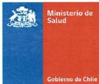

# MINISTERIO DE SALUD DE CHILE

Subsecretaría de Salud Pública.

División de Prevención y Control de Enfermedades.

Departamento de Ciclo Vital.

Programa Nacional Salud Integral de Adolescentes y Jóvenes.

División de Políticas Públicas Saludables y Promoción

Departamento de Salud y Pueblos indígenas e Interculturalidad

Documento fue elaborado por el Programa Nacional de Salud Integral de Adolescentes y Jóvenes de la División de Prevención y Control de Enfermedades (DIPRECE), en conjunto con el Departamento de Salud y Pueblos Indígenas e Interculturalidad de la División de Políticas Públicas Saludables y Promoción (DIPOL). Participan también Departamento de Salud Mental (DIPRECE) y Departamento Gestión de los Cuidados de la División de Atención Primaria (DIVAP). En colaboración con el Programa de Estudios Sociales en Salud, ICIM-UDD

Todas las imágenes de esta publicación han sido reproducidas con el conocimiento y consentimiento previo de los involucrados en cuestión. Algunas de ellas corresponden a registros realizados durante la Primera Jornada Participativa con Adolescentes y Jóvenes Migrantes Internacionales, desarrollada por el Programa Nacional de Salud Integral de Adolescentes y Jóvenes el año 2019.

Este documento corresponde a un material en revisión, y no puede ser reproducido total o parcialmente para fines de difusión y capacitación.

2
# EDITORES/AS

Felipe Hasen Narváez.

Antropólogo. Oficina de Salud Integral de Adolescentes y Jóvenes. Departamento Ciclo Vital.

Cettina D'Angelo Quezada

Matrona. Oficina de Salud Integral de Adolescentes y Jóvenes. Depto. de Ciclo Vital.

Barbara Bustos Barrera.

Antropóloga. Departamento de Salud y Pueblos Indígenas e Interculturalidad. División de Políticas Públicas Saludables y Promoción.

Graciela Cabral Quidel.

Educadora. Departamento de Salud y Pueblos Indígenas e Interculturalidad. División de Políticas Públicas Saludables y Promoción.

# RESPONSABLE TÉCNICO DEL DOCUMENTO

Fernando González Escalona. Jefe División de Prevención y Control de Enfermedades.

Subsecretaria de Salud Pública.

Andrea Albagli Iruretagoyena. Jefa de División de Políticas Públicas Saludables y Promoción de la Salud. Subsecretaria de Salud Pública.

Patricia Cabezas Olivares. Jefa del Departamento de Ciclo Vital, División de Prevención y Control de Enfermedades. Subsecretaria de Salud Pública.

# COLABORADORES

Carolina Liu Orellana Campos.

Ginecóloga Pediátrica y de la Adolescencia. Encargada Oficina de Salud Integral de Adolescentes y Jóvenes. Depto. de Ciclo Vital.

Alejandro Gallegos Cárdenas.

Psicólogo. Oficina de Salud Integral de Adolescentes y Jóvenes. Depto. de Ciclo Vital.

Pamela Llanten Aroca.

Medica familiar. Oficina de Salud Integral de Adolescentes y Jóvenes. Depto. de Ciclo Vital

Paula Maureira.

Enfermera. División de Prevención y Control de Enfermedades. Subsecretaria de Salud Pública.

Rodrigo Zárate Soriano.

Psicólogo. Departamento de Salud Mental. División de Prevención y Control de Enfermedades

Belén Vargas Gallegos.

Psicóloga. Departamento de Salud Mental. División de Prevención y Control de Enfermedades

Felipe Peña Quintanilla.

Psicólogo. Departamento de Salud Mental. División de Prevención y Control de Enfermedades

Rodolfo Tagle Alles.

Antropólogo. Departamento de Salud y Pueblos Indígenas e Interculturalidad. División de Políticas Públicas Saludables y Promoción.

Pamela Meneses Cordero.

Socióloga. Encargada Programa Adolescentes y Jóvenes. Depto. Gestión de los Cuidados. División de Atención Primaria. Subsecretaría de Redes Asistenciales.

Daniel Molina Mena.

Psicólogo. Depto. Gestión de los Cuidados. División de Atención Primaria. Subsecretaría de Redes Asistenciales.

Clodovet Millalen Sandoval.

Antropóloga. Programa de Salud y Pueblos Indígenas. Depto. Gestión de Cuidados. División de Atención Primaria. Subsecretaría de Redes Asistenciales.

Ricardo Hernández Fonfaf.

Depto. Gestión de Cuidados. División de Atención Primaria. Subsecretaría de Redes Asistenciales.

Marcela Pizarro.

Trabajadora Social. Referente de Programa Salud Intercultural. Departamento Atención Primaria. Servicio de Salud Araucanía Sur.

Paola Figueroa.

Matrona. Referente de Programa Adolescentes y Jóvenes. Subdepartamento gestión de Ciclo Vital Departamento Atención Primaria. Servicio de Salud Araucanía Sur.

Gabriela Vivanco Bobadilla.

Psicóloga. Enc. Provincial Programas Salud Intercultural y Migrantes. Departamento Salud de Poblaciones. SEREMI de Salud Región de Los Lagos.

Suyin Aguilar Retamal.

Enfermera. Referente Programa Salud Integral de Adolescentes y Jóvenes. SEREMI de Salud Arica y Parinacota.

Roxana Luna González.

Trabajadora Social. Encargada Regional Programa Salud Intercultural y Migrantes. Departamento Salud de Poblaciones. SEREMI de Salud Región de Los Lagos.

Adalguisa Painemilla Calfuleo.

Enfermera. Referente de Programa Salud Intercultural. SEREMI de Salud Araucanía.

4
Viviana Huaiquilaf Rodríguez

Profesora de Educación Intercultural. Referente Técnica. Programa Especial Salud Pueblos Indígenas (PESPI), Servicios Salud Valdivia.

Gloria Hueitra Calfipan

Facilitadora Intercultural. Asesora Salud Intercultural. CESFAM Panguipulli.

Gladys Neculpan Licancura

Facilitadora Intercultural. Asesora Salud Intercultural. CESFAM Panguipulli.

Alexandra Obach King, PhD.

Antropóloga. Programa de Estudios Sociales en Salud. Instituto de Ciencias e Innovación en Medicina. Facultad de Medicina Clínica Alemana, Universidad del Desarrollo.

Báltica Cabieses Valdés, PhD.

Enfermera. Programa de Estudios Sociales en Salud. Instituto de Ciencias e Innovación en Medicina. Facultad de Medicina Clínica Alemana, Universidad del Desarrollo.

Daniela Ortega Allan.

Abogada. Consultora Derechos del Niño y Migraciones. UNICEF Chile.

Francisca Salas Pacheco.

Pediatra especialista en Adolescencia. Ex encargada Oficina de Salud Integral de Adolescentes y Jóvenes MINSAL, Actualmente profesional del Centro de Adolescencia de la Clínica Alemana.

Silvia Santander Rigollet. Ex jefa División de Prevención y Control de Enfermedades. Subsecretaria de Salud Pública.

JEFA 5
# CONTENIDOS

CAPÍTULO I: INTRODUCCIÓN... 7

1.1 Objetivos. 10
1.2 Alcance. 10

CAPÍTULO II. ANTECEDENTES... 11

2.1 Aspectos conceptuales para abordar las adolescencias en contexto intercultural y sus implicancias en salud... 11

2.1.1 Cultura. 11
2.1.3. Interculturalidad en salute 12
2.1.4. Sistemas medicos 13
2.1.5 Servicios Públicos de salute con pertinencia intercultural 13
2.1.6, Competencia intercultural en profesionales de salute 13
2.1.7 Servicios de salute para adolescentes con pertinencia intercultural 14

CAPÍTULO III: BARRERAS DE ACCESO Y OPORTUNIDADES EN LA ATENCIÓN DE SALUD DE ADOLESCENTES Y JÓVENES DESDE UN ENFOQUE INTERCULTURAL... 17

3.1. Adolescents y jóvenes indigenas. 17
3.2. Adolescents y jóvenes migrantes internaciones y/o refugiados 24

CAPÍTULO IV: REQUISITOS GENERALES PARA LA ATENCIÓN DE SALUD DE ADOLESCENTES CON PERTINENCIA CULTURAL... 33

CAPÍTULO V: CONSIDERACIONES ESPECÍFICAS PARA LA ATENCIÓN DE SALUD DE ADOLESCENTES MIGRANTES INTERNACIONAL Y/O REFUGIADOS... 40

5.1. Recomendaciones... 41

CAPÍTULO VI: CONSIDERACIONES ESPECÍFICAS PARA LA ATENCIÓN DE SALUD INTEGRAL EN ADOLESCENTES PERTENECIENTES A PUEBLOS INDÍGENAS... 47

6.1. Recomendaciones... 48

ANEXOS... 53

ANEXO 1: EVIDENCIA SOBRE PERTINENCIA CULTURAL EN CUANTO A LA ATENCIÓN DE ADOLESCENTES Y JÓVENES... 53

ANEXO 2. METODOLOGÍA DE REVISIÓN DE LITERATURA PARA BÚSQUEDA DE EVIDENCIA... 59

ANEXO 3. MARCO LEGAL... 61

REFERENCIAS... 68

6
# CAPÍTULO I: INTRODUCCIÓN.

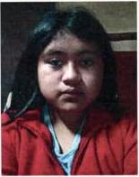

"Los consultorios o los hospitales, al menos para los adolescentes de pueblos originarios, se les podrían dar, no privilegios, pero si más espacios pertinentes. Por ejemplo, en los niños, niñas y adolescentes se está retomando mucho lo que es usar la vestimenta, y cuando van a los centros de salud con su vestimenta, los chilenos o winkas los miran en menos o que los doctores que los atiendan no les digan nada por su vestimenta, sino que se les pueda integrar de mejor forma.

VALENTINA QUIPAINAO QUILACAN (14 años).

Mapuche.

Malalhue, Región de los Ríos.

Indudablemente, el carácter multicultural de nuestro país confiere una enorme responsabilidad a los servicios públicos para avanzar en el desarrollo de modelos de atención pertinentes a la diversidad cultural en el cual se desenvuelven. En este contexto, es necesario que los servicios de salud generen estrategias frente a los diversos grupos de la población, con el objetivo de garantizar el acceso a la salud a todas y todos, sin discriminación alguna, pues la salud es un derecho universal inherente y fundamental para la población (1).

Es importante recalcar que esta guía se enmarca en la implementación de diversos instrumentos jurídicos nacionales e internacionales que contienen los diferentes compromisos que Chile ha asumido en torno al respeto de los derechos humanos de las niñas, niños y adolescentes (en adelante NNA) en contexto de interculturalidad. Como, por ejemplo, la Convención de los Derechos del Niños (CDN) (2) en su artículo N° 24 sobre "salud y servicios médicos", o en la Observación General N° 15 del Comité de los Derechos del Niño (2013) (3) sobre el derecho al disfrute del más alto nivel posible de salud, entre otros¹.

En este sentido, se considera importante avanzar en la adecuación de las prácticas clínicas, la promoción, prevención, participación, disponibilidad de los servicios y entrega de información desde la pertinencia cultural, especialmente en adolescentes pertenecientes a pueblos originarios², migrantes internacionales y/o refugiados, pues es en estas poblaciones donde se observan mayores brechas e indicadores negativos de salud, asociados, por ejemplo, a alta deserción escolar, limitado acceso a los servicios de salud, entre otros (4).

¹ Para una mayor especificación del marco jurídico que enmarca las recomendaciones del documento, revisar sección 2.2.

² La pregunta por pertenencia a pueblos indígenas está establecida en la Norma 643 (ex-820), sobre estándares de información en salud (2016) que rige para todos los formularios electrónico o de papel el sector. La pregunta es una pregunta estandarizada y universal, se formula de acuerdo a como sigue: ¿Se considera perteneciente a algún pueblo indígena u originario? Para efectos de este documento se utilizará mayoritariamente el término pueblos originarios, según los acuerdos tomados en el proceso de consulta indígena de Art.7 de la ley 20.584.
Si bien, históricamente los pueblos originarios en América, en su conjunto han sido afectados por desigualdades en su desarrollo socioeconómico, laboral, alfabetismo y servicios sociosanitarios (5) (6), en algunos países de la región, las políticas sanitarias han logrado avanzar paulatinamente en mejorar los indicadores de acceso a la salud, acortando las brechas e inclusive superando los resultados de población no indígena (7), a pesar de que la evidencia que se presentará más adelante en este documento, demuestra que aún queda mucho camino por recorrer.

Los avances son aún insuficientes para garantizar el verdadero ejercicio de los derechos en salud de los pueblos indígenas, evidencia de ello es la situación de transición epidemiológica polarizada que presentan estos pueblos, con una alta mortalidad por enfermedades crónicas y mayores tasas de muerte por enfermedades infecto-contagiosas (8) (9) (10). Si bien la información se encuentra fragmentada, es sistemática en mostrar el daño acumulado, inequidad y discriminación, a lo que se suma el deterioro en sus ecosistemas y modos de vida y la falta de resonancia cultural de los programas de salud convencionales, situación agravada en los dos últimos años por la pandemia de la COVID-19 (11).

En Perú, por ejemplo, con el objetivo de avanzar también en la incorporación de la interculturalidad en la atención de la población (12), se logró publicar las *“Orientaciones para incorporar la pertinencia cultural en los servicios diferenciados de atención integral del adolescente”* (13). Estas Orientaciones desarrollan aspectos y acciones para que el personal de salud brinde una atención integral a este grupo de la población dentro y fuera del establecimiento de salud, promoviendo, entre otras cosas, su participación activa.

En este contexto socio sanitario latinoamericano, Chile cuenta con un Programa de Salud y Pueblos indígenas surgió en la Araucanía en el año 1992, y con una Política Nacional de Salud de Pueblos Indígenas del año 2006 (14). Más recientemente la Ley 20.584 sobre Derechos y Deberes de las personas en su atención de salud (15), en su artículo N° 7 establece el derecho de las personas pertenecientes a pueblos indígenas a recibir una atención de salud con pertinencia cultural.

El mismo caso ha sucedido respecto a la población migrante internacional en países como Chile, donde en las últimas décadas se ha enfrentado el desafío de constituirse como un país receptor de población migrante, proveniente principalmente de países de América Latina. Especialmente, en cuanto a adolescentes migrantes, este grupo etario es relativamente desconocido, al menos en términos de necesidades de vida y salud, así como en su consideración específica en investigación y políticas públicas (16) (17). Recién en la última década se ha puesto foco en el impacto de la migración en adolescentes, reconociéndolos como actores relevantes que, en muchas ocasiones, no son quienes toman la decisión de migrar (18).

Desde 1996, la Organización Mundial de la Salud (OMS) viene invirtiendo en el desarrollo de recursos para mejorar la competencia de los proveedores de atención sanitaria en materia de salud y desarrollo en adolescentes. Entre esos recursos, se cuenta con el “Programa de orientación sobre

8
salud de los adolescentes destinado a los proveedores de atención sanitaria" (19), con su publicación complementaria "Adolescent job aid" (Guía práctica para la atención de los adolescentes) (20), que se constituye como una práctica herramienta de referencia para los profesionales de la salud que brindan servicios a adolescentes, con el objetivo de ayudarles a responder de manera más eficaz y con mayor sensibilidad.

A lo anterior, se suma la guía de "Competencias básicas en materia de salud y desarrollo de los adolescentes para los proveedores de atención primaria" (21), la que incluye un instrumento para evaluar el componente de salud y desarrollo de adolescentes en la formación de los proveedores de atención de salud. En el año 2016, la OMS/OPS pública el documento de "Normas o estándares globales de calidad para la atención de salud integral de adolescentes" (22), en donde se define el grado de calidad necesario que deben tener los servicios de salud que atienden a este grupo, describiendo, además, las características que éstos deben tener para satisfacer las necesidades de adolescentes, aminorando de esta forma las barreras que presentan los servicios de salud. Dentro de estos estándares, específicamente, la Norma N°6 hace alusión a la equidad, estableciendo que se deben proveer prestaciones y atención de calidad a todos los y las adolescentes, independiente de su capacidad de pago, edad, sexo, nivel educacional, origen étnico, orientación sexual, entre otros, siendo necesario ampliar el contexto del abordaje intercultural en esta etapa de vida.

Por su parte, la Organización Panamericana de la Salud (OPS) ha propuesto directrices para diseñar políticas orientadas a la población indígena (23) (24), recomendaciones para el desarrollo de servicios interculturales (25) (26) y estrategias en grupos específicos (27). Además, existen sistematizaciones de intervenciones para mejorar el acceso a servicios y prestaciones de salud efectivas por parte de este grupo de la población, abarcando principalmente intervenciones contra barreras geográficas, económicas, idiomáticas, actitudes de los equipos de salud e intervenciones que aproximan el sistema de salud a la persona y comunidades indígenas (28).

Todos estos documentos han establecido que el grupo de profesionales que otorgan atención de salud a adolescentes necesitan destrezas especiales en materia de consulta, comunicación interpersonal y atención interdisciplinaria, adecuadas a la etapa de desarrollo y el entorno del individuo. Además, se recomienda que la práctica clínica se base en la promoción y protección del derecho de adolescentes a la salud, conforme a los principios de equidad, no discriminación, participación e inclusión, y responsabilidad (21).

En consideración a lo anterior, el presente documento, desarrolla aspectos y propone acciones para brindar una atención integral a adolescentes, desde un enfoque de pertinencia cultural, esperando que estas consideraciones puedan servir al personal de salud, que tengan en su jurisdicción territorial población migrante internacionales o de pueblos originarios, pero siendo referencial también para el resto de establecimientos en el ámbito urbano o rural.

Indudablemente, constituye un documento de orientación, con recomendación de acciones factibles y viables que implican como primera condición el cambio de actitudes y reconocimiento

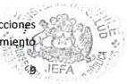
de otras lógicas de atención en salud dentro del marco del respeto hacia las diversas formas de vivir la adolescencia, para lograr que la atención sea brindada con calidad, calidez, humanismo, empatía, dignidad y pertinencia cultural.

## 1.1 Objetivos.

**Objetivo general.**

Entregar lineamientos a los equipos de salud para la incorporación de la pertinencia cultural en la atención de salud y acciones derivadas de esta, dirigida a adolescentes de pueblos indígenas, migrantes internacionales y/o refugiados, basado en la evidencia actualizada.

**Objetivos específicos.**

1. Entregar herramientos que permitan mejorar competencias culturales en la entrega de atencion de salute a adolescentes
2. Definir e implementar criterios minimos de atencion de calidad en adolescentes de pueblos originarios, migrantes internaciones y refugiados, favoreciendo una atencion de salute acorde a los requerimientos y necessities de theseos grupos especialicos desde la pertinencia cultural y territorial.
3. Definir e implementar los aspectos ético-legales en un marco de derechos, relacionados a la atencion de salute de adolescentes encontextos de interculturalidad.
4. Establisher un marco de evidencia respecto a la pertinencia cultural en la atencion de salute de adolescentes para su implementacion.

## 1.2 Alcance.

Estas orientaciones están dirigidas a equipos de salud que otorgan atención a adolescentes en los distintos establecimientos de la atención primaria, secundaria y terciaria, tales como Espacios Amigables para adolescentes, Centros de Salud Mental Comunitario, establecimientos hospitalarios, entre otros; conforme a las competencias establecidas que el ordenamiento jurídico brinda para cada uno de ellos. Se espera que estas consideraciones puedan servir al personal de salud, principalmente, a aquellos que tengan en su jurisdicción territorial población adolescente de pueblos originarios, refugiados y/o migrantes internacionales, pero siendo referencial también para el resto de establecimientos en el ámbito urbano o rural.

10
# CAPÍTULO II. ANTECEDENTES.

Fuente: Elaboración propia. Primera Jornada Participativa con adolescentes y jóvenes migrantes internacionales, desarrollada por el Programa Nacional de Salud Integral de Adolescentes y Jóvenes el año 2019.

2.1 Aspectos conceptuales para abordar las adolescencias en contexto intercultural y sus implicancias en salud.

# 2.1.1 Cultura.

El concepto de cultura aplicado al campo de la salud, constituye el eje neurálgico en el análisis de los factores sociales involucrados en cualquier proceso de salud y enfermedad. Esto implica un necesario reconocimiento a las diferencias y similitudes culturales entre los diversos actores. En cuanto a su definición, algunos hablan de cultura como un fenómeno estable y cerrado (29), y otros como un fenómeno impreciso y con innumerables acepciones ideológicas (30).

De acuerdo a Harris (31), la cultura se define como el conjunto aprendido de tradiciones y estilos de vida socialmente adquiridos. Mientras que para Lévi Strauss (32), la cultura es un sistema de comunicación regido por el intercambio de valores como el lenguaje, el sistema de parentesco y los bienes materiales. Otras aproximaciones subrayan aspectos simbólicos de la cultura. Desde esta perspectiva, Clifford Geertz (33) entiende la cultura como un sistema de símbolos compartidos y aprendidos, suministrando a los seres humanos un marco significativo dentro del cual pueden orientarse en sus relaciones recíprocas, con el mundo que los rodea, y consigo mismos.

Desde esta perspectiva, un elemento central en el análisis de las culturas, es que éstas deben comprenderse de manera dinámica, toda vez que los individuos y grupos sociales se van transformando en el tiempo. Esto evita caer en visiones culturales rígidas respecto al entendimiento de procesos y fenómenos socioculturales (34). Por el contrario, la estratificación social, el género, la etnia, la edad, entre otras variables, condicionan la forman en que la cultura es interiorizada por los diversos grupos sociales (34).

11
### 2.1.3. Interculturalidad en salud.

La salud y la enfermedad se desarrollan dentro de contextos socioculturales e históricos determinados y en constante dinamismo. De esta forma, los sistemas de salud y los procesos que de ellos emanan, están insertos en esa compleja trama social, así como sus significados y representaciones materiales, económicas, políticas y simbólicas (34).

Dado que existe una gran diversidad cultural, la pregunta sobre cómo se construye el yo y el otro en un encuentro intercultural, es ineludible, entendiendo lo intercultural como todo aquello -material e inmaterial- que habita entre dos o más personas, en cuanto a los conjuntos de modos de vida que estas mismas personas definen, comprenden y practican, y que en algún punto se encuentran y co-construyen (34). Desde esta perspectiva, se refuerza el hecho de que la identidad se define en la construcción de una relación.

A través de un enfoque de interculturalidad en salud (35), es posible dar cuenta de una interrelación equitativa y respetuosa de las diferencias políticas, económicas, sociales, culturales, espirituales, etarias, lingüísticas y de género en la provisión de servicios de salud. En este sentido, la relación entre cultura y salud releva el reconocimiento y respeto de la singularidad y diversidad que cada cultura tiene a lo largo del su curso de vida, construyendo un ambiente donde estas diferencias cohabiten y aporten a la mejor salud de la población (36).

En este contexto, la interculturalidad subraya la importancia del reconocimiento mutuo de la diferencia cultural y aquello que es común. De este modo, en su espíritu de disminución de las jerarquías, propone un diálogo más horizontal y respetuoso entre las partes (34). Además, se plantea que el personal de salud reconozca que también son personas culturalmente situados, y que la biomedicina es también un producto culturalmente construido (34).

Tal cómo se ha ido estableciendo en los lineamientos del MINSAL (14) (37) (38), integrar la mirada intercultural a los programas de salud, resulta fundamental para la implementación de estrategias que consideren la visión de mundo de los distintos usuarios y usuarias, y sus realidades culturales (36) (4). El diseño de estrategias, programas y acciones definidos sólo en relación al sistema de creencias del equipo de salud, representan un obstáculo para la prevención, promoción y acceso a una atención oportuna y pertinente.

A pesar de lo anterior, y más allá de los avances y logros que ha implicado el desarrollo de la salud intercultural en la región y el país, cabe dar cuenta que existe en la bibliografía una escasa reflexión respecto a las implicancias de los enfoques desde los cuales se han desarrollado las iniciativas de salud intercultural, las cuales en muchos casos reproducen las relaciones de dominación (39) (40) (41).

12
## 2.1.4. Sistemas médicos.

Desde la antropología sociocultural, un sistema médico se concibe como un conjunto más o menos organizado, coherente y estratificado de agentes terapéuticos, modelos explicativos de salud-enfermedad, prácticas y tecnologías al servicio de la salud individual y colectiva (42). La forma en que estos elementos se organizan internamente, otorgando coherencia al sistema, depende del modelo sociocultural en que se desarrolla la medicina. En consecuencia, las medicinas también son construcciones culturales que responden a necesidades de un entorno social específico y en los cuales es posible distinguir una dimensión conceptual y otra conductual.

Ambas dimensiones están determinadas directamente por la cultura de los usuarios/as y profesionales (modelos que explican y fundamentan una enfermedad o desequilibrio). Por ejemplo, en la biomedicina, la evidencia basada en el método científico constituye importantes fuentes de validación, frente a lo cual, no se suele dar crédito, por ejemplo, a que un dolor de cabeza, un bajo estado de ánimo o una diarrea sea producido por un "mal de ojo" o por la intervención de "espíritus". Sin embargo, otros pueblos, culturas o sistemas médicos aceptan como fuente de legitimación de una enfermedad o síntoma, elementos propios de la cosmovisión de una determinada cultura (los sueños, signos en la naturaleza, espíritus, entre otros), entendiendo la salud y la enfermedad como un equilibrio/desequilibrio entre los seres humanos, la comunidad, la naturaleza y los seres espirituales (43) (44) (45).

En este contexto, la lógica que opera en la definición de salud y enfermedad es la misma en los diversos sistemas (una lógica que busca causas y consecuencias), sin embargo, difieren en las premisas culturales y pruebas de validación, siendo todas las explicaciones igualmente relevantes.

## 2.1.5 Servicios públicos de salud con pertinencia intercultural.

Los servicios públicos de salud con pertinencia intercultural, son aquellos que incorporan el enfoque intercultural en todo su proceso de atención (gestión de horas, entrega de prestaciones, derivación, facilitadores interculturales, entre otros). Es decir, ofrecen servicios que se adecuan y adaptan a la realidad de las personas, que toman en cuenta y relevan las características culturales particulares de los grupos de población de las localidades en donde se interviene y se brinda atención (13).

## 2.1.6. Competencia intercultural en profesionales de salud.

Existen dos fenómenos articulados que determinan la necesidad de desarrollar competencias interculturales en el ámbito de la atención de salud. Por un lado, los movimientos migratorios y por otro lado los diferentes pueblos indígenas que habitan el país, cada uno de ellos con una diversidad cultural y construcción social de sistemas médicos. Lo anterior, exige incorporar modelos teóricos y de práctica que permitan brindar una atención en salud oportuna, de calidad y pertinente a las comunidades considerando la diversidad existente (46) (47) (48) (37).

13 IEFA
De acuerdo a Cabieses, Obach y Urrutia (34), la competencia intercultural en salud es entendida como:

"Aquellas que llaman al reconocimiento de los trabajadores de la salud como sujetos con cultura e historia, así como también los y las usuarios. La interculturalidad, o las competencias interculturales por su parte, tienen en este contexto su acento no en el trabajador de salud únicamente, sino que en el encuentro humano entre todas las partes involucradas en la atención de salud".

Se desprende por tanto la necesidad de generar una mirada crítica respecto no sólo al contexto social y cultural de los/as usuarios/as en la atención de salud, sino también respecto al rol de la biomedicina (49), debido a que tradicionalmente ha tenido una aproximación desde la universalidad en cuanto a las formas de entender la salud, la enfermedad y la atención (50). Lo anterior, es aún más importante desarrollarlo y emplearlo cuando los equipos de salud y los usuarios/as se reconocen como pertenecientes a grupos diferentes (nacionalidad o pertenencia a un pueblo indígena) (51).

Los y las facilitadores/as y/o mediadores/as interculturales, por ejemplo, realizan un aporte al encuentro intercultural en salud, y son testigos de cómo las instituciones de salud se enfrentan a realidades diversas en materia lingüística y sociocultural. Por tanto se requiere avanzar en el reconocimiento e incorporación de la figura de los/as facilitadores/as y/o mediadores/as interculturales en la atención sanitaria con pertinencia intercultural, tanto hacia población indígena como migrante internacional (52).

# 2.1.7 Servicios de salud para adolescentes con pertinencia intercultural.

Los servicios de salud requieren de profundas adecuaciones que permitan dar cuenta de las construcciones de la adolescencia indígena o en contexto migratorio y/o de refugio, donde el paso de la niñez a la vida adulta no siempre coincide con lo que se entiende como adolescencia. Por tanto, las prestaciones de salud, más que organizarse en términos de criterios cronológicos, deberían enfatizar, según la evidencia, en los cambios de roles que marcan los límites de cada etapa, de acuerdo a cada contexto cultural en el cual se encuentran inmersos (27).

Si bien, la OMS define la adolescencia como el período de crecimiento y desarrollo humano que se produce después de la niñez y antes de la edad adulta (entre los 10 y los 19 años), tratándose de una de las etapas de transición más importantes en la vida del ser humano (53), las características propias de este período pueden variar a lo largo del tiempo, entre unas culturas y otras.

Estudios de Margaret Mead (54) y Ruth Benedict (55), revelaban ya en las décadas del 50' y 60' del siglo pasado, que distintos grupos étnicos percibían de manera diferente los cambios corporales propios de la pubertad, demostrando que, finalmente, al hablar teóricamente sobre la adolescencia, es conveniente no olvidarse de que, al fin y al cabo, es un concepto instrumental que ayuda a

14
acercarse a una realidad mucho más compleja y diversa, obligándonos a no hablar solo de “la adolescencia”, sino más bien de “las adolescencias”.

En consideración a lo anterior, en las adolescencias, los determinantes sociales de la salud y otras variables psicosociales del entorno inmediato (la comunidad, la escuela, el grupo de pares, la familia, su medio ambiente y los elementos culturales que estructuran su quehacer diario) definen las condiciones, decisiones y consecuencias en esta y en las siguientes etapas del desarrollo, haciéndose imperativo para los servicios de salud considerar estas temáticas en la atención de salud (56).

De esta forma, se debe considerar a cada adolescente en forma integral, dándole una atención que trascienda lo biológico e incorpore dimensiones basadas en cada contexto territorial y cultural de origen, así como la historia de migración propia y familiar en el caso de adolescentes migrantes internacionales y/o refugiados (familias en contexto de movilidad). Con este fin, es imprescindible la incorporación de otros actores en la atención de salud, como por ejemplo líderes comunitarios, especialistas de la medicina indígena, facilitadores interculturales y los propios adolescentes. Lo anterior requiere de consideraciones específicas en esta etapa del curso de vida, de acuerdo a los lineamientos generales de atención en salud con pertinencia cultural, las cuales serán trabajadas en el capítulo 4.

15
Nota: Resumen criterios y atributos de un servicio de salud para adolescente con pertinencia intercultural.

Los y las adolescentes a menudo se ven como un único grupo homogéneo, pero en realidad es un grupo diverso de personas cuyas necesidades de salud son complejas, cambiantes y variadas.

Cada adolescente tiene una identidad única que influye sobre su bienestar.

La prestación de servicios amigables para adolescentes se basa en entender y respetar las realidades y la diversidad de las diversas adolescencias, creando un servicio de salud en el que este grupo (o estos grupos) confíe y que satisfaga sus necesidades. Esto significa entender que cada persona es única, pasando de la tolerancia a la celebración de la diversidad (60).

La pertinencia intercultural implica (45):

- La adaptación y adecuación de todos los procesos asociados a la atención de salud, a las características geográficas, ambientales, socioeconómicas, epidemiológicas, demográficas, lingüísticas y culturales (prácticas, valores y creencias) del usuario/a.
- La valoración e incorporación de la cosmovisión y concepciones de desarrollo y bienestar de los diversos grupos de población que habitan en una determinada localidad, incluyendo tanto las poblaciones asentadas originalmente, como las poblaciones que han migrado desde otras zonas.
- Existen protocolos establecidos que establezcan la importancia para el personal de salud de registrar la variable de pertenencia a pueblos originarios, nacionalidad y/o país de origen.
- Adaptación del lugar de atención hacia una ambientación pertinente y adecuada para cada adolescente, especialmente en el caso de Servicios de Salud en territorios donde haya presencia de pueblos originarios y/o población migrante internacional.
- Capacitación y sensibilización de los equipos de salud que atienden a adolescentes, respecto a competencias sobre salud intercultural, con la finalidad de que cuentan con actitudes, conocimientos y habilidades necesarias para el abordaje de este grupo de la población.
- Elabora y utilización de materiales educativos/informativos de acuerdo a la realidad local, con la participación de los y las adolescentes.
- Fomento de la valoración cultural de adolescentes, realizando actividades educativas y recreativas en la misma comunidad.

16
# CAPÍTULO III: BARRERAS DE ACCESO Y OPORTUNIDADES EN LA ATENCIÓN DE SALUD DE ADOLESCENTES Y JÓVENES DESDE UN ENFOQUE INTERCULTURAL.

## 3.1. Adolescentes y Jóvenes Indígenas.

Desde una perspectiva amplia, a nivel demográfico, entre los pueblos indígenas de América Latina se verifica que el proceso de envejecimiento poblacional avanza a ritmos menos acelerados que para el resto de la población regional. Por tal razón, el grupo de adolescentes y jóvenes continúa siendo un segmento muy numeroso de la población. Sumado a esto, a pesar de que en Latinoamérica se constata un predominio de asentamiento rural, también se observa un aumento de la migración campo-ciudad entre adolescentes y jóvenes indígenas, viviendo constantes tensiones entre modos de vida, apego a la cultura propia y los modos de vida urbano (27).

### Sociodemográfico

En Chile, hace dos décadas los datos del CENSO 2002 registró que un 4,6 % de la población declaró pertenecer a uno de los 9 pueblos indígenas reconocidos por la Ley Indígena 19.253. Hoy día, los datos del CENSO 2017, nos señalan que el 12,8%, pertenece a pueblos indígenas u originario, lo que corresponde a 2.185.732 personas en todo el territorio nacional (57).

Dentro de los pueblos registrados, el pueblo mapuche es el más numeroso, con el cual se identifica el 79,8% de las personas que refieren pertenencia a pueblos originarios. Le siguen en frecuencia los pueblos aymara (7,2%), diaguita (4%), quechua (1,5%), lican antaí (1,4%), colla (0,9%), rapa nui (0,4%), kawésqar (0,2%) y yámana (0,1%) (57).

En relación a la edad de esta población el 47% es menor a 30 años, y un 13,5% está por sobre los 60 años (74) (ver tabla N° 1). Esta estructura de rangos de edad se mantiene similar en el desglose por cada uno de los pueblos reconocidos, con excepciones en el pueblo quechua, yámana y kawésqar, en donde la proporción de menores de 19 años es bastante menor.

En específico, el grupo de adolescentes (10-19 años) corresponde al 15,4% del total de población indígena, mientras que los jóvenes (20-24 años), corresponde al 8,2%. Sumando en conjunto, un 23,6% del total de población indígena reconocida en el CENSO 2017 (57).

**Tabla N° 1.** Población que se considera perteneciente a un pueblo indígena u originario, según grupo etario.

|  GRUPOS DE EDAD | TOTAL, POBLACIÓN QUE SE CONSIDERA PERTENECIENTE A UN PUEBLO INDÍGENA U ORIGINARIO  |
| --- | --- |
|  0 a 4 | 151.945  |
|  5 a 9 | 175.321  |
|  10 a 14 | 167.108  |
|  15 a 19 | 170.900  |
|  20 a 24 | 180.098  |

|  25 a 29 | 182.536  |
| --- | --- |
|  30 a 34 | 159.230  |
|  35 a 39 | 148.555  |
|  40 a 44 | 150.013  |
|  45 a 49 | 144.247  |
|  50 a 54 | 140.242  |
|  55 a 59 | 120.171  |
|  60 a 64 | 94.124  |
|  65 a 69 | 71.071  |
|  70 a 74 | 53.972  |
|  75 a 79 | 36.582  |
|  80 a 84 | 21.839  |
|  85 a 89 | 11.932  |
|  90 a 94 | 4.394  |
|  95 a 99 | 1.084  |
|  100 o más | 428  |
|  Total, País | 2.185.792  |

Fuente: Censo de Población y Vivienda 2017. Instituto Nacional de Estadísticas (INE).

Del total de población que refiere pertenencia a pueblos originarios, el 49,3% son hombres (que corresponde a 1.078.111 personas) y un 50,7% son mujeres (correspondiente a 1.107.681 personas) (ver tabla N° 2). Esta proporción de mayor cantidad de mujeres, se mantiene en los pueblos mapuche, aymara, rapa nui, lican antai, quechua y diaguita. Mientras que se observa la situación contraria en los pueblos Colla (49,7% de mujeres) y Kawésqar (46% de mujeres).

Tabla N° 2. Población que se considera perteneciente a un pueblo indígena u originario, según sexo y pueblo.

|  SEXO | TOTAL, POBLACIÓN QUE SE CONSIDERA PERTENECIENTE A UN PUEBLO INDÍGENA U ORIGINARIO | MAPUCHE | AYMARA | RAPA NUI | LICAN ANTAI | QUECHUA | COLLA | DIAGUITA | KAWÉSQAR | YAGÁN O YÁMANA | OTRO | PUEBLO IGNORADO  |
| --- | --- | --- | --- | --- | --- | --- | --- | --- | --- | --- | --- | --- |
|  Total, País | 2.185.792 | 1.745.147 | 156.754 | 9.399 | 30.369 | 33.868 | 20.744 | 88.474 | 3.448 | 1.600 | 28.115 | 67.874  |
|  Hombres | 1.078.111 | 861.241 | 75.785 | 4.408 | 14.873 | 16.140 | 10.430 | 43.360 | 1.820 | 864 | 14.482 | 34.708  |
|  Mujeres | 1.107.681 | 883.906 | 80.969 | 4.991 | 15.496 | 17.728 | 10.314 | 45.114 | 1.628 | 736 | 13.633 | 33.166  |

Fuente: Censo de Población y Vivienda 2017. Instituto Nacional de Estadísticas (INE)

Respecto de la distribución de la población indígena a nivel regional, podemos observar que la región Metropolitana concentra el mayor número de personas que declararon pertenecer a un pueblo indígena u originario en el CENSO 2017, con un total de 695.116 personas, seguido de la región de la Araucanía y la región de los Lagos, con 321.328 y 228.776 respectivamente (ver gráfico N° 1).

18
Gráfico N° 1. Distribución número de personas que se consideran pertenecientes a pueblos indígenas por región.

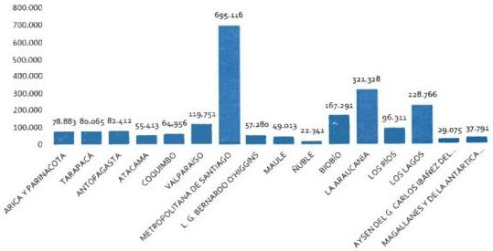

Fuente: Censo de Población y Vivienda 2017. Instituto Nacional de Estadísticas (INE).

De igual forma, los datos del CENSO 2017 informan que del total de personas que declaran pertenecer a pueblos indígenas, 1.759.677 (81%) se localizan en las zonas urbanos, en tanto que 426.115 (19%) viven en zonas rurales.

# Salud

De acuerdo a CASEN 2017, se observa una mayor proporción de población indígena que pertenece a Fonasa (86,4%) comparados con 77,2% en la población no indígena y a ningún sistema previsional (1,8% vs 2% respectivamente) y, por consiguiente, una menor proporción de población indígena pertenece a ISAPRES (7,4% vs 15,1%) y FF.AA. y de orden y otros sistemas (2,1% vs 2,8%) (57). Es importante indicar que el grupo de adolescentes indígenas se encuentra inscrito en el sistema público de salud en forma significativamente mayor a los no indígenas, lo que hace del sistema público prácticamente la única alternativa de respuesta a los requerimientos de atención.

Entre los problemas que se declaran tanto en población indígena como no indígena, las dos causas más frecuentes fueron: (i) problemas para ser atendidos en el establecimiento (demora en la atención, cambios de hora, etc.), y (ii) para conseguir una cita / atención / hora (57). Sin embargo, existen diferencias estadísticamente significativas entre ambas poblaciones en desmedro de los pertenecientes a pueblos originarios. Es así como el 20,5% de las personas que pertenecen a pueblos originarios tuvieron problemas para ser atendidos en el establecimiento de salud comparados con 15,9% de la población no indígena, y un 15,9% de la población perteneciente a pueblos indígenas tuvo problemas para conseguir hora comparados con un 12,5% de población no indígena (57).

Una mayor proporción de personas indígenas reportan haber encontrado dificultades de acceso (27,5% vs 23,5% de personas no indígenas) y, por el contrario, una menor proporción de personas que refieren no haber encontrado problemas para acceder a atenciones de salud (65,7% vs 71%) (57).

La situación de los pueblos indígenas en materia de salud, tanto en Chile como en la región, se caracteriza por estar vinculada a las situaciones de exclusión y discriminación históricas a las que han estado sometidos estos pueblos. Algunos estudios (58) han demostrado brechas sistemáticas entre la salud de población indígena y no indígena, dejando de manifiesto la situación de vulnerabilidad de esta población.

La constatación de estas características demográficas de la adolescencia y juventud indígena tiene variadas implicancias en materia de salud, con importantes desafíos no sólo en la mejora del acceso a los servicios de salud, sino también en el avance en la pertinencia cultural de las estrategias para mejorar la calidad de vida y bienestar de este grupo de la población.

Aun cuando la población adolescente se enferma y muere proporcionalmente menos que otros grupos etarios, no es menos cierto que específicamente en el grupo de adolescentes y jóvenes pertenecientes a pueblos originarios, enfrentan desigualdades vinculadas a las determinantes sociales de la salud que los sitúan en una posición de mayor vulnerabilidad que el grupo de adolescentes y jóvenes no indígenas (27).

En Chile, un proyecto de epidemiología llevado a cabo por el Ministerio de Salud y otras instituciones a partir del año 2006, permitió aproximarse al daño a la salud de la población adolescente y joven de distintos pueblos indígenas mediante el análisis de las causas de muerte en cinco Servicios de Salud del país (59) (60) (8). Al respecto, la población entre 10 y 24 años es, en general, población sana con tasas de mortalidad muy bajas. No obstante, como se aprecia en el gráfico 2, existen brechas de equidad entre la mortalidad indígena y no indígena en los cinco Servicios de Salud que participaron del estudio, con riesgos relativos que van desde un 40% en los mapuches del área lafkenche de Araucanía Sur, hasta un 280% más de riesgo para los mapuche-Huilliches del área de cobertura del Servicio de Salud Valdivia. En este último también se encuentran las tasas más altas de mortalidad.

Gráfico 2. Tasa bruta de mortalidad en la población de 10 a 24 años, por condición étnica, Chile, 2004-2006.

|   | Bio Bio | Arauco | Valdivia | Araucanía Sur | Arica  |
| --- | --- | --- | --- | --- | --- |
|  Indígena | 1,4 | 0,8 | 2,3 | 0,7 | 1,0  |
|  No indígena | 0,4 | 0,6 | 0,6 | 0,5 | 0,3  |

Fuente: CEPAL/ONU/OPS. 2011. Basado en: M. Pedrero y A.M. Oyarce, 2010. "Suicidio entre los pueblos indígenas de Chile: aspectos epidemiológicos y contextuales", Santiago de Chile, 2010.

20
Al analizar las causas de muerte de adolescentes y jóvenes (ver tabla 3), se observa que los traumatismos, envenenamientos y otras causas externas constituyen más de la mitad del total de muertes, una situación ya descrita en relación con este grupo tanto a nivel nacional como internacional. En términos porcentuales, estas muertes son levemente más altas en no indígenas (el 62,3% y el 65,6%, respectivamente) (27). Otro aspecto destacable es que, entre los adolescentes y jóvenes indígenas, hay un porcentaje mayor de muertes no clasificadas, lo que remite a problemas en el acceso a la atención médica. Hay, además, un porcentaje muy bajo de muertes de jóvenes indígenas por factores de embarazo, parto y puerperio, causa de muerte no registrada por los no indígenas en el periodo de estudio (27).

Mientras que en la tabla 4, es relevante mencionar que las causas de muerte violentas son más frecuentes en adolescentes y jóvenes indígenas, especialmente respecto a la causa específica de agresiones.

Tabla N° 3. Distribución relativa de las defunciones por grandes grupos de causa de muerte, según condición étnica (población de 10 a 24 años, 2004-2006) (En porcentajes).

|  Gran grupo de causa de muerte | Condición étnica |   | Total  |
| --- | --- | --- | --- |
|   |  Indígena | No indígena  |   |
|  Traumatismos, envenenamientos y consecuencia de causa externa | 62,3 | 65,6 | 64,6  |
|  Síntomas y signos no clasificados | 7,5 | 3,9 | 5,0  |
|  Cáncer | 6,6 | 7,8 | 7,5  |
|  Sistema circulatorio | 5,7 | 6,3 | 6,1  |
|  Sistema nervioso | 4,7 | 7,4 | 6,6  |
|  Sistema respiratorio | 4,7 | 0,4 | 1,7  |
|  Embarazo, parto y puerperio | 1,9 | 0,0 | 0,6  |
|  Malformaciones congénitas | 1,9 | 2,3 | 2,2  |
|  Otras causas | 4,7 | 6,3 | 5,8  |
|  Total | 100,0 | 100,0 | 100,0  |

Fuente: CEPAL/ONU/OPS. 2011. Basado en: M. Pedrero y A.M. Oyarce, 2010. "Suicidio entre los pueblos indígenas de Chile: aspectos epidemiológicos y contextuales". Santiago de Chile, 2010.

Tabla N° 4. Distribución relativa de las defunciones por traumatismo por causa específica de muerte, según condición étnica (población de 10 a 24 años, 2004-2006) (En porcentajes).

|  Causa específica | Condición étnica |   | Total  |
| --- | --- | --- | --- |
|   |  Indígena | No indígena  |   |
|  Accidentes tránsito | 27,3 | 26,8 | 26,9  |
|  Agresiones | 18,2 | 9,5 | 12,0  |
|  Lesiones autoinfligidas | 24,2 | 23,2 | 23,5  |
|  Caídas | 11,4 | 10,8 | 10,6  |
|  Ahogamientos y sumersiones | 7,6 | 15,5 | 13,2  |
|  Exposición al fuego | 2,4 | 3,7 | 3,5  |
|  Otras | 8,9 | 10,5 | 10,3  |
|  Total | 100,0 | 100,0 | 100,0  |

Fuente: CEPAL/ONU/OPS. 2011. Basado en: M. Pedrero y A.M. Oyarce, 2010. "Suicidio entre los pueblos indígenas de Chile: aspectos epidemiológicos y contextuales", Santiago de Chile, 2010.

21
Respecto a los Registros Estadísticos Mensuales (REM) del Ministerio de Salud, en 2019, se registró una población total de 263.256 adolescentes en control, de los cuales 24.042 refirieron pertenecer a algún pueblo originario de Chile (9,1%). La tabla 5, además muestra la distribución absoluta según estado nutricional, en cada variable. El gráfico N° 3 muestra la distribución porcentual según estado nutricional.

Tabla N°5. Población bajo control, salud integral de adolescentes, según estado nutricional, pertenencia a pueblo originario. 2019.

|  TOTAL, ADOLESCENTES EN CONTROL  |   |   |
| --- | --- | --- |
|  INDICADOR IMC / EDAD | Total, PBC | Total, pueblos originarios  |
|   |  263.256 | 24.042  |
|  Obesidad Severa | 9.204 | 1.158  |
|  Obesidad | 46.403 | 4.822  |
|  Sobrepeso | 67.450 | 6.720  |
|  Peso normal | 116.295 | 9.886  |
|  Bajo peso | 12.097 | 816  |
|  Desnutrición | 1.855 | 121  |

Fuente: REM P09, DEIS. MINSAL.2019

Gráfico N°3. Población bajo control, salud integral de adolescentes, según estado nutricional y pertenencia a pueblo originario. 2019.

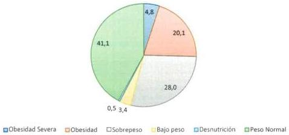

Fuente: REM P09, DEIS. MINSAL.2019

A través de la realización del Control de Salud Integral, es posible detectar o pesquisar algunos riesgos, que presenta cada adolescente al momento de la consulta, registrados en el instrumento para este fin (ficha CLAP para el Control de Salud Adolescente) (61). Según tabla 6, en 2019, un total de 19.644 adolescentes pertenecientes a pueblos originarios presentaban algún riesgo detectado, y de ellos, el principal fue en el área nutricional, seguido de algún riesgo para su salud sexual y reproductiva.

22
Tabla N° 6 Población en control salud integral de adolescentes, según áreas de riesgo, por pertenencia a pueblo originario. 2019.

|  Áreas de Riesgo | Total (N), adolescentes 10 a 19 años en control. | Adolescentes de pueblos originarios  |   |   |   |   |   |
| --- | --- | --- | --- | --- | --- | --- | --- |
|   |   |  Total |   | Hombres |   | Mujeres  |   |
|   |   |  N | % | N | % | N | %  |
|  Salud sexual y reproductiva | 38.190 | 3.771 | 9,8 | 1.280 | 33,9 | 2.491 | 66,1  |
|  Ideación suicida | 7.075 | 734 | 10,3 | 189 | 25,7 | 545 | 74,3  |
|  Intento suicida | 2.644 | 247 | 9,3 | 58 | 23,4 | 189 | 76,6  |
|  Consumo alcohol y drogas | 17.303 | 1.409 | 8,1 | 671 | 47,6 | 738 | 52,4  |
|  Nutricional | 101.462 | 9.917 | 9,7 | 4.080 | 41,1 | 5.837 | 58,9  |
|  Otro riesgo | 31.957 | 3.566 | 11,1 | 1.420 | 39,8 | 2.146 | 60,2  |
|  TOTAL | 198.631 | 19.644 | 9,8 | 7.698 | 39,1 | 11.946 | 60,9  |

Fuente: REM P09, DEIS. MINSAL.2019

Es posible ver que del 9,8% de adolescentes pertenecientes a pueblos originarios en control de salud integral, las mujeres presentan proporcionalmente mayor riesgo que los hombres en las distintas áreas, especialmente en ideación e intento suicida, en donde la proporción de mujeres es muchísimo mayor. No obstante, en el consumo de alcohol y drogas, estas diferencias son menos evidentes, equiparándose el riesgo en ambos sexos (tabla N° 6). Además, es posible visualizar en este grupo una mayor proporción de mujeres adolescentes en control de salud integral (60,9%), en comparación a los hombres (39,1%).

Figura N° 2. Población en control salud integral de adolescentes, por pertenencia a pueblo originario y sexo. 2019.

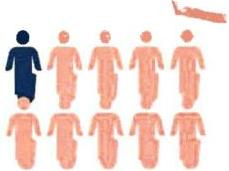

9,8 % del TOTAL DE
ADOLESCENTES
EN CONTROL DE
SALUD INTEGRAL
PERTENECE A
PUEBLOS INDÍGENAS

# **SEXO**

EL 60,9% DE ELLAS SON
MUJERES, MIENTRAS QUE
EL 39,1% SON HOMBRES

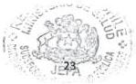

Fuente: Elaboración propia. Basado en REM P09, DEIS. MINSAL.2019

“Muchos de los centros de salud tienen la etiqueta de ser interculturales, pero a pesar de eso no ofrecen otra opción. ¿Qué se hace cuando un adolescente está pasando por algo complicado? Inmediatamente al psicólogo y no entregan otra alternativa. O un simple dolor de cabeza, y lo digo en base a mi experiencia. Yo fui muchas veces al doctor y a los exámenes y ninguno me mencionó que podía ir a una lawentuchefe o a la machi. Tuve que pasar personalmente muchas cosas, estar interna y hospitalizada y en ningún momento ningún profesional de la salud me preguntó si quería complementar mi atención con otra opción. Entonces si vamos a hablar que el hospital o CESFAM son interculturales, o si quieren poner letreros en mapudungun en las entradas o en los baños, pero muchas veces eso no es suficiente y se invisibilizan las opciones reales de interculturalidad”.

**AYELEN GONZALEZ CALFUAL (17 años).**

**Mapuche.**

**Ñancul, Región de los Ríos.**

### 3.2. Adolescentes y jóvenes migrantes internacionales y/o refugiados.

El panorama actual de las migraciones y los procesos de movilidad humana, significa un gran desafío para la salud pública de los países receptores. Lo anterior, debido a que un grupo importante de persona migrantes internacionales, migran en condiciones de vulnerabilidad y expuesta a mayores riesgos, impactando de manera directa o indirecta en sus resultados de salud, experimentando una mayor situación de vulnerabilidad social los niños, niñas, adolescentes y mujeres (62).

#### Sociodemográfico

En las últimas décadas, Chile se ha enfrentado al desafío de constituirse en país receptor de población migrante internacional, proveniente principalmente de países de América Latina. A diciembre del año 2018 se estimaba que el número de inmigrantes en Chile representaba el 6,6% de la población del país, siendo Venezuela, Perú, Haití y Colombia las principales nacionalidades de proveniencia (63) (64). Mientras que según datos oficiales del Censo 2017, del total de población adolescente del país (entre 10 y 19 años), un 3% corresponde a nacidos fuera del territorio nacional (80), grupo que es relativamente desconocido en términos de investigación y políticas públicas (17).

Ya para el año 2021, el INE, a través de su documento “Estimación de personas extranjeras residentes habituales en Chile al 31 de diciembre de 2020 Distribución regional y comunal” (65), estima que existen 1.462.103, concentrándose la mayoría de ellas en la Región Metropolitana, en donde residen 905.681 personas, equivalente a 61,9% del total país. Le siguen las regiones de Antofagasta, en donde se concentra el 7,0% (101.979 personas); Valparaíso, con el 6,6% del total (96.750 personas), y la Región de Tarapacá, con un 4,7% (69.358 personas).

24
**Tabla N° 7.** Distribución de la población extranjera según región de residencia habitual, estimada años 2018,2019,2020³.

|  Región | 2018 |   | 2019 |   | 2020  |   |
| --- | --- | --- | --- | --- | --- | --- |
|  Total país | 1.301.381 | 100 | 1.450.333 | 100 | 1.462.103 | 100  |
|  Arica y Parinacota | 25.675 | 2,0 | 27.890 | 1,9 | 30.087 | 2,1  |
|  Tarapacá | 62.881 | 4,8 | 68.272 | 4,7 | 69.358 | 4,7  |
|  Antofagasta | 91.856 | 7,1 | 100.814 | 7,0 | 101.979 | 7,0  |
|  Atacama | 16.194 | 1,2 | 18.950 | 1,3 | 19.011 | 1,3  |
|  Coquimbo | 30.891 | 2,4 | 34.281 | 2,4 | 34.051 | 2,3  |
|  Valparaíso | 85.583 | 6,6 | 97.683 | 6,7 | 96.750 | 6,6  |
|  Metropolitana | 814.534 | 62,6 | 899.249 | 62,0 | 905.681 | 61,9  |
|  O'Higgins | 38.194 | 2,9 | 43.585 | 3,0 | 43.029 | 2,9  |
|  Maule | 36.379 | 2,8 | 41.036 | 2,8 | 40.718 | 2,8  |
|  Ñuble | 10.457 | 0,8 | 11.472 | 0,8 | 11.178 | 0,8  |
|  Biobío | 28.214 | 2,2 | 35.036 | 2,4 | 34.935 | 2,4  |
|  La Araucanía | 18.761 | 1,4 | 21.295 | 1,5 | 21.266 | 1,5  |
|  Los Ríos | 7.148 | 0,5 | 8.168 | 0,6 | 8.123 | 0,6  |
|  Los Lagos | 21.957 | 1,7 | 26.736 | 1,8 | 26.890 | 1,8  |
|  Aysén | 3.398 | 0,3 | 3.856 | 0,3 | 3.899 | 0,3  |
|  Magallanes | 8.015 | 0,6 | 9.963 | 0,7 | 10.026 | 0,7  |
|  Región ignorada | 1.244 | 0,1 | 2.047 | 0,1 | 5.122 | 0,4  |

Fuente: INE-DEM, 2020.

Mientras que, a nivel comunal, al 31 de diciembre de 2020, un total de 42 comunas del país superaron las 10.000 personas extranjeras residentes, las cuales sumaron en conjunto 1.126.030 personas, representando 77,0% del total. De ellas, Santiago es la comuna con mayor cantidad de personas extranjeras, con 220.283. En segundo lugar, se consolida Antofagasta, con 61.651 personas, y luego Independencia, con 57.616 personas.

**Gráfico N°4.** Distribución regional de la población extranjera según país, estimada al 31 de diciembre de 2020 (porcentaje sobre el total de población extranjera regional).

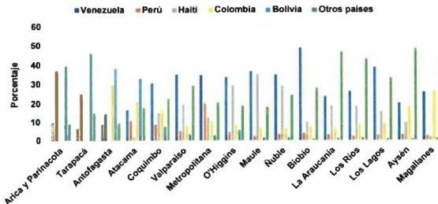

Fuente: INE-DEM, 2020.

³ Nota: las sumas de las cifras porcentuales podrían no sumar 100% debido al redondeo de decimales.

Tabla N°8. Composición por grupos etarios y sexo de población migrante en Chile al año 2020.

|   | N |   |   |
| --- | --- | --- | --- |
|  Edad | Hombre | Mujer | Total  |
|  Total | 744.815 | 717.288 | 1.462.103  |
|  0 a 4 | 9.724 | 9.365 | 19.089  |
|  5 a 9 | 31.385 | 31.014 | 62.399  |
|  10 a 14 | 30.683 | 30.197 | 60.880  |
|  15 a 19 | 28.376 | 28.031 | 56.407  |
|  20 a 24 | 68.032 | 64.127 | 132.159  |
|  25 a 29 | 128.465 | 117.828 | 246.293  |
|  30 a 34 | 139.519 | 120.983 | 260.502  |
|  35 a 39 | 104.671 | 90.767 | 195.438  |
|  40 a 44 | 74.426 | 71.037 | 145.463  |
|  45 a 49 | 46.796 | 48.948 | 95.744  |
|  50 a 54 | 30.416 | 35.978 | 66.394  |
|  55 a 59 | 20.038 | 25.954 | 45.992  |
|  60 a 64 | 12.078 | 16.816 | 28.894  |
|  65 a 69 | 7.463 | 10.615 | 18.078  |
|  70 a 74 | 4.656 | 5.794 | 10.450  |
|  75 a 79 | 2.966 | 3.504 | 6.470  |
|  80 o más | 5.121 | 6.330 | 11.451  |

Fuente: Estimación Población Inmigrante, INE-DEM 2020.

La distribución etaria de la población extranjera en el país en 2020 mantiene una estructura similar a las observadas en las estimaciones anteriores, con la mayoría de la población dentro del grupo potencialmente activo en términos de participación en el mercado laboral (entre los 15 a 64 años). En el año 2020, aproximadamente la mitad (48,0%) de las personas extranjeras tienen entre 25 a 39 años, mientras que los mayores porcentajes se concentran en el grupo quinquenal entre 30 a 34 años (17,8%) y en el grupo de 25 a 29 años (16,8%) (Tabla N° 8).

Por su parte, el estudio "Casen y Migración: Una caracterización de la pobreza, el trabajo y la seguridad social en la población migrante" (66), elaborado por el Área de Estudios del Servicio Jesuita a Migrantes a partir de los datos de la Encuesta Casen 2021, profundiza en la caracterización de este segmento y las posibles causas de su compleja situación, alertando que entre la población migrante internacional hay grupos aún más vulnerables ante la pobreza, que son los NNA, donde un 26%, es decir, uno de cada cuatro, se encontraba en situación de pobreza en el 2020, especialmente en la zona norte del país. El informe también señala que el 15% de los NNA nacidos en Chile está bajo la línea de pobreza, pero dentro de este grupo, cuando un NNA que nace en el país tiene al menos uno de los padres migrantes, la cifra es de 22% debajo de la línea de pobreza.

26
Sumado a lo anterior, el informe plantea que el mayor aumento de las tasas de pobreza en la población migrante internacional, en comparación a la población chilena, entre 2017 y 2020, se debe principalmente a un tema carencia en el acceso a seguridad y servicios sociales (66).

# Salud

Como panorama general, la estimación de FONASA a diciembre del año 2020, es de 1.081.819 personas extranjeras beneficiarias, lo que equivale al 7,14% del total de beneficiarios del sistema. Siendo una pequeña proporción, su estructura demográfica es bastante diferente a la población general en donde las personas en edad económicamente activa representan el 89,4% del total de su población (el grupo etario más numeroso es el de 30-34 años), los menores de 15 años un 8,7% y los adultos mayores de 65 años y más, un 3,2%. Contrastando la relación por sexo, ambas poblaciones se distribuyen de igual forma, en donde el 46,9% de la población total de FONASA son hombres y el 53,1% son mujeres, muy similar a la población migrante internacional, en donde el 46,7% son hombres y el 53,3% son mujeres (gráfico 5).

Gráfico N°5. Estructura población migrante internacional beneficiaria FONASA, por sexo y tramo etario.

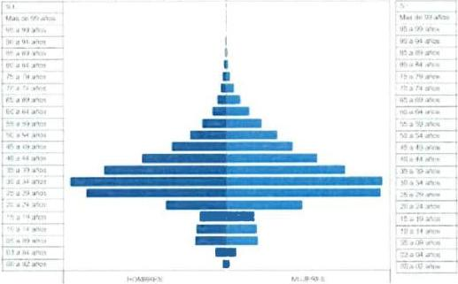

Fuente: https://www.fonasa.cl/sites/fonasa/datos-abiertos/tablero-beneficiario.

De esta población beneficiaria extranjera, el grupo comprendido entre los 10 y los 19 años, corresponde a un total de 72.323 personas, correspondiente a un 6,6% del total (gráfico 5).

En cuanto a los Tramos, y al contrario de lo que pudiera pensarse, el mayor porcentaje de beneficiarios extranjeros se encuentra en el Tramo B (30,94%), seguido por el D (25,05%), siendo el último lugar el Tramo A. Lo cual rompe la percepción generalizada de que la mayor parte de la

población migrante ingresa a través del Tramo A, destinado a personas carentes de recursos y personas migrantes.

Tabla N° 9. Porcentajes de extranjeros y nacionales, por tramo FONASA

|  TRAMO | A | B | C | D  |
| --- | --- | --- | --- | --- |
|  Extranjeros | 19,81% | 30,94% | 24,20% | 25,05%  |
|  Nacionales | 20,58% | 39,73% | 15,85% | 23,84%  |

Fuente: FONASA

Respecto a la distribución de beneficiarios FONASA extranjeros 10 a 19 años, por Servicio de Salud, podemos visualizar, según el gráfico N°6, que la mayor cantidad de adolescentes migrantes beneficiarios se encuentran en el Servicios Metropolitano Central (16,4%), seguido del Servicio Metropolitano Norte (13,6%), del Servicios de Salud de Antofagasta (12,4%), del Servicio Metropolitano Sur (7,8%) y del Servicio de Iquique (7%).

Gráfico N°6. Distribución beneficiarios Fonasa extranjeros 10 a 19 años, por Servicio de Salud.

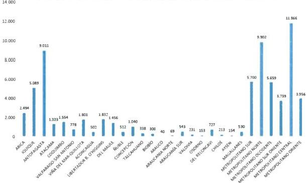

Fuente: FONASA

Respecto a los Registros Estadísticos Mensuales (REM) del Ministerio de Salud, en 2019, se registró una población total de 263.256 adolescentes en control, de los cuales 9.301 refirieron ser migrantes internacionales (3,5%). La tabla 10, además muestra la distribución absoluta según estado nutricional, en cada variable. El gráfico N° 7 muestra la distribución porcentual según estado nutricional.

28
Tabla N°10. Población bajo control, salud integral de adolescentes, según estado nutricional, por calidad de migrante internacional. 2019.

|  TOTAL, ADOLESCENTES EN CONTROL  |   |   |
| --- | --- | --- |
|  INDICADOR IMC / EDAD | Total, PBC | Total, Inmigrantes  |
|   |  263.256 | 9.301  |
|  Obesidad Severa | 9.204 | 194  |
|  Obesidad | 46.403 | 1.058  |
|  Sobrepeso | 67.450 | 1.980  |
|  Peso normal | 116.295 | 5.119  |
|  Bajo peso | 12.097 | 713  |
|  Desnutrición | 1.855 | 141  |

Fuente: REM P09, DEIS. MINSAL.2019

Gráfico N° 7. Población bajo control, salud integral de adolescentes, según estado nutricional y variable migrante internacional. 2019.

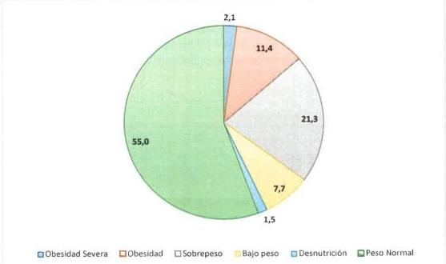

Fuente: REM P09, DEIS. MINSAL.2019

A través de la realización del Control de Salud Integral, es posible detectar o pesquisar algunos riesgos, que presenta cada adolescente al momento de la consulta, registrados en el instrumento para este fin (ficha CLAP para el Control de Salud Adolescente) (61). Según tabla 11, en 2019, un total de 6.429 adolescentes migrantes internacionales presentaban algún riesgo detectado, y de ellos, el principal fue en el área nutricional, al igual que en el caso anterior de población adolescente de pueblos indígenas, seguido por el riesgo en salud sexual – reproductiva, centrado en mujeres adolescentes y “otro riesgo”, por ejemplo, social.
Tabla N° 11. Población en control salud integral de adolescentes, según áreas de riesgo, por calidad de migrantes internacionales. 2019.

|  Áreas de Riesgo | Total, adolescentes 10 a 19 años | Adolescentes migrantes  |   |   |   |   |   |
| --- | --- | --- | --- | --- | --- | --- | --- |
|   |   |  Total |   | Hombres |   | Mujeres  |   |
|   |   |  N | % | N | % | N | %  |
|  Salud sexual y reproductiva | 38.190 | 1.479 | 3,8 | 593 | 40 | 886 | 60  |
|  Ideación suicida | 7.075 | 253 | 3,5 | 64 | 25 | 189 | 75  |
|  Intento suicida | 2.644 | 91 | 3,4 | 16 | 17,5 | 75 | 82,5  |
|  Consumo alcohol y drogas | 17.303 | 405 | 2,3 | 188 | 46,4 | 217 | 53,6  |
|  Nutricional | 101.462 | 2.753 | 2,7 | 1.257 | 45,6 | 1.496 | 54,4  |
|  Otro riesgo | 31.957 | 1.448 | 4,5 | 676 | 46,7 | 772 | 53,3  |
|  TOTAL | 198.631 | 6.429 | 3,2 | 2.794 | 43,4 | 3.635 | 56,6  |

Fuente: REM P09, DEIS. MINSAL.2019

Es posible ver que del 3,2% de adolescentes migrantes internacionales en control de salud integral, las mujeres presentan proporcionalmente mayor riesgo que los hombres en las distintas áreas, especialmente en ideación e intento suicida, en donde la proporción de mujeres es muchísimo mayor, concordante con lo visto anteriormente en adolescentes de pueblos originarios (a pesar de que la proporción de mujeres para ideación e intento suicida es mucho mayor en adolescentes migrantes). No obstante, en el consumo de alcohol y drogas y riesgo nutricional, estas diferencias son menos evidentes, equiparándose en ambos sexos (tabla N° 11). Además, es posible visualizar en este grupo una mayor proporción de mujeres adolescentes en control de salud integral (56 %), en comparación a los hombres (43 %).

Figura N° 3. Población en control salud integral de adolescentes, por calidad migrante internacional y sexo. 2019.

3,2 % del TOTAL DE ADOLESCENTES EN CONTROL DE SALUD INTEGRAL SON MIGRANTES

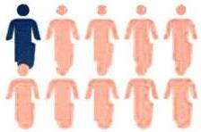

# SEXO

EL 56% DE ELLAS SON MUJERES, MIENTRAS QUE EL 43% SON HOMBRES

Fuente: Elaboración propia. Basado en REM P09, DEIS. MINSAL.2019

30
"Como lleva acá 1 año y ocho meses, y me dio alegría el año pasado y aún no tengo FONASA ni nada. Mi mamá intentó sacar papeles y la cosa es que se los rechazaron y todavía no tengo salud ni puedo ser atendida (G3M1).

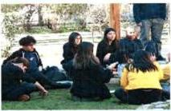

"Puedes tener una enfermedad y ni siquiera darte cuenta. Y puede ir progresando hasta que tienes que ir, pero no te atienden porque simplemente no tienes papeles. Puedes estar muriéndote y no pasa nada" (G3H).⁴

Respecto a adolescentes migrantes, se documentan una serie de problemáticas que los exponen a riesgos en salud (16). Por ejemplo, suelen insertarse en el país receptor a través de las escuelas, donde se ha documentado situaciones de discriminación e inadaptabilidad (67) (68), así como experiencias traumáticas de adolescentes en zonas fronterizas (69). De acuerdo a Obach, Sirlopu y Urrutia (70), en las escuelas se develan discursos que generan segregación y jerarquización social de estudiantes migrantes al interior de las escuelas, lo que se asocia con relaciones de dominación específicas que reproducen una hegemonía de lo "blanco", generando una subalternidad del otro a través de la significación de sus cuerpos. Pero también otros estudios documentan que los y las adolescentes pueden ser articuladores lingüísticos y culturales para sus familias y comunidades con la sociedad receptora, con posibles cargas asociadas a estas tareas (71).

En cuanto al acceso y el uso del sistema de salud, si bien en Chile se han desplegado importantes acciones para la población migrante internacional (38), aún se evidencia el incumplimiento del pleno derecho a la salud de esta población y, en particular, de NNA migrantes y/o refugiados (72). Se identifican barreras de acceso y uso del sistema de salud hacia adolescentes migrantes, algunas de las cuales son estructurales y compartidas con la población nacional (73), mientras que otras son específicas para este grupo. Entre ellas las barreras idiomáticas (74), de acceso a salud mental (75), barreras administrativas (por ejemplo, falta de documentación) (76), de acceso a la información (77), y de acceso a la salud sexual y reproductiva (78).

"Porque he ido a veces con mi hermana que está embarazada y una vez le tocó una mujer súper pesada que la trataba súper mal. Pero al día siguiente nos tocó una mujer súper amable, alegre" (G4M).

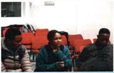

"Puede ser que sea como un problema de discriminación. Dependiendo tal vez del país que uno venga, te pueden discriminar o no. Tal vez las mismas personas que atienden en salud, a veces pasa que por ser personas extranjeras las discriminan o no las atienden bien (G3H).⁵

⁴ Entrevistas realizadas a estudiantes migrantes en el contexto de la "Primera Jornada Participativa con adolescentes y jóvenes migrantes internacionales, desarrollada por el Programa Nacional de Salud Integral de Adolescentes y Jóvenes el año 2019". Para efectos de utilización de estas cuñas, se ha solicitado mantener la identidad de dichos adolescentes en reserva. No obstante, el uso de imágenes generales se encuentra autorizado.

⁵ Ídem.

31
Cuadro N°1: Resumen de barreras enfrentadas por migrantes en el acceso al sistema de salud.

|  Nº | Barrera  |
| --- | --- |
|  1 | Barreras idiomática  |
|  2 | Barreras de acceso a salud mental  |
|  3 | Falta de documentación como barrera  |
|  4 | Barreras de acceso a información  |
|  5 | Barreras de acceso a salud sexual y reproductiva  |
|  6 | Barreras de prevención y tratamiento de VIH  |
|  7 | Barreras vinculadas a prejuicio y/o discriminación por apariencia  |
|  8 | Barreras relacionadas a las normas culturales  |
|  9 | Barreras de acceso a salud dental  |

Fuente: MINSAL, 2018 (79); Obach, A., Hasen, F., Cabieses, B., D'Angelo, C., & Santander, S. (2020) (4).

A fin de derribar las barreras levantadas producto de la vulnerabilidad y la discriminación, es fundamental que los equipos de salud reciban formación para trabajar con adolescentes y jóvenes desde la sensibilidad y respecto.

En el contexto de Chile, la relevancia que ha tenido desde el año 2008 la estrategia de Espacios Amigables para adolescentes, como un Programa de Reforzamiento de la Atención Primaria (Res. Ex. N° 597 del 28 de agosto del 2008), en base a recomendaciones técnicas propuestas por agencias internacionales tales como la OPS, la OMS y UNFPA (80) (81); ha permitido abordar las dificultades de acceso de la población adolescente, otorgando una atención más adecuada, pertinente y de calidad para este grupo, basado en la evidencia existente (73) (22). Por tanto, se debe aprovechar el hecho de que los servicios amigables para adolescentes son una ayuda fundamental para vencer el estigma y la discriminación como barrera para el acceso a la atención, y el respeto a la diversidad por parte de los y las profesionales de la salud es un elemento clave para que se lleve a cabo esta transformación (82).

En la Orientación Técnica para la Atención Primaria de Salud sobre Servicios de Salud integrales, amigables y de calidad para adolescentes del año 2018 (83), se incorpora un capítulo con recomendaciones para hacer más inclusivos estos servicios para adolescentes LGTBIQ+, de pueblos originarios, migrantes internacionales y con discapacidad, estableciendo que el respeto y la consideración de la cosmovisión de los pueblos, sus sistemas de salud y sus conceptos de salud y enfermedad, deben incorporarse en el diseño de las políticas públicas y que la incorporación de un enfoque intercultural en salud, sólo tiene significación, en la medida que los equipos de salud reconocen la existencia y visibilizan en el modelo de atención, los aportes de las culturas que coexisten en un territorio determinado, establecido lo anterior también en la Política de Salud y Pueblos Indígenas (14) y en la Norma General Administrativa N° 16 sobre interculturalidad en los servicios de salud (84).

32
# CAPÍTULO IV: REQUISITOS GENERALES PARA LA ATENCIÓN DE SALUD DE ADOLESCENTES CON PERTINENCIA CULTURAL.

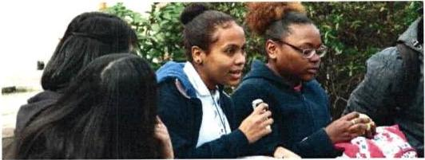

Fuente: Elaboración propia. Primera Jornada Participativa con adolescentes y jóvenes migrantes internacionales, desarrollada por el Programa Nacional de Salud Integral de Adolescentes y Jóvenes el año 2019.

En vista de los antecedentes entregados en apartados anteriores, es necesario ampliar la mirada y entender que la interculturalidad requiere del involucramiento de todos y todas, también desde una mirada interdisciplinaria, especialmente de los equipos del área de la salud. Este involucramiento comprende las competencias para establecer una relación donde todos y todas aportan a la construcción de relaciones respetuosas, y donde cada profesional de salud se transforma en un sujeto de aprendizaje frente a otras concepciones de salud, enfermedad, autocuidado y procesos de atención, con el fin de incorporar estos conocimientos en la práctica clínica integral.

La pertinencia cultural requiere, sin lugar a dudas, un cambio en las formas clásicas de trabajo institucional del sector salud, lo que implica debatir en torno al modelo de salud convencional desde el cual se ejerce la práctica clínica, trascendiendo el paradigma biomédico y reconociendo que existen otros sistemas de salud, otros modelos de conocimientos y un conjunto de formas de entender y resolver los problemas de salud (37) que son necesarios de incorporar en la relación que se establecen con los usuarios y usuarias.

"...tiene que ver a partir de mitos, que llegó más SIDA, llegaron más enfermedades, que son puros prejuicios, puras tonteras a partir de correr la voz... Pero yo creo que hay prejuicios y estigmas todavía, que tienen que ver con la cultura y la mala información que están instaladas. Y de los adultos, los profes, no tanto los estudiantes" (G6M)⁶.

⁶ Entrevistas realizadas a estudiantes migrantes en el contexto de la "Primera Jornada Participativa con adolescentes y jóvenes migrantes internacionales, desarrollada por el Programa Nacional de Salud Integral de Adolescentes y Jóvenes el año 2019". Para efectos de utilización de estas cuñas, se ha solicitado mantener la identidad de dichos adolescentes en reserva. No obstante, el uso de imágenes generales se encuentra autorizado.

33
En este sentido, algunas características y/o prácticas simples que se deben tener en cuenta al momento de realizar una atención de salud con adolescentes y jóvenes desde un punto de vista de pertinencia cultural son:

a) El personal de salud registra la variable de pertenencia a pueblos originarios, nacionalidad y/o país de origen:

> Registro del número de la variable de pertenencia a pueblo originario y/o nacionalidad, según normatividad vigente (85) 7.
> Se identifica en el/la usuario/a el uso/manejo de la lengua o idioma de origen o del País receptor, para establisher brecha y necessities de traductores o facilitadores en los SS$^{8}$.
> El establishimiento de salute cuenta con reportes de atencion diferenciadas por pueblo originario o migrante internacional, que permite analizar las brechas e identifica las necessities de adolescentes.
> SEREMIS de Salud elaboran y dan a conocer diagnóstico epidemiológico de povlación adolescente a nivel regional, considerando variables de pueblo originario y migrantes internzonales.

b) El lugar de atención cuenta con ambientación pertinente y adecuada en el lugar de atención del adolescente, especialmente en el caso de Servicios de Salud en territorios donde haya presencia de pueblos originarios y/o población migrante internacional:

> La ambientación del lugar de atencion para adolescentes tiene materiales de acuerdo a la cultura local, por exemple: colores, cuadros, lengua, imagenes o signalética en idioma local, dibujos que representen el mensaje que se quiera transmitir, entreOthers.
> Adolescentes participan en la adecuacion de espacios de atencion destinados a ellos/as.

⁷ En el caso de Chile, la respuesta podrá ser cualquiera de los pueblos indígenas u originarios codificados al momento de la atención de salud y presentes en la legislación nacional, pero incorporando la opción "otro", dando la posibilidad de autodefinición, especialmente en el caso de algunas identidades territoriales específicas (pueblo mapuche) y de población migrante internacional que también puede pertenecer a algún pueblo originario.

⁸ Los roles y funciones de los/as facilitadores interculturales están definidos en la Política de Salud y Pueblos Indígenas y han sido también definidos por el Programa PESPI. Son roles y funciones de carácter general para otorgar pertinencia cultural en el sistema de salud.

34
El horario de atencion se ha definido segun la disponibiliad de los y las adolescentes y tomando en consideracion las realidades territoriales (conectividad, accesibilitad, entre others).
> Definir diseño de espacio de atencion amigable culturalmente pertinente para adolescentes indigenas y/o migrantes, segun realizad de cada territorio y centro de salute. Dicho diseño deberia resultar del trabajo Conjunto con adolescentes que se atienden en dicho lugar, a trovés de estrategias participativas, puis es dificil establecer un estandar de referencia especialico para determinar que una ambientacion es mas o menos pertinente, segun la realizad de cada territorio, haciendose dificil evaluar desde un estandar nacional.

c) Los equipos de salud que atienden a adolescentes tienen conocimiento y competencias sobre salud intercultural.

El plan de capacitacion del Servicios de Salud y/o establishimiento de salute (CESFAM, Espacio Amigable, etc.), incluye la salute intercultural como parte de su programacion.
> La totalidad de profesionales está capacitado/a en salute intercultural, abordando contentsos basics como:

Cuidado de la salute (SSR y mental) desde la perspectiva intercultural (indigena/migrantes).
- No discriminacion e integridad de las personas.
Derecho al acceso a la atencion de salute.
- Marco conceptual, contextual y metodologico Basics sobre la interculturalidad en salute.
- Rol de differentes factores sociales y culturales en la capacité de individuos y comunidades deatar la enfermedad y asegurar su salute.
- Valoración de elementos de la medicina tradicional.
- Reconocimiento de actitudes y valores éticos, como la aperture y respeto a la diversidad cultural, entreOthers.
- Normativas sectoriales que respaldan el trabajo en salute intercultural.

➤ Tener disponibilidad de contactos y/o trabajo conjunto con agentes de salud tradicional pertenecientes a cada territorio y/o cultura, (por ejemplo, yatíris en la cultura aymara o machi en el caso de la cultura mapuche). A través de este contacto, se pueden generar instancias de transferencia de conocimiento o diálogo de saberes.

A propósito de las fichas de evidencia presentadas en los anexos de este documento, los resultados de esta revisión de literatura científica y evidencia internacional en torno a la temática de salud de adolescentes y jóvenes e interculturalidad ⁹, establece que:

⁹ La metodología de revisión de literatura para búsqueda de evidencia, se especifica en el Anexo II.

35
El desarrollo de identidades étnicas positivas y la creación de sistemas de apoyo familiar cercanos pueden transformarse en factores protectores de la salud de adolescentes y jóvenes, por tanto, se torna clave identificar y favorecer en los procesos de atención y promoción de la salud, a la familia y red comunitaria como factores protectores.
En este mismo contexto, la evidencia recomienda generar intervenciones que consideren la naturaleza multinivel e interseccional en torno a los desafíos, por ejemplo, de la salud sexual y reproductiva, pues queda en evidencia que, en contextos interculturales, algunas barreras para abordar estos temas son el idioma, la religión, el acceso a atención médica y la incomodidad de las adolescentes en las conversaciones con los/as profesionales de salud, muchas veces por no encontrar una empatía frente a aspectos culturales (revisar fichas de evidencia en Anexo 1).

e) El equipo de salud elabora y utiliza materiales educativos de acuerdo a la realidad local, con la participación de los y las adolescentes. Además, fomenta la valoración cultural realizando actividades educativas y recreativas en la misma comunidad.

Los materiales impresos (dípticos, afiches, etc.) y/o audiovisuales (vídeos, spots) relacionadas, por ejemplo, al Control de Salud y otras prestaciones, tienen imágenes culturalmente adecuadas y mensajes con pertinencia cultural, lenguaje de fácil comprensión, evitando uso de tecnicismos. Por otro lado, incorporar el idioma o lengua, ya sea de pueblos originarios y/o de población migrante internacional, de acuerdo a la realidad lingüística de estos grupos.

f) Los y las profesionales de salud desarrollan actitudes, conocimientos y habilidades necesarias para el abordaje de salud con pertinencia cultural.

Todos los servicios que se prestan a adolescentes y las competencias asociadas deben estar guiados por el respeto de los principios de derechos humanos de equidad, participación efectiva, inclusión y no discriminación. De esta forma, podemos encontrar una serie de acciones generales que son un componente fundamental en la atención de salud con pertinencia cultural.

Tratar a cada adolescente con pleno respeto de sus derechos humanos y sin discriminación. Considerar en la atención de adolescentes y sus acompañantes, la importancia del respeto a su cosmovisión y sistema de salud propio.
Mostrar respeto por las elecciones de cada adolescente, así como por su derecho a consentir o rechazar un examen físico, una prueba o una intervención, en base a justificaciones culturales y/o espirituales. Posteriormente conversar, de acuerdo a edad y en consideración a su autonomía progresiva, estas implicancias con su padre, madre y/o adulto acompañante y discutir con el equipo de salud.

36
> Respetar y validar la concepcion propia de enfermedad derivada de su propia cosmovacion y sistemas de salute, en todo el proceso terapeutico.
> Respetar si el o la adolescente ha recibido algo ntramento por un especialista / sanador de pueblos originarios10 en el caso de povlacion indigena. Respetar las solicitudes de derivacion de cada adolescente con los especialistas / sanadores de pueblos originarios en sus territorios11.
> Respetar los ciclos de vida de acuerdo a su propia cultura, sin imponer visiones biomédicas de lo que debe cumplir como requisito para cada etapa.
> El centro de atencion de salute cuenta con protocolos de atencion y derivacion con pertinencia cultural para adolescentes pertenecientes a pueblos originarios, migrantes internaciones y refugiados.

En este sentido, existen experiencias exitosas, como por ejemplo el Protocolo "Red de atención del programa salud mapuche con el intersector del CESFAM Mariquina con enfoque familiar integral e intercultural", desarrollado en la Región de los Ríos en el año 2016, la cual buscó definir un sistema de referencia y contrarreferencia para la atención primaria en salud, a través de orientaciones técnicas para una derivación pertinente y oportuna, optimizando el uso de recursos técnicos, con el fin de proveer una atención atingente a las necesidades de los/as usuarios/as con necesidades de medicina tradicional mapuche, además de crear e implementar un manual de funciones de la agente de salud mapuche y asesora intercultural (86).

En el caso de adolescentes migrantes internacionales y/o refugiados, es necesario que cada centro de salud establezca un mecanismo de evaluación del interés superior de cada adolescente (acompañado o no acompañado), que permita tomar decisiones fundamentadas en dicho interés e identificar perfiles diferenciados. Esto permitirá que los/as profesionales de salud puedan o logren detectar y atender las necesidades específicas de cada adolescente, y de ser necesario, brindar el acceso a sus derechos mediante la canalización a las entidades y organismos competentes y mandatados por ley a atender a este grupo de manera integral (coordinación intersectorial a nivel local) (87) (88).

> Valorar positivamente la capacidad de entablar relaciones de colaboración con adolescentes, adultos responsables y las organizaciones de la comunidad, para garantizar a los y las adolescentes servicios de atención de calidad (especialmente a través de estrategias de participación e involucramiento de adolescentes en la gobernanza de los servicios de salud.)

¹⁰ Así se encuentra conceptualizado en el REM A04 sección G.

¹¹ Así se encuentra conceptualizado en el REM A04 sección G.

37
> Tratar a cada adolescente como personas con necessities y preocupaciones propias y espécificas, según cadacontexto socioeconomico, cultural y territorial, con niveles de madurez, conocimientos sobre la salute y una comprensión de sus derechos diferenciados según cada una de sus realidades o circunstancias sociales (escolarización, grupo familiar, migración, entre others).
> Establisher relacion simétrica y fácilar un vinculo terapéutico, bajo en la empatía, confianza, communicator no directiva y escucha activa.
> Ofrecer servicios que resguarden la confidencialidad, respetando la privacidad bajo de los limites existecidos ante situaciones de riesgo de cada adolescente.
> Generar y/o fortalecer mecanismos de informacion sobre el systema de salute orientado a povlacion adolescente migrante internacionl y/o de pueblos originarios, enonde se comunique en un lenguaje simple, claro y con pertinencia al idioma o lengua, los requisitos y pasos para la inscripction en los centros de salute y para acceder a las prestaciones de salute.
> Demostrar conocimiento de las actitudes, valores y prejuicios propios que pueda obstaculizar la posibiliad de prestar a los y las adolescentes una atencion confidencial, no discriminatoria, exenta de juicios de valor y respetuosa con las diferencias socioculturales.
> Respetar el rol que pueda tener cada adolescente al interior de sus propias familias, comunidad y territorio, de acuerdo a su cultura, religion y/o pais de origen.
> Incorporar un enfoque de genero, dando cabida a una atencion de salute intercultural a adolescentes y jóvenes de pueblos originarios y migrantes LGBTQI+. El enfoque de genero desde una mirada intercultural, implica que los equipos de salute incorporen en su quehacer los mandatos de genero de cada cultura, incorporando, ademas, los significados y concepciones que tiene cada nacionalidad o pueblo originario respecto de la diversidad de genero desde un enfoque también de masculinidades, tan importante en la atencion de salute de adolescentes.
> Fortalecer la formación continua a equipos de salute, en aspectos como la promoción de la buena convivencia y trato a adolescentes migrantes internzonales y/o de pueblos originarios desde el sector salute, a trovés de estrategias de capacitación.
> Fortalecer actiones de sensibilización y formación a los equipos de salute relacionados con necessities y pertinencias espécificas de adolescentes migrantes internzonales y/o de pueblos originarios.

38
> Fortalecer la promoción y prevención en salud mental al interior de los establecimientos educacionales, facilitando los mecanismos de derivación a especialistas de salud mental en adolescentes migrantes internacionales y/o de pueblos originarios. En el caso de pueblos originarios, esto implicaría incorporar mecanismos de discernimiento para una derivación complementaria hacia sus sistemas de salud,
> Fortalecer el trabajo intersectorial entre salud y educación, para la promoción y prevención de problemas de salud mental en adolescentes indígenas, migrantes internacionales y refugiados.
> Alinear recomendaciones médicas con las prácticas culturales y/o creencias, por ejemplo, en cuanto a la alimentación, considerando y relevando la dimensión cultural de la comida para comprender la adherencia o falta de adherencia a ciertas dietas.

La International Society for Social Pediatrics and Child Health (89), ha planteado que para que un encuentro clínico sea exitoso y de calidad, debe existir comunicación entre NNA, su adulto responsable y el equipo de salud. En este contexto, se ha relevado, por ejemplo, el rol de los facilitadores/as o mediadores/as interculturales en el sistema de salud para ayudar a los equipos clínicos a identificar y explicar distintos conceptos y necesidades en salud, lo que influye en un diagnóstico certero, tratamiento pertinente y cuidado de calidad (90), (91), (92), toda vez que se logra desarrollar una atención con una actitud respetuosa, no juzgadora y consciente de los propios prejuicios que impactan en la atención (93).

# CAPÍTULO V: CONSIDERACIONES ESPECÍFICAS PARA LA ATENCIÓN DE SALUD DE ADOLESCENTES MIGRANTES INTERNACIONAL Y/O REFUGIADOS.

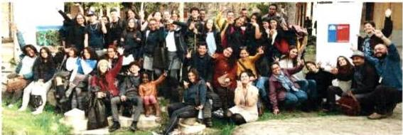

Fuente: Elaboración propia. Primera Jornada Participativa con adolescentes y jóvenes migrantes internacionales, desarrollada por el Programa Nacional de Salud Integral de Adolescentes y Jóvenes el año 2019.

Tal como vimos en el Capítulo III en lo que respecta al acceso y uso del sistema de salud, si bien en Chile se han desplegado importantes acciones basadas en consensos internacionales (38), aún se evidencian una serie de prácticas (72) que impiden el pleno cumplimiento del derecho a la salud de la población migrante en general, y de NNA migrantes en particular. Respecto a estos últimos, se identifican barreras que, en algunos casos, se corresponden con las presentes en la población adolescente nacional (73) (94) y en otras, presentan características particulares tales como barreras idiomáticas (74) (95), de acceso a salud mental (96) (75), falta de documentación y regulación migratoria (76), barreras de acceso a la información (77), y acceso a la SSR (78).

Algunas investigaciones nacionales (97), han demostrado que una mayor proporción de NNA migrantes está fuera del sistema escolar y vive en condiciones de pobreza multidimensional (40% inmigrantes frente a 23,2% chilenos) y que las lesiones y otras causas externas de consulta son la causa más frecuente de hospitalización entre los migrantes (23,6%), versus que la población local (16,7%) con edades comprendidas entre 7 y 14 años. Por lo tanto, abordar las necesidades de los NNA en Chile, independientemente de su estatus migratorio, es un imperativo ético, legal y moral.

Otras investigaciones han demostrado que existen dificultades técnicas y administrativas, además de una percepción de barreras culturales, pues pese a que se han establecido normativas y se han generado estrategias de atención en salud para esta población, en su mayoría no son estables ni conocidas por todos los funcionarios/as de salud. Tampoco son fáciles de implementar en las diversas realidades del sistema de salud. Adicionalmente, los y las funcionarias no necesariamente poseen herramientas que les permitan brindar una atención que sea culturalmente sensible a las necesidades de la comunidad migrante (98), y en ocasiones sus acciones pueden dificultar el acceso al sistema de salud por parte de este grupo de la población.

Por su parte, la ISSOP Migration Working Group (2018) ha declarado que los NNA migrantes son uno de los grupos más vulnerables, incluso después de haber arribado al país receptor donde se

40
asientan. Su salud no sólo depende de las características propias del proceso migratorio, sino también del aislamiento social que podrían experimentar una vez radicados en un nuevo país (89).

En relación al acceso a servicios y al estado de salud de NNA migrantes, se ha descrito que (99):

> Tienen casi el doble de probabilitades de no contar con seguro de salute en comparacion a NNA de familias no migrantes u originarias del pais receptor.
Tienen menos probabilitades de tener controles de salute regulares y de Obtener atencion especializada cuando sea necessario.
> Si nacerion en othero pais, es possible que no hayan recibido evaluaciones de salute o immunizaciones adecuadas.

En este contexto, la atención primaria en salud tiene el potencial de impactar positivamente en la salud de este grupo, no tan sólo facilitando su acceso a servicios de salud (100), sino también asegurando la calidad de los cuidados desde un enfoque de promoción y prevención.

En consideración a lo anterior, el panel de expertos de la Comisión Técnica Migración y Salud (Res. Ex. N° 42 del 12 de agosto 2019), ha recomendado, entre otras cosas, proveer atención de SSR en un ambiente respetuoso, confidencial y seguro, basado en el respeto a la diversidad desde un enfoque intercultural en salud. Al respecto, se ha demostrado que un ambiente de confidencialidad, seguro, pertinente y respetuoso de los derechos y autonomía progresiva de los adolescentes migrantes, mejora su disposición para discutir temas asociados, por ejemplo, a su salud sexual.

# 5.1. Recomendaciones.

Algunas recomendaciones del panel de expertos para la atención de salud integral de adolescentes migrantes internacionales y/o refugiados, son:

# Registro, monitoreo e informes epidemiológicos.

> Durante la realización del Control de Salud u otra prestación, la pregunta por nacionalidad corresponde al conjunto mínimo básico de datos de identificación de la persona, tan clave como la edad, sexo o pertenencia a pueblo originario. Es de carácter universal, lo que significa que debe ser realizada a todo/a adolescente en los establecimientos de salud del territorio nacional. La pregunta debe ser formulada en los términos en que aparece, sin interpretaciones ni modificaciones. Es importante tener el cuidado de mantener un estándar en la forma en cómo se realiza la pregunta, procurando que su formulación respete la estructura de la pregunta.

# Atención de salud integral.

> La atencion de SSR de adolescentes migrantes internaciones también debe considerar enfoque de genero, Derechos Humanos y enfoque territorial, respetando las diversidades al interior de las distinctas colectividades de migrantes.
Asegurar confidencialidad de la atencion, siempre que no exista un riesgo para su salute o vida propia o de terceros.
> Lasactividades educativas,consejerias yotros,debenlevarseacaboen salasqueaseguren privacidadvisualyauditiva.
> Incorporar la discusión de derechos a la salute y protección social, en formatos pertinentes y fáciles de entender.
Es importante en elcontexto de la atencion de salute,considerar la historia de migracion de los y las adolescentes y/o la de sus padres, o la calidad de refugiados de ellos/ellas al momento de realizar valoracion familiar con apoyo de instrumentos como genograma, ecomapa o APGAR familiar, entre others. A trovés de estas actividades, se puee identificar el nivel de aculturacion bajo de la familia o los roles y relaciones con miembrs que se encuentran bajo o fuera del pais (101) (102). Permite,ademas,identificar redes de apoyo para el cuidado de cada adolescente en el hogar o indicar riesgos asociados al desplazamente entre paises y la forma en que este se llevo a cabo (103) (104).

"A mí me pasó que yo estaba con mi mamá, porque mis padres están separados, entonces mi papá se vino hace 5 años con su esposa y en ese momento se vino a establecer. Una vez que se estableció, pude venir yo. Entonces al principio me afectó no estar con él y ahora me afecta no estar con mi mamá. Todavía la extraño, nos comunicamos vía teléfono" (G5H)¹².

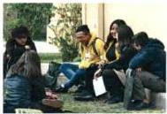

> Los instrumentos que se utilizan en la atención de salud, deben ser sometidos a validación cultural (105) (106), evitando la estandarización de patrones o modelos de desarrollo.

¹² Entrevistas realizadas a estudiantes migrantes en el contexto de la "Primera Jornada Participativa con adolescentes y jóvenes migrantes internacionales, desarrollada por el Programa Nacional de Salud Integral de Adolescentes y Jóvenes el año 2019". Para efectos de utilización de estas cuñas, se ha solicitado mantener la identidad de dichos adolescentes en reserva. No obstante, el uso de imágenes generales se encuentra autorizado.

42
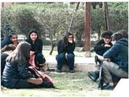

"Hubo un tiempo en que efectivamente costaba harto acercar los temas de reproducción, sexualidad, afectividad en los estudiantes, había cierta distancia. Y desde hace un tiempo se generó el Espacio Amigable, que se implementaba a través de la dirección de salud, y eso implicaba que en algunos establecimientos había un equipo de un psicólogo y una matrona y hacía consultorías ahí. Eso también sirvió porque era espontáneo, y también se generó en Santiago Joven un espacio fijo de este Espacio Amigable. Entonces la verdad es que eso ayudó, por lo menos permitió un poco acercar. Y ahora, claro, se está trabajando temáticas de afectividad bastante dentro de los establecimientos, a través del programa Sexualidad Comunal, entonces como que se ha ido por ahí avanzando un poco plantear el tema y trabajar también desde los varones, no solo como algo centrado solo en la mujer. Ahora, de que falta, falta. Yo no sé si los estudiantes espontáneamente han seguido consultando tanto" (G6M)¹³.

> Conformar equipos de trabajo entre referentes de migración y adolescencia de SEREMIS, Servicios de Salud y a nivel local, para la adecuación de programas y prestaciones dirigidos a adolescentes migrantes internacionales y/o refugiados¹⁴.

# Promoción y prevención de la salud.

> Presentar información a través de redes sociales y en formato póster (Espacios Amigables y Centros de Salud) acerca de deberes y derechos de adolescentes, y con énfasis en la oferta programática, respetando la pertinencia cultural en la forma en la que los mensajes se entregan (por ejemplo, idioma o elementos gráficos), acerca de servicios disponibles, normativas de protección de la confidencialidad de la información, como 'navegar' dentro

¹³ Entrevistas realizadas a estudiantes migrantes en el contexto de la "Primera Jornada Participativa con adolescentes y jóvenes migrantes internacionales, desarrollada por el Programa Nacional de Salud Integral de Adolescentes y Jóvenes el año 2019". Para efectos de utilización de estas cuñas, se ha solicitado mantener la identidad de dichos adolescentes en reserva. No obstante, el uso de imágenes generales se encuentra autorizado.

¹⁴ Los roles y funciones de los/as facilitadores interculturales están definidos en la Política de Salud y Pueblos Indígenas y han sido también definidos por el Programa PESPI. Son roles y funciones de carácter general para otorgar pertinencia cultural en el sistema de salud.

43
del sistema de salud, ubicación de su CESFAM más cercano, acceso a facilitador intercultural en caso de hablar idioma distinto a español, entre otros (107).

> Identificacion de red de apoyo, amistades, cohesion familiar, lideres comunitarios, comunicacion con padre, madre y/o adulto responsable.
> Favorecer la participacion de los/as adolescentes migrantes en la elaboracion de planes locales de salute que considere su vision y temas de interes.

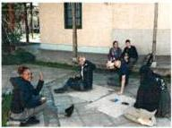

"Nosotros los caribeños somos más comunidad. Entonces puede también venir por esa parte cultural. Vivimos muy en comunidad... eso es una de las cosas por las que también muchos estudiantes entran en depresión. Santiago está como con muchos edificios, y nosotros en nuestra cultura somos más casas, más comunidad y más residencias" (G6M).¹⁵

Para proveer atención de salud en un ambiente culturalmente pertinente, se hace necesario que el grupo de profesionales de la salud sean conscientes no sólo de la etapa del desarrollo y de las necesidades de los y las adolescentes, sino que también sean sensibles a la diversidad cultural, a través de lo cual tendrán mayor posibilidad de establecer relaciones basadas en la confianza con sus usuarios/as, y, por tanto, responder a sus necesidades con mayor efectividad.

¹⁵ Entrevistas realizadas a estudiantes migrantes en el contexto de la "Primera Jornada Participativa con adolescentes y jóvenes migrantes internacionales, desarrollada por el Programa Nacional de Salud Integral de Adolescentes y Jóvenes el año 2019". Para efectos de utilización de estas cuñas, se ha solicitado mantener la identidad de dichos adolescentes en reserva. No obstante, el uso de imágenes generales se encuentra autorizado.

44
Cuadro 2: Resumen de tipos de barreras enfrentadas por migrantes internacionales en el acceso al sistema de salud y recomendaciones para cada una.

|  Nº | Barrera | Recomendaciones  |
| --- | --- | --- |
|  1 | Barreras idiomática | - Disponibilidad de facilitadores o mediadores interculturales para la atención en salud. - Capacitaciones y cursos de sensibilización para el personal de salud y los/as mediadores/as o facilitadores.  |
|  2 | Barreras de acceso a salud mental | - Difusión de información dirigida a adolescentes sobre la disponibilidad y acceso de salud mental. - Estrategias de intervención focalizadas en los espacios escolares con el objetivo de facilitar el acceso. - Asegurar confidencialidad y respeto en la atención.  |
|  3 | Falta de documentación como barrera | - Difusión de información sobre el derecho de acceso a salud para personas migrantes internacionales. - Reducción de barreras burocráticas y tiempo de procesamiento para la incorporación al sistema de salud.  |
|  4 | Barreras de acceso a información | - Campañas de difusión de información focalizada a población adolescente migrante internacionales. Principal énfasis en establecimientos educacionales. - Información disponible en múltiples idiomas o lenguas.  |
|  5 | Barreras de acceso a salud sexual y reproductiva | - Trato confidencial y privado en la atención de necesidades de salud sexual y reproductiva. - Disminución de los tiempos de espera y las barreras burocráticas en la atención. - Capacitaciones al personal de salud para trabajar con población adolescente migrante internacional. - Trabajo intersectorial, particularmente entre educación y salud.  |
|  6 | Barreras de prevención y tratamiento de VIH | - Capacitaciones y cursos de sensibilización para el personal de salud sobre VIH/ITS con el objetivo de derrotar las barreras de estigma y discriminación. - Instalar iniciativas de trabajo intersectorial entre educación y salud de educación sexual para la promoción de salud sexual y reproductiva. - Capacitar a las comunidades de adolescentes respecto a la prevención y tratamiento de VIH/ITS.  |
|  7 | Barreras vinculadas a la étnia o normas culturales. | - Capacitaciones y sensibilización para el personal de salud para otorgar una adecuada atención y cuidados de acuerdo a las necesidades de cada persona según su componente étnico y/o nacionalidad. - Contar con mediadores e intérpretes.  |
|  8 | Barreras de acceso a salud dental | - Contar con mediadores e intérpretes. - Capacitaciones para otorgar un trato adecuado a los y las adolescentes migrantes internacionales. - Programas de atención y diagnóstico en las escuelas.  |

Fuente: MINSAL, 2018 (79); Obach, A., Hasen, F., Cabieses, B., D'Angelo, C., & Santander, S. (2020) (4).

45
# Nota: Resumen de medidas especiales atención de NNA migrantes menores de 18 años.

- En el sistema público de salud, los NNA menores de 18 años y las mujeres embarazadas migrantes, tienen derecho a inscribirse en el sistema de salud FONASA y en el consultorio, sin importar si se cuenta con documentación regularizada o no, o si se tiene cédula chilena vigente o vencida. El trámite es gratuito y lo puede hacer cada persona por sí misma. No se pueden realizar cobros por realizar estas gestiones.
- NNA hasta los 18 años de edad, hijos de padres en situación irregular, que no son beneficiarios de FONASA, pueden acceder a ser beneficiarios del régimen por sí mismos, aun cuando no sean carga de un adulto, teniendo derecho a todas las prestaciones de salud que requieran.
- Recibir los complementos alimentarios (leche) y medicamentos que se les indiquen, en igualdad de condiciones que niños, niñas, adolescentes y embarazadas nacionales.
- Ser integrado/a al Plan Auge, si presenta alguna enfermedad incluida en las Garantías Explícitas de Salud (GES), o en las atenciones de salud preventiva. Lo que garantiza ser atendidos mediante FONASA o ISAPRE en un conjunto de enfermedades incluidas en AUGE-GES.
- Prestaciones de salud pública: métodos de regulación de la fertilidad incluida la anticoncepción de emergencia, vacunas, atención de enfermedades transmisibles (TBC, VIH/SIDA, ITS). Acceder a campañas o medidas preventivas de salud (controles de salud, test de Elisa, Papanicolaou, entre otras).
- Las vacunas del Programa Nacional de Inmunizaciones son gratuitas para toda la población que vive en Chile, acorde con el calendario de vacunación, independiente de su previsión y situación migratoria, según lo estipulado en el Decreto Nº 6 que entró en vigencia el año 2010. En lo que respecta a obligaciones contraídas por Chile ante los Organismos Internacionales, cabe hacer presente que la Convención de los Derechos del Niño en su Artículo 24, establece la obligatoriedad de los Estados Partes de esforzarse porque ningún niño, niñas y adolescente sea privado de su derecho a disfrutar del más alto nivel posible de salud, lo que implica la protección específica contra enfermedades inmunoprevenibles.
- Las enfermedades transmisibles de notificación obligatoria (ENO) están reguladas por el decreto supremo N° 07/2019 que norma la detección, reporte y entrega de medicación para estos casos. Las ENO tienen tratamiento garantizado para toda la población, independiente de la nacionalidad y situación migratoria de quien las padece.

46
# CAPÍTULO VI: CONSIDERACIONES ESPECÍFICAS PARA LA ATENCIÓN DE SALUD INTEGRAL EN ADOLESCENTES PERTENECIENTES A PUEBLOS INDÍGENAS.

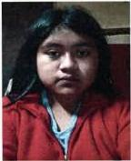

"O también en cuanto a lo que son los medicamentos o recetas que se les dan a los jóvenes, nosotros que pertenecemos al pueblo mapuche, tenemos la costumbre desde niños de tomar hierbas naturales, y cuando vamos al doctor lo primero que receta es pastillas, y como uno no está acostumbrada, puede tener peores resultados".

VALENTINA QUIPAINAO QUILACAN (14 años).

Mapuche.

Malalhue, Región de los Ríos

La evolución del sistema de salud en Chile a partir de su historia reciente, ha implicado importantes desafíos en torno a abordar la salud integral de las personas y grupos prioritarios de la sociedad. Y en específico, la situación de salud de los pueblos indígenas y el conocimiento que se tiene sobre esta, fundamenta también la necesidad de desarrollar lineamientos que faciliten o mejoren la calidad de atención de este grupo de la población.

A la hora de abordar la salud desde un enfoque intercultural, los pueblos indígenas constituyen en sí un grupo prioritario, tanto por el acceso y calidad de la atención, como por la necesidad de adecuación de los programas del sector salud para disminuir las brechas sociales y la incorporación de la cosmovisión cultural de cada pueblo dentro del sistema sanitario.

A lo anterior se suma las transformaciones sociales, culturales, económicas, políticas y epidemiológicas vividas por el país en los últimos años, que también han alcanzado e impactado los modos de vida de los pueblos indígenas en Chile.

En materia de salud, tal como se especificó en el capítulo 3, hasta la fecha resulta difícil explicitar los perfiles epidemiológicos de las poblaciones indígenas del país, dada la ausencia o poca continuidad, en muchos casos, de la variable étnica en las estadísticas vitales y en los registros de salud (108) (58) (109).

Por ello, desde salud, es fundamental la definición de estándares mínimos de interculturalidad en la práctica clínica y en los procesos de atención de salud, permitiendo la operacionalización de las definiciones en prácticas concretas y procedimientos de acompañamiento y atención desde el respeto intercultural.

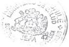
## 6.1. Recomendaciones.

Algunas recomendaciones para la atención de salud integral en adolescentes pertenecientes a pueblos indígenas, son:

Registro, monitoreo e informes epidemiológicos.

> Incorporar en las planificaciones anuales indicadores que permitan vislumbrar en que ambitos se situan las brechas de inequidad que afectan a los y las adolescentes indigenas.
> Durante la realizacion del Control de Salud u otheras prestaciones,realice la pregunta por pertenencia a pueblos indigenas u originarios. Es una pregunta obligatoria, universal y estandarizada. Es una pregunta tan clave y relevante como la edad, sexo, genero o nacionalidad.
Al formular la pregunta por pertenencia a pueblos indígenas:

- Si la persona responde affirmativamente y de manière espontánea identifica el pueblo indígena u originario de pertenencia, registrar lo indicado.
- Si, bajo de formulada la pregunta la persona duda, nombre los distinctos pueblos indígenas u originarios disponibles en la pregunta y registrar el que indique la persona.

¿Se considera perteneciente a algún pueblo indígena u originario?

a) Sí ¿A cuál?

b) No

Frente a la respuesta presentar las siguientes categorías.

|  Código | Glosa  |
| --- | --- |
|  01 | MAPUCHE  |
|  02 | AYMARA  |
|  03 | RAPANUI  |
|  04 | LICAN ANTAI (ATACAMEÑO)  |
|  05 | QUECHUA  |
|  06 | COLLA  |
|  07 | DIAGUITA  |
|  08 | KAWESQAR  |
|  09 | YAGÁN (YÁMANA)  |
|  10 | OTRO (ESPECIFICAR)  |
|  96 | NINGUNO  |

> La pregunta debe ser formulada en los términos en que aparece en la Norma N° 643 ex 820, sin interpretaciones ni modificaciones. Es importante tener el cuidado de mantener un estándar en la forma en cómo se realiza la pregunta, procurando que su formulación respete la estructura de la pregunta.

48
Es necessario destacar que, en el caso de personas migrantes pertenecientes a pueblos indígenas, no existentes en Chile, se debe completar en alternativa otros, especificando a cual pueblo el o la adolescente declaró pertenecer.
Realizar la pregunta con respeto, empatía y cordialidad, evitando prejuicios desde el lenguaje verbal y no verbal del funcionario/a.
> Evitar supuestos o ideas preconcebidas. No partir pensando que el/la adolescente se incomodará o complicará con la pregunta, el auto reconocimiento o autoidentificacion es un derecho adquirido por los pueblos originarios.
En caso de duda del adolescente, se pueda clarificar que el registrar no depende de la calidad indígena que entrega la CONADI, sino de una autoidentificacion.

Cuadro N° 3. Habilidades que conforman las capacidades interculturales.

|  Estar atento | Ser flexible | Desarrollar la tolerancia | Empatía  |
| --- | --- | --- | --- |
|  • Ser consciente de la propia comunicación y del proceso de interacción con otros. • Valorar más el proceso que los resultados, pero a la vez ser capaz de tener una visión de resultado deseado. | • Ser abierto a nueva información. • Ser consciente de que existe más de una perspectiva válida. • Capacidad de adaptarse y acomodarse al comportamiento de otros grupos. | • Capacidad de mantenerse tranquilo al estar en una situación que pueda ser compleja. | • Capacidad para participar en las experiencias de otras personas involucrándose intelectual y emocionalmente. • Capacidad de ponerse en el lugar del otro implica escuchar atentamente lo que los otros nos quieren decir.  |

Fuente: MINSAL. 2018. Orientaciones Técnicas. Pertinencia cultural en los sistemas de información en salud. Variable de pertenencia a pueblos indígenas en los registros y formularios estadísticos del sector salud.

### Atención de salud integral.

Habilitar espacios y adecuar infraestructura para una atencion de salute con pertinencia cultural.
> Incorporar el enfoque de genero culturalmente adecuada en la atencion de adolescentes y jóvenes, comprendido la diversidad de genero desde la concepcion cultural de cada pueblo y/o cultura.

49
➤ Respecto de la atención de salud mental en adolescentes y jóvenes indígenas, se recomienda fortalecer las capacidades de los establecimientos de salud para discernir una derivación hacia el sistema de salud del pueblo originario (protocolos de derivación que permitan complementar la atención).

➤ Sobre el trabajo de los facilitadores/as interculturales y/o asesores culturales, en la atención con adolescentes y jóvenes se recomienda incorporarlos en todos los procesos cuando sea requerido por ellos o sus padres, madres y/o cuidadores. Acompañando, asesorando y participando del trabajo colaborativo con los equipos de salud¹⁶.

➤ Indagar en el uso que hacen adolescentes de los sistemas médicos indígenas. En caso de identificar que ellos acceden a estos sistemas, considerarlo en el diagnóstico y tratamiento.

➤ Generar trabajo colaborativo y en red entre programa PESPI y Programa de Salud Integral de Adolescentes y Jóvenes, generando mayor visibilización de adolescentes y jóvenes indígenas en el sistema de salud, incluyendo en las programaciones anuales de ambos programas, acciones de interculturalidad que puedan ser medidas y monitoreadas en su cumplimiento a través de los POA anuales.

"Primero que nada, que sea una atención respetuosa, porque si estamos hablando de adolescentes, se sabe que es una etapa bien compleja, donde muchas veces suceden muchos cambios, y donde se notan estos cambios es en las escuelas, y desde ahí derivan siempre a los psicólogos. ¿Y porque tiene que ser así inmediatamente? ¿Por qué no se puede derivar primero a una machi o a un lawentuchefe de nuestra propia comunidad? O hacerlo de manera articulada entre ambas medicinas, desde los centros de salud y en paralelo no abandonar la atención con nuestros sanadores, porque si hablamos de interculturalidad, tiene que haber una mayor conversación entre ambos."

AYELEN GONZALEZ CALFUAL (17 años).

Mapuche.

Ñancul, Región de los Ríos.

¹⁶ Los roles y funciones de los/as facilitadores interculturales están definido en la Política de Salud y Pueblos indígenas y han sido también definidos por el Programa PESPI. Son roles y funciones de carácter general para otorgar pertinencia cultural en el sistema de salud.

50
# Participación.

> Fortalecer trabajo con escuelas, liceos y postas rurales de los territorios, para establecer vinculos y solución a problemas sociosanitarios y de acceso a la atencion de adolescentes y jóvenes de acuerdo a la realizad local.
> Favorecer la participation de los/as adolescentes indígenas en la elaboración de planes locales de salute que considere su visión y temas de interes. Esto se pueda desarrollar a工程技术 de la conformación y/o fortalecimiento de Consejos Consultivos de adolescentes, en conversatorios, encuentros, jornadas, en espacios propios y de significación social y cultural de los adolescentes y jóvenes de puellos originarios desde la realizad territorial.

Fortalecer y propiciar la participación de adolescentes y jóvenes en los espacios naturales y urbanos, sitios rituales, ceremoniales, simbólicos y materiales, reconocidos en sus territorios, a través de estrategias que involucren la participación de familias, referentes socioculturales y autoridades indígenas.

> Favorecer espacios de trabajo en torno al diálogo de saberes intergeneracionales y con referentes y autoridades indígenas, que permitan la transmisión de prácticas sobre el sistema de conocimientos, valores y principios propios de los pueblos indígenas para la formación de adolescentes en sus respectivos territorios y contextos.

# Promoción y prevención de la salud.

> Apoyar y poteciar las redes famíares y parentales propias de los pueblos indígenas, asi como a las personas mayores como agentes culturales sabios en la lengua y cultura de su pueblo, para la transmisión de conocimientos y valores que contribuyan al cuidado de la salute desde la perspectiva indígena.
> Elaborar material educativo considerando la cultura y cosmovisión de cada pueblo originario presente en el territorio de los centros de salute, abordando temas de salute que más afecta a los/as adolescentes y jóvenes indígenas, como por exemple salute sexual y salute reproductiva, alimentación, hábito saluteable, salute mental, etc.
> Planificar actiones de promocion de la salute, que contribuya a mejorar la calidad de vida a工程技术 de la Incorporacion de practicas y concepciones propias en el ambito de la salute mental, sexualidad, alimentacion entre otheras.
> Conformar y/o poteciar problemas collaborativos entre referentes de pueblos indígenas y adolescencia de SEREMIs, Servicios de Salud y a nivel local, para la adecuación de planificaciones anuales, programas y prestaciones dirigidos a este grupo de la povlación.

51
> Evaluar las competencias Interculturales de los equipos de salud de manera permanente, reforzando, capacitando y sensibilizando constantemente en torno a las necesidades que se visibilicen.

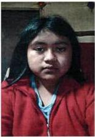

"En el tema de la alimentación, por ejemplo, cuando vamos a un centro de atención donde un nutricionista, no pueden hacer una comparación de la alimentación o ejercicios que se hacen entre un winka y un mapuche, o uno que viene de la cordillera con un niño o adolescente de la ciudad. Porque no hay comparaciones y las formas de abordar a cada uno tiene que ser distinta, en base a datos distintos y estrategias distintas. Deberían sacar datos de las propias comunidades y entender cómo es su alimentación desde niños, antes de juzgar o intervenir sin conocimiento, y en base a eso darle una mejor receta a los niños y adolescentes".

VALENTINA QUIPAINAO QUILACAN (14 años).

Mapuche.

Malalhue, Región de los Ríos.

52
# ANEXOS.

# ANEXO 1: EVIDENCIA SOBRE PERTINENCIA CULTURAL EN CUANTO A LA ATENCIÓN DE ADOLESCENTES Y JÓVENES.

Revisión de literatura en torno a la temática de salud de adolescentes y jóvenes e interculturalidad

A continuación, se presentan los resultados de una revisión de literatura científica y evidencia internacional realizada para este documento, por el grupo de investigadores/as del Programa de Estudios Sociales en Salud (ICIM, UDD), en torno a la temática de salud de adolescentes y jóvenes e interculturalidad ¹⁷. Los principales resultados de la revisión están organizados por áreas temáticas (salud alimentaria, salud sexual y reproductiva, salud mental, consumo de sustancias y acceso a servicios de salud), tal como se presenta a continuación, siendo la mayoría de ellos asociado a población migrante internacional, y existiendo poca información referida a adolescencia y pueblos originarios.

# 1. Salud Alimentaria.

- La gran mayoría de los estudios revisados sobre salud o comportamiento alimentario se realizaron en Estados Unidos, con foco en población migrante latinoamericana.
- Los estudios indagan principalmente en los factores que generan un deterioro en la calidad de la dieta de la población latina y que contribuyen al desarrollo de obesidad o de enfermedades asociadas a una dieta deficiente.
- La relación entre aculturación¹⁸ e identidad étnica estarían relacionadas con la alimentación (112) (113). Un estudio determina que la integración de los adolescentes con identificación bi-cultural (con identificación tanto estadounidense como latina) presentan una mejor salud alimentaria que los y las adolescentes que se encuentran asimilados (mayor identificación estadounidense) (112).
- En otros estudios, sumado a la aculturación, indagan en la relación de las dinámicas familiares y los hábitos alimenticios. Al respecto, se observa una asociación entre el estrés por aculturación, el funcionamiento familiar y el incremento en el consumo de bebidas azucaradas. A su vez, el estrés aculturativo constituye un factor de riesgo para la alimentación emocional, lo que genera cambios en los índices de masa corporal (114) (115). También se identifica un incremento en la obesidad de NNA dada la falta de tiempo de los padres, madres y/o cuidadores para proporcionar alimentos saludables, por la ausencia de modelos paternos/maternos, y altos grados de permisividad (116). Un estudio resalta que

¹⁷ La metodología de revisión de literatura para búsqueda de evidencia, se especifica en el Anexo I.

¹⁸ La aculturación puede ser definida como el conjunto de transformaciones internas y conductuales experimentadas por una persona que está inmersa en una situación de contacto con una cultura diferente, con consecuentes cambios tanto en el individuo como en la cultura que lo acoge (110) o como los fenómenos resultantes de un contacto continuo y directo entre grupos de individuos que tienen culturas diferentes, con los consiguientes cambios en los patrones culturales originales de uno o ambos grupos (111).

53
el rol y la educación de los padres desempeña un papel más relevante que el estado de aculturación en la calidad de la dieta de adolescentes (117).

- Además de la aculturación y el rol de la familia, se describe el rol mediador de otros factores en el consumo de comida poco saludable. Uno de estos es la impulsividad, donde se identifica que, entre los adolescentes más aculturados, los más impulsivos consumen bebidas azucaradas. Se alienta a identificar en futuras investigaciones, otros factores mediadores (118).
- Relevancia de la dimensión cultural de la comida para comprender la adherencia o falta de adherencia a dietas. Importancia de que las recomendaciones médicas se encuentren alineadas con la cultura local y sus creencias (119) (120) (121).
- Fundamental la participación de los padres o cuidadores, además de los adolescentes/jóvenes, en la creación de programas de prevención para mejorar la salud alimentaria (113) (114) (122).

## 2. Salud Sexual y Reproductiva (SSR).

- El conocimiento sobre los significados de las prácticas acerca de la sexualidad en los distintos pueblos originarios, es relevante para diseñar estrategias de cuidado y avanzar en la prevención y promoción de la SSR con pertinencia cultural. Sin embargo, pocos estudios se adscriben a la antropología de género, la sexualidad y los cuidados en SSR en pueblos originarios.
- En un artículo se presentan resultados de una investigación cualitativa, cuyos sujetos de estudio fueron mujeres y hombres adscritos al Pueblo Aymara del norte de Chile (123). Se identifican aspectos clave de las representaciones del cuerpo, sexualidad, gestación, reproducción y del control de la natalidad que particularizan al conjunto social aymara. Estos antecedentes son de utilidad para reflexionar en torno a las consecuencias negativas que pueden desplegar las políticas sociales en salud sexual y reproductiva al centrarse en un sujeto universal y a las dificultades que pueden entorpecer los cuidados enfermeros cuando se invisibilizan las diferencias de los significados que asignan los sujetos a su sexualidad.
- Sin embargo, los estudios sobre salud sexual y reproductiva, se enfocan principalmente en población migrante latinoamericana que reside en Estados Unidos. Estos tratan barreras y facilitadores para el acceso a la salud sexual y reproductiva, educación, fuentes de información, y conductas sexuales de riesgo.
- Respecto a la anticoncepción de adolescentes que viven en zonas rurales, se identifican obstáculos geográficos, elementos culturales, influencias religiosas, falta de educación sexual y actitudes personales sobre el embarazo y métodos anticonceptivos. De acuerdo a la literatura revisada, los factores culturales y religiosos obstruyen el acceso y el conocimiento sobre servicios de salud y anticoncepción (124).

54
- Sobre la educación sexual y el acceso a fuentes de información, un estudio de adolescentes latinos en Estados Unidos da cuenta de que la fuente primaria de información de adolescentes son sus padres, madres y/o cuidadores, aspecto que presenta una asociación significativa con el uso del condón en el caso de los hombres. Sin embargo, los hombres que se informan a través de medios de comunicación o por amigos, tienen una menor intención de uso de condón. Se subraya la importancia de la comunicación de los padres, madres y/o cuidadores, en particular con los varones, y que existan fuentes de información adicionales para promover comportamientos sexuales saludables (125). Otro estudio, enfatiza en la relevancia de promover enfoques culturalmente pertinentes y basados en habilidades, para mejorar la autoeficacia comunicativa de las familias para generar conversaciones sexuales saludables entre padres, madres (adultos responsables) e hijos/as (126).
- En torno al acceso a servicios de salud, en un estudio cualitativo de adolescentes latinos en Estados Unidos, los y las adolescentes plantean la importancia de la privacidad, por lo que sugieren que exista un centro de salud sólo para adolescentes y que tenga personal amigable (127).
- Respecto a conductas sexuales de riesgo en población latina residentes en Estados Unidos, se identifica una asociación en hombres con el estrés que genera su rol de género (preocupación por demostrar características masculinas) y el desarrollo de conductas de riesgo. Se sugiere que las intervenciones aborden esta preocupación, con el objetivo de reducir la presión social e internalizada de los adolescentes para participar de conductas de riesgo (128). Otro estudio advierte un patrón de riesgo de VIH diferenciado por género, donde mujeres latinas presentan mayores conductas de riesgo motivadas por autoeficacia. Se recomienda considerar factores sociales y psicológicos para diseñar estrategias de prevención de VIH e ITS (129).
- Otros estudios, abordan la cobertura de vacunación del Virus de Papiloma Humano, en donde los factores asociados a una finalización exitosa de la vacunación, tienen relación con la educación, autoeficacia y el conocimiento del número requerido de dosis (130) (131).

### 3. Salud Mental

- Los estudios sobre salud mental, presentan más diversidad respecto a los países de estudio y la población objetivo, ya que algunos se enfocan en población indígena en Latinoamérica. No obstante, en su mayoría los estudios se enfocan en población latinoamericana que reside en Estados Unidos.
- En varios estudios se observa que adolescentes latinoamericanos que viven en Estados Unidos, desarrollan diversos trastornos de salud mental. Algunos factores comunes son el distanciamiento de los valores tradicionales de su cultura de origen y menor uso del español. Debido a que el estrés por aculturación aumenta en los y las adolescentes y jóvenes, el riesgo de tener una mala salud mental y, a su vez, incrementar el uso de sustancias, es que se determina que el desarrollo de identidades étnicas positivas y la

55
creación de sistemas de apoyo familiar cercanos pueden ayudar a proteger a los y las adolescentes y jóvenes (132) (133).

- En sectores rurales, se observa que los factores ambientales (conexión escolar y cohesión social del vecindario), junto con el ambiente familiar, reducen las probabilidades de depresión en adolescentes latinos. Una mayor asimilación del lenguaje (Inglés) se asocia a una mayor probabilidad de depresión (134). Otro estudio respalda lo anterior en áreas no rurales, donde se observa menos depresión en adolescentes que crecen en nichos de familias migrantes internacionales, y escuelas y vecindarios predominantemente latinos (135).
- El estrés de aculturación de los padres es un factor que afecta a los adolescentes, como también la brecha de aculturación entre padres y jóvenes. Esto influye la salud mental de los y las adolescentes y en el consumo de sustancias. En consecuencia, se establece la necesidad de que las intervenciones preventivas para adolescentes y jóvenes latinos consideren el estrés de aculturación de los padres, madres y/o cuidadores y las dinámicas familiares (136) (137) (138). Se indica que un ámbito desde el cual se pueden reducir los efectos negativos del estrés cultural, es disminuir los problemas de los vecindarios donde residen, ya que igualmente se genera estrés por exposición a violencia comunitaria (139).
- Un estudio identifica factores culturales estresantes asociados a síntomas depresivos en adolescentes latinos. Estos son: discriminación, conflicto cultural familiar, estrés aculturativo y bicultural, rechazo intragrupal, estrés migratorio y contexto de recepción (140). Un elemento que podría otorgar un grado de protección a los y las adolescentes en los procesos de transición cultural, es el desarrollo identitario (141).
- Ante ideaciones suicidas, se identifica entre adolescentes mexicanos que el pesimismo está relacionado con el desarrollo de depresión e ideación suicida. La conexión con los cuidadores podría amortiguar efectos negativos del conflicto aculturativo y el riesgo de suicidio, por lo que los cuidadores deben ser incluidos en los esfuerzos de investigación, prevención e intervención (142) (143). Otro estudio demuestra que el conflicto entre padres, madres y adolescentes, genera mayor agresión en estos últimos (144).
- Un estudio analiza el papel mediador del enraizamiento de los migrantes internacionales en la sociedad receptora sobre el efecto negativo del estrés de aculturación. Se concluye que la necesidad de enraizamiento en el país de acogida es un factor de protección frente a los efectos negativos del estrés sobre el bienestar (145).
- En torno a población indígena, un estudio identifica que en Colombia la tasa de alcoholismo, problemas de abuso de sustancias y trastornos mentales, son más altos en esta población. Algunos factores que los expone a un mayor riesgo es el vivir en zonas urbanas, no hablar el idioma y consumir sustancias psicoactivas y tabaco (146).
- Otro estudio respecto a la población indígena en Ecuador, evalúa una actividad de intervención psicosocial en una comunidad que no tiene acceso a salud mental. La intervención (círculo de mujeres) fue bien recibida por la comunidad y obtuvo resultados positivos en el bienestar de las mujeres, autocuidado y la auto eficiencia en el cuidado infantil (147).

56
# 4. Consumo de Sustancias.

- Al igual que en los puntos anteriores, la mayoría de los estudios sobre el consumo de sustancias en adolescentes, se enfocan en población latina que vive en Estados Unidos.
- Un elemento común en los artículos, es que el consumo de alcohol y sustancias aumenta a medida que la identificación cultural se acerca a la estadounidense y disminuye la identificación cultural latina. Se sugiere que los valores comunitarios pueden ayudar a proteger a los y las adolescentes y jóvenes del consumo, ya que disminuyen al influir en la desaprobación social percibida respecto al consumo. Por lo mismo, se recomienda centrar las intervenciones educativas en promover valores comunitarios y difundir mensajes sobre las consecuencias negativas del consumo de alcohol (148) (149) (150) (151).
- Un estudio identifica elementos culturales tradicionales latinos que pueden prevenir el consumo de sustancias, existiendo activos culturales que confieren protección contra el uso de sustancias (149).
- Importancia de los roles de género en el consumo de sustancias. Se advierte que, entre adolescentes mexicanos, los roles de género actúan como mediadores, donde existe una relación positiva entre la masculinidad agresiva y el consumo de alcohol. De esta forma, las intervenciones deben considerar la influencia de los roles de género (152).
- Un estudio advierte que los efectos de la aculturación (la herencia y las prácticas de identificación culturales de Estados Unidos) y el estrés sociocultural (la discriminación percibida, el contexto de recepción y el estrés bicultural), influyen en la iniciación de sustancias entre adolescentes latinos recientemente inmigrados (153).
- Acorde a los resultados de un estudio en Perú, los bajos niveles de monitoreo de los padres, madres y/o cuidadores y bajos niveles de relaciones familiares positivas están asociados con probabilidades significativamente altas de que los adolescentes tengan problemas con el alcohol (154).

# 5. Acceso a servicios de salud:

- Al igual que en los puntos anteriores, la mayoría de los estudios refieren a población migrante latinoamericana en Estados Unidos.
- Un estudio aborda barreras para el acceso a salud sexual en base a la percepción de adolescentes y jóvenes latinas. Entre ellas, señalan como barrera la discriminación en entornos clínicos y la vergüenza o estigma sobre temas sexuales. Se recomienda generar intervenciones que consideren la naturaleza multinivel e interseccional en torno a los desafíos de la salud sexual y reproductiva (155).
- Otro estudio, recoge la opinión de un panel de expertos respecto a las barreras y facilitadores en el acceso a salud sexual y reproductiva en el caso de adolescentes latinas con diabetes 1 y 2. Algunas barreras son el idioma, la religión, el acceso a atención médica y la incomodidad de las adolescentes con las conversaciones sobre salud sexual. Sobre los facilitadores, señalan la importancia de redes de apoyo, promover confianza entre los profesionales, las adolescentes y sus familias, evaluar el desarrollo emocional, enfatizar la seguridad y comunicarse en el idioma preferido del paciente. Importancia de conversar

57
temas de salud reproductiva desde una sensibilidad cultural y centrando la atención en la familia (156).

- Un estudio situado en Chile, identifica que 60% de adolescentes desconoce si está inscrito en el sistema de salud y la mitad no lo ha utilizado. El tiempo de residencia es un factor relevante para el uso efectivo de algunas prestaciones de salud. Respecto a barreras, se identifican obstáculos administrativos para acceder al sistema de salud, como la situación migratoria, la percepción de obligatoriedad de compañía de adultos y experiencias de discriminación en la atención. Algunos facilitadores son experiencias de buen trato y presencia del sector salud en las escuelas (4).

En base a datos como los anteriormente entregados, es sumamente importante, por parte de los equipos de salud, entender la diversidad cultural y su interrelación con las diversas barreras y vulnerabilidades en salud, en miras de diseñar Servicios Amigables para adolescentes que sean relevantes, apropiados y adecuados a su finalidad. Y de esta forma, decidir sobre qué ofrecer en los espacios de atención en base a un análisis sobre cuáles son los grupos de adolescentes que, en un momento dado, están teniendo mayores brechas de acceso, están recibiendo una atención no pertinente o bien presenta un mayor grado de vulnerabilidad.

Al respecto, cuando las personas ven limitada su capacidad de tomar y poner en práctica decisiones libres e informadas, se ven aumentadas esas mismas vulnerabilidades, desigualdades y/o barreras de acceso a la atención (82), esto debido a determinantes estructurales de exclusión en diferentes niveles (dentro de ellos el sistema de salud) que posicionan en mayor o menor desventaja y vulneración a las personas, sea por su condición de pertenencia a pueblo originario o migración. Si bien los grupos más vulnerables pueden ser diferentes en cada país o en regiones de un mismo país, la vulnerabilidad en adolescentes y jóvenes depende de sus propios contextos culturales, socioeconómicos y comunitarios.

58
# ANEXO 2. METODOLOGÍA DE REVISIÓN DE LITERATURA PARA BÚSQUEDA DE EVIDENCIA.

# Estrategia de búsqueda en literatura científica

La búsqueda de literatura para evidencia científica incorporada en la sección 3.2 se realizó en las bases de datos de Pubmed y Google Scholar en octubre de 2021. La búsqueda se restringió a publicaciones originales realizadas entre 2016 y 2021, publicadas en español o inglés. La estrategia de búsqueda se detalla en la Tabla 12.

Tabla N° 12. Ecuación de búsqueda sobre salud, diversidad cultural y adolescentes.

|  Ecuación general | (Cultural Competency OR Cultural Diversity OR Cultural Characteristics OR Culturally Competent Care OR Ethnopsychology OR Acculturation OR transcultural OR multicultural) AND (Adolescent OR Adolescent Health Services OR Young Adult)  |
| --- | --- |

# Criterios de selección de artículos científicos

Los criterios de inclusión de los artículos científicos fueron los siguientes:

- Tipo de povlacion: enfocados en povlacion de Latinoamerica y el Caribe, en particular en el subGrupo de adolescentes.
- Tipos de estudios:rialquier tipo de estudio qualitativo,quantitativo,participativo o multimétodos.
- Tipo de resultados: resultados que traten distinctos outcomes en salute para povlacion adolescente que aborden diversidad cultural.

# Extracción y síntesis de la evidencia

La extracción de los datos se realizó a través de una planilla de Microsoft Excel clasificada por (a) características del estudio (título, autor, año, país, objetivo del estudio, tipo y diseño del estudio); (b) grupo adolescente estudiado; (c) outcome en salud; (d) resultados del estudio. A partir de esta información, se realizó una tabla general con la revisión de literatura y tablas segregadas por temática según el outcome en salud, donde se identificaron seis temáticas generales, a saber: comportamiento alimentario, salud sexual y reproductiva, salud mental, consumo de sustancias, acceso a servicios de salud y otros.
Figura N° 4. Flujograma de selección de artículos científicos sobre salud, diversidad cultural y adolescentes.

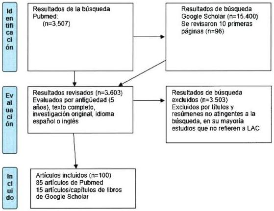

60
# ANEXO 3. MARCO LEGAL

Marco internacional.¹⁹

> Convención internacional sobre la eliminación de todas las formas de discriminación racial, 1965 (157).

Artículo 2:

- Cada Estado se compromete a no incurrir en ningún acto o práctica de discriminación racial contra personas, grupos de personas o instituciones públicas, nacionales y locales, actúen en conformidad con esta obligación (157).

> Convenio 169 de la OIT, 1989 (158)²⁰.

Artículo 25:

"Los gobiernos deben velar por que se pongan a disposicion de los pueblos interesados servicios de salute adecuados o proportionsar a dichos pueblos los medios que les permita organizar y prestar tales servicios bajo su propia responsabilidad y control, a fin de que pueda gozar del máximo nivel possible de salute fisica y mental."
"Los servicios de salute deben organizarse en la medida de lo posible, a nivel comunitario. Estos servicios deben plantearse y administrarse en cooperacion con los pueblos interesados y tener en cuenta sus conditiones economicas, geograficas, sociales y culturales, asi como sus métodos de prevencion, practicas curativas y medicamentos tradiconiales."

> Convención de los derechos del niño, niña y adolescente, 1989 (2)²¹

¹⁹ Para efectos de no alargar el documento, se han priorizado aquellas herramientas jurídicas internacionales firmadas por el Estado Chileno con carácter de vinculantes.

²⁰ A esto se suma también la Declaración de las Naciones Unidas sobre los Derechos de los Pueblos Indígenas, 2007 (159), que en su artículo 24, establece que Los pueblos indígenas tienen derecho a sus propias medicinas tradicionales y a mantener sus prácticas de salud, incluida la conservación de sus plantas, animales y minerales de interés vital desde el punto de vista médico. Mientras que en su artículo 25, establece que los servicios de salud deberán organizarse en la medida de lo posible, a nivel comunitario. Estos servicios deberán planearse y administrarse en cooperación con los pueblos interesados y tener en cuenta sus condiciones económicas, geográficas, sociales y culturales, así como sus métodos de prevención, prácticas curativas y medicamentos tradicionales.

²¹ El Decreto 830 ratifica y suscribe, por el Gobierno de Chile, la Convención sobre de los derechos del niño, emanada desde la Asamblea General de la Organización de las Naciones Unidas el 20 de noviembre de 1989, antes descrita.

61
Es el marco legal que protege a NNA en el ejercicio de sus derechos, y al ampliar la noción de ciudadanía a la infancia y adolescencia, consagra la mayoría de los derechos protegidos por la Declaración Universal de los Derechos Humanos.

En el artículo 8 de la CDN, se contiene el principio de preservación de la identidad, en donde:

- Los Estados Partes se comprometen a respetar el derecho del niño a preservar su identidad, incluidos la nacionalidad, el nombre y las relaciones familiares de conformidad con la ley sin injerencias ilícitas.

Mientras que en el artículo 24 de la CDN, se establece el derecho a la salud y servicios médicos, estableciendo que:

- Los NNA tienen derecho a disfrutar del más alto nivel posible de salud y a tener acceso a servicios médicos y de rehabilitación, con especial énfasis en aquéllos relacionados con la atención primaria de salud, los cuidados preventivos y la disminución de la mortalidad infantil. Es obligación del Estado tomar las medidas necesarias, orientadas a la abolición de las prácticas tradicionales perjudiciales para la salud del niño."

# ➤ Observación General Nº 14 de la ONU, 2000.

La Observación General Nº 14 del Comité de Derechos Económicos, Sociales y Culturales (160) sobre el derecho al disfrute del más alto nivel posible de salud, establece como elemento fundamental para el ejercicio del derecho a la salud, la aceptabilidad. Sobre este elemento señala todos los establecimientos, bienes y servicios de salud deberán ser respetuosos de la ética clínica y culturalmente apropiados, es decir, respetuosos de la cultura de las personas, las minorías, los pueblos y las comunidades.

# ➤ Resolución de la OMS N° WHA61.17 de Salud de migrantes 2008 (161)

Destaca la necesidad de respuestas humanitarias frente a un fenómeno complejo como la migración, situándolo como un tema de mayor relevancia de salud pública, al mismo tiempo que instala la preocupación sobre las personas migrantes en situación de mayor vulnerabilidad, instando a los países a promover políticas de salud sensibles con el contexto migratorio y el acceso equitativo a la salud, teniendo en cuenta aspectos culturales, de género y conocimientos sobre salud y migración.

# ➤ Observación General N° 15 sobre el derecho del niño al disfrute del más alto nivel posible de salud (2013) del Comité de los Derechos del Niño (3).

# Artículo 24:

- A fin de lograr la plena realización del derecho de todos los niños a la salud, los Estados partes tienen la obligación de asegurar que la salud del niño no quede minada por la discriminación, importante factor que contribuye a la vulnerabilidad.

62
- La CDN obliga a los Estados a velar por el que todos los servicios y programas relacionados con la salud infantil cumplan criterios de disponibilidad, accesibilitad, aceptabilitad y calidad.
- El Comité entiene por acceptabilidad la obligation de que todas las instalaciones, bienes y servicios relacionados con la salute se diseñen y usen de una forma queongaplenamente en cuenta y respete la etica medica, asi como las necessities, expectativas, cultura e idioma de los niños, prestando especial atencion, cuando proceda, a determinados grupos.

# ➤ Consenso de Montevideo sobre Población y Desarrollo 2013 (162).

Representantes oficiales de 38 países miembros y asociados de la Comisión Económica para América Latina y el Caribe (CEPAL) de las Naciones Unidas, acordaron más de 120 medidas sobre ocho temas identificados como prioritarios para dar seguimiento al Programa de Acción de la Conferencia Internacional sobre la Población y el Desarrollo (CIPD) de las Naciones Unidas, realizada en El Cairo en 1994.

En su apartado B, establece el componente de "Derechos, necesidades, responsabilidades y demandas de niños, niñas, adolescentes y jóvenes", en donde se acuerda, entre otras cosas:

- Garantizar a niños, niños, adolescentes y jóvenes las OPPORTUNITADES y capacidades para una sana convivencia y una vida libre de violencia, mediante estrategias intersectoriales que actuen sobre los determinantes que les afectan, brindando formacion que promueva la tolerancia y el aprecio por las diferencias, el respeto mutuo y de los derechos humanos.
- Garantizar datos estadisticos confiables, desagregados por sexo,idad, condidion migratoria, raza, etnia, variables culturales y ubicacion geografica en materia de educacion, salute, en particular salute sexual y salute reproductiva, empleo y participacion de adolescentes y jóvenes.

En su apartado F, establece el componente de "La migración internacional y la protección de los derechos humanos de todas las personas migrantes", en donde se acuerda, entre otras cosas:

- Proteger decididamente los derechos humanos, evitando toda forma de criminalización de la migración, garantizando el acceso a servicios sociales básicos, de educación y de salud, incluida la salud sexual y la salud reproductiva cuando corresponda, para todas las personas migrantes, independientemente de su condición migratoria, prestando particular atención a los grupos en condición de mayor vulnerabilidad.

En su apartado H, establece el componente de "Pueblos indígenas: interculturalidad y derechos", en donde se acuerda, entre otras cosas:

- Garantizar el derecho a la salud de los pueblos indígenas, incluidos los derechos sexuales y derechos reproductivos, así como el derecho a sus propias medicinas tradicionales y sus

63
prácticas de salud, considerando sus especificidades socio-territoriales y culturales, así como los factores estructurales que dificultan el ejercicio de este derecho.

- Adoptar las medidas necesarias para garantizar que mujeres, niños, niñas y adolescentes y jóvenes indígenas gocen de protección y garantías plenas contra todas las formas de violencia y discriminación.

# ➤ Resolución CD55/11 del 55.o Consejo Directivo de la OPS el 2016 (163).

La OPS en el 55.o Consejo Directivo de la Organización el 2016, emite la resolución CD55/11, en la cual se insta a los Estados Miembros a generar políticas y programas de salud que aborden las desigualdades de salud que afectan a los migrantes, y a desarrollar intervenciones especiales para reducir los riesgos a su salud; mejorar los marcos normativos y legales con el fin de abordar las necesidades específicas de salud de los migrantes; garantizar el acceso al mismo nivel de protección financiera y atención médica que disfrutan las demás personas que viven en el mismo territorio, sin importar su estatus migratorio; crear propuestas en todos los niveles para la coordinación de programas y políticas sobre asuntos de salud que se consideren de interés.

# ➤ Resolución WHA70, adoptada por el Consejo Ejecutivo de la OMS 2017 (62).

Establece el marco de prioridades y principios rectores para promover la salud de los refugiados y los migrantes y plantea dentro de sus objetivos la formulación de un plan de acción mundial para la promoción de la salud de los refugiados y los migrantes en colaboración con OIM, el ACNUR, otras organizaciones internacionales y las partes interesadas pertinentes.

Los principios establecidos son el derecho a gozar del grado máximo de salud física y mental que se pueda lograr; la igualdad y la ausencia de discriminación; el acceso equitativo a los servicios de salud; los sistemas de salud centrados en las personas y sensibles a los refugiados, los migrantes y las cuestiones de género; las prácticas sanitarias no restrictivas basadas en las condiciones de salud; la participación y la inclusión social de los refugiados y migrantes, y las alianzas y la cooperación.

# ➤ Plan de Acción Mundial para la Promoción de la Salud de los Refugiados y los Migrantes, OMS 2019-2023 (164).

Se constituye en el marco global para la salud de los migrantes, proponiendo, entre otras cosas:

- Promover la salud de refugiados y migrantes a través de una combinación de intervenciones de salud pública a corto y largo plazo, con el objetivo de promover su salud física y mental mediante el fortalecimiento de los servicios de atención de salud, con pertinencia y de conformidad a sus prioridades, competencias y marcos jurídicos nacionales.

- Considera la protección jurídica y social; la salud y el bienestar de las mujeres, niños y adolescentes, que viven en entornos de refugiados y migrantes.

64
Marco Nacional.

> Programa Especial de Salud y Pueblos Indígenas (2000) (165).

Impulsa diversas estrategias para la incorporación del enfoque intercultural en los programas de salud. Asimismo, insta a los Servicios de Salud a potenciar aquellos procesos de complementariedad entre la atención que otorga el Sistema de Salud Público y la que proveen los pueblos indígenas, a fin de que éstos puedan obtener resolución integral y oportuna de sus necesidades de salud.

> La "Ley de Autoridad Sanitaria Nº 19.937" (2004) (166).

En su Art. 4 establece que el Ministerio de Salud tendrá, entre otras, la función de Formular políticas que permitan incorporar un enfoque de salud intercultural en los programas de salud en aquellas comunas con presencia indígena.

> Norma General Administrativa Nº 16 sobre Interculturalidad en los Servicios de Salud (2006) (84).

Norma aprobada por la Resolución Exenta Nº 261 de fecha 28 de abril del año 2006, por el Ministerio de Salud. Desarrolla directrices que constituyen orientaciones relativas a la implementación de la pertinencia cultural, interculturalidad y complementariedad en salud que serán competencia de los Servicios de Salud y las SEREMI de Salud.

> Ley Nº 20.584 que regula los derechos y deberes que tienen las personas en relación con acciones vinculadas a su atención de salud (2012) (15).

Establece en su artículo 7, la obligación de los prestadores institucionales públicos a asegurar el derecho de las personas pertenecientes a los pueblos originarios a recibir una atención de salud con pertinencia cultural, asegurando, a lo menos, el reconocimiento, protección y fortalecimiento de los conocimientos y las prácticas de los sistemas de sanación de los pueblos originarios; la existencia de facilitadores interculturales y señalización en idioma español y del pueblo originario que corresponda al territorio, y el derecho a recibir asistencia religiosa propia de su cultura" (15).

> La Ley Nº 20.609 que establece medidas contra la discriminación (2012) (167).

Esta ley instaura un mecanismo judicial, que permite proteger todo derecho cuando se cometa un acto de discriminación arbitraria. Específicamente, en su artículo 2, establece a la discriminación arbitraria como la distinción, exclusión, restricción, amenaza o privación a los derechos fundamentales, por agentes del Estado o particulares, cuando se funden en motivos tales como la raza o etnia, la nacionalidad, el idioma, creencias, la apariencia personal, entre otros.

69
> Norma Nº 820, "Sobre Estándares de Información en Salud" aprobada el 2016 (168).

La Norma Técnica 820, constituye el marco regulatorio para la información de salud. Establece las características obligatorias que deben cumplir los datos independientemente de las etapas del proceso (generación, envío, recepción, almacenamiento y procesamiento). La Norma Técnica 820 rige a todos los formularios de salud ya sean electrónicos o de papel. En ella, la variable "Pueblos Indígenas" se incluyó como parte del Conjunto Mínimo Básico de datos de la persona. Siguiendo las recomendaciones internacionales (OIT, OMS, OPS) la pregunta recoge y apunta a la auto identificación, y tanto su formulación como su registro son de carácter obligatorio.

> Ordinario A14 Nº 3229 de octubre del año 2007.

El Ministerio de Salud y el Ministerio del Interior firman convenio de colaboración que permite la entrega de un permiso de residencia temporaria a niñas y niños menores de 18 años, en forma independiente de su condición migratoria y la de sus padres. Este convenio fue aprobado por el MINSAL en resolución exenta del 30 de noviembre de 2010 con el Departamento de Extranjería y Migración del Ministerio del Interior.

> Decreto Supremo Nº 67 del 2016.

Modifica el DECRETO Nº 110 de 2004 del MINSAL, que fija circunstancia y mecanismos para acreditar a las personas como carentes de recursos o "indigentes", agregando de esta forma, en el Artículo 2, la siguiente circunstancia Nº 4 "tratarse de una persona inmigrante internacional que carece de documentos o permisos de residencia, que suscribe un documento declarando su carencia de recursos"²², permitiendo que personas en situación irregular y carente de recursos, accedan al Fondo A de FONASA, para atención gratuita en el Sistema Público de Salud, pudiendo acceder a todo el régimen de prestaciones en iguales condiciones que los nacionales. De esta forma, se desliga la atención de salud de la tramitación de permisos de residencia, situación que ha operado como barrera de acceso para que los derechos que se han asegurado, se puedan ejercer en el caso de la atención de gestantes, niños, niñas y adolescentes menores de 18 años y atenciones de urgencia.

> Circular N 4, del 13 de junio del 2016.

Imparte instrucciones para aplicación de esta circunstancia Nº 4 del Decreto Supremo Nº110 del 2004, agregada por el Decreto Supremo Nº 67 del 2016, instruyendo su implementación.

Ley 21.430 sobre garantías y protección integral de los derechos de la niñez y adolescencia (2022)

Esta ley establecerá el marco para que el Estado adopte todas las medidas administrativas, legislativas o de otro carácter para la defensa y protección, particular y reforzada de los derechos

²² Esta nueva circunstancia, no se aplica a las personas en situación migratoria regular, quienes tienen acceso al sistema de salud en iguales condiciones que los nacionales, pudiendo optar por el sistema público o privado de salud.

66
de los niños, niñas y adolescentes provenientes de grupos sociales específicos, tales como migrantes, pertenecientes a comunidades indígenas o que se encuentren en situación de vulnerabilidad económica, garantizando su pleno desarrollo y respeto a las garantías especiales que les otorgan la Constitución Política de la República, la Convención sobre los Derechos del Niño, los demás tratados internacionales de derechos humanos ratificados por Chile que se encuentren vigentes y las leyes²³.

Entre la garantía de derechos está el acceso a la salud y a los servicios de salud, derecho que tienen "con independencia de su edad y estatus migratorio". Es también el Estado el que debe garantizar el acceso universal e igualitario a planes, programas y servicios de protección

²³ Disponible en: https://www.bcn.cl/leychile/navegar?idNorma=1173643

67
# REFERENCIAS.

1. ONU. La Declaración Universal de Derechos Humanos [Internet]. 1948 [citado 30 de noviembre de 2021]. Disponible en: https://www.un.org/es/about-us/universal-declaration-of-human-rights

2. ONU. Convención Sobre los Derechos del Niño [Internet]. 1989. Disponible en: https://www.ohchr.org/sp/professionalinterest/pages/crc.aspx.

3. Comité de los Derechos del Niño O. Observación general N° 15 (2013) sobre el derecho del niño al disfrute del más alto nivel posible de salud (artículo 24) [Internet]. 2013. Disponible en: http://www.codajic.org/sites/default/files/sites/www.codajic.org/files/Convenci%C3%B3n%20sobre%20los%20Derechos%20del%20Ni%C3%B1o%20,GC_.15_sp_0.pdf

4. Obach A, Hasen F, Cabieses B, D'Angelo C, Santander S. Conocimiento, acceso y uso del sistema de salud en adolescentes migrantes en Chile: resultados de un estudio exploratorio [Knowledge, access and use of the health system by migrant adolescents in Chile: results of an exploratory study]. Rev Panam Salud Pública Pan Am J Public Health [Internet]. 2020;44(175). Disponible en: https://doi.org/10.26633/RPSP.2020.175

5. OPS. Iniciativa Salud de los Pueblos Indígenas Lineamientos Estratégicos y Plan de Acción 2003 – 2007. [Internet]. 2003. Disponible en: http://www1.paho.org/hq/dmdocu-ments/2009/50%20EspPlan2003-2007.pdf

6. Commission on Social, Determinants of Health (CSDH). Social determinants and indigenous heal-th: the international experience and its po-licy implications [Internet]. Symposium on the Social Determinants of Indigenous Health; 2007. Disponible en: https://bvsms.saude.gov.br/bvs/publicacoes/indigenous_health_adelaide_report_07.pdf

7. Fundação Nacional de Saúde (FUNASA)., Departamento de Saúde Indígena. Vigilância em saúde indígena: síntese dos indicadores 2010. FUNASA; 2010.

8. Oyarce AM, Pedrero M. Perfil epidemiológico básico de la población mapuche residente en el área de cobertura del Servicio de Salud Araucanía Norte. Serie situación de salud de los pueblos indígenas de Chile, N° 8. [Internet]. 2011. Disponible en: https://www.minsal.cl/sites/default/files/files/SERIE%20PUBLICACIONES%20SITUACION%20DE%20SALUD%20N%C2%B0%208%20ARAUCANIA%20NORTE.pdf

9. Oyarce AM, Pedrero M. Perfil epidemiológico básico de la Población mapuche-huilliche residente en el área de cobertura del Servicios de Salud Valdivia, Región de los Ríos. Serie Análisis de Situación de Salud de los Pueblos Indígenas de Chile N° 06. [Internet]. 2009. Disponible en: https://www.minsal.cl/sites/default/files/files/SERIE%20PUBLICACIONES%20SITUACI%C3%93N%20DE%20SALUD%20N%C2%B0%206%20LOS%20RIOS.pdf

10. Montenegro R, Stephens C. Indigenous health in Latin America and the Caribbean. Lancet. 2006;367(9525):1859-69.

68
11. De la Maza F, et al. COVID-19 y Pueblos indígenas y Afrodescendiente en Chile: Determinantes sociales y factores culturales para políticas públicas pertinentes. 2021.

12. Ministerio de Salud Pública y Asistencia Social Guatemala. Normas con pertinencia cultural [Internet]. 2011. Disponible en: https://www.paho.org/gut/dmdocuments/2011%20NORMAS%20CON%20PERTINANCIA%20CULTURAL.pdf

13. Ministerio de Salud de Perú. Orientaciones para incorporar la pertinencia cultural en los servicios diferenciados de atención integral del adolescente [Internet]. 2018. Disponible en: http://bvs.minsa.gob.pe/local/MINSA/4421.pdf

14. MINSAL. Política de Salud y Pueblos Indígenas. 2006.

15. MINSAL. Ley 20.584. Regula los derechos y deberes que tienen las personas en relación con acciones vinculadas a su atención en salud. [Internet]. 2012. Disponible en: https://www.bcn.cl/leychile/navegar?idNorma=1039348

16. Stefoni C. La construcción del campo de estudio de las migraciones en Chile: notas de un ejercicio reflexivo y autocrítico. Íconos Rev Cienc Soc. 2017;58:109-129.

17. Reyes Eguren A. Juventudes migrantes. Indocumentados, invisibilizados y mitificados. Marco conceptual para una agenda de investigación en el estudio de la migración juvenil. Rev El Col San Luis Nueva Época. 2013;3(5):287-307.

18. Porraz Gómez I. Juventud migrante del sur. Apuntes para su construcción conceptual. Rev Pueblos Front. 2015;10(20):171-194.

19. OMS. Orientation programme on adolescent health for health care providers. World Health Organization; 2006.

20. OMS. Adolescent job aid: a handy desk reference tool for primary level health workers [Internet]. World Health Organization; 2010. Disponible en: http://apps.who.int/iris/bitstream/handle/10665/44387/9789241599962_eng.pdf?sequence=1

21. OMS. Competencias básicas en materia de salud y desarrollo de los adolescentes para los proveedores de atención primaria. [Internet]. 2015. Disponible en: https://apps.who.int/iris/bitstream/handle/10665/178251/9789243508313_spa.pdf;sequence=1

22. OPS/OMS/ONUSIDA. Normas mundiales para mejorar la calidad de los servicios de atención de salud de los adolescentes. Guía de aplicación de un enfoque fundamentado en las normas para mejorar la calidad de los servicios de salud prestados a los adolescentes. [Internet]. 2016. Disponible en: https://iris.paho.org/handle/10665.2/28569

23. OPS. Resolución CD47.R18: La salud de los pueblos indígenas de las Américas. [Internet]. Washington, D.C. OPS; 2006. Disponible en: http://www1.paho.org/hq/dmdocu-ments/2009/CD47r18-s.pdf
24. OPS. Health of the Indigenous Peoples Initiative. Strategic Directions and Plan of Action 2003–2007. [Internet]. Washington, DC.: PAHO; 2003. Disponible en: http://www1.paho.org/hq/dmdocuments/2009/50-Eng%20Plan2003-2007.pdf

25. OPS. Programa Regional Salud de los Pueblos Indígenas. Prestación de servicios de salud en zonas con pueblos indígenas. Recomendaciones para el Desarrollo de un Sistema de Licenciamiento y Acreditación de Servicios Interculturales de Salud en el marco de la Renovación de la Atención Primaria de la Salud. [Internet]. 2009. Disponible en: http://www1.paho.org/hq/dmdocuments/2009/servicios%20salud%20zonas%20indigenas.pdf

26. OPS. Una visión de salud intercultural para los pueblos indígenas de las Américas. Washington DC.: OPS; 2008.

27. CEPAL/ONU/OPS. Salud de la población joven indígena en América Latina: un panorama general [Internet]. Santiago (Chile): CEPAL.; 2011. Disponible en: http://www.cepal.org/es/publicaciones/35357-salud-la-poblacion-joven-indigena-ame-rica-latina-un-panorama-general

28. Araujo M, Moraga C, Chapman E, Barreto J, Illanes E. Intervenciones para mejorar el acceso a los servicios de salud de los pueblos indígenas en las Américas. Rev Panam Salud Pública. 2016;40(5):371-81.

29. MORIN, Edgar. «El Sistema Cultural». M&cico.

30. Giménez, G. Para una concepción semiótica de la cultura”. mimeo. México,; 1982.

31. Harris M. Antropología cultural. Madrid: Alianza Editorial.; 2001.

32. Lévi-Strauss C. Raza y cultura. Vol. 1. Cátedra colección teorema; 1993. 144 p.

33. Geertz C. La interpretación de las culturas. Barcelona: Gedisa; 1983.

34. Cabieses B, Obach A, Urrutia C. Conceptos esenciales sobre interculturalidad en salud pertinentes para poblaciones migrantes, refugiadas y en movilidad humana. En: : Interculturalidad en salud Teorías y experiencias para poblaciones migrantes internacionales. Santiago, Chile: Universidad del Desarrollo.; 2021.

35. OMS. Subsana las desigualdades en una generación. Alcanzar la equidad sanitaria actuando sobre las determinantes sociales de la salud [Internet]. Comisión Sobre Determinantes Sociales en Salud; 2009. Disponible en: https://apps.who.int/iris/bitstream/handle/10665/69830/WHO_IER_CSDH_08.1_spa.pdf?sequence=1&isAllowed=y

36. Hasen F. Interculturalidad en salud: competencias en prácticas de salud con población indígena. Cienc Enferm. 2012;18(3):17-24.

37. MINSAL. Orientaciones Técnicas para la Atención de Salud Mental con Pueblos Indígenas: Hacia un enfoque intercultural [Internet]. 2016. Disponible en: http://www.bibliotecaminsal.cl/wp/wp-content/uploads/2018/01/028.MINSAL-salud-mental-indigen-2016.pdf.

70
38. MINSAL. Política de Salud de Migrantes Internacionales [Internet]. 2018. Disponible en: https://www.minsal.cl/wp-content/uploads/2015/09/2018.01.22.POLITICA-DE-SALUD-DE-MIGRANTES.pdf

39. Obach A, Cabieses B, Bernales M. Interculturalidad en salud de acuerdo a prácticas de medicinas indígenas y complementarias, y su introducción en el sistema de Salud Público en Chile: Hallazgos de un estudio etnográfico. RISPCH. 2017;1(1).

40. Boccara G. Etnogubernamentalidad. La formación del campo de la salud intercultural en Chile. Chungará Rev Antropol Chil. 2007;39(2).

41. Walsh C. Interculturalidad crítica y educación intercultural. En: Construyendo interculturalidad crítica. Viaña, Tapia, Walsh, La Paz, Bolivia: Instituto Internacional de Integración; 2010.

42. Alarcón M, Ana M, Vidal H, Neira Rozas J. Salud intercultural: elementos para la construcción de sus bases conceptuales. Rev Médica Chile. 2003;131(9):1061-5.

43. Hasen F, Cortez M. Aproximaciones a la noción mapuche de Küme Mogñen: equilibrio necesario entre el individuo, su comunidad y la naturaleza. Rev Psicol Iztacala Univ Nac Autónoma México [Internet]. 2012;15(2). Disponible en: http://www.revistas.unam.mx/index.php/repi/article/view/32368

44. Hasen F. La noción de Küme Mogñen en el pueblo mapuche: Aproximaciones desde un enfoque ecosistémico. Rev KULA Antropólogos Atlántico Sur. 2012;7:96-114.

45. Hasen F. Desarrollo y Buen Vivir desde un Enfoque Ecosistemico: La experiencia local de Lago Neltume, Chile. Rev Sustentabilidades. 2014;6(10):126-59.

46. Veliz-Rojas L, Bianchetti-Saavedra F, Silva-Fernández M. Competencias interculturales en la atención primaria de salud: un desafío para la educación superior frente a contextos de diversidad cultural. Cad Saúde Pública [Internet]. 2019;5(1). Disponible en: https://www.scielosp.org/article/csp/2019.v35n1/e00120818/.

47. Organización Internacional para las Migraciones (OIM). Migración Internacional, Salud y Derechos Humanos. 2013.

48. Organización Internacional para las Migraciones (OIM). Informe Regional sobre Determinantes de la Salud de las personas migrantes retornadas o en tránsito y sus familias en Centro América. 2015.

49. Menéndez. Hacia una práctica médica alternativa. Hegemonía y autoatención en salud. Cuad Casa Chata México DF CIESAS. 1984;(86).

50. Carreño A, Obach A, Pérez C. Migraciones y mestizajes: conceptos y debates para la aproximación teórica a la salud en contextos interculturales. Cuad Méd Soc Chile. 2018;58(4):7-17.

51. Markus HR, Kitayama. Cultures and Selves: A Cycle of Mutual Constitution. Perspect Psychol Sci. 2010;5(4):420-30.

43
52. Sepúlveda C, Cabieses B. Rol del Facilitador Intercultural para migrantes internacionales en centros de salud chilenos: perspectivas de cuatro grupos de actores clave. Rev Peru Med Exp Salud Publica. 2019;36(4):592-600.

53. OMS. Desarrollo en la adolescencia [Internet]. Disponible en: https://www.who.int/maternal_child_adolescent/topics/adolescence/dev/es/

54. Mead M. The Young adult. En: Values and Ideals of American Youth. Gingber E., New York: Columbia: University Press; 1961. p. 37-51.

55. Benedict R. Patterns of Culture. The New American Library. New York; 1950.

56. OPS. ¡Preparados, listos, ya!. Una síntesis de intervenciones efectivas para la prevención de la violencia que afecta a adolescentes y jóvenes. [Internet]. 2008. Disponible en: http://www.who.int/iris/handle/10665/173204

57. INE. Censo de Población y Vivienda 2017. 2017.

58. Obach A. Vulnerabilidad social y Salud en Pueblos Indígenas. En: Vulnerabilidad social y su efecto en salud en Chile. Santiago, Chile: Universidad del Desarrollo; p. 349-68.

59. Oyarce AM, Pedrero M. Perfil epidemiológico básico de la población aymara del Servicio de Salud Arica. Serie Situación de salud de los pueblos indígenas de Chile, N° 1. [Internet]. MINSAL; 2006. Disponible en: https://www.minsal.cl/sites/default/files/files/SERIE%20PUBLICACIONES%20SITUACI%C3%93N%20DE%20SALUD%20N%C2%B0%201%20ARICA.pdf

60. Oyarce AM, Pedrero. M. Perfil epidemiológico de la población mapuche residente en las comunas del área Lafkenche del Servicio de Salud Araucanía Sur. Serie Situación de salud de los pueblos indígenas de Chile, N° 4. [Internet]. 2008. Disponible en: https://www.minsal.cl/sites/default/files/files/SERIE%20PUBLICACIONES%20SITUACION%20DE%20SALUD%20MAPUCHE-LAFKENCHE%20N%C2%B04.pdf

61. MINSAL. Orientaciones técnicas para el control de salud integral de adolescentes [Internet]. 2021. Disponible en: https://diprece.minsal.cl/wp-content/uploads/2022/01/OT-CSI-2022_Res_22.pdf

62. OMS. Promoción de la salud de los refugiados y los migrantes, Proyecto de marco de prioridades y principios rectores para promover la salud de los refugiados y los migrantes. 2017.

63. Ministerio de Desarrollo Social. Encuesta de Caracterización Socioeconómica (CASEN) 2017 [Internet]. Gobierno de Chile; 2017. Disponible en: http://observatorio.ministeriodesarrollosocial.gob.cl/encuesta-casen-2017

64. Cabieses B, Oyarte M. Acceso a salud en inmigrantes: identificando brechas para la protección social en salud. Rev Saúde Pública. 2020;54.

65. INE. Estimación de personas extranjeras residentes habituales en Chile al 31 de diciembre de 2020 Distribución regional y comunal. [Internet]. 2021. Disponible en: https://www.ine.cl/docs/default-source/demografia-y-migracion/publicaciones-y-

72
anuarios/migraci%C3%B3n-internacional/estimaci%C3%B3n-poblaci%C3%B3n-extranjera-en-chile-2018/estimaci%C3%B3n-poblaci%C3%B3n-extranjera-en-chile-2020-metodolog%C3%ADa.pdf?sfvrsn=48d432b1_4#:~:text=De%20acuerdo%20con%20lo%20anterior,333%20personas%20extranjeras%20para%20ese

66. Servicio Jesuita a Migrantes. Casen y Migración: Una caracterización de la pobreza, el trabajo y la seguridad social en la población migrante (Informe N°1). [Internet]. 2021. Disponible en: https://www.migracionenchile.cl/publicaciones.

67. Salas N, Castillo D, San Martín C, Kong, Thayer L, Huepe D. Inmigración en la escuela: caracterización del prejuicio hacia escolares migrantes en Chile. Univ Psychol. 2017;16(5):1-15.

68. Stefoni C, Acosta E, Gaymer M, Casas-Cordero F. Niños y niñas inmigrantes en Santiago de Chile. Entre la integración y la exclusión. Universidad Alberto Hurtado/OIM; 2008.

69. Santos M, Gorunkanti A, Jurkunas L, Handley M. The Health Literacy of U.S. Immigrant Adolescents: A Neglected Research Priority in a Changing World. Int J Env Res Public Health. 2018;15:3-18.

70. Obach A, Sirlopú D, Urrutia C. Imaginario social de docentes y profesionales de salud de tres colegios de Santiago sobre el cuerpo y la sexualidad de escolares migrantes latinoamericanos. Rev Chil Antropol. 2021;43:216-32.

71. Akiyama T, Win T, Maung C, Ray P, Sakisaka K, Tanabe A, et al. Mental health status among Burmese adolescent students living in boarding houses in Thailand: a cross-sectional study. BMC Public Health. 2013;13:337.

72. Bernales M, Cabieses B, McIntyre A, Chepo M, Flaño J, Obach A. Determinantes sociales de la salud de niños migrantes internacionales en Chile: evidencia cualitativa. Salud Pública México. 2018;60(5):566-78.

73. Sadler M, Obach A, Luego X, Biggs A. Estudio Barreras de acceso a los servicios de salud para la prevención del embarazo adolescente en Chile [Internet]. Ministerio de Salud; 2010. Disponible en: https://www.minsal.cl/portal/url/item/ace74d077631463de04001011e011b94.pdf

74. Banas J, Ball J, Wallis L, Gershon S. The Adolescent Health Care Broker—Adolescents Interpreting for Family Members and Themselves in Health Care. J Community Health. 2017;42(4):739-47.

75. McCann T, Mugavin J, Renzaho A, Lubman D. Sub-Saharan African migrant youths' help-seeking barriers and facilitators for mental health and substance use problems: A qualitative study. BMC Psychiatry. 2016;16(1):1-10.

76. Myhrvold T, Småstuen M. The mental healthcare needs of undocumented migrants: an exploratory analysis of psychological distress and living conditions among undocumented migrants in Norway. J Clin Nurs. 2017;26(5–6):825-39.

77. Straiton M, Myhre S. Learning to navigate the healthcare system in a new country: a qualitative study. Scand J Prim Health Care. 2017;35(4):352-9.
78. Khuat T, Do T, Nguyen V, Vu X, Nguyen P, Tran K, et al. The Dark Side of Female HIV Patient Care: Sexual and Reproductive Health Risks in Pre- and Post-Clinical Treatments. J Clin Med. 2018;7(11):402.

79. MINSAL. Informe de Sistematización. 1er Encuentro Participativo de Adolescentes y Jóvenes Migrantes en Salud. [Internet]. 2018. Disponible en: https://diprece.minsal.cl/wp-content/uploads/2020/04/ENCUENTRO-ADOLESCENTES-Y-JO%CC%81VENES-MIGRANTES-final.pdf

80. OPS. IMAN Servicios: Normas de atención de salud sexual y reproductiva de adolescentes. Salud del Niño y del Adolescente Salud Familiar y Comunitaria [Internet]. 2006. Disponible en: http://www.paho.org/derechoalaSSR/wp-content/uploads/Documentos/IMAN.pdf.

81. OPS. Recomendaciones para la atención integral Recomendaciones para la atención integral de salud de los y las adolescentes con énfasis en salud sexual y reproductiva [Internet]. 2000. Disponible en: http://www1.paho.org/hq/dmdocuments/2010/Recomendaciones-atencion-integral-salud-adolescentes-salud-sexual-reproductiva.pdf.

82. IPPF. Claves para la prestación de servicios amigables para jóvenes: celebrar la diversidad [Internet]. 2012. Disponible en: https://www.ippf.org/sites/default/files/diversity_es_web_0.pdf

83. MINSAL. Orientación Técnica para la Atención Primaria de Salud sobre Servicios de Salud integrales, amigables y de calidad para adolescentes [Internet]. 2018. Disponible en: https://diprece.minsal.cl/wp-content/uploads/2019/03/2019.03.04_SS-AMIGABLES-PARA-ADOLESCENTES.pdf

84. MINSAL. Norma General Administrativa N° 16. Interculturalidad en los Servicios de Salud. Resolución Exenta N° 261 de 2006. [Internet]. 2006. Disponible en: https://www.minsal.cl/sites/default/files/files/Norma%2016%20Interculturalidad.pdf

85. MINSAL. Orientaciones técnicas pertinencia cultural en los sistemas de información en salud variable de pertenencia a pueblos indígenas en los registros y formularios estadísticos del sector salud. [Internet]. 2018. Disponible en: https://repositoriodeis.minsal.cl/Publicaciones/2018/Noticias/2018.08.28_OT%20PERTINENCIA%20CULTURAL_web.pdf

86. Alberto Marca E. Protocolo "Red de atención del programa salud mapuche con el intersector del CESFAM Mariquina con enfoque familiar integral e intercultural". [Internet]. 2016. Disponible en: http://desammariquina.cl/wp-content/uploads/protocolos/PROTOCOLO%20PMSM%202016.pdf

87. Sistema Nacional para el Desarrollo Integral de la Familia México, Organización Internacional para las Migraciones (OIM). Protocolo de atención para niñas, niños y adolescentes migrantes no acompañados o separados que se encuentren albergados [Internet]. 2015. Disponible en: http://migracion.iniciativa2025alc.org/download/09MX19_Protocolo_Albergues.pdf

88. Mesa Técnica Interinstitucional sobre la situación de NNA no acompañados y separados en el contexto de movilidad Chile. Protocolo para la protección de niños, niñas y adolescentes no acompañados y separados en el contexto de la migración y/o en necesidad de protección

74
internacional. [Internet]. 2021. Disponible en: https://www.unlcef.org/chile/media/6636/file/protocolo%20migrante.pdf

89. ISSOP Migration Working Group. ISSOP position statement on migrant child health. Child Care Health Dev. 2018;44(1):161-70.

90. Betancourt J, Green A, Carrillo J, Ananeh-Firempong O. Defining Cultural Competence: A Practical Framework for Addressing Racial/Ethnic Disparities in Health and Health Care. Public Health Rep. 2003;118(4):293-302.

91. Betancourt J, Green A, Carrillo J, Park E. Cultural competence and health care disparities: key perspectives and trends. Health Aff Proj Hope. 2005;24(2):499.

92. Sepúlveda Astete C. Estudio cualitativo del rol de los facilitadores interculturales en la atención de salud de migrantes internacionales en dos comunas de la Región Metropolitana: Quilicura y Santiago. [Internet]. [Santiago]: Universidad de Chile; 2019. Disponible en: http://repositorio.uchile.cl/handle/2250/170509

93. Gil Estevan M, Solano Ruiz M. La aplicación del modelo de competencia cultural en la experiencia del cuidado en profesionales de Enfermería de Atención Primaria. Aten Primaria. 2017;49(9):549-56.

94. Ramírez G, Bravo P, Vivaldi M, Manríquez I, Pérez T. Acceso a anticoncepción en adolescentes: Percepciones de trabajadores de la salud en Huechuraba. Rev Panam Salud Publica. 2017;41:1-8.

95. Lee S, Sulaiman-Hill C, Thompson S. Overcoming language barriers in community-based research with refugee and migrant populations: Options for using bilingual workers. BMC Int Health Hum Rights. 2014;14(1):1-13.

96. Saunders N, Gill P, Holder L, Vigod S, Kurdyak P, Gandhi S, et al. Use of the emergency department as a first point of contact for mental health care by immigrant youth in Canada: A population-based study. Cmaj. 2018;190(40):1183-91.

97. Cabieses B, et al. Health inequality gap in immigrant versus local children in Chile. Rev Chil Pediatr. 2017;88(6):707-16.

98. Bernales M, Cabieses B, McIntyre A, Chepo M. Desafíos en la atención sanitaria de migrantes internacionales en Chile. Rev Perú Med Exp Salud Publica. 2017;34(2):167-175.

99. Division of Global Migration and Quarantine, The Centers for Disease Control and Prevention. Guidelines for the U.S. Domestic medical examination for newly arriving refugees. [Internet]. 2014. Disponible en: https://www.cdc.gov/immigrantrefugeehealth/guidelines/domestic/domestic-guidelines.html.

100. Mourão S, Bernardes S. What determines immigrant caregivers' adherence to health recommendations from child primary care services? A grounded theory approach. Prim Health Care Res Dev. 2019;20:31.

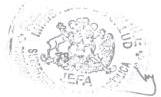
101. Garg P, Ha M, Eastwood J, Harvey S, Woolfenden S, Murphy E, et al. Health professional perceptions regarding screening tools for developmental surveillance for children in a multicultural part of Sydney, Australia. BMC Fam Pr. 2018;19(1):42.

102. Jaeger F, Kiss L, Hossain M, Zimmerman C. Migrant-friendly hospitals: a paediatric perspective - improving hospital care for migrant children. BMC Health Serv Res. 2013;13(1):389.

103. Schlecht J, Lee C, Kerner B, et al. Prioritizing programming to address the needs and risks of very young adolescents: a summary of findings across three humanitarian settings. Confl Health [Internet]. 2017;11(31). Disponible en: https://doi.org/10.1186/s13031-017-0126-9

104. Kågesten AE, Zimmerman L, Robinson C, et al. Transitions into puberty and access to sexual and reproductive health information in two humanitarian settings: a cross-sectional survey of very young adolescents from Somalia and Myanmar. Confl Health. 11(24):2017.

105. Garg P, Ha M, Eastwood J, Harvey S, Woolfenden S, Murphy E, et al. Explaining culturally and linguistically diverse (CALD) parents' access of healthcare services for developmental surveillance and anticipatory guidance: qualitative findings from the «Watch Me Grow» study. BMC Health Serv Res. 2017;17(1):228.

106. Equitable access to developmental surveillance and early intervention - understanding the barriers for children from culturally and linguistically diverse (CALD) backgrounds. Health Expect. 2015;18(6):3286-301.

107. Salehi R, Hynie M, Flicker S. Factors associated with access to sexual health services among teens in Toronto: Does immigration matter? J Immigr Minor Health. 2014;16(4):638-45.

108. Pedrero M, Oyarce A. Una metodología innovadora para la caracterización de la situación de salud de las poblaciones indígenas de Chile: limitaciones y potencialidades. Notas Poblac [Internet]. 2009;(89). Disponible en: http://hdl.handle.net/11362/12859

109. CEPAL. Los pueblos indígenas en América Latina. Avances en el último decenio y retos pendientes para la garantía de sus derechos. [Internet]. CEPAL; 2014. Disponible en: https://www.cepal.org/es/publicaciones/37050-pueblos-indigenas-america-latina-avances-ultimo-decenio-retos-pendientes-la

110. Graves T. Psychological acculturation in a tri-ethnic community. South-West J Anthropol. 1967;23:337-50.

111. Redfield R, Linton R, Hercovitts MJ. Memorandum on the study of acculturation. Am Anthropol. 1936;38:149-52.

112. Arandia, G, et al. Associations between acculturation, ethnic identity, and diet quality among U.S. Hispanic/Latino Youth: Findings from the HCHS/SOL Youth Study. Appetite. 2018;129:25-36.

113. Moise RK, et al. The use of cultural identity in predicting health lifestyle behaviors in Latinx immigrant adolescents. Cult Divers Ethn Minor Psychol. 2019;25(3):371-8.

76
114. Targeting family functioning, acculturative stress, and sugar-sweetened beverage consumption for obesity prevention: findings from the Hispanic community children's health study/study of Latino youth. BMC Public Health. 2020;20(1):1546.

115. Simmons S, Limbers CA. Acculturative stress and emotional eating in Latino adolescents. Eat Weight Disord. 2019;24(5):905-914.

116. Garcia ML, et al. Engaging Intergenerational Hispanics/Latinos to Examine Factors Influencing Childhood Obesity Using the PRECEDE-PROCEED Model. Matern Child Health J. 2019;23(6):802-810.

117. The Influence of Parental Education on Dietary Intake in Latino Youth. J Immigr Minor Health. 2018;20(1):250-254.

118. Johansen CM, et al. Acculturation and sugar-sweetened beverage consumption among Hispanic adolescents: The moderating effect of impulsivity. Appetite. 2019;134:142-147.

119. Juárez-Ramírez C, et al. The importance of the cultural dimension of food in understanding the lack of adherence to diet regimens among Mayan people with diabetes. Public Health Nutr. 2019;22(17):3238-3249.

120. Correa-Matos. N, et al. Development and Application of Interactive, Culturally Specific Strategies for the Consumption of High-fiber Foods in Puerto Rican Adolescents. Ecol Food Nutr. 2020;59(6):639-655.

121. Cabrera-Araujo ZM, et al. Opiniones de adolescentes sobre el Plato del Bien Comer Maya como herramienta de promoción de la salud. Salud Pública México. 2019;61:72-77.

122. Fuster M, et al. It's Sort Of, Like, in My Family's Blood": Exploring Latino Pre-adolescent Children and Their Parents' Perceived Cultural Influences on Food Practices. Ecol Food Nutr. 2019;58(6):620-636.

123. Carrasco AM, Gavilán V, Vigueras P, Vásquez MB. Significados de las prácticas sexuales entre aymara chilenos. Aportes para reflexionar sobre los cuidados transculturales. Antropol Sur. 2021;8(15):23-32.

124. Barral RL, et al. Knowledge, Beliefs, and Attitudes About Contraception Among Rural Latino Adolescents and Young Adults. J Rural Health. 2020;36(1):38-47.

125. Eversole JS, et al. Source of Sex Information and Condom Use Intention Among Latino Adolescents. Health Educ Behav. 2017;44(3):439-447.

126. Gabbidon KS, Shaw-Ridley M. Sex Is a sin": Afro-Caribbean Parent and Teen Perspectives on Sex Conversations. J Immigr Minor Health. 2018;20(6):1447-57.

127. Galloway CT, et al. Exploring African-American and Latino Teens' Perceptions of Contraception and Access to Reproductive Health Care Services. J Adolesc Health. 2017;60(3):57-62.

128. Fleming PJ, et al. The Association Between Men's Concern About Demonstrating Masculine Characteristics and Their Sexual Risk Behaviors: Findings from the Dominican Republic. Arch Sex Behav. 2018;47(2):507-15.

129. Giménez-García C, et al. Why Do Young Hispanic Women Take Sexual Risks? Psychological and Cultural Factors for HIV Prevention. J Assoc Nurses AIDS Care. 2018;29(5):762-769.

130. Morales A, et al. Adaptation of an effective school-based sexual health promotion program for youth in Colombia. Soc Sci Med. 2019;222:207-15.

131. Gerend MA, et al. Predictors of Human Papillomavirus Vaccine Completion Among Low-Income Latina/o Adolescents. J Adolesc Health. 2019;64(6):753-762.

132. Atherton OE, et al. The development of externalizing symptoms from late childhood through adolescence: A longitudinal study of Mexican-origin youth. Dev Psychol. 2018;54(6):1135-1147.

133. Perreira KM, et al. Stress and Resilience: Key Correlates of Mental Health and Substance Use in the Hispanic Community Health Study of Latino Youth. Lat Youth J Immigr Minor Health. 2019;21(1):4-13.

134. Raymond-Flesch M, et al. Family and School Connectedness Associated with Lower Depression among Latinx Early Adolescents in an Agricultural County. Am J Community Psychol. 2021;68(1-2):114-127.

135. Safa MD, et al. U.S. Mexican-origin adolescents' bicultural competence and mental health in context. Cult Divers Ethn Minor Psychol. 2019;25(2):299-310.

136. Nair RL, et al. Acculturation Gap Distress among Latino Youth: Prospective Links to Family Processes and Youth Depressive Symptoms, Alcohol Use, and Academic Performance. J Youth Adolesc. 2018;47(1):105-120.

137. Lorenzo-Blanco EI, et al. Latino parent acculturation stress: Longitudinal effects on family functioning and youth emotional and behavioral health. J Fam Psychol. 2016;30(8):966-76.

138. Lorenzo-Blanco EI, et al. Cultural Stress, Emotional well-being, and Health Risk Behaviors among Recent Immigrant Latinx families: The Moderating Role of Perceived Neighborhood Characteristics. J Youth Adolesc. 2019;48(1):114-31.

139. Gudiño OG, et al. Violence Exposure and Psychopathology in Latino Youth: The Moderating Role of Active and Avoidant Coping. Child Psychiatry Hum Dev. 2018;49(3):468-479.

140. McCord AL, et al. Cultural Stressors and Depressive Symptoms in Latino/a Adolescents: An Integrative Review. J Am Psychiatr Nurses Assoc. 2019;25(1):49-65.

141. Meca et al. Examining the Directionality Between Identity Development and Depressive Symptoms Among Recently Immigrated Hispanic Adolescents. J Youth Adolesc. 2019;48(11):2114-2124.

78
142. Piña-Watson B, Abraído-Lanza. AF. The intersection of Fatalismo and pessimism on depressive symptoms and suicidality of Mexican descent adolescents: An attribution perspective. Cult Divers Ethn Minor Psychol. 2017;23(1):91-101.

143. Piña-Watson B, et al. Caregiver-Child Relationship Quality as a Gateway for Suicide Risk Resilience: Don't Discount the Men in Mexican Descent Youths' Lives. Arch Suicide Res. 2020;24(2):391-402.

144. Smokowski PR, et al. Family dynamics and aggressive behavior in Latino adolescents. Cult Divers Ethn Minor Psychol. 2017;23(1):81-90.

145. Urzúa A, et al. Rooting mediates the effect of stress by acculturation on the psychological well-being of immigrants living in Chile. PLoS One. 2019;14(8).

146. Gómez-Restrepo C, et al. Mental Health, Emotional Suffering, Mental Problems and Disorders in Indigenous Colombians. Data From the National Mental Health Survey 2015. Rev Colomb Psiquiatr. 2016;45(1):119-126.

147. Chomat AM, et al. Women's circles as a culturally safe psychosocial intervention in Guatemalan indigenous communities: a community-led pilot randomised trial. BMC Womens Health. 2019;19(1):53.

148. Lorenzo-Blanco EI, et al. Alcohol use among recent immigrant Latino/a youth: acculturation, gender, and the Theory of Reasoned Action. Ethn Health. 2016;21(6):609-627.

149. Ma M, et al. Cultural Assets and Substance Use Among Hispanic Adolescents. Health Educ Behav. 2017;44(2):326-331.

150. Martinez MJ, et al. The Relationship Between Acculturation, Ecodevelopment, and Substance Use Among Hispanic Adolescents. J Early Adolesc. 2017;37(7):948-974.

151. Rogers CJ, et al. Associations between network-level acculturation, individual-level acculturation, and substance use among Hispanic adolescents. J Ethn Subst Abuse. 2020;1-18.

152. Nagoshi JL. Accounting for linguistic acculturation, coping, antisociality and depressive affect in the gender role-alcohol use relationship in Mexican American adolescents: a moderated mediation model for boys and girls. J Ethn Subst Abuse. 2020;1-23.

153. Meca A, et al. Alcohol initiation among recently immigrated Hispanic adolescents: Roles of acculturation and sociocultural stress. Am J Orthopsychiatry. 2019;89(5):569-578.

154. Pizarro KW, et al. The Social Ecology of Parental Monitoring: Parent-Child Dynamics in a High-Risk Peruvian Neighborhood. Fam Process. 2021;60(1):199-215.

155. Morales-Alemán MM, et al. I Don't Like Being Stereotyped, I Decided I Was Never Going Back to the Doctor": Sexual Healthcare Access Among Young Latina Women in Alabama. J Immigr Minor Health. 2020;22(4):645-52.

79
156. Peterson-Burch FM, et al. Cultural understanding, experiences, barriers, and facilitators of healthcare providers when providing preconception counseling to adolescent Latinas with diabetes. Res J Womens Health. 2018;5.

157. ONU. Convención internacional sobre la eliminación de todas las formas de discriminación racial [Internet]. 1965. Disponible en: https://www.ohchr.org/sp/professionalinterest/pages/cerd.aspx

158. OIT. Convenio 169 de la OIT sobre Pueblos Indígenas y Tribales en países independientes, [Internet]. 1989. Disponible en: https://www.ilo.org/wcmsp5/groups/public/---americas/---ro-lima/documents/publication/wcms_345065.pdf

159. ONU. Declaración de las Naciones Unidas sobre los Derechos de los Pueblos Indígenas. Resolución aprobada por la Asamblea General, 13 de septiembre de 2007. [Internet]. 2007. Disponible en: https://www.un.org/esa/socdev/unpfii/documents/DRIPS_es.pdf

160. ONU, Comité de Derechos Económicos S y C. Observación general N° 14: El derecho al disfrute del más alto nivel posible de salud [Internet]. 2000. Disponible en: https://www.acnur.org/fileadmin/Documentos/BDL/2001/1451.pdf

161. OMS. Salud de los migrantes, Informe de la Secretaría, los flujos migratorios y el mundo globalizado [Internet]. 2008. Disponible en: http://apps.who.int/gb/archive/pdf_files/A61/A61_12-sp.pdf%0Ahttps://www.healthcare.gov/choose-a-plan/plan-types/

162. CEPAL, CELADE. Consenso de Montevideo sobre población y desarrollo [Internet]. 2013. Disponible en: https://www.cepal.org/es/publicaciones/21835-consenso-montevideo-poblacion-desarrollo.

163. OPS. CD55/11, Rev. 1 - La salud de los migrantes [Internet]. 2016. Disponible en: https://www.paho.org/hq/dmdocuments/2016/CD55-11-s.pdf

164. OMS. Promoción de la salud de refugiados y migrantes Proyecto de plan de acción mundial, 2019-2023 Informe del Director General. [Internet]. 2019. Disponible en: http://www.iom.sk/en/about-migration/migration-in-the-world

165. MINSAL. Orientaciones técnicas. Programa especial de salud y pueblos indígenas. Guía metodológica para la gestión del programa. [Internet]. 2016. Disponible en: : http://www.bibliotecaminsal.cl/wp/wp-content/uploads/2018/01/030.OT-y-Guia-Pueblos-indigenas.pdf

166. MINSAL. Ley N° 19.937 que modifica el D.L. N° 2.763, de 1979, con la finalidad de establecer una nueva concepción de la autoridad sanitaria, distintas modalidades de gestión y fortalecer la participación ciudadana [Internet]. 2004. Disponible en: https://www.leychile.cl/navegar?idNorma=221629

167. Ministerio Secretaría General de Gobierno. Ley N° 20.609 [Internet]. 2012. Disponible en: https://www.bcn.cl/leychile/navegar?idNorma=1042092

80
168. MINSAL. Decreto Exento N°643. 2016 [Internet]. 2016. Disponible en: https://repositoriodeis.minsal.cl/ContenidoSitioWeb2020/EstandaresNormativa/Decreto-Exento-643-Sustituye-Norma-T%C3%A9cnica-sobre-Est%C3%A1ndares-de-Informaci%C3%B3n-de-Salud-Actualizada-a-Dic-2016.pdf

