# INFORME DIAGNOSTICO
## SITUACIÓN DE SALUD DE LOS PUEBLOS ORIGINARIOS EN CHILE

Departamento de Epidemiología

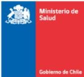
**Ministerio de Salud  
Subsecretaría de Salud Pública  
Departamento de Epidemiología  
Mac Iver 541, Santiago**

# **Cómo citar este documento**

Ministerio de Salud, Situación de salud de los pueblos originarios en Chile (2018). Santiago de Chile

2
# Contenido

1. ANTECEDENTES GENERALES... 4
2. CARACTERIZACIÓN SOCIODEMOGRÁFICA DE PUEBLOS ORIGINARIOS... 4
Figura 1: Porcentaje de población que pertenece a pueblos originarios, Censo 2017... 5
Figura 2 Porcentaje de población que pertenece a pueblos originarios por sexo, Censo 2017... 5
Figura 3: Estructura etaria de pueblos originarios, según Censo 2017... 6
3. DETERMINANTES SOCIALES DE LA SALUD ... 6
Figura 4: Incidencia de la pobreza en la población por pertenencia a pueblos indígenas, CASEN 2006-2017 ... 7
Figura 5: Perfil de educación formal por pertenencia a pueblos indígenas, CASEN 2017 ... 8
Figura 7: Distribución de la población según situación de afiliación a sistema de salud por pertenencia a pueblo indígena CASEN 2017... 10
Figura 8: Distribución de la población que declara haber tenido alguna necesidad de atención en salud en los últimos tres meses según acceso y experiencia reportada por pertenencia a pueblo indígena, CASEN 2017... 11
Tabla 1 Población bajo control. Casen 2017/ ENS 2016-2017. ... 12
4. PERFIL EPIDEMIOLÓGICO ... 12
Tabla 2. Prevalencias de principales Enfermedades Crónicas no Transmisibles. ENS 2016-2017. ... 14
5. FACTORES DE RIESGOS Y ESTILOS DE VIDA... 14
Tabla 3 Consumo de alcohol riesgoso según sexo. ENS 2016-2017... 15
6. ESTRADO NUTRICIONAL ... 15
Figura 9. Estado nutricional, ENS 2016-2017... 16
Tabla 4. Estado nutricional por sexo ENS 2016-2017 ... 17
Tabla 5. Consumo de alimentos ENS 2016-2017 ... 18
7. BIBLIOGRAFÍA ... 20
8. Anexos ... 21

3
# 1. ANTECEDENTES GENERALES

La evolución del sistema de salud en Chile a partir de su historia reciente, ha implicado importantes desafíos en torno a bordar la salud integral de las personas y grupos prioritarios de la sociedad. Los pueblos originarios constituyen en sí un grupo prioritario a la hora de abordar la salud desde un enfoque intercultural considerando en la organización y provisión de atención en la Red Asistencial de Servicios de Salud, en materia de acceso y calidad, en la adecuación de los programas del sector salud (1). Implicando desafíos cruciales para el sistema, como lo son la disminución de brechas sociales y la inclusión de la cosmovisión cultural dentro del sistema sanitario.

El presente informe tiene por objetivo, presentar un análisis descriptivo, de fuentes secundarias, respecto a la situación de salud y epidemiológica de los 9 pueblos originarios reconocidos por la ley indígena nº 19.253 (1993); Alacalufe (Kawashkar), Atacameño, Aymara, Colla, Diaguita, Mapuche, Quechua, Rapa Nui, Yámana (yagán1) .(2) Para este análisis de datos se realizaron análisis a partir del Censo 2017, la Encuesta Nacional de Salud 2016-17, la Encuesta Casen 2017 y Registros administrativos disponibles en el Departamento de Estadísticas e Información en Salud (DEIS) donde estuviera identificada la variable auto identificación étnica, dado a que, a partir del 2007, el MINSAL incorporó esta variable en los registros de notificación epidemiológica, egresos hospitalarios, registros administrativos mensuales (REM), etc. A la fecha esta herramienta, aún no se implementa efectivamente en los registros regulares, lo cual limita la capacidad de realizar mayores análisis para esta población de estudio. Asimismo, recalcar que la ENS no es una encuesta representativa por diseño muestral, a nivel de pueblos originarios, por tanto, la información analizada debe ser interpretada desde un análisis descriptivo de la situación de salud de los pueblos originarios.

# 2. CARACTERIZACIÓN SOCIODEMOGRÁFICA DE PUEBLOS ORIGINARIOS

En Chile, un 12,8% de la población se considera perteneciente a un pueblo indígena u originario, lo que corresponde a 2.185.732 personas en todo el territorio nacional según datos del Censo de Población y Vivienda 2017, desarrollado por el Instituto Nacional de Estadísticas (INE)(3).

El pueblo más numeroso es el pueblo mapuche, que identifica al 79,8% de las personas. Le sigue los Aymara (7,2%), diaguita (4%), Quechua (1,5%), Lican Antai (1,4%), colla (0,9%), Rapa Nui (0,4%), Kawésqar (0,2%) y Yámana (0,1%)

$^{1}$ La ley reconoce a los pueblos indígenas como “etnias” definiéndolas como “descendientes de las agrupaciones humanas que existen en el territorio nacional desde tiempos precolombinos, que conservan manifestaciones étnicas y culturales propias siendo para ellos la tierra el fundamento principal de su existencia y cultura” (Ministerio de Desarrollo Social, 2013).

4
Figura 1: Porcentaje de población que pertenece a pueblos originarios, Censo 2017

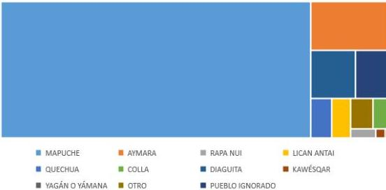

Fuente: Censo de Población y Vivienda 2017. Instituto Nacional de Estadísticas (INE).

Del total de población que pertenece a pueblos originarios, el 49,3% son hombres (que corresponde a 1.078.111 personas) y un 50,7% son mujeres (que correspondiente a unas 1.107.681 personas). Esta proporción de mayor cantidad de mujeres se mantiene en los pueblos Mapuche, Aymara, Rapa Nui, Lican Antai, Quechua y Diaguita. Se observa la situación contraria en los pueblos Colla (49,7% de mujeres) y Kawésqar (46% de mujeres).

Figura 2 Porcentaje de población que pertenece a pueblos originarios por sexo, Censo 2017.

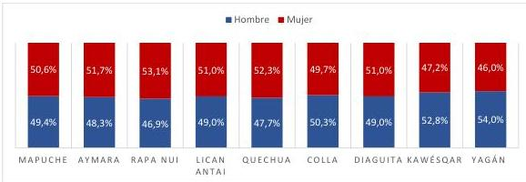

Fuente: Censo de Población y Vivienda 2017. Instituto Nacional de Estadísticas (INE).

5
En relación a la edad de la población, se observa una estructura piramidal con base estable. Es así como, el 47% de la población es joven -menor a 30 años-, y un 13,5% está por sobre los 60 años. Esta estructura de rangos de edad se mantiene similar para la mayoría de los pueblos, con excepciones en el pueblo quechua, Yámana y Kawésqar, en donde la proporción de menores de 19 años es bastante menor.

Figura 3: Estructura etaria de pueblos originarios, según Censo 2017.

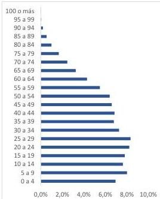

### 3. DETERMINANTES SOCIALES DE LA SALUD

Siguiendo con las recomendaciones de la OMS, es que desde el año 2009, Chile incorpora dentro del eje central de las políticas de salud los Determinantes sociales de la salud, que son circunstancias en que las personas nacen, crecen, viven, trabajan y envejecen, incluido el sistema de salud (4). El análisis de la información, responde a conocer la situación de salud de una comunidad, grupo o territorio, identificando la magnitud del daño, aproximándose a sus causas y a la exposición sistemática y diferencial a riesgos en salud de algunas poblaciones, en este caso, la situación de salud, y social de la población indígena en Chile.

Según la encuesta Casen 2017 (5) la situación de pobreza y pobreza extrema por ingresos, un 14,5% de la población indígena se encuentra en situación de pobreza o pobreza extrema, en comparación con un 8% de la población que no se identifica como pueblo indígena. De éste 14,5%, un 10,5% corresponde a población pobre y un 4% a población en pobreza extrema.

6
Desde el año 2006 se observa una reducción constante y sostenida en el porcentaje de población en situación de pobreza en el país. Alrededor de un 30% de la población indígena ha salido de la situación de pobreza en los últimos 11 años. Sin embargo, se observa una brecha en relación a la población no indígena importante que, si bien ha ido disminuyendo en los últimos años, todavía es considerable e importante abordar.

Figura 4: Incidencia de la pobreza en la población por pertenencia a pueblos indígenas, CASEN 2006-2017

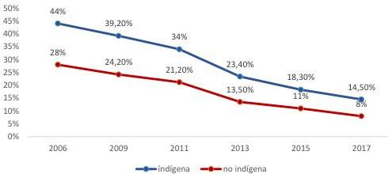

Fuente: Encuesta de Caracterización Socioeconómica Nacional 2017. Ministerio de Desarrollo Social

En relación a la incidencia de la pobreza y pobreza extrema en los hogares por pertenencia del jefe/a de hogar a pueblos indígenas se observa que un 12,5% de los hogares con jefatura indígena se encuentran en situación de pobreza por ingresos, de los cuales un 3,8% corresponden a pobreza extrema y un 8,7% a pobreza no extrema. De nuevo, la diferencia con los hogares no indígenas es de casi 5 puntos porcentuales, pues los hogares con jefatura no indígena son pobres en un 7,2%. Desde el año 2006 se observa el mismo patrón que con personas, una baja constante y sostenida del porcentaje de hogares pobres, pero manteniendo una brecha entre hogares con jefatura indígena y hogares sin jefatura indígena considerable.

En relación a pobreza multidimensional, se observa una mantención en el porcentaje de población en situación pobreza en el período 2015 – 2017 (30,8% y 30,2%) de pueblos indígenas en comparación con un 19% de población no indígena (en ambos períodos). La brecha es estadísticamente significativa. Se observa el mismo fenómeno en la cantidad de hogares en pobreza multidimensional en donde el jefe de hogar pertenece a pueblos indígenas. Para el año 2017 la brecha era de 10 puntos porcentuales.

En términos de la educación, los años promedio de escolaridad de la población de 15 años o más por pertenencia a pueblos indígenas es de 10,3 s y 11,2 para personas no indígenas con diferencias estadísticamente significativas entre grupos.

Respecto al perfil educacional de la población perteneciente a pueblos indígenas, CASEN 2017 muestra que aún persisten diferencias desfavorables importantes en desmedro de los

7
pueblos indígenas del país. Es así como se observa una mayor proporción de personas indígenas con educación básica incompleta. El 23,9% de la población no indígena del país tiene educación básica completa o menos años de escolaridad, mientras que el 32,3% de la población que pertenece a un pueblo indígena posee educación básica completa o menos años de escolaridad. De igual manera, la proporción de población indígena que logra completar sus estudios es menor que la de la población no indígena (ver figura 5)

Figura 5: Perfil de educación formal por pertenencia a pueblos indígenas, CASEN 2017

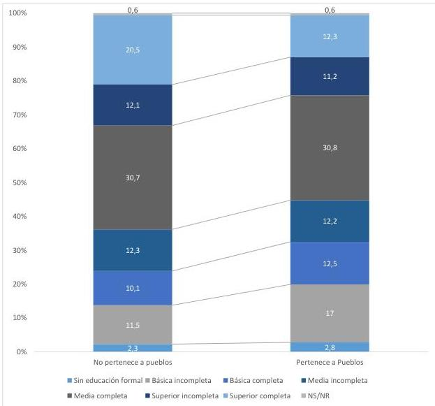

Fuente: Encuesta de Caracterización Socioeconómica Nacional 2017. Ministerio de Desarrollo Social

La tasa de participación laboral es el porcentaje de la fuerza de trabajo o población económicamente activa (ocupados y desocupados) con respecto a la población total de 15 años

8
o más. Entre los años 2015 y 2017 se presenta diferencias significativas en la tasa de participación de los no indígenas (58,4% a 59,6%), no así en la tasa de participación de población pertenecientes a pueblos indígenas (57,33% a 58%). Sin embargo, si se observan diferencias significativas entre pueblos indígenas y población que no pertenece a los pueblos para el año 2017, con menor porcentaje de participación laboral de las personas pertenecientes a pueblos indígenas.

La tasa de ocupación refiere al porcentaje de la población ocupada con respecto a la población en edad de trabajar de 15 o más años. Esta tasa presenta un aumento paulatino desde el año 2009 al 2017, llegando a un 54,8% de la población. Se observan diferencias significativas en desmedro de la población indígena del país, con una tasa de ocupación laboral de 53,2% comparada con un 54,9% de la población no indígena.

La tasa de desocupación refiere al porcentaje de la población desocupada (cesantes y personas que buscan trabajo por primera vez de 15 años y más con respecto a la fuerza de trabajo (población económicamente activa; ocupados y desocupados). La tasa presenta una disminución desde el 2009 a la fecha con un aumento en el período 2013 – 2017, llegando a un 7,9% de la fuerza de trabajo. En el caso de la población perteneciente a pueblos indígenas, la tasa de desocupación presenta diferencias significativas comparadas con la no indígena, llegando a un 8,3% de la población indígena.

Respecto a la distribución de la población según situación de afiliación a sistema previsional de salud por pertenencia a pueblo indígena se observan diferencias significativas en todas sus categorías, con excepción de “no sabe”. Se observa una mayor proporción de población indígena que pertenece a Fonasa (86,4% comparados con 77,2%) y a ningún sistema previsional (1,8% vs 2%) y, por consiguiente, una menor proporción que pertenece a ISAPRES (7,4% vs 15,1%) y FFAA y de orden y otros sistemas (2,1% vs 2,8%).

9
Figura 7: Distribución de la población según situación de afiliación a sistema de salud por pertenencia a pueblo indígena CASEN 2017.

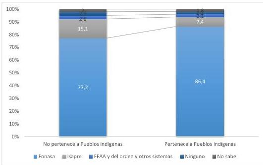

Fuente: Encuesta de Caracterización Socioeconómica Nacional 2017. Ministerio de Desarrollo Social

La tasa de atención médica ante un problema de salud (número de personas que tuvieron atención médica ante un problema de salud, enfermedad o accidente experimentado en los últimos 3 meses por cada 100 personas que tuvieron una enfermedad o accidente en los últimos tres meses) no presenta diferencia entre personas que pertenecen a pueblos indígenas y personas que no pertenecen a pueblos indígenas (92,6% y 93,6%), así como tampoco presenta diferencias estadísticamente significativas entre el año 2015 y el 2017.

Por otro lado, el porcentaje de la población que declara haber tenido algún problema para obtener atención (habiendo recibido atención médica) baja de un 31,7% a un 25,3% en el total de la población en el período 2015-2017. Esta baja se expresa en ambos grupos de población, con una menor disminución en pueblos indígenas que en población no indígena, 31,1% a 24,9% en población indígena y de un 38% a 29,5% en población que no pertenece a pueblos indígenas. Entre los problemas que se declaran tanto en población indígena como no indígena, las dos más frecuentes son (i) problemas para ser atendidos en el establecimiento (demora en la atención, cambios de hora, etc.), y (ii) para conseguir una cita / atención / hora. Sin embargo, hay diferencias estadísticamente significativas entre poblaciones en desmedro de los pertenecientes a pueblos originarios. Es así como, 20,5% de las personas que pertenecen a pueblos originarios tuvieron problemas para acceder a una atención para ser atendidos en el establecimiento de salud comparados con 15,9% de la población no indígena, y un 15,9% de la

10
población perteneciente a pueblos indígenas tuvo problemas para conseguir hora comparados con un 12,5% de población no indígena.

La experiencia reportada de la población que necesitó atenderse presenta diferencias significativas entre población indígena y no indígena en la que respecta a quienes accedieron a la atención médica. Una mayor proporción de personas indígenas reportan haber encontrado dificultades de acceso (27,5% vs 23,5% de personas no indígenas) y, por el contrario, menor proporción en no haber encontrado problemas para acceder a atenciones de salud (65,7% vs 71%). No se observan diferencias estadísticamente significativas entre la población que no accedió a atención médica independiente de sus razones.

Figura 8: Distribución de la población que declara haber tenido alguna necesidad de atención en salud en los últimos tres meses según acceso y experiencia reportada por pertenencia a pueblo indígena, CASEN 2017.

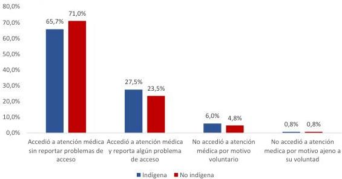

Fuente: Encuesta de Caracterización Socioeconómica Nacional 2017. Ministerio de Desarrollo Social

Por último, en relación a prestaciones de salud particulares, el porcentaje de niños y niñas de 0 a 9 años que se realizaron el control del niño sano en los últimos 3 meses es de 32,7% para todos los niños, no encontrándose diferencias significativas entre niños indígenas y no indígenas. Según la Encuesta Nacional de Salud 2016-2017(6) ocurre lo mismo con el porcentaje de mujeres que se realizaron un PAP en los últimos tres años (60,7% de la población) y una mamografía en los últimos 3 años (32,8%), no encontrándose diferencias estadísticamente significativas entre poblaciones.

11
Tabla 1 Población bajo control. Casen 2017/ ENS 2016-2017.

|  Prevalencia | Prevalencia (%) (IC 95%) Población expandida (n muestral)  |   |   |
| --- | --- | --- | --- |
|   |  Fuente | Pertenece a un pueblo originario | No pertenece a un pueblo originario  |
|  Control niño sano | CASEN 2017 | 67,9 (65,7 – 70,1) | 67,7 (66,4 – 68,9)  |
|   |   |  192.524 (2.909) | 1.336.529 (15.455)  |
|  Realización mamografía | ENS 2016-17 | 29,9 (23,1 – 37,8) | 33 (29,8 – 36,4)  |
|   |   |  174.621 (129) | 2.207.687 (1.125)  |
|  Realización de PAP | ENS 2016-17 | 57,7 (49,1 – 65,9) | 60,9 (58 – 63,8)  |
|   |   |  336.639 (249) | 4.075.280 (1780)  |

*Elaboración propia. Departamento de Epidemiología*

#### 4. PERFIL EPIDEMIOLÓGICO

El propósito de la vigilancia epidemiológica es entregar información que permita orientar la toma de decisiones y la planificación de estrategias de prevención y control en salud pública, es por esto, que un análisis de situación epidemiológica se constituye bajo una herramienta esencial para el control y disminución de brechas sanitarias. El perfil epidemiológico que presentan los pueblos indígenas, desde una perspectiva intercultural de la salud, implica que la atención de salud esté focalizada en los grupos en riesgo, posibilitando el hallazgo de evidencia que determinen barreras económicas, geográficas, culturales y/o de organización del sistema de atención. La vigilancia epidemiológica se constituye bajo una notificación obligatoria, diaria y universal, donde la variable de pertenencia a pueblos originarios es una herramienta de levantamiento de información.

A partir de antecedentes epidemiológicos en Chile, se han observado diferencias entre la población perteneciente a un pueblo originario en comparación con la población general, donde en el perfil morbi-mortalidad destacan problemas de salud sobre enfermedades transmisibles como no transmisibles, entre ellas, destacan la tuberculosis, alcoholismo desde una perspectiva de salud mental, las enfermedades parasitarias e infecciosas, además de los problemas asociados al trabajo por las deficientes condiciones en que desarrollan su actividad laboral y problemas de salud mental, expresado en altas tasas de suicidio(8).

De acuerdo a la información disponible, el 3,6% de total de casos notificados por VIH en el quinquenio 2013-2017, declararon pertenecer a un pueblo originario. Respecto al total de casos notificados por Gonorrea para el mismo quinquenio, el 0,4 % de los casos declaró pertenecer a un pueblo originario. En tanto, para el quinquenio 2013-2017, un 0,3% de casos por Sífilis que declararon pertenecer a un pueblo originario. Para Hepatitis B, para el mismo quinquenio, el 0,2% de los casos notificados declaró pertenecer a un pueblo originario. Según datos arrojados por la

12
Encuesta Nacional de Salud (ENS) 2016-17 un 13,5% (9,3-19,2) de las personas que dicen pertenecer a un pueblo originario han ocupado *siempre* condón o preservativo en los últimos 12 meses, cifra superior en comparación con las personas que reportaron no pertenecer a un pueblo originario y que siempre ocuparon preservativo o condón en los últimos 12 meses 10,2% (8,6-11,9) (9).

Respecto a la situación epidemiológica de la tuberculosis, al ser una enfermedad endémica, al no lograr aún una incidencia menor al 10 por 100.000 habitantes en Chile a nivel población. En particular, para pueblos indígenas la tasa de incidencia reportada para el año 2017 fue de 2,5 por 100.000 habitantes, mientras que el año 2016 la tasa de incidencia fue 4,2. A partir de este análisis surge los perfiles de los pacientes que padecen de tuberculosis entre las distintas zonas geográficas. Grupos de riesgo para la región de La Araucanía y Arica y Parinacota.

Similar situación ocurre en la enfermedad de Chagas, causada por un parásito llamado tripanosoma cruzi, el cual es transmitido a personas a través de vectores insectarios, principalmente por el Triatoma infestans, o “vinchuca”. En el caso de los pueblos originarios, hay que considerar el acceso a una atención médica, lugar geográfico, frecuencia de consulta y la confianza en el sistema, de los cuales surgen hipótesis que en muchos casos pueden ser reacios a consultar. Por otro lado, la variable de pertenencia a pueblo originario, no siempre es preguntada por el personal clínicos y suele omitirse, por tanto, estos grupos están sub representados. Respecto a los datos arrojados por la notificación, el año 2018, hasta la semana 28, se han notificado 8 casos en población Aimara 2, residentes en la I región, zona endémica del vector (vinchuca)(11).

En tanto, la presencia de enfermedades crónicas no transmisibles (ENT), nos indican el daño en la salud de la población y el envejecimiento prematuro de ésta, representando la principal carga de enfermedad y muerte. Las ENT de larga duración y por lo general de progresión lenta, como la diabetes y la hipertensión arterial, y como paso posterior a estas la presencia de síndrome metabólico y riesgo cardiovascular (12).

En este mismo contexto y en base a la información reportada en la ENS 2016-17, las prevalencias son similares en las personas que pertenecen a pueblos originarios y la población general.

Respecto a la presencia de diabetes mellitus, las prevalencias son similares entre las personas que pertenecen a pueblos y la población general (11,5 y 12,5 respectivamente), en cuanto a la presencia de hipertensión arterial, la prevalencia es levemente más baja en las personas que pertenecen a pueblos originarios, aunque esta diferencia no es estadísticamente significativa. Situación similar ocurre con la presencia de síndrome metabólico donde las personas que pertenecen a pueblos tienen una proporción menor que la población general (37,5 y 41,1 respectivamente).

Uno de los indicadores más importantes para presentar la carga de enfermedad crónica en la población es el Riego Cardiovascular en su nivel más alto, en este aspecto la presentación en la

2 Casos notificados anuales de enfermedad de Chagas (B57; Z22.8 y P00.2) según pertenecía a pueblos originarios. Chile 2007-2018. Base de datos ENO. Departamento de Estadística e Información en Salud (DEIS). Ministerio de Salud.

13
población que pertenece a pueblos originarios con un 24,2% y en población general este indicador es de 23,7%.

Tabla 2. Prevalencias de principales Enfermedades Crónicas no Transmisibles. ENS 2016-2017.

|  Variables | Encuesta Nacional de Salud (ENS) 2016-17  |   |
| --- | --- | --- |
|   |  Prevalencia (%) (IC 95%)  |   |
|   |  Población expandida (n muestral)  |   |
|  Prevalencia | Pertenece a un pueblo originario | Población general  |
|  Sospecha de diabetes | 11,5(7,7-16,8) | 12,5(11,3-14,0)  |
|   |  134.712.248(79) | 1.703.375.974(877)  |
|  Sospecha de Hipertensión arterial | 20,9(15,5-27,6) | 27,6(25,7-29-7)  |
|   |  263.612.115(158) | 4.004.956.962(2000)  |
|  Síndrome metabólico | 37,5(29,8-45-9) | 41,1(38,2-44,1)  |
|   |  298.071.482(157) | 3.779.953.464(1574)  |
|  Riesgo Cardiovascular (RCV) Alto | 24,2 (17,1-33,2) | 23,7(21,4-26-1)  |
|   |  198.525.357(97) | 2.179.220.378(1092)  |

Fuente: Encuesta Nacional de Salud 2016-2017. Departamento de Epidemiología. Ministerio de Salud

## 5. FACTORES DE RIESGOS Y ESTILOS DE VIDA

### Consumo de alcohol

Estudios antropológicos han descrito en la literatura como el consumo de alcohol tiene una connotación asociada a la integración social y cultural, implicando que el consumo de alcohol no sea visto como un problema de salud mental (Menéndez, 1990)$^{3}$. Según la Encuesta Nacional de Salud (ENS) 2016-17, el consumo de alcohol riesgoso en población general reportado es de 11,7%, mientras que, al realizar la comparación con la población que dice pertenece a uno de los 9 pueblos originarios, la prevalencia de consumo riesgoso de alcohol asciende a un 13,8%. Similar fenómeno se da al realizar el análisis por sexo (ver tabla 3). Las practicas asociadas al consumo a la luz de los

$^{3}$ Menéndez, Eduardo. Morir de alcohol. Saber y hegemonía médica. Alianza Editorial Mexicana, 1990.

14
datos nos aportan información para abordar la problemática, entendiendo que el consumo riesgoso de alcohol se constituye como un problema en salud pública a partir de las prácticas y las dinámicas culturales propias de estos pueblos, pero también de la población general, que debe ser abordado por el sistema a partir de la salud mental.

Tabla 3 Consumo de alcohol riesgoso según sexo. ENS 2016-2017.

|  Variables | Encuesta Nacional de Salud (ENS) 2016-17  |   |   |
| --- | --- | --- | --- |
|   |   |  Prevalencia (%) (IC 95%)  |   |
|   |   | Población expandida (n muestral)  |   |
|  Sexo | Consumo de alcohol riesgoso | Pertenece a un pueblo originario | No pertenece a un pueblo originario  |
|  **Hombre** | *Audit mayor a 8 | 25,8(17,6-36,2) | 20,0(17,1-23,2)  |
|   |   |  165.536.957 (48) | 1.296.466.265 (320)  |
|  **Mujer** | Audit mayor a 8 | 1,3(0,6-2,9) | 3,4(2,4-4,9)  |
|   |   |  7.860.334 (14) | 232.787.394(77)  |
|  **Total** | Audit mayor a 8 | 13,8 (9,3-19,9) | 11,7 (10,3-13,3)  |
|   |   |  173.397.290 (62) | 1.702.650.949 (459)  |

* Análisis de resultados de acuerdo a "Test de Identificación de Trastornos Debido al Consumo de Alcohol (AUDIT C)". Puntaje ≥ 8 que considera la categorización de consumo de riesgo (8 a 15 ptos.) y consumo de alto riesgo (≥ 16 ptos.).

Fuente: Encuesta Nacional de Salud 2016-2017. Departamento de Epidemiología. Ministerio de Salud

## 6. ESTRADO NUTRICIONAL

A nivel mundial, el acelerado aumento de la malnutrición por exceso (sobrepeso y obesidad) se ha convertido en una de las principales preocupaciones de los organismos de salud pública. Así, la Organización Mundial de la Salud (OMS) el año 2016 estimó que más de 1.900 millones de adultos presentaban sobrepeso y 650 obesidad, lo que corresponde a un 39% y 13% de la población adulta mundial, respectivamente. Según datos arrojados por la ENS 2016-17, casi el 75% de la población general presenta nivel de malnutrición por exceso de peso, realidad no diferencia con población que dice pertenecer a un pueblo originario. El 36,1% presenta niveles de obeso no mórbido, mientras un 5,9% de obeso mórbido. Resultados estadísticamente significativos si realizamos la comparación entre la población general y las que dicen pertenecer a un pueblo originario. Similar fenómeno se puede apreciar al realizar el análisis por sexo (ver tabla 4)

15
Figura 9. Estado nutricional, ENS 2016-2017.

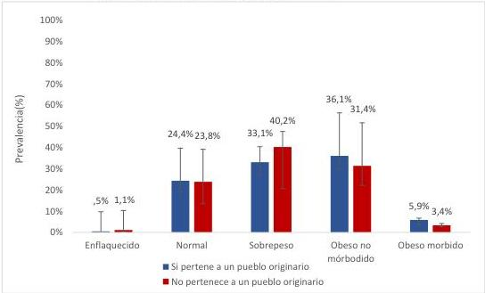

(*) las barras de error representan los intervalos de confianza (IC 95%)

Fuente: Encuesta Nacional de Salud 2016-2017. Departamento de Epidemiología. Ministerio de Salud

16
Tabla 4. Estado nutricional por sexo ENS 2016-2017

|  Variables |   | Encuesta Nacional de Salud (ENS) 2016-17 Prevalencia (%) (IC 95%) Población expandida (n muestral)  |   |
| --- | --- | --- | --- |
|  Sexo | Estado nutricional | Pertenece a un pueblo originario | No pertenece a un pueblo originario  |
|  **Hombre** | Enflaquecido | 1,1 (0,3-3,3) | 1,2 (0,7-2,2)  |
|   |   |  6.646.796 (3) | 86.677.934 (25)  |
|   |  Normal | 25,5 (17,7-35,3) | 24,3 (21,3-27,6)  |
|   |   |  161.363.579 (64) | 1.722.720.506 (490)  |
|   |  Sobrepeso | 36,2 (26,5-47,2) | 43,7 (39,9)  |
|   |   |  229.080.751 (74) | 3.095.357.006 (859)  |
|   |  Obeso no mórbido | 31,6 (22,6-42,2) | 28,9 (25,7-32,2)  |
|   |   |  200.060.691 (69) | 2.046.670.190(584)  |
|   |  Obeso mórbido | 5,6 (2,3-13,2) | 1,9(1,3-2,9)  |
|   |   |  35.755.908 (11) | 136.582.158 (46)  |
|  **Mujer** | Enflaquecido |  | 1,0 (0,5-2,0)  |
|   |   |   | 76.405.616 (26)  |
|   |  Normal | 23,2 (16,9-30,9) | 23,4 (20,9-26,0)  |
|   |   |  143.736.695 (83) | 1.721.420.040 (772)  |
|   |  Sobrepeso | 29,9 (23,5-37,2) | 37 (33,8-40,2)  |
|   |   |  185.298.173 (145) | 2.720.612.763 (1.244)  |
|   |  Obesa no mórbida | 40,7 (32,5-49,4) | 33,9 (30,9-37,0)  |
|   |   |  252.090.862 (167) | 2.494.101.744 (1.263)  |
|   |  Obesa mórbida | 6,2 (3,1-12,0) | 4,7 (3,6-6,2)  |
|   |   |  38.354.847 (22) | 349.320 (174)  |
|  **Total** | Enflaquecido | 0,5 (0,2 - 1,7) | 1,1 (0,7-1,7)  |
|   |   |  6.646.796 (3) | 163.083.549 (51)  |
|   |  Normal | 24,4 (19,0-30,6) | 23,8 (21,8-26,0)  |
|   |   |  305.100.274 (147) | 3.444.140.546 (1.262)  |
|   |  Sobrepeso | 33,1(26,9-39,9) | 40,2 (37,6-42,9)  |
|   |   |  414.378.924 (219) | 5.815.969.769 (2.103)  |
|   |  Obeso no mórbido | 36,1 (29,5-43,3) | 31,4 (37,6-42,9)  |
|   |   |  452.151.553 (236) | 4.540.772 (1.847)  |
|   |  Obeso mórbido | 5,9 (3,4-10,1) | 3,4 (2,7-4,2)  |
|   |   |  74.110.755(33) | 485.901.984 (220)  |

Fuente: Encuesta Nacional de Salud 2016-2017. Departamento de Epidemiología. Ministerio de Salud

17
En base a la información aportada por la ENS 2016-17, el sobrepeso y obesidad en Chile han presentado un comportamiento similar al panorama global descrito por la OMS, organismo que ha catalogado este problema de salud como una epidemia en aumento en los últimos años.

No obstante, es necesario contextualizarlo a partir de como los estilos de vida de las personas y factores de riesgos son elementos centrales para dar respuesta al contexto de la epidemia de malnutrición por exceso en el país.

Según la ENS 2016-2017, el 10,6 % de la población que dice pertenecer a un pueblo originario dice consumir al menos 5 porciones al día, cumpliendo con las recomendaciones realizadas por la OMS respecto al consumo esperado de frutas y verduras. Respecto al consumo de pescados o mariscos, el 10,6% de las personas que dicen pertenecer a un pueblo originario dice consumir al menos 2 veces a la semana, a diferencia del 8,7% de la población general. En tanto, el consumo de legumbres se comporta se comporta de forma similar entre personas que dicen pertenecer a un pueblo originario y los que no.

Tabla 5. Consumo de alimentos ENS 2016-2017

|  Variables | Encuesta Nacional de Salud (ENS) 2016-17  |   |
| --- | --- | --- |
|   |  Prevalencia (%) (IC 95%)  |   |
|   |  Población expandida (n muestral)  |   |
|  Prevalencia | Pertenece a un pueblo originario | No pertenece a un pueblo originario  |
|  Consumo de frutas y verduras al menos 5 porciones al día | 10,6 (7,2-15,2) | 15,6 (13,1-17,6)  |
|   |  133.132 (67) | 2.016.680 (659)  |
|  Consumo de pescado o mariscos de al menos 2 veces a la semana | 10,6 (7,7- 14,6) | 8,7 (7,5-10,2)  |
|   |  134.264 (72) | 1.559.899 (462)  |
|  Consumo de legumbres 2 veces a la semana | 24,5 (19,0-30,8) | 24,3 (22,1-26,5)  |
|   |  308.403 (158) | 3.217.921 (1286)  |

Fuente: Encuesta Nacional de Salud 2016-2017. Departamento de Epidemiología. Ministerio de Salud

Respecto a egresos hospitalarios, según el Departamento de Estadísticas de Salud e Información en Salud (DEIS), para el año 2017 los principales egresos de diagnósticos para personas que se reconocieron como pertenecientes a un pueblo originario fueron el trastorno de vesícula biliar, la influenza y neumonía y las enfermedades crónicas por vías respiratorias (ver figura 2).

18
Figura 10. Egresos hospitalarios, 2017 según 10 primeros grupos diagnósticos

|  K80-K87 Trastornos de la vesícula biliar, de las vías biliares y del páncreas 1.778 | J09-J18 Influenza [gripe] y neumonía 1.522 | J40-J47 Enfermedades crónicas de las vías respiratorias inferiores 621 | I30-I52 Otras formas de enfermedad del corazón 580 | K35-K38 Enfermedades del apéndice 538  |
| --- | --- | --- | --- | --- |
|   |   |  C81-C96 Tumores [neoplasias] malignos del tejido linfático 585 | I80-I89 Enfermedades de las venas y de los vasos y ganglios... | K40-K46 Hernia 464  |
|   |   |   |  I60-I69 Enfermedades cerebrovasculares 471 | C15-C26 Tumores malignos de los órganos digestivos  |

Fuente: Base de datos Egresos Hospitalarios 2017. Departamento de Estadística e Información en Salud (DEIS). Ministerio de Salud

*Se excluyen egresos del capítulo Embarazo, parto y puerperio.

A partir de la información expuesta se hace necesario continuar profundizando el trabajo de los distintos estamentos del Ministerio de Salud en relación a la variable de identificación de la población que pertenece a pueblos indígenas. En este sentido, se espera que se continúe avanzando tanto en los registros administrativos como en los registros de enfermedades de notificación obligatoria, de manera de contar cada día con más y mejor información que permitan caracterizar de manera óptima la situación de salud de los pueblos indígenas, así como los desafíos que enfrentan en términos de su calidad de vida y salud.

19
## 7. BIBLIOGRAFÍA

1. Orientaciones Técnicas para la Elaboración de los Planes Regionales de Salud y Pueblos Indígenas de Seremi de Salud Trienio 2015-2017, Ministerio de Salud.
2. Ley N° 19.253, publicada en el Diario Oficial el 5 de octubre de 1993.
3. Censo de Población y Vivienda 2017. Instituto Nacional de Estadísticas (INE).
4. Reducir las inequidades sanitarias actuando sobre los determinantes sociales de la salud. 62ª Asamblea Mundial de Salud. http://apps.who.int/gb/ebwha/pdf_files/A62/A62_R14-sp.pdf?ua=1
5. Encuesta de Caracterización Socioeconómica Nacional 2017. Ministerio de Desarrollo Social
6. Encuesta Nacional de Salud 2016-2017. Departamento de Epidemiología. Ministerio de Salud
7. OMS. Obesidad y sobrepeso. Nota descriptiva 2017. Disponible en: https://goo.gl/QZRhLY
8. Kirmayer Laurence, Mac Donald Mary Ellen y Gregory M. Brass The Mental Health of Indigenous Peoples. Culture and Mental Health Research Unit. Report Nº 10. Mc Gill University, 2000.
9. Situación epidemiológica de las infecciones de transmisión sexual en Chile, 2016. Departamento de Epidemiología. Ministerio de Salud.
10. Informe de Situación Epidemiológica y operacional del Programa Nacional de Tuberculosis 2017. Ministerio de Salud.
11. Base de datos ENO Casos notificados anuales de enfermedad de Chagas (B57; Z22.8 y P00.2) según pertenecía a pueblos originarios. Chile 2007-2018. Departamento de Estadística e Información en Salud (DEIS). Ministerio de Salud.
12. Ministerio de Salud de Chile (2008) Carga de enfermedad en Chile. http://epi.minsal.cl/wp-content/uploads/2016/04/Informe-final-carga_Enf_20071.pdf

20
## 8. Anexos

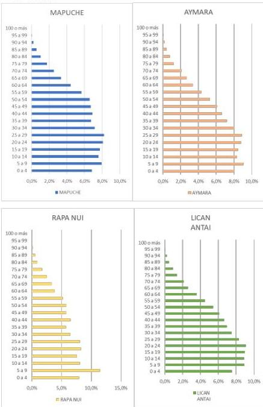

Fuente: Censo de Población y Vivienda 2017. Instituto Nacional de Estadísticas (INE).

21
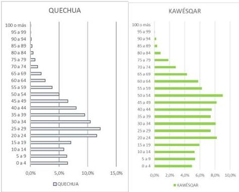

Fuente: Censo de Población y Vivienda 2017. Instituto Nacional de Estadísticas (INE).

22
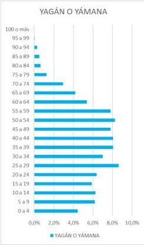

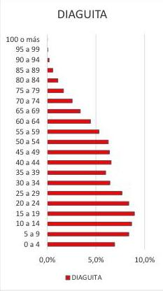

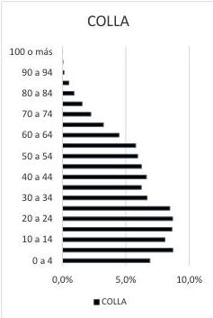

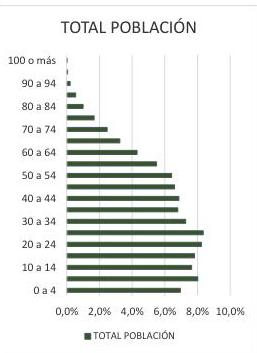

Fuente: Censo de Población y Vivienda 2017. Instituto Nacional de Estadísticas (INE).

23