# Perfil epidemiológico básico de la población mapuche.
Comunas del área lafkenche del Servicio de Salud Araucanía Sur

SERIE ANÁLISIS DE LA SITUACIÓN DE SALUD DE LOS PUEBLOS INDÍGENAS DE CHILE. Nº 4

GOBIERNO DE CHILE
MINISTERIO DE SALUD

# Perfil epidemiológico básico de la población mapuche.

Comunas del área lafkenche del Servicio de Salud Araucanía Sur

**GOBIERNO DE CHILE**
MINISTERIO DE SALUD

Subsecretaría de Salud Pública
División de Políticas Saludables y Promoción
División de Planificación Sanitaria

Este documento fue preparado por las antropólogas Ana María Oyarce Pisani y Malva-marina Pedrero Sanhueza. Su elaboración se inscribe en el marco de las iniciativas impulsadas por el Programa de Salud y Pueblos Indígenas, del Departamento de Promoción de Salud y Participación Ciudadana de la División de Políticas Públicas Saludables y Promoción; y, del Departamento de Epidemiología de la División de Planificación Sanitaria.

Serie Análisis de Situación de Salud de los Pueblos Indígenas de Chile N° 04
Ministerio de Salud de Chile
Subsecretaría de Salud Pública
Mac Iver 541 Santiago, Chile
Diciembre 2008
## AGRADECIMIENTOS

Este trabajo ha sido posible gracias al valioso apoyo de diversas personas e instituciones. En particular, agradecemos la colaboración de:

- César Torres A., SEREMI de Salud de La Araucanía
- Jaime Neira R., Director del Servicio de Salud Araucanía Sur.
- Armando Marileo L., Ngenpin del Rewe Pangku, Territorio del Budi, área lafkenche
- Yolanda Nahuelcheo S., Coordinadora Regional de Salud Intercultural de la SEREMI de Salud de La Araucanía.
- Ligia Sanhueza, Unidad de Estadísticas Servicio de Salud Araucanía Sur.
- Gabriela Pérez P., Socióloga.
- Equipo de trabajo del Programa con Población Mapuche (PROMAP). Servicio de Salud Araucanía Sur.
- Mónica Chiu, Departamento de Epidemiología del Ministerio de Salud.

Y la de todos los representantes de organizaciones mapuche que participaron de los diversos talleres de discusión y análisis colectivo de los resultados.

-3-

-4-
# ÍNDICE GENERAL

|  **PRÓLOGO** | 11  |
| --- | --- |
|  **PRESENTACIÓN** | 13  |
|  **I. ASPECTOS METODOLÓGICOS: ALCANCES Y LÍMITES.** | 17  |
|  1. Procedimientos para el cálculo de tasas y otros aspectos metodológicos. | 17  |
|  2. Registros de salud utilizados. | 20  |
|  3. Clasificación de enfermedades. | 20  |
|  **II. EL MUNDO MAPUCHE.** | 21  |
|  **III. PERFIL EPIDEMIOLÓGICO DE LA POBLACIÓN MAPUCHE DE LAS COMUNAS DE CARAHUE, SAAVEDRA, TEODORO SCHMIDT Y TOLTÉN.** | 31  |
|  1. Área de cobertura del estudio. | 31  |
|  2. Red asistencial. | 33  |
|  3. Antecedentes sociodemográficos. | 35  |
|  3.1. Estructura de la población por sexo y edad. | 37  |
|  4. Perfil de mortalidad. | 43  |
|  4.1. Características generales. | 43  |
|  4.2. Causas de muerte. | 49  |
|  5. Perfil de morbilidad. | 60  |
|  5.1. Egresos Hospitalarios. | 60  |
|  5.2. Enfermedades de Notificación Obligatoria. | 62  |
|  6. Situación de la Tuberculosis. | 64  |
|  6.1. Morbilidad por Tuberculosis. | 64  |
|  6.2. Mortalidad por Tuberculosis. | 65  |
|  7. Conclusiones y recomendaciones. | 66  |
|  **BIBLIOGRAFÍA** | 69  |
|  **ANEXO N° 1: INDICADORES BÁSICOS DE SALUD PARA LA COMUNA DE SAAVEDRA.** | 71  |
|  **ANEXO N° 2: TABULADOS BÁSICOS.** | 75  |

-5-
## ÍNDICE DE GRÁFICOS

|  Gráfico Nº 1 | Distribución de la población Mapuche por Región. Total País | 35  |
| --- | --- | --- |
|  Gráfico Nº 2 | Distribución de la población Mapuche por comuna | 36  |
|  Gráfico Nº 3 | Proporción de la población Mapuche por comuna | 37  |
|  Gráfico Nº 4 | Índice de masculinidad Mapuche-No Mapuche, por comuna | 38  |
|  Gráfico Nº 5 | Índices de envejecimiento población Mapuche y No Indígena. Total país | 38  |
|  Gráfico Nº 6 | Índices de envejecimiento población Mapuche y No Mapuche. Comunas área lafkenche | 39  |
|  Gráfico Nº 7 | Índices de envejecimiento Mapuche y No Mapuche, por sexo | 40  |
|  Gráfico Nº 8 | Pirámide de edades Mapuche-No Mapuche. Comunas Área Lafkenche. SS Araucanía Sur | 40  |
|  Gráfico Nº 9 | Pirámide de edades Mapuche-No Mapuche. Comuna de Carahue | 41  |
|  Gráfico Nº 10 | Pirámide de edades Mapuche-No Mapuche. Comuna de Saavedra | 41  |
|  Gráfico Nº 11 | Pirámide de edades Mapuche-No Mapuche. Comuna de Teodoro Schmidt | 42  |
|  Gráfico Nº 12 | Pirámide de edades Mapuche-No Mapuche. Comuna de Toltén | 42  |
|  Gráfico Nº 13 | Evolución de la mortalidad general Mapuche-No Mapuche. Comunas área lafkenche (2001-2006) | 43  |
|  Gráfico Nº 14 | Tasa bruta de mortalidad Mapuche-No Mapuche, por área de residencia (2001-2003) | 44  |
|  Gráfico Nº 15 | Tasa bruta de mortalidad Mapuche- No Mapuche, por comuna, según área de residencia (2001-2003) | 45  |

-6-
|  Gráfico Nº 16 | Tasa bruta de mortalidad Mapuche-No Mapuche, por sexo (2001-2006) | 46  |
| --- | --- | --- |
|  Gráfico Nº 17 | Tasa ajustada mortalidad general Mapuche-No Mapuche (2001-2006) | 46  |
|  Gráfico Nº 18 | Evolución riesgo relativo Mapuche-No Mapuche, por comuna (2001-2006) | 47  |
|  Gráfico Nº 19 | Tasa ajustada mortalidad general Mapuche-No Mapuche, por sexo (2001-2006) | 47  |
|  Gráfico Nº 20 | Evolución riesgo relativo mortalidad Mapuche-No Mapuche, por grandes grupos de edad (2001-2006) | 48  |
|  Gráfico Nº 21 | Tasa de mortalidad infantil Mapuche-No Mapuche (2001-2003) | 48  |
|  Gráfico Nº 22 | Distribución defunciones Mapuche-No Mapuche, por grupo de causa (2001-2003) | 50  |
|  Gráfico Nº 23 | Distribución defunciones Mapuche-No Mapuche, por grupo de causa (2004-2006) | 50  |
|  Gráfico Nº 24 | Distribución defunciones Mapuche por grupo de causa, según sexo (2001-2003) | 52  |
|  Gráfico Nº 25 | Distribución defunciones Mapuche por grupo de causa, según sexo (2004-2006) | 52  |
|  Gráfico Nº 26 | Tasa ajustada de mortalidad Mapuche-No Mapuche por grupo de causa (2001-2003) | 53  |
|  Gráfico Nº 27 | Tasa ajustada de mortalidad Mapuche-No Mapuche por grupo de causa (2004-2006) | 53  |
|  Gráfico Nº 28 | Evolución riesgo relativo por grupos de causa trienios (2001-2003 y 2004-2006) | 53  |
|  Gráfico Nº 29 | Proporción de muertes Mapuche y No Mapuche por Grupo 18, según comuna (2004-2006) | 54  |
|  Gráfico Nº 30 | Edad promedio muertes Mapuche y No Mapuche por Grupo 18, según sexo (2004-2006) | 54  |
|  Gráfico Nº 31 | Tasa ajustada mortalidad Mapuche-No Mapuche por Grupo 9 (2001-2006) | 55  |

-7-
|  Gráfico Nº 32 | Tasa ajustada mortalidad Mapuche y No Mapuche por Grupo 9, según comuna (2001-2003) | 56  |
| --- | --- | --- |
|  Gráfico Nº 33 | Tasa ajustada mortalidad Mapuche-No Mapuche por Grupo 2 (2001-2006) | 56  |
|  Gráfico Nº 34 | Distribución relativa muertes Mapuche-No Mapuche por Grupo 2, según localización (2001-2006) | 57  |
|  Gráfico Nº 35 | Tasa ajustada mortalidad Mapuche por Grupo 2, según sexo (2001-2006) | 57  |
|  Gráfico Nº 36 | Tasa ajustada mortalidad Mapuche-No Mapuche por Grupo 19 (2001-2006) | 59  |
|  Gráfico Nº 37 | Tasa ajustada mortalidad por suicidio Mapuche-No Mapuche (2001-2006) | 59  |
|  Gráfico Nº 38 | Distribución egresos hospitalarios Mapuche-No Mapuche de establecimientos seleccionados, por gran grupo de enfermedad (2004-2006) | 60  |
|  Gráfico Nº 39 | Distribución relativa egresos hospitalarios Mapuche-No Mapuche. Hospital de Carahue (2004-2006) | 61  |
|  Gráfico Nº 40 | Distribución relativa egresos hospitalarios Mapuche-No Mapuche. Hospital Puerto Saavedra (2004-2006) | 61  |
|  Gráfico Nº 41 | Distribución relativa egresos hospitalarios Mapuche-No Mapuche. Hospital de Toltén (2004-2006) | 61  |
|  Gráfico Nº 42 | Distribución relativa egresos hospitalarios de residentes en comunas del área lafkenche. Hospital Temuco (2004-2006) | 62  |
|  Gráfico Nº 43 | Distribución relativa egresos hospitalarios de residentes en comunas del área lafkenche. Hospital Nueva Imperial (2004-2006) | 62  |
|  Gráfico Nº 44 | Distribución relativa ENO seleccionadas Mapuche-No Mapuche (2001-2005) | 63  |
|  Gráfico Nº 45 | Tasa ajustada incidencia TBC Mapuche-No Mapuche (2001-2006) | 65  |

-8-
Gráfico N° 46 Tasa ajustada mortalidad por TBC Mapuche-No Mapuche (2001-2006) 65

## ÍNDICE DE FIGURAS

|  Figura N° 1 | Procedimiento para la inclusión de la variable “etnia” en las bases de datos | 18  |
| --- | --- | --- |
|  Figura N° 2 | Conformación del Territorio Mapuche o Wall Mapu | 21  |
|  Figura N° 3 | Conformación del Miñche mapu | 22  |
|  Figura N° 4 | Las tres dimensiones del universo mapuche | 23  |
|  Figura N° 5 | Meli Witran Mapu | 24  |
|  Figura N° 6 | La familia divina representada por el sol y la luna | 25  |
|  Figura N° 7 | La familia divina en el Meli-Witran Mapu | 26  |
|  Figura N° 8 | Etapas del año en el mundo mapuche | 27  |
|  Figura N° 9 | El Bien y el Mal Representado por los Ventos | 27  |
|  Figura N° 10 | El Nag Mapu (Espacio Territorial) Reproducción del Wenu Mapu | 28  |
|  Figura N° 11 | El Mundo y sus Tres Dimensiones | 29  |
|  Figura N° 12 | Área de cobertura del estudio | 31  |
|  Figura N° 13 | Red Asistencial Comunas Área Lafkenche del Servicio de Salud Araucanía Sur | 33  |
|  Figura N° 14 | Proporción de población Mapuche para las regiones del país | 35  |
|  Figura N° 15 | Comparación entre las principales causas de muerte País, SS Araucanía Sur y poblaciones Mapuche y No Mapuche de las comunas del área lafkenche (2001-2003) | 50  |

-9-
|  Figura N° 16 | Comparación entre las principales causas de muerte País, SS Araucanía Sur y poblaciones Mapuche y No Mapuche de las comunas del área lafkenche (2004-2006) | 51  |
| --- | --- | --- |
|  Figura N° 17 | Comparación de las principales causas de muerte entre hombres Mapuche y No Mapuche de las comunas del área lafkenche (2001-2003 y 2004-2006) | 51  |
|  Figura N° 18 | Comparación de las principales causas de muerte entre mujeres Mapuche y No Mapuche de las comunas del área lafkenche (2001-2003 y 2004-2006) | 51  |

## ÍNDICE DE TABLAS

|  Tabla N° 1 | Población Mapuche y No Mapuche proyectada al 2005 por grupos de edad, según sexo | 17  |
| --- | --- | --- |
|  Tabla N° 2 | Nómina de reducciones mapuche con apellido “hispano” | 19  |
|  Tabla N° 3 | Grandes grupos de enfermedad. CIE 10 | 20  |
|  Tabla N° 4 | Indicadores básicos de caracterización socioeconómica de las comunas del área lafkenche del SS Araucanía Sur | 32  |
|  Tabla N° 5 | Hospitales en las comunas del área lafkenche del SS Araucanía Sur | 33  |
|  Tabla N° 6 | Distribución postas de salud rural por comuna | 34  |
|  Tabla N° 7 | Distribución muertes Mapuche y No Mapuche por Grupo 2, según sexo (2001-2003) | 58  |
|  Tabla N° 8 | Distribución muertes Mapuche y No Mapuche por rGrupo 2, según sexo (2004-2006) | 58  |

-10-
Perfil epidemiológico básico de la población mapuche. Comunas del área lafkenche del Servicio de Salud Araucanía Sur

## PRÓLOGO

La publicación que compartimos, corresponde al cuarto número de la Serie Análisis de la Situación de Salud de los Pueblos Indígenas de Chile y nos permite contar con un diagnóstico de las condiciones de salud de la población mapuche del área lafkenche. Los primeros estudios fueron de población aymara residente en las Provincias de Arica, Parinacota e Iquique. Los diagnósticos realizados a la fecha muestran que los pueblos indígenas presentan un perfil de morbi-mortalidad distinto al de la población no indígena.

La operativización del Convenio 169 en Chile, abre más instancias de participación a los Pueblos Indígenas, profundizando los procesos que el sector salud ha impulsado desde los años 90. La participación de las comunidades indígenas en el proceso de construcción del conocimiento epidemiológico es fundamental no sólo por la información que aportan, sino principalmente porque les permite ejercer sus derechos de ser informados, consultados y partícipes de las soluciones. La metodología desarrollada en los procesos de diseño, presentación y discusión de resultados parciales y finales con la participación de las organizaciones mapuche del área lafkenche, son una aporte a los significados y análisis de los factores determinantes de la salud-enfermedad.

Este nuevo perfil nos muestra la situación de salud de los mapuche que residen en el área lafkenche, especialmente en las comunas de Puerto Saavedra, Carahue, Teodoro Schmidt y Toitén, bajo la cobertura del Servicio de Salud Araucanía Sur. A diferencia de los anteriores, éste genera indicadores para un período más amplio, incluyendo no sólo datos para el trienio 2001-2003, sino también para el trienio 2004-2006, necesidad que se incorpora producto de la discusión generada en los talleres de presentación del diseño de la investigación propuesta.

Este proyecto nos ha permitido definir metodologías para avanzar progresivamente en investigación cualicantativa. Uno de ellos, es utilizar esta información para mejorar la gestión, plantearse nuevas preguntas y sobretodo, para entender que estos diagnósticos son sólo un primer paso en materia de investigación sobre situación de salud de los pueblos indígenas, falta conocer la epidemiología desde sus propios conceptos de salud-enfermedad-curación. En tal sentido, se incluye en este perfil básico una síntesis de la cosmovisión mapuche recabada y descrita por Armando Marileo Lefio, a quien agradecemos su generosidad.

También desde el rol de los equipos técnicos en los distintos niveles del sistema de salud pública será necesario generar reuniones para enriquecer la discusión y a su vez generar mecanismos institucionales para actualizar la información, responsabilidad que deberán asumir los equipos técnicos de salud.

-11-
En suma, estos documentos técnicos esperan ser un insumo para la toma de decisiones en relación al trabajo con los pueblos indígenas; tanto a nivel de los Planes Regionales de Salud Pública como para los Servicios de Salud. Los procesos de construcción conjunta encuentran su mejor expresión cuando efectivamente se logra cambiar las inequidades y mejorar la situación de salud de los pueblos indígenas, esa es la responsabilidad compartida.

**DRA. JEANETTE VEGA MORALES**
**SUBSECRETARIA DE SALUD PUBLICA**

-12-
Perfil epidemiológico básico de la población mapuche. Comunas del área lafkenche del Servicio de Salud Araucanía Sur

## PRESENTACIÓN

Durante las últimas dos décadas del siglo XX y la primera del XXI se han producido grandes avances en materia de reconocimiento del carácter pluriénico y multicultural de los estados y naciones del mundo. En este escenario, en 1993, en Chile se promulga la Ley 19.253, conocida también como Ley Indígena; y, recientemente se ratifica el Convenio 169 de la OIT sobre pueblos indígenas y tribales.

En el ámbito de la salud, se implementa, desde 1996, un Programa Especial orientado a dar pertinencia cultural a la atención, como herramienta fundamental para superar las brechas de equidad que afectan la situación de salud de los pueblos indígenas. Como parte de este proceso, sectorialmente, se dictan normas técnicas y medidas administrativas que, reconociendo la diversidad cultural en salud, favorecen la complementariedad de los sistemas médicos indígenas y oficial y una cada vez más amplia participación de los pueblos originarios.

Los diagnósticos epidemiológicos básicos desarrollados en esta serie, que permiten diferenciar la situación de salud de las poblaciones indígenas y no indígenas, forman parte de la fase inicial del desarrollo de una epidemiología con enfoque sociocultural. A través de ellos, se aporta información científicamente fundada de morbi-mortalidad, que requiere de un proceso de análisis contextualizado y participativo, que posibilite la planificación de estrategias locales colectivas e interculturales para abordar los problemas de salud identificados. En este sentido, es necesario profundizar estos diagnósticos, validándolos culturalmente, e incluyendo (en un substrato explicativo, primero y de medición, después) las propias categorías de enfermedad de los pueblos indígenas, así como la vinculación de la comunidad con el territorio, eje del desarrollo del pensamiento indígena y base de la autonomía en salud.

Si bien en esta etapa del estudio no se ha avanzado en la inclusión y análisis de categorías propias del sistema médico mapuche, es relevante aproximarse a aquellos conceptos centrales de una epidemiología con enfoque sociocultural como son las categorías de persona, tiempo y lugar. Con este fin, se incluye en una sección de este perfil una síntesis del trabajo de investigación realizado por Armando Marileo Lefio, Ngenpin (autoridad ancestral) del rewe de Pangku, territorio del Budi, que recoge la sabiduría de las autoridades originarias mapuche y sistematiza los principales conceptos que articulan el mundo mapuche. Este extracto, corregido y actualizado por el autor, formó parte de un documento mayor llamado Mundo Mapuche, que fuera publicado en extenso en 1998.

El perfil epidemiológico de la población mapuche de las comunas del área lafkenche del Servicio de Salud Araucanía Sur, es el cuarto diagnóstico básico realizado en

-13-
el marco del Proyecto de Epidemiología con Enfoque Sociocultural. Se han desarrollado, en fases previas, los perfiles de morbi-mortalidad de la población aymara del Servicio de Salud Arica, de la población mapuche, yámana y kawesqar del Servicio de Salud Magallanes y de la población aymara del Servicio de Salud Iquique. Los resultados de todos ellos mostraron que estos pueblos indígenas se encuentran en una etapa de transición epidemiológica prolongada y polarizada, en que coexisten al mismo tiempo las enfermedades asociadas a la modernidad (hipertensión y cáncer) y las propias del subdesarrollo (Tuberculosis y hepatitis A, entre otras), en un contexto de agudización de las desigualdades sociales en materia de salud. Otro rasgo común en todos estos perfiles, es la sobremortalidad indígena, medida a través de tasas brutas de mortalidad, con riesgos un 50% más altos, para los aymara del norte y un 80% mayores para los indígenas australes. La sobremortalidad infantil, también es una situación presente en la tres áreas hasta ahora estudiadas.

En este nuevo perfil epidemiológico se trata de ampliar el conocimiento de la situación de salud de los mapuche que residen en el área lafkenche, especialmente en las comunas de Puerto Saavedra, Carahue, Teodoro Schmidt y Toltén, todas ellas bajo la cobertura del Servicio de Salud Araucanía Sur. A diferencia de los anteriores, éste genera indicadores para un período más amplio, incluyendo no sólo datos para el trienio 2001-2003, susceptibles de ser comparados con los ya disponibles para otros pueblos indígenas del país, sino también para el trienio 2004-2006, como una forma de contar con información actualizada para el área.

Por la forma en que están presentados los resultados, esta publicación está destinada es principalmente una herramienta para la gestión y toma de decisiones de los equipos técnico-profesionales de salud. No obstante, siguiendo la línea de trabajo del proyecto de epidemiología sociocultural, durante todo el proceso de producción de la información se generaron instancias de presentación y análisis colectivo de los resultados, que contaron con la participación tanto de equipos de salud como de representantes de las comunidades indígenas. Para ello, se diseñó una metodología específica que hace la información comprensible para todos y, a la vez, capacita en el manejo e interpretación de ella; generándose así mejores condiciones para el diálogo intercultural.

En etapas posteriores del proyecto de epidemiología sociocultural, esperamos producir manuales de difusión y capacitación comunitaria pertinentes, a partir de la metodología que se ha venido utilizando.

-14-
Perfil epidemiológico básico de la población mapuche. Comunas del área lafkenche del Servicio de Salud Araucanía Sur

### Ejemplo de metodología usada en talleres comunitarios

Para la discusión de resultados preliminares y análisis colectivo de los mismos, los indicadores se presentan de manera sencilla y comprensible para democratizar el conocimiento epidemiológico. En este ejemplo se muestra el riesgo relativo de morir en las comunas del área lafkenche entre mapuche (azul) y no mapuche (rojo)

*Teodoro Schmidt*

*Carahue*

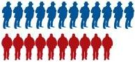

*Toltén*

*Saavedra*

*En todas las comunas fallecen más mapuche que no mapuche Las diferencias son mayores en Teodoro Schmidt*

¿Coinciden estos datos con los que ustedes conocen en su realidad?

¿Comente a qué se podrían deber estas diferencias?

¿Cuáles serían las explicaciones a estas diferencias, desde el punto de vista mapuche?

-15-

-16-
Perfil epidemiológico básico de la población mapuche. Comunas del área lafkenche del Servicio de Salud Araucanía Sur

## I. Aspectos metodológicos

### 1. Procedimientos para el cálculo de tasas y otras consideraciones metodológicas

En los perfiles epidemiológicos construidos en fases anteriores del Proyecto de Epidemiología se levantaron indicadores de morbi-mortalidad, correspondientes al trienio 2001-2003, diferenciados para poblaciones indígenas y no indígenas en tres regiones del país, utilizando como denominador en el cálculo de tasas los antecedentes del Censo de Población y Vivienda de 2002. Dado el tiempo transcurrido, se consideró necesario ampliar el corte temporal del estudio, extendiéndolo al trienio siguiente: 2004-2006.

Puesto que el Censo de 2002 continúa siendo la única fuente que registra la variable “pertenencia a pueblos indígenas” para el total de la población del país, se requirió una estrategia metodológica, que permitiera distinguir a la población mapuche en las proyecciones de población generadas por el DEIS-MINSAL, a partir de la misma fuente. Así, para el trienio 2004-2006, se consideró la estructura sexo-etaria de la población proyectada al 2005 para las comunas del área de lafkenche del SS Araucanía Sur; y, se mantuvo las proporción de población mapuche por sexo para cada grupo etario, de acuerdo a las cifras censales (Ver Tabla N° 1). Se usó como año de referencia el 2005 por representar a la población a la mitad del nuevo período para el cual se calcularon indicadores, manteniendo así una metodología consistente para los dos trienios.

**Población Mapuche y No Mapuche proyectada al 2005 por grupos de edad, según sexo**

|  Gran grupo de Edad | Pertenencia a pueblos indígenas |   |   |   |   |   | Total  |
| --- | --- | --- | --- | --- | --- | --- | --- |
|   |  Mapuche |   |   | No Mapuche  |   |   |   |
|   |  Sexo |   | Total | Sexo |   | Total  |   |
|   | Hombre | Mujer |  | Hombre | Mujer |  |   |
|  <15 | 3668 | 3452 | 7120 | 5560 | 5142 | 10702 | 17822  |
|  15-24 | 2493 | 2283 | 4776 | 3312 | 3305 | 6617 | 11393  |
|  25-34 | 1480 | 1420 | 2900 | 2618 | 2574 | 5192 | 8092  |
|  35-44 | 1828 | 1608 | 3436 | 3066 | 2922 | 5988 | 9424  |
|  45-54 | 1608 | 1389 | 2997 | 2561 | 2125 | 4686 | 7683  |
|  55-64 | 1175 | 1070 | 2245 | 1765 | 1600 | 3365 | 5610  |
|  65 y + | 1316 | 1434 | 2750 | 2013 | 2114 | 4127 | 6877  |
|  Total | 13568 | 12656 | 26224 | 20895 | 19782 | 40677 | 66901  |

Fuente: Elaboración propia, a partir de proyecciones DEIS-MINSAL y Censo de 2002

-17-
En los perfiles epidemiológicos de la población aymara de los Servicios de Salud Arica e Iquique y de la población indígena del Servicio de Salud Magallanes, se definió una metodología que permitía incorporar a las bases de datos variables que, combinadas, permitían identificar a los indígenas. Operativamente, se ha considerado indígena todo caso contenido en las bases de datos de morbi-mortalidad utilizadas, que cumple alguno de los siguientes criterios:

- Casos que registraran al menos un apellido indígena.
- Casos con apellidos no indígenas, tradicionalmente asociados a territorios indígenas. La operacionalización de este criterio requiere una adecuación a las características sociohistóricas de la ocupación de tales territorios. En el caso específico del área lafkenche del SS Araucanía Sur, se recurrió a las nóminas de los títulos de merced entregados a caciques con algún apellido hispano al momento de la radicación (Ver Tabla N° 2). Éstos, articulados con la localidad respectiva, permitieron identificar como mapuche a todo caso que teniendo uno de esos apellidos residiera en la reducción o comunidad asociada a ellos.
- Casos cuya calidad de indígena estuviera acreditada en los registros de la CONADI.

El esquema siguiente resume el procedimiento:

Figura N° 1
Procedimiento para la inclusión de la variable “etnia” en las bases de datos

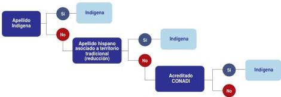

-18-
Perfil epidemiológico básico de la población mapuche. Comunas del área lafkenche del Servicio de Salud Araucanía Sur

Nómina de reducciones mapuche con algún apellido “hispano”

|  Comuna | Localidad | Comunidad  |
| --- | --- | --- |
|  Carahue | Puquillem | Juan Pinébeina  |
|   |  Camar | Pedro Torres  |
|   |  Llecomultuida | Andrés Silva  |
|   |  Nehuentue | Ceferino Santibáñez  |
|   |  Danquil | Toro Llancanil  |
|   |  Pelico Chacal | Luis Toro  |
|   |  Remeco | Calvuguero Capitán  |
|   |  Chanchomallin | María Cea de Carrasco  |
|  Teodoro Schmidt | Butano | Jacinto Beltrán  |
|   |  Queapue | Eduardo Latorre  |
|   |  Chelle | Pedro Carmona  |
|   |  Pennehue | Agustín Alonso  |
|   |  Pelehue | Andrés Silva Llancanil  |
|   |  Llaguipulli | María Alonso del Urrea  |
|   |  Neicuf | Juan Soltilito  |
|  Toltén | Collinyán | Pascual Carrillo  |
|   |  Raquinama | Manuel Antonio Jaramillo  |
|   |  Pucayan | Zonzi Jaramillo  |
|   |  Catriluffu | Estanislao Muñoz Matileo  |
|  Saavedra | Naipe | José María Castro  |
|   |  Llaguey | Juan Antonio Carrera  |
|   |  Pullangllang | Juan Bravo Chamblas  |
|   |  Comoe | José Silva  |
|   |  Budi | Teofilo Cortés Cúzara  |
|   |  Mayai | José Antonio Carrera  |
|   |  Budi | Juan Ángel Hernández Trastol  |
|   |  Trablano | Curín Alonso  |
|   |  Cardal o Ralico | Domingo Santibáñez  |
|   |  Chouni | Mateo Burgosvidda del Rialle a  |
|   |  Onnoiro | Pedro Alonso  |
|   |  Maitén | Huiacaman Carmona  |
|   |  Quilo | Filomena Alonso Vidda De Pa  |
|   |  Oninco | Ulario Paillalé F Rosas  |

Una vez incluida la “variable etnia” en las bases de datos, el procedimiento para el cálculo de tasas en cada trienio fue el siguiente:

Promedio de casos Mapuche y no Mapuche

x 1.000

Población a mitad del trienio

-19-
## 2. Registros de salud utilizados

- Bases de datos de defunciones para el período 2001-2006, aportados por DEIS, Departamento de Epidemiología y Programa de Control de la Tuberculosis del Ministerio de Salud; y, por el Servicio de Salud Araucanía Sur.
- Bases de datos de egresos hospitalarios para el período 2004-2006 de los hospitales de Carahue, Saavedra y Toltén. Se incluyeron, además, los hospitales de Temuco y Nueva Imperial, rescatando los casos de residentes en el área de cobertura del estudio
- Bases de datos de Enfermedades de Notificación obligatoria para el período 2001-2006, aportadas por el DEIS del MINSAL.

## 3. Clasificación de enfermedades.

Para todos los procesos estadísticos se utilizó el Sistema de Clasificación Internacional de Enfermedades (CIE 10), que organiza las entidades morbosas en 21 grandes grupos.

Tabla N° 3

|  Grandes Grupos de Enfermedad CIE 10  |   |
| --- | --- |
|  I | Ciertas Enfermedades Infecciosas y Parasitarias  |
|  II | Tumores (Neoplasias)  |
|  III | De la sangre y de órganos hematopoyéticos y ciertos trastornos que afectan el mecanismo de inmunidad  |
|  IV | Enfermedades Endocrinas, Nutricionales y Metabólicas  |
|  V | Trastornos Mentales y del Comportamiento  |
|  VI | Enfermedades del Sistema Nervioso  |
|  VII | Enfermedades del Ojo y sus Anexos  |
|  VIII | Enfermedades del Oído y Apófisis Mastoides  |
|  IX | Enfermedades del Enfermedades del Sistema Circulatorio  |
|  X | Enfermedades del Sistema Respiratorio  |
|  XI | Enfermedades del Sistema Digestivo  |
|  XII | Enfermedades de la Piel y Tejido Subcutáneo  |
|  XIII | Enfermedades del Sistema Osteomuscular y Tejido Conjuntivo  |
|  XIV | Enfermedades del Sistema Genitourinario  |
|  XV | Embarazo, Parto y Puerperio  |
|  XVI | Ciertas Afecciones Originadas en el Período Neonatal  |
|  XVII | Malformaciones Congénitas, Deformidades y Anomalías Cromosómicas  |
|  XVIII | Síntomas, Signos y Hallazgos Anormales Clínicos y de Laboratorio no Clasificados en otra parte  |
|  XIX | Traumatismos, Envenenamientos y algunas consecuencias de causas externas  |
|  XX | Causas externas de morbilidad y mortalidad  |
|  XXI | Factores que influyen en el estado de salud y contacto con los equipos de salud  |

-20-
Perfil epidemiológico básico de la población mapuche. Comunas del área lafkenche del Servicio de Salud Araucanía Sur

## II. El Mundo Mapuche$^{1}$

### 1. Articulación del mundo mapuche

Iniciaremos nuestra reflexión a partir de puntos esenciales, que harán más comprensible el tema: El primer punto de referencia es la explicación sobre la demarcación o conformación del **mapu** (territorio).

Conformación del Territorio Mapuche o Wall Mapu

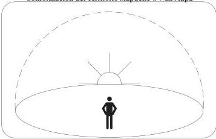

Comenzamos explicando que para el pueblo mapuche la principal orientación o punto de referencia filosófica, cósmica, religiosa, etc., es el lugar donde diariamente nace la vida: la salida del Sol o **Antú**.

Por tanto, para llegar a entender y a explicar la conformación del espacio territorial mapuche (el mundo real y material); en otras palabras, para reconstruir la visión propia sobre la “base” en el cual se sustenta la existencia del hombre, la naturaleza y los espíritus, nos dejaremos orientar por el movimiento del sol, que lógicamente comienza por el **Puel mapu** (Este).

Hoy, igual que ayer, toda vez que nuestros ancianos desean explicar la conformación del **Mapu** (tierra) o **Wall mapu** (territorio), apuntan su dedo hacia el punto donde sale el sol, es decir, hacia el **Puel Mapu**, girando y siguiendo la mano izquierda hasta completar la vuelta demarcan el territorio del pueblo mapuche, es decir, la base fundamental donde se sustenta la cultura y la naturaleza.

$^{1}$ En este capítulo se presenta un extracto de un artículo de Armado Marileo Lelio, que fue publicado por primera vez el año 1995. Esta síntesis fue corregida y actualizada por el autor.

-21-
Para llevar a cabo el giro circular es necesario ubicarse en el cerro más alto y desde allí mirar el lugar donde, según decían, la tierra y el “cielo” se unen. Una vuelta completa da forma al territorio o **Wall mapu**. El mapuche, al hacer el giro representa el movimiento del sol, el cual sale desde el **Puel mapu**, siguiendo hacia el **Piku mapu**; del **Piku mapu** pasa al **Lafken mapu**; del **Lafken mapu** al **Willi mapu** y del **Willi mapu** al **Puel mapu**.

Con este giro circular se habrá conformado la base fundamental de la cultura del hombre y la naturaleza, el concepto del **Wall Mapu**. No obstante, el círculo en torno a mi persona representará mi auto-responsabilidad sobre los elementos naturales que se encuentran dentro de ella; es decir, estarán bajo mi cuidado personal todos los elementos que allí existen, partiendo desde donde estoy ubicado hasta donde alcance mi vista. Este círculo es imaginario y se mueve conmigo diariamente; por tanto cada, cual tiene su propio **wallmapu** individual que las hace responsables de todo su entorno.

El giro circular da cuenta que el mapuche es el centro de su propio mundo y como tal tiene una enorme importancia; a su vez, es tan insignificante porque está solo y nadie más puede estar en su lugar. No obstante, en un **Nguillatun**, por medio del **Rewe**, podrá unir su mundo con los demás, haciendo más expedita la relación e interacción con los espíritus de los antepasados y fuerzas o energías del universo.

Una vez conformado el **Wall mapu** o territorio mapuche es necesario entender que éste no permanece en el aire, sino tiene una base, similar al espacio que se ve sobre la tierra (el cielo). Este espacio tiene materia orgánica y se sustenta por una base mayor, similar al cielo en posición opuesta, llamada **Miñche mapu** (similar al **Rali** o plato hondo de madera del **kultrung**)

Conformación del Miñche mapu

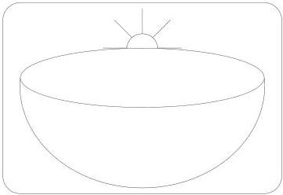

-22-
Perfil epidemiológico básico de la población mapuche. Comunas del área lafkenche del Servicio de Salud Araucanía Sur

El **Kultrung**, el símbolo más importante y sagrado de nuestro pueblo, permite hoy comprender los elementos que explican y configuran nuestro mundo. En ese instrumento sagrado mapuche nuestros ancianos dejaron impresos todos los aspectos de su entorno, visibles e invisibles; tangibles e intangibles, entre los que podemos nombrar: a) **Meli witran mapu**, b) **Familia Espiritual**, c) **We-tripantu** (año nuevo mapuche) y ciclos del año, entre otros.

Figura N° 4
Las tres dimensiones del universo mapuche

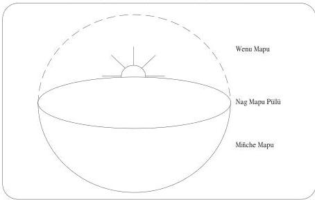

## 2. El mundo mapuche en el Kultrung

### 2.1. Meli Witran Mapu (encuentro de las cuatro partes de la tierra)

El primer elemento que encontramos dibujados en el **kultrung**, es la división del territorio, conocido como **Meli Witran Mapu**, que literalmente significa “encuentro de las cuatro partes de la tierra”.

- **Puel Mapu** :tierra ubicada al este.
- **Willi Mapu** :tierra ubicada al sur.
- **Piku Mapu** :tierra ubicada al norte.
- **Lafken Mapu** :tierra ubicada al oeste.

Todos estos lugares reciben su nombre por los elementos que los caracterizan. Así también las comunidades o Lof que se encuentran ubicadas en cualquiera de estos sitios reciben el nombre correspondiente:

-23-
Figura N° 5
Meli Witran Mapu

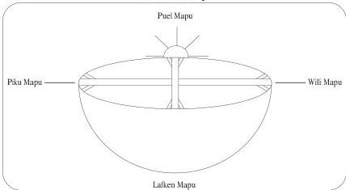

- **Willi che** :gente del sur.
- **Lafken che** :gente del mar.
- **Puel che** :gente del este.
- **Pikun che** :gente del norte.

## 2.2. Familia espiritual

El segundo elemento presente en el **kultrung** es la representación de la familia originaria o espiritual: **Kuse** (anciana), **Fücha** (anciano), **Üllcha** (mujer joven), **Weche** (hombre joven). También reciben el nombre de **Elmapun**, **Elchen**, **Ngünemapun** y **Ngünechen** (creador y sostenedor del hombre y de la tierra).

Nuestros ancianos conciben que la tierra, la naturaleza y el hombre fueron creados por el **Elchen kuse-Elchen fücha**, quienes habitan en la dimensión del **Puel Mapu**. Según el ad mapu y los códigos o leyes naturales territoriales los conceptos de ancianos **Kuse/fücha**, representan todos los elementos de la naturaleza los cuales se encuentran en su plenitud o apogeo, árboles ancianos, animales ancianos, etc.; ocurre exactamente igual con las denominaciones de jóvenes, **üllcha** y **weche**, los cuales representan el inicio de la vida, es la pureza, el equilibrio, son los componentes de la naturaleza y el universo recién originado o creado.

A su vez **Kuse/Fücha** (anciana, anciano) representan a nuestros abuelos y mayores quienes alimentan en sabiduría y conocimientos a nuestros jóvenes. En cambio **Üllcha/Weche** (niña-niño) representan a los jóvenes y a los niños que son el futuro del pueblo mapuche.

-24-
Perfil epidemiológico básico de la población mapuche. Comunas del área lafkenche del Servicio de Salud Araucanía Sur

Esta explicación está representada en el **kultrung** (instrumento sagrado), mediante la figura de **Antü** (sol) y **Küyen** (luna), elementos naturales considerados sagrados por su condición de generadores y controladores de vida y de la naturaleza. Por ello, fueron utilizados para representar a la familia originaria. Para el mapuche, esta familia no se puede representar como personas, aunque en algunos casos especialmente la **machi**, **lonko**, **pelom** y otros la ven representada en los ancianos.

### 2.2.1. La familia representada por el sol y la luna

Tal cual se aprecia en la figura siguiente, la unión de estos elementos, **Antü** y **Küyen** (el sol y la luna), conforman la familia, es decir, los cuatro semicírculos representan a la anciana, el anciano, la joven mujer y el joven varón; el sol en el centro permite la interrelación.

Figura N° 6
La familia espiritual representada por el sol y la luna

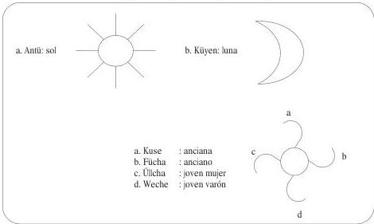

Pero veamos qué nos dice el hecho de que la figura anterior aparezca cuatro veces en el **Kultrung**. Cada símbolo que aparece en el **Kultrung** representa al **Ngenechen-Ngenemapun**; no obstante como aparece también en cuatro partes, quiere decir que es el nexo entre el **Puelmapu**, el **Piku mapu**, el **Lafken mapu** y el **Willi mapu**. Aquí vemos que la familia divina hace de mediadora entre las distintas partes del **Nag mapu**; en lo concreto está presente y vive junto al hombre y a la naturaleza.

-25-
Figura N° 7
La familia originaria en el Meli-Witran Mapu

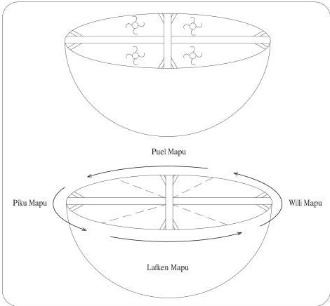

### 2.3. Etapas del año

En el Mundo Mapuche el año está dividido en cuatro partes, como se explica en la Figura N° 8:

|  **Pukem** | :tiempo de lluvias  |
| --- | --- |
|  **Pewü** | :tiempo de brotes  |
|  **Walüng** | :tiempo de abundancia  |
|  **Rimüngen** | :tiempo de rastrojos  |

-26-
Perfil epidemiológico básico de la población mapuche. Comunas del área lafkenche del Servicio de Salud Araucanía Sur

Figura N° 8
Etapas del año en el mundo mapuche

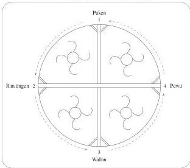

El ciclo comienza con el **We-Tripantu** (año nuevo mapuche), a partir del **Pukem** (tiempo de lluvias), sigue **Pewü**, **Walüng** y **Rimüngen** siguiendo en torno al **Kultrung**. Este círculo es el mismo que se reproduce continuamente en el **Ngillatun**, se gira persiguiendo la mano derecha hasta completar una vuelta; que representará al año completo con sus cuatro etapas. Posteriormente, al completarse las cuatro vueltas en torno al **Rewe** (lugar que simboliza donde se junta el cielo y la tierra) ese representará **Küme fücha püllü** y la Familia Originaria.

Figura N° 9
El Newén o Energías Opuestas y Complementarias Representado por los Vientos

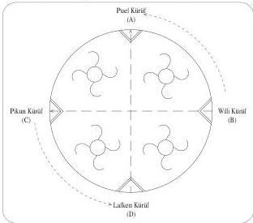

-27-
## 2.4. Küme Newen y Weda Newen en los Vientos

Nuestros ancianos tienen muy clara la noción que existen fuerzas o energías opuestas y complementarias los cuales producen la balanza o equilibrio en el **Mapu**. Esta oposición de fuerzas las encontramos también a través de los vientos o **kürüf** representadas por los vientos Sur-Norte y Este-Oeste.

Así todo lo que corresponde al **willi kürüf** o **waiwen kürüf** (viento sur) representa la fuerza positiva los cuales trae consigo tiempo bueno y en abundancia y todo lo que corresponde al norte o **pikum kürüf** es la oposición de lo positivo; es el espacio del **weda kürüf** viento que tare consigo lluvias, tormentas y otros. No obstante, es necesario comprender que el viento en sí no representa algo negativo, por cuanto y además está controlado por el **ngen kürüf** que es parte del orden cósmico.

El Nag Mapu (Espacio Territorial) Reproducción del Wenu Mapu

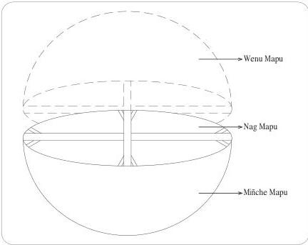

-28-
Perfil epidemiológico básico de la población mapuche. Comunas del área lafkenche del Servicio de Salud Araucanía Sur

El Mundo y sus Tres Dimensiones

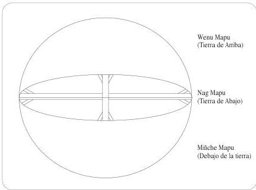

A medida que hemos ido explicando nuestro mundo, hemos dado respuesta a muchas de nuestras interrogantes; primero hablamos en torno a la demarcación del espacio territorial mapuche, el **nag mapu**; posteriormente al graficar el espacio que corresponde a la parte inferior **miñche mapu** descubrimos el **kultrung**; más tarde y siguiendo los consejos de nuestros ancianos fuimos explicando paso a paso los elementos que aparecen en el **kultrung**, los cuales representan una visión particular de nuestro pueblo. Como decíamos al comienzo, esta visión es propia del mundo mapuche, por lo que es necesario aclarar términos que se usan equivocadamente como puntos cardinales, estaciones del año, cielo, Dios y otros que contienen distintos significados dentro del contexto occidental.

### 3. Newen o energías

En el mundo Mapuche no existen las nociones del Bien y el Mal, sólo energías, fuerza o poder del universo, conocidos también como **newen**. La existencia de estas fuerzas o poderes ha hecho posible por muchos milenio “el equilibrio y armonía” en la tierra; por cuanto la propia energía cósmica se opone, se regula, se alimenta, retroalimenta y se complementa a sí misma generando orden, armonía, balance en el mundo y en el cosmos. Según nuestros abuelos, es el ngünemapun,

-29-
fuerza, poder o espíritu que sostiene y da vida al universo o **wallontu mapu** y sus componentes.

- **Küme Newen:** Lo positivo (+), fuerzas o energías positivas.
- **Weda Newen:** Lo negativo (-), fuerzas o energías negativas.

El **che**, unido, al **mapu**, es “MAPUCHE”; en tal sentido, forma parte integral del universo (wallontu-mapu); En la filosofía mapuche, nosotros somos hijos del universo, hermanados con la tierra, naturaleza, animales, plantas, aves. Por lo mismo, no se concibe el concepto de propiedad sobre los elementos naturales; formamos un mundo holístico, donde no sobra, ni falta nada, ni nadie.

Nuestros abuelos, a través de la observación permanente, pudieron establecer una relación de mutua armonía de la cual nacieron pautas, conductas, principios o leyes que operaron como “normas de autorregulación”, que se han transmitido de generación a generación, e indican un camino acerca de como ha de vivirse y comportarse en su relación con el **mapu**, la familia, comunidad y consigo mismo (**Ad Mapu**). Este conocimiento ancestral hace posible la existencia de la balanza entre los espíritus creadores, los antepasados, las fuerzas o energías positivas y los espíritus desconocidos o elementos negativos. Nuestros antepasados fueron capaces de crear un mundo propio en equilibrio natural y anclado en una obligación consciente que regularon “horizontalmente” (a todos por igual, como iguales).

Las energías representan la actividad, la “obra de uno, donde fluye la voluntad”. En nuestra corporeidad, lo positivo se manifiesta al lado derecho de nuestro organismo y lo negativo al lado izquierdo. Toda vez que cualquiera de las dos fuerzas supera al otro, estamos en desequilibrio.

-30-
Perfil epidemiológico básico de la población mapuche. Comunas del área lafkenche del Servicio de Salud Araucanía Sur

### III. PERFIL EPIDEMIOLÓGICO DE LA POBLACIÓN MAPUCHE DE LAS COMUNAS DE CARAHUE, SAAVEDRA, TEODORO SCHMIDT Y TOLTÉN

#### 1. Cobertura de la investigación

A diferencia de los perfiles epidemiológicos construidos en fases anteriores del Proyecto de Epidemiología Sociocultural, éste no cubre al total de la población de un servicio de salud. En esta ocasión, el estudio se ha focalizado en un área específica atendida por la red asistencial del Servicio de Salud Araucanía Sur (Provincia de Cautín), correspondiente a las comunas reconocidas como área lafkenche; esto es: Carahue, Saavedra, Teodoro Schmidt y Toltén.

Área de cobertura del estudio

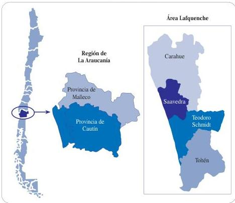

Las cuatro comunas incluidas en este perfil, presentan una marcada ruralidad, con cifras que fluctúan entre el 55 al 81% de la población residente en el agro local. Un rasgo también compartido por estas comunas es el escaso crecimiento poblacional, siendo algunas de ellas (Toltén y Saavedra) expulsoras de población, fenómeno muy probablemente asociado a los altos niveles de pobreza presentes en la zona,

-31-
en que uno de cada cuatro habitantes vive en situación de pobreza, medida de acuerdo a indicadores oficiales basados en una canasta estándar$^{2}$.

La comuna de Saavedra, que concentra en términos proporcionales más población mapuche, es precisamente la que también presenta mayores grados de ruralidad y de pobreza. Dado que estas dos situaciones exponen a su población a grados diferenciados de vulnerabilidad, Saavedra es una de las comunas en la cual el Estado ha focalizado su acción social en materia de pueblos indígenas. De hecho, está localizada, junto a Teodoro Schmidt, en la jurisdicción del ADI$^{3}$ Lago Budi. Por lo mismo, a través de esta investigación se generaron indicadores específicos para esta comuna, que se presentan en un anexo.

**Indicadores básicos de caracterización socioeconómica de las comunas del área lafkenche del SS Araucanía Sur**

|  Indicador | Comuna  |   |   |   |
| --- | --- | --- | --- | --- |
|   |  Carahue | Saavedra | Teodoro Schmidt | Toltén  |
|  % de ruralidad | 55,0 | 80,9 | 59,7 | 63,2  |
|  Variación poblacional intercensal 1992-2002 | 0,02 | -028 | 0,31 | -073  |
|  Pertenencia étnica |  |  |  |   |
|  1992 | 29,2 | 64,0 | 45,7 | 31,1  |
|  2002 | 29,2 | 64,3 | 38,1 | 32,0  |
|  Comunidades con título de mercedes |  |  |  |   |
|  Nº | 116 | 111 | 77 | 37  |
|  Hectáreas | 15.885 | 18.731 | 17.038 | 6.637  |
|  % viviendas con agua potable | 52,0 | 31,6 | 41,9 | 50,1  |
|  % viviendas con alcantarillado | 66,0 | 45,8 | 63,6 | 74,7  |
|  Pobreza |  |  |  |   |
|  Indigente | 11,6 | 9,1 | 4,7 | 6,1  |
|  No indigentes | 16,0 | 26,0 | 19,2 | 17,2  |
|  No Pobre | 72,4 | 64,9 | 76,1 | 76,7  |
|  Descenso pobreza total (1996-2006) | 31,2 | 23,7 | 19,6 | 8,1  |
|  % población alfabeto | 89,3 | 87,4 | 89,7 | 90,5  |
|  Territorios vulnerables | 4 | 3 | 20 | 4  |

Fuente: SERPLAC Región de La Araucanía, 2007

2 Para un análisis de las limitaciones de los métodos clásicos de medición de pobreza en contextos indígenas, ver CEPAL, 2007.

3 Las Áreas de Desarrollo Indígena son definidas por la Ley 19.253 como “espacios territoriales en los que los organismos de la administración del Estado focalizarán su acción en beneficio del desarrollo armónico de los indígenas y sus comunidades” (Artículo 6°).

-32-
Perfil epidemiológico básico de la población mapuche. Comunas del área lafkenche del Servicio de Salud Araucanía Sur

## 2. Red asistencial

En el área se localizan tres hospitales tipo 4$^{4}$: el Hospital de Toltén, el Hospital de Carahue y el Hospital Dr. Arturo Hillerns Larrañaga (Puerto Saavedra), todos ellos fundados en la década de los '60.

**Hospitales en las comunas del área lafkenche del SS Araucanía Sur**

|  Establecimiento | Año Construcción | Tipo | Población asignada | Camas  |
| --- | --- | --- | --- | --- |
|  H. Carahue | 1967 | IV | 26.650 | 67  |
|  H. Dr. Arturo Hillerns | 1965 | IV | 14.034 | 35  |
|  Hospital Toltén | 1964 | IV | 13.354 | 26  |

Existen, además, dos consultorios rurales: el Consultorio General Rural de Trovolhue, en la comuna de Carahue; y, el Consultorio General Rural de Teodoro Schmidt. En el área rural existen 41 postas de salud, cuya distribución por comuna se presenta en la Tabla N° 6.

**Red Asistencial Comunas Área Lafkenche del Servicio de Salud Araucanía Sur**

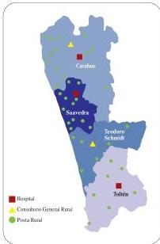

Fuente: SEREMI Salud Araucanía.

4

Los Hospitales Tipo 4, son aquellos establecimientos en que se realizan acciones de nivel primario, con o sin hospitalizaciones básicas; cuentan con tecnología de baja complejidad para usar en consulta externa y servicio de apoyo para diagnóstico y tratamiento de problemas de salud de menor severidad. Su rol en la red asistencial es el de “puerta de entrada”; resuelven problemas de salud frecuentes y de baja complejidad; derivan pacientes a establecimientos de mediana y alta complejidad; y, disponen de personal profesional general, técnico y auxiliar.

-33-
**Distribución postas de salud rural por comuna**

|  Comuna | Posta Salud Rural | Población Atendida  |
| --- | --- | --- |
|  Saavedra | Calof | 653  |
|   |  Butaco | 911  |
|   |  Deume-Rucatraro | 1.121  |
|   |  Huapi-Budi | 794  |
|   |  Nº 3 | 565  |
|   |  Perquiñán | 652  |
|   |  Piedra Alta | 612  |
|   |  Puerto Domínguez | 1.494  |
|   |  Puaucho | 397  |
|   |  Quifo-Oñoico | 733  |
|   |  Ranço | 947  |
|   |  Ramopulli | 1.145  |
|   |  El Temo | 826  |
|   |  La Sierra | 644  |
|  Teodoro Schmidt | Barros Arana | 2.333  |
|   |  Hualpín | 3.054  |
|   |  Nohualhue | 792  |
|   |  Pichinchelle | 946  |
|   |  Porma | 906  |
|   |  Yenehue | 1.183  |
|  Toltén | Boroa Sur | 530  |
|   |  Canaguey | 1.379  |
|   |  Las Quemas | 363  |
|   |  Licanculín | 200  |
|   |  Queulle | 2.610  |
|   |  Villa Los Boldos | 1.354  |
|   |  Puralaco - Puerto Esperanza | 1.065  |
|  Carahue | Nehuentue | 1.258  |
|   |  Alto Yupehue | 405  |
|   |  Catripulli | 822  |
|   |  Coi Coi-Lobería | 277  |
|   |  El Manzano | 382  |
|   |  Hueñalihuén | 487  |
|   |  La Cabaña | 512  |
|   |  Loncoyamo | 345  |
|   |  Los Placeres | 395  |
|   |  Matte y Sánchez | 500  |
|   |  Puyangue | 472  |
|   |  Santa Celia | 1.145  |
|   |  Tranapuente | 1.314  |
|   |  Agua Tendida | Sin Inf.  |

-34-
Perfil epidemiológico básico de la población mapuche. Comunas del área lafkenche del Servicio de Salud Araucanía Sur

### 3. Antecedentes sociodemográficos

#### 3.1. Cifras generales

La población mapuche, de acuerdo a los resultados del Censo de 2002, alcanza 604.349 personas, distribuidas a lo largo de todo el país, aunque concentrándose de manera primordial en las Regiones de La Araucanía (33,6%), Metropolitana (30,3%), Los Lagos (10,0%), Bío Bío (8,8%) y Los Ríos (6,6%).

**Distribución de la población Mapuche por Región. Total País**

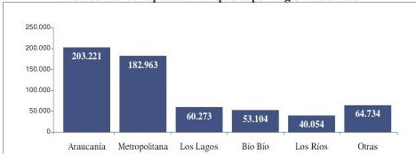

Fuente: Censo de Población y Vivienda, 2002

**Proporción de población Mapuche para las regiones del país.**

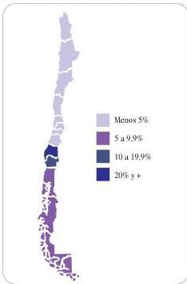

-35-
En la Región de La Araucanía, los mapuche representan al 23,4% de la población total; también es significativa la proporción de población mapuche en Los Ríos (11,3%), Los Lagos (8,5%) y Aysén (8,4%)

|  Población Mapuche País: | 604.349  |
| --- | --- |
|  Región de La Araucanía: | 203.221 (33,6% del total para el país)  |
|  Servicio de Salud Araucanía Sur: | 170.490 (83,9% del total regional)  |
|  Comunas del Área Lafkenche: | 25.914  |

### 3.2. Las comunas del área lafkenche del SS Araucanía Sur

La población de las comunas incluidas en este estudio alcanzaba, al año 2002, a 66.094 personas. De ellas, un 39,2% se autoidentica como mapuche. En el área, es la comuna de Saavedra la que concentra a la mayor cantidad de población mapuche (34,9%); a continuación se sitúan las comunas de Carahue (28,7%), Teodoro Schmidt (22,5%) y Toltén (13,8%).

Distribución de la población Mapuche por comuna

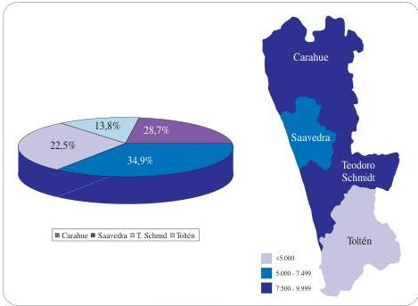

Fuente: Censo de Población y Vivienda, 2002

-36-
Perfil epidemiológico básico de la población mapuche. Comunas del área lafkenche del Servicio de Salud Araucanía Sur

Como se observa en el Gráfico N° 3, la composición étnica de la población es heterogénea. En el caso de la comuna de Saavedra, la proporción de población mapuche se sitúa por sobre la media para el área, con un 64,7%; en las comunas Toltén, Teodoro Schmidt y Carahue, ésta representa aproximadamente a un tercio de la población.

**Gráfico N° 3**
**Proporción de la población Mapuche por comuna**

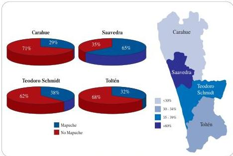

Fuente: Censo de Población y Vivienda, 2002

### 3.1. Estructura de la población por sexo y edad

Tal como ocurre en otras comunas del país con fuerte ruralidad, un análisis de la estructura de la población por sexo muestra índices de masculinidad más elevado que el promedio nacional⁵. En general, estos índices de masculinidad expresan movimientos migratorios selectivos por género, que afectan preferentemente a las mujeres; además, en el caso de los pueblos indígenas, podrían también estar influidos por grados conciencia étnica diferenciados entre hombres y mujeres. Indudablemente, se requieren investigaciones cualitativas que puedan examinar con profundidad cuáles son los procesos que están detrás de estas cifras. Aunque las diferencias entre mapuche y no mapuche no son muy significativas, se aprecia un mayor índice de masculinidad entre los primeros, en tres de las comunas, con excepción de Toltén.

5

En las comunas del área Lafkenche del SS Araucanía Sur, la ruralidad alcanza a un 62,9 de la población. Por comunas, las cifras fluctúan entre un 80,9%, en Saavedra; y, un 54,9%, en Carahue. En las cuatro comunas del área, la ruralidad en población mapuche es del orden del 80%.

-37-
**Gráfico N° 4**
Índice de masculinidad Mapuche-No Mapuche, por comuna

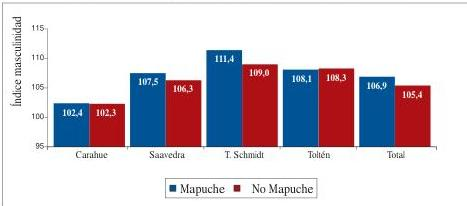

Fuente: Censo de Población y Vivienda, 2002

En términos etarios, los resultados del Censo de 2002 mostraban, a nivel nacional, que la población indígena era más joven que la no indígena. Ello se verificaba principalmente entre los indígenas residentes en zonas urbanas; los residentes en las áreas rurales, en cambio, mostraban mayores grados de envejecimiento de su estructura poblacional. Este patrón ya ha sido descrito para pueblos indígenas que, por los efectos de los flujos migratorios campo-ciudad, muestran un envejecimiento que no se debe solo a causas naturales, fenómeno que es conocido como envejecimiento “perverso”. (Ver Gráfico N° 5)

**Gráfico N° 5**
Índices de envejecimiento Población Mapuche - Población No Indígena. Total país

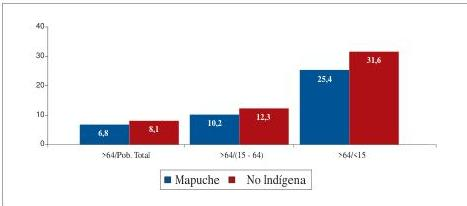

Fuente: Censo de Población y Vivienda, 2002

-38-
Perfil epidemiológico básico de la población mapuche. Comunas del área lafkenche del Servicio de Salud Araucanía Sur

Si bien este mayor envejecimiento de la población indígena rural se aprecia también entre los mapuche de las comunas focalizadas en este estudio, en las que 10,7% de la población es mayor de 64 años, conjuntamente se observa una fuerte presencia de población joven, con casi un 30% de menores de 15 años. En este ámbito, no se observan diferencias entre los mapuche y los no mapuche del área en estudio.

**Índices de envejecimiento población Mapuche y No Mapuche. Comunas área lafkenche**

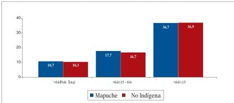

Fuente: Censo de Población y Vivienda, 2002

Se han calculado índices que se relacionan directamente con el envejecimiento de la población. El primero, corresponde a la proporción de mayores de 64 años respecto a la población total (>64/población total); el segundo, se refiere al porcentaje que representan los adultos mayores en relación a la población en edad de trabajar (>64/población de 15-64 años), indicador que tiene importancia para analizar aspectos de seguridad social; y, el tercero, establece la relación entre la población de 64 y más años y la población infantil (>64/población <15 años), referido a la capacidad de “renovación” generacional de las poblaciones.

El comportamiento de estos índices en las comunas del área lafkenche del SS Araucanía Sur, presenta diferencias muy poco significativas entre población mapuche y no mapuche.

Un análisis intraétnico de la población mapuche, diferenciado por sexo de estos mismos índices muestra una proporción levemente superior (20%) de ancianos que de ancianos; esa misma diferencia por sexos se aprecia en términos del índice dependencia.

-39-
**Gráfico N° 7**
**Índices de envejecimiento Mapuche y No Mapuche, por sexo**

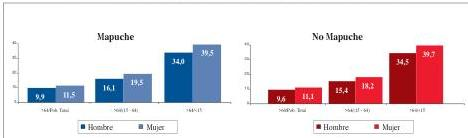

Fuente: Censo de Población y Vivienda, 2002

Si bien la estructura por sexo, como se señaló, presenta un predominio de población masculina tanto entre la población mapuche como en la no mapuche, en algunos segmentos etarios específicos el índice masculinidad es menor entre los mapuche (25 a 39 años), lo que pudiera estar asociado a procesos complejos que involucran tanto efectos de diferenciados de las migraciones por sexo y edad (mayor emigración masculina indígena) como menores grados de autoidentidad entre las mujeres de estas edades.

**Gráfico N° 8**
**Pirámide de edades Mapuche-No Mapuche. Comunas Área Lafkenche.**
**SS Araucanía Sur**

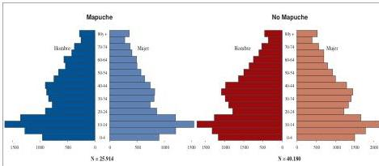

Fuente: Censo de Población y Vivienda, 2002

En las cuatro comunas consideradas, entre la población mapuche se observa una menor proporción de población entre los 25 y los 49 años, que entre la población no mapuche para esos mismos grupos (con excepción de Toltén). Ello, pudiera estar indicando una migración selectiva en estas edades, asociadas al mercado laboral.

-40-
Perfil epidemiológico básico de la población mapuche. Comunas del área lafkenche del Servicio de Salud Araucanía Sur

Las pirámides por comunas son muy similares a la descrita para el total de población del área lafkenche, mostrando un patrón estructural que afecta por igual a mapuche y no mapuche, que, entre otros aspectos, involucra tanto la crisis en los sistemas de producción agropecuarios, como la búsqueda de inserción laboral y de un mayor acceso a bienes y servicios del Estado en los medios urbanos.

**Gráfico N° 9**
**Pirámide de edades Mapuche-No Mapuche. Comuna de Carahue**

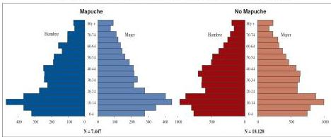

Fuente: Censo de Población y Vivienda, 2002

**Gráfico N° 10**
**Pirámide de edades Mapuche-No Mapuche. Comuna de Saavedra**

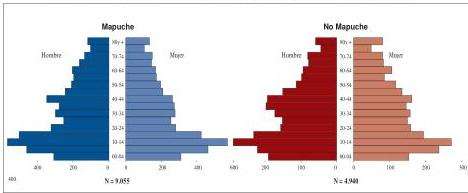

Fuente: Censo de Población y Vivienda, 2002

-41-
**Gráfico N° 11**
**Pirámide de edades Mapuche-No Mapuche. Comuna de Teodoro Schmidt**

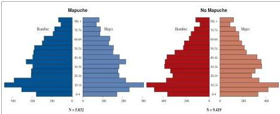

Fuente: Censo de Población y Vivienda, 2002

**Gráfico N° 12**
**Pirámide de edades Mapuche-No Mapuche. Comuna de Toltén**

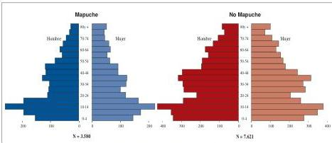

Fuente: Censo de Población y Vivienda, 2002

-42-
Perfil epidemiológico básico de la población mapuche. Comunas del área lafkenche del Servicio de Salud Araucanía Sur

## 4. Perfil de mortalidad

En el sexenio considerado para este análisis, se registraron 2.931 defunciones de personas residentes en las comunas del área lafkenche: 1.455, durante el trienio 2001-2003; y, 1.476, durante el trienio 2004-2006. En el primer período, un 50,3% de las muertes correspondieron a personas mapuche; y, en el segundo, un 49,1%.

### 4.1. Características generales

#### 4.1.1 Tasas brutas de mortalidad$^{6}$

Históricamente, el Servicio de Salud Araucanía Sur ha registrado tasas de mortalidad general superiores a las del país, situación que se constata también en los dos trienios analizados. Mientras que en el año 2002, el país tenía una tasa de 5,1 x 1.000 habitantes, el SS Araucanía Sur, registraba una de 5,9 x 1.000 habitantes. El 2005, las tasas fueron de 5,3 y 5,8 x 1.000 habitantes, respectivamente. (DEIS-MINSAL). La población de las comunas del área lafkenche tienen tasas aún más altas, con cifras de 7,4 x 1.000 habitantes, para el trienio 2001-2003 y de 7,1 x 1.000, para el período 2004-2006.

Evolución de la mortalidad general Mapuche-No Mapuche. Comunas área lafkenche (2001-2006)

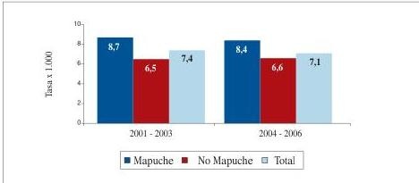

Fuente: Tabulaciones especiales proyecto de epidemiología sociocultural-2008, a partir de bases de datos DEIS-MINSAL.

En esta área, las tasas de mortalidad son más altas en población mapuche que en población no mapuche. De hecho, en los dos trienios, los mapuche tienen un 30% más de riesgo de morir que el resto de la población. Si bien entre 2001-2003 y 2004-2006 la mortalidad general ha disminuido, las brechas entre estas dos poblaciones persisten.

6

6 Si bien, atendiendo a las diferentes estructuras sexo-etarias de las poblaciones mapuche y no mapuche, más adelante se presentan tasas ajustadas de mortalidad, se ha optado por incluir también tasas brutas, puesto que estas cifras son posibles de comparar con indicadores nacionales y regionales.

-43-
# **a) Mortalidad general por área de residencia.**

Formalmente, y de acuerdo a las definiciones del Instituto Nacional de Estadísticas, en las cuatro comunas analizadas se distinguen áreas rurales y urbanas; sin embargo, es necesario tener en cuenta que, en la práctica, esta dicotomía no es tan clara, verificándose más bien un continuum entre los modos de vida campesinos y los estilos de vida de los pequeños poblados. La dinámica entre ellos, es de una permanente movilidad de la población mapuche. Esta particularidad debe considerarse para hacer una lectura contextualizada de los indicadores que se presentan para las poblaciones de áreas urbanas y rurales.

**Tasa bruta de mortalidad Mapuche-No Mapuche, por área de residencia (2001-2003)**

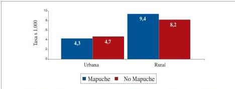

Fuente: Tabulaciones especiales proyecto de epidemiología sociocultural-2008, a partir de bases de datos DEIS-MINSAL

Diversos estudios han mostrado que la migración a áreas urbanas, en muchos casos, mejora la situación de salud de los pueblos indígenas, al menos medida a través de indicadores convencionales; coincidentemente con ello, las tasas de mortalidad general para el área lafkenche son más altas entre la población rural, ya sean mapuche o no mapuche (Ver Gráficos N° 14 y N° 15). En términos generales, los resultados muestran que la población mapuche rural tiene un 120% más de riesgo de morir que la residente en áreas urbanas. Sin embargo, la situación no es homogénea en las cuatro comunas, registrándose las mayores diferenciaciones urbano-rural en Teodoro Schmidt y Toltén (RR: 4,1 y 4,0, respectivamente), que disminuyen ostensiblemente en Carahue (RR: 2,2), hasta casi desaparecer en Saavedra, aunque hay que recordar que siempre las tasas son más altas que las de los no mapuche y que las tasas promedio para el país y la Región de La Araucanía.

Si bien algunas investigaciones señalan que en los contextos urbanos se agudizan las brechas entre indígenas y no indígenas, ello no pareciera ser tan claro para la población del área de cobertura de esta investigación. Aquí, mapuche y no mapuche presentan tasas de mortalidad bastante similares.

-44-
Perfil epidemiológico básico de la población mapuche. Comunas del área lafkenche del Servicio de Salud Araucanía Sur

En suma, tanto mapuche como no mapuche tienen una mayor mortalidad en el medio rural, pero las brechas entre indígenas, asociadas al área de residencia, son más pronunciadas que las diferencias observables entre los no indígenas, según este mismo criterio. Estas brechas diferenciadas remiten a la interacción acumulativa de determinantes sociales como la etnia y la ruralidad, que -en el caso del área lafkenche- está también asociada a la pobreza.

**Tasa bruta de mortalidad Mapuche- No Mapuche, por comuna, según área de residencia (2001-2003)**

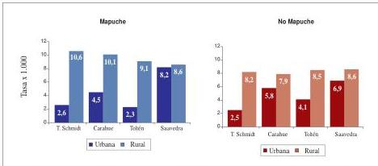

Fuente: Tabulaciones especiales proyecto de epidemiología sociocultural-2008, a partir de bases de datos DEIS-MINSAL.

### b) Mortalidad general por sexo

Un análisis diferenciado por sexo, muestra que, para los dos trienios considerados, los hombres mapuche tienen un 20% más de riego de morir que las mujeres mapuche. Las diferencias asociadas al sexo, son mayores en la población no mapuche, con riesgos 30% y 50% mayores en hombres, para los trienios 2001-2003 y 2004-2006, respectivamente.

Por otro lado, se observan mayores brechas entre mujeres mapuche y no mapuche, con un riesgo mayor para las indígenas (50 y 40%, para cada trienio analizado). Si bien los hombres mapuche también tienen un riesgo de morir mayor que los no mapuche, la brecha entre ellos es menor que la observada entre las mujeres (20% para ambos trienios).

-45-
**Tasa bruta de mortalidad Mapuche-No Mapuche, por sexo (2001-2006)**

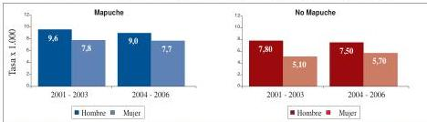

Fuente: Tabulaciones especiales proyecto de epidemiología sociocultural-2008, a partir de bases de datos DEIS-MINSAL

Al contrastar las tasas de mortalidad mapuche con las cifras nacionales para estos mismos períodos, se observa que tanto hombres como mujeres mapuche presentaron riesgos de morir un 70% mayores a los de los hombres y mujeres del país, para 2001-2003; y 60% mayores para el trienio 2004-2006.

Un desafío para los equipos locales de salud y las comunidades indígenas es el desarrollo de investigaciones específicas que permitan entender cómo interactúan los determinantes sociales etnia, posición socioeconómica y género, para analizar esta situación.

#### 4.1.2. Tasas ajustadas de mortalidad general

##### a) Mortalidad por comuna

En las cuatro comunas las tasas ajustadas de mortalidad general son más altas para la población mapuche que para la no mapuche, con riesgos relativos que fluctúan entre 1,2, en la comuna de Saavedra y 1,7 en la comuna de Teodoro Schmidt, para el trienio 2001-2003; y, entre 1,2 en Toltén y 1,4 en Teodoro Schmidt.

**Tasa ajustada mortalidad general Mapuche-No Mapuche (2001-2006)**

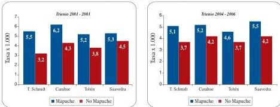

Fuente: Tabulaciones especiales proyecto de epidemiología sociocultural-2008, a partir de bases de datos DEIS-MINSAL

-46-
Perfil epidemiológico básico de la población mapuche. Comunas del área lafkenche del Servicio de Salud Araucanía Sur

Si bien el riesgo de morir en todas las comunas es siempre más alto para la población mapuche, la brecha con los no mapuche ha disminuido en Teodoro Schmidt, Carahue y Toltén; y, ha tenido un pequeño incremento en Saavedra.

**Gráfico N° 18**
**Evolución riego relativo Mapuche-No Mapuche, por comuna (2001-2006)**

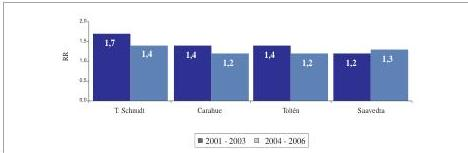

Fuente: Tabulaciones especiales proyecto de epidemiología sociocultural-2008, a partir de bases de datos DEIS-MINSAL.

**b) Mortalidad por sexo**

La tasa ajustada de mortalidad por sexo, muestra una tendencia similar a la ya descrita para las tasas brutas, con una posición general más desventajosa para los hombres mapuche, seguidos por las mujeres mapuche, los hombres no mapuche y situándose en la posición de menor riesgo las mujeres no mapuche. Sin embargo, es importante destacar que las brechas interétnicas asociadas al sexo (esto es la diferencia entre hombres mapuche y no mapuche; y las diferencias entre mujeres mapuche y no mapuche), persisten, con brechas más amplias entre las mujeres.

Al respecto, es necesario profundizar en el análisis sobre esta situación, pues pareciera corresponder a un patrón también presente en otros pueblos indígenas del país, según muestran otros estudios. (Oyarce y Pedrero, 2006 y 2007)

**Gráfico N° 19**
**Tasa ajustada mortalidad general Mapuche-No Mapuche, por sexo (2001-2006)**

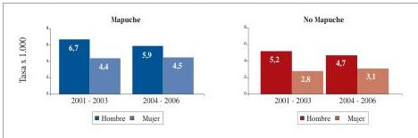

Fuente: Tabulaciones especiales proyecto de epidemiología sociocultural-2008, a partir de bases de datos DEIS-MINSAL.

-47-
### c) Mortalidad por edades

Al observar los riesgos relativos de muerte según origen étnico y grandes grupos de edad, se constata que el mayor riesgo de morir en población mapuche se concentra principalmente en edades tempranas, lo que indica la mayor vulnerabilidad a que está expuesta este grupo. Esta situación se ve fuertemente influida por la sobremortalidad infantil, aspecto que se abordará a continuación.

**Evolución riesgo relativo mortalidad Mapuche-No Mapuche, por grandes grupos de edad (2001-2006)**

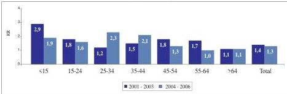

Fuente: Tabulaciones especiales proyecto de epidemiología sociocultural-2008, a partir de bases de datos DEIS-MINSAL

#### 4.1.3. Mortalidad infantil

Desde hace más de una década, Chile es uno de los países que presenta una de las tasas de mortalidad infantil más bajas en Latinoamérica (7,8 x 1.000 nacidos vivos, para el año 2002). Sin embargo, algunas áreas del país muestran indicadores mucho más deteriorados; es el caso del SS Araucanía Sur que, para el período 2001-2003, tuvo tasas entre un 20 a un 30% mayores que el promedio nacional.

**Tasa de mortalidad infantil Mapuche-No Mapuche (2001-2003)**

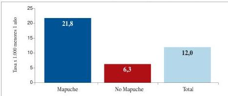

Fuente: Tabulaciones especiales proyecto de epidemiología sociocultural-2008, a partir de bases de datos DEIS-MINSAL

-48-
Perfil epidemiológico básico de la población mapuche. Comunas del área lafkenche del Servicio de Salud Araucanía Sur

Un análisis focalizado en las comunas seleccionadas muestra una desigualdad aún mayor en desmedro de los niños indígenas, que tienen 250% más riesgo de morir antes de cumplir un año que los niños no mapuche (RR: 3,5). Esta brecha de equidad es incluso más amplia que la que afecta a poblaciones indígenas de otras regiones del país. (Oyarce y Pedrero, 2006 y 2007)

## 4.2. Causas de muerte

### 4.2.1. Estructura de la mortalidad

El 2002, las principales causas de muerte en el país fueron las enfermedades del sistema circulatorio (27,7%), el cáncer (24,6%), las enfermedades del sistema respiratorio (9,5%) y los traumatismos, accidentes y violencias (9,0%)$^{7}$. El Servicio de Salud Araucanía Sur presentaba un patrón bastante similar, con las mismas dos primeras causas de muerte, aunque con valores levemente inferiores (25,1% y 22,5%, respectivamente)$^{8}$. Una situación particular que se observa en este Servicio de Salud durante este período, es que alrededor de un 11% de las muertes fue clasificado como “Síntomas, signos y hallazgos anormales...”, que en el país representaban sólo el 3% de las muertes.

En las comunas del área lafkenche, un 23,9% del total de defunciones se inscribe bajo esta misma categoría, que constituye la principal causa de muerte en la zona, tanto para población mapuche como no mapuche. Para el análisis de esta situación es necesario atender a las particularidades sociales y culturales de la población, dado que estas muertes no sólo se podrían relacionar, como generalmente se asume, con una falta de acceso a atención médica. También podrían asociarse a decisiones familiares tomadas en el marco de la cultura propia, sobre todo si se considera que se trata, en general, de personas de edad avanzada (con una edad promedio de 76 años). Por ejemplo, podría tratarse de personas que hayan “elegido un buen morir”, permaneciendo con sus familias y en sus comunidades, por lo que su defunción no tuvo certificación médica.

En términos generales, de no mediar las muertes registradas como “síntomas y signos anormales...”, la estructura de la mortalidad no mapuche sería similar a la del país. La de los mapuche, en cambio, presentan algunas diferencias, pues tres grupos de causa tienen casi un mismo peso relativo: circulatorias, traumatismos y cáncer.

En el área, las enfermedades del sistema circulatorio, además de no ser la primera causa de muerte entre mapuche y no mapuche, tiene un peso relativo dentro de la estructura de la mortalidad notoriamente más bajo, para ambos grupos, que el observable en el SS Araucanía Sur, en la Región de La Araucanía y en el país.

7

7 DEIS-MINSAL

8

8 DEIS-MINSAL

-49-
**Gráfico N° 22**
Distribución defunciones Mapuche-No Mapuche, por grupo de causa (2001-2003)

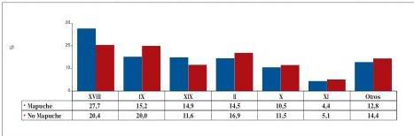

Fuente: Tabulaciones especiales proyecto de epidemiología sociocultural-2008, a partir de bases de datos DEIS-MINSAL

En el segundo trienio analizado (2004-2006), tanto la mortalidad mapuche como la no mapuche en las comunas del área lafkenche sigue la misma tendencia, en cuanto a estructura y pesos relativos, que la ya descrita para el trienio 2001-2003 (Ver gráficos N° 22 y 23).

**Gráfico N° 23**
Distribución defunciones Mapuche-No Mapuche, por grupo de causa (2004-2006)

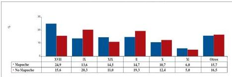

Fuente: Tabulaciones especiales proyecto de epidemiología sociocultural-2008, a partir de bases de datos DEIS-MINSAL

**Figura N° 15ª**
Comparación entre las principales causas de muerte País, SS Araucanía Sur y poblaciones Mapuche y No Mapuche de las comunas del área lafkenche (2001-2003)

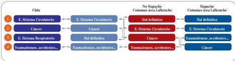

Fuente: Tabulaciones especiales proyecto de epidemiología sociocultural-2008, a partir de bases de datos DEIS-MINSAL

8 Los indicadores para el trienio 2001-2003, generados a través de este estudio para la población del área lafkenche, para fines de análisis, son contrastados, con las cifras disponibles para el país y para el SS Araucanía Sur correspondientes al año 2002; los del trienio 2004-2006, se contrastan con los indicadores disponibles para el años 2005.

-50-
Perfil epidemiológico básico de la población mapuche. Comunas del área lafkenche del Servicio de Salud Araucanía Sur

**Figura N° 16**
Comparación entre las principales causas de muerte País, SS Araucanía Sur y poblaciones Mapuche y No Mapuche de las comunas del área lafkenche (2004-2006)

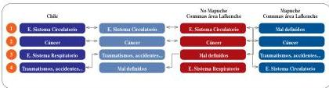

Fuente: Tabulaciones especiales proyecto de epidemiología sociocultural-2008, a partir de bases de datos DEIS-MINSAL

En el trienio 2001-2003, tanto para hombres como para mujeres mapuche, la principal causa de muerte fueron los “síntomas, signos y hallazgos anormales...”, aunque para ellas, las muertes atribuidas a este gran grupo de causa son mucho más significativas. Entre las mujeres, el cáncer constituye la segunda causa de muerte (17,9%); entre los hombres, en tanto, este lugar está ocupado por los Traumatismos, accidentes y violencias, con un 22,7%. Tanto para hombres como para mujeres, la tercera causa de muerte son las enfermedades del sistema circulatorio (14,6% y 16,2%, respectivamente)

**Figura N° 17**
Comparación de las principales causas de muerte entre hombres Mapuche y No Mapuche de las comunas del área lafkenche (2001-2003 y 2004-2006)

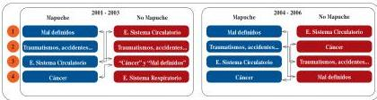

Fuente: Tabulaciones especiales proyecto de epidemiología sociocultural-2008, a partir de bases de datos DEIS-MINSAL

**Figura N° 18**
Comparación de las principales causas de muerte entre mujeres Mapuche y No Mapuche de las comunas del área lafkenche (2001-2003 y 2004-2006)

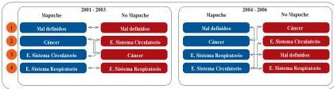

Fuente: Tabulaciones especiales proyecto de epidemiología sociocultural-2008, a partir de bases de datos DEIS-MINSAL

-51-
**Distribución defunciones Mapuche por grupo de causa, según sexo (2001-2003)**

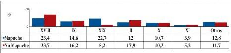

Fuente: Tabulaciones especiales proyecto de epidemiología sociocultural-2008, a partir de bases de datos DEIS-MINSAL

En el trienio 2004-2006, si bien disminuyen las muertes atribuidas a “síntomas, signos y hallazgos anormales...”, tanto en hombres como en mujeres, este gran grupo de enfermedad continúa siendo la principal causa de muerte para los mapuche del área estudiada. La estructura, en este período, es similar a la del trienio anterior para los dos sexos.

**Distribución defunciones Mapuche por grupo de causa, según sexo (2004-2006)**

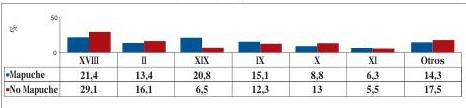

Fuente: Tabulaciones especiales proyecto de epidemiología sociocultural-2008, a partir de bases de datos DEIS-MINSAL

#### 4.2.2. Riesgos diferenciales de mortalidad mapuche y no mapuche

En todos los grupos de causa de muerte, la mortalidad ajustada es mayor en mapuche que en no mapuche, apreciándose las mayores brechas entre ellos para las muertes por “síntomas, signos y hallazgos anormales...”, “traumatismos, accidentes y violencias” y “enfermedades infecciosas y parasitarias”. Si bien estas últimas tiene un bajo peso relativo en la estructura general de mortalidad mapuche, las desigualdades son más pronunciadas en este grupo, en ambos períodos analizados; y, lejos de acortarse, se incrementan.

También se observa un aumento de las brechas entre mapuche y no mapuche en las dos principales grupos de causa de muerte: “síntomas, signos y hallazgos anormales...” y “causas externas de mortalidad”, con riesgos relativos que se incrementan de un 80% a un 110%, para el primero; y, de un 70% a un 80%, en el segundo.

-52-
Perfil epidemiológico básico de la población mapuche. Comunas del área lafkenche del Servicio de Salud Araucanía Sur

Siempre teniendo presente que hay una sobremortalidad mapuche en todos los grupos de causa de muerte en los dos trienios, parece relevante destacar que en algunos de éstos se ha registrado una disminución de las brechas entre mapuche y no mapuche; tal es el caso de las muertes originadas por enfermedades del sistema circulatorio, cáncer y sistema respiratorio.

**Gráfico N° 26**
**Tasa ajustada de mortalidad Mapuche-No Mapuche, por grupo de causa (2001-2003)**

|   | XVIII | IX | XIX | II | X | XI | Otros  |
| --- | --- | --- | --- | --- | --- | --- | --- |
|  Mapuche | 131,0 | 73,4 | 116,8 | 72,3 | 56,7 | 25,5 | 11,2  |
|  No Mapuche | 73,1 | 69,0 | 67,5 | 65,5 | 41,4 | 20,2 | 4,7  |

Fuente: Tabulaciones especiales proyecto de epidemiología sociocultural-2008, a partir de bases de datos DEIS-MINSAL

**Gráfico N° 27**
**Tasa ajustada de mortalidad Mapuche-No Mapuche por grupo de causa (2004-2006)**

|   | XVIII | IX | XIX | II | X | XI | Otros  |
| --- | --- | --- | --- | --- | --- | --- | --- |
|  Mapuche | 116,0 | 64,4 | 101,2 | 73,6 | 49,7 | 27,1 | 10,9  |
|  No Mapuche | 55,8 | 72,8 | 56,8 | 73,9 | 45,5 | 20,0 | 3,0  |

Fuente: Tabulaciones especiales proyecto de epidemiología sociocultural-2008, a partir de bases de datos DEIS-MINSAL

**Gráfico N° 28**
**Evolución riesgo relativo por grupos de causa (2001-2003 y 2004-2006)**

|   | 2001 - 2003 | 2004 - 2006  |
| --- | --- | --- |
|  IRR | 1,8 | 2,1  |
|  IRR | 1,1 | 0,9  |
|  IRR | 1,7 | 1,8  |
|  IRR | 1,1 | 1,0  |
|  IRR | 1,4 | 1,1  |
|  IRR | 1,3 | 1,4  |
|  IRR | 2,4 | 3,6  |

Fuente: Tabulaciones especiales proyecto de epidemiología sociocultural-2008, a partir de bases de datos DEIS-MINSAL

-53-
#### 4.2.2.1. Situaciones específicas

##### a) Síntomas, signos y hallazgos anormales clínicos y de laboratorio no clasificados en otra parte (Grupo 18)

La desagregación de las muertes atribuidas a “Síntomas, signos y hallazgos anormales...” por comuna, permite profundizar el análisis de la primera causa de muerte en el área, incluyendo descriptores que posibiliten una lectura más contextualizada de ella. Un primer elemento común en toda el área es que, proporcionalmente, las muertes por esta causa tienen siempre un peso relativo mayor entre mapuche que entre no mapuche. Un segundo rasgo común, es que corresponden mayoritariamente a muertes de residentes en zonas rurales, tanto para mapuche como no mapuche; por ello, junto con los factores socioculturales mencionados con anterioridad, es posible asumir que también están asociadas a problemas en el acceso a la atención médica. Sin embargo, el hecho de que las muertes por esta causa de residentes en áreas rurales son proporcionalmente más relevantes entre mapuche que entre no mapuche, hace pensar que los efectos de estos determinantes son acumulativos para ellos.

**Gráfico N° 29**
**Proporción de muertes Mapuche y No Mapuche por Grupo 18, según comuna (2004-2006)**

|   | Carabue | Saavedra | T. Schmidt | Tollén  |
| --- | --- | --- | --- | --- |
|  Mapuche | 22,5 | 27,8 | 29,4 | 7,0  |
|  No Mapuche | 14,9 | 20,8 | 28,4 | 2,7  |

Fuente: Tabulaciones especiales proyecto de epidemiología sociocultural-2008, a partir de bases de datos DEIS-MINSAL

**Gráfico N° 30**
**Edad promedio muertes Mapuche y No Mapuche por Grupo 18, según sexo (2004-2006)**

|   | Mapuche | No Mapuche | Total  |
| --- | --- | --- | --- |
|  Promedio Edad | 72,3 | 77,4 | 74,8  |
|  Nombre | 78,8 | 82,3 | 80,1  |
|  Mujer | 75,7 | 79,4 | 79,4  |

Fuente: Tabulaciones especiales proyecto de epidemiología sociocultural-2008, a partir de bases de datos DEIS-MINSAL

-54-
Perfil epidemiológico básico de la población mapuche. Comunas del área lafkenche del Servicio de Salud Araucanía Sur

No es posible atribuir una única explicación a las muertes por esta causa, dado que en esta categoría se agrupan eventos de distinta naturaleza, que efectivamente involucran los problemas de acceso a atención médica de las poblaciones rurales, pero que podrían incluir también las decisiones familiares vinculadas, tal como se señaló anteriormente, a elementos culturales.

# **b) Muertes por enfermedades del Sistema Circulatorio (Grupo 9)**

Las muertes por enfermedades del Sistema Circulatorio tienen una gran importancia en la estructura general de mortalidad, pues en los dos trienios analizados están entre las tres primeras causas de muerte, si excluimos del análisis las muertes por “Síntomas, signos y hallazgos anormales...”

En el trienio 2001-2003, se aprecia, en términos generales, una leve sobremortalidad mapuche por esta causa (10% más de riesgo), situación que se invierte en el período siguiente. En el primero de estos períodos la sobremortalidad mapuche es sostenida entre los 25 y los 64 años, reduciéndose la brecha a partir de los 65 años. Una posible explicación para ello es que algunas de muertes por esta causa hayan quedado sin certificación médica y estén consignadas bajo el grupo XVIII.

Para el trienio siguiente, en el caso mapuche, los riesgos de morir por esta causa disminuyen sistemáticamente a partir de los 25 años. Entre los no mapuche, en cambio, aumentan en grupos de edad específicos: 35-44 y 55-64 años.

**Tasa ajustada mortalidad Mapuche-No Mapuche por Grupo 9 (2001-2006)**

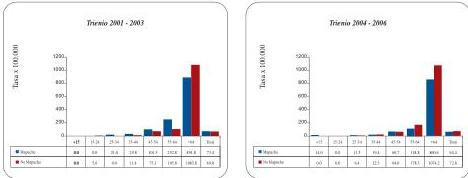

Fuente: Tabulaciones especiales proyecto de epidemiología sociocultural-2008, a partir de bases de datos DEIS-MINSAL.

-55-
**Gráfico N° 32**
Tasa ajustada mortalidad Mapuche y No Mapuche por Grupo 9, según comuna (2001-2003)

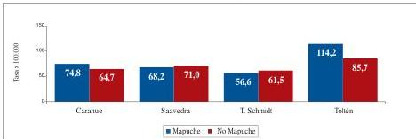

Fuente: Tabulaciones especiales proyecto de epidemiología sociocultural-2008, a partir de bases de datos DEIS-MINSAL

### c) Mortalidad por cáncer (Grupo 2)

Llama la atención que esta causa de muerte, más bien asociada a la vida moderna, se ubique entre las primeras causas en contextos preponderantemente rurales como los involucrados en este estudio. Sin embargo, si observamos el tipo de cáncer según órgano afectado, esto adquiere más sentido, dado que se localizan principalmente en los órganos digestivos; y, los estudios epidemiológicos muestran una relación entre el uso de algunos fertilizantes agrícolas y este tipo de cáncer. Dentro de este grupo de muertes pueden también estar incidiendo los cáncer a la vesícula asociados a la litiasis biliar. (Roa et. al., 1991)

En términos de riesgo relativo, entre los dos períodos considerados, la posibilidad de morir por esta causa se ha mantenido igual para los mapuche y ha aumentado un 20% para los no mapuche.

**Gráfico N° 33**
Tasa ajustada mortalidad Mapuche-No Mapuche por Grupo 2 (2001-2006)

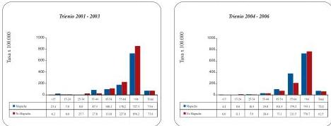

Fuente: Tabulaciones especiales proyecto de epidemiología sociocultural-2008, a partir de bases de datos DEIS-MINSAL

-56-
Perfil epidemiológico básico de la población mapuche. Comunas del área lafkenche del Servicio de Salud Araucanía Sur

**Distribución relativa muertes Mapuche-No Mapuche por grupo 2, según localización (2001-2006)**

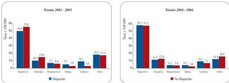

Fuente: Tabulaciones especiales proyecto de epidemiología sociocultural-2008, a partir de bases de datos DEIS-MINSAL.

Para una análisis diferenciado por sexo, es necesario tener en cuenta que hay un riesgo biológico distinto para hombres y mujeres, tal es el caso del cáncer cérvico-uterino y de mama, que en el país son las principales muertes por esta causa entre las mujeres. En la zona, el patrón nacional no se repite, ya que aquí para indígenas y no indígenas, hombres y mujeres, los cánceres digestivos originan la mitad de las muertes por este gran grupo de causa.

**Tasa ajustada mortalidad Mapuche por grupo 2, según sexo (2001-2006)**

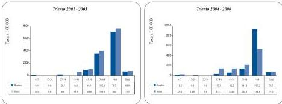

Fuente: Tabulaciones especiales proyecto de epidemiología sociocultural-2008, a partir de bases de datos DEIS-MINSAL.

Entre los mapuche, el riesgo de morir por cáncer se ha mantenido estable entre el 2001 y el 2006; un análisis diferenciado por sexo, muestra un riesgo de morir levemente superior para las mujeres de este pueblo que para los hombres (RR: 1,1, en ambos trienios)

-57-
**Distribución muertes Mapuche y No Mapuche por Grupo 2, según sexo (2001-2003)**

|   | Mapuche |   |   | No Mapuche |   |   |   |
| --- | --- | --- | --- | --- | --- | --- | --- |
|   |  Sexo |   | Total | Sexo |   | Total  |   |
|   |  Hombre | Mujer |   | Hombre | Mujer  |   |   |
|  Órganos digestivos | 41,3 | 57,7 | 50,0 | 56,3 | 54,7 | 55,6 | 53,2  |
|  Órganos genitales | 10,9 | 9,6 | 10,2 | 17,5 | 11,3 | 15,0 | 13,0  |
|  Órganos respiratorios | 8,7 | 5,8 | 7,1 | 6,3 | 5,7 | 6,0 | 6,5  |
|  Mama | 0,0 | 9,6 | 5,1 | 1,3 | 5,7 | 3,0 | 3,9  |
|  Melanoma | 4,3 | 0,0 | 2,0 | 3,8 | 3,8 | 3,8 | 3,0  |
|  Tejido linfático | 13,0 | 5,8 | 9,2 | 2,5 | 3,8 | 3,0 | 5,6  |
|  De comportamiento incierto | 6,5 | 5,8 | 6,1 | 2,5 | 3,8 | 3,0 | 4,3  |
|  De sitios mal definidos | 6,5 | 1,9 | 4,1 | 2,5 | 7,5 | 4,5 | 4,3  |
|  Otro | 8,7 | 3,8 | 6,1 | 7,5 | 3,8 | 6,0 | 6,1  |
|  Total | 100,0 | 100,0 | 100,0 | 100,0 | 100,0 | 100,0 | 100,0  |
|  N | 46 | 52 | 98 | 80 | 53 | 133 | 231  |

Fuente: Elaboración propia, a partir de proyecciones DEIS-MINSAL y Censo de 2002

**Distribución muertes Mapuche y No Mapuche por Grupo 2, según sexo (2004-2006)**

|   | Mapuche |   |   | No Mapuche |   |   |   |
| --- | --- | --- | --- | --- | --- | --- | --- |
|   |  Sexo |   | Total | Sexo |   | Total  |   |
|   |  Hombre | Mujer |   | Hombre | Mujer  |   |   |
|  Órganos digestivos | 53,1 | 63,8 | 58,3 | 59,0 | 56,4 | 57,7 | 57,9  |
|  Órganos genitales | 14,3 | 8,5 | 11,5 | 12,8 | 12,8 | 12,8 | 12,3  |
|  Órganos respiratorios | 6,1 | 2,1 | 4,2 | 5,1 | 2,6 | 3,8 | 4,0  |
|  Mama | 0,0 | 8,5 | 4,2 | 0,0 | 5,1 | 2,6 | 3,2  |
|  Melanoma | 0,0 | 0,0 | 0,0 | 5,1 | 1,3 | 3,2 | 2,0  |
|  Tejido linfático | 14,3 | 4,3 | 9,4 | 6,4 | 7,7 | 7,1 | 7,9  |
|  De comportamiento incierto | 4,1 | 0,0 | 2,1 | 1,3 | 2,6 | 1,9 | 2,0  |
|  De sitios mal definidos | 4,1 | 2,1 | 3,1 | 2,6 | 2,6 | 2,6 | 2,8  |
|  Otro | 4,1 | 10,6 | 7,3 | 7,7 | 9,0 | 8,3 | 7,9  |
|  Total | 100,0 | 100,0 | 100,0 | 100,0 | 100,0 | 100,0 | 100,0  |
|  N | 49 | 47 | 96 | 78 | 78 | 156 | 252  |

Fuente: Elaboración propia, a partir de proyecciones DEIS-MINSAL y Censo de 2002

-58-
Perfil epidemiológico básico de la población mapuche. Comunas del área lafkenche del Servicio de Salud Araucanía Sur

# **d) Traumatismos, envenenamientos y algunas otras consecuencias de causa externa (grupo 19)**

Pese a que entre 2001 y 2006 el riesgo de morir por esta causa, para mapuche y no mapuche, ha disminuido en un 20%, las brechas entre los dos segmentos poblacionales aumenta en un 10% entre un trienio y otro. Los mayores riesgos para la población mapuche se concentran en >15 años y 25 a 44 años.

**Tasa ajustada mortalidad Mapuche-No Mapuche por Grupo 19 (2001-2006)**

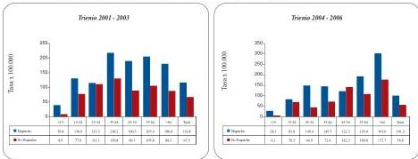

Fuente: Tabulaciones especiales proyecto de epidemiología sociocultural-2008, a partir de bases de datos DEIS-MINSAL

Dentro de este gran grupo de causa, el suicidio, como factor único, constituye un índice de los problemas que vive la población mapuche. El riesgo de muerte por suicidio era un 50% mayor para los mapuche que para los no mapuche, entre 2001-2003; aumentando a un 100% en el trienio siguiente. Cabe hacer notar que la mayoría los casos corresponden a hombres mapuche jóvenes residentes en sectores rurales.

**Tasa ajustada mortalidad por suicidio Mapuche-No Mapuche (2001-2006)**

Fuente: Tabulaciones especiales proyecto de epidemiología sociocultural-2008, a partir de bases de datos DEIS-MINSAL

-59-
## 5. Perfil de morbilidad

### 5.1. Egresos hospitalarios

Los egresos hospitalarios constituyen la principal fuente convencional disponible para el estudio de la morbilidad, no obstante representan un sector de la población y de las enfermedades prevalentes: aquel que tiene acceso a un centro de salud que posee un sistema de hospitalización. Para este análisis se han excluido los egresos del grupo XV, relacionadas con el embarazo, parto y puerperio que son lejos las más numerosas, y tienden distorsionar la estructura de la morbilidad.$^{10}$

Para efectos de este diagnóstico, se seleccionaron, además de los hospitales de las comunas del estudio, los dos principales hospitales bases de referencia para los pobladores del área costera lafkenche: Hospital de Nueva Imperial y Hospital de Temuco.

**Distribución egresos hospitalarios Mapuche-No Mapuche de establecimientos seleccionados, por gran grupo de enfermedad (2004-2006)**

Fuente: Tabulaciones especiales proyecto de epidemiología sociocultural-2008, a partir de bases de datos DEIS-MINSAL

En todos los establecimientos de las comunas en estudio, se observa un patrón similar respecto a las dos principales causas egresos para el período 2004-2006. La primera corresponde a las enfermedades del sistema respiratorio, que oscila entre un cuarto y un tercio del total de egresos; le siguen los “Traumatismos, envenenamientos y algunas otras consecuencias de causa externa” con cifras entre un 10 y 15% de todos los egresos.

La población mapuche sigue esta misma tendencia, aunque -en términos porcentuales- se hospitalizan menos por las principales causas de egreso de la población general y más por otras causas, mostrando una mayor heterogeneidad en la morbilidad. Por otra parte, hay que resaltar el hecho que, a pesar de que la persona estuvo hospitalizada y con atención médica, hay un porcentaje cercano al 10% de los egresos en que no se logró un diagnóstico final. Proporción que es sistemáticamente más alta en la población mapuche.

10

Sugerencia recogida de las propias profesionales de salud que asistieron a los talleres de presentación e interpretación de estos datos, realizada en la Región de la Araucanía junio del 2008.

-60-
Perfil epidemiológico básico de la población mapuche. Comunas del área lafkenche del Servicio de Salud Araucanía Sur

**Gráfico N° 39**
**Distribución relativa egresos hospitalarios Mapuche-No Mapuche. Hospital de Carahue (2004-2006)**

|   | X | XIX | XVIII | XI | V | Otros  |
| --- | --- | --- | --- | --- | --- | --- |
|  • Mapuche | 28,1 | 12,2 | 9,8 | 7,0 | 7,0 | 35,9  |
|  • No Mapuche | 29,9 | 13,7 | 7,6 | 9,0 | 5,6 | 34,2  |

Fuente: Tabulaciones especiales proyecto de epidemiología sociocultural-2008, a partir de bases de datos DEIS-MINSAL

**Gráfico N° 40**
**Distribución relativa egresos hospitalarios Mapuche-No Mapuche. Hospital Puerto Saavedra (2004-2006)**

|   | X | XIX | XVIII | XI | IX | Otros  |
| --- | --- | --- | --- | --- | --- | --- |
|  • Mapuche | 26,0 | 10,2 | 10,0 | 10,0 | 8,4 | 35,0  |
|  • No Mapuche | 32,8 | 15,6 | 7,8 | 9,7 | 5,0 | 29,1  |

Fuente: Tabulaciones especiales proyecto de epidemiología sociocultural-2008, a partir de bases de datos DEIS-MINSAL

**Gráfico N° 41**
**Egresos hospitalarios Mapuche-No Mapuche. Hospital de Toltén (2004-2006)**

|   | X | XIX | IX | I | XI | Otros  |
| --- | --- | --- | --- | --- | --- | --- |
|  • Mapuche | 27,9 | 10,0 | 9,0 | 8,5 | 8,00 | 36,2  |
|  • No Mapuche | 32,1 | 11,2 | 4,7 | 8,3 | 9,50 | 34,1  |

Fuente: Tabulaciones especiales proyecto de epidemiología sociocultural-2008, a partir de bases de datos DEIS-MINSAL

Los egresos desde el Hospital de Temuco de pobladores de las comunas focalizadas en este estudio, difieren de la situación descrita, ya que están asociados mayoritariamente a enfermedades del sistema digestivo. Llama la atención que las enfermedades cardiovasculares no aparecen como una causa importante, al igual que los estados mórbidos mal definidos.

-61-
Gráfico N° 42

# Distribución relativa egresos hospitalarios de residentes en comunas del área lafkenche.  
Hospital Temuco (2004-2006)

Fuente: Tabulaciones especiales proyecto de epidemiología sociocultural-2008, a partir de bases de datos DEIS-MINSAL

De manera similar a los egresos del Hospital de Temuco, en el Hospital de Imperial las enfermedades digestivas son también la enfermedad más importante diagnosticada en los egresos, sin diferencias entre mapuche y no mapuche; respecto a las otras causas, se observa un patrón similar entre mapuches y no mapuches, siendo levemente más alta en los primeros los egresos debidos a “Traumatismos, envenenamientos y algunas otras consecuencias de causa externa”.

Gráfico N° 43

# Distribución relativa egresos hospitalarios de residentes en comunas del área lafkenche.  
Hospital Nueva Imperial (2004-2006)

Fuente: Tabulaciones especiales proyecto de epidemiología sociocultural-2008, a partir de bases de datos DEIS-MINSAL

## 5.2. Enfermedades de notificación obligatoria (ENO)

Existe un grupo de enfermedades que, por su alta contagiosidad, reviste una gran importancia para la salud pública. Por ese motivo, se ejerce la vigilancia epidemiológica, es decir, la recolección de datos estadísticos sobre la frecuencia con la cual la enfermedad ocurre, lo que permite calcular las tendencias en la incidencia y brotes. Aunque en todos los países existen listas de este tipo, hay una gran variabilidad entre ellos. Los Servicios de Salud deben encontrar las fuentes de contagio y entregar el tratamiento adecuado dependiendo de cada enfermedad.

-62-
Perfil epidemiológico básico de la población mapuche. Comunas del área lafkenche del Servicio de Salud Araucanía Sur

Algunas se relacionan con el medio ambiente, otras con la purificación del agua, el control de insectos y animales, el seguimiento de las enfermedades de transmisión sexual, así como los programas de inmunizaciones.

Las ENO permiten establecer una aproximación a la morbilidad; sin embargo, no sólo se ven afectadas por la incidencia de la enfermedad y por el hecho de que la persona consulte, sino también por la exhaustividad de la notificación médica. Por ello sus sesgos son aún mayores.

Dado que los antecedentes personales de los enfermos son confidenciales para una serie de estas enfermedades, no fue posible dar cuenta de todas ellas. Se excluyeron de este análisis la notificaciones de VIH-SIDA y de enfermedades de transmisión sexual como la gonorrea, que no consignaban los datos necesarios para aplicar los criterios de identificación étnica de los casos. A través de este procedimiento, se analizaron 266 notificaciones para el período 2001-2005$^{11}$. De ellas, 37,2% corresponden a personas mapuche; 59,8%, a no mapuche; y, un 3,0% no se pudo clasificar, pues no se disponía de apellidos en las bases de datos$^{12}$.

**Distribución relativa ENO seleccionadas. Mapuche-No Mapuche (2001-2005)**

Fuente: Tabulaciones especiales proyecto de epidemiología sociocultural-2008, a partir de bases de datos DEIS-MINSAL.

En términos generales, no se aprecian mayores diferencias entre mapuche y no mapuche. Las ETS constituyen para ambos grupos poco más de un tercio de estas notificaciones; casi un cuarto, también en ambos grupos, corresponde a Hepatitis A.

10

No se pudo acceder a los datos correspondientes al año 2006.

11

Todas ellas correspondientes a notificaciones de VIH

-63-
## 6. Situación de la Tuberculosis

La tuberculosis (TBC) es una enfermedad infecciosa ocasionada por el bacilo de Koch, que se encuentra en todo el mundo y en la actualidad se puede prevenir y curar. Sin embargo, permanece como una infección importante a nivel mundial. Su epidemiología muestra una distribución global desigual, con tasas más altas en los países menos desarrollados, especialmente en Asia y África; se estima que actualmente un tercio de la población del mundo tiene una infección de tuberculosis latente.

Durante el pasado siglo fue una de las principales causas de muerte en los adultos. Con el desarrollo de los antimicrobianos y el mejoramiento de las condiciones sociales y sanitarias hubo una progresiva disminución de la incidencia de esta enfermedad y de las muertes que ocasionaba, principalmente en los países desarrollados. Sin embargo, en los últimos años la TBC ha sido considerada una enfermedad re emergente por diversos factores, entre los que destaca el bajo nivel de cumplimiento del tratamiento, que favorece la aparición de resistencias adquiridas a las drogas antituberculosas; y la infección por el VIH debido a la reactivación de la infección tuberculosa previa o por infección primaria por la condición inmunológica deprimida. Así, se predice que -en los países en desarrollo- será la cuarta causa de muerte en el año 2020. Entre 1998 y 2030 se esperan 225 millones de nuevos casos y 79 millones de muertes por esta causa

A pesar de que en Chile, el programa de TBC es gratuito y universal, esta enfermedad se mantiene en forma endémica con tasas relativamente elevadas en las I, IX y X Región (período 1996-2003), que son además las áreas donde se concentra la población indígena. Las condiciones de vida desfavorables (vivir en áreas confinadas, con ventilación pobre y bajas condiciones de saneamiento ambiental), sumadas a diversos factores como: a) la migración campo-ciudad; b) las características socioculturales relacionadas a un modelo de salud-enfermedad-curación diferente al predominante en el mundo occidental; c) la falta de adecuación cultural de los servicios; y, d) problemas en la organización médica, ponen a las poblaciones indígenas en general en un riesgo mayor de contraer esta enfermedad.

Se ha descrito que el mayor determinante de la TBC es la situación de pobreza y marginalidad social. Por ello, se ha dicho que la mejor manera de combatir esta enfermedad es combatir la pobreza. La situación sostenida de la TBC en poblaciones indígenas de Chile parece mucho más compleja.

### 6.1. Morbilidad por tuberculosis

Como se observa en el Gráfico N° 45, las tasas de incidencia de tuberculosis entre la población mapuche de las comunas consideradas en este estudio son sistemáticamente más altas que las encontradas en población no indígena durante

-64-
Perfil epidemiológico básico de la población mapuche. Comunas del área lafkenche del Servicio de Salud Araucanía Sur

los dos trienios analizados; por otra parte, los riesgos relativos de los mapuche siguen duplicando el riesgo de los no mapuche. Así, y pese a que el Servicio de Salud de Araucanía Sur presenta tasas bajas a nivel nacional, las tasas de incidencia de TBC para los dos períodos muestran una significativa brecha entre la población mapuche y la no mapuche.

**Gráfico N° 45**
**Tasa ajustada incidencia TBC Mapuche-No Mapuche (2001-2006)**

Fuente: Tabulaciones especiales proyecto de epidemiología sociocultural-2008, a partir de bases de datos DEIS-MINSAL.

## 6.2. Mortalidad por tuberculosis

En el caso de los fallecidos por Tuberculosis, y considerando que en términos absolutos la cifra es baja, la situación en el primer trienio es contradictoria, ya que los datos muestran una mayor mortalidad en personas no mapuches. Por el contrario, durante el trienio 2004-2006 todas las personas que fallecieron por TBC en las cuatro comunas del estudio, fueron indígenas.

**Gráfico N° 46**
**Tasa ajustada mortalidad por TBC Mapuche-No Mapuche. (2001-2006)**

Fuente: Tabulaciones especiales proyecto de epidemiología sociocultural-2008, a partir de bases de datos DEIS-MINSAL.

-65-
## 7. Conclusiones y recomendaciones.

Este diagnóstico epidemiológico básico diferenciado para la población mapuche y no mapuche del área lafkenche del Servicio de Salud Araucanía Sur, corresponde a la cuarta etapa de un proyecto más amplio de epidemiología sociocultural e intercultural desarrollado por las autoras para la Unidad de Salud de Pueblos Indígenas y el Departamento de Epidemiología del Ministerio de Salud.

Los resultados, basados en la combinación y estandarización de fuentes de datos disponibles en el Ministerio de Salud, el Servicio de Salud Araucanía Sur y en la Corporación Nacional de Desarrollo Indígena, relevan tres aspectos fundamentales:

- Al igual que otras poblaciones indígenas de Chile, la población mapuche de las comunas del área lafkenche del Servicio de Salud Araucanía Sur, tiene un perfil de morbi-mortalidad diferente al de la población no indígena de la misma área.
- Este perfil es diferente, además, del que presentan otros pueblos indígenas, como el caso de los aymara que residen en el área de cobertura del Servicio de Salud Arica y de Iquique.
- No obstante las diferencias, el común denominador es la sobremortalidad en todos los grupos de edad, asociado a un patrón epidemiológico de transición prolongada y polarizada, en que persisten simultáneamente altos niveles de infecciones comunes, enfermedades degenerativas-crónicas y lesiones, en un contexto de agudización de las desigualdades sociales en materia de salud. (Frenk, 1993)

Para una interpretación de los determinantes sociales que subyacen a este perfil de morbimortalidad, habría que contextualizar la situación de los mapuche, remitiéndose a la historia de la conquista y colonización de los pueblos indígenas que institucionalizó, desde el momento del contacto, la discriminación que relegó a estos pueblos a los sectores más marginales de las sociedades latinoamericanas. (Peredo, 2004)

**Así, la sobremortalidad que se aprecia en el diagnóstico epidemiológico lafkenche evidencia la discriminación estructural que sufren los pueblos indígenas al interior de una sociedad que en pleno siglo XXI todavía presenta rasgos coloniales. Estos rasgos se manifiestan en la consecuente exclusión de los pueblos indígenas y que hoy, en el marco de sus derechos colectivos específicos, sólo se puede interpretar como una brecha en la implementación de los derechos a la salud y la vida.**

En términos generales creemos que este patrón diferencial es el resultado de una compleja combinación de una “inequidad acumulada”, debido a la posición marginal en la estructura social que presentan estos pueblos, que se combina con un modo

-66-
Perfil epidemiológico básico de la población mapuche. Comunas del área lafkenche del Servicio de Salud Araucanía Sur

diferente de vida.

Los datos aportados por este diagnóstico nos enfrentan al desafío de seguir elaborando herramientas metodológicas que permitan analizar la complejidad de los procesos sociales responsables de estos perfiles de salud y enfermedad diferenciados, que muestran una brecha en el cumplimiento del derecho a la salud, como bien universal; y, a una salud con integridad cultural, como derecho colectivo de los pueblos indígenas.

Para profundizar en la comprensión de la situación de salud de la población mapuche del área lafkenche aquí descrita, los equipos locales tendrán que asumir el desafío de desarrollar una verdadera epidemiología con enfoque sociocultural, que rescate las propias categorías de definición étnica, e incluya los modelos médicos indígenas, sus conceptos de persona, tiempo y lugar, y que defina unidades de análisis que tengan sentido para la gente. Ello, permitirá comprender la red de causalidades de estas condiciones de salud y, a partir de allí, se podrán definir estrategias de fortalecimiento de los factores protectores y de modificación de los factores agresores que inciden en ella.

Para avanzar en este proceso, se sugiere:

En el ámbito teórico-metodológico:

- A nivel del conocimiento, desarrollar estudios en profundidad, con la plena participación de las personas y organizaciones mapuche del área lafkenche, que incluyan las formas en que se organiza el mundo indígena y los significados que en él tienen las experiencias de salud-enfermedad.
- A nivel teórico, desarrollar modelos de comprensión de los procesos de salud-enfermedad que den cuenta de la interacción entre diversos factores: individuales, familiares, comunitarios (estructura social)
- A nivel operativo, desarrollar instrumentos y técnicas que sean capaces de medir el impacto de los diversos factores en la producción de la salud-enfermedad-curación.

En estudios específicos:

Desarrollar estudios de epidemiología con enfoque sociocultural-intercultural, que permitan comprender cómo se relacionan los modos de vida tradicionales con los contextos socioestructurales concretos en que vive la población mapuche de las comunas del área lafkenche del Servicio de Salud Araucanía Sur.

- Comparar este perfil con el de la población mapuche del Servicio de Salud Magallanes, identificando similitudes y diferencias
- Hacer estudios de casos sobre las defunciones por Síntomas, signos y hallazgos anormales clínicos y de laboratorio no clasificados en otra parte (Grupo 18).

-67-
- Conocer los factores protectores y de riesgo respecto de las enfermedades del sistema circulatorio.
- Buscar comprender la relación entre estresores sociales y las muertes e incidencia de “Traumatismos y violencias”. Especial importancia se debería dar a las muertes por suicidio en población rural joven.
- Profundizar en la investigación del cáncer, sobre todo los asociados al Sistema Digestivo.
- Explorar las razones de la persistencia de enfermedades infecciosas generales y de la TBC en particular.
- Complementar con estudios sobre calidad y demanda de atención en un escenario de pluralismo médico: itinerarios terapéuticos.

**En el nivel operativo:** Mejorar el registro de la “variable etnia” en las estadísticas vitales y en todos los sistemas de registro de los servicios de salud explorando los criterios de definición más válidos y consistentes.

-68-
Perfil epidemiológico básico de la población mapuche. Comunas del área lafkenche del Servicio de Salud Araucanía Sur

## BIBLIOGRAFÍA

Citarella et. al.  
1995 Medicina y Cultura en la Araucanía. Editorial Sudamericana.Frenk  
1993 La salud de la población: hacia una nueva salud pública. Ediciones Fondo de Cultura Económica. MéxicoOyarce y Pedrero  
2006 Perfil epidemiológico básico de la población aymara del Servicio de Salud Arica. Serie Análisis de la Situación de Salud de los Pueblos Indígenas de Chile N° 1. MINSAL.  
2007 Perfil epidemiológico básico de la población aymara del Servicio de Salud Iquique. Serie Análisis de la Situación de Salud de los Pueblos Indígenas de Chile N° 3. MINSAL.Peredo  
2004 Una aproximación a la problemática de género y etnicidad en América Latina. Serie Mujer y Desarrollo N° 53. CEPAL.Roa et. al.,  
1991 Colelitiasis en la IX Región. Estudio de autopsias en una población de alta proporción mapuche. Revista Médica de Chile 119: 1367-1371

-69-

-70-
Perfil epidemiológico básico de la población mapuche. Comunas del área lafkenche del Servicio de Salud  
Araucanía Sur

## ANEXO N° 1 INDICADORES BÁSICOS DE SALUD PARA LA COMUNA DE SAAVEDRA

|  Gráfico N° 1 | Evolución de la mortalidad general Mapuche No Mapuche. Comuna de Saavedra (2001-2006) | 72  |
| --- | --- | --- |
|  Gráfico N° 2 | Tasa ajustada mortalidad general Mapuche-No Mapuche. Comuna de Saavedra (2001-2003) | 72  |
|  Gráfico N° 3 | Tasa ajustada mortalidad general Mapuche-No Mapuche. Comuna de Saavedra (2004-2006) | 72  |
|  Gráfico N° 4 | Tasa ajustada mortalidad general Mapuche, por sexo. Comuna de Saavedra (2001-2003) | 73  |
|  Gráfico N° 5 | Tasa ajustada mortalidad general Mapuche, por sexo. Comuna de Saavedra (2004-2006) | 73  |
|  Gráfico N° 6 | Distribución relativa defunciones Mapuche-No Mapuche, por grupo de causa. Comuna Saavedra (2001-2003) | 73  |
|  Gráfico N° 7 | Distribución relativa defunciones Mapuche-No Mapuche, por grupo de causa. Comuna de Saavedra (2004-2006) | 74  |

-71-
**Gráfico N° 1**
**Evolución de la mortalidad general Mapuche-No Mapuche. Comuna de Saavedra**
**(2001-2006)**

Fuente: Tabulaciones especiales proyecto de epidemiología sociocultural-2008, a partir de bases de datos DEIS-MINSAL

**Gráfico N° 2**
**Tasa ajustada mortalidad general Mapuche-No Mapuche. Comuna de Saavedra**
**(2001-2003)**

Fuente: Tabulaciones especiales proyecto de epidemiología sociocultural-2008, a partir de bases de datos DEIS-MINSAL

**Gráfico N° 3**
**Tasa ajustada mortalidad general Mapuche-No Mapuche. Comuna de Saavedra**
**(2004-2006)**

Fuente: Tabulaciones especiales proyecto de epidemiología sociocultural-2008, a partir de bases de datos DEIS-MINSAL

-72-
Perfil epidemiológico básico de la población mapuche. Comunas del área lafkenche del Servicio de Salud Araucanía Sur

**Gráfico N° 4**
**Tasa ajustada mortalidad general Mapuche, por sexo. Comuna de Saavedra**
**(2001-2003)**

Fuente: Tabulaciones especiales proyecto de epidemiología sociocultural-2008, a partir de bases de datos DEIS-MINSAL

**Gráfico N° 5**
**Tasa ajustada mortalidad general Mapuche, por sexo. Comuna de Saavedra**
**(2004-2006)**

Fuente: Tabulaciones especiales proyecto de epidemiología sociocultural-2008, a partir de bases de datos DEIS-MINSAL

**Gráfico N° 6**
**Distribución relativa defunciones Mapuche-No Mapuche, por grupo de causa.**
**Comuna Saavedra (2001-2003)**

Fuente: Tabulaciones especiales proyecto de epidemiología sociocultural-2008, a partir de bases de datos DEIS-MINSAL

-73-
**Gráfico N° 7**
**Distribución relativa defunciones Mapuche-No Mapuche, por grupo de causa.**
**Comuna de Saavedra (2004-2006)**

|   | XVIII | XIX | IX | II | X | XI | Otros  |
| --- | --- | --- | --- | --- | --- | --- | --- |
|  Mapuche | 26,4 | 16,1 | 14,0 | 12,8 | 9,9 | 5,4 | 11,6  |
|  No Mapuche | 22,3 | 6,3 | 21,4 | 20,5 | 12,5 | 3,6 | 13,4  |

Fuente: Tabulaciones especiales proyecto de epidemiología sociocultural-2008, a partir de bases de datos DEIS-MINSAL

-74-
Perfil epidemiológico básico de la población mapuche. Comunas del área lafkenche del Servicio de Salud  
Araucanía Sur

## TABULADOS BÁSICOS

|  Tabla N° 1 | Distribución de la población por comuna, según pertenencia a pueblos indígenas | 77  |
| --- | --- | --- |
|  Tabla N° 2 | Distribución de la población Mapuche-No Mapuche por grupos quinquenales de edad, según sexo. Comunas área lafkenche (2002) | 77  |
|  Tabla N° 3 | Distribución de la población Mapuche-No Mapuche por grupos quinquenales de edad, según sexo. Comuna de Saavedra (2002) | 78  |
|  Tabla N° 4 | Distribución de la población Mapuche-No Mapuche por grupos quinquenales de edad, según sexo. Comuna de Carahue (2002) | 78  |
|  Tabla N° 5 | Distribución de la población Mapuche-No Mapuche por grupos quinquenales de edad, según sexo. Comuna de Teodoro Schmidt (2002) | 79  |
|  Tabla N° 6 | Distribución de la población Mapuche-No Mapuche por grupos quinquenales de edad, según sexo. Comuna de Toltén (2002) | 79  |
|  Tabla N° 7 | Distribución de la población por grupos quinquenales de edad, según sexo. Mapuche-No Mapuche. Comunas área lafkenche (2005) | 80  |
|  Tabla N° 8 | Distribución de la población por grupos quinquenales de edad, según sexo. Mapuche-No Mapuche. Comuna de Saavedra (2005) | 80  |
|  Tabla N° 9 | Distribución de la población por grupos quinquenales de edad, según sexo. Mapuche-No Mapuche. Comunas de Carahue (2005) | 81  |
|  Tabla N° 10 | Distribución de la población por grupos quinquenales de edad, según sexo. Mapuche-No Mapuche. Comuna de Teodoro Schmidt (2005) | 81  |

-75-
|  Tabla N° 11 | Distribución de la población por grupos quinquenales de edad, según sexo. Mapuche-No Mapuche. Comuna de Toltén (2005) | 82  |
| --- | --- | --- |
|  Tabla N° 12 | Distribución defunciones por gran grupo de causa. Mapuche-No Mapuche (*Trienio 2001-2003*) | 82  |
|  Tabla N° 13 | Distribución defunciones por gran grupo de edad, según sexo. (*Trienio 2001-2003*) | 83  |
|  Tabla N° 14 | Distribución defunciones por gran grupo de causa. Mapuche-No Mapuche (*Trienio 2004-2006*) | 83  |
|  Tabla N° 15 | Distribución defunciones por gran grupo de causa, según sexo. (*Trienio 2004-2006*) | 84  |
|  Tabla N° 16 | Distribución defunciones por gran grupo de causa, según comuna. (*Trienio 2004-2006*) | 84  |
|  Tabla N° 17 | Distribución defunciones por gran grupo de edad, según sexo. (*Trienio 2004-2006*) | 85  |
|  Tabla N° 18 | Distribución egresos hospitalarios por gran grupo de enfermedad, según establecimiento seleccionado. (*Trienio 2004-2006*) | 85  |

-76-
Perfil epidemiológico básico de la población mapuche. Comunas del área lafkenche del Servicio de Salud Araucanía Sur

**Distribución de la población por comuna, según pertenencia a pueblos indígenas**

|  Comuna | Pertenencia a pueblos indígenas  |   |   |   |
| --- | --- | --- | --- | --- |
|   |  Indígena |   | No indígena | Total  |
|   |  Mapuche | Otro pueblo indígena  |   |   |
|  Carahue | 7.447 | 25 | 18.103 | 25.575  |
|  Saavedra | 9.055 | 41 | 4.899 | 13.995  |
|  Teodoro Schmidt | 5.832 | 29 | 9.462 | 15.323  |
|  Toltén | 3.580 | 15 | 7.606 | 11.201  |
|  Total | 25.914 | 110 | 40.070 | 66.094  |

*Fuente: Censo de Población y Vivienda, 2002*

**Distribución de la población Mapuche-No Mapuche por grupos quinquenales de edad, según sexo. Comunas área lafkenche (2002)**

|  Gran grupo quinquenal de Edad | Mapuche |   |   |   |   |   | Toda la población  |   |   |
| --- | --- | --- | --- | --- | --- | --- | --- | --- | --- |
|   |  Sexo |   | Total | No Mapuche |   | Total | Sexo |   | Total  |
|   |  Hombre | Mujer |   | Hombre | Mujer |   | Hombre | Mujer  |   |
|  00-04 años | 962 | 906 | 1868 | 1673 | 1505 | 3178 | 2635 | 2411 | 5046  |
|  05-09 años | 1281 | 1211 | 2492 | 1855 | 1807 | 3662 | 3136 | 3018 | 6154  |
|  10-14 años | 1642 | 1539 | 3181 | 2231 | 2155 | 4386 | 3873 | 3694 | 7567  |
|  15-19 años | 1356 | 1205 | 2561 | 1777 | 1676 | 3453 | 3133 | 2881 | 6014  |
|  20-24 años | 906 | 862 | 1768 | 1290 | 1250 | 2540 | 2106 | 2112 | 4308  |
|  25-29 años | 781 | 743 | 1524 | 1422 | 1342 | 2764 | 2203 | 2085 | 4288  |
|  30-34 años | 843 | 813 | 1656 | 1500 | 1427 | 2927 | 2343 | 2240 | 4583  |
|  35-39 años | 879 | 827 | 1706 | 1596 | 1461 | 3057 | 2475 | 2288 | 4763  |
|  40-44 años | 907 | 748 | 1655 | 1498 | 1305 | 2803 | 2405 | 2053 | 4458  |
|  45-49 años | 746 | 641 | 1387 | 1150 | 1012 | 2162 | 1806 | 1653 | 3549  |
|  50-54 años | 664 | 576 | 1240 | 1018 | 926 | 1944 | 1642 | 1502 | 3184  |
|  55-59 años | 539 | 501 | 1040 | 870 | 804 | 1674 | 1409 | 1305 | 2714  |
|  60-64 años | 566 | 504 | 1070 | 758 | 720 | 1478 | 1324 | 1224 | 2548  |
|  65-69 años | 419 | 410 | 829 | 632 | 695 | 1327 | 1051 | 1105 | 2156  |
|  70-74 años | 370 | 387 | 757 | 536 | 557 | 1093 | 906 | 944 | 1850  |
|  75-79 años | 251 | 287 | 538 | 360 | 385 | 745 | 611 | 672 | 1283  |
|  80 y más | 280 | 362 | 642 | 456 | 531 | 987 | 716 | 893 | 1629  |
|  Total | 13392 | 12522 | 25914 | 20622 | 19558 | 40180 | 34014 | 32080 | 66094  |

*Fuente: Censo de Población y Vivienda, 2002*

-77-
**Distribución de la población Mapuche-No Mapuche por grupos quinquenales de edad, según sexo. Comuna de Saavedra (2002)**

|  Gran grupo quinquenal de Edad | Mapuche |   |   | No Mapuche |   |   | Toda la población  |   |   |
| --- | --- | --- | --- | --- | --- | --- | --- | --- | --- |
|   |  Sexo |   | Total | Sexo |   | Total | Sexo |   | Total  |
|   |  Hombre | Mujer |   | Hombre | Mujer |   | Hombre | Mujer  |   |
|  00-04 años | 308 | 309 | 617 | 195 | 154 | 349 | 503 | 463 | 966  |
|  05-09 años | 461 | 461 | 922 | 224 | 241 | 465 | 685 | 702 | 1387  |
|  10-14 años | 568 | 571 | 1139 | 290 | 272 | 562 | 858 | 843 | 1701  |
|  15-19 años | 502 | 418 | 920 | 232 | 195 | 427 | 734 | 613 | 1347  |
|  20-24 años | 320 | 280 | 600 | 156 | 162 | 318 | 476 | 442 | 918  |
|  25-29 años | 251 | 251 | 502 | 154 | 151 | 305 | 405 | 402 | 807  |
|  30-34 años | 299 | 275 | 574 | 174 | 159 | 333 | 473 | 434 | 907  |
|  35-39 años | 278 | 272 | 550 | 199 | 148 | 347 | 477 | 420 | 897  |
|  40-44 años | 345 | 261 | 606 | 195 | 163 | 358 | 540 | 424 | 964  |
|  45-49 años | 244 | 206 | 450 | 150 | 135 | 285 | 394 | 341 | 735  |
|  50-54 años | 206 | 197 | 403 | 115 | 123 | 238 | 321 | 320 | 641  |
|  55-59 años | 195 | 171 | 366 | 99 | 87 | 186 | 294 | 258 | 552  |
|  60-64 años | 200 | 169 | 369 | 95 | 108 | 203 | 295 | 277 | 572  |
|  65-69 años | 164 | 142 | 306 | 83 | 84 | 167 | 247 | 226 | 473  |
|  70-74 años | 134 | 146 | 280 | 84 | 82 | 166 | 218 | 228 | 446  |
|  75-79 años | 101 | 101 | 202 | 43 | 50 | 93 | 144 | 151 | 295  |
|  80 y más | 115 | 134 | 249 | 57 | 81 | 138 | 172 | 215 | 387  |
|  Total | 4691 | 4364 | 9055 | 2545 | 2395 | 4940 | 7236 | 6759 | 13995  |

*Fuente: Censo de Población y Vivienda, 2002*

**Distribución de la población Mapuche-No Mapuche por grupos quinquenales de edad, según sexo. Comuna de Carahue (2002)**

|  Gran grupo quinquenal de Edad | Mapuche |   |   | No Mapuche |   |   | Toda la población  |   |   |
| --- | --- | --- | --- | --- | --- | --- | --- | --- | --- |
|   |  Sexo |   | Total | Sexo |   | Total | Sexo |   | Total  |
|   |  Hombre | Mujer |   | Hombre | Mujer |   | Hombre | Mujer  |   |
|  00-04 años | 320 | 283 | 603 | 769 | 741 | 1510 | 1.089 | 1.024 | 2.113  |
|  05-09 años | 370 | 345 | 715 | 798 | 795 | 1593 | 1.168 | 1.140 | 2.308  |
|  10-14 años | 475 | 442 | 917 | 972 | 993 | 1965 | 1.447 | 1.435 | 2.882  |
|  15-19 años | 367 | 406 | 773 | 885 | 871 | 1756 | 1.252 | 1.277 | 2.529  |
|  20-24 años | 272 | 282 | 554 | 594 | 602 | 1196 | 866 | 884 | 1750  |
|  25-29 años | 221 | 216 | 437 | 644 | 601 | 1245 | 865 | 817 | 1682  |
|  30-34 años | 244 | 236 | 480 | 642 | 632 | 1274 | 886 | 868 | 1754  |
|  35-39 años | 242 | 216 | 458 | 695 | 638 | 1333 | 937 | 854 | 1791  |
|  40-44 años | 249 | 214 | 463 | 635 | 576 | 1211 | 884 | 790 | 1674  |
|  45-49 años | 191 | 193 | 384 | 505 | 465 | 970 | 696 | 658 | 1354  |
|  50-54 años | 185 | 163 | 348 | 485 | 422 | 907 | 670 | 585 | 1255  |
|  55-59 años | 136 | 145 | 281 | 393 | 375 | 768 | 529 | 520 | 1049  |
|  60-64 años | 158 | 136 | 294 | 313 | 317 | 630 | 471 | 453 | 924  |
|  65-69 años | 104 | 122 | 226 | 261 | 305 | 566 | 365 | 427 | 792  |
|  70-74 años | 104 | 109 | 213 | 214 | 227 | 441 | 318 | 336 | 654  |
|  75-79 años | 61 | 77 | 138 | 165 | 176 | 341 | 226 | 253 | 479  |
|  80 y más | 69 | 94 | 163 | 195 | 227 | 422 | 264 | 321 | 585  |
|  Total | 3768 | 3679 | 7447 | 9165 | 8963 | 18128 | 12.933 | 12.642 | 25.575  |

*Fuente: Censo de Población y Vivienda, 2002*

-78-
Perfil epidemiológico básico de la población mapuche. Comunas del área lafkenche del Servicio de Salud Araucanía Sur

**Distribución de la población Mapuche-No Mapuche por grupos quinquenales de edad, según sexo. Comuna de Teodoro Schmidt (2002)**

|  Gran grupo quinquenal de Edad | Mapuche |   |   |   |   |   | Toda la población  |   |   |
| --- | --- | --- | --- | --- | --- | --- | --- | --- | --- |
|   |  Sexo |   | Total | No Mapuche |   | Total | Sexo |   | Total  |
|   |  Hombre | Mujer |   | Hombre | Mujer |   | Hombre | Mujer  |   |
|  00-04 años | 179 | 171 | 350 | 363 | 332 | 695 | 542 | 503 | 1045  |
|  05-09 años | 254 | 234 | 488 | 477 | 419 | 896 | 731 | 653 | 1384  |
|  10-14 años | 340 | 306 | 646 | 542 | 510 | 1052 | 882 | 816 | 1698  |
|  15-19 años | 291 | 217 | 508 | 368 | 345 | 713 | 659 | 562 | 1221  |
|  20-24 años | 204 | 181 | 385 | 322 | 278 | 600 | 526 | 459 | 985  |
|  25-29 años | 204 | 176 | 380 | 337 | 306 | 643 | 541 | 482 | 1023  |
|  30-34 años | 197 | 181 | 378 | 390 | 363 | 753 | 587 | 544 | 1131  |
|  35-39 años | 230 | 216 | 446 | 384 | 361 | 745 | 614 | 577 | 1191  |
|  40-44 años | 197 | 182 | 379 | 368 | 322 | 690 | 555 | 504 | 1069  |
|  45-49 años | 193 | 150 | 343 | 297 | 231 | 528 | 430 | 381 | 871  |
|  50-54 años | 189 | 153 | 342 | 226 | 212 | 438 | 415 | 365 | 780  |
|  55-59 años | 149 | 131 | 280 | 218 | 188 | 406 | 357 | 319 | 686  |
|  60-64 años | 141 | 135 | 276 | 175 | 164 | 339 | 316 | 299 | 615  |
|  65-69 años | 95 | 87 | 182 | 155 | 163 | 318 | 250 | 250 | 500  |
|  70-74 años | 87 | 90 | 177 | 130 | 138 | 268 | 217 | 228 | 445  |
|  75-79 años | 56 | 67 | 123 | 79 | 88 | 167 | 135 | 155 | 290  |
|  80 y más | 67 | 82 | 149 | 118 | 122 | 240 | 155 | 204 | 389  |
|  Total | 3073 | 2759 | 5832 | 4949 | 4542 | 9491 | 8022 | 7301 | 15323  |

Fuente: Censo de Población y Vivienda, 2002

**Distribución de la población Mapuche-No Mapuche por grupos quinquenales de edad, según sexo. Comuna de Toltén (2002)**

|  Gran grupo quinquenal de Edad | Mapuche |   |   |   |   |   | Toda la población  |   |   |
| --- | --- | --- | --- | --- | --- | --- | --- | --- | --- |
|   |  Sexo |   | Total | No Mapuche |   | Total | Sexo |   | Total  |
|   |  Hombre | Mujer |   | Hombre | Mujer |   | Hombre | Mujer  |   |
|  00-04 años | 155 | 143 | 298 | 346 | 278 | 624 | 501 | 421 | 922  |
|  05-09 años | 196 | 171 | 367 | 356 | 352 | 708 | 552 | 523 | 1075  |
|  10-14 años | 259 | 220 | 479 | 427 | 380 | 807 | 666 | 600 | 1286  |
|  15-19 años | 196 | 164 | 360 | 292 | 265 | 557 | 488 | 429 | 917  |
|  20-24 años | 110 | 119 | 229 | 218 | 208 | 426 | 328 | 327 | 655  |
|  25-29 años | 105 | 100 | 205 | 287 | 284 | 571 | 392 | 384 | 776  |
|  30-34 años | 103 | 121 | 224 | 294 | 273 | 567 | 397 | 394 | 791  |
|  35-39 años | 129 | 123 | 252 | 318 | 314 | 632 | 447 | 437 | 884  |
|  40-44 años | 116 | 91 | 207 | 300 | 244 | 544 | 416 | 335 | 751  |
|  45-49 años | 118 | 92 | 210 | 198 | 181 | 379 | 316 | 273 | 589  |
|  50-54 años | 84 | 63 | 147 | 192 | 169 | 361 | 276 | 232 | 508  |
|  55-59 años | 59 | 54 | 113 | 160 | 154 | 314 | 219 | 208 | 427  |
|  60-64 años | 67 | 64 | 131 | 175 | 131 | 306 | 242 | 195 | 437  |
|  65-69 años | 56 | 59 | 115 | 133 | 143 | 276 | 189 | 202 | 391  |
|  70-74 años | 45 | 42 | 87 | 108 | 110 | 218 | 153 | 152 | 305  |
|  75-79 años | 33 | 42 | 75 | 73 | 71 | 144 | 136 | 113 | 219  |
|  80 y más | 29 | 52 | 81 | 86 | 101 | 187 | 115 | 153 | 268  |
|  Total | 1860 | 1720 | 3580 | 3963 | 3658 | 7621 | 5823 | 5378 | 11201  |

Fuente: Censo de Población y Vivienda, 2002

-79-
**Distribución de la población por grupos quinquenales de edad, según sexo. Mapuche-**

|  Gran grupo quinquenal de Edad | Mapuche |   |   | No Mapuche |   |   | Toda la población  |   |   |
| --- | --- | --- | --- | --- | --- | --- | --- | --- | --- |
|   |  Sexo |   | Total | Sexo |   | Total | Sexo |   | Total  |
|   |  Hombre | Mujer |   | Hombre | Mujer |   | Hombre | Mujer  |   |
|  00-04 años | 1060 | 998 | 2058 | 1.782 | 1.722 | 3.504 | 2.842 | 2.720 | 5.562  |
|  05-09 años | 1202 | 1136 | 2338 | 1.836 | 1.600 | 3.436 | 3.038 | 2.736 | 5.774  |
|  10-14 años | 1406 | 1318 | 2724 | 1.942 | 1.820 | 3.762 | 3.348 | 3.138 | 6.486  |
|  15-19 años | 1471 | 1309 | 2780 | 1.873 | 1.873 | 3.746 | 3.344 | 3.182 | 6.526  |
|  20-24 años | 1022 | 974 | 1996 | 1.439 | 1.432 | 2.871 | 2.461 | 2.406 | 4.867  |
|  25-29 años | 688 | 656 | 1344 | 1.193 | 1.247 | 2.440 | 1.881 | 1.903 | 3.784  |
|  30-34 años | 792 | 764 | 1556 | 1.425 | 1.327 | 2.752 | 2.217 | 2.091 | 4.308  |
|  35-39 años | 851 | 802 | 1653 | 1.524 | 1.441 | 2.965 | 2.375 | 2.243 | 4.618  |
|  40-44 años | 977 | 806 | 1783 | 1.542 | 1.481 | 3.023 | 2.519 | 2.287 | 4.806  |
|  45-49 años | 900 | 773 | 1673 | 1.437 | 1.169 | 2.606 | 2.337 | 1.942 | 4.279  |
|  50-54 años | 708 | 616 | 1324 | 1.124 | 956 | 2.080 | 1.832 | 1.572 | 3.404  |
|  55-59 años | 593 | 552 | 1145 | 993 | 853 | 1.846 | 1.586 | 1.405 | 2.991  |
|  60-64 años | 582 | 518 | 1100 | 772 | 747 | 1.519 | 1.354 | 1.265 | 2.619  |
|  65-69 años | 435 | 426 | 861 | 732 | 644 | 1.376 | 1.167 | 1.070 | 2.237  |
|  70-74 años | 371 | 388 | 759 | 507 | 590 | 1.097 | 878 | 978 | 1.856  |
|  75-79 años | 257 | 293 | 550 | 367 | 396 | 763 | 624 | 689 | 1.313  |
|  80 y más | 253 | 327 | 580 | 407 | 484 | 891 | 660 | 811 | 1.471  |
|  Total | 13568 | 12656 | 26224 | 20.895 | 19.782 | 40.677 | 34.463 | 32.438 | 66.901  |

*Fuente: Censo de Población y Vivienda, 2002*

**Distribución de la población por grupos quinquenales de edad, según sexo. Mapuche-**

|  Gran grupo quinquenal de Edad | Mapuche |   |   | No Mapuche |   |   | Toda la población  |   |   |
| --- | --- | --- | --- | --- | --- | --- | --- | --- | --- |
|   |  Sexo |   | Total | Sexo |   | Total | Sexo |   | Total  |
|   |  Hombre | Mujer |   | Hombre | Mujer |   | Hombre | Mujer  |   |
|  00-04 años | 313 | 314 | 627 | 183 | 171 | 354 | 496 | 485 | 981  |
|  05-09 años | 372 | 372 | 744 | 204 | 170 | 374 | 576 | 542 | 1118  |
|  10-14 años | 486 | 488 | 974 | 240 | 241 | 481 | 726 | 729 | 1455  |
|  15-19 años | 519 | 432 | 951 | 200 | 241 | 441 | 719 | 673 | 1392  |
|  20-24 años | 352 | 308 | 660 | 180 | 169 | 349 | 532 | 477 | 1009  |
|  25-29 años | 242 | 242 | 484 | 143 | 151 | 294 | 385 | 393 | 778  |
|  30-34 años | 274 | 252 | 526 | 138 | 167 | 305 | 412 | 419 | 831  |
|  35-39 años | 286 | 280 | 566 | 187 | 170 | 357 | 473 | 450 | 923  |
|  40-44 años | 332 | 252 | 584 | 162 | 182 | 344 | 494 | 434 | 928  |
|  45-49 años | 311 | 263 | 574 | 213 | 150 | 363 | 524 | 413 | 937  |
|  50-54 años | 224 | 214 | 438 | 151 | 107 | 258 | 375 | 321 | 696  |
|  55-59 años | 215 | 188 | 403 | 93 | 111 | 204 | 308 | 299 | 607  |
|  60-64 años | 191 | 161 | 352 | 100 | 93 | 193 | 291 | 254 | 545  |
|  65-69 años | 180 | 156 | 336 | 91 | 91 | 182 | 271 | 247 | 518  |
|  70-74 años | 125 | 136 | 261 | 86 | 70 | 156 | 211 | 206 | 417  |
|  75-79 años | 111 | 111 | 222 | 42 | 60 | 102 | 153 | 171 | 324  |
|  80 y más | 105 | 123 | 228 | 54 | 73 | 127 | 159 | 196 | 355  |
|  Total | 4638 | 4292 | 8930 | 2.467 | 2.417 | 4.884 | 7105 | 6709 | 13814  |

*Fuente: Censo de Población y Vivienda, 2002*

-80-
Perfil epidemiológico básico de la población mapuche. Comunas del área lafkenche del Servicio de Salud Araucanía Sur

**Distribución de la población por grupos quinquenales de edad, según sexo. Mapuche- No Mapuche. Comunas de Carahue (2005)**

|  Gran grupo quinquenal de Edad | Mapuche |   |   |   |   |   | Toda la población  |   |   |
| --- | --- | --- | --- | --- | --- | --- | --- | --- | --- |
|   |  Sexo |   | Total | No Mapuche |   | Total | Sexo |   | Total  |
|   |  Hombre | Mujer |   | Hombre | Mujer |   | Hombre | Mujer  |   |
|  00-04 años | 322 | 290 | 612 | 772 | 762 | 1.534 | 1.094 | 1052 | 2.146  |
|  05-09 años | 396 | 352 | 748 | 853 | 809 | 1.662 | 1.249 | 1161 | 2.410  |
|  10-14 años | 418 | 382 | 800 | 857 | 859 | 1.716 | 1.275 | 1241 | 2.516  |
|  15-19 años | 382 | 423 | 805 | 923 | 908 | 1.831 | 1.335 | 1331 | 2.636  |
|  20-24 años | 327 | 342 | 669 | 713 | 730 | 1.443 | 1.040 | 1072 | 2.112  |
|  25-29 años | 192 | 199 | 391 | 561 | 556 | 1.117 | 753 | 755 | 1.508  |
|  30-34 años | 240 | 215 | 455 | 634 | 576 | 1.210 | 874 | 791 | 1.665  |
|  35-39 años | 233 | 215 | 448 | 671 | 635 | 1.306 | 904 | 850 | 1.754  |
|  40-44 años | 265 | 227 | 492 | 674 | 609 | 1.283 | 999 | 836 | 1.775  |
|  45-49 años | 233 | 213 | 446 | 619 | 513 | 1.132 | 852 | 726 | 1.578  |
|  50-54 años | 185 | 172 | 357 | 487 | 446 | 933 | 672 | 618 | 1.290  |
|  55-59 años | 158 | 149 | 307 | 458 | 386 | 844 | 616 | 535 | 1.151  |
|  60-64 años | 166 | 146 | 312 | 330 | 340 | 670 | 496 | 486 | 982  |
|  65-69 años | 117 | 111 | 228 | 294 | 276 | 570 | 411 | 387 | 798  |
|  70-74 años | 99 | 119 | 218 | 204 | 247 | 451 | 333 | 366 | 669  |
|  75-79 años | 58 | 72 | 130 | 157 | 166 | 323 | 215 | 238 | 453  |
|  80 y más | 62 | 85 | 147 | 175 | 204 | 379 | 237 | 289 | 526  |
|  Total | 3853 | 3712 | 7565 | 9.382 | 9.022 | 18.404 | 13.235 | 12734 | 25.969  |

Fuente: Censo de Población y Vivienda, 2002

**Distribución de la población por grupos quinquenales de edad, según sexo. Mapuche- No Mapuche. Comuna de Teodoro Schmidt (2005)**

|  Gran grupo quinquenal de Edad | Mapuche |   |   |   |   |   | Toda la población  |   |   |
| --- | --- | --- | --- | --- | --- | --- | --- | --- | --- |
|   |  Sexo |   | Total | No Mapuche |   | Total | Sexo |   | Total  |
|   |  Hombre | Mujer |   | Hombre | Mujer |   | Hombre | Mujer  |   |
|  00-04 años | 267 | 256 | 523 | 537 | 501 | 1.038 | 804 | 757 | 1561  |
|  05-09 años | 228 | 211 | 439 | 430 | 374 | 804 | 658 | 585 | 1243  |
|  10-14 años | 289 | 260 | 549 | 498 | 398 | 896 | 757 | 658 | 1445  |
|  15-19 años | 347 | 258 | 605 | 420 | 430 | 850 | 757 | 688 | 1455  |
|  20-24 años | 219 | 194 | 413 | 324 | 318 | 642 | 543 | 512 | 1055  |
|  25-29 años | 186 | 160 | 346 | 286 | 301 | 587 | 472 | 461 | 933  |
|  30-34 años | 185 | 170 | 355 | 363 | 346 | 709 | 548 | 516 | 1064  |
|  35-39 años | 226 | 212 | 438 | 376 | 355 | 731 | 602 | 567 | 1169  |
|  40-44 años | 232 | 214 | 446 | 429 | 383 | 812 | 661 | 597 | 1258  |
|  45-49 años | 236 | 183 | 419 | 334 | 312 | 646 | 570 | 495 | 1065  |
|  50-54 años | 211 | 171 | 382 | 276 | 213 | 489 | 487 | 384 | 871  |
|  55-59 años | 167 | 147 | 314 | 241 | 214 | 455 | 438 | 361 | 769  |
|  60-64 años | 158 | 151 | 309 | 211 | 168 | 379 | 339 | 319 | 688  |
|  65-69 años | 105 | 96 | 201 | 181 | 168 | 349 | 286 | 264 | 550  |
|  70-74 años | 88 | 90 | 178 | 127 | 142 | 269 | 215 | 232 | 447  |
|  75-79 años | 63 | 75 | 138 | 93 | 95 | 188 | 156 | 170 | 326  |
|  80 y más | 61 | 74 | 135 | 101 | 117 | 218 | 152 | 191 | 353  |
|  Total | 3268 | 2922 | 6190 | 5.227 | 4.835 | 10.062 | 8495 | 7757 | 16252  |

Fuente: Censo de Población y Vivienda, 2002

-81-
**Distribución de la población por grupos quinquenales de edad, según sexo. Mapuche-No Mapuche. Comuna de Toltén (2005)**

|  Gran grupo quinquenal de Edad | Total |   |   |   |   |   | Toda la población  |   |   |
| --- | --- | --- | --- | --- | --- | --- | --- | --- | --- |
|   |  Mapuche |   |   | No Mapuche |   |   | Sexo  |   |   |
|   |  Nombre | Mujer | Total | Nombre | Mujer | Total | Nombre | Mujer | Total  |
|  00-04 años | 147 | 136 | 283 | 301 | 290 | 591 | 448 | 426 | 874  |
|  05-09 años | 183 | 159 | 342 | 372 | 289 | 661 | 555 | 448 | 1.003  |
|  10-14 años | 215 | 183 | 398 | 345 | 327 | 672 | 560 | 510 | 1.070  |
|  15-19 años | 223 | 187 | 410 | 330 | 303 | 633 | 553 | 490 | 1.043  |
|  20-24 años | 116 | 126 | 242 | 230 | 219 | 449 | 346 | 345 | 691  |
|  25-29 años | 76 | 73 | 149 | 195 | 221 | 416 | 271 | 294 | 565  |
|  30-34 años | 97 | 114 | 211 | 286 | 251 | 537 | 383 | 365 | 748  |
|  35-39 años | 113 | 107 | 220 | 283 | 269 | 552 | 396 | 376 | 772  |
|  40-44 años | 131 | 103 | 234 | 294 | 317 | 611 | 425 | 420 | 845  |
|  45-49 años | 140 | 109 | 249 | 251 | 199 | 450 | 391 | 308 | 699  |
|  50-54 años | 90 | 68 | 158 | 208 | 181 | 389 | 298 | 249 | 547  |
|  55-59 años | 64 | 59 | 123 | 190 | 151 | 341 | 254 | 210 | 464  |
|  60-64 años | 62 | 59 | 121 | 136 | 147 | 283 | 198 | 206 | 404  |
|  65-69 años | 53 | 56 | 109 | 146 | 116 | 262 | 199 | 172 | 371  |
|  70-74 años | 48 | 44 | 92 | 101 | 130 | 231 | 149 | 174 | 323  |
|  75-79 años | 32 | 40 | 72 | 68 | 70 | 138 | 100 | 110 | 210  |
|  80 y más | 26 | 46 | 72 | 76 | 89 | 165 | 102 | 135 | 237  |
|  Total | 1816 | 1669 | 3485 | 3.812 | 3.569 | 7.381 | 5.628 | 5238 | 10.866  |

Fuente: Elaboración propia a partir de Censo de 2002 y DEIS-MINSAL, 2005

**Distribución defunciones por gran grupo de causa. Mapuche-No Mapuche (trienio 2001-2003)**

|  Gran grupo de Causa | Mapuche |   |   |   | Total  |   |
| --- | --- | --- | --- | --- | --- | --- |
|   |  Mapuche |   | No Mapuche |   | Nº Casos | %  |
|   |  Nº Casos | % | Nº Casos | %  |   |   |
|  I | 13 | 1,9 | 9 | 1,1 | 22 | 1,5  |
|  II | 98 | 14,4 | 133 | 16,9 | 231 | 15,8  |
|  III |  | 0,0 | 3 | 0,4 | 3 | 0,2  |
|  IV | 18 | 2,7 | 40 | 5,1 | 58 | 4,0  |
|  V | 9 | 1,3 | 19 | 2,4 | 28 | 1,9  |
|  VI | 10 | 1,5 | 15 | 1,9 | 25 | 1,7  |
|  IX | 103 | 15,2 | 157 | 20,0 | 260 | 17,8  |
|  X | 71 | 10,5 | 90 | 11,5 | 161 | 11,0  |
|  XI | 30 | 4,4 | 40 | 5,1 | 70 | 4,8  |
|  XII | 4 | 0,6 | 1 | 0,1 | 5 | 0,3  |
|  XIII | 1 | 0,1 | 1 | 0,1 | 2 | 0,1  |
|  XIV | 9 | 1,3 | 10 | 1,3 | 19 | 1,3  |
|  XVI | 8 | 1,2 | 8 | 1,0 | 16 | 1,1  |
|  XVII | 15 | 2,2 | 8 | 1,0 | 23 | 1,6  |
|  XVIII | 188 | 27,7 | 160 | 20,4 | 348 | 23,8  |
|  XIX | 102 | 15,0 | 91 | 11,6 | 193 | 13,2  |
|  Total general | 679 | 100,0 | 785 | 100,0 | 1464 | 100,0  |

Fuente: Tabulaciones especiales proyecto de epidemiología sociocultural-2008, a partir de bases de datos DEIS-MINSAL

-82-
Perfil epidemiológico básico de la población mapuche. Comunas del área lafkenche del Servicio de Salud Araucanía Sur

**Distribución defunciones por gran grupo de edad, según sexo. (Trienio 2001-2003)**

|  Gran grupo de Edad | Mapuche |   |   | No Mapuche |   |   | Todas las defunciones  |   |   |
| --- | --- | --- | --- | --- | --- | --- | --- | --- | --- |
|   |   |   | Total |  |   | Total |  |   | Total  |
|   |  Hombre | Mujer |   | Hombre | Mujer |   | Hombre | Mujer  |   |
|  <15 | 23 | 18 | 41 | 17 | 4 | 21 | 40 | 22 | 62  |
|  15-24 | 20 | 6 | 26 | 19 | 1 | 20 | 39 | 7 | 46  |
|  25-34 | 17 | 4 | 21 | 22 | 9 | 31 | 39 | 13 | 52  |
|  35-44 | 30 | 5 | 35 | 33 | 7 | 40 | 63 | 12 | 75  |
|  45-54 | 44 | 13 | 57 | 39 | 11 | 50 | 83 | 24 | 107  |
|  55-64 | 55 | 37 | 92 | 55 | 27 | 82 | 110 | 64 | 174  |
|  65 y + | 197 | 210 | 407 | 298 | 243 | 541 | 495 | 453 | 948  |
|  Total | 386 | 293 | 679 | 483 | 302 | 785 | 869 | 595 | 1464  |

Fuente: Tabulaciones especiales proyecto de epidemiología sociocultural-2008, a partir de bases de datos DEIS-MINSAL

**Distribución defunciones por gran grupo de causa. Mapuche-No Mapuche (trienio 2004-2006)**

|  Gran grupo de Causa | Mapuche |   |   |   | Total  |   |
| --- | --- | --- | --- | --- | --- | --- |
|   |   |   | No Mapuche |   |   |   |
|   |  Nº Casos | % | Nº Casos | % | Nº Casos | %  |
|  I | 14 | 2,1 | 7 | 0,9 | 21 | 1,4  |
|  II | 96 | 14,6 | 156 | 19,3 | 252 | 17,2  |
|  III | 2 | 0,3 | 1 | 0,1 | 3 | 0,2  |
|  IV | 24 | 3,7 | 47 | 5,8 | 71 | 4,8  |
|  V | 18 | 2,7 | 25 | 3,1 | 43 | 2,9  |
|  VI | 9 | 1,4 | 19 | 2,3 | 28 | 1,9  |
|  IX | 91 | 13,9 | 165 | 20,4 | 256 | 17,5  |
|  X | 70 | 10,7 | 100 | 12,4 | 170 | 11,6  |
|  XI | 39 | 5,9 | 40 | 4,9 | 79 | 5,4  |
|  XII | 3 | 0,5 | 4 | 0,5 | 7 | 0,5  |
|  XIII | 2 | 0,3 | 3 | 0,4 | 5 | 0,3  |
|  XIV | 20 | 3,0 | 17 | 2,1 | 37 | 2,5  |
|  XVI | 7 | 1,1 | 5 | 0,6 | 12 | 0,8  |
|  XVII | 4 | 0,6 | 5 | 0,6 | 9 | 0,6  |
|  XVIII | 163 | 24,8 | 126 | 15,6 | 289 | 19,7  |
|  XIX | 95 | 14,5 | 89 | 11,0 | 184 | 12,6  |
|  Total general | 657 | 100,0 | 809 | 100,0 | 1466 | 100,0  |

Fuente: Tabulaciones especiales proyecto de epidemiología sociocultural-2008, a partir de bases de datos DEIS-MINSAL

-83-
**Distribución defunciones por gran grupo de causa, según sexo. (Trienio 2004-2006)**

|  Gran grupo de Causa | Mapuche |   |   |   | Población Total  |   |   |   |
| --- | --- | --- | --- | --- | --- | --- | --- | --- |
|   |  Sexo |   | Total | No Mapuche |   | Total | Sexo  |   |
|   |  Hombre | Mujer |   | Hombre | Mujer |   | Hombre | Mujer  |
|  I | 7 | 7 | 14 | 6 | 1 | 7 | 13 | 8  |
|  II | 49 | 47 | 96 | 78 | 78 | 156 | 127 | 125  |
|  III | 1 | 1 | 2 | 1 |  | 1 | 2 | 1  |
|  IV | 8 | 16 | 24 | 24 | 23 | 47 | 32 | 39  |
|  V | 11 | 7 | 18 | 13 | 12 | 25 | 24 | 19  |
|  VI | 3 | 6 | 9 | 9 | 10 | 19 | 12 | 16  |
|  IX | 55 | 36 | 91 | 93 | 72 | 165 | 148 | 108  |
|  X | 32 | 38 | 70 | 52 | 48 | 100 | 84 | 86  |
|  XI | 23 | 16 | 39 | 28 | 12 | 40 | 51 | 28  |
|  XII | 2 | 1 | 3 | 1 | 3 | 4 | 3 | 4  |
|  XIII | 1 | 1 | 2 |  | 3 | 3 | 1 | 4  |
|  XIV | 12 | 8 | 20 | 6 | 11 | 17 | 18 | 19  |
|  XVI | 5 | 2 | 7 | 5 |  | 5 | 10 | 2  |
|  XVII | 2 | 2 | 4 | 3 | 2 | 5 | 5 | 4  |
|  XVIII | 78 | 85 | 163 | 75 | 51 | 126 | 153 | 136  |
|  XIX | 76 | 19 | 95 | 76 | 13 | 89 | 152 | 32  |
|  Total general | 365 | 292 | 657 | 470 | 339 | 809 | 835 | 631  |

Fuente: Tabulaciones especiales proyecto de epidemiología sociocultural-2008, a partir de bases de datos DEIS-MINSAL

**Distribución defunciones por gran grupo de causa, según comuna. (Trienio 2004-2006)**

|  Gran grupo de Causa | Comuna |   |   |   |   |   |   |   | Total  |
| --- | --- | --- | --- | --- | --- | --- | --- | --- | --- |
|   |  Saavedra |   | Carahue |   | Teodoro Shmidt |   | Toltén  |   |   |
|   |  Mapuche | No Mapuche | Mapuche | No Mapuche | Mapuche | No Mapuche | Mapuche | No Mapuche  |   |
|  I | 9 |  | 2 | 5 | 2 | 2 | 1 |  | 21  |
|  II | 31 | 23 | 28 | 65 | 19 | 29 | 18 | 39 | 252  |
|  III | 1 |  |  | 1 |  |  | 1 |  | 3  |
|  IV | 6 | 6 | 9 | 28 | 6 | 8 | 3 | 5 | 71  |
|  V | 6 | 2 | 3 | 10 | 5 | 8 | 4 | 5 | 43  |
|  VI | 7 | 4 |  | 8 |  | 6 | 2 | 1 | 28  |
|  IX | 34 | 24 | 28 | 71 | 17 | 32 | 12 | 38 | 256  |
|  X | 24 | 14 | 23 | 48 | 11 | 21 | 12 | 17 | 170  |
|  XI | 13 | 4 | 10 | 16 | 11 | 14 | 5 | 6 | 79  |
|  XII | 1 |  | 1 | 3 | 1 | 1 |  |  | 7  |
|  XIII | 1 |  | 1 | 2 |  |  |  | 1 | 5  |
|  XIV | 3 | 2 | 10 | 10 | 6 | 4 | 1 | 1 | 37  |
|  XVI | 1 |  | 4 | 4 | 2 |  |  | 1 | 12  |
|  XVII | 2 | 1 |  | 1 | 1 | 2 | 1 | 1 | 9  |
|  XVIII | 64 | 25 | 45 | 55 | 48 | 42 | 6 | 4 | 289  |
|  XIX | 39 | 7 | 17 | 39 | 27 | 22 | 12 | 21 | 184  |
|  Total general | 242 | 112 | 181 | 366 | 156 | 191 | 78 | 140 | 1466  |

Fuente: Tabulaciones especiales proyecto de epidemiología sociocultural-2008, a partir de bases de datos DEIS-MINSAL

-84-
Perfil epidemiológico básico de la población mapuche. Comunas del área lafkenche del Servicio de Salud Araucanía Sur

**Distribución defunciones por gran grupo de edad, según sexo. (Trienio 2004-2006)**

|  Gran grupo de Edad | Mapuche |   |   | No Mapuche |   |   | Todas las defunciones  |   |   |
| --- | --- | --- | --- | --- | --- | --- | --- | --- | --- |
|   |   |   | Total |  |   | Total |  |   | Total  |
|   |  Hombre | Mujer |   | Hombre | Mujer |   | Hombre | Mujer  |   |
|  <15 | 18 | 13 | 31 | 14 | 10 | 24 | 32 | 23 | 55  |
|  15-24 | 12 | 6 | 18 | 15 | 1 | 16 | 27 | 7 | 34  |
|  25-34 | 13 | 9 | 22 | 15 | 2 | 17 | 28 | 11 | 39  |
|  35-44 | 25 | 14 | 39 | 23 | 10 | 33 | 48 | 24 | 72  |
|  45-54 | 31 | 17 | 48 | 42 | 15 | 57 | 73 | 32 | 105  |
|  55-64 | 37 | 22 | 59 | 58 | 28 | 86 | 95 | 50 | 145  |
|  65 y + | 229 | 211 | 440 | 303 | 273 | 576 | 532 | 484 | 1016  |
|  Total | 365 | 292 | 657 | 470 | 339 | 809 | 835 | 631 | 1466  |

Fuente: Tabulaciones especiales proyecto de epidemiología sociocultural-2008, a partir de bases de datos DEIS-MINSAL

**Distribución egresos hospitalarios por gran grupo de enfermedad, según establecimiento seleccionado. (Trienio 2004-2006)**

|  Grupo Enfermedad | Comuna |   |   |   |   |   |   |   |   |   | Total  |
| --- | --- | --- | --- | --- | --- | --- | --- | --- | --- | --- | --- |
|   |  Carahue |   | Saavedra |   | Toltén |   | Temuco |   | Nueva  |   |   |
|   |  Mapuche | No Mapuche | Mapuche | No Mapuche | Mapuche | No Mapuche | Mapuche | No Mapuche | Mapuche | No Mapuche  |   |
|  I | 271 | 154 | 95 | 145 | 216 | 127 | 47 | 72 | 11 | 12 | 1150  |
|  II | 111 | 58 | 30 | 54 | 46 | 45 | 288 | 406 | 31 | 58 | 1127  |
|  III | 32 | 13 | 9 | 3 | 4 | 5 | 21 | 20 | 5 | 9 | 121  |
|  IV | 206 | 58 | 100 | 103 | 76 | 25 | 43 | 72 | 11 | 32 | 726  |
|  V | 379 | 148 | 98 | 122 | 111 | 36 | 26 | 31 | 15 | 20 | 986  |
|  VI | 122 | 62 | 33 | 47 | 28 | 17 | 13 | 27 | 7 | 7 | 363  |
|  VII | 24 | 39 | 4 | 30 | 12 | 17 | 68 | 60 | 2 | 1 | 257  |
|  VIII | 39 | 13 | 11 | 10 | 19 | 5 | 4 | 18 | 1 | 1 | 121  |
|  IX | 345 | 121 | 139 | 149 | 228 | 72 | 99 | 293 | 41 | 79 | 1566  |
|  X | 1522 | 785 | 428 | 972 | 705 | 488 | 178 | 295 | 61 | 105 | 5539  |
|  XI | 381 | 236 | 165 | 288 | 203 | 145 | 393 | 500 | 161 | 265 | 2737  |
|  XII | 196 | 119 | 62 | 132 | 118 | 79 | 19 | 21 | 9 | 17 | 772  |
|  XIII | 124 | 42 | 34 | 40 | 31 | 14 | 22 | 63 | 11 | 12 | 393  |
|  XIV | 355 | 125 | 96 | 155 | 188 | 107 | 111 | 198 | 29 | 58 | 1422  |
|  XV | 951 | 506 | 181 | 479 | 675 | 500 | 564 | 686 | 126 | 207 | 4875  |
|  XVI | 25 | 15 | 4 | 13 | 48 | 40 | 96 | 95 | 15 | 11 | 362  |
|  XVII | 11 | 4 | 1 | 4 | 1 |  | 46 | 63 | 1 | 5 | 136  |
|  XVIII | 531 | 199 | 167 | 231 | 192 | 100 | 30 | 61 | 11 | 23 | 1545  |
|  XIX | 663 | 360 | 168 | 462 | 261 | 171 | 310 | 521 | 38 | 51 | 3005  |
|  XX | 85 | 74 | 1 | 6 | 43 | 29 | 19 | 29 | 14 | 19 | 319  |
|  Total | 6373 | 3131 | 1826 | 3445 | 3205 | 2022 | 2397 | 3531 | 600 | 992 | 27522  |

Fuente: Tabulaciones especiales proyecto de epidemiología sociocultural-2008, a partir de bases de datos DEIS-MINSAL

-85-